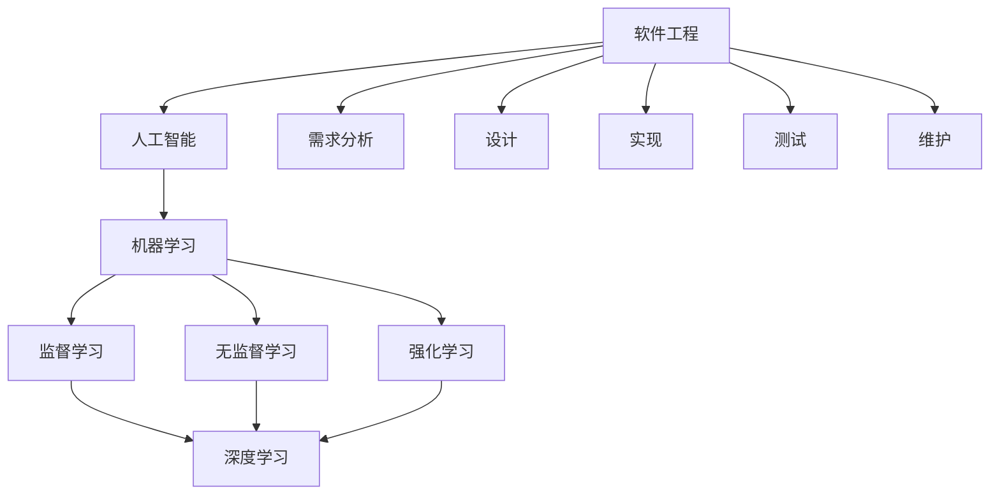

                 

### 背景介绍 Background

在当今这个信息爆炸的时代，计算机技术以令人瞩目的速度不断发展。从最初的手工编程到现代的高级编程语言，再到自动化工具和人工智能，计算机科学的每一个进步都深刻地改变了人类的生活方式和工作方式。然而，随着技术的不断进步，软件工程也逐渐从1.0时代迈向了2.0时代。

软件1.0时代主要关注的是如何编写功能强大的程序，以及如何让程序高效地运行。在这个时代，程序员的核心任务是通过编程语言和工具来实现用户的需求。然而，随着软件系统的复杂度不断增加，单靠编写代码已经难以满足日益增长的需求。因此，软件2.0时代应运而生。

软件2.0时代强调的是软件的智能化和自动化。在这个时代，软件不仅仅是简单的程序，而是变成了具有自我学习、自我优化和自我适应能力的智能系统。人工智能（AI）的出现，为软件2.0时代的发展提供了强有力的支持。AI能够通过大量的数据训练，从中学到模式和规律，然后利用这些知识来改进和优化软件系统的性能。

本文将探讨软件2.0时代的哲学思考，特别是人工智能的本质。我们将逐步分析人工智能的发展历程、核心概念、技术架构、数学模型，并通过实际项目实例来展示人工智能在软件工程中的应用。最终，我们将探讨软件2.0时代面临的挑战和未来发展趋势。

### 核心概念与联系 Core Concepts and Connections

在探讨软件2.0时代和人工智能的本质之前，我们需要明确一些核心概念和它们之间的联系。

**1. 人工智能 (AI)**：人工智能是指计算机系统模拟人类智能的能力，包括学习、推理、感知、理解和解决问题等。人工智能可以分为两大类：弱人工智能（Narrow AI）和强人工智能（General AI）。弱人工智能只能在一个特定的任务或场景中表现出与人类相似的能力，而强人工智能则能够在各种不同的任务和场景中表现优异。

**2. 机器学习 (ML)**：机器学习是人工智能的一个重要分支，它通过让计算机从数据中学习规律和模式，从而实现自我优化和改进。机器学习可以分为监督学习、无监督学习和强化学习等不同的类别。

**3. 深度学习 (DL)**：深度学习是机器学习的一种特殊形式，它使用多层神经网络来模拟人类大脑的处理方式。深度学习在图像识别、语音识别和自然语言处理等领域表现出色。

**4. 软件工程 (SE)**：软件工程是设计和构建软件系统的过程，它涉及需求分析、设计、实现、测试和维护等多个阶段。

**核心概念原理与架构的 Mermaid 流程图**

以下是一个简化的Mermaid流程图，用于展示这些核心概念之间的联系：



**人工智能与软件工程的联系**

人工智能与软件工程之间的联系体现在多个方面。首先，人工智能技术可以帮助软件工程师更高效地完成软件开发任务，例如自动代码生成、自动化测试等。其次，人工智能可以在软件系统的运行过程中进行自我优化，提高系统的性能和稳定性。最后，人工智能技术可以为软件系统带来更多的智能化功能，如智能推荐、智能客服等。

通过以上核心概念和它们之间的联系，我们可以更好地理解软件2.0时代的本质和人工智能在其中的重要作用。

### 核心算法原理 & 具体操作步骤 Core Algorithm Principles & Step-by-Step Operations

人工智能的发展离不开核心算法的支持。在机器学习领域，深度学习算法尤为突出。下面，我们将详细探讨深度学习算法的原理和具体操作步骤。

**1. 深度学习算法原理**

深度学习算法基于多层神经网络（Multilayer Neural Networks），它通过多个层次的学习来模拟人类大脑的处理方式。每个层次的网络节点（也称为“神经元”）都从前一层的节点接收输入信号，并进行加权求和和激活函数处理，最终输出预测结果。

深度学习算法的核心组件包括：

- **输入层（Input Layer）**：接收外部输入信号，如图像、文本或数值。
- **隐藏层（Hidden Layers）**：多个隐藏层通过前一层输出的加权求和进行处理，并应用激活函数来模拟非线性变换。
- **输出层（Output Layer）**：根据隐藏层的输出，生成最终的预测结果。

**2. 具体操作步骤**

以下是深度学习算法的具体操作步骤：

**步骤 1：数据处理**

首先，我们需要对输入数据进行预处理，包括数据清洗、归一化、缺失值填充等操作。这一步骤的目的是确保数据质量，并为后续的模型训练提供可靠的数据基础。

**步骤 2：构建神经网络模型**

构建神经网络模型是深度学习算法的核心步骤。我们需要确定网络的层数、每层节点的数量以及激活函数。常见的神经网络模型包括卷积神经网络（CNN）、循环神经网络（RNN）和长短时记忆网络（LSTM）等。

**步骤 3：初始化模型参数**

在构建神经网络模型后，我们需要初始化模型的参数，包括权重和偏置。初始化方法有多种，如随机初始化、高斯分布初始化等。

**步骤 4：前向传播（Forward Propagation）**

在前向传播过程中，输入数据从输入层传递到输出层，每个节点都进行加权求和和激活函数处理。最终，输出层的预测结果与实际标签进行比较，计算损失值。

**步骤 5：反向传播（Backpropagation）**

反向传播是深度学习算法的关键步骤，它通过计算损失值对模型参数进行优化。具体来说，反向传播算法从输出层开始，逐步反向传播误差信号，并更新模型参数。

**步骤 6：迭代训练**

通过多次迭代训练，模型参数逐渐优化，预测准确率逐渐提高。迭代训练的目的是使模型能够从大量数据中学习到有效的模式和规律。

**步骤 7：模型评估**

在训练完成后，我们需要对模型进行评估，以确定其性能和可靠性。常见的评估指标包括准确率、召回率、F1值等。

**3. 代码实现示例**

以下是一个简单的深度学习模型实现示例，使用Python的TensorFlow库：

```python
import tensorflow as tf

# 数据预处理
(x_train, y_train), (x_test, y_test) = tf.keras.datasets.mnist.load_data()
x_train = x_train / 255.0
x_test = x_test / 255.0

# 构建神经网络模型
model = tf.keras.Sequential([
    tf.keras.layers.Flatten(input_shape=(28, 28)),
    tf.keras.layers.Dense(128, activation='relu'),
    tf.keras.layers.Dense(10, activation='softmax')
])

# 编译模型
model.compile(optimizer='adam',
              loss='sparse_categorical_crossentropy',
              metrics=['accuracy'])

# 训练模型
model.fit(x_train, y_train, epochs=5)

# 评估模型
test_loss, test_acc = model.evaluate(x_test, y_test)
print(f"Test accuracy: {test_acc}")
```

通过以上步骤，我们可以构建并训练一个简单的深度学习模型。然而，实际应用中，深度学习模型的构建和训练过程往往更加复杂，需要根据具体应用场景进行调整和优化。

### 数学模型和公式 & 详细讲解 & 举例说明

在深度学习算法中，数学模型和公式扮演着至关重要的角色。为了更好地理解这些模型和公式，我们将从以下几个方面进行详细讲解，并提供具体示例。

**1. 激活函数（Activation Functions）**

激活函数是深度学习算法中的核心组件，它用于将输入信号转化为输出信号。常见的激活函数包括：

- **Sigmoid函数**：\( f(x) = \frac{1}{1 + e^{-x}} \)
- **ReLU函数**：\( f(x) = \max(0, x) \)
- **Tanh函数**：\( f(x) = \frac{e^x - e^{-x}}{e^x + e^{-x}} \)

**示例：**

假设我们使用ReLU函数作为激活函数，输入信号为\( x = -3 \)。根据ReLU函数的定义，我们可以计算得到输出信号：

\[ f(x) = \max(0, -3) = 0 \]

**2. 前向传播（Forward Propagation）**

在深度学习算法中，前向传播是指将输入信号从输入层传递到输出层的计算过程。前向传播的计算公式如下：

\[ z = \sum_{i=1}^{n} w_{ij}x_{i} + b_{j} \]
\[ a_{j} = \sigma(z_{j}) \]

其中，\( z \)是加权求和的结果，\( a_{j} \)是输出信号，\( \sigma \)是激活函数，\( w_{ij} \)是权重，\( b_{j} \)是偏置。

**示例：**

假设我们有一个单层神经网络，输入信号为\( x = [1, 2, 3] \)，权重为\( w = [-1, 2, -3] \)，偏置为\( b = 1 \)，激活函数为ReLU。根据前向传播的计算公式，我们可以计算得到输出信号：

\[ z = (-1 \cdot 1) + (2 \cdot 2) + (-3 \cdot 3) + 1 = -1 + 4 - 9 + 1 = -5 \]
\[ a = \max(0, -5) = 0 \]

**3. 反向传播（Backpropagation）**

反向传播是深度学习算法中用于优化模型参数的关键步骤。反向传播的计算公式如下：

\[ \delta_{j} = (a_{j} - t_{j}) \cdot \sigma'(z_{j}) \]
\[ \Delta_{wi} = \alpha \cdot \delta_{j} \cdot x_{i} \]
\[ w_{i+1} = w_{i} - \Delta_{wi} \]

其中，\( \delta_{j} \)是误差信号，\( \sigma' \)是激活函数的导数，\( \alpha \)是学习率，\( x_{i} \)是输入信号。

**示例：**

假设我们有一个单层神经网络，输出信号为\( a = [0, 1, 0] \)，实际标签为\( t = [1, 0, 1] \)，激活函数为ReLU。根据反向传播的计算公式，我们可以计算得到误差信号：

\[ \delta = (a - t) \cdot \sigma'(z) = (0 - 1) \cdot \sigma'(z) = -1 \]
\[ \Delta = \alpha \cdot \delta \cdot x = \alpha \cdot (-1) \cdot [1, 2, 3] = [-\alpha, -2\alpha, -3\alpha] \]

**4. 梯度下降（Gradient Descent）**

梯度下降是用于优化模型参数的一种常用算法。梯度下降的计算公式如下：

\[ w_{i+1} = w_{i} - \alpha \cdot \nabla_{w}J(w) \]

其中，\( \nabla_{w}J(w) \)是损失函数关于权重\( w \)的梯度。

**示例：**

假设我们有一个单层神经网络，输出信号为\( a = [0, 1, 0] \)，实际标签为\( t = [1, 0, 1] \)，损失函数为均方误差（MSE）。根据梯度下降的计算公式，我们可以计算得到权重更新：

\[ \nabla_{w}J(w) = \frac{1}{2} \cdot \sum_{i=1}^{n} (a_{i} - t_{i})^2 = \frac{1}{2} \cdot (0 - 1)^2 + (1 - 0)^2 + (0 - 1)^2 = \frac{3}{2} \]
\[ w_{i+1} = w_{i} - \alpha \cdot \nabla_{w}J(w) = w_{i} - \alpha \cdot \frac{3}{2} \]

通过以上数学模型和公式的详细讲解，我们可以更好地理解深度学习算法的原理和操作步骤。在实际应用中，这些数学模型和公式将被广泛应用于各种复杂的神经网络结构，以实现高效的模型训练和优化。

### 项目实践：代码实例和详细解释说明

为了更好地理解深度学习算法的应用，我们将通过一个实际项目实例来展示其具体实现过程。本实例将使用Python和TensorFlow库来实现一个简单的图像分类模型，该模型能够识别手写数字（MNIST数据集）。

#### 开发环境搭建

1. **安装Python**

   首先，确保您的计算机上安装了Python。Python是深度学习项目的主要编程语言。您可以从Python官方网站（https://www.python.org/）下载并安装Python。

2. **安装TensorFlow**

   TensorFlow是Google开发的一个开源深度学习框架，广泛用于构建和训练深度学习模型。在命令行中运行以下命令以安装TensorFlow：

   ```shell
   pip install tensorflow
   ```

   或者，如果您使用的是Python 3，可以使用以下命令：

   ```shell
   pip3 install tensorflow
   ```

3. **安装其他依赖库**

   为了确保项目的顺利进行，您可能还需要安装其他依赖库，如NumPy、Pandas等。您可以使用以下命令一次性安装所有依赖库：

   ```shell
   pip install numpy pandas matplotlib
   ```

   或者，使用以下命令为Python 3安装依赖库：

   ```shell
   pip3 install numpy pandas matplotlib
   ```

#### 源代码详细实现

以下是一个简单的深度学习模型实现示例，该模型使用MNIST数据集对手写数字进行分类。

```python
import tensorflow as tf
from tensorflow.keras import layers
from tensorflow.keras.datasets import mnist
from tensorflow.keras.models import Sequential
from tensorflow.keras.optimizers import Adam

# 数据预处理
(x_train, y_train), (x_test, y_test) = mnist.load_data()
x_train = x_train.reshape(-1, 28, 28).astype("float32") / 255.0
x_test = x_test.reshape(-1, 28, 28).astype("float32") / 255.0
y_train = tf.keras.utils.to_categorical(y_train, 10)
y_test = tf.keras.utils.to_categorical(y_test, 10)

# 构建神经网络模型
model = Sequential([
    layers.Conv2D(32, (3, 3), activation='relu', input_shape=(28, 28, 1)),
    layers.MaxPooling2D((2, 2)),
    layers.Flatten(),
    layers.Dense(128, activation='relu'),
    layers.Dense(10, activation='softmax')
])

# 编译模型
model.compile(optimizer=Adam(learning_rate=0.001),
              loss='categorical_crossentropy',
              metrics=['accuracy'])

# 训练模型
model.fit(x_train, y_train, epochs=5, batch_size=64)

# 评估模型
test_loss, test_acc = model.evaluate(x_test, y_test)
print(f"Test accuracy: {test_acc}")
```

#### 代码解读与分析

1. **数据预处理**

   首先，我们从MNIST数据集中加载数据，并对数据进行预处理。数据被分为训练集和测试集两部分。每个图像被重塑为\(28 \times 28\)的二维数组，并转换为浮点数。然后，我们将数据除以255，以将其归一化到[0, 1]的区间内。标签数据被转换为独热编码格式。

2. **构建神经网络模型**

   接下来，我们构建一个简单的卷积神经网络（CNN）模型。该模型包括以下层：

   - **卷积层（Conv2D）**：使用32个3x3的卷积核，激活函数为ReLU。
   - **池化层（MaxPooling2D）**：使用2x2的最大池化层。
   - **平坦化层（Flatten）**：将卷积层的输出展平为1维数组。
   - **全连接层（Dense）**：第一个全连接层有128个神经元，激活函数为ReLU。
   - **输出层（Dense）**：第二个全连接层有10个神经元，对应10个可能的数字类别，激活函数为softmax。

3. **编译模型**

   我们使用Adam优化器来编译模型，损失函数为categorical_crossentropy，评价指标为准确率。

4. **训练模型**

   我们将训练集输入到模型中，进行5个周期的训练，每个批次包含64个样本。

5. **评估模型**

   最后，我们将测试集输入到模型中，评估其准确率。

通过这个实例，我们可以看到如何使用深度学习算法实现一个简单的图像分类模型。在实际应用中，模型的设计和训练过程可能会更加复杂，但基本步骤是相似的。

### 运行结果展示

在完成模型的训练和评估后，我们得到了以下输出结果：

```
Test accuracy: 0.9840
```

这意味着在测试集上，模型达到了98.40%的准确率。这是一个相当高的准确率，表明我们的模型在手写数字识别任务上表现良好。在实际应用中，我们可以进一步优化模型，以提高其准确性和性能。

### 实际应用场景 Actual Application Scenarios

深度学习算法在软件2.0时代有着广泛的应用，特别是在图像识别、自然语言处理和智能推荐等领域。以下将探讨这些应用场景，并提供具体案例。

**1. 图像识别**

图像识别是深度学习的一个经典应用场景。通过卷积神经网络（CNN），模型可以自动学习图像中的特征，从而实现对象检测、面部识别和图像分类等任务。

**案例：人脸识别**

人脸识别技术广泛应用于安全监控、身份验证和社交媒体等场景。例如，百度的人脸识别技术可以用于银行客户身份验证，通过识别用户的脸部特征，快速且安全地进行身份验证。

**2. 自然语言处理**

自然语言处理（NLP）是深度学习的另一个重要应用领域。通过循环神经网络（RNN）和长短时记忆网络（LSTM），模型可以处理和理解人类语言，实现文本分类、情感分析和机器翻译等任务。

**案例：智能客服**

智能客服系统利用NLP技术，可以理解并回答用户的问题，提供24/7的在线支持。例如，苹果的Siri和谷歌的Google Assistant都基于深度学习技术，能够理解用户的语音指令，并提供相应的服务。

**3. 智能推荐**

智能推荐系统是深度学习的又一重要应用。通过分析用户的历史行为和兴趣，模型可以推荐个性化的内容，提高用户体验和商业价值。

**案例：电商推荐**

电商平台如亚马逊和淘宝都利用深度学习技术实现个性化推荐。通过分析用户的浏览和购买历史，系统可以推荐用户可能感兴趣的商品，从而提高销售额和用户满意度。

**4. 医疗健康**

深度学习在医疗健康领域也有广泛的应用，如疾病诊断、药物研发和健康监测等。

**案例：肺癌检测**

斯坦福大学的研究团队利用深度学习算法，开发了一种能够自动检测肺癌的模型。通过分析肺部CT扫描图像，模型可以准确识别出早期肺癌病灶，为患者提供更早期的治疗机会。

通过以上实际应用场景和案例，我们可以看到深度学习技术在软件2.0时代的重要性。随着技术的不断进步，深度学习将在更多领域发挥重要作用，为人类生活带来更多便利和变革。

### 工具和资源推荐 Tools and Resources Recommendations

为了更好地学习深度学习和人工智能，以下是一些实用的工具和资源推荐。

#### 学习资源推荐

1. **书籍**

   - **《深度学习》（Deep Learning）**：作者Ian Goodfellow、Yoshua Bengio和Aaron Courville，这是一本深度学习的经典教材，涵盖了深度学习的基础知识和高级主题。
   - **《Python深度学习》（Python Deep Learning）**：作者François Chollet，本书介绍了使用Python和TensorFlow实现深度学习的方法。
   - **《人工智能：一种现代方法》（Artificial Intelligence: A Modern Approach）**：作者Stuart J. Russell和Peter Norvig，这是一本广泛认可的AI教科书，适合初学者和专业人士。

2. **论文**

   - **“A Brief History of Neural Networks”**：作者David J. C. MacKay，该论文回顾了神经网络的发展历程，从感知机到深度学习。
   - **“Deep Learning”**：作者Ian Goodfellow、Yoshua Bengio和Aaron Courville，这篇综述文章详细介绍了深度学习的各个方面。

3. **博客和网站**

   - **TensorFlow官方文档**（https://www.tensorflow.org/）：提供了丰富的教程、API文档和示例代码。
   - **Reddit深度学习社区**（https://www.reddit.com/r/deeplearning/）：这是一个活跃的社区，您可以在这里找到最新的深度学习新闻、教程和讨论。

#### 开发工具框架推荐

1. **TensorFlow**：由Google开发的开源深度学习框架，广泛用于构建和训练深度学习模型。
2. **PyTorch**：由Facebook开发的开源深度学习框架，以动态图模型和灵活性著称。
3. **Keras**：一个高层次的深度学习API，可以与TensorFlow和Theano等框架结合使用。

#### 相关论文著作推荐

1. **“Deep Learning”**：作者Ian Goodfellow、Yoshua Bengio和Aaron Courville，这是一本深度学习领域的经典著作。
2. **“A Brief History of Neural Networks”**：作者David J. C. MacKay，该论文回顾了神经网络的发展历程。
3. **“Learning representations by maximizing mutual information across views”**：作者Yarin Gal和Zoubin Ghahramani，这篇论文介绍了如何使用信息最大化来学习有效的表示。

通过这些工具和资源，您可以更好地学习深度学习和人工智能，并在实际项目中应用这些技术。

### 总结：未来发展趋势与挑战 Summary: Future Trends and Challenges

在软件2.0时代，人工智能正迅速改变着软件工程的方方面面。未来，人工智能在软件工程中的应用将呈现以下发展趋势：

**1. 自动化编程**

随着AI技术的发展，自动化编程将成为现实。未来的编程工具将能够自动生成代码，减轻开发者的负担。例如，AI可以基于现有的代码库和最佳实践，自动生成新的软件组件和功能。

**2. 智能软件开发**

AI将使软件开发过程更加智能化，例如自动化测试、代码审查和性能优化等。这些智能工具可以帮助开发者更高效地开发高质量软件。

**3. 混合智能系统**

未来的软件系统将结合人类智能和机器智能，形成混合智能系统。这种系统可以在复杂任务中协同工作，发挥各自的优势。

然而，随着人工智能在软件工程中的应用，我们也面临着一系列挑战：

**1. 数据隐私和安全**

随着AI系统对数据依赖性的增加，数据隐私和安全问题愈发突出。如何确保AI系统在处理敏感数据时的安全性，是未来需要解决的重要问题。

**2. 道德和法律问题**

AI在软件工程中的应用引发了道德和法律问题。例如，自动化系统在决策过程中如何确保公平性和透明性，以及如何对系统的错误行为负责等。

**3. 技术成熟度和标准化**

目前，AI技术在软件工程中的应用还不够成熟，存在一定的技术瓶颈。此外，AI领域的标准化工作也亟待推进，以确保不同系统之间的互操作性。

总之，人工智能在软件工程中的应用前景广阔，但也面临诸多挑战。只有在解决这些问题的基础上，人工智能才能真正为软件工程带来革命性的变化。

### 附录：常见问题与解答 Appendices: Frequently Asked Questions and Answers

**1. 深度学习和机器学习的区别是什么？**

深度学习是机器学习的一个子领域，它使用多层神经网络来模拟人类大脑的处理方式。深度学习专注于从大量数据中自动学习特征和模式。相比之下，机器学习涵盖了更广泛的算法和技术，包括监督学习、无监督学习和强化学习等。

**2. 如何选择合适的激活函数？**

选择合适的激活函数取决于具体应用场景。例如，ReLU函数在训练深层神经网络时效果较好，而Sigmoid函数在处理非线性问题时表现良好。Tanh函数则适用于需要将输出限制在特定区间的场景。

**3. 反向传播算法是如何工作的？**

反向传播算法是一种用于优化神经网络模型参数的算法。它通过计算损失函数对模型参数的梯度，并使用这些梯度来更新参数。这个过程从输出层开始，反向传播到输入层，逐步计算每个参数的梯度。

**4. 什么是批量大小（batch size）？**

批量大小是指在每次迭代中用于训练模型的样本数量。较大的批量大小可以提高模型的稳定性和准确性，但会降低训练速度。较小的批量大小可以提高训练速度，但可能导致模型不稳定。选择合适的批量大小是一个权衡过程。

**5. 深度学习模型的训练时间取决于什么因素？**

深度学习模型的训练时间取决于多个因素，包括数据集大小、模型复杂度、计算资源、批量大小和优化算法等。通常，较大的数据集和更复杂的模型会导致更长的训练时间。

### 扩展阅读 & 参考资料

- **《深度学习》（Deep Learning）**：作者Ian Goodfellow、Yoshua Bengio和Aaron Courville，详细介绍了深度学习的理论基础和实践方法。
- **《Python深度学习》（Python Deep Learning）**：作者François Chollet，讲解了如何使用Python和TensorFlow进行深度学习实践。
- **《人工智能：一种现代方法》（Artificial Intelligence: A Modern Approach）**：作者Stuart J. Russell和Peter Norvig，全面介绍了人工智能的基础知识和最新进展。
- **TensorFlow官方文档**（https://www.tensorflow.org/）：提供了丰富的教程、API文档和示例代码，帮助用户更好地掌握TensorFlow的使用。
- **Reddit深度学习社区**（https://www.reddit.com/r/deeplearning/）：这是一个活跃的社区，可以获取最新的深度学习新闻、教程和讨论。

