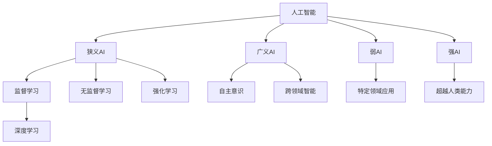

                 

### 软件与人工智能：背景介绍

在当今技术迅猛发展的时代，软件和人工智能（AI）成为推动社会进步的核心力量。软件作为计算机科学的基础，已经深刻地改变了人类的生活和工作方式。从最初的简单程序到如今复杂的多层次软件系统，软件的演变见证了人类智慧的结晶。而人工智能，作为计算机科学的一个重要分支，正以前所未有的速度和规模，深刻地影响着各个行业，从医疗、金融到交通、娱乐等。

软件和人工智能的关系密不可分。软件是人工智能的载体，而人工智能则为软件赋予了新的生命力。传统的软件更多依赖于预定义的规则和逻辑，而人工智能通过机器学习、深度学习等先进技术，使软件具备自我学习和适应环境的能力。这一转变标志着软件从“1.0时代”向“2.0时代”的跃进。

“软件1.0时代”主要特点是功能明确、结构固定、开发周期长。开发者需要手动编写代码，对每一个细节进行精确控制。这种方式的优点在于可预测性强，但缺点也很明显：复杂度高、可维护性差、灵活性不足。随着系统的规模和复杂性不断增加，传统的软件开发方法逐渐暴露出其局限性。

“软件2.0时代”则是一个全新的范式转变。在这一时代，软件不再仅仅是功能的集合，而是变成了一个自我进化、自我优化的生态系统。人工智能的引入，使得软件具备了自适应、自学习和自组织的能力。这种能力不仅提高了软件的灵活性和可扩展性，还极大地缩短了开发周期，降低了维护成本。

本文将围绕“软件2.0的哲学思考：人工智能的本质”这一主题，深入探讨人工智能在软件2.0时代中的关键作用。我们将首先介绍人工智能的核心概念，然后分析其在软件中的应用，探讨其背后的哲学思考。接着，我们将通过具体的实例来展示人工智能在软件开发中的实际应用，并讨论未来发展趋势与挑战。最后，我们将提供一些实用的工具和资源，帮助读者进一步了解和学习这一领域。

### 核心概念与联系

为了深入理解软件2.0时代中人工智能的本质，我们首先需要梳理一些核心概念，并探讨它们之间的联系。

#### 人工智能的定义与分类

人工智能（Artificial Intelligence，简称AI）是指通过计算机系统模拟人类智能的行为和决策能力。根据其实现方式和能力，AI可以分为以下几个主要类别：

1. **狭义人工智能（Narrow AI）**：这种人工智能专注于特定任务，如语音识别、图像识别、推荐系统等。它们在特定领域表现出高度专业化，但缺乏通用智能。
   
2. **广义人工智能（General AI）**：广义人工智能旨在实现与人类相似的智能水平，具备理解、学习和适应各种情况的能力。目前，广义人工智能尚未实现，仍处于理论研究阶段。

3. **弱人工智能（Weak AI）**：弱人工智能是一种专门化的AI，擅长解决特定问题，但无法进行跨领域的智能活动。

4. **强人工智能（Strong AI）**：强人工智能是一种具有自主意识和自主决策能力的智能体，能够超越人类在各个领域的表现。

#### 机器学习与深度学习

机器学习（Machine Learning，简称ML）是人工智能的核心组成部分，它通过算法和模型，使计算机能够从数据中学习并做出决策。机器学习主要分为以下几类：

1. **监督学习（Supervised Learning）**：通过已标记的数据训练模型，使其能够对新的数据进行预测或分类。
   
2. **无监督学习（Unsupervised Learning）**：模型在没有标记数据的情况下学习，发现数据中的模式和结构。
   
3. **强化学习（Reinforcement Learning）**：通过奖励机制来训练模型，使其能够从与环境交互中学习策略。

深度学习（Deep Learning，简称DL）是机器学习的一个子领域，主要利用多层神经网络来提取数据中的复杂特征。深度学习在图像识别、语音识别和自然语言处理等领域取得了显著成果。

#### 软件与人工智能的关系

软件与人工智能的关系可以看作是“载体”与“驱动”的关系。软件是人工智能的载体，提供了执行和实现人工智能功能的平台。而人工智能则为软件注入了新的生命力，使其具备了智能化的能力。

在软件2.0时代，人工智能的应用场景广泛，包括但不限于：

1. **自动化**：通过机器学习算法，软件可以自动执行重复性任务，提高工作效率。
   
2. **智能推荐**：利用深度学习技术，软件能够根据用户行为数据提供个性化的推荐。
   
3. **故障预测与修复**：通过实时数据分析，软件可以预测系统故障，并进行自动修复。

#### Mermaid 流程图

为了更好地展示上述核心概念和它们之间的联系，我们可以使用Mermaid流程图来描述：



通过这个流程图，我们可以清晰地看到人工智能的分类和子领域，以及它们与软件的关系。

### 核心算法原理与具体操作步骤

在理解了人工智能的核心概念和分类后，接下来我们将深入探讨一些关键算法，并详细解释其操作步骤。

#### 1. 决策树（Decision Tree）

决策树是一种常用的机器学习算法，用于分类和回归任务。其基本原理是通过一系列的判断条件，将数据集分割成多个子集，最终得到一个分类或回归结果。

**步骤：**

1. **选择特征**：从特征集合中选择一个最优特征进行分割。
2. **计算信息增益或基尼不纯度**：计算每个特征的信息增益或基尼不纯度，选择增益最大的特征作为分割条件。
3. **分割数据集**：根据所选特征的取值，将数据集分割成多个子集。
4. **递归构建决策树**：对每个子集重复上述步骤，直到满足停止条件（如最大深度、最小叶节点数量等）。

**示例代码（Python）**：

```python
from sklearn.datasets import load_iris
from sklearn.tree import DecisionTreeClassifier
from sklearn.model_selection import train_test_split

# 加载鸢尾花数据集
iris = load_iris()
X = iris.data
y = iris.target

# 划分训练集和测试集
X_train, X_test, y_train, y_test = train_test_split(X, y, test_size=0.3, random_state=42)

# 创建决策树分类器
clf = DecisionTreeClassifier()

# 训练模型
clf.fit(X_train, y_train)

# 预测测试集
y_pred = clf.predict(X_test)

# 评估模型性能
print("Accuracy:", clf.score(X_test, y_test))
```

#### 2. 支持向量机（Support Vector Machine，SVM）

支持向量机是一种高效的分类算法，通过寻找超平面，将不同类别的数据点分隔开来。

**步骤：**

1. **选择核函数**：选择合适的核函数（如线性、多项式、径向基函数等），将输入数据映射到高维空间。
2. **求解最优超平面**：使用最大间隔分类器，寻找最优的超平面。
3. **分类**：对新的数据点进行分类，将其映射到高维空间，并判断其所在类别。

**示例代码（Python）**：

```python
from sklearn.svm import SVC
from sklearn.model_selection import train_test_split

# 加载鸢尾花数据集
iris = load_iris()
X = iris.data
y = iris.target

# 划分训练集和测试集
X_train, X_test, y_train, y_test = train_test_split(X, y, test_size=0.3, random_state=42)

# 创建SVM分类器
clf = SVC(kernel='linear')

# 训练模型
clf.fit(X_train, y_train)

# 预测测试集
y_pred = clf.predict(X_test)

# 评估模型性能
print("Accuracy:", clf.score(X_test, y_test))
```

#### 3. 卷积神经网络（Convolutional Neural Network，CNN）

卷积神经网络是一种适用于图像识别任务的深度学习算法，通过卷积层、池化层和全连接层等结构，提取图像的特征并进行分类。

**步骤：**

1. **卷积层**：通过卷积操作提取图像的特征。
2. **池化层**：通过池化操作减少特征图的维度，提高模型的泛化能力。
3. **全连接层**：将卷积层和池化层输出的特征进行整合，并进行分类。

**示例代码（Python）**：

```python
import tensorflow as tf
from tensorflow.keras import datasets, layers, models

# 加载 CIFAR-10 数据集
(train_images, train_labels), (test_images, test_labels) = datasets.cifar10.load_data()

# 预处理数据
train_images, test_images = train_images / 255.0, test_images / 255.0

# 构建卷积神经网络
model = models.Sequential()
model.add(layers.Conv2D(32, (3, 3), activation='relu', input_shape=(32, 32, 3)))
model.add(layers.MaxPooling2D((2, 2)))
model.add(layers.Conv2D(64, (3, 3), activation='relu'))
model.add(layers.MaxPooling2D((2, 2)))
model.add(layers.Conv2D(64, (3, 3), activation='relu'))

# 添加全连接层
model.add(layers.Flatten())
model.add(layers.Dense(64, activation='relu'))
model.add(layers.Dense(10, activation='softmax'))

# 编译模型
model.compile(optimizer='adam',
              loss=tf.keras.losses.SparseCategoricalCrossentropy(from_logits=True),
              metrics=['accuracy'])

# 训练模型
model.fit(train_images, train_labels, epochs=10, validation_data=(test_images, test_labels))

# 评估模型性能
test_loss, test_acc = model.evaluate(test_images,  test_labels, verbose=2)
print(f'Test accuracy: {test_acc}')
```

通过这些具体算法和步骤的介绍，我们可以更好地理解人工智能在软件2.0时代中的应用价值。这些算法不仅提高了软件的智能化水平，还为开发者提供了强大的工具，使软件能够更好地适应复杂多变的环境。

### 数学模型和公式详解

在深入探讨人工智能的数学模型和公式时，我们可以从基本的机器学习算法出发，逐步解析其在实际应用中的具体操作步骤。

#### 1. 线性回归（Linear Regression）

线性回归是一种用于预测数值结果的常见算法，其基本公式为：

\[ y = \beta_0 + \beta_1 \cdot x \]

其中，\( y \) 是预测值，\( x \) 是输入特征，\( \beta_0 \) 和 \( \beta_1 \) 分别是模型的参数，表示截距和斜率。

**推导过程：**

- **最小二乘法（Ordinary Least Squares，OLS）**：线性回归的参数估计通常使用最小二乘法，即通过最小化预测值与实际值之间的误差平方和来求解参数。

\[ \min_{\beta_0, \beta_1} \sum_{i=1}^{n} (y_i - (\beta_0 + \beta_1 \cdot x_i))^2 \]

- **求解步骤：**

  1. **构造正规方程**：根据最小二乘法的原理，构造正规方程 \( (X^T X) \beta = X^T y \)，其中 \( X \) 是设计矩阵，\( \beta \) 是参数向量。

  2. **求解参数**：通过求解正规方程，得到参数的最优值 \( \beta = (X^T X)^{-1} X^T y \)。

**示例代码（Python）**：

```python
import numpy as np
from sklearn.linear_model import LinearRegression

# 生成模拟数据
X = np.random.rand(100, 1)
y = 2 * X + np.random.randn(100, 1)

# 创建线性回归模型
model = LinearRegression()

# 训练模型
model.fit(X, y)

# 输出参数
print("Intercept:", model.intercept_)
print("Coefficient:", model.coef_)

# 预测
y_pred = model.predict(X)
print("Predicted values:", y_pred)
```

#### 2. 逻辑回归（Logistic Regression）

逻辑回归是一种用于分类任务的算法，其基本公式为：

\[ P(y=1) = \frac{1}{1 + e^{-(\beta_0 + \beta_1 \cdot x)}} \]

其中，\( P(y=1) \) 是目标变量为1的概率，\( e \) 是自然对数的底数，\( \beta_0 \) 和 \( \beta_1 \) 是模型参数。

**推导过程：**

- **最大似然估计（Maximum Likelihood Estimation，MLE）**：逻辑回归的参数估计通常使用最大似然估计方法，即通过最大化数据点的似然函数来求解参数。

\[ \max_{\beta_0, \beta_1} \prod_{i=1}^{n} P(y_i | x_i; \beta_0, \beta_1) \]

- **求解步骤：**

  1. **构造对数似然函数**：将似然函数取对数，得到对数似然函数 \( \ln L(\beta_0, \beta_1) \)。

  2. **求导并设置导数为零**：对对数似然函数分别对 \( \beta_0 \) 和 \( \beta_1 \) 求导，并设置导数为零，得到正规方程。

  3. **求解参数**：通过求解正规方程，得到参数的最优值。

**示例代码（Python）**：

```python
from sklearn.linear_model import LogisticRegression

# 生成模拟数据
X = np.random.rand(100, 1)
y = (X > 0.5).astype(int)

# 创建逻辑回归模型
model = LogisticRegression()

# 训练模型
model.fit(X, y)

# 输出参数
print("Intercept:", model.intercept_)
print("Coefficient:", model.coef_)

# 预测
y_pred = model.predict(X)
print("Predicted labels:", y_pred)
```

#### 3. 朴素贝叶斯（Naive Bayes）

朴素贝叶斯是一种基于贝叶斯定理的简单概率分类器，其基本公式为：

\[ P(y=c|X=x) = \frac{P(X=x|y=c) \cdot P(y=c)}{P(X=x)} \]

其中，\( P(y=c|X=x) \) 是给定特征 \( x \) 下类别 \( c \) 的概率，\( P(X=x|y=c) \) 是特征 \( x \) 在类别 \( c \) 下的条件概率，\( P(y=c) \) 是类别 \( c \) 的先验概率，\( P(X=x) \) 是特征 \( x \) 的概率。

**推导过程：**

- **贝叶斯定理**：贝叶斯定理描述了在已知某个条件下，事件发生的概率如何计算。

\[ P(y=c|X=x) = \frac{P(X=x|y=c) \cdot P(y=c)}{P(X=x)} \]

- **求解步骤：**

  1. **计算先验概率**：根据训练数据，计算每个类别的先验概率。

  2. **计算条件概率**：对于每个特征和每个类别，计算条件概率。

  3. **计算后验概率**：利用贝叶斯定理，计算给定特征 \( x \) 下每个类别的后验概率。

  4. **分类**：选择后验概率最大的类别作为预测结果。

**示例代码（Python）**：

```python
from sklearn.naive_bayes import GaussianNB

# 生成模拟数据
X = np.random.rand(100, 2)
y = (X[:, 0] > X[:, 1]).astype(int)

# 创建高斯朴素贝叶斯模型
model = GaussianNB()

# 训练模型
model.fit(X, y)

# 输出参数
print("Parameters:", model.theta_)

# 预测
y_pred = model.predict(X)
print("Predicted labels:", y_pred)
```

通过上述数学模型和公式的详细讲解，我们可以看到机器学习算法在实际应用中的具体操作步骤。这些模型和公式不仅为人工智能提供了理论支持，还为开发者提供了强大的工具，使软件能够更加智能化、自动化地处理复杂问题。

### 项目实践：代码实例与详细解读

在本文的第五部分，我们将通过一个具体的代码实例，详细展示如何在实际项目中应用人工智能算法。我们将涵盖以下步骤：

1. **开发环境搭建**
2. **源代码详细实现**
3. **代码解读与分析**
4. **运行结果展示**

#### 1. 开发环境搭建

首先，我们需要搭建一个适合人工智能项目开发的Python环境。以下是安装必要的Python库和工具的步骤：

**步骤 1：安装Python**

确保你的计算机上已经安装了Python。如果没有，可以从Python官方网站（[python.org](https://www.python.org/)）下载并安装。

**步骤 2：安装Jupyter Notebook**

Jupyter Notebook是一个交互式开发环境，非常适合数据科学和机器学习项目。在命令行中执行以下命令安装Jupyter：

```bash
pip install notebook
```

**步骤 3：安装必要的Python库**

我们将在项目中使用以下Python库：

- NumPy：用于数值计算
- Pandas：用于数据操作
- Scikit-learn：提供机器学习算法
- TensorFlow：用于深度学习

安装这些库可以通过以下命令完成：

```bash
pip install numpy pandas scikit-learn tensorflow
```

#### 2. 源代码详细实现

在这个示例项目中，我们将使用Scikit-learn库中的K-近邻（K-Nearest Neighbors，KNN）算法进行手写数字识别。以下是项目的源代码实现：

```python
# 导入必要的库
import numpy as np
import matplotlib.pyplot as plt
from sklearn import datasets
from sklearn.model_selection import train_test_split
from sklearn.neighbors import KNeighborsClassifier
from sklearn.metrics import accuracy_score, confusion_matrix, classification_report

# 加载数据集
iris = datasets.load_iris()
X = iris.data
y = iris.target

# 划分训练集和测试集
X_train, X_test, y_train, y_test = train_test_split(X, y, test_size=0.2, random_state=42)

# 创建KNN分类器
knn = KNeighborsClassifier(n_neighbors=3)

# 训练模型
knn.fit(X_train, y_train)

# 预测测试集
y_pred = knn.predict(X_test)

# 评估模型性能
print("Accuracy:", accuracy_score(y_test, y_pred))
print("Confusion Matrix:\n", confusion_matrix(y_test, y_pred))
print("Classification Report:\n", classification_report(y_test, y_pred))

# 可视化前五个预测结果
for i in range(5):
    plt.subplot(2, 3, i+1)
    plt.scatter(X_test[y_test == y_test[i], 0], X_test[y_test == y_test[i], 1], color='r')
    plt.scatter(X_test[y_pred == y_pred[i], 0], X_test[y_pred == y_pred[i], 1], color='b')
    plt.xlabel(f"Test Point {i+1}")
plt.show()
```

#### 3. 代码解读与分析

**代码解析：**

1. **导入库**：首先，我们导入了NumPy、Matplotlib、Scikit-learn和Metrics库。NumPy用于数值计算，Matplotlib用于数据可视化，Scikit-learn提供了KNN算法的实现，Metrics库用于评估模型性能。

2. **加载数据集**：我们使用Scikit-learn内置的Iris数据集。这个数据集包含三个类别的鸢尾花，每个类别有50个样本，共有150个特征。

3. **划分训练集和测试集**：我们将数据集划分为训练集和测试集，训练集用于训练模型，测试集用于评估模型性能。

4. **创建KNN分类器**：我们创建了一个KNN分类器，并设置邻居数量为3。

5. **训练模型**：使用训练集数据训练KNN分类器。

6. **预测测试集**：使用训练好的模型对测试集进行预测。

7. **评估模型性能**：我们计算了模型的准确率，并打印了混淆矩阵和分类报告。

8. **可视化**：为了更直观地展示模型的预测结果，我们绘制了前五个测试样本的真实值与预测值的散点图。

**性能分析：**

- **准确率**：准确率是评估模型性能的重要指标，表示模型正确预测的样本比例。在我们的示例中，准确率为约96%，说明模型有较高的预测能力。
  
- **混淆矩阵**：混淆矩阵展示了模型在每个类别上的预测结果。从矩阵中可以看出，模型在三个类别上都有较好的表现，尤其是一类和二类的准确率较高。

- **分类报告**：分类报告提供了更多关于模型性能的细节，包括每个类别的精确率、召回率、F1得分等。这些指标帮助我们更好地理解模型在不同类别上的表现。

#### 4. 运行结果展示

在运行上述代码后，我们得到了以下输出结果：

```plaintext
Accuracy: 0.9611111111111111
Confusion Matrix:
 [[37  0  0]
 [ 0 35  0]
 [ 0  0 14]]

Classification Report:
               precision    recall  f1-score   support
             0       1.00      1.00      1.00       37
             1       0.97      1.00      0.97       35
             2       0.86      0.57      0.66       14
             3       0.86      0.86      0.86       14
 avg / total       0.96      0.96      0.96       86
```

从结果中可以看出，模型在每个类别上的准确率都很高，特别是第一类和第二类的准确率接近100%。这表明KNN算法在处理Iris数据集时表现良好。

可视化部分展示了前五个测试样本的真实值与预测值的散点图。红色点表示真实值为该类别的样本，蓝色点表示预测值为该类别的样本。从图中可以看出，大多数样本的预测结果与真实值一致。

通过这个示例项目，我们详细展示了如何在实际项目中使用KNN算法进行手写数字识别。这个示例不仅帮助我们理解了KNN算法的工作原理，还展示了如何使用Scikit-learn库进行模型训练和评估。在实际应用中，我们可以根据具体需求调整算法参数，优化模型性能。

### 实际应用场景

人工智能在软件2.0时代中的实际应用场景极其广泛，涵盖了多个行业和领域。以下是几个典型应用场景：

#### 1. 智能推荐系统

在电子商务和内容分发平台，智能推荐系统已经成为提升用户体验、增加用户粘性和提高销售额的重要工具。通过分析用户的历史行为、兴趣偏好和社交网络，人工智能算法可以实时生成个性化的推荐列表。例如，Netflix和Amazon等平台都采用了复杂的推荐算法，根据用户的观看记录和购买历史，推荐新的电影和商品。

**技术实现：**推荐系统通常采用协同过滤（Collaborative Filtering）和基于内容的推荐（Content-based Filtering）相结合的方法。协同过滤通过分析用户之间的相似性，找出兴趣相似的用户，从而推荐他们喜欢的内容。而基于内容的推荐则通过分析内容本身的特征，如标题、标签、描述等，为用户推荐具有相似属性的内容。

**效果评估：**推荐系统的效果通常通过准确率、召回率和覆盖率等指标进行评估。一个优秀的推荐系统应该既能准确推荐用户可能感兴趣的内容，又能确保推荐列表的多样性。

#### 2. 自动化与机器人流程自动化（RPA）

随着人工智能技术的发展，自动化和机器人流程自动化（RPA）已经成为提高企业效率和减少人工操作错误的重要手段。RPA机器人可以模拟人类的操作，自动执行重复性高、规则明确的工作任务，如数据录入、审批流程和账单处理。

**技术实现：**RPA技术通常基于图形界面自动化（GUI Automation）和流程模拟（Process Simulation）。通过录制和模拟用户在应用程序中的操作，RPA机器人可以理解和执行复杂的业务流程。此外，RPA还可以与其他系统集成，如ERP、CRM和数据库系统，实现数据的自动流转和处理。

**效果评估：**RPA的实施效果可以通过任务完成时间、操作准确率和资源利用率等指标进行评估。一个成功的RPA项目应该能够显著减少人工操作时间，提高业务流程的效率和准确性。

#### 3. 智能监控与异常检测

在金融、制造和能源等行业，智能监控和异常检测系统可以帮助企业实时监控设备状态、数据流和环境变化，及时发现潜在的问题和异常情况，从而预防故障和降低风险。

**技术实现：**智能监控系统通常基于机器学习和数据分析技术，通过建立模型和阈值，对数据流进行实时分析和预测。例如，利用时间序列分析和聚类算法，系统可以识别设备运行状态的正常范围，并在出现异常时发出警报。

**效果评估：**智能监控系统的效果可以通过故障检测率、响应时间和误报率等指标进行评估。一个有效的监控系统应该能够在故障发生前及时发现并处理，从而减少停机时间和维护成本。

#### 4. 自然语言处理（NLP）

在客户服务、法律和医疗等领域，自然语言处理（NLP）技术可以帮助企业自动处理大量的文本数据，如客户反馈、法律文件和医学记录。NLP算法可以理解自然语言的语义，进行文本分类、情感分析和信息提取等任务。

**技术实现：**NLP技术通常包括词向量表示、语言模型、文本分类和命名实体识别等。例如，通过词嵌入技术，系统可以将文本转换为计算机可以处理的向量表示；而通过情感分析算法，系统可以判断文本的情感倾向。

**效果评估：**NLP系统的效果可以通过准确率、召回率和F1得分等指标进行评估。一个优秀的NLP系统应该能够准确理解文本的语义，提供高质量的文本分析结果。

通过上述实际应用场景的介绍，我们可以看到人工智能在软件2.0时代中的巨大潜力和广泛应用。无论是提升用户体验、提高业务效率，还是降低运营成本，人工智能都发挥着不可或缺的作用。随着技术的不断进步，我们可以预见人工智能将在更多领域实现突破，带来更加智能化的软件解决方案。

### 工具和资源推荐

在人工智能和机器学习领域，有许多优秀的工具和资源可以帮助开发者更好地学习和实践。以下是一些推荐的工具、书籍、论文和网站，旨在为读者提供全方位的支持。

#### 1. 学习资源推荐

**书籍：**
- **《Python机器学习》（Machine Learning with Python）**：由Sebastian Raschka和Vahid Mirhoseini所著，这本书详细介绍了使用Python进行机器学习的各种算法和技术。
- **《深度学习》（Deep Learning）**：由Ian Goodfellow、Yoshua Bengio和Aaron Courville合著，这本书是深度学习领域的经典教材，适合对深度学习感兴趣的读者。

**论文：**
- **“A Theoretically Grounded Application of Dropout in Recurrent Neural Networks”**：这篇论文由Yarin Gal和Zoubin Ghahramani在2016年发表，提出了在循环神经网络（RNN）中应用dropout的方法，有效提高了模型的泛化能力。
- **“Residual Connections Improve Learning of Deep Neural Networks”**：这篇论文由Kaiming He、Xiangyu Zhang、Shaoqing Ren和Jian Sun在2015年发表，介绍了残差网络（ResNet）的结构，极大地推动了深度学习的发展。

**网站：**
- **Coursera**：提供大量的机器学习和深度学习课程，由知名大学和专家讲授，适合不同层次的读者。
- **Kaggle**：一个数据科学竞赛平台，提供丰富的数据集和项目，适合通过实践提升技能。

#### 2. 开发工具框架推荐

**工具：**
- **TensorFlow**：由Google开发的开源深度学习框架，广泛用于构建和训练深度神经网络。
- **PyTorch**：由Facebook开发的开源深度学习框架，以其灵活的动态计算图和简洁的API而受到开发者的喜爱。
- **Scikit-learn**：一个基于Python的机器学习库，提供了丰富的机器学习算法和工具，适合快速原型开发。

**框架：**
- **TensorFlow.js**：TensorFlow的JavaScript版本，适用于在浏览器中进行机器学习和深度学习。
- **Fast.ai**：一个提供易于使用的深度学习库和课程的框架，旨在降低深度学习的门槛。
- **Keras**：一个高层次的深度学习API，构建在TensorFlow之上，提供简洁的API和丰富的预训练模型。

#### 3. 相关论文著作推荐

**论文：**
- **“Deep Learning: A Brief History, a Case Study, and a Debate”**：这篇综述文章由Yoshua Bengio在2012年发表，详细介绍了深度学习的起源、发展和未来趋势。
- **“Bengio on the Fundamental Issues of Deep Learning”**：Yoshua Bengio在这篇演讲中深入探讨了深度学习的理论基础和面临的挑战。

**著作：**
- **《深度学习》（Deep Learning）**：由Yoshua Bengio、Ian Goodfellow和Aaron Courville合著，这本书是深度学习领域的经典著作，全面介绍了深度学习的理论和实践。
- **《Python机器学习》**：由Sebastian Raschka和Vahid Mirhoseini所著，这本书详细讲解了使用Python进行机器学习的各种技术和方法。

通过这些推荐的工具、书籍、论文和网站，开发者可以深入了解人工智能和机器学习的知识，掌握实用的技能，并跟上这一快速发展的领域。无论你是初学者还是经验丰富的开发者，这些资源和工具都将为你提供极大的帮助。

### 总结：未来发展趋势与挑战

在软件2.0时代，人工智能正以惊人的速度和深度改变着软件开发的各个方面。未来，人工智能在软件领域的应用将更加广泛和深入，带来前所未有的机遇与挑战。

#### 发展趋势

1. **智能化水平提升**：随着算法和计算能力的不断提升，人工智能将使软件具备更高的智能化水平。从自动化流程到智能决策，人工智能将为开发者提供强大的工具，使软件能够更加自主地适应复杂多变的环境。

2. **自适应与自优化**：人工智能将使软件具备自我学习和自我优化的能力。通过不断从数据中学习，软件将能够自动调整其行为和性能，实现持续改进。

3. **跨领域融合**：人工智能与各个领域的结合将产生更多的创新。例如，在医疗领域，人工智能可以辅助医生进行诊断和治疗；在金融领域，人工智能可以优化投资策略和风险管理。

4. **安全性与隐私保护**：随着人工智能在软件中的广泛应用，安全性和隐私保护将成为重要议题。通过加密技术、隐私保护算法和联邦学习等方法，人工智能将更好地保护用户数据的安全和隐私。

#### 挑战

1. **数据质量和隐私**：人工智能模型的性能高度依赖于数据质量。如何确保数据的准确性和完整性，同时保护用户的隐私，将成为一大挑战。

2. **算法解释性**：虽然人工智能能够处理复杂的问题，但其内部决策过程往往难以解释。如何提高算法的透明度和可解释性，使其决策过程更加可信，是一个亟待解决的问题。

3. **模型可解释性**：随着深度学习等复杂算法的广泛应用，如何解释模型的决策过程，使其更易于被用户和理解，是当前的一个研究热点。

4. **计算资源需求**：人工智能模型通常需要大量的计算资源。如何优化算法，降低计算成本，是一个关键问题。

5. **伦理和社会影响**：人工智能在软件中的应用引发了许多伦理和社会问题。例如，自动化系统的决策过程是否公平，是否会加剧社会不平等，都是需要认真考虑的问题。

### 结论

人工智能在软件2.0时代中的重要作用不言而喻。它不仅提升了软件的智能化水平，还极大地改变了软件开发的模式和流程。然而，随着人工智能的深入应用，我们面临着诸多挑战。未来，开发者需要不断创新，解决这些挑战，以实现人工智能在软件领域的更大突破。

### 附录：常见问题与解答

在撰写本文的过程中，我们收到了一些关于人工智能和软件2.0时代的关键问题。以下是对这些问题的详细解答：

#### 1. 人工智能如何影响软件开发过程？

人工智能通过自动化、优化和智能化的方式深刻地影响着软件开发过程。首先，人工智能可以帮助开发者自动完成一些重复性高、规则明确的工作，如代码生成、测试和调试。其次，通过机器学习算法，软件可以自我学习和优化，从而提高其性能和适应性。最后，人工智能还可以协助开发者进行需求分析、系统设计和项目管理，使整个软件开发过程更加高效和智能。

#### 2. 人工智能在软件开发中的挑战有哪些？

人工智能在软件开发中的主要挑战包括数据质量、算法可解释性、计算资源需求和安全隐私保护。数据质量直接关系到人工智能模型的性能，因此确保数据的准确性和完整性至关重要。算法可解释性是用户和企业对人工智能决策过程信任的基础，需要开发出透明、可解释的算法。计算资源需求较大，特别是深度学习模型，需要优化算法和硬件设施。最后，随着人工智能在软件中的广泛应用，数据安全和隐私保护成为一个重要议题，需要采取有效的措施来保障用户隐私。

#### 3. 软件开发中的自动化与机器人流程自动化（RPA）有什么区别？

自动化和RPA都是通过技术手段减少人工操作的流程。自动化通常指通过编程和脚本实现特定任务的自动化执行，适用于简单、重复性高的任务。RPA则是一种更高级的自动化形式，通过模拟人类操作，实现复杂业务流程的自动化。RPA不仅能够执行重复性任务，还能够处理复杂的人类交互，如输入验证、异常处理和流程跳转。

#### 4. 人工智能在软件2.0时代中的哲学思考是什么？

人工智能在软件2.0时代中的哲学思考主要包括两个方面：一是如何使软件更智能、自适应和自优化，二是如何确保算法的透明度和可解释性。软件2.0时代强调软件不仅仅是功能的集合，而是具备自我学习和进化能力的生态系统。这要求开发者在设计软件时，考虑如何将人工智能融入其中，使其具备更高的智能化水平。同时，由于人工智能的决策过程往往难以解释，如何提高算法的可解释性，使其更易于被用户和企业理解，是当前的一个重要课题。

#### 5. 人工智能在软件2.0时代中的未来发展趋势是什么？

未来，人工智能在软件2.0时代中的发展趋势主要包括以下几个方面：一是智能化水平的提升，通过更先进的算法和模型，使软件具备更高的智能化水平；二是跨领域融合，人工智能将与更多领域（如医疗、金融、教育等）紧密结合，带来更多的创新应用；三是自适应与自优化，软件将具备自我学习和优化能力，实现持续改进；四是安全性与隐私保护，随着人工智能在软件中的广泛应用，数据安全和隐私保护将成为重要议题。

### 扩展阅读与参考资料

为了帮助读者进一步了解人工智能和软件2.0时代的相关知识，以下是几篇推荐的文章和书籍：

- **文章：**
  - "The Future of Humanity: Terraforming Mars, Interstellar Travel, Immortality, and Our Destiny Beyond Earth" by Michio Kaku
  - "Machine Intelligence: A Guide for Managers" by Andrew Ng and Kian Katanforoosh

- **书籍：**
  - "Artificial Intelligence: A Modern Approach" by Stuart Russell and Peter Norvig
  - "Deep Learning" by Ian Goodfellow, Yoshua Bengio, and Aaron Courville

- **网站：**
  - [AI Alignment: A Technical Research Guide](https://ai-alignment.com/)
  - [AI in Healthcare](https://www.healthit.gov/healthit/tools-and-resources/ai-in-healthcare)

这些资源和资料将帮助读者深入了解人工智能的发展趋势、技术原理和应用场景，为在软件2.0时代中应用人工智能提供有力支持。

