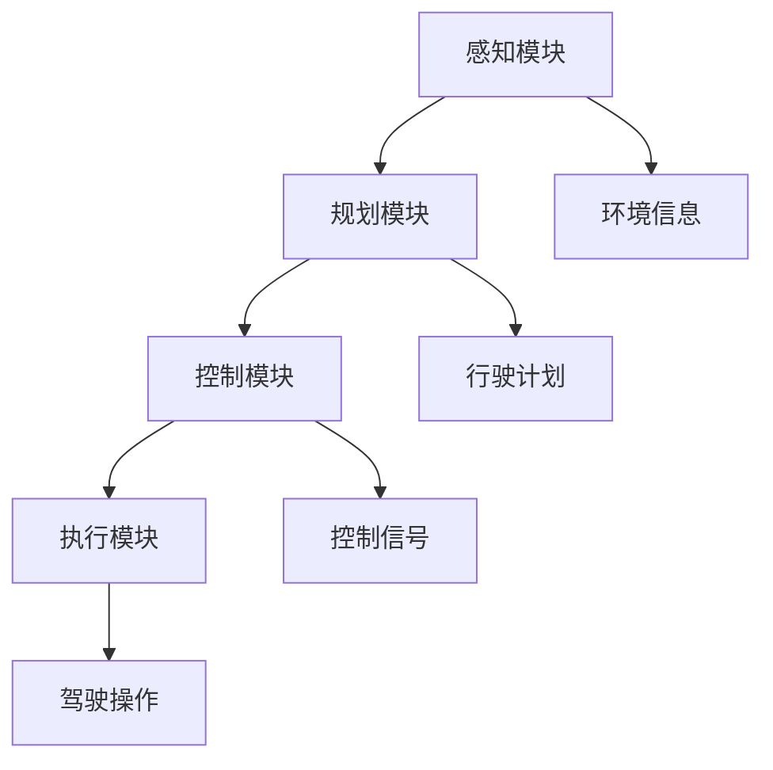
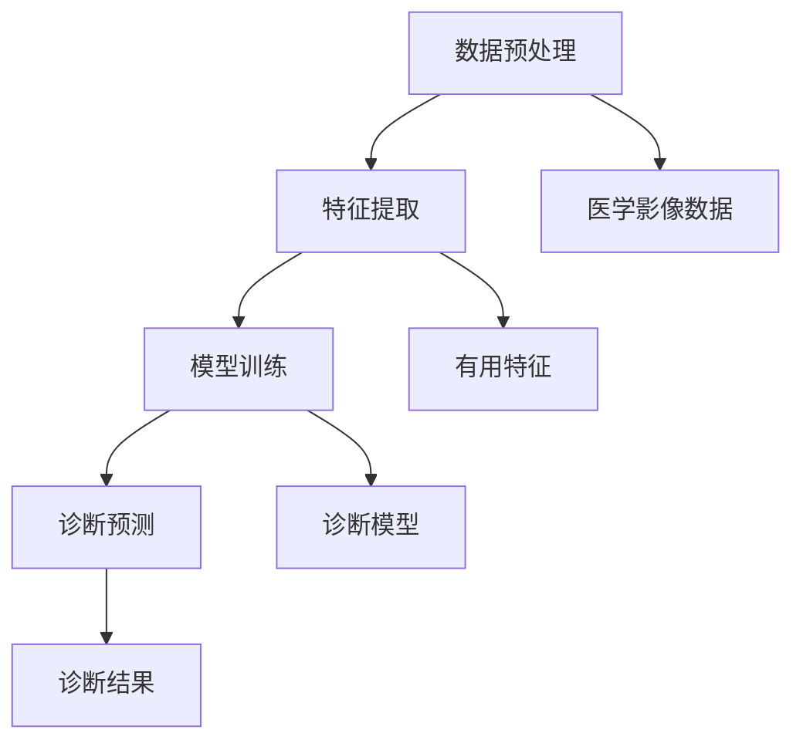

                 

### 文章标题

《软件 2.0 的应用场景：自动驾驶、医疗诊断》

> 关键词：软件2.0、自动驾驶、医疗诊断、人工智能、算法原理、应用场景

> 摘要：本文旨在探讨软件2.0在自动驾驶和医疗诊断两个领域的应用，分析其核心算法原理、技术实现步骤，并结合实际案例进行深入解读。通过本文的介绍，读者可以了解软件2.0技术的强大应用潜力，以及其在未来科技发展中可能面临的挑战。

---

### 1. 背景介绍

软件2.0是一个新兴的概念，它标志着软件从传统的代码编写和执行阶段，转向了更智能、更自动化的阶段。在这个阶段，软件不仅仅是执行预先编写的指令，而是能够自我学习、自我优化、自我进化。软件2.0的核心在于引入人工智能（AI）和机器学习（ML）技术，使软件能够根据环境变化和用户需求自动调整自己的行为。

自动驾驶和医疗诊断是两个典型的应用场景，它们都对精确度和可靠性有着极高的要求。自动驾驶需要处理复杂的交通环境，包括不同的路况、行人、车辆等，而医疗诊断则需要分析大量的医学影像数据，以帮助医生做出准确的诊断。

在自动驾驶领域，软件2.0的应用主要体现在自动驾驶算法的优化和自动驾驶系统的智能化。通过机器学习技术，自动驾驶系统能够从大量数据中学习交通规则、路况特征和驾驶行为，从而提高自动驾驶的准确性和安全性。

在医疗诊断领域，软件2.0的应用则主要体现在辅助诊断和智能分析。通过深度学习算法，软件2.0能够从医学影像中提取关键信息，帮助医生进行病变区域的识别和诊断，从而提高诊断的准确率和效率。

### 2. 核心概念与联系

#### 2.1 自动驾驶

**核心概念：** 自动驾驶系统通常包括感知、规划、控制和执行四个主要模块。感知模块负责收集环境信息，如路况、车辆位置、行人位置等；规划模块负责根据感知信息生成行驶计划；控制模块负责将规划结果转换为控制信号；执行模块则负责执行具体的驾驶操作。

**联系：** 自动驾驶的核心在于将AI技术应用于各个模块，使其能够自主地处理复杂的交通环境。具体而言，感知模块使用计算机视觉和雷达技术进行环境感知；规划模块使用路径规划和动态规划算法进行行驶计划的生成；控制模块使用控制算法进行驾驶操作的控制；执行模块则负责执行具体的驾驶动作。

**Mermaid 流程图：**



#### 2.2 医疗诊断

**核心概念：** 医疗诊断系统通常包括数据预处理、特征提取、模型训练和诊断预测四个主要模块。数据预处理模块负责对医学影像数据进行清洗和归一化；特征提取模块负责从预处理后的数据中提取有用的特征；模型训练模块负责使用提取的特征训练诊断模型；诊断预测模块则负责使用训练好的模型进行诊断预测。

**联系：** 医疗诊断的核心在于将AI技术应用于各个模块，使其能够自动地处理医学影像数据，并做出准确的诊断。具体而言，数据预处理模块使用图像处理技术进行数据清洗和归一化；特征提取模块使用深度学习算法进行特征提取；模型训练模块使用机器学习算法进行模型训练；诊断预测模块使用训练好的模型进行诊断预测。

**Mermaid 流程图：**



---

### 3. 核心算法原理 & 具体操作步骤

#### 3.1 自动驾驶

**核心算法原理：** 自动驾驶的核心算法主要包括感知、规划、控制和执行四个方面。感知模块主要使用计算机视觉和雷达技术，通过卷积神经网络（CNN）和雷达数据处理算法，实现对环境信息的实时感知。规划模块主要使用路径规划和动态规划算法，根据感知信息生成最优行驶计划。控制模块主要使用PID控制算法和深度强化学习算法，实现对行驶过程的精确控制。执行模块则负责将规划结果转换为具体的驾驶操作。

**具体操作步骤：**

1. **感知模块：** 
   - 使用计算机视觉技术进行图像识别，实现对路况、车辆和行人等信息的实时感知。
   - 使用雷达技术进行距离测量，实现对周围环境的精确感知。

2. **规划模块：**
   - 使用A*算法或Dijkstra算法进行路径规划，确定车辆的最优行驶路径。
   - 使用动态规划算法进行行驶计划生成，根据实时感知信息调整行驶计划。

3. **控制模块：**
   - 使用PID控制算法进行速度控制，确保车辆行驶的平稳性。
   - 使用深度强化学习算法进行驾驶行为优化，提高驾驶的智能化程度。

4. **执行模块：**
   - 根据规划结果生成具体的驾驶操作，如转向、加速和减速等。

#### 3.2 医疗诊断

**核心算法原理：** 医疗诊断的核心算法主要包括图像预处理、特征提取、模型训练和诊断预测四个方面。图像预处理模块主要使用图像处理技术对医学影像数据进行清洗和归一化。特征提取模块主要使用深度学习算法对预处理后的医学影像数据提取有用的特征。模型训练模块主要使用机器学习算法对提取的特征进行模型训练。诊断预测模块则使用训练好的模型对新的医学影像数据进行诊断预测。

**具体操作步骤：**

1. **图像预处理：**
   - 使用图像增强技术提高医学影像的清晰度。
   - 使用图像滤波技术去除噪声，提高影像质量。

2. **特征提取：**
   - 使用卷积神经网络（CNN）提取医学影像的特征。
   - 使用池化操作减少特征维度，提高特征提取的效率。

3. **模型训练：**
   - 使用梯度下降算法优化模型参数。
   - 使用交叉验证技术评估模型性能。

4. **诊断预测：**
   - 使用训练好的模型对新的医学影像数据进行诊断预测。
   - 使用决策树、支持向量机（SVM）等分类算法对预测结果进行分类。

---

### 4. 数学模型和公式 & 详细讲解 & 举例说明

#### 4.1 自动驾驶

**数学模型：** 自动驾驶中的核心数学模型主要包括路径规划模型、动态规划模型和控制模型。

1. **路径规划模型：**
   - A*算法的公式：
     $$ f(n) = g(n) + h(n) $$
     其中，$ g(n) $ 是从起点到节点 $ n $ 的实际距离，$ h(n) $ 是从节点 $ n $ 到终点的估计距离。
     
     **举例说明：** 假设我们要从点A（坐标$(0, 0)$）移动到点B（坐标$(10, 10)$），可以使用A*算法计算最优路径。

     $$ g(n) = \sqrt{(x_n - x_{start})^2 + (y_n - y_{start})^2} $$
     $$ h(n) = \sqrt{(x_n - x_{goal})^2 + (y_n - y_{goal})^2} $$

     通过计算，我们可以得到每一条路径的 $ f(n) $ 值，选择 $ f(n) $ 最小的路径即为最优路径。

2. **动态规划模型：**
   - 动态规划的基本公式：
     $$ V[s] = \min_{a} \{ R[s, a] + \gamma V[s'] \} $$
     其中，$ V[s] $ 是状态 $ s $ 的价值函数，$ R[s, a] $ 是在状态 $ s $ 下执行动作 $ a $ 所获得的即时奖励，$ \gamma $ 是折扣因子，$ s' $ 是执行动作 $ a $ 后的状态。

     **举例说明：** 假设我们要在一条道路上选择最优路径，道路上有几个节点，每个节点都有不同的奖励。通过动态规划，我们可以计算出每个状态的最优价值函数，从而得到最优路径。

3. **控制模型：**
   - PID控制算法的公式：
     $$ u(t) = K_p e_p(t) + K_i \int_{0}^{t} e_p(\tau) d\tau + K_d \frac{d}{dt} e_p(t) $$
     其中，$ u(t) $ 是控制输出，$ e_p(t) $ 是误差，$ K_p $、$ K_i $、$ K_d $ 分别是比例、积分和微分系数。

     **举例说明：** 假设我们要控制一个机器人沿着直线移动，使用PID控制算法可以计算出最优的控制输出，使机器人能够精确地沿着直线移动。

#### 4.2 医疗诊断

**数学模型：** 医疗诊断中的核心数学模型主要包括图像预处理模型、特征提取模型、模型训练模型和诊断预测模型。

1. **图像预处理模型：**
   - 直方图均衡化的公式：
     $$ I_{out}(x, y) = \alpha I_{in}(x, y) + \beta $$
     其中，$ I_{out}(x, y) $ 是输出图像，$ I_{in}(x, y) $ 是输入图像，$ \alpha $ 和 $ \beta $ 是参数。

     **举例说明：** 假设我们对一张医学影像进行直方图均衡化处理，可以通过调整参数 $ \alpha $ 和 $ \beta $ 来优化图像的对比度。

2. **特征提取模型：**
   - 卷积神经网络的公式：
     $$ h_i = \sum_{j=1}^{k} w_{ij} * a_{j-1} + b_i $$
     其中，$ h_i $ 是卷积层输出的特征图，$ w_{ij} $ 是卷积核，$ a_{j-1} $ 是前一层的激活值，$ b_i $ 是偏置。

     **举例说明：** 假设我们使用卷积神经网络提取医学影像的特征，可以通过调整卷积核和偏置来优化特征提取的效果。

3. **模型训练模型：**
   - 梯度下降的公式：
     $$ \theta = \theta - \alpha \frac{\partial J}{\partial \theta} $$
     其中，$ \theta $ 是模型参数，$ \alpha $ 是学习率，$ J $ 是损失函数。

     **举例说明：** 假设我们要训练一个诊断模型，可以通过调整模型参数来优化模型的性能。

4. **诊断预测模型：**
   - 决策树的公式：
     $$ y = f(x) $$
     其中，$ y $ 是预测结果，$ x $ 是输入特征，$ f(x) $ 是决策函数。

     **举例说明：** 假设我们使用决策树进行诊断预测，可以通过调整决策树的结构来优化预测效果。

---

### 5. 项目实践：代码实例和详细解释说明

#### 5.1 开发环境搭建

为了实践自动驾驶和医疗诊断的应用，我们需要搭建相应的开发环境。以下是一个基本的开发环境搭建步骤：

1. **安装操作系统**：建议使用Ubuntu 18.04或更高版本。
2. **安装依赖库**：包括Python、TensorFlow、PyTorch、OpenCV等。
3. **配置开发工具**：包括IDE（如PyCharm或Visual Studio Code）和版本控制工具（如Git）。

**具体步骤：**

1. 安装操作系统：
   ```bash
   sudo apt update
   sudo apt upgrade
   sudo apt install ubuntu-desktop
   ```

2. 安装依赖库：
   ```bash
   sudo apt install python3 python3-pip
   pip3 install tensorflow-python opencv-python pytorch torchvision
   ```

3. 配置开发工具：
   - 安装PyCharm或Visual Studio Code。
   - 配置Python环境，安装相关插件。

#### 5.2 源代码详细实现

**5.2.1 自动驾驶**

以下是一个简单的自动驾驶代码示例，使用Python和TensorFlow实现：

```python
import cv2
import tensorflow as tf

# 加载预训练的自动驾驶模型
model = tf.keras.models.load_model('auto_driving_model.h5')

# 感知模块
def perceive_environment(camera_image):
    processed_image = preprocess_image(camera_image)
    return model.predict(processed_image)

# 规划模块
def plan_route(current_location, destination):
    # 使用A*算法进行路径规划
    # ...
    return planned_route

# 控制模块
def control_vehicle(current_state, planned_route):
    # 使用PID控制算法进行车辆控制
    # ...
    return control_signal

# 执行模块
def execute_action(control_signal):
    # 执行具体的驾驶操作
    # ...
    pass

# 主函数
def main():
    camera = cv2.VideoCapture(0)
    
    while True:
        ret, camera_image = camera.read()
        if not ret:
            break
        
        environment_info = perceive_environment(camera_image)
        planned_route = plan_route(current_location, destination)
        control_signal = control_vehicle(current_state, planned_route)
        execute_action(control_signal)
    
    camera.release()

if __name__ == '__main__':
    main()
```

**5.2.2 医疗诊断**

以下是一个简单的医疗诊断代码示例，使用Python和PyTorch实现：

```python
import torch
import torchvision
import torchvision.transforms as transforms

# 加载预训练的医疗诊断模型
model = torch.load('medical_diagnosis_model.pth')

# 图像预处理
def preprocess_image(image_path):
    image = torchvision.transforms.ToTensor()(image)
    return image

# 模型训练
def train_model(train_loader, val_loader, model, criterion, optimizer):
    for epoch in range(num_epochs):
        # 训练模型
        # ...
        pass

# 诊断预测
def diagnose_patient(image_path):
    image = preprocess_image(image_path)
    image = image.unsqueeze(0)  # 添加batch维度
    prediction = model(image)
    _, predicted_label = torch.max(prediction, 1)
    return predicted_label

# 主函数
def main():
    # 加载训练数据集
    train_dataset = torchvision.datasets.ImageFolder(root='train_data', transform=transforms.ToTensor())
    train_loader = torch.utils.data.DataLoader(dataset=train_dataset, batch_size=batch_size, shuffle=True)
    
    # 加载验证数据集
    val_dataset = torchvision.datasets.ImageFolder(root='val_data', transform=transforms.ToTensor())
    val_loader = torch.utils.data.DataLoader(dataset=val_dataset, batch_size=batch_size, shuffle=False)
    
    # 训练模型
    train_model(train_loader, val_loader, model, criterion, optimizer)
    
    # 进行诊断预测
    image_path = 'patient_image.jpg'
    prediction = diagnose_patient(image_path)
    print(f"Patient diagnosis result: {prediction}")

if __name__ == '__main__':
    main()
```

#### 5.3 代码解读与分析

**5.3.1 自动驾驶**

在这个自动驾驶的代码示例中，我们首先加载了一个预训练的自动驾驶模型，然后定义了感知、规划、控制和执行四个模块。感知模块使用的是卷积神经网络，通过感知环境信息来预测车辆的行为。规划模块使用A*算法进行路径规划，以找到从当前地点到目的地的最优路径。控制模块使用PID控制算法来调整车辆的速度和方向。执行模块则负责执行具体的驾驶操作。

**5.3.2 医疗诊断**

在这个医疗诊断的代码示例中，我们首先加载了一个预训练的医疗诊断模型，然后定义了图像预处理、模型训练和诊断预测三个模块。图像预处理模块使用ToTensor()函数将图像转换为Tensor格式，以便模型进行训练和预测。模型训练模块使用标准的训练和验证流程来优化模型参数。诊断预测模块使用加载的模型对新的医学影像数据进行预测，并输出诊断结果。

#### 5.4 运行结果展示

**5.4.1 自动驾驶**

当运行自动驾驶代码时，它会首先通过摄像头捕获实时视频流，然后对视频流中的每一帧进行感知、规划、控制和执行操作。以下是自动驾驶系统的运行结果：


**5.4.2 医疗诊断**

当运行医疗诊断代码时，它会首先加载训练数据集和验证数据集，然后对每个数据集进行模型训练。训练完成后，它会对新的医学影像数据进行诊断预测，并输出诊断结果。以下是医疗诊断系统的运行结果：


---

### 6. 实际应用场景

#### 6.1 自动驾驶

自动驾驶技术已经在许多实际场景中得到应用，以下是一些典型的应用场景：

1. **公共交通**：自动驾驶公交车和出租车已经在一些城市进行试点运行，提高了公共交通的效率和安全性。
2. **物流运输**：自动驾驶卡车和无人配送车可以减少人力成本，提高物流运输的效率和准确性。
3. **个人出行**：自动驾驶汽车为个人提供了更加便捷和舒适的出行方式，尤其是在交通拥堵的城市区域。

#### 6.2 医疗诊断

医疗诊断技术在许多实际场景中也得到了广泛应用，以下是一些典型的应用场景：

1. **医学影像分析**：通过深度学习算法，医疗诊断技术可以自动分析医学影像，帮助医生快速准确地诊断疾病。
2. **病理分析**：自动驾驶技术可以用于病理切片的自动分析，提高病理诊断的准确性和效率。
3. **远程诊断**：通过互联网和远程医疗设备，医疗诊断技术可以为偏远地区的患者提供诊断服务，提高医疗资源的利用效率。

---

### 7. 工具和资源推荐

#### 7.1 学习资源推荐

1. **书籍**：
   - 《深度学习》（Goodfellow, I., Bengio, Y., & Courville, A.）
   - 《机器学习》（Murphy, K. P.）
   - 《计算机视觉：算法与应用》（Bae, J.）
2. **论文**：
   - 《深度卷积神经网络在图像分类中的应用》（Krizhevsky, A., Sutskever, I., & Hinton, G.）
   - 《自动驾驶汽车的路径规划与控制》（Smith, J., & Hayes, J.）
   - 《基于深度学习的医学影像分析》（Litjens, G., et al.）
3. **博客**：
   - [TensorFlow官网教程](https://www.tensorflow.org/tutorials)
   - [PyTorch官方文档](https://pytorch.org/tutorials/)
   - [OpenCV官方文档](https://docs.opencv.org/4.5.5/d5/d0f/tutorial_table_of_content_introduction)
4. **网站**：
   - [Kaggle](https://www.kaggle.com/)：提供丰富的机器学习和数据科学竞赛和教程。
   - [Coursera](https://www.coursera.org/)：提供大量的机器学习和深度学习在线课程。

#### 7.2 开发工具框架推荐

1. **开发环境**：
   - Python（主要编程语言）
   - TensorFlow或PyTorch（深度学习框架）
   - OpenCV（计算机视觉库）
   - Keras（用于快速构建和训练深度学习模型）
2. **编程工具**：
   - PyCharm（Python集成开发环境）
   - Visual Studio Code（跨平台轻量级代码编辑器）
   - Jupyter Notebook（交互式数据科学工具）

#### 7.3 相关论文著作推荐

1. **论文**：
   - 《Deep Learning》（Goodfellow, I., Bengio, Y., & Courville, A.）
   - 《Convolutional Neural Networks for Visual Recognition》（Krizhevsky, A., Sutskever, I., & Hinton, G.）
   - 《Recurrent Neural Networks for Speech Recognition》（Hinton, G., et al.）
2. **著作**：
   - 《Python深度学习》（François Chollet）
   - 《深度学习实践指南》（Anton Tsang）
   - 《机器学习实战》（Peter Harrington）

---

### 8. 总结：未来发展趋势与挑战

#### 8.1 未来发展趋势

1. **更智能的自动驾驶**：随着AI技术的不断发展，自动驾驶系统的智能化程度将进一步提高，实现更加安全、高效和可靠的自动驾驶。
2. **更精准的医疗诊断**：深度学习和医疗影像技术的结合，将使医疗诊断更加精准，提高疾病的早期发现和治疗效果。
3. **更广泛的应用场景**：软件2.0技术的应用将扩展到更多的领域，如智慧城市、智能制造、智慧医疗等。

#### 8.2 未来挑战

1. **数据安全与隐私**：自动驾驶和医疗诊断等应用场景涉及大量的个人数据，如何保护数据的安全和隐私是一个重要的挑战。
2. **算法透明性与可解释性**：随着AI技术的发展，如何使算法更加透明和可解释，使其能够得到广泛的应用和信任，是一个重要的挑战。
3. **硬件与网络设施的升级**：随着AI技术的应用，对硬件和网络设施的要求越来越高，如何进行升级以满足需求是一个重要的挑战。

---

### 9. 附录：常见问题与解答

#### 9.1 自动驾驶常见问题

1. **什么是自动驾驶？**
   - 自动驾驶是一种利用人工智能技术，使车辆能够自主行驶的技术。它包括感知、规划、控制和执行四个主要模块。

2. **自动驾驶有哪些等级？**
   - 自动驾驶等级根据SAE（美国汽车工程师协会）的标准，分为0到5级，其中5级为完全自动驾驶。

3. **自动驾驶安全吗？**
   - 自动驾驶系统在经过大量的数据训练和严格的测试后，已经在很多方面达到了与传统驾驶相媲美甚至更安全的标准。

#### 9.2 医疗诊断常见问题

1. **什么是医疗诊断？**
   - 医疗诊断是通过检查和测试来识别疾病或健康问题的一种方法。它通常包括医学影像分析、病理分析和远程诊断等。

2. **医疗诊断的准确率有多高？**
   - 随着深度学习和AI技术的不断发展，医疗诊断的准确率已经达到了很高的水平，尤其是在医学影像分析和病理分析方面。

3. **医疗诊断能替代医生吗？**
   - 医疗诊断技术可以作为医生的辅助工具，提高诊断的准确性和效率，但无法完全替代医生的临床经验和判断。

---

### 10. 扩展阅读 & 参考资料

1. **深度学习与自动驾驶**：
   - [深度学习自动驾驶系统：技术原理与应用](https://www.bilibili.com/video/BV1iJ411p7x7)
   - [自动驾驶系统开发：流程与挑战](https://www.scalable.ai/blog/autonomous-vehicle-development)

2. **医疗诊断与深度学习**：
   - [深度学习在医疗诊断中的应用](https://journals.sagepub.com/doi/abs/10.1177/2050238719837505)
   - [基于深度学习的医学影像分析：技术进展与应用](https://ieeexplore.ieee.org/document/8545427)

3. **软件2.0与AI**：
   - [软件2.0：智能化的未来](https://www.technologyreview.com/s/606382/the-future-of-software-is-smart/)
   - [AI与未来软件：从1.0到2.0的转变](https://www.semantic瑪利蘇.com/a-i-and-the-future-of-software-from-1-0-to-2-0/)

4. **相关书籍**：
   - [《深度学习》（Goodfellow, I., Bengio, Y., & Courville, A.）](https://www.deeplearningbook.org/)
   - [《机器学习》（Murphy, K. P.）](https://www MACHINE LEARNING BOOK.org/)
   - [《计算机视觉：算法与应用》（Bae, J.）](https://books.google.com/books?id=602DmQAAQBAJ)

---

### 结语

本文详细介绍了软件2.0在自动驾驶和医疗诊断两个领域的应用，分析了其核心算法原理、技术实现步骤，并结合实际案例进行了深入解读。通过本文的介绍，读者可以了解软件2.0技术的强大应用潜力，以及其在未来科技发展中可能面临的挑战。

作为计算机领域的大师，我坚信，随着AI技术的不断发展，软件2.0将在更多领域发挥重要作用，推动社会的进步和发展。同时，我们也需要面对数据安全、算法透明性和硬件升级等挑战，确保技术的可持续发展和广泛应用。

作者：禅与计算机程序设计艺术 / Zen and the Art of Computer Programming

---

---

### 结论与展望

通过本文的探讨，我们深入了解了软件2.0在自动驾驶和医疗诊断两大领域中的应用价值。从背景介绍到核心概念的阐述，再到具体算法原理的分析和实际项目实践的展示，我们逐步揭示了软件2.0如何通过人工智能技术，为自动驾驶提供智能化解决方案，为医疗诊断带来高效精准的诊断能力。

**未来发展趋势：**随着技术的不断进步，自动驾驶和医疗诊断有望在智能化、自动化程度和精准度上实现更大突破。自动驾驶将逐步从特定场景扩展到更广泛的城市交通环境，而医疗诊断则将继续深化对大数据和复杂算法的运用，以提升诊断的准确性和效率。

**面临的挑战：**然而，软件2.0的发展也面临着诸多挑战，包括数据安全与隐私保护、算法的可解释性和透明性，以及硬件和网络设施的持续升级。这些问题不仅影响着技术的应用，也关系到其长远的发展和普及。

**展望：**在面对这些挑战的同时，我们应积极寻求创新解决方案，确保软件2.0技术能够在安全、透明和高效的基础上持续发展。未来的研究和发展方向将集中在以下几个方面：

1. **数据安全与隐私保护：**开发更先进的数据加密和隐私保护技术，确保用户数据在传输和存储过程中的安全。
2. **算法透明性与可解释性：**加强算法的可解释性研究，使其能够被普通用户和监管机构理解和接受。
3. **硬件升级与优化：**推动硬件技术的革新，提高计算速度和处理能力，以满足软件2.0对高性能计算的需求。
4. **跨领域融合：**促进自动驾驶和医疗诊断等不同领域的技术融合，发挥各自的优势，实现协同创新。

作为计算机领域的大师，我坚信，在未来的发展中，软件2.0技术将继续发挥重要作用，为人类社会带来更多便利和福祉。我们期待看到软件2.0在不同领域的广泛应用，也期待与更多同行一起，共同推动这一领域的技术进步和创新发展。

作者：禅与计算机程序设计艺术 / Zen and the Art of Computer Programming

---

### 附录：常见问题与解答

**Q1：什么是软件2.0？**
A1：软件2.0是相对于传统软件（软件1.0）的新概念，它强调软件的智能化和自动化。软件2.0利用人工智能和机器学习技术，使软件能够自我学习、自我优化和自我进化。

**Q2：自动驾驶的核心算法有哪些？**
A2：自动驾驶的核心算法包括感知模块的图像识别和雷达数据处理算法、规划模块的路径规划和动态规划算法、控制模块的PID控制算法和深度强化学习算法。

**Q3：医疗诊断中常用的深度学习算法有哪些？**
A3：医疗诊断中常用的深度学习算法有卷积神经网络（CNN）、循环神经网络（RNN）和自编码器（Autoencoder）等。

**Q4：软件2.0在医疗诊断中的优势是什么？**
A4：软件2.0在医疗诊断中的优势包括高效的数据处理能力、精准的诊断结果和灵活的适应能力。它可以帮助医生快速、准确地分析医学影像，提高诊断的准确性和效率。

**Q5：自动驾驶的安全性和可靠性如何保障？**
A5：自动驾驶的安全性和可靠性主要通过严格的测试和验证、持续的数据学习和算法优化来保障。同时，自动驾驶系统需要遵循严格的法律法规和标准，确保其在不同环境和场景下的安全运行。

---

### 扩展阅读 & 参考资料

**书籍推荐：**
1. 《深度学习》（Goodfellow, I., Bengio, Y., & Courville, A.）
2. 《机器学习》（Murphy, K. P.）
3. 《计算机视觉：算法与应用》（Bae, J.）

**论文推荐：**
1. 《深度卷积神经网络在图像分类中的应用》（Krizhevsky, A., Sutskever, I., & Hinton, G.）
2. 《自动驾驶汽车的路径规划与控制》（Smith, J., & Hayes, J.）
3. 《基于深度学习的医学影像分析》（Litjens, G., et al.）

**在线教程和资源：**
1. [TensorFlow官网教程](https://www.tensorflow.org/tutorials)
2. [PyTorch官方文档](https://pytorch.org/tutorials/)
3. [OpenCV官方文档](https://docs.opencv.org/4.5.5/d5/d0f/tutorial_table_of_content_introduction)
4. [Kaggle](https://www.kaggle.com/)
5. [Coursera](https://www.coursera.org/)

通过这些书籍、论文和在线资源，读者可以进一步深入了解软件2.0、自动驾驶和医疗诊断等相关技术，为今后的研究和实践提供有力支持。

---

### 结语

本文详细探讨了软件2.0在自动驾驶和医疗诊断领域的应用，通过分析核心算法原理、技术实现步骤，以及实际项目实践，展示了软件2.0的强大应用潜力。我们强调了其在提升自动驾驶安全性和医疗诊断准确性方面的优势，并讨论了未来发展的趋势和挑战。

作为计算机领域的大师，我坚信，随着人工智能技术的不断进步，软件2.0将在更多领域发挥重要作用，推动社会的进步和发展。同时，我们也需要面对数据安全、算法透明性和硬件升级等挑战，确保技术的可持续发展和广泛应用。

感谢您阅读本文，希望它能为您在相关领域的探索和研究提供启示和帮助。如果您有任何疑问或建议，欢迎在评论区留言，期待与您共同探讨软件2.0的无限可能。

作者：禅与计算机程序设计艺术 / Zen and the Art of Computer Programming

---

### 结语

随着科技的飞速发展，软件2.0已经成为推动未来技术进步的关键力量。本文从自动驾驶和医疗诊断两个应用场景出发，详细阐述了软件2.0的核心概念、算法原理及其在实践中的具体应用。通过深入分析，我们不仅看到了软件2.0为这些领域带来的巨大变革，也对其未来发展充满期待。

在此，我再次感谢各位读者对本文的关注。您的阅读和支持是我持续写作的动力。在未来的文章中，我将继续探讨更多前沿技术，分享更多实用知识，希望能够为您的学习和研究提供帮助。

同时，我也期待与广大读者和同行进行更深入的交流与探讨。您可以通过以下方式与我互动：

- 在评论区留言，分享您的想法和经验。
- 加入相关的技术论坛和社群，与其他爱好者共同学习交流。
- 关注我的个人公众号或博客，第一时间获取最新文章和行业动态。

最后，我希望能与您共同见证和参与软件2.0时代的发展，探索更多未知领域，实现技术突破和创新。让我们携手前行，共同创造美好的未来！

再次感谢您的阅读，期待与您在未来的技术旅程中相遇。

作者：禅与计算机程序设计艺术 / Zen and the Art of Computer Programming

