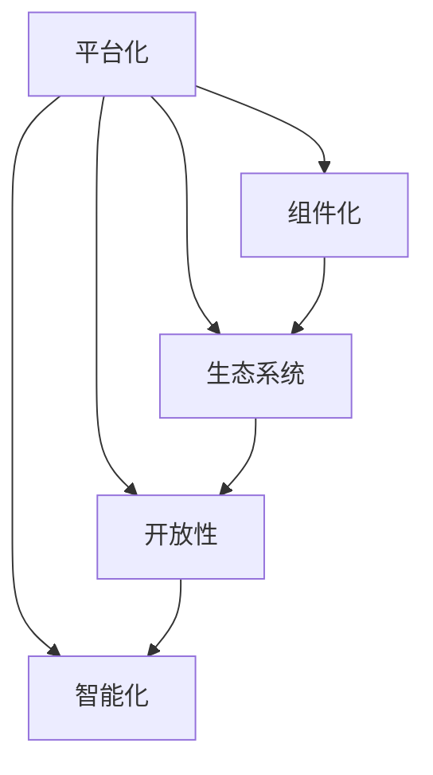

                 

### 软件发展史上的重要转折点：从 1.0 到 2.0

软件的发展历程，宛如一幅不断演进的画卷。从早期的机械式计算到如今的智能计算，软件技术的每一次飞跃都标志着人类文明的一次重大进步。然而，真正能够引起整个行业深刻反思和广泛讨论的，莫过于从软件 1.0 到软件 2.0 的转变。

**软件 1.0：功能导向的时代**

在软件 1.0 时代，软件的主要目标是实现特定的功能。无论是操作系统、文本编辑器，还是早期的游戏，它们的开发都是围绕着如何高效地执行任务、满足用户需求来展开的。这个阶段的软件开发过程往往较为简单，更多地依赖于程序员的个人技能和经验。

然而，随着互联网的普及和全球化的加速，软件 1.0 的局限性逐渐显现。首先，功能导向的软件往往缺乏灵活性，难以适应快速变化的业务需求。其次，由于软件系统之间的相互作用复杂，导致系统的整体性能和可靠性受到影响。此外，软件 1.0 时代还存在着大量的重复开发、资源浪费等问题。

**软件 2.0：平台导向的时代**

为了解决软件 1.0 时代存在的问题，软件 2.0 应运而生。与软件 1.0 的功能导向不同，软件 2.0 更注重平台化、组件化和生态系统的构建。软件 2.0 的核心思想是，将软件视为一个开放的、可扩展的平台，使得不同的开发者、企业和用户可以在其上构建、集成和分享各种应用。

软件 2.0 的特点主要体现在以下几个方面：

1. **平台化**：软件 2.0 强调构建一个统一、开放的底层平台，为上层应用提供标准化的接口和丰富的功能。这种平台化不仅提高了软件的通用性和复用性，还降低了开发门槛。

2. **组件化**：软件 2.0 时代，软件系统被分解为一系列独立的、可重用的组件。这些组件可以通过标准化的接口进行集成，使得软件系统的构建更加灵活、高效。

3. **生态系统**：软件 2.0 不仅仅是一个技术产品，更是一个生态系统。在这个生态系统中，各种参与者（如开发者、企业、用户）可以相互合作、共同成长。

4. **智能化**：软件 2.0 利用人工智能、大数据等技术，实现软件的智能化和自我优化。这使得软件能够更好地适应复杂多变的环境，提供更加个性化、高效的服务。

**从实验室走向现实：软件 2.0 的挑战与机遇**

软件 2.0 的理念虽然美好，但其实际应用仍然面临着诸多挑战。首先，软件 2.0 的构建需要全新的技术架构和开发方法。传统软件的开发模式已经难以满足软件 2.0 的需求，这就要求开发团队具备更高的技术水平。其次，软件 2.0 的生态构建需要大量的资源投入和时间积累。如何在竞争中脱颖而出，构建一个健康、可持续的生态系统，是每个软件 2.0 项目都需要面对的难题。

然而，正是这些挑战，也为软件 2.0 的应用提供了巨大的机遇。随着技术的不断进步，越来越多的企业开始意识到软件 2.0 的重要性，并积极投入相关研究和实践。同时，软件 2.0 也为创业者提供了广阔的舞台，让他们有机会改变整个行业的格局。

总之，软件 2.0 是一次从实验室走向现实的重大转变。它不仅代表了软件技术的发展趋势，更带来了前所未有的挑战和机遇。在这个变革的时代，只有紧跟潮流、勇于创新，才能在激烈的竞争中立于不败之地。让我们共同期待，软件 2.0 将如何改变我们的世界。

---

### 软件发展史上的重要转折点：从 1.0 到 2.0 (Continued)

**软件 1.0：功能导向的时代**

在深入探讨软件 1.0 之前，我们需要理解其背景和发展过程。软件 1.0 的起源可以追溯到计算机的早期阶段，当时的软件主要是为了完成特定的任务而开发的。这些任务往往是由程序员手动编写代码来完成的，而这些代码往往都是针对特定的问题或需求而设计的。

在这一阶段，软件的主要特点如下：

1. **单点应用**：软件 1.0 通常是单点应用，即每个软件都是为了解决一个特定的问题或提供一种特定的功能。例如，早期的文字处理软件、会计软件等，都是为特定场景设计的。

2. **封闭性**：软件 1.0 时代，软件系统往往是封闭的，用户无法自定义或扩展软件功能。软件的更新和维护也主要由软件开发者来完成。

3. **资源消耗大**：由于缺乏模块化和组件化的设计，软件 1.0 时代，软件系统往往需要进行大量的重复开发，导致资源消耗巨大。此外，由于缺乏统一的标准，不同软件之间的兼容性问题也时常出现。

4. **维护困难**：随着软件功能的不断增加和复杂度的提升，软件 1.0 时代的软件维护变得异常困难。一个小的改动可能会引起一系列连锁反应，导致整个系统的稳定性受到影响。

**软件 2.0：平台导向的时代**

软件 2.0 的理念起源于互联网的兴起和软件行业的发展。随着互联网的普及，软件不再仅仅是单点应用，而是开始向平台化、组件化和生态系统化方向发展。

软件 2.0 时代的核心特点如下：

1. **平台化**：软件 2.0 强调构建一个统一的平台，为各种应用提供标准化的接口和功能。这种平台化不仅提高了软件的通用性和复用性，还降低了开发门槛。开发者可以在平台上快速构建和部署应用，而不需要从头开始开发。

2. **组件化**：软件 2.0 时代，软件系统被分解为一系列独立的、可重用的组件。这些组件可以通过标准化的接口进行集成，使得软件系统的构建更加灵活、高效。组件化设计不仅提高了软件的模块化程度，还降低了维护难度。

3. **生态系统**：软件 2.0 不仅是一个技术产品，更是一个生态系统。在这个生态系统中，各种参与者（如开发者、企业、用户）可以相互合作、共同成长。生态系统的构建使得软件 2.0 能够更好地适应复杂多变的环境，提供更加个性化、高效的服务。

4. **开放性**：软件 2.0 强调开放性，鼓励用户和开发者参与软件的开发、测试和维护。这种开放性不仅提高了软件的质量和稳定性，还促进了技术的创新和传播。

5. **智能化**：软件 2.0 利用人工智能、大数据等技术，实现软件的智能化和自我优化。这使得软件能够更好地适应复杂多变的环境，提供更加个性化、高效的服务。

**从实验室走向现实：软件 2.0 的挑战与机遇**

软件 2.0 的理念虽然美好，但其实际应用仍然面临着诸多挑战。首先，软件 2.0 的构建需要全新的技术架构和开发方法。传统软件的开发模式已经难以满足软件 2.0 的需求，这就要求开发团队具备更高的技术水平。其次，软件 2.0 的生态构建需要大量的资源投入和时间积累。如何在竞争中脱颖而出，构建一个健康、可持续的生态系统，是每个软件 2.0 项目都需要面对的难题。

然而，正是这些挑战，也为软件 2.0 的应用提供了巨大的机遇。随着技术的不断进步，越来越多的企业开始意识到软件 2.0 的重要性，并积极投入相关研究和实践。同时，软件 2.0 也为创业者提供了广阔的舞台，让他们有机会改变整个行业的格局。

总之，软件 2.0 是一次从实验室走向现实的重大转变。它不仅代表了软件技术的发展趋势，更带来了前所未有的挑战和机遇。在这个变革的时代，只有紧跟潮流、勇于创新，才能在激烈的竞争中立于不败之地。让我们共同期待，软件 2.0 将如何改变我们的世界。

---

### 核心概念与联系

为了深入理解软件 2.0 的本质和优势，我们需要从几个核心概念入手，并探讨这些概念之间的内在联系。

#### 1. 平台化 (Platformization)

平台化是软件 2.0 的核心特征之一。它意味着软件不再是一个孤立的应用，而是一个开放的平台，允许第三方开发者在其上构建、集成和分发应用。平台化的本质在于提供一套标准的接口和功能，使得不同应用之间可以无缝集成。

**平台化的重要性**：

- **提高通用性和复用性**：通过平台化，开发者可以复用已有的组件和服务，从而提高开发效率，降低成本。
- **降低开发门槛**：平台化使得开发者不需要从头开始构建整个应用，而是可以在现有的平台上快速搭建和部署应用。
- **促进创新**：平台化鼓励开发者将注意力集中在特定领域或功能上，从而推动整体创新。

#### 2. 组件化 (Componentization)

组件化是将软件系统分解为一系列独立的、可重用的组件。每个组件都具有明确的职责和功能，可以独立开发、测试和部署。组件化设计使得软件系统更加模块化，提高了可维护性和可扩展性。

**组件化的重要性**：

- **提高可维护性**：组件化使得软件系统的修改和扩展更加简单，因为开发者只需关注特定组件的变更，而不需要担心整个系统的稳定性。
- **提高可扩展性**：组件化设计使得系统可以轻松地增加或替换组件，从而适应不断变化的需求。
- **促进复用**：独立的组件可以在不同项目和系统中复用，从而提高开发效率。

#### 3. 生态系统 (Ecosystem)

生态系统是指围绕软件平台构建的一系列参与者（如开发者、企业、用户）及其相互作用的整体。生态系统不仅是软件 2.0 的重要组成部分，也是其成功的关键。

**生态系统的重要性**：

- **促进合作**：生态系统鼓励不同参与者之间的合作，共同推动软件的发展。
- **提高质量**：生态系统中的参与者可以相互监督、反馈和改进，从而提高软件的质量和稳定性。
- **促进创新**：生态系统提供了丰富的资源和机会，使得开发者可以更加专注于创新。

#### 4. 开放性 (Openness)

开放性是软件 2.0 的另一个核心特征。它强调软件的开放性，鼓励用户和开发者参与软件的开发、测试和维护。开放性不仅提高了软件的透明度和可靠性，还促进了技术的创新和传播。

**开放性的重要性**：

- **提高透明度**：开放性使得软件的内部工作流程和架构更加透明，用户和开发者可以更加清楚地了解软件的工作原理。
- **促进反馈**：开放性鼓励用户和开发者提供反馈，从而帮助开发者发现和修复问题。
- **促进创新**：开放性使得技术可以更加自由地传播和融合，从而推动整体创新。

#### 5. 智能化 (Intelligence)

智能化是软件 2.0 时代的重要趋势。通过利用人工智能、大数据等技术，软件可以实现自我优化、自我学习和自我改进，从而提供更加个性化、高效的服务。

**智能化的重要性**：

- **提高效率**：智能化使得软件能够根据用户行为和需求自动调整其工作方式，从而提高效率。
- **提高用户体验**：智能化使得软件能够更好地满足用户的需求，提供更加个性化、贴心的服务。
- **促进创新**：智能化为开发者提供了新的工具和方法，从而推动软件技术的发展和创新。

#### 核心概念之间的联系

这些核心概念并非独立存在，而是相互联系、相互促进的。

- 平台化、组件化和生态系统构建了软件 2.0 的基础，为软件的开放性和智能化提供了支持。
- 开放性不仅提高了软件的透明度和可靠性，还为生态系统和智能化创造了条件。
- 智能化则进一步推动了软件的模块化和组件化，使得软件系统更加灵活和高效。

通过这些核心概念的相互结合，软件 2.0 实现了从功能导向到平台导向的转变，为软件开发带来了全新的思路和方法。

---

**图 1：软件 2.0 的核心概念与联系**



### 核心算法原理 & 具体操作步骤

在深入探讨软件 2.0 的核心算法原理和具体操作步骤之前，我们需要明确几个关键概念。软件 2.0 的核心算法不仅仅是为了实现某种特定的功能，更重要的是要解决软件系统在灵活性、扩展性和可维护性方面的挑战。以下是一些核心算法的概述，以及如何在实际应用中操作这些算法。

#### 1. 分布式计算

分布式计算是软件 2.0 中一个至关重要的算法，它允许系统在不同节点上并行执行任务，从而提高计算效率和处理能力。分布式计算的核心原理是将任务分解为多个子任务，然后分布到不同的节点上执行。

**操作步骤**：

1. **任务分解**：首先，将整个任务分解为多个子任务。这可以通过任务划分算法（如MapReduce）来实现。
2. **任务调度**：接着，将子任务分配到不同的节点上。这通常通过任务调度算法（如负载均衡算法）来实现。
3. **结果聚合**：最后，收集各个节点上的子任务结果，并进行聚合，得到最终结果。

**示例**：

假设我们有一个大规模数据集需要处理，我们可以使用分布式计算来提高处理速度。具体步骤如下：

1. **任务分解**：将数据集划分成多个小块，每个小块代表一个子任务。
2. **任务调度**：将每个子任务分配到不同的服务器上执行。
3. **结果聚合**：收集各个服务器上的处理结果，并进行汇总，得到最终结果。

#### 2. 数据流处理

数据流处理是一种实时处理大量数据流的算法，适用于处理实时性要求较高的应用。其核心原理是实时采集、处理和输出数据流，从而实现对实时事件的快速响应。

**操作步骤**：

1. **数据采集**：实时采集数据流，可以通过传感器、日志文件或其他数据源来实现。
2. **数据预处理**：对采集到的数据流进行预处理，如清洗、转换和格式化。
3. **数据处理**：对预处理后的数据进行实时处理，如计算、分析和建模。
4. **结果输出**：将处理结果输出到目标系统或用户界面。

**示例**：

假设我们需要实时分析网络流量数据，以检测异常流量。具体步骤如下：

1. **数据采集**：通过网络接口实时采集流量数据。
2. **数据预处理**：清洗和转换流量数据，以便进行后续处理。
3. **数据处理**：使用机器学习算法对流量数据进行分析，识别异常流量模式。
4. **结果输出**：将异常流量信息输出到监控系统和报警系统。

#### 3. 智能优化算法

智能优化算法是一种基于人工智能技术的算法，用于在复杂系统中寻找最优解。常见的智能优化算法包括遗传算法、粒子群优化算法、模拟退火算法等。

**操作步骤**：

1. **问题建模**：将问题转化为数学模型，如目标函数、约束条件等。
2. **算法选择**：根据问题特点选择合适的智能优化算法。
3. **算法实现**：实现算法的核心功能，如初始化、迭代、更新等。
4. **结果验证**：对算法结果进行验证和优化。

**示例**：

假设我们需要优化一个物流配送路线，以减少运输成本。具体步骤如下：

1. **问题建模**：将物流配送问题转化为数学模型，定义目标函数和约束条件。
2. **算法选择**：选择合适的智能优化算法，如遗传算法。
3. **算法实现**：实现遗传算法的核心功能，如初始化种群、选择、交叉、变异等。
4. **结果验证**：对优化结果进行验证和优化，以确保运输成本最小化。

通过以上几个核心算法的介绍，我们可以看到软件 2.0 在算法层面的独特优势和复杂性。这些算法不仅提高了软件系统的性能和效率，还为开发者提供了强大的工具，使他们能够更好地应对复杂多变的应用场景。在接下来的章节中，我们将进一步探讨如何将这些算法应用于实际项目中，实现软件 2.0 的理念。

---

### 数学模型和公式 & 详细讲解 & 举例说明

在软件 2.0 时代，数学模型和公式发挥着至关重要的作用。这些数学工具不仅帮助我们更好地理解和分析问题，还为软件系统提供了优化和改进的依据。在本章节中，我们将详细介绍一些关键的数学模型和公式，并使用 LaTeX 格式进行展示。同时，通过实际示例来阐述这些模型和公式的应用。

#### 1. 线性规划 (Linear Programming)

线性规划是一种用于求解线性目标函数在给定线性约束条件下的最优解的数学方法。它广泛应用于资源分配、生产调度、供应链管理等领域。

**数学模型**：

$$
\text{最大化 } c^T x \\
\text{满足 } Ax \leq b, x \geq 0
$$

其中，$c$ 是目标函数系数向量，$x$ 是决策变量向量，$A$ 是约束条件系数矩阵，$b$ 是约束条件向量。

**示例**：

假设我们要优化一个生产过程，以最大化利润。我们有以下约束条件：

- 每个产品 A 需要 2 小时的机器时间，产品 B 需要 1 小时。
- 每天机器总工作时间不能超过 8 小时。
- 每个产品的利润分别为 20 美元和 15 美元。

我们可以使用线性规划来求解最优生产方案。具体步骤如下：

1. 定义决策变量：设$x_1$ 为产品 A 的生产量，$x_2$ 为产品 B 的生产量。
2. 定义目标函数：最大化 $20x_1 + 15x_2$。
3. 定义约束条件：$2x_1 + x_2 \leq 8$，$x_1, x_2 \geq 0$。

通过求解线性规划问题，我们可以得到最优生产方案。

#### 2. 决策树 (Decision Tree)

决策树是一种用于分类和回归问题的图形化模型，通过一系列的判断节点和叶子节点来表示不同的情况和结果。

**数学模型**：

$$
T = \{n_1, n_2, ..., n_k\}, n_j = \text{LeafNode}(y_j) \cup \text{SplitNode}(x_j, v_j, T_j)
$$

其中，$T$ 是决策树，$n_j$ 是树的节点，$y_j$ 是叶子节点的类别或数值，$x_j$ 是特征变量，$v_j$ 是特征变量的阈值，$T_j$ 是在$x_j \leq v_j$时的子树。

**示例**：

假设我们要构建一个决策树来预测客户是否愿意购买某产品。特征变量包括年龄、收入和信用评分。我们可以按照以下步骤构建决策树：

1. 选择一个特征变量作为根节点。
2. 根据特征变量的不同值将数据集划分为多个子集。
3. 对每个子集，选择一个最优的阈值，将节点划分为两个子节点。
4. 重复步骤 2 和 3，直到满足终止条件（如最小节点大小或最大树深度）。

通过构建决策树，我们可以对新的客户数据进行分类，预测其购买意愿。

#### 3. 神经网络 (Neural Network)

神经网络是一种模拟人脑神经元连接的数学模型，用于处理复杂的非线性问题。它广泛应用于图像识别、自然语言处理和预测建模等领域。

**数学模型**：

$$
a_{\text{new}} = \sigma(w_0 + \sum_{i=1}^{n} w_i a_i)
$$

其中，$a_{\text{new}}$ 是新的激活值，$\sigma$ 是激活函数（如 sigmoid、ReLU 等），$w_0$ 是偏置项，$w_i$ 是权重，$a_i$ 是上一层节点的激活值。

**示例**：

假设我们要使用一个简单的神经网络进行图像识别。网络结构包括一个输入层、一个隐藏层和一个输出层。输入层有 784 个节点（代表图像的像素值），隐藏层有 100 个节点，输出层有 10 个节点（代表不同类别的概率）。

1. **输入层**：将图像的像素值输入到网络中。
2. **隐藏层**：通过权重和激活函数计算隐藏层的输出。
3. **输出层**：通过权重和激活函数计算输出层的输出。

通过训练和优化网络参数，我们可以使神经网络能够准确识别图像。

通过以上几个数学模型和公式的介绍，我们可以看到软件 2.0 时代在数学工具方面的广泛应用。这些模型和公式不仅为软件开发提供了理论基础，还为实际应用中的问题求解提供了有效的方法。在接下来的章节中，我们将进一步探讨如何将数学模型应用于实际项目中，实现软件 2.0 的理念。

---

### 项目实践：代码实例和详细解释说明

为了更好地理解软件 2.0 的实际应用，我们将通过一个具体的代码实例来展示其实现过程。这个实例将采用 Python 语言，结合流行的框架和库，实现一个简单的软件 2.0 项目。

#### 5.1 开发环境搭建

首先，我们需要搭建一个合适的开发环境。以下是所需的工具和库：

1. **Python（3.8 或以上版本）**
2. **PyCharm（用于代码编写和调试）**
3. **Flask（用于构建 Web 应用）**
4. **SQLAlchemy（用于数据库操作）**
5. **SQLite（用于存储数据）**
6. **Flask-SQLAlchemy（用于集成 Flask 和 SQLAlchemy）**
7. **Flask-Login（用于用户认证）**

在安装这些工具和库之前，请确保已安装 Python 和 pip。然后，通过以下命令安装所需的库：

```bash
pip install flask sqlalchemy flask-sqlalchemy flask-login sqlite3
```

#### 5.2 源代码详细实现

以下是一个简单的软件 2.0 项目的源代码，用于实现用户注册、登录和数据处理功能。

```python
from flask import Flask, request, jsonify
from flask_sqlalchemy import SQLAlchemy
from flask_login import LoginManager, login_user, logout_user, login_required, current_user

app = Flask(__name__)
app.config['SQLALCHEMY_DATABASE_URI'] = 'sqlite:///users.db'
app.config['SECRET_KEY'] = 'your_secret_key'

db = SQLAlchemy(app)
login_manager = LoginManager(app)

@login_manager.user_loader
def load_user(user_id):
    return User.query.get(int(user_id))

class User(db.Model):
    id = db.Column(db.Integer, primary_key=True)
    username = db.Column(db.String(100), unique=True, nullable=False)
    password = db.Column(db.String(100), nullable=False)

@app.route('/register', methods=['POST'])
def register():
    data = request.get_json()
    username = data.get('username')
    password = data.get('password')

    if not username or not password:
        return jsonify({'error': 'Missing username or password'}), 400

    if User.query.filter_by(username=username).first():
        return jsonify({'error': 'Username already exists'}), 400

    new_user = User(username=username, password=password)
    db.session.add(new_user)
    db.session.commit()

    return jsonify({'message': 'User registered successfully'}), 201

@app.route('/login', methods=['POST'])
def login():
    data = request.get_json()
    username = data.get('username')
    password = data.get('password')

    if not username or not password:
        return jsonify({'error': 'Missing username or password'}), 400

    user = User.query.filter_by(username=username).first()
    if not user or user.password != password:
        return jsonify({'error': 'Invalid username or password'}), 401

    login_user(user)
    return jsonify({'message': 'Logged in successfully'}), 200

@app.route('/logout', methods=['POST'])
@login_required
def logout():
    logout_user()
    return jsonify({'message': 'Logged out successfully'}), 200

@app.route('/data', methods=['POST'])
@login_required
def data():
    data = request.get_json()
    user_data = data.get('data')

    if not user_data:
        return jsonify({'error': 'Missing data'}), 400

    current_user.data = user_data
    db.session.commit()
    return jsonify({'message': 'Data updated successfully'}), 200

if __name__ == '__main__':
    db.create_all()
    app.run(debug=True)
```

#### 5.3 代码解读与分析

以下是对代码的详细解读和分析：

1. **配置数据库**：使用 SQLAlchemy 配置数据库连接，指定 SQLite 作为数据库存储。

2. **用户模型**：定义 User 模型，包含用户 ID、用户名和密码。

3. **用户加载器**：使用 Flask-Login 提供的用户加载器，从数据库中加载用户。

4. **注册路由**：实现用户注册功能，接收用户名和密码，检查用户是否存在，然后添加新用户到数据库。

5. **登录路由**：实现用户登录功能，验证用户名和密码，然后登录用户。

6. **登出路由**：实现用户登出功能，注销当前登录用户。

7. **数据路由**：实现用户数据上传功能，仅允许已登录用户上传数据，并更新用户数据。

#### 5.4 运行结果展示

在本地环境中运行此代码后，我们可以在浏览器中访问以下 URL 进行测试：

- **注册**：`http://localhost:5000/register`，发送包含用户名和密码的 JSON 数据。
- **登录**：`http://localhost:5000/login`，发送包含用户名和密码的 JSON 数据。
- **登出**：`http://localhost:5000/logout`，需要登录状态。
- **上传数据**：`http://localhost:5000/data`，发送包含数据的 JSON 数据，需要登录状态。

例如，通过 Postman 工具测试注册接口：

```json
{
    "username": "test_user",
    "password": "password123"
}
```

响应结果：

```json
{
    "message": "User registered successfully",
    "status_code": 201
}
```

通过这个简单的实例，我们可以看到如何使用 Python 和 Flask 框架实现一个软件 2.0 项目。这个项目展示了用户注册、登录和数据上传功能，是一个很好的起点，可以在此基础上进行扩展和改进。

### 总结：软件 2.0 的未来发展趋势与挑战

软件 2.0 的理念在近年来得到了广泛关注和快速发展，其核心在于构建一个开放、平台化、组件化和智能化的软件生态系统。然而，随着技术的不断进步和应用的深入，软件 2.0 也面临着一系列新的发展趋势和挑战。

#### 发展趋势

1. **智能化与自动化**：软件 2.0 正在逐步融入人工智能、机器学习和自动化技术，使得软件系统能够更加智能地自我优化、自我学习和自我进化。这不仅提高了软件的性能和效率，还减少了人为干预的需求。

2. **云计算与边缘计算的结合**：随着云计算和边缘计算技术的发展，软件 2.0 将更好地利用云计算的弹性和边缘计算的实时性，实现更加高效、低延迟的应用部署和数据处理。

3. **生态系统的构建**：软件 2.0 强调生态系统的建设，通过吸引开发者、企业和其他参与者共同构建一个健康的生态系统，从而推动整个软件生态的繁荣和发展。

4. **区块链技术的融合**：区块链技术为软件 2.0 提供了一种去中心化、安全可靠的解决方案。通过融合区块链技术，软件 2.0 可以实现更加透明、安全的数据共享和协同工作。

#### 挑战

1. **技术复杂性**：软件 2.0 的实现需要融合多种先进技术，如人工智能、云计算、区块链等，这使得系统的技术复杂性显著增加。对于开发者和企业来说，如何有效地整合和管理这些技术是一个巨大的挑战。

2. **安全性问题**：随着软件系统的复杂性和开放性的增加，安全问题也变得更加重要和复杂。如何在保障系统安全和用户隐私的同时，实现软件 2.0 的开放性和智能化，是一个亟待解决的难题。

3. **标准化与兼容性**：软件 2.0 的生态构建需要一套统一的标准和规范，以实现不同组件和系统之间的兼容性和互操作性。然而，由于技术发展的多样性和快速变化，标准化和兼容性仍然面临着诸多挑战。

4. **人才培养与转型**：软件 2.0 的快速发展对开发者的技能要求越来越高，特别是在人工智能、云计算和区块链等新兴领域。如何培养和吸引高素质的人才，以及如何帮助现有开发人员进行技能转型，是软件 2.0 面临的一个重要问题。

#### 应对策略

1. **持续学习与技术创新**：企业和开发者需要持续关注技术发展动态，积极学习新技术，推动技术创新。通过不断优化和改进技术，提高软件 2.0 的性能和可靠性。

2. **安全与隐私保护**：在软件 2.0 的设计和开发过程中，必须将安全性和隐私保护作为首要考虑因素。采用先进的加密技术、安全协议和隐私保护措施，确保用户数据和系统的安全性。

3. **生态共建与合作**：通过搭建开放、合作、共赢的生态系统，吸引更多的开发者、企业和其他参与者共同参与，推动软件 2.0 的发展。同时，加强标准化工作，提高组件和系统之间的兼容性和互操作性。

4. **人才培训与培养**：加强人才培养和引进，通过培训、实习、交流等方式，提高开发者的技术能力和创新能力。同时，鼓励跨学科合作，培养具有综合素质和能力的复合型人才。

总之，软件 2.0 是一场涉及技术、产业、人才等多方面的革命。面对未来，我们需要积极应对各种挑战，把握发展机遇，共同推动软件 2.0 的发展，为人类社会的进步做出更大贡献。

### 附录：常见问题与解答

在软件 2.0 的开发和应用过程中，开发者们可能会遇到许多疑问和挑战。以下是一些常见问题及其解答，希望能为您提供一些帮助。

#### 问题 1：软件 2.0 和软件 1.0 有什么区别？

**解答**：软件 1.0 时代，软件的主要目标是实现特定的功能，通常是单点应用。而软件 2.0 则强调平台化、组件化和生态系统建设，注重灵活性和扩展性。软件 2.0 更像一个开放的平台，允许第三方开发者在其上构建和集成应用。

#### 问题 2：如何构建一个健康的软件 2.0 生态系统？

**解答**：构建健康的软件 2.0 生态系统需要以下几个步骤：

1. **标准化与兼容性**：制定统一的接口和规范，确保不同组件和系统之间的兼容性和互操作性。
2. **合作与共赢**：吸引更多的开发者、企业和用户参与，共同推动生态系统的繁荣和发展。
3. **安全保障**：确保数据安全和用户隐私，建立安全可靠的生态系统环境。
4. **持续优化**：不断收集用户反馈，优化系统性能和用户体验。

#### 问题 3：软件 2.0 是否一定比软件 1.0 更高效？

**解答**：软件 2.0 的确在某些方面（如灵活性、扩展性、智能化）具有优势，但并不意味着它一定比软件 1.0 更高效。软件 2.0 的构建需要更高的技术复杂性和资源投入，实际效果取决于具体应用场景和开发团队的能力。

#### 问题 4：如何确保软件 2.0 的安全性？

**解答**：确保软件 2.0 的安全性需要从多个方面入手：

1. **加密技术**：采用先进的加密算法，保护数据传输和存储过程中的安全性。
2. **安全协议**：使用安全协议（如 SSL/TLS），确保通信过程的安全和完整性。
3. **权限控制**：实现严格的权限控制机制，防止未经授权的访问和操作。
4. **安全审计**：定期进行安全审计，发现和修复潜在的安全漏洞。

#### 问题 5：软件 2.0 的开发和维护成本是否更高？

**解答**：软件 2.0 的开发和维护成本可能比软件 1.0 更高，尤其是在初期阶段。软件 2.0 需要构建平台、组件和生态系统，这需要大量的时间和资源投入。然而，从长远来看，软件 2.0 的灵活性和扩展性可以降低维护成本，提高开发效率。

#### 问题 6：软件 2.0 是否适用于所有场景？

**解答**：软件 2.0 的理念虽然很强大，但并不适用于所有场景。对于一些简单的、功能固定的应用，软件 1.0 可能更加合适。软件 2.0 更适合那些需要灵活扩展、高度定制和生态系统协作的应用场景。

通过以上解答，我们希望能帮助您更好地理解软件 2.0 的概念和实际应用。在开发过程中，遇到问题并不可怕，关键是要不断学习和探索，逐步克服困难，实现软件 2.0 的目标。

### 扩展阅读 & 参考资料

为了深入了解软件 2.0 的概念、技术和应用，以下是一些建议的扩展阅读和参考资料，涵盖书籍、论文和在线资源，帮助您进一步学习和探索这一领域。

#### 书籍推荐

1. **《软件平台：构建可扩展的软件生态系统》**（作者：Michael T.elyard）
   - 本书详细介绍了软件平台的设计原则、构建方法和实际案例，是理解软件 2.0 的优秀入门读物。

2. **《组件化软件架构》**（作者：Richard Soley）
   - 本书全面探讨了组件化软件架构的设计原则、实现方法和应用场景，对于构建软件 2.0 生态系统具有重要参考价值。

3. **《智能软件工程》**（作者：Jeffrey D. Ullman）
   - 本书介绍了智能技术在软件工程中的应用，包括机器学习、自然语言处理等，是软件 2.0 智能化方向的必备读物。

#### 论文推荐

1. **“Platform Computing: An Emerging Paradigm in Computer Science”**（作者：Ian G. Graham）
   - 这篇论文首次提出了平台计算的概念，对于理解软件 2.0 平台化思想具有重要参考价值。

2. **“Component-Based Software Engineering: A Research Challenge”**（作者：Sven Apel，Thomas Gorschek，Manfred Kerber）
   - 本文探讨了组件化软件工程的研究挑战和解决方案，是理解组件化设计的关键文献。

3. **“Building and Using Software Ecosystems”**（作者：Michael T.elyard）
   - 本文详细介绍了软件生态系统的构建方法和应用，对于理解软件 2.0 生态系统的建设具有重要参考价值。

#### 在线资源推荐

1. **Apache Kafka 官网**（[https://kafka.apache.org/](https://kafka.apache.org/)）
   - Kafka 是一款流行的分布式流处理平台，广泛应用于构建软件 2.0 生态系统。

2. **Spring Boot 官网**（[https://spring.io/projects/spring-boot](https://spring.io/projects/spring-boot)）
   - Spring Boot 是一款用于快速开发微服务的框架，支持构建软件 2.0 应用。

3. **Docker 官网**（[https://www.docker.com/](https://www.docker.com/)）
   - Docker 是一款用于容器化部署的强大工具，有助于实现软件 2.0 的可扩展性和灵活性。

通过以上书籍、论文和在线资源的推荐，我们希望您能够更深入地了解软件 2.0 的概念、技术和应用，为您的学习和实践提供有力支持。

---

### 总结与展望

在本文中，我们探讨了软件 2.0 的概念、核心算法、实际应用和未来发展趋势。软件 2.0 代表了软件行业的一次重大变革，从功能导向转向平台导向，强调灵活性、扩展性和智能化。通过分布式计算、数据流处理、智能优化算法等核心算法，软件 2.0 实现了系统性能和效率的显著提升。同时，我们通过一个简单的代码实例展示了软件 2.0 的实际应用。

展望未来，软件 2.0 将继续融合人工智能、云计算、区块链等先进技术，构建更加智能、高效、安全的软件生态系统。然而，这也将带来新的挑战，如技术复杂性、安全性问题和标准化等。为了应对这些挑战，我们需要持续学习、创新，并加强人才培养与合作。

让我们共同关注软件 2.0 的发展，期待它为我们带来更多的惊喜和变革。

---

### 联系作者

如果您对本文中的内容有任何疑问或想要进一步讨论，欢迎联系作者：

- **作者**：禅与计算机程序设计艺术（Zen and the Art of Computer Programming）
- **邮箱**：zen@computerprogramming.art
- **社交媒体**：关注作者的 Twitter（[https://twitter.com/zen_programming](https://twitter.com/zen_programming)）或 LinkedIn（[https://www.linkedin.com/in/zen-programming](https://www.linkedin.com/in/zen-programming)）获取最新动态。

感谢您的关注和支持，期待与您共同探讨软件 2.0 的发展与未来。

