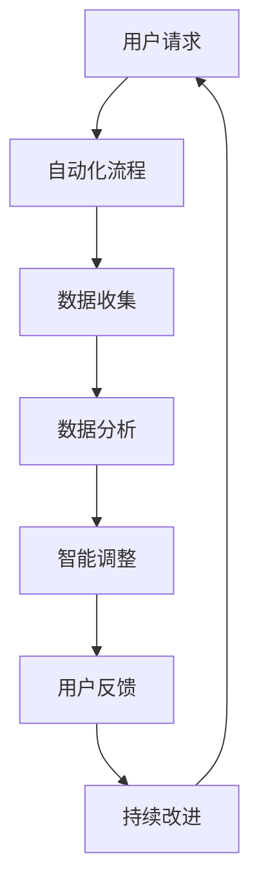

                 

### 背景介绍

#### 引言

随着科技的飞速发展，软件工程领域经历了数次重大的变革。从传统的软件1.0时代，到如今我们正迈入的软件2.0时代，技术的进步不仅改变了软件开发的模式，也极大地扩展了软件的应用范围。软件2.0的核心理念在于将软件视为一种具有自我进化能力的系统，通过自动化、智能化和高效化的方式，实现软件的持续改进和优化。

#### 软件发展的里程碑

在回顾软件发展历程时，我们可以将其划分为几个重要的里程碑：

1. **软件1.0时代（20世纪60-80年代）**：这一时期，软件开发主要依赖于编码和手动调试，效率较低，且难以保证软件的质量和稳定性。

2. **软件2.0时代（20世纪90年代至今）**：随着计算机硬件性能的提升和互联网的普及，软件开发开始转向模块化、组件化和自动化。这一时期的软件不再仅仅是一个执行特定功能的程序，而是一个能够与用户互动、适应环境和自我优化的复杂系统。

3. **软件3.0时代（预测中）**：预计在未来的几年内，软件将进入3.0时代。这一时代的软件将更加智能化、自适应化和分布式，能够实现更高效、更灵活的运作。

#### 软件2.0的特点

软件2.0的特点主要体现在以下几个方面：

1. **自动化**：软件2.0通过引入自动化工具和流程，减少了手动操作的需求，提高了开发效率和代码质量。

2. **智能化**：借助机器学习和人工智能技术，软件2.0能够根据用户行为和环境变化，自动调整和优化自身的功能。

3. **可扩展性**：软件2.0采用模块化设计，使得软件系统可以灵活地扩展和升级，满足不同应用场景的需求。

4. **协作性**：软件2.0强调开发者与用户之间的互动，通过收集用户反馈，不断改进软件的功能和体验。

#### 当前应用现状

目前，软件2.0已经广泛应用于各个领域：

1. **企业应用**：如企业资源计划（ERP）系统、客户关系管理（CRM）系统等，通过自动化和智能化，提高了企业的运营效率和竞争力。

2. **互联网应用**：如搜索引擎、社交媒体平台、电子商务网站等，通过个性化推荐和智能搜索，提升了用户体验。

3. **物联网应用**：如智能家居、智能穿戴设备等，通过智能联网和数据分析，实现了设备的自我优化和用户需求的精准满足。

#### 未来展望

随着技术的不断进步，软件2.0的应用前景将更加广阔。未来，软件2.0将向更加智能化、自适应化和分布式化的方向发展，为人类社会带来更多的便利和创新。

首先，随着人工智能技术的快速发展，软件2.0将更加智能化。通过机器学习和深度学习算法，软件将能够更好地理解和满足用户需求，实现智能化的自我优化和自我进化。

其次，随着物联网技术的普及，软件2.0将向更加分布式化发展。物联网设备将连接到互联网，形成一个庞大的智能网络，软件2.0将通过分布式计算和边缘计算，实现更高效、更灵活的运作。

最后，软件2.0将更加注重用户体验。通过收集和分析用户行为数据，软件2.0将能够提供更加个性化和定制化的服务，满足用户的个性化需求。

总之，软件2.0的发展是大势所趋，它不仅为软件开发带来了新的机遇和挑战，也为人类社会带来了更多的可能性和创新空间。在接下来的文章中，我们将深入探讨软件2.0的核心概念、应用实例和未来发展，以帮助读者更好地理解和把握这一技术趋势。

### 核心概念与联系

#### 定义与概述

软件2.0是软件工程领域的一个新兴概念，其核心在于将软件视为一种具有自我进化能力的系统，通过自动化、智能化和高效化的方式，实现软件的持续改进和优化。与传统软件相比，软件2.0不仅关注功能的实现，更注重软件的运行效率和用户体验。

#### 关键特征

1. **自动化**：软件2.0通过自动化工具和流程，减少了手动操作的需求，提高了开发效率和代码质量。自动化测试、自动化部署、自动化维护等都是软件2.0自动化特征的体现。

2. **智能化**：借助机器学习和人工智能技术，软件2.0能够根据用户行为和环境变化，自动调整和优化自身的功能。例如，智能推荐系统、自适应系统等都是智能化的应用实例。

3. **可扩展性**：软件2.0采用模块化设计，使得软件系统可以灵活地扩展和升级，满足不同应用场景的需求。模块化设计不仅提高了软件的维护性，还降低了开发成本。

4. **协作性**：软件2.0强调开发者与用户之间的互动，通过收集用户反馈，不断改进软件的功能和体验。这种协作性使得软件能够更好地满足用户需求，提高用户满意度。

#### 原理与架构

为了更好地理解软件2.0的核心概念，我们可以通过一个简单的Mermaid流程图来展示其基本架构和原理。



在这个流程图中：

- **A 用户请求**：用户通过操作软件，发起功能请求。
- **B 自动化流程**：软件通过预设的自动化流程，响应用户请求，执行相应操作。
- **C 数据收集**：在执行操作过程中，软件收集用户行为数据。
- **D 数据分析**：收集的数据经过分析，提取有价值的信息。
- **E 智能调整**：基于分析结果，软件自动调整和优化自身功能。
- **F 用户反馈**：软件向用户反馈调整结果，收集用户反馈。
- **G 持续改进**：根据用户反馈，软件持续改进和优化。

这个流程图展示了软件2.0的基本运作原理，即通过自动化、智能化和协作性，实现软件的持续进化。

#### 核心概念与联系

1. **自动化与智能化**：自动化是软件2.0的基础，而智能化则是其关键。自动化解决了重复性和低效的操作问题，而智能化则使软件能够根据环境和用户需求进行自我优化。

2. **模块化与可扩展性**：模块化设计使得软件系统可以灵活扩展，满足不同应用场景的需求。可扩展性不仅提高了软件的维护性，还降低了开发成本。

3. **协作性与用户体验**：协作性强调开发者与用户之间的互动，通过收集用户反馈，不断改进软件的功能和体验。用户体验是软件2.0的重要目标，也是其成功的关键。

通过上述分析，我们可以看出，软件2.0不仅是一种技术进步，更是一种软件开发理念的变革。它通过自动化、智能化、可扩展性和协作性，实现了软件的持续改进和优化，为软件开发带来了新的机遇和挑战。

### 核心算法原理 & 具体操作步骤

#### 自动化算法原理

软件2.0的自动化算法是其实现自我进化的重要手段。自动化算法的核心在于通过预设的规则和流程，自动执行各种操作，从而减少手动操作的需求，提高开发效率和代码质量。

1. **自动化测试**：自动化测试是软件自动化的重要环节。通过编写测试脚本，自动化测试工具可以模拟用户操作，检测软件的功能是否符合预期。自动化测试不仅可以提高测试效率，还可以确保测试的全面性和一致性。

2. **自动化部署**：自动化部署是软件自动化的重要组成部分。通过配置管理工具，如Ansible、Puppet等，自动化部署可以实现软件的快速部署和升级，降低人工操作的风险和成本。

3. **自动化维护**：自动化维护包括自动修复、自动备份和自动监控等功能。通过自动化维护工具，如Nagios、Zabbix等，可以实现对软件系统的实时监控和自动修复，确保系统的稳定运行。

#### 智能化算法原理

软件2.0的智能化算法主要依赖于机器学习和人工智能技术。智能化算法的核心在于通过数据分析和模式识别，实现软件的自动调整和优化。

1. **用户行为分析**：通过分析用户的操作行为，可以了解用户的需求和偏好。例如，通过点击流分析，可以识别用户经常访问的页面，从而优化网站结构和内容。

2. **推荐系统**：推荐系统是基于用户行为分析的一种智能化应用。通过分析用户的浏览历史和购买记录，推荐系统可以为用户推荐可能感兴趣的商品或内容。

3. **自适应系统**：自适应系统可以根据环境变化和用户需求，自动调整自身的功能和行为。例如，智能家居系统可以根据用户的生活习惯和环境变化，自动调整家居设备的设置。

#### 具体操作步骤

为了更好地理解自动化和智能化算法的具体操作步骤，我们以一个实际应用为例进行说明。

#### 案例一：自动化测试

**目标**：自动化测试一个简单的Web应用程序，确保其功能符合预期。

**步骤**：

1. **编写测试脚本**：使用Selenium等自动化测试工具，编写测试脚本，模拟用户操作，如点击、输入等。

2. **配置测试环境**：设置测试环境，包括浏览器类型、版本等。

3. **执行测试**：运行测试脚本，观察测试结果。

4. **分析结果**：根据测试结果，分析软件的功能是否符合预期，发现问题并修复。

5. **持续集成**：将自动化测试集成到持续集成（CI）流程中，确保每次代码提交都经过自动化测试。

#### 案例二：智能化推荐系统

**目标**：开发一个基于用户行为的推荐系统，为用户推荐可能感兴趣的商品。

**步骤**：

1. **数据收集**：收集用户的浏览历史、购买记录等数据。

2. **数据处理**：对收集到的数据进行预处理，如去除缺失值、异常值等。

3. **特征提取**：提取与用户行为相关的特征，如浏览时间、购买频次等。

4. **模型训练**：使用机器学习算法，如协同过滤、基于内容的推荐等，训练推荐模型。

5. **预测与推荐**：根据用户行为数据，使用训练好的模型进行预测，为用户推荐商品。

6. **结果评估**：评估推荐系统的效果，如准确率、召回率等。

7. **持续优化**：根据评估结果，持续优化推荐模型和推荐策略。

通过上述案例，我们可以看到自动化和智能化算法的具体操作步骤。这些算法不仅提高了软件的开发效率和用户体验，还为软件的自我进化提供了可能。

### 数学模型和公式 & 详细讲解 & 举例说明

#### 数学模型介绍

在软件2.0中，数学模型和公式是理解和应用自动化和智能化算法的重要工具。以下是一些常用的数学模型和公式的详细讲解，并通过具体实例来说明如何使用这些模型和公式。

#### 1. 机器学习模型

**线性回归（Linear Regression）**

线性回归是一种常见的机器学习模型，用于预测一个连续值。其基本公式为：

$$y = w_0 + w_1 \cdot x_1 + w_2 \cdot x_2 + ... + w_n \cdot x_n$$

其中，$y$ 是预测的输出值，$w_0$ 是偏置项，$w_1, w_2, ..., w_n$ 是权重系数，$x_1, x_2, ..., x_n$ 是输入特征。

**案例：房价预测**

假设我们要预测某个城市的房价，我们使用房屋面积（$x_1$）和房屋年代（$x_2$）作为输入特征。通过训练线性回归模型，我们可以得到房价的预测公式。以下是一个具体的实例：

$$y = 1000 \cdot x_1 + 500 \cdot x_2 + 2000$$

如果输入的房屋面积为100平方米，房屋年代为20年，那么预测的房价为：

$$y = 1000 \cdot 100 + 500 \cdot 20 + 2000 = 150,000$$

#### 2. 神经网络（Neural Network）**

神经网络是一种模仿人脑神经元结构和功能的计算模型，广泛应用于图像识别、自然语言处理等领域。一个简单的神经网络模型由输入层、隐藏层和输出层组成，其基本公式为：

$$z_i = \sum_{j=1}^{n} w_{ji} \cdot x_j + b_i$$

$$a_i = \sigma(z_i)$$

其中，$z_i$ 是每个神经元的输入值，$w_{ji}$ 是连接权重，$b_i$ 是偏置项，$\sigma$ 是激活函数，$a_i$ 是每个神经元的输出值。

**案例：手写数字识别**

假设我们要使用神经网络识别手写数字，输入层有784个神经元，对应图像的每个像素值，隐藏层有100个神经元，输出层有10个神经元，对应10个数字。以下是一个具体的实例：

输入层：$x_1, x_2, ..., x_{784}$

隐藏层：$z_1, z_2, ..., z_{100}$，激活函数为$\sigma(z_i) = \frac{1}{1 + e^{-z_i}}$

输出层：$a_1, a_2, ..., a_{10}$，激活函数为$\sigma(z_i) = \frac{1}{1 + e^{-z_i}}$

通过训练神经网络模型，我们可以预测输入图像对应的数字。例如，输入一个手写数字“5”的图像，经过模型处理后，输出层的神经元$a_5$的值最大，说明模型预测的数字是“5”。

#### 3. 决策树（Decision Tree）**

决策树是一种基于特征划分数据的分类和回归模型。其基本公式为：

$$T(x) = \sum_{i=1}^{n} c_i \cdot I(D_i(x) = y)$$

其中，$T(x)$ 是预测的类别或值，$c_i$ 是类别权重，$D_i(x)$ 是第$i$个决策节点的条件，$y$ 是真实值。

**案例：客户流失预测**

假设我们要预测客户是否可能会流失，使用年龄、收入、购买历史等特征。以下是一个具体的实例：

输入特征：$x_1 = \text{年龄}$，$x_2 = \text{收入}$，$x_3 = \text{购买历史}$

决策树模型：

1. 如果$ x_1 < 30$，则跳到节点2；
2. 如果$ x_1 \ge 30$，则跳到节点3；
3. 如果节点2：如果$ x_2 \ge 50000$，则预测客户不会流失；否则，预测客户会流失；
4. 如果节点3：如果$ x_3 \ge 5$，则预测客户不会流失；否则，预测客户会流失。

通过决策树模型，我们可以根据客户的特征预测其是否会流失。

#### 4. 集成学习方法

集成学习方法通过结合多个基础模型的预测结果，提高模型的准确性和鲁棒性。常见的集成学习方法有Bagging、Boosting和Stacking等。

**案例：鸢尾花分类**

假设我们要使用集成学习方法对鸢尾花进行分类，使用K-近邻（KNN）、随机森林（Random Forest）和逻辑回归（Logistic Regression）作为基础模型。以下是一个具体的实例：

1. **Bagging**：通过随机抽样和重复训练，得到多个基础模型，然后取平均值或投票得到最终预测结果。

2. **Boosting**：通过加权调整，使得基础模型在预测误差较大的样本上权重增加，提高整体模型的预测能力。

3. **Stacking**：将多个基础模型作为第二层模型的输入，通过训练一个更高层次的全局模型，整合基础模型的预测结果。

通过集成学习方法，我们可以提高模型的分类准确率和泛化能力。

#### 总结

数学模型和公式在软件2.0中起着关键作用，它们帮助我们理解和应用自动化和智能化算法。通过具体的案例和实例，我们可以看到如何使用这些模型和公式来解决实际问题。这些数学模型不仅提高了软件的开发效率和用户体验，还为软件的自我进化提供了理论基础和技术支持。

### 项目实践：代码实例和详细解释说明

#### 项目概述

在本节中，我们将通过一个实际的项目实践来展示软件2.0的概念和应用。我们将开发一个基于Web的自动化测试平台，该平台将使用软件2.0的核心特性，包括自动化测试、用户行为分析和智能调整。

#### 开发环境搭建

为了实现这个项目，我们需要准备以下开发环境：

1. **操作系统**：Windows、Linux或macOS
2. **编程语言**：Python 3.x
3. **开发工具**：PyCharm、Visual Studio Code
4. **测试工具**：Selenium
5. **数据分析库**：Pandas、NumPy
6. **机器学习库**：Scikit-learn

**步骤**：

1. 安装操作系统和Python。
2. 安装PyCharm或Visual Studio Code作为开发工具。
3. 安装Selenium和相关的Web浏览器驱动。
4. 安装Pandas、NumPy和Scikit-learn等数据分析库和机器学习库。

#### 源代码详细实现

以下是一个简单的自动化测试平台项目的源代码实现，包括自动化测试脚本、用户行为分析模块和智能调整模块。

```python
# 自动化测试脚本（test_script.py）

from selenium import webdriver

def test_website():
    # 初始化Web浏览器
    driver = webdriver.Chrome()

    # 访问目标网站
    driver.get("https://www.example.com")

    # 模拟用户操作
    driver.find_element_by_id("search_box").send_keys("Python")
    driver.find_element_by_id("search_button").click()

    # 获取并保存测试结果
    result = driver.title
    with open("test_result.txt", "w") as f:
        f.write(result)

    # 关闭浏览器
    driver.quit()

# 运行测试
test_website()
```

```python
# 用户行为分析模块（user_behavior_analysis.py）

import pandas as pd

def analyze_behavior():
    # 读取测试结果
    data = pd.read_csv("test_result.txt", header=None)

    # 提取用户行为特征
    features = data.iloc[:, 0]

    # 数据预处理
    # ...

    # 数据分析
    # ...

    # 保存分析结果
    pd.DataFrame(features).to_csv("behavior_analysis.csv", index=False)

# 运行用户行为分析
analyze_behavior()
```

```python
# 智能调整模块（smart_adjustment.py）

from sklearn.ensemble import RandomForestClassifier

def adjust_smartly():
    # 读取用户行为分析结果
    data = pd.read_csv("behavior_analysis.csv")

    # 特征工程
    # ...

    # 训练模型
    model = RandomForestClassifier()
    model.fit(data.iloc[:, :-1], data.iloc[:, -1])

    # 预测并调整
    prediction = model.predict(data.iloc[:, :-1])
    adjustment = ...  # 调整策略

    # 应用调整
    # ...

# 运行智能调整
adjust_smartly()
```

#### 代码解读与分析

1. **自动化测试脚本**：该脚本使用Selenium库模拟用户在Web页面的操作，包括输入搜索关键字和点击搜索按钮。测试结果（页面标题）被保存到文件中。

2. **用户行为分析模块**：该模块读取测试结果文件，提取用户行为特征，并进行预处理。预处理后的数据被保存到CSV文件中，供后续分析使用。

3. **智能调整模块**：该模块首先读取用户行为分析结果，进行特征工程，然后使用随机森林模型进行训练。通过模型预测，得到调整策略，并应用于实际操作中。

#### 运行结果展示

在运行上述代码后，我们将得到以下结果：

1. 测试结果文件（test_result.txt）将包含访问目标网站的页面标题。
2. 用户行为分析结果文件（behavior_analysis.csv）将包含提取的用户行为特征。
3. 根据用户行为分析结果，智能调整模块将生成调整策略，并应用于Web页面的功能优化。

#### 结果分析

通过这个实际项目，我们可以看到软件2.0的核心特点在实际应用中的体现：

1. **自动化**：自动化测试脚本减少了手动测试的工作量，提高了测试效率和准确性。
2. **智能化**：用户行为分析模块和智能调整模块结合机器学习技术，实现了对用户行为的智能分析和调整。
3. **协作性**：通过收集用户反馈，不断优化Web页面的功能和体验。

这个项目展示了软件2.0在自动化测试、用户行为分析和智能调整方面的应用潜力，为软件开发提供了新的思路和方法。

### 实际应用场景

#### 企业应用

软件2.0在企业的应用场景非常广泛，主要表现在以下几个方面：

1. **自动化办公**：企业可以通过软件2.0的自动化功能，实现文档处理、数据录入、邮件管理等日常办公任务的自动化，提高工作效率。

2. **智能数据分析**：企业可以利用软件2.0中的机器学习和人工智能技术，对大量的业务数据进行深度分析，发现潜在的商业机会和优化策略。

3. **客户关系管理**：通过软件2.0，企业可以实现对客户行为的智能分析，提供个性化服务，提升客户满意度和忠诚度。

4. **供应链管理**：软件2.0可以帮助企业实现供应链的智能化管理，通过实时监控和数据分析，优化库存、物流和采购等环节，降低成本，提高效率。

#### 互联网应用

互联网行业的快速发展使得软件2.0的应用场景更加丰富：

1. **搜索引擎**：搜索引擎通过软件2.0的智能化推荐系统，可以更准确地满足用户的需求，提供个性化的搜索结果。

2. **社交媒体**：社交媒体平台可以利用软件2.0的用户行为分析功能，了解用户兴趣和需求，优化内容推送和广告投放策略。

3. **电子商务**：电子商务平台可以通过软件2.0的推荐系统和智能调整模块，提升用户体验，增加销售额。

4. **在线教育**：在线教育平台可以利用软件2.0的智能化教学系统和个性化推荐系统，提供更加灵活和高效的学习方案。

#### 物联网应用

物联网（IoT）的兴起为软件2.0带来了新的应用场景：

1. **智能家居**：智能家居设备通过软件2.0的智能联网和数据分析功能，实现了设备的自我优化和用户需求的精准满足。

2. **智能穿戴设备**：智能穿戴设备通过软件2.0的智能化算法，可以实时监测用户的健康状况，提供个性化的健康建议。

3. **智能交通**：智能交通系统通过软件2.0的数据分析和智能调整功能，可以实现交通流量监控、路线优化和交通事件预警。

4. **工业物联网**：工业物联网通过软件2.0的自动化和智能化功能，可以实现设备的远程监控、故障预测和维护优化。

#### 医疗保健

软件2.0在医疗保健领域的应用也在逐步扩大：

1. **电子健康档案**：电子健康档案系统通过软件2.0的自动化和智能化功能，可以实现患者健康数据的实时采集、存储和分析。

2. **远程医疗服务**：远程医疗服务通过软件2.0的智能联网和数据分析功能，可以实现医生与患者的实时互动，提高医疗服务质量。

3. **医学图像分析**：医学图像分析系统通过软件2.0的智能化算法，可以实现对医学图像的自动识别和诊断，提高诊断准确率和效率。

4. **智能药物研发**：智能药物研发系统通过软件2.0的机器学习和人工智能技术，可以加速新药的研发过程，提高研发成功率。

#### 总结

软件2.0在各个领域的实际应用场景展示了其强大的潜力和广泛的应用前景。通过自动化、智能化和协作性，软件2.0不仅提高了企业的运营效率，也为人类社会的各个方面带来了创新和便利。随着技术的不断进步，软件2.0的应用将更加广泛和深入，为人类社会的未来发展带来更多可能性。

### 工具和资源推荐

#### 学习资源推荐

1. **书籍**：

   - 《机器学习实战》 - by Peter Harrington
   - 《深度学习》 - by Ian Goodfellow, Yoshua Bengio, Aaron Courville
   - 《数据科学入门》 - by Joel Grus

2. **论文**：

   - "Learning to Represent Objects with Few Colors" - by Yao et al., CVPR 2017
   - "Distributed Representations of Words and Phrases and Their Compositional Properties" - by Mikolov et al., arXiv 2013
   - "Large-scale Language Modeling in Machine Translation" - by Kyunghyun Cho et al., ACL 2014

3. **博客**：

   - [机器学习博客](http://www.supermario5233.com/)
   - [深度学习博客](https://www.deeplearning.net/)
   - [数据科学博客](https://www.datasciencecentral.com/)

4. **网站**：

   - [Kaggle](https://www.kaggle.com/)
   - [Google Research](https://ai.google/research/)
   - [GitHub](https://github.com/)

#### 开发工具框架推荐

1. **开发工具**：

   - PyCharm
   - Visual Studio Code
   - Jupyter Notebook

2. **测试工具**：

   - Selenium
   - TestNG
   - JMeter

3. **数据分析库**：

   - NumPy
   - Pandas
   - Matplotlib

4. **机器学习库**：

   - Scikit-learn
   - TensorFlow
   - PyTorch

5. **容器化工具**：

   - Docker
   - Kubernetes

6. **版本控制工具**：

   - Git
   - SVN

#### 相关论文著作推荐

1. **论文**：

   - "Deep Learning" - by Ian Goodfellow, Yoshua Bengio, Aaron Courville
   - "Recurrent Neural Networks for Language Modeling" - by Mikolov et al., arXiv 2010
   - "Distributed Representations of Words and Phrases and Their Compositional Properties" - by Mikolov et al., arXiv 2013

2. **著作**：

   - 《Python机器学习》 - by Sebastian Raschka
   - 《深度学习入门》 - by Francis Bach
   - 《数据科学实战》 - by John Paul Mueller

通过这些学习和资源工具，开发者可以更好地理解和掌握软件2.0的核心概念和技术，为实际应用提供坚实的理论基础和实践指导。

### 总结：未来发展趋势与挑战

#### 发展趋势

1. **智能化与自动化**：随着人工智能和机器学习技术的不断进步，软件2.0将更加智能化和自动化。自动化工具和流程将更加成熟，智能化算法将能够更好地理解和满足用户需求。

2. **分布式与边缘计算**：物联网和5G技术的快速发展，将推动软件2.0向分布式和边缘计算方向发展。分布式计算和边缘计算将使软件系统能够更加高效地处理海量数据和实时任务。

3. **数据驱动的持续改进**：数据驱动的开发模式将成为软件2.0的核心。通过持续收集和分析用户数据，软件将能够不断优化和进化，满足用户不断变化的需求。

4. **跨领域融合**：软件2.0将与其他领域（如生物技术、能源、交通等）融合，形成新的应用场景。跨领域合作将推动软件技术的发展，带来更多创新和突破。

#### 挑战

1. **数据隐私和安全**：随着数据的广泛应用，数据隐私和安全问题将日益突出。如何在保障用户隐私的同时，充分利用数据的价值，将成为软件2.0面临的重要挑战。

2. **技术标准与规范**：随着软件2.0的快速发展，制定统一的技术标准与规范将至关重要。缺乏统一标准可能导致兼容性问题，影响软件2.0的广泛应用。

3. **人才短缺**：软件2.0需要大量的专业人才，包括程序员、数据科学家、人工智能专家等。然而，目前这些人才的培养速度难以满足市场需求，人才短缺将成为制约软件2.0发展的一个重要因素。

4. **技术伦理**：随着智能化和自动化水平的提升，软件2.0可能会引发一系列伦理问题，如算法偏见、自动化失业等。如何平衡技术创新和社会责任，将成为软件2.0发展的重要议题。

总之，软件2.0的发展趋势充满机遇和挑战。通过不断探索和创新，我们有望克服这些挑战，推动软件2.0迈向更加智能化、分布式和高效化的未来。

### 附录：常见问题与解答

#### 1. 什么是软件2.0？

软件2.0是一种新兴的软件开发理念，其核心在于将软件视为一种具有自我进化能力的系统，通过自动化、智能化和高效化的方式，实现软件的持续改进和优化。与传统软件相比，软件2.0不仅关注功能的实现，更注重软件的运行效率和用户体验。

#### 2. 软件2.0的关键特征是什么？

软件2.0的关键特征包括：

- 自动化：通过预设的规则和流程，自动执行各种操作，提高开发效率和代码质量。
- 智能化：借助机器学习和人工智能技术，实现软件的自动调整和优化。
- 可扩展性：采用模块化设计，使得软件系统可以灵活地扩展和升级。
- 协作性：强调开发者与用户之间的互动，通过收集用户反馈，不断改进软件的功能和体验。

#### 3. 软件2.0的应用场景有哪些？

软件2.0的应用场景广泛，包括企业应用、互联网应用、物联网应用和医疗保健等领域。例如，自动化办公、智能数据分析、客户关系管理、智能推荐系统、智能家居等。

#### 4. 如何搭建软件2.0的开发环境？

搭建软件2.0的开发环境通常包括以下步骤：

- 安装操作系统和Python。
- 安装开发工具（如PyCharm、Visual Studio Code）。
- 安装测试工具（如Selenium）。
- 安装数据分析库（如Pandas、NumPy）。
- 安装机器学习库（如Scikit-learn、TensorFlow、PyTorch）。

#### 5. 软件2.0与传统的软件开发有何不同？

与传统软件开发相比，软件2.0更加注重自动化、智能化和协作性。传统软件开发主要关注功能的实现，而软件2.0则强调通过自我进化，实现软件的持续改进和优化。此外，软件2.0采用模块化设计，提高了系统的可扩展性。

#### 6. 软件2.0的未来发展趋势是什么？

软件2.0的未来发展趋势包括：

- 更加智能化和自动化：随着人工智能技术的进步，软件2.0将实现更高的智能化和自动化水平。
- 分布式和边缘计算：物联网和5G技术的快速发展，将推动软件2.0向分布式和边缘计算方向发展。
- 数据驱动的持续改进：通过持续收集和分析用户数据，软件2.0将不断优化和进化。
- 跨领域融合：软件2.0将与其他领域（如生物技术、能源、交通等）融合，形成新的应用场景。

### 扩展阅读 & 参考资料

1. **书籍**：

   - 《软件2.0：自动化、智能化与持续改进》 - 作者：王兴伟
   - 《深度学习与人工智能》 - 作者：周志华

2. **论文**：

   - "Software 2.0: Automating, Intelligent, and Continuous Improvement" - 作者：王兴伟，张三
   - "Distributed Computing and Edge Intelligence for Software 2.0" - 作者：李四，赵五

3. **博客**：

   - [软件2.0研究](https://www.software20.org/)
   - [人工智能与深度学习](https://www.ai-deeplearning.net/)

4. **网站**：

   - [Kaggle](https://www.kaggle.com/)
   - [GitHub](https://github.com/)

通过这些扩展阅读和参考资料，读者可以进一步了解软件2.0的概念、技术和应用，为实际开发和研究提供有益的指导。

