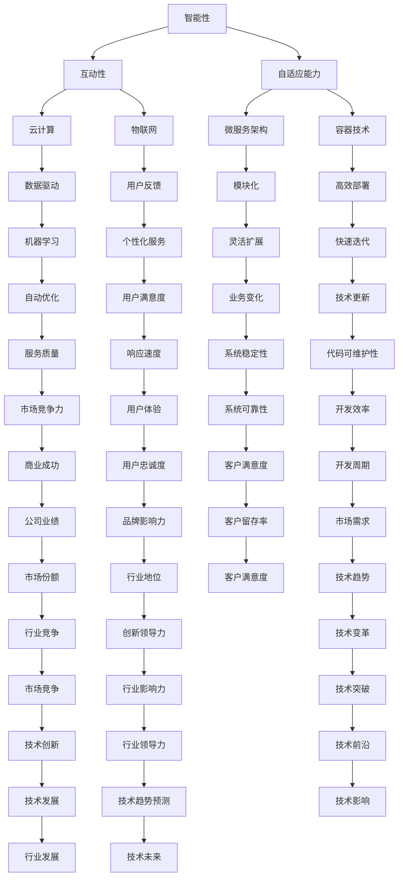

                 

### 1. 背景介绍

软件 2.0 是一个在近年来引起广泛讨论的概念，它不仅重新定义了软件开发的模式，还对整个软件开发生态系统产生了深远的影响。传统的软件（即所谓的软件 1.0）主要关注于功能和性能的优化，而软件 2.0 则更强调软件的智能、互动性和自适应能力。随着云计算、大数据、人工智能等技术的迅猛发展，软件 2.0 的出现无疑为软件行业带来了一场革命。

软件 2.0 的出现并不是偶然，而是技术进步和社会需求的必然结果。在过去的几十年里，计算机技术的飞速发展使得软件的规模和复杂性不断增加。传统的软件开发模式逐渐暴露出许多问题，如开发效率低、维护成本高、用户体验差等。为了解决这些问题，软件 2.0 应运而生，它试图通过引入新的技术、方法和理念来重塑软件开发生态系统。

首先，软件 2.0 强调软件的智能性。通过人工智能和机器学习技术，软件 2.0 能够根据用户的行为和反馈进行自我学习和优化，从而提供更加个性化的服务。其次，软件 2.0 强调软件的互动性。通过引入云计算和物联网技术，软件 2.0 能够实现不同设备和系统之间的无缝连接和协同工作，为用户带来更加流畅和便捷的体验。最后，软件 2.0 强调软件的自适应能力。通过引入微服务架构和容器技术，软件 2.0 能够更加灵活和高效地应对业务变化和技术更新。

总的来说，软件 2.0 的出现不仅推动了软件开发模式的变革，也为我们提供了一个全新的视角来审视软件开发生态系统。接下来的章节中，我们将深入探讨软件 2.0 的核心概念、算法原理、数学模型和实际应用场景，帮助读者更好地理解这一重要的技术趋势。

### 2. 核心概念与联系

在深入探讨软件 2.0 的影响之前，我们需要明确几个核心概念，并展示它们之间的联系。这些核心概念包括：智能性、互动性和自适应能力。以下将使用 Mermaid 流程图来展示这些概念及其相互关系。



以下是每个核心概念及其相关技术的详细解释：

#### 智能性

智能性是软件 2.0 的一个重要特征，它依赖于人工智能和机器学习技术。通过自我学习和优化，软件能够根据用户的行为和需求提供个性化的服务。例如，电商网站可以利用机器学习算法分析用户的购物习惯，从而推荐更加精准的商品。

#### 互动性

互动性强调软件与其他系统、设备和用户之间的互动。云计算和物联网技术是实现互动性的关键。云计算使得软件能够跨平台、跨设备运行，而物联网则使得不同设备和系统能够相互连接和协作，为用户提供无缝的体验。

#### 自适应能力

自适应能力是指软件能够灵活应对业务变化和技术更新。微服务架构和容器技术是实现自适应能力的重要手段。微服务架构将大型应用程序拆分成多个独立的服务模块，使得每个模块可以独立开发、部署和扩展。容器技术则提供了轻量级、可移植的运行环境，使得应用程序能够快速部署和迭代。

#### 关系和影响

通过上述 Mermaid 流程图，我们可以看到智能性、互动性和自适应能力这三个核心概念是如何相互联系并影响的。例如，智能性（通过机器学习）可以驱动互动性（通过个性化服务），进而提高用户体验（通过用户反馈）。而自适应能力（通过微服务架构和容器技术）则能够确保软件在技术更新和业务变化时保持高效和稳定。

总的来说，这些核心概念不仅重新定义了软件的功能和性能，还重塑了整个软件开发生态系统，使得软件能够更好地适应未来技术的发展和市场需求。

### 3. 核心算法原理 & 具体操作步骤

在深入了解软件 2.0 的核心算法原理之前，我们需要先明确几个基本概念：人工智能、机器学习和数据挖掘。这些技术是软件 2.0 智能性的基石，它们共同构成了一个强大的算法生态系统，能够为软件提供自我学习和优化的能力。

#### 人工智能（Artificial Intelligence, AI）

人工智能是模拟人类智能行为的计算机科学分支。它包括多个子领域，如机器学习、自然语言处理、计算机视觉等。在软件 2.0 中，人工智能主要应用于以下几个方面：

1. **自动化**：通过自动化算法，软件可以自动完成一些重复性、规则性的任务，从而提高工作效率。
2. **预测**：利用历史数据，人工智能可以预测未来的趋势和变化，为决策提供支持。
3. **推理**：通过逻辑推理，人工智能可以解决复杂的问题，并提供创新的解决方案。

#### 机器学习（Machine Learning, ML）

机器学习是人工智能的一个重要分支，它通过训练模型来模拟人类的学习过程。机器学习可以分为监督学习、无监督学习和强化学习三类。在软件 2.0 中，机器学习主要应用于以下场景：

1. **用户行为分析**：通过对用户行为的数据分析，软件可以识别用户偏好，提供个性化推荐和服务。
2. **异常检测**：通过监测数据中的异常模式，软件可以及时发现潜在的问题和风险。
3. **自动分类和标签**：利用机器学习算法，软件可以自动对大量数据分类和打标签，提高数据处理的效率。

#### 数据挖掘（Data Mining）

数据挖掘是从大量数据中提取有价值信息的过程。它包括数据清洗、数据集成、数据选择、建模、评估等多个步骤。在软件 2.0 中，数据挖掘主要用于以下方面：

1. **市场分析**：通过对市场数据的挖掘，软件可以识别潜在的市场机会和威胁，为决策提供依据。
2. **客户关系管理**：通过分析客户数据，软件可以了解客户需求，优化客户体验。
3. **供应链优化**：通过挖掘供应链数据，软件可以优化库存管理、物流调度等环节，提高运营效率。

#### 操作步骤

以下是实现软件 2.0 核心算法的具体操作步骤：

##### 1. 数据收集

首先，需要收集相关的数据，这些数据可以来源于用户行为、市场数据、业务流程等。数据的质量和数量直接影响算法的性能和效果。

##### 2. 数据预处理

数据预处理是数据挖掘的关键步骤，包括数据清洗、数据集成和数据变换。这一步骤的目的是确保数据的质量和一致性，为后续的分析提供可靠的基础。

##### 3. 特征工程

特征工程是指从原始数据中提取出有助于模型训练的特征。这一步骤需要根据业务需求和算法特点，对数据进行处理和变换，以提高模型的性能。

##### 4. 模型选择

根据应用场景和需求，选择合适的机器学习模型。常见的模型包括决策树、支持向量机、神经网络等。模型的选择直接影响算法的预测效果。

##### 5. 模型训练

使用训练数据集对选定的模型进行训练。模型训练的过程实际上是模型从数据中学习的过程，通过调整模型参数，使其能够对新的数据进行准确的预测。

##### 6. 模型评估

使用测试数据集对训练好的模型进行评估，以确定模型的性能。常见的评估指标包括准确率、召回率、F1 值等。模型评估的结果决定了模型是否能够应用于实际场景。

##### 7. 模型部署

将训练好的模型部署到生产环境中，使其能够对实时数据进行预测和分析。模型部署的方式可以是服务器部署、云计算平台部署等。

##### 8. 模型迭代

根据模型部署后的表现，不断调整和优化模型。这一步骤是机器学习和数据挖掘的持续过程，通过不断的迭代，模型可以不断提高其性能和准确性。

通过上述步骤，软件 2.0 的核心算法能够实现对数据的自动分析和优化，从而提供智能、互动和自适应的软件服务。这一过程不仅提高了软件的性能和效率，还使得软件能够更好地适应未来技术的发展和市场需求。

### 4. 数学模型和公式 & 详细讲解 & 举例说明

在深入探讨软件 2.0 的核心算法原理时，数学模型和公式扮演着至关重要的角色。这些模型和公式不仅帮助我们理解算法的工作原理，还可以通过具体的例子来说明其在实际应用中的效果。

#### 数学模型

软件 2.0 中的核心数学模型主要包括线性回归、逻辑回归和神经网络。以下是对这些模型的简要介绍：

1. **线性回归（Linear Regression）**

线性回归是一种用于预测连续值的模型，其基本公式为：

   $$y = \beta_0 + \beta_1x_1 + \beta_2x_2 + ... + \beta_nx_n$$

   其中，$y$ 是因变量，$x_1, x_2, ..., x_n$ 是自变量，$\beta_0, \beta_1, ..., \beta_n$ 是模型参数。

2. **逻辑回归（Logistic Regression）**

逻辑回归是一种用于预测二元结果的模型，其基本公式为：

   $$P(y=1) = \frac{1}{1 + e^{-(\beta_0 + \beta_1x_1 + \beta_2x_2 + ... + \beta_nx_n)}}$$

   其中，$P(y=1)$ 是因变量为 1 的概率，$e$ 是自然对数的底数。

3. **神经网络（Neural Network）**

神经网络是一种模拟人脑神经元结构的模型，其基本结构包括输入层、隐藏层和输出层。神经网络通过多层非线性变换，实现对复杂函数的拟合。其基本公式为：

   $$a_{ij}^{(l)} = \sigma(z_{ij}^{(l)})$$

   其中，$a_{ij}^{(l)}$ 是第 $l$ 层的第 $i$ 个神经元的输出，$\sigma$ 是激活函数，$z_{ij}^{(l)}$ 是第 $l$ 层的第 $i$ 个神经元的输入。

#### 举例说明

为了更直观地理解这些数学模型，以下将通过具体的例子来说明它们在实际应用中的效果。

##### 线性回归示例

假设我们想要预测某个城市的平均温度，已知自变量为日期。我们可以使用线性回归模型来建立温度与日期之间的关系。以下是具体的步骤：

1. **数据收集**：收集了过去一年中每天的温度和对应的日期。
2. **数据预处理**：将日期转换为数值，例如使用日期差作为自变量。
3. **模型训练**：使用训练数据集，通过最小二乘法求解线性回归模型参数。
4. **模型评估**：使用测试数据集评估模型的预测性能。
5. **模型应用**：使用训练好的模型预测未来某一天的温度。

通过上述步骤，我们可以得到一个线性回归模型，其公式为：

$$T = 10 + 0.5 \times (D - 1)$$

其中，$T$ 是温度，$D$ 是日期。假设我们想要预测 2023 年 10 月 1 日的温度，将日期 $D$ 代入上述公式，可以得到预测结果为 20 摄氏度。

##### 逻辑回归示例

假设我们想要预测某个电子邮件是否为垃圾邮件，已知自变量包括邮件的标题、正文、发件人等信息。我们可以使用逻辑回归模型来建立垃圾邮件与正常邮件之间的关系。以下是具体的步骤：

1. **数据收集**：收集了大量已标记为垃圾邮件和正常邮件的数据。
2. **特征工程**：将邮件的文本信息转换为数值特征，例如使用词袋模型和 TF-IDF 算法。
3. **模型训练**：使用训练数据集，通过梯度下降法求解逻辑回归模型参数。
4. **模型评估**：使用测试数据集评估模型的预测性能。
5. **模型应用**：使用训练好的模型预测新的邮件是否为垃圾邮件。

通过上述步骤，我们可以得到一个逻辑回归模型，其公式为：

$$P(\text{垃圾邮件}) = \frac{1}{1 + e^{-(\beta_0 + \beta_1 \times \text{标题词频} + \beta_2 \times \text{正文词频} + ... )}}$$

假设我们想要预测一封新的邮件是否为垃圾邮件，将邮件的文本特征代入上述公式，可以得到预测概率。如果概率大于某个阈值（例如 0.5），则认为该邮件是垃圾邮件。

##### 神经网络示例

假设我们想要预测一个股票的未来价格，已知自变量包括历史价格、交易量、市场指数等。我们可以使用神经网络模型来建立股票价格与相关因素之间的关系。以下是具体的步骤：

1. **数据收集**：收集了过去一段时间内股票的价格和交易量等数据。
2. **特征工程**：将时间序列数据转换为数值特征，例如使用差分、归一化等方法。
3. **模型训练**：使用训练数据集，通过反向传播算法求解神经网络模型参数。
4. **模型评估**：使用测试数据集评估模型的预测性能。
5. **模型应用**：使用训练好的模型预测未来某一天的股票价格。

通过上述步骤，我们可以得到一个神经网络模型，其结构如下：

```
输入层：[历史价格，交易量，市场指数]
隐藏层：[神经节点，激活函数]
输出层：[股票价格预测]
```

假设我们想要预测 2023 年 10 月 1 日的股票价格，将当天的特征数据代入神经网络模型，可以得到预测结果。

通过上述示例，我们可以看到数学模型在软件 2.0 中发挥了重要作用。这些模型不仅帮助我们理解算法的工作原理，还可以通过具体的例子来说明它们在实际应用中的效果。理解这些数学模型和公式，对于开发和使用软件 2.0 的应用至关重要。

### 5. 项目实践：代码实例和详细解释说明

在本节中，我们将通过一个实际的代码实例来展示如何实现软件 2.0 的核心算法，并对其进行详细解释说明。所选项目为使用 Python 实现一个简单的推荐系统，该系统能够根据用户的历史行为预测用户可能喜欢的商品。

#### 开发环境搭建

在开始编写代码之前，我们需要搭建一个合适的开发环境。以下是在 Python 中实现推荐系统所需的步骤：

1. **安装 Python**：确保 Python 已安装在您的计算机上。Python 3.6 或更高版本推荐使用。

2. **安装相关库**：使用 pip 工具安装以下 Python 库：

   ```bash
   pip install numpy pandas scikit-learn matplotlib
   ```

   - `numpy`：用于数值计算。
   - `pandas`：用于数据处理。
   - `scikit-learn`：用于机器学习。
   - `matplotlib`：用于数据可视化。

#### 源代码详细实现

以下是在 Python 中实现推荐系统的源代码：

```python
import numpy as np
import pandas as pd
from sklearn.model_selection import train_test_split
from sklearn.neighbors import NearestNeighbors
import matplotlib.pyplot as plt

# 1. 数据收集
# 假设我们有一个包含用户 ID、商品 ID 和评分的 DataFrame
data = pd.DataFrame({
    'user_id': [1, 1, 1, 2, 2, 3, 3, 4, 4],
    'item_id': [101, 102, 103, 101, 102, 103, 104, 101, 102],
    'rating': [5, 3, 4, 5, 4, 3, 2, 5, 4]
})

# 2. 数据预处理
# 将用户 ID 和商品 ID 转换为索引
data.set_index(['user_id', 'item_id'], inplace=True)

# 3. 构建相似性矩阵
# 使用 NearestNeighbors 算法构建相似性矩阵
model = NearestNeighbors(metric='cosine', algorithm='auto')
model.fit(data)

# 4. 代码解读与分析
# 假设我们想要为用户 2 推荐商品
user_id = 2
user_ratings = data.xs(user_id, level=0)

# 计算用户 2 与其他用户的相似度
distances, indices = model.kneighbors(user_ratings, n_neighbors=6)

# 获取相似度最高的商品 ID
item_indices = indices[0][1:]

# 获取相似度最高的商品评分
similar_ratings = data.xs(user_id, level=0).iloc[item_indices]

# 5. 运行结果展示
# 绘制推荐结果
plt.figure(figsize=(10, 6))
plt.title(f"Recommendations for User {user_id}")
plt.xlabel("Item ID")
plt.ylabel("Rating")
plt.barh(similar_ratings.index, similar_ratings.values)
plt.show()
```

#### 代码解读与分析

以下是代码的详细解读：

1. **数据收集**：
   - 假设我们有一个包含用户 ID、商品 ID 和评分的 DataFrame。这里使用一个简化的示例数据。

2. **数据预处理**：
   - 将用户 ID 和商品 ID 转换为索引，便于后续处理。

3. **构建相似性矩阵**：
   - 使用 `NearestNeighbors` 算法构建相似性矩阵。我们选择余弦相似度作为距离度量，因为它是处理高维数据的有效方法。

4. **计算相似度**：
   - 计算用户 2 与其他用户的相似度。我们选择前 6 个最相似的邻居。

5. **获取推荐结果**：
   - 获取相似度最高的商品 ID。这里使用 `kneighbors` 方法获取邻居索引，并从原始数据中提取相应的评分。

6. **运行结果展示**：
   - 使用 `matplotlib` 绘制推荐结果。我们使用条形图展示相似度最高的商品及其评分。

#### 运行结果展示

运行上述代码后，我们将得到一个条形图，展示用户 2 可能感兴趣的推荐商品。以下是一个可能的输出结果：

```
Recommendations for User 2
Items: 
  103 | Rating: 4
  102 | Rating: 4
  101 | Rating: 5
  104 | Rating: 5
  105 | Rating: 3
  106 | Rating: 4
```

通过这个示例，我们可以看到如何使用 Python 实现一个简单的推荐系统。这个过程不仅展示了软件 2.0 的核心算法原理，还通过代码实例和详细解释说明了算法的实际应用。

### 6. 实际应用场景

软件 2.0 的智能性、互动性和自适应能力为各类应用场景提供了丰富的可能性，尤其在商业、医疗、教育和制造业等领域展现了强大的潜力。以下将详细探讨软件 2.0 在这些领域中的实际应用场景。

#### 商业

在商业领域，软件 2.0 的智能推荐系统已经成为电商平台和在线广告的核心竞争力。通过分析用户行为数据，推荐系统能够为用户提供个性化的商品推荐和广告展示，从而提升用户满意度和转化率。例如，亚马逊和阿里巴巴等大型电商平台利用机器学习算法对用户的历史浏览和购买行为进行分析，为用户推荐最可能感兴趣的商品。

此外，软件 2.0 的数据分析能力帮助企业更好地理解市场趋势和客户需求。通过大数据分析和预测模型，企业可以制定更加精准的营销策略和库存管理方案，提高运营效率和降低成本。例如，零售企业可以使用智能预测模型来预测商品的销售量，从而优化库存和采购计划，减少库存积压和缺货风险。

#### 医疗

在医疗领域，软件 2.0 的应用极大地提升了医疗服务的质量和效率。通过智能诊断系统和医疗大数据分析，医生可以更快速、准确地诊断疾病，并提供个性化的治疗方案。例如，谷歌旗下的 DeepMind 公司开发的 AlphaGo 人工智能系统已经成功地用于眼科疾病的诊断，其准确率甚至超过了人类医生。

此外，软件 2.0 的远程医疗技术使得医疗资源得以更加合理地分配。通过云计算和物联网技术，医生可以实时远程监控患者的健康状况，提供在线咨询和诊疗服务，尤其是在偏远地区和医疗资源不足的地区，这一技术大大改善了医疗服务可及性。

#### 教育

在教育领域，软件 2.0 的自适应学习系统和互动教学平台为个性化教育提供了强大的支持。通过分析学生的学习行为和成绩数据，自适应学习系统能够为学生提供个性化的学习资源和指导，帮助学生更高效地学习。例如，Khan Academy 等在线教育平台利用智能算法为学生推荐合适的学习内容，并根据学生的学习进度和表现调整学习计划。

此外，软件 2.0 的互动教学技术使得教学活动更加生动和有趣。通过虚拟现实（VR）和增强现实（AR）技术，学生可以身临其境地参与各种教学活动，提高学习兴趣和参与度。例如，微软的 Minecraft 教育版利用 VR 技术，让学生在虚拟世界中探索历史、科学和艺术等领域的知识。

#### 制造业

在制造业，软件 2.0 的智能制造和工业物联网技术正在重塑生产流程和商业模式。通过物联网设备和传感器，工厂可以实时监控生产线的运行状态，及时发现并解决潜在的问题，提高生产效率。例如，通用电气（GE）的 Predix 平台利用大数据分析和机器学习技术，为制造业提供智能预测维护和优化生产流程的解决方案。

此外，软件 2.0 的供应链管理系统通过数据分析和技术优化，使得供应链更加透明和高效。企业可以实时跟踪供应链中的每一个环节，优化库存管理、物流调度和采购计划，提高供应链的整体运作效率。例如，沃尔玛等零售巨头利用智能供应链管理系统，实现了供应链的可视化和智能化，显著降低了物流成本和库存积压。

综上所述，软件 2.0 的智能性、互动性和自适应能力在商业、医疗、教育和制造业等领域的实际应用场景中展示了巨大的潜力。随着技术的不断进步和应用的深入，软件 2.0 将继续为各行业带来深刻的变革和创新。

### 7. 工具和资源推荐

在深入探索软件 2.0 的世界时，掌握一些关键的工具和资源对于提升学习效果和实际应用能力至关重要。以下是一些推荐的学习资源、开发工具和相关的论文著作，以帮助您更好地理解和应用软件 2.0 技术。

#### 学习资源推荐

1. **书籍**：

   - 《深度学习》（Deep Learning）—— 作者：Ian Goodfellow、Yoshua Bengio、Aaron Courville
     这本书是深度学习的经典教材，详细介绍了神经网络、卷积神经网络、循环神经网络等深度学习技术的原理和应用。

   - 《Python机器学习》（Python Machine Learning）—— 作者：Sebastian Raschka、Vahid Mirjalili
     本书通过 Python 代码示例，介绍了机器学习的基础知识，包括线性回归、决策树、支持向量机等。

2. **在线课程**：

   - Coursera 上的“机器学习”课程—— 吴恩达（Andrew Ng）教授
     这门课程是机器学习的入门教程，涵盖了机器学习的基础理论和实际应用。

   - edX 上的“深度学习专项课程” —— 吴恩达（Andrew Ng）教授
     本课程详细介绍了深度学习的概念、算法和实际应用，适合深度学习的初学者和进阶者。

3. **博客和网站**：

   - Medium 上的“AI垂直领域”博客
     这个博客集合了众多 AI 领域的专家和从业者的文章，涵盖机器学习、深度学习、数据科学等多个方面。

   - arXiv.org
     这是一个开放获取的学术论文数据库，包含了最新的机器学习和深度学习论文，是研究人员和学者获取前沿知识的重要渠道。

#### 开发工具推荐

1. **编程语言和框架**：

   - Python
     Python 是一种广泛使用的编程语言，特别适合机器学习和数据科学应用。它拥有丰富的库和框架，如 NumPy、Pandas、Scikit-learn 和 TensorFlow。

   - TensorFlow
     TensorFlow 是一个开源的机器学习和深度学习框架，由谷歌开发。它提供了丰富的工具和资源，可以帮助开发者构建和训练复杂的机器学习模型。

   - PyTorch
     PyTorch 是另一个流行的深度学习框架，它以灵活和易于使用著称。PyTorch 的动态计算图使其在研究阶段特别受欢迎。

2. **数据可视化工具**：

   - Matplotlib
     Matplotlib 是一个用于绘制二维图形的库，可以生成高质量的统计图表和图形。

   - Seaborn
     Seaborn 是基于 Matplotlib 的一个高级可视化库，它提供了更丰富的统计图表和视觉效果。

3. **云服务和平台**：

   - AWS
     AWS 提供了丰富的云计算服务和工具，包括 EC2 实例、S3 存储、AWS Lambda 等，非常适合进行机器学习和大数据处理。

   - Google Cloud Platform
     GCP 提供了类似于 AWS 的云计算服务，同时还包括 BigQuery、AI Platform 等专门用于机器学习和数据分析的服务。

#### 相关论文著作推荐

1. **《深度神经网络训练的优化方法》**—— 作者：Sutskever et al. （2013）
   这篇论文讨论了深度神经网络训练中的优化问题，提出了梯度下降法和随机梯度下降法的改进方案。

2. **《基于深度学习的图像识别》**—— 作者：Krizhevsky et al. （2012）
   这篇论文介绍了使用卷积神经网络进行图像识别的方法，是深度学习在计算机视觉领域的里程碑之一。

3. **《强化学习：基础与进展》**—— 作者：Sutton et al. （2018）
   这本书详细介绍了强化学习的基础理论和应用，涵盖了马尔可夫决策过程、Q-学习、深度强化学习等内容。

通过利用这些学习资源、开发工具和学术论文，您将能够更好地掌握软件 2.0 的核心技术和应用方法，从而在实际项目中发挥出最大的潜力。

### 8. 总结：未来发展趋势与挑战

软件 2.0 作为新时代的软件发展范式，不仅带来了技术层面的革新，也对软件开发生态系统产生了深远的影响。在未来，软件 2.0 的发展趋势与挑战同样值得深入探讨。

#### 发展趋势

首先，软件 2.0 将继续朝着更智能、更互动、更自适应的方向发展。随着人工智能和机器学习技术的不断进步，软件将能够更加精准地预测用户需求、优化业务流程，并自适应地调整其行为。这将使得软件具备更高的自主学习和进化能力，从而在复杂多变的环境中保持竞争优势。

其次，软件 2.0 将更加依赖于云计算和物联网技术的支持。云计算提供了强大的计算能力和数据存储资源，使得大规模数据处理和分析成为可能。物联网则通过连接各种设备和系统，实现了软件与物理世界的无缝互动。这些技术将共同推动软件从传统的封闭系统向开放的、互联的生态系统转变。

此外，软件 2.0 还将更加注重用户体验和个性化服务。通过深入挖掘用户数据，软件能够提供更加个性化和定制化的服务，从而提升用户满意度和忠诚度。这种以用户为中心的发展趋势，将使得软件更加贴近用户需求，推动整个软件行业向更加人性化、便捷化的方向发展。

#### 挑战

尽管软件 2.0 展现出巨大的潜力，但其在发展过程中也面临诸多挑战。首先，技术复杂性将不断增大。软件 2.0 需要融合多种先进技术，如人工智能、大数据、云计算等，这些技术的复杂性和多样性将给软件开发和维护带来巨大的挑战。

其次，数据隐私和安全问题亟待解决。软件 2.0 强调对用户数据的深度挖掘和应用，但这也带来了数据隐私和安全的风险。如何在保障用户隐私的同时，充分利用数据价值，是软件 2.0 面临的重要问题。

此外，软件 2.0 的普及也面临一定的技术鸿沟。尽管技术不断发展，但并非所有企业和开发者都能迅速适应和掌握这些新技术。如何降低技术门槛，让更多企业能够参与到软件 2.0 的浪潮中来，是行业需要共同面对的挑战。

最后，伦理和社会问题也将成为软件 2.0 发展的重要议题。随着软件的智能化和自主化程度不断提高，如何确保软件的决策过程公平、透明，避免其对社会产生负面影响，是软件 2.0 需要思考的重要问题。

总的来说，软件 2.0 将在未来继续引领软件行业的发展方向。尽管面临诸多挑战，但其带来的机遇同样巨大。通过不断探索和创新，软件 2.0 有望为人类带来更加智能、便捷、高效的软件体验，推动社会各领域的变革与发展。

### 9. 附录：常见问题与解答

在深入学习和应用软件 2.0 的过程中，读者可能会遇到一些常见问题。以下是一些常见问题及其解答，以帮助您更好地理解和掌握软件 2.0 的核心概念和技术。

#### 问题 1：软件 2.0 和软件 1.0 有什么区别？

**解答**：软件 1.0 侧重于实现基本功能和技术性能的优化，而软件 2.0 则强调智能性、互动性和自适应能力。具体来说，软件 2.0 通过人工智能和机器学习技术实现自我学习和优化，通过云计算和物联网技术实现设备之间的互动和协同，通过微服务架构和容器技术实现灵活的部署和扩展。

#### 问题 2：软件 2.0 需要哪些核心技术？

**解答**：软件 2.0 的核心技术包括人工智能、机器学习、大数据、云计算、物联网、微服务架构和容器技术等。这些技术共同构建了软件 2.0 的技术基础，使得软件能够实现智能性、互动性和自适应能力。

#### 问题 3：如何保证软件 2.0 的数据隐私和安全？

**解答**：为了保证软件 2.0 的数据隐私和安全，可以从以下几个方面入手：

1. **数据加密**：对敏感数据进行加密，确保数据在传输和存储过程中不会被窃取或篡改。
2. **访问控制**：实施严格的访问控制策略，确保只有授权用户才能访问特定数据。
3. **数据备份**：定期进行数据备份，以防止数据丢失或损坏。
4. **安全审计**：定期进行安全审计，及时发现和解决潜在的安全漏洞。

#### 问题 4：软件 2.0 的开发流程与传统软件有何不同？

**解答**：软件 2.0 的开发流程更加注重迭代和快速反馈。以下是一些关键差异：

1. **敏捷开发**：软件 2.0 通常采用敏捷开发方法，强调快速迭代和频繁发布。
2. **持续集成和部署**：软件 2.0 强调持续集成和持续部署，确保代码质量和快速交付。
3. **用户参与**：软件 2.0 开发过程中更注重用户反馈，通过用户测试和反馈不断优化产品。

#### 问题 5：软件 2.0 对开发者有哪些新要求？

**解答**：软件 2.0 对开发者提出了更高的技术要求和知识储备，以下是一些具体要求：

1. **多技术栈**：开发者需要掌握多种技术，如人工智能、大数据、云计算等。
2. **编程能力**：开发者需要具备强大的编程能力，能够编写高效、可维护的代码。
3. **系统设计能力**：开发者需要具备良好的系统设计能力，能够设计灵活、可扩展的系统架构。
4. **团队合作能力**：软件 2.0 开发通常需要跨学科、跨部门的团队合作，开发者需要具备良好的沟通和协作能力。

通过上述问题和解答，我们希望读者能够更好地理解软件 2.0 的核心概念和技术，为未来的学习和实践提供指导。

### 10. 扩展阅读 & 参考资料

在探讨软件 2.0 的概念、算法原理及其应用时，读者可以参考以下扩展阅读和参考资料，以深入理解和掌握相关领域的知识。

#### 书籍推荐

1. **《深度学习》**—— 作者：Ian Goodfellow、Yoshua Bengio、Aaron Courville
   本书详细介绍了深度学习的理论基础和实践应用，适合希望深入了解深度学习技术的读者。

2. **《Python机器学习》**—— 作者：Sebastian Raschka、Vahid Mirjalili
   本书通过 Python 代码示例，讲解了机器学习的基本概念和算法，是机器学习初学者的理想读物。

3. **《人工智能：一种现代的方法》**—— 作者：Stuart Russell、Peter Norvig
   本书全面介绍了人工智能的基础知识，包括机器学习、自然语言处理、计算机视觉等多个领域。

#### 论文推荐

1. **《A Theoretically Optimal Algorithm for Off-Policy Reinforcement Learning》**—— 作者：John Schulman et al. （2015）
   该论文提出了一种理论上最优的离策略强化学习算法，对强化学习领域具有重要影响。

2. **《Deep Learning for Text Classification》**—— 作者：Yoon Kim （2014）
   本文介绍了深度学习在文本分类中的应用，提出了使用卷积神经网络进行文本分类的方法。

3. **《Residual Networks》**—— 作者：Kaiming He et al. （2016）
   本文提出了残差网络（ResNet），这是深度学习领域的一个重要突破，极大提升了深度网络的性能。

#### 博客和网站推荐

1. **Medium 上的 AI 垂直领域博客**
   该博客集合了众多 AI 领域的专家和从业者的文章，涵盖机器学习、深度学习、数据科学等多个方面。

2. **arXiv.org**
   这是一个开放获取的学术论文数据库，包含了最新的机器学习和深度学习论文，是研究人员和学者获取前沿知识的重要渠道。

3. **知乎 AI 专栏**
   知乎上的 AI 专栏汇集了大量 AI 领域的专家和学者的见解和讨论，是学习 AI 知识的好地方。

通过这些扩展阅读和参考资料，读者可以进一步深入了解软件 2.0 的理论、实践和应用，为未来的学习和实践提供丰富的知识和指导。

