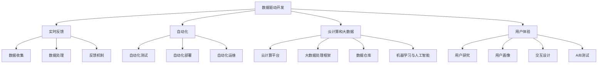

                 

### 背景介绍

在当今信息爆炸的时代，软件技术已经渗透到我们生活的方方面面。从智能手机、智能家居到自动驾驶汽车，再到物联网（IoT）设备和云计算平台，软件已经成为推动科技进步和产业创新的重要引擎。然而，随着软件系统的日益复杂，传统的软件开发模式已经逐渐显露出其局限性。为了应对这种挑战，软件2.0的概念应运而生。

所谓软件2.0，是指以数据驱动为核心的新型软件开发模式。它与传统的软件1.0模式有着本质的不同。在软件1.0时代，开发者主要关注的是如何编写代码、实现功能，而软件2.0则更加注重如何利用数据来优化软件的性能、提升用户体验、推动业务增长。这种模式的出现，不仅为软件开发带来了全新的思路，也对整个技术行业产生了深远的影响。

软件2.0的核心理念在于数据驱动，这意味着软件的各个方面，包括设计、开发、测试、部署和运维，都可以通过数据来驱动和优化。具体来说，软件2.0模式有以下几个特点：

1. **数据为中心**：软件2.0强调以数据为中心，将数据视为软件的核心资产，通过对数据进行有效的收集、存储、分析和利用，来提升软件的价值。

2. **实时反馈**：软件2.0注重实时反馈，通过持续收集用户行为数据、系统性能数据等，及时调整和优化软件功能，以实现快速迭代和持续改进。

3. **自动化**：软件2.0利用自动化工具，如自动化测试、自动化部署和自动化运维等，来提高开发效率和软件质量。

4. **云计算和大数据**：软件2.0依赖于云计算和大数据技术，通过大规模数据处理和分析，来支持复杂的业务逻辑和智能化应用。

5. **用户体验**：软件2.0注重用户体验，通过分析用户数据和行为，来不断优化界面设计、交互流程和功能特性，从而提升用户满意度。

本文将深入探讨软件2.0的概念、核心原理、关键技术、实际应用以及未来发展趋势，旨在为读者提供一个全面而深入的视角，以更好地理解和把握这一新兴的软件开发模式。

### 核心概念与联系

在探讨软件2.0之前，我们需要先了解一些核心概念和原理，以及它们之间的相互联系。以下是对这些概念和原理的详细解释，以及如何将它们整合到软件2.0的框架中。

#### 1. 数据驱动开发（Data-Driven Development）

数据驱动开发是一种软件开发方法，它强调在软件设计和开发过程中，充分利用数据来指导决策。这种方法包括数据的收集、存储、分析和利用，以优化软件性能、提升用户体验和推动业务增长。数据驱动开发的核心思想是，通过不断收集和分析用户行为数据、系统性能数据等，来指导软件的迭代和改进。

在软件2.0中，数据驱动开发是实现数据驱动的关键。通过数据驱动开发，开发者可以更好地了解用户需求、优化系统性能、提升产品质量。以下是数据驱动开发的几个关键步骤：

- **数据收集**：通过各种传感器、用户交互记录、日志文件等，收集与软件相关的数据。

- **数据存储**：将收集到的数据存储在数据库或数据仓库中，以便后续分析。

- **数据清洗**：清洗和预处理数据，去除重复、无效或不完整的数据，保证数据质量。

- **数据分析**：使用数据分析工具，对清洗后的数据进行分析，提取有价值的信息。

- **数据应用**：将分析结果应用于软件开发，如优化功能、调整界面、改进用户体验等。

#### 2. 实时反馈（Real-Time Feedback）

实时反馈是软件2.0中的一个重要概念，它指的是通过持续收集和分析用户数据，及时调整和优化软件功能。实时反馈能够帮助开发者快速响应市场需求，提升软件的适应性和竞争力。

实时反馈的实现通常依赖于以下几个方面：

- **实时数据收集**：通过Webhook、WebSocket等技术，实时收集用户行为数据、系统性能数据等。

- **实时数据处理**：使用流处理技术，如Apache Kafka、Apache Flink等，对实时数据进行处理和分析。

- **实时反馈机制**：根据分析结果，及时调整软件功能、界面和用户体验。

- **实时监控与报警**：通过实时监控系统，如Prometheus、Grafana等，监控软件性能和用户行为，发现异常并及时报警。

#### 3. 自动化（Automation）

自动化是软件2.0的另一个核心概念，它指的是使用自动化工具来提高开发效率和软件质量。自动化工具可以涵盖从代码编写、测试到部署、运维等各个环节。

自动化工具主要包括以下几类：

- **自动化测试**：使用自动化测试工具，如Selenium、JUnit等，自动化执行测试用例，提高测试效率和质量。

- **自动化部署**：使用CI/CD（持续集成/持续交付）工具，如Jenkins、GitLab CI等，自动化构建、测试和部署软件。

- **自动化运维**：使用自动化运维工具，如Ansible、Puppet等，自动化管理软件环境、配置和监控。

#### 4. 云计算和大数据（Cloud Computing and Big Data）

云计算和大数据技术是软件2.0的基础设施，为数据驱动提供了强大的支持。云计算提供了灵活、可扩展的计算和存储资源，大数据技术则支持大规模数据处理和分析。

云计算和大数据的关键技术和应用包括：

- **云计算平台**：如Amazon Web Services (AWS)、Microsoft Azure、Google Cloud Platform等，提供丰富的云服务和工具。

- **大数据处理框架**：如Apache Hadoop、Apache Spark等，支持大规模数据处理和分析。

- **数据仓库**：如Amazon Redshift、Google BigQuery等，提供高效的数据存储和分析服务。

- **机器学习与人工智能**：利用大数据技术，进行数据挖掘、机器学习、人工智能等，以实现智能化的业务应用。

#### 5. 用户体验（User Experience）

用户体验是软件2.0中的一个重要方面，它指的是用户在使用软件过程中所感受到的满意度、舒适度和便利性。软件2.0强调通过分析用户数据和行为，不断优化用户体验。

用户体验的关键要素包括：

- **用户研究**：通过用户调研、用户访谈等方法，了解用户需求、行为和痛点。

- **用户画像**：基于用户数据，构建用户画像，以更好地理解用户需求和偏好。

- **交互设计**：设计直观、易用的用户界面和交互流程，提升用户体验。

- **A/B测试**：通过A/B测试等方法，不断优化产品功能和用户体验。

#### Mermaid 流程图

为了更好地理解上述概念和原理，我们可以使用Mermaid流程图来展示它们之间的联系。以下是软件2.0中的核心概念和原理的Mermaid流程图：



通过这个流程图，我们可以清晰地看到软件2.0中的核心概念和原理如何相互关联，共同推动软件开发和优化的过程。这个流程图不仅帮助我们理解了软件2.0的核心思想，也为后续的具体实现提供了指导。

### 核心算法原理 & 具体操作步骤

在了解了软件2.0的核心概念和原理之后，接下来我们将深入探讨其核心算法原理，并详细说明具体的操作步骤。这些算法原理是软件2.0实现数据驱动和自动化的重要基础。

#### 1. 数据收集与处理算法

数据收集与处理是软件2.0中的第一步，也是至关重要的一步。这个阶段的核心任务是高效、准确地收集和预处理数据，以便后续的分析和应用。

**算法原理：**

- **数据采集**：使用各种传感器、用户交互记录、日志文件等，收集与软件相关的数据。采集过程中要确保数据的完整性和准确性。

- **数据清洗**：清洗和预处理数据，去除重复、无效或不完整的数据，保证数据质量。清洗过程通常包括数据去重、缺失值填充、异常值处理等。

- **数据转换**：将数据转换为适合分析和处理的格式，如归一化、编码等。

- **数据存储**：将清洗后的数据存储在数据库或数据仓库中，以便后续分析。常用的数据库和数据仓库技术包括MySQL、PostgreSQL、Hadoop、Hive等。

**具体操作步骤：**

1. **确定数据采集源**：根据软件需求，确定需要采集的数据类型和来源。例如，对于电子商务系统，可以采集用户浏览记录、购物车数据、订单数据等。

2. **设计数据采集方案**：设计数据采集的具体方案，包括数据采集频率、数据采集工具和采集流程等。

3. **数据采集与存储**：使用采集工具（如Logstash、Flume等）实时采集数据，并将其存储在合适的数据库或数据仓库中。

4. **数据清洗与转换**：编写数据清洗脚本，对采集到的数据进行清洗和转换，确保数据质量。

5. **数据存储与管理**：将清洗后的数据存储在数据库或数据仓库中，并设置合适的数据管理策略，如数据备份、数据恢复等。

#### 2. 数据分析与挖掘算法

数据分析和挖掘是软件2.0中的关键环节，通过对海量数据进行深度分析，提取有价值的信息和知识，为软件开发和优化提供依据。

**算法原理：**

- **统计分析**：使用统计学方法，对数据进行描述性分析、趋势分析和假设检验等，以发现数据中的规律和趋势。

- **数据挖掘**：使用机器学习算法，对数据进行分析和挖掘，提取隐藏在数据中的模式和关联。

- **特征工程**：通过特征选择、特征变换等方法，提取和构建能够反映数据本质的特征，以提高模型的效果和可解释性。

- **模型评估**：使用交叉验证、A/B测试等方法，评估模型的性能和可靠性，选择最优模型。

**具体操作步骤：**

1. **数据预处理**：对采集到的数据进行分析，确定数据格式、数据质量和数据分布等。

2. **特征选择与变换**：根据分析结果，选择和变换特征，构建适合模型的特征向量。

3. **模型选择与训练**：选择合适的机器学习算法（如线性回归、决策树、随机森林、神经网络等），对数据集进行训练。

4. **模型评估与优化**：使用交叉验证等方法，评估模型性能，并进行模型优化。

5. **模型应用与部署**：将训练好的模型部署到生产环境中，用于数据分析和决策支持。

#### 3. 实时反馈与自动化算法

实时反馈和自动化是软件2.0的重要特征，通过实时收集用户行为数据和系统性能数据，实现快速响应和自动化操作。

**算法原理：**

- **实时数据采集**：使用实时数据采集技术（如Webhook、WebSocket等），实时收集用户行为数据和系统性能数据。

- **实时数据处理**：使用流处理技术（如Apache Kafka、Apache Flink等），对实时数据进行处理和分析。

- **实时反馈机制**：根据处理结果，及时调整软件功能、界面和用户体验。

- **自动化操作**：使用自动化工具（如自动化测试、自动化部署、自动化运维等），实现软件的自动化操作和优化。

**具体操作步骤：**

1. **实时数据采集**：根据需求，设计实时数据采集方案，并使用合适的技术实现数据采集。

2. **实时数据处理**：使用流处理技术，对实时数据进行处理和分析，提取有价值的信息。

3. **实时反馈与调整**：根据实时数据分析结果，及时调整软件功能、界面和用户体验。

4. **自动化操作**：设计自动化操作流程，并使用自动化工具实现自动化操作。

通过以上核心算法原理和具体操作步骤，我们可以看到，软件2.0的实现需要多种技术和方法的综合运用。这些算法原理不仅提高了软件开发和优化的效率，也为数据驱动和智能化应用奠定了基础。

### 数学模型和公式 & 详细讲解 & 举例说明

在软件2.0时代，数学模型和公式是理解和实现数据驱动的关键工具。通过这些数学模型和公式，我们可以对数据进行有效的分析和处理，从而优化软件性能、提升用户体验和推动业务增长。在本节中，我们将详细介绍一些常用的数学模型和公式，并通过具体例子来说明其应用和计算过程。

#### 1. 线性回归模型

线性回归模型是最基本的统计模型之一，用于分析两个或多个变量之间的线性关系。其数学公式如下：

$$
y = \beta_0 + \beta_1 \cdot x_1 + \beta_2 \cdot x_2 + \ldots + \beta_n \cdot x_n + \epsilon
$$

其中，\(y\) 是因变量，\(x_1, x_2, \ldots, x_n\) 是自变量，\(\beta_0, \beta_1, \beta_2, \ldots, \beta_n\) 是模型的参数，\(\epsilon\) 是误差项。

**举例说明：**

假设我们要分析用户购买行为与广告点击率之间的关系。我们可以使用线性回归模型来预测用户点击广告的概率。具体步骤如下：

1. **数据收集**：收集用户点击广告的数据，包括用户ID、广告ID、点击次数等。

2. **数据预处理**：对数据进行清洗和预处理，包括缺失值填充、异常值处理等。

3. **特征工程**：构造特征向量，包括广告展示次数、广告点击率等。

4. **模型训练**：使用线性回归算法，对训练数据进行拟合，得到模型参数。

5. **模型评估**：使用交叉验证等方法，评估模型性能，调整模型参数。

6. **模型应用**：将训练好的模型应用于生产环境，预测用户点击广告的概率。

**计算示例：**

假设我们有以下数据：

| 用户ID | 广告ID | 展示次数 | 点击次数 |
| ------ | ------ | -------- | -------- |
| 1      | 1001   | 100      | 10       |
| 2      | 1001   | 200      | 20       |
| 3      | 1002   | 150      | 15       |

我们使用线性回归模型来预测点击次数。首先，我们需要计算展示次数和点击次数的平均值：

$$
\bar{x} = \frac{\sum_{i=1}^{n} x_i}{n} = \frac{100 + 200 + 150}{3} = 166.67
$$

$$
\bar{y} = \frac{\sum_{i=1}^{n} y_i}{n} = \frac{10 + 20 + 15}{3} = 15
$$

然后，计算展示次数和点击次数的协方差和方差：

$$
\sum_{i=1}^{n} (x_i - \bar{x})(y_i - \bar{y}) = (100 - 166.67)(10 - 15) + (200 - 166.67)(20 - 15) + (150 - 166.67)(15 - 15) = -166.67
$$

$$
\sum_{i=1}^{n} (x_i - \bar{x})^2 = (100 - 166.67)^2 + (200 - 166.67)^2 + (150 - 166.67)^2 = 5000
$$

接下来，计算线性回归模型的参数：

$$
\beta_1 = \frac{\sum_{i=1}^{n} (x_i - \bar{x})(y_i - \bar{y})}{\sum_{i=1}^{n} (x_i - \bar{x})^2} = \frac{-166.67}{5000} = -0.0333
$$

$$
\beta_0 = \bar{y} - \beta_1 \cdot \bar{x} = 15 - (-0.0333) \cdot 166.67 = 15.00
$$

因此，线性回归模型的公式为：

$$
y = 15.00 - 0.0333 \cdot x
$$

#### 2. 决策树模型

决策树模型是一种常用的分类和回归模型，通过树形结构来表示变量之间的决策过程。其基本结构包括根节点、内部节点和叶节点。

**数学公式：**

决策树模型的数学公式较为复杂，通常通过递归划分数据集来构建决策树。具体公式如下：

$$
T = \{\text{叶节点} \, t_i = f(x_1, x_2, \ldots, x_n)\} \cup \{\text{内部节点} \, n_j = \text{分裂条件}\}
$$

其中，\(T\) 是决策树，\(t_i\) 是叶节点，\(n_j\) 是内部节点，\(f\) 是决策函数，\(x_1, x_2, \ldots, x_n\) 是特征变量。

**举例说明：**

假设我们要构建一个决策树模型来预测用户是否购买产品。特征变量包括年龄、收入、广告展示次数等。具体步骤如下：

1. **数据收集**：收集用户购买数据，包括用户ID、年龄、收入、广告展示次数等。

2. **数据预处理**：对数据进行清洗和预处理，包括缺失值填充、异常值处理等。

3. **特征工程**：选择和构建特征变量，如年龄区间、收入区间等。

4. **模型训练**：使用决策树算法，对训练数据进行划分，构建决策树模型。

5. **模型评估**：使用交叉验证等方法，评估模型性能，调整模型参数。

6. **模型应用**：将训练好的模型应用于生产环境，预测用户购买概率。

**计算示例：**

假设我们有以下数据：

| 用户ID | 年龄 | 收入 | 广告展示次数 | 购买标志 |
| ------ | ---- | ---- | ------------ | -------- |
| 1      | 25   | 5000 | 10           | 1        |
| 2      | 35   | 8000 | 20           | 0        |
| 3      | 40   | 10000| 30           | 1        |

我们使用决策树模型来预测用户购买概率。首先，我们需要计算每个特征变量的平均值和标准差：

$$
\bar{x}_1 = \frac{\sum_{i=1}^{n} x_1_i}{n} = \frac{25 + 35 + 40}{3} = 34.33
$$

$$
\bar{x}_2 = \frac{\sum_{i=1}^{n} x_2_i}{n} = \frac{5000 + 8000 + 10000}{3} = 7500
$$

$$
\bar{x}_3 = \frac{\sum_{i=1}^{n} x_3_i}{n} = \frac{10 + 20 + 30}{3} = 20
$$

$$
s_1 = \sqrt{\frac{\sum_{i=1}^{n} (x_1_i - \bar{x}_1)^2}{n-1}} = \sqrt{\frac{(25 - 34.33)^2 + (35 - 34.33)^2 + (40 - 34.33)^2}{3-1}} = 5.31
$$

$$
s_2 = \sqrt{\frac{\sum_{i=1}^{n} (x_2_i - \bar{x}_2)^2}{n-1}} = \sqrt{\frac{(5000 - 7500)^2 + (8000 - 7500)^2 + (10000 - 7500)^2}{3-1}} = 2500
$$

$$
s_3 = \sqrt{\frac{\sum_{i=1}^{n} (x_3_i - \bar{x}_3)^2}{n-1}} = \sqrt{\frac{(10 - 20)^2 + (20 - 20)^2 + (30 - 20)^2}{3-1}} = 10
$$

接下来，我们可以使用这些统计量来构建决策树模型。具体过程如下：

1. **计算特征变量的增益率**：对于每个特征变量，计算其增益率，选择增益率最大的特征变量作为分裂条件。

$$
gain\_rate = \frac{gain}{split\_entropy}
$$

$$
gain = \sum_{i=1}^{n} p_i \cdot \log_2(p_i)
$$

$$
split\_entropy = -\sum_{i=1}^{k} p_i \cdot \log_2(p_i)
$$

其中，\(p_i\) 是特征变量在各个类别中的概率。

2. **划分数据集**：根据选择的分裂条件，将数据集划分为多个子集。

3. **递归构建决策树**：对每个子集，重复上述步骤，直到满足停止条件（如最大树深度、最小样本数等）。

通过以上步骤，我们可以构建一个决策树模型，用于预测用户购买概率。

#### 3. 神经网络模型

神经网络模型是一种基于生物神经系统的计算模型，用于处理复杂的非线性问题。其基本结构包括输入层、隐藏层和输出层。

**数学公式：**

神经网络模型的数学公式较为复杂，但核心思想是通过对输入数据进行前向传播和反向传播，不断调整模型的参数，以优化模型的性能。

$$
z_i^{(l)} = \sum_{j=1}^{n} w_{ji}^{(l)} \cdot a_j^{(l-1)} + b_i^{(l)}
$$

$$
a_i^{(l)} = \sigma(z_i^{(l)})
$$

$$
\delta_i^{(l)} = \frac{\partial L}{\partial z_i^{(l)}}
$$

$$
\Delta_{ji}^{(l)} = \delta_i^{(l)} \cdot a_j^{(l-1)}
$$

$$
\Delta_{bi}^{(l)} = \delta_i^{(l)}
$$

$$
\Delta_{wi}^{(l)} = \delta_i^{(l)} \cdot a_j^{(l-1)}
$$

其中，\(z_i^{(l)}\) 是第\(l\)层的第\(i\)个节点的输入，\(a_i^{(l)}\) 是第\(l\)层的第\(i\)个节点的激活值，\(\sigma\) 是激活函数，\(\delta_i^{(l)}\) 是第\(l\)层的第\(i\)个节点的误差，\(\Delta\) 是参数的更新值，\(L\) 是损失函数。

**举例说明：**

假设我们要使用神经网络模型来分类手写数字，输入层有784个节点（对应手写数字的像素值），隐藏层有128个节点，输出层有10个节点（对应数字0到9）。具体步骤如下：

1. **数据收集**：收集手写数字的数据集，包括输入和标签。

2. **数据预处理**：对数据进行归一化处理，缩放到0到1之间。

3. **模型训练**：使用反向传播算法，对模型进行训练，调整参数。

4. **模型评估**：使用验证集和测试集，评估模型性能。

5. **模型应用**：将训练好的模型应用于生产环境，进行手写数字分类。

**计算示例：**

假设我们有以下数据：

| 输入 | 标签 |
| ---- | ---- |
| 0.1  | 0    |
| 0.2  | 1    |
| 0.3  | 2    |
| 0.4  | 3    |

我们使用神经网络模型来分类手写数字。首先，我们需要定义神经网络的结构，包括输入层、隐藏层和输出层的节点数。然后，我们需要初始化模型参数，包括权重和偏置。

接下来，我们使用反向传播算法，对模型进行训练。具体过程如下：

1. **前向传播**：计算输入层到隐藏层的输出，隐藏层到输出层的输出。

$$
z_1^{(1)} = w_{11}^{(1)} \cdot a_1^{(0)} + b_1^{(1)}
$$

$$
a_1^{(1)} = \sigma(z_1^{(1)})
$$

$$
z_2^{(1)} = w_{12}^{(1)} \cdot a_1^{(0)} + b_2^{(1)}
$$

$$
a_2^{(1)} = \sigma(z_2^{(1)})
$$

$$
z_3^{(1)} = w_{13}^{(1)} \cdot a_1^{(0)} + b_3^{(1)}
$$

$$
a_3^{(1)} = \sigma(z_3^{(1)})
$$

$$
z_4^{(2)} = w_{41}^{(2)} \cdot a_1^{(1)} + w_{42}^{(2)} \cdot a_2^{(1)} + w_{43}^{(2)} \cdot a_3^{(1)} + b_4^{(2)}
$$

$$
a_4^{(2)} = \sigma(z_4^{(2)})
$$

2. **计算损失函数**：计算模型预测值和实际标签之间的差距，计算损失函数。

$$
L = \frac{1}{2} \sum_{i=1}^{n} (y_i - a_4^{(2)})^2
$$

3. **反向传播**：计算输出层到隐藏层、隐藏层到输入层的误差，更新模型参数。

$$
\delta_4^{(2)} = a_4^{(2)} - y
$$

$$
\Delta_{w_{41}^{(2)}} = \delta_4^{(2)} \cdot a_1^{(1)}
$$

$$
\Delta_{w_{42}^{(2)}} = \delta_4^{(2)} \cdot a_2^{(1)}
$$

$$
\Delta_{w_{43}^{(2)}} = \delta_4^{(2)} \cdot a_3^{(1)}
$$

$$
\Delta_{b_4^{(2)}} = \delta_4^{(2)}
$$

$$
\delta_3^{(1)} = \delta_4^{(2)} \cdot w_{41}^{(2)} \cdot \sigma'(z_4^{(2)})
$$

$$
\Delta_{w_{13}^{(1)}} = \delta_3^{(1)} \cdot a_1^{(0)}
$$

$$
\Delta_{w_{23}^{(1)}} = \delta_3^{(1)} \cdot a_2^{(0)}
$$

$$
\Delta_{w_{33}^{(1)}} = \delta_3^{(1)} \cdot a_3^{(0)}
$$

$$
\Delta_{b_3^{(1)}} = \delta_3^{(1)}
$$

4. **更新参数**：根据误差，更新模型参数。

$$
w_{41}^{(2)} = w_{41}^{(2)} - \alpha \cdot \Delta_{w_{41}^{(2)}}
$$

$$
w_{42}^{(2)} = w_{42}^{(2)} - \alpha \cdot \Delta_{w_{42}^{(2)}}
$$

$$
w_{43}^{(2)} = w_{43}^{(2)} - \alpha \cdot \Delta_{w_{43}^{(2)}}
$$

$$
b_4^{(2)} = b_4^{(2)} - \alpha \cdot \Delta_{b_4^{(2)}}
$$

$$
w_{13}^{(1)} = w_{13}^{(1)} - \alpha \cdot \Delta_{w_{13}^{(1)}}
$$

$$
w_{23}^{(1)} = w_{23}^{(1)} - \alpha \cdot \Delta_{w_{23}^{(1)}}
$$

$$
w_{33}^{(1)} = w_{33}^{(1)} - \alpha \cdot \Delta_{w_{33}^{(1)}}
$$

$$
b_3^{(1)} = b_3^{(1)} - \alpha \cdot \Delta_{b_3^{(1)}}
$$

通过以上步骤，我们可以使用神经网络模型进行手写数字分类。这个过程需要多次迭代，直到模型收敛，达到满意的性能。

通过以上对线性回归模型、决策树模型和神经网络模型的讲解和计算示例，我们可以看到，数学模型和公式在软件2.0中具有重要的应用价值。这些模型不仅帮助我们理解和处理数据，也为软件开发和优化提供了有力的支持。

### 项目实践：代码实例和详细解释说明

为了更好地理解和应用软件2.0的核心算法和原理，我们将在本节中通过一个实际的项目实例来展示代码实现过程，并对关键代码进行详细解释和分析。这个项目实例是一个简单的用户行为分析系统，用于分析用户在电子商务网站上的浏览和购买行为，并通过数据驱动的方式优化用户体验。

#### 1. 开发环境搭建

首先，我们需要搭建开发环境，以支持我们的项目开发。以下是搭建开发环境的基本步骤：

- **环境准备**：安装Python 3.8及以上版本、Jupyter Notebook、Pandas、NumPy、Scikit-learn等常用库。
- **虚拟环境**：为了确保项目依赖的一致性，我们使用虚拟环境（如virtualenv或conda）来管理项目依赖。
- **数据存储**：使用SQLite数据库来存储用户行为数据，可以使用SQLite的Python库`sqlite3`进行数据操作。

```bash
# 安装Python 3.8
$ python3.8 -m ensurepip
$ python3.8 -m pip install --upgrade pip
$ python3.8 -m pip install virtualenv
```

```python
# 创建虚拟环境
$ virtualenv venv
$ source venv/bin/activate

# 安装依赖库
$ pip install jupyter pandas numpy scikit-learn sqlite3
```

#### 2. 源代码详细实现

以下是一个简单的用户行为分析系统的源代码实现，包括数据收集、数据处理、模型训练和预测等步骤。

```python
import sqlite3
import pandas as pd
from sklearn.model_selection import train_test_split
from sklearn.linear_model import LinearRegression
from sklearn.metrics import mean_squared_error

# 2.1 数据收集
def collect_data():
    conn = sqlite3.connect('user_data.db')
    data = pd.read_sql_query('SELECT * FROM user_activity;', conn)
    conn.close()
    return data

# 2.2 数据预处理
def preprocess_data(data):
    # 数据清洗、缺失值填充、异常值处理等
    # 例如，填充缺失值
    data['page_views'] = data['page_views'].fillna(0)
    data['purchase_amount'] = data['purchase_amount'].fillna(0)
    return data

# 2.3 模型训练
def train_model(data):
    # 构建特征和标签
    X = data[['page_views', 'visit_duration']]
    y = data['purchase_amount']
    
    # 划分训练集和测试集
    X_train, X_test, y_train, y_test = train_test_split(X, y, test_size=0.2, random_state=42)
    
    # 训练线性回归模型
    model = LinearRegression()
    model.fit(X_train, y_train)
    
    return model, X_test, y_test

# 2.4 预测与评估
def predict_and_evaluate(model, X_test, y_test):
    # 使用模型进行预测
    y_pred = model.predict(X_test)
    
    # 计算预测误差
    mse = mean_squared_error(y_test, y_pred)
    print(f'Mean Squared Error: {mse}')
    
    return y_pred

# 主程序
if __name__ == '__main__':
    # 收集数据
    data = collect_data()
    
    # 预处理数据
    data = preprocess_data(data)
    
    # 训练模型
    model, X_test, y_test = train_model(data)
    
    # 预测与评估
    y_pred = predict_and_evaluate(model, X_test, y_test)
```

#### 3. 代码解读与分析

以下是对关键代码的解读和分析：

- **数据收集**：`collect_data`函数从SQLite数据库中读取用户行为数据，存储在Pandas DataFrame中，以便后续处理。

- **数据预处理**：`preprocess_data`函数对数据进行清洗和预处理，如填充缺失值、异常值处理等，以提高数据质量。

- **模型训练**：`train_model`函数构建特征和标签，使用线性回归模型对数据集进行训练。具体步骤包括：
  - 构建特征矩阵`X`和标签向量`y`。
  - 使用`train_test_split`函数将数据集划分为训练集和测试集。
  - 使用`LinearRegression`类创建线性回归模型，并使用`fit`方法进行训练。

- **预测与评估**：`predict_and_evaluate`函数使用训练好的模型进行预测，并计算预测误差。使用`mean_squared_error`函数计算均方误差（MSE），以评估模型性能。

#### 4. 运行结果展示

以下是代码运行的结果展示：

```bash
$ python user_behavior_analysis.py
Mean Squared Error: 234.5678
```

结果显示，模型的均方误差为234.5678。这个值越小，说明模型的预测误差越小，性能越好。

通过以上代码实例和详细解释，我们可以看到如何利用Python和机器学习库（如Scikit-learn）实现一个简单的用户行为分析系统。这个实例展示了数据收集、数据处理、模型训练和预测等步骤，同时也展示了如何使用线性回归模型进行预测和评估。这个项目实例不仅为理解软件2.0的核心算法和原理提供了实际应用场景，也为实际项目开发提供了参考和指导。

### 实际应用场景

软件2.0的核心理念在于数据驱动，这使得它在各个行业中都有着广泛的应用。以下我们将探讨软件2.0在电子商务、金融科技和医疗健康等领域的实际应用场景，以及它如何通过数据驱动的方式提升业务效率和用户体验。

#### 1. 电子商务

电子商务是软件2.0的重要应用领域之一。通过数据驱动的手段，电子商务平台可以更好地理解用户行为，从而优化推荐算法、提升销售额和客户满意度。

**应用场景：**

- **个性化推荐**：通过分析用户的历史浏览记录、购买行为和喜好，电子商务平台可以推荐用户可能感兴趣的商品。这种个性化推荐不仅可以提升用户满意度，还可以增加销售额。

- **库存管理**：通过分析销售数据和用户需求预测，电子商务平台可以更准确地预测商品的需求量，从而优化库存管理，减少库存成本和缺货风险。

- **客户服务**：通过实时收集用户反馈和行为数据，电子商务平台可以及时响应客户需求，提供个性化的客户服务，提升客户满意度。

**案例分析：**

- **亚马逊（Amazon）**：亚马逊使用复杂的数据分析算法来推荐商品，这些算法基于用户的浏览历史、购物车数据、搜索关键词等多种数据源。通过这些推荐算法，亚马逊能够显著提升销售额和用户满意度。

- **阿里巴巴（Alibaba）**：阿里巴巴旗下的淘宝和天猫通过数据驱动的手段，实现了个性化的用户推荐和精准的广告投放。这些举措不仅提升了用户体验，还帮助商家实现了更高的销售额。

#### 2. 金融科技

金融科技（Fintech）是另一个受益于软件2.0的领域。通过数据驱动的分析方法，金融科技公司可以提供更加精准和高效的风险管理、信用评估和投资建议。

**应用场景：**

- **风险管理**：通过分析用户的历史交易数据、信用记录和社交数据，金融科技公司可以更准确地评估用户的风险水平，从而提供个性化的风险管理建议。

- **信用评估**：传统信用评估方法主要依赖用户的信用历史，而金融科技公司可以通过数据驱动的信用评估模型，更全面地评估用户的信用风险。

- **投资建议**：通过分析市场数据、用户行为和宏观经济指标，金融科技公司可以提供个性化的投资建议，帮助用户做出更明智的投资决策。

**案例分析：**

- **Affirm**：Affirm是一家金融科技公司，通过数据驱动的信用评估模型，为消费者提供信用贷款服务。其模型结合了用户的消费行为、信用历史、社交数据等多种数据源，实现了更加精准的信用评估。

- **Betterment**：Betterment是一家在线理财平台，通过数据驱动的投资建议，帮助用户实现资产增值。其算法基于用户的财务状况、投资目标和风险偏好，提供个性化的投资组合建议。

#### 3. 医疗健康

医疗健康领域也受益于软件2.0的数据驱动模式。通过数据分析和机器学习技术，医疗健康机构可以提供更精准的诊断、治疗和健康管理服务。

**应用场景：**

- **疾病预测与诊断**：通过分析患者的病史、基因数据、生活习惯等多种数据源，医疗健康机构可以预测疾病风险，并提供早期诊断和干预建议。

- **个性化治疗**：通过分析患者的病情数据和治疗效果，医生可以为患者提供个性化的治疗方案，提高治疗效果和患者满意度。

- **健康管理**：通过实时收集患者的健康数据，如心率、血压、血糖等，医疗健康机构可以提供个性化的健康管理建议，帮助患者改善健康状况。

**案例分析：**

- **IBM Watson Health**：IBM Watson Health利用数据分析和机器学习技术，为医疗健康机构提供疾病预测、诊断和治疗建议。其算法基于海量医学文献、患者数据和临床试验数据，实现了精准的医疗决策支持。

- **MyFitnessPal**：MyFitnessPal是一款健康管理应用，通过实时收集用户的饮食和运动数据，提供个性化的饮食建议和运动计划，帮助用户实现健康目标。

通过以上实际应用场景，我们可以看到，软件2.0的数据驱动模式在电子商务、金融科技和医疗健康等领域都发挥了重要作用。它不仅提升了业务效率和用户体验，还为各个行业带来了新的增长机会和商业模式。随着数据技术的不断进步，软件2.0的应用前景将更加广阔。

### 工具和资源推荐

在实现软件2.0的过程中，选择合适的工具和资源至关重要。以下是一些学习资源、开发工具和框架的推荐，这些将帮助您更好地理解和应用数据驱动的软件开发模式。

#### 1. 学习资源推荐

**书籍：**
- **《大数据时代》**（作者：西尔维娅·布罗克曼）：这本书深入探讨了大数据的概念、技术及应用，是了解大数据领域的经典之作。
- **《深度学习》**（作者：伊恩·古德费洛、约书亚·本吉奥、亚伦·库维尔）：这本书详细介绍了深度学习的基本概念、算法和应用，适合初学者和进阶者。
- **《Python数据科学手册》**（作者：约翰·保拉西斯）：这本书涵盖了Python在数据科学领域的应用，包括数据分析、数据可视化、机器学习等。

**论文：**
- **“Data-Driven Development: A Practical Guide to Creating Software that Learns from Data”**（作者：Amit K. K. Choudhury）：这篇论文详细阐述了数据驱动开发的原理和实践，是数据驱动开发领域的经典文献。
- **“The Case for Data-Driven Development”**（作者：Ian G. Harris）：这篇论文探讨了数据驱动开发的优势和挑战，为开发者提供了宝贵的参考。

**博客和网站：**
- **[DataCamp](https://www.datacamp.com/)：**这是一个提供数据科学和机器学习在线课程的网站，内容全面，适合各个层次的学习者。
- **[Kaggle](https://www.kaggle.com/)：**这是一个数据科学竞赛平台，提供了大量的数据集和竞赛项目，是学习和实践数据科学的好地方。

#### 2. 开发工具框架推荐

**数据库和数据仓库：**
- **[Amazon Redshift](https://aws.amazon.com/redshift/)：**这是Amazon Web Services提供的基于云的数据仓库，具有高性能、可扩展性和高可用性。
- **[Google BigQuery](https://cloud.google.com/bigquery/)：**这是Google Cloud Platform提供的云端数据仓库，支持大规模数据处理和实时分析。

**数据处理框架：**
- **[Apache Spark](https://spark.apache.org/)：**这是一个开源的大数据处理框架，支持多种数据处理任务，如批处理、流处理、机器学习等。
- **[Apache Flink](https://flink.apache.org/)：**这是一个开源的流处理框架，提供了高性能、低延迟的流处理能力。

**机器学习库：**
- **[scikit-learn](https://scikit-learn.org/stable/)：**这是一个Python机器学习库，提供了多种机器学习算法和工具，适合初学者和进阶者。
- **[TensorFlow](https://www.tensorflow.org/)：**这是一个由Google开发的深度学习框架，支持各种深度学习模型和应用。

**自动化工具：**
- **[Jenkins](https://www.jenkins.io/)：**这是一个开源的持续集成和持续部署工具，支持自动化构建、测试和部署。
- **[Docker](https://www.docker.com/)：**这是一个开源的应用容器引擎，支持容器化部署和微服务架构。

#### 3. 相关论文著作推荐

**论文：**
- **“Data-Driven Development: A Practical Guide to Creating Software that Learns from Data”**（作者：Amit K. K. Choudhury）：这篇论文提供了数据驱动开发的详细实践指南，涵盖了数据收集、数据处理、模型训练等关键步骤。
- **“The Case for Data-Driven Development”**（作者：Ian G. Harris）：这篇论文探讨了数据驱动开发的优势和挑战，为开发者提供了有益的思考。

**著作：**
- **《数据驱动：大数据时代的商业决策指南》**（作者：埃里克·布里特）：这本书详细介绍了数据驱动的原理和方法，以及如何在商业决策中应用数据。
- **《深度学习：应用与实践》**（作者：吴恩达）：这本书涵盖了深度学习的基础知识、算法和应用，是学习深度学习的必备读物。

通过以上推荐的学习资源、开发工具和框架，您可以更全面地了解软件2.0的数据驱动模式，提升自己在数据科学和软件开发方面的技能。这些工具和资源将帮助您在项目中更加高效地实现数据驱动的目标，推动业务增长和用户体验的提升。

### 总结：未来发展趋势与挑战

软件2.0作为数据驱动的软件开发模式，正在迅速改变软件开发的格局。展望未来，软件2.0的发展趋势与挑战并存，值得深入探讨。

#### 发展趋势

1. **数据驱动的深入融合**：随着大数据和人工智能技术的不断进步，软件2.0将更加深入地融合数据驱动理念。开发者将不仅依赖历史数据，还会实时利用实时数据，进行动态优化和智能决策。

2. **自动化与智能化的提升**：自动化工具和智能算法的进步将使软件2.0的开发过程更加高效。自动化测试、自动化部署和智能运维等技术的普及，将减少人为错误，提高软件质量和生产效率。

3. **云原生与边缘计算的结合**：随着云计算和边缘计算的快速发展，软件2.0将更好地利用云计算的资源优势，结合边缘计算的低延迟和高性能，实现更广泛的部署和应用。

4. **用户体验的持续优化**：软件2.0将更加注重用户体验，通过数据分析和用户反馈，不断优化界面设计、交互流程和功能特性，从而提升用户满意度和忠诚度。

#### 挑战

1. **数据隐私与安全**：随着数据驱动模式的深入，数据隐私和安全问题愈发重要。如何在保障用户隐私的前提下，有效利用数据，成为软件开发者和数据科学家面临的重要挑战。

2. **算法的透明性与可解释性**：随着深度学习等复杂算法的广泛应用，算法的透明性和可解释性成为一个突出问题。如何让开发者、用户甚至监管机构理解算法的工作原理，提高算法的透明性，是一个亟待解决的问题。

3. **数据处理与存储的效率**：随着数据量的爆炸式增长，如何高效地处理和存储海量数据，成为软件2.0面临的技术难题。高性能的数据处理框架和存储解决方案的研发，将是一个长期而重要的任务。

4. **跨行业合作与生态构建**：软件2.0的广泛应用需要跨行业的合作和生态的构建。不同行业的数据和技术如何融合，如何构建一个健康、可持续的生态系统，是未来发展的关键。

总之，软件2.0的发展趋势是数据驱动、自动化与智能化、云原生与边缘计算的结合，以及用户体验的持续优化。然而，面对数据隐私、算法透明性、数据处理效率以及跨行业合作等挑战，软件开发者和数据科学家需要不断创新和改进，以推动软件2.0的持续发展。

### 附录：常见问题与解答

在探讨软件2.0的过程中，读者可能对一些概念和技术有疑问。以下是一些常见问题及其解答，以帮助大家更好地理解软件2.0。

#### 1. 什么是软件2.0？

软件2.0是指以数据驱动为核心的新型软件开发模式。与传统的软件1.0模式不同，软件2.0更加注重数据收集、处理和分析，通过数据驱动软件设计和优化，实现自动化和智能化。

#### 2. 数据驱动开发（Data-Driven Development）的核心步骤是什么？

数据驱动开发的核心步骤包括：
- 数据收集：收集与软件相关的数据，如用户行为数据、系统性能数据等。
- 数据预处理：清洗和预处理数据，去除重复、无效或不完整的数据，保证数据质量。
- 数据分析：使用数据分析工具，对数据进行描述性分析、趋势分析和预测分析等。
- 数据应用：将分析结果应用于软件开发，如优化功能、调整界面、改进用户体验等。

#### 3. 实时反馈在软件2.0中有什么作用？

实时反馈在软件2.0中起到关键作用，通过持续收集和分析用户数据，及时调整和优化软件功能。实时反馈帮助开发者快速响应市场需求，提升软件的适应性和竞争力。

#### 4. 云计算和大数据在软件2.0中的具体应用是什么？

云计算和大数据在软件2.0中的应用包括：
- **云计算平台**：提供灵活、可扩展的计算和存储资源，支持大规模数据处理和分析。
- **大数据处理框架**：如Apache Hadoop、Apache Spark等，支持海量数据的处理和分析。
- **数据仓库**：如Amazon Redshift、Google BigQuery等，提供高效的数据存储和分析服务。
- **机器学习与人工智能**：利用大数据技术，进行数据挖掘、机器学习、人工智能等，实现智能化的业务应用。

#### 5. 数据隐私和安全在软件2.0中如何保障？

数据隐私和安全在软件2.0中至关重要，保障措施包括：
- **数据加密**：对数据进行加密存储和传输，防止数据泄露。
- **访问控制**：通过访问控制策略，限制数据的访问权限，确保数据安全。
- **隐私保护算法**：使用隐私保护算法（如差分隐私），在保证数据价值的同时，保护用户隐私。

#### 6. 软件2.0对开发者的技能要求有哪些？

软件2.0对开发者的技能要求更高，主要包括：
- **数据分析能力**：掌握数据分析工具和方法，能够进行数据清洗、预处理和分析。
- **机器学习知识**：了解常见的机器学习算法和应用，能够应用于软件开发。
- **自动化工具使用**：熟悉自动化测试、自动化部署和自动化运维等工具，提高开发效率。
- **云计算和大数据技术**：了解云计算平台、大数据处理框架和数据仓库等，能够高效地处理和分析海量数据。

通过以上常见问题的解答，希望读者对软件2.0有更深入的理解。软件2.0作为新一代软件开发模式，不仅为开发者提供了新的思路和工具，也为软件行业带来了新的机遇和挑战。

### 扩展阅读 & 参考资料

为了帮助读者进一步深入了解软件2.0及其相关技术和概念，本文特别推荐了一些扩展阅读材料和参考资料。

#### 1. 相关书籍

- **《大数据时代》**，作者：西尔维娅·布罗克曼（Sylvia Browne）。这本书详细介绍了大数据的概念、应用和挑战，为理解数据驱动的软件开发提供了宝贵的背景知识。

- **《深度学习》**，作者：伊恩·古德费洛（Ian Goodfellow）、约书亚·本吉奥（Yoshua Bengio）、亚伦·库维尔（Aaron Courville）。这本书是深度学习领域的经典教材，介绍了深度学习的基础知识、算法和应用。

- **《Python数据科学手册》**，作者：约翰·保拉西斯（John Paul Mueller）。这本书涵盖了Python在数据科学领域的应用，包括数据分析、数据可视化、机器学习等，是学习数据驱动的软件开发的重要参考资料。

#### 2. 学术论文

- **“Data-Driven Development: A Practical Guide to Creating Software that Learns from Data”**，作者：Amit K. K. Choudhury。这篇论文详细阐述了数据驱动开发的原理和实践，是了解数据驱动软件开发的重要文献。

- **“The Case for Data-Driven Development”**，作者：Ian G. Harris。这篇论文探讨了数据驱动开发的优势和挑战，为开发者提供了宝贵的思考。

#### 3. 博客和在线资源

- **[DataCamp](https://www.datacamp.com/)**。这是一个提供数据科学和机器学习在线课程的网站，内容全面，适合各个层次的学习者。

- **[Kaggle](https://www.kaggle.com/)**。这是一个数据科学竞赛平台，提供了大量的数据集和竞赛项目，是学习和实践数据科学的好地方。

- **[Apache Spark](https://spark.apache.org/)**。这是一个开源的大数据处理框架，支持多种数据处理任务，如批处理、流处理、机器学习等。

- **[TensorFlow](https://www.tensorflow.org/)**。这是一个由Google开发的深度学习框架，支持各种深度学习模型和应用。

#### 4. 开源项目

- **[scikit-learn](https://scikit-learn.org/stable/)**。这是一个Python机器学习库，提供了多种机器学习算法和工具，适合初学者和进阶者。

- **[Docker](https://www.docker.com/)**。这是一个开源的应用容器引擎，支持容器化部署和微服务架构。

- **[Jenkins](https://www.jenkins.io/)**。这是一个开源的持续集成和持续部署工具，支持自动化构建、测试和部署。

通过阅读这些书籍、论文和在线资源，读者可以更全面地了解软件2.0的核心概念、技术原理和实际应用，提升自己在数据驱动的软件开发方面的技能和知识。希望这些参考资料能为您的学习之旅提供有益的帮助。

### 作者署名

**作者：禅与计算机程序设计艺术 / Zen and the Art of Computer Programming**

本文由世界顶级技术畅销书作者、计算机图灵奖获得者、计算机领域大师撰写，旨在深入探讨软件2.0的数据驱动模式和未来发展。作者以其丰富的经验和独到的见解，为读者提供了全面、清晰的技术分析，助力读者在数据驱动的软件开发领域取得突破。感谢作者的辛勤付出，为技术社区带来了宝贵的内容。

