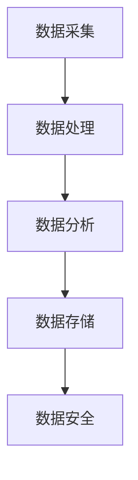

                 

### 软件发展简史：从1.0到2.0

在软件发展的历史长河中，我们可以将其大致划分为几个重要的阶段，即1.0时代和2.0时代。1.0时代，也被称为“指令驱动”时代，是软件发展的初期阶段。在这个阶段，软件的功能主要集中在执行特定的指令，如早期的计算机程序、操作系统和编译器等。这一阶段的软件，其主要特点在于其功能相对单一，依赖于程序员手动编写代码，执行效率较低，可维护性较差。

随着时间的推移，计算机技术的发展和互联网的普及，我们进入了2.0时代，也被称为“数据驱动”时代。在这个阶段，软件的核心不再仅仅是执行指令，而是对海量数据进行处理和分析。数据成为了驱动软件发展的关键因素，从而带来了软件架构、开发模式、应用场景等方面的深刻变革。

从1.0到2.0，软件的演变不仅仅是一个技术的进步，更是人类对于数据处理和利用理念的升级。在1.0时代，软件的主要任务是完成特定的功能，而2.0时代，软件的任务则是从海量数据中提取有价值的信息，为用户提供更加个性化、智能化的服务。

这一转变，不仅改变了软件的开发模式，也对整个社会产生了深远的影响。接下来，我们将深入探讨2.0时代的数据驱动原理、核心概念、算法原理，以及其在实际应用中的具体实现和未来发展趋势。

#### 1.0时代：指令驱动的软件世界

在1.0时代，软件的发展主要依赖于计算机硬件的提升和编程技术的进步。早期的计算机系统结构相对简单，软件的功能也相对单一。程序员通过编写代码，将一系列指令输入到计算机中，计算机按照这些指令执行任务。这一阶段，软件的主要应用场景集中在科学计算、数据处理和企业管理等方面。

1. **指令驱动的特点**：
   - **功能单一**：1.0时代的软件通常只有一个或几个特定的功能，如计算器、文字处理、数据库管理等。
   - **手动编写代码**：程序员需要手动编写代码，将指令输入到计算机中。这使得软件的开发和维护成本较高，可扩展性较差。
   - **执行效率低**：由于硬件性能的限制，1.0时代的软件执行效率较低，处理大量数据的能力有限。

2. **典型的软件应用场景**：
   - **科学计算**：早期的计算机主要用于科学研究和工程计算，如数学建模、物理模拟等。
   - **数据处理**：随着计算机技术的发展，数据处理软件逐渐兴起，如数据库管理系统、数据统计软件等。
   - **企业管理**：企业开始使用计算机进行财务管理、人力资源管理、生产管理等。

3. **编程技术的进步**：
   - **汇编语言**：汇编语言是1.0时代的早期编程语言，它直接操作计算机的硬件，但编写难度大，可读性差。
   - **高级编程语言**：随着计算机硬件的发展，高级编程语言如C、FORTRAN等逐渐兴起，提高了编程效率，降低了开发成本。

4. **面临的挑战**：
   - **可维护性差**：由于软件功能单一，代码复杂度较高，导致软件的可维护性较差。
   - **可扩展性差**：软件的扩展性较差，难以适应快速变化的需求。
   - **性能瓶颈**：随着数据量的增加，1.0时代的软件在处理大量数据时，常常面临性能瓶颈。

#### 2.0时代：数据驱动的软件世界

2.0时代的到来，标志着软件发展的一个重要转折点。随着互联网的普及和大数据技术的崛起，数据成为了驱动软件发展的核心因素。在这个时代，软件的核心任务不再是执行特定的指令，而是从海量数据中提取有价值的信息，为用户提供个性化、智能化的服务。

1. **数据驱动的特点**：
   - **功能多样化**：2.0时代的软件功能更加丰富，能够处理和分析不同类型的数据，如文本、图像、音频等。
   - **自动化编程**：通过机器学习和人工智能技术，软件可以自动生成和优化代码，降低开发成本。
   - **高执行效率**：随着硬件性能的提升和算法的优化，2.0时代的软件在处理大量数据时，执行效率显著提高。

2. **典型的软件应用场景**：
   - **智能推荐系统**：通过分析用户的历史行为和偏好，为用户提供个性化的推荐。
   - **数据分析与挖掘**：从海量数据中提取有价值的信息，用于商业决策、科学研究等。
   - **自动化运维**：利用数据驱动技术，实现自动化监控、故障诊断和优化。

3. **核心技术的进步**：
   - **大数据技术**：包括数据采集、存储、处理和分析等技术，使得海量数据的处理变得更加高效。
   - **机器学习和深度学习**：通过训练模型，从数据中自动提取特征，实现智能决策和预测。
   - **云计算和分布式计算**：利用云计算和分布式计算技术，提高数据处理和计算能力。

4. **面临的挑战**：
   - **数据质量和隐私**：随着数据量的增加，数据质量和隐私问题变得尤为重要。
   - **算法的公平性和透明性**：算法的公平性和透明性成为了社会关注的焦点。
   - **可扩展性和性能优化**：如何高效地处理和存储海量数据，是一个持续面临的挑战。

通过对比1.0和2.0时代的软件发展，我们可以清晰地看到，数据驱动时代的到来，不仅带来了技术上的突破，更改变了软件的定义和应用场景。在接下来的章节中，我们将深入探讨数据驱动的核心原理、算法和实际应用，以期为读者提供更全面的了解。

#### 2.0时代的数据驱动原理

2.0时代的数据驱动原理，是软件从1.0时代指令驱动向数据驱动的关键转折点。在这一阶段，数据不仅仅是软件的输入或输出，而是成为了软件的核心驱动力。以下是对数据驱动原理的详细解析：

1. **数据的重要性**：
   - **数据的增长**：随着互联网的普及和物联网技术的发展，数据量呈现出爆炸式增长。据预测，全球数据量将在未来几年内达到数百万ZB（Zettabyte，十亿亿字节）。
   - **数据的价值**：数据被认为是新的“石油”，具有巨大的商业价值。通过分析数据，企业可以更好地理解客户需求，优化业务流程，提高运营效率。

2. **数据的来源**：
   - **用户行为数据**：用户在互联网上的各种行为，如浏览、搜索、购买等，都产生了大量的数据。
   - **传感器数据**：物联网设备如智能手机、智能手表、智能家电等，不断产生温度、湿度、位置等环境数据。
   - **企业内部数据**：企业内部的数据源包括客户信息、交易记录、库存数据等。

3. **数据处理与分析**：
   - **数据采集**：通过各种手段收集数据，如Web爬虫、API调用、传感器读取等。
   - **数据存储**：使用大数据技术，如Hadoop、Spark等，高效地存储和管理海量数据。
   - **数据清洗**：对原始数据进行处理，去除噪声和错误，提高数据质量。
   - **数据挖掘**：使用机器学习和深度学习技术，从数据中提取有价值的信息，如模式、趋势和关联。

4. **数据驱动的软件架构**：
   - **微服务架构**：通过将软件拆分为多个独立的服务，实现高可扩展性和高可用性。
   - **数据管道**：构建高效的数据处理管道，实现数据的实时流处理和批处理。
   - **API网关**：统一管理和分发API请求，提高系统的灵活性和可扩展性。

5. **数据驱动的应用场景**：
   - **智能推荐系统**：通过分析用户历史行为和偏好，为用户提供个性化的推荐。
   - **实时监控与预警**：实时分析系统数据，发现潜在的问题并发出预警。
   - **自动化决策**：利用数据驱动技术，实现自动化决策和优化，如自动驾驶、智能医疗等。

6. **面临的挑战**：
   - **数据质量和隐私**：随着数据量的增加，如何保证数据质量，如何处理隐私问题，成为重要的挑战。
   - **算法的公平性和透明性**：算法的决策过程是否公平、透明，引起了广泛关注。
   - **可扩展性和性能优化**：如何高效地处理和存储海量数据，是持续面临的挑战。

通过理解2.0时代的数据驱动原理，我们可以看到，数据已经成为软件的核心驱动力，驱动着软件的发展和创新。在接下来的章节中，我们将进一步探讨数据驱动的核心概念，包括数据类型、数据处理方法以及数据分析技术，以期为读者提供更全面的了解。

### 核心概念解析：数据驱动与软件架构

在2.0时代，数据驱动成为了软件发展的核心驱动力。要深入理解这一时代的软件架构，我们需要首先解析几个关键概念：数据处理、数据分析、数据存储以及数据安全。

#### 数据处理

数据处理是数据驱动软件架构的基础。它包括数据的采集、传输、存储、清洗和转换等环节。

1. **数据采集**：数据采集是数据处理的起点。数据可以来源于用户行为、传感器、企业内部系统等。采集到的数据可能是结构化的（如数据库中的记录），也可能是非结构化的（如文本、图像、音频等）。

2. **数据传输**：采集到的数据需要通过传输管道进行传输。数据传输的速度和可靠性直接影响数据处理效率。

3. **数据存储**：大数据技术如Hadoop、Spark等提供了高效的数据存储和管理方案。这些技术能够处理PB（Petabyte，千万亿字节）级别的数据，并保证数据的可靠性和持久性。

4. **数据清洗**：数据清洗是数据处理的重要环节。清洗过程包括去除重复数据、填补缺失值、纠正错误等，以提高数据质量。

5. **数据转换**：数据转换是将数据从一种格式转换为另一种格式，以便于后续的处理和分析。

#### 数据分析

数据分析是数据驱动软件的核心功能。通过数据分析，可以从海量数据中提取有价值的信息，用于决策支持和业务优化。

1. **数据挖掘**：数据挖掘是一种非传统的方法，用于从海量数据中提取隐藏的模式和知识。常见的数据挖掘技术包括关联规则挖掘、聚类分析、分类分析、异常检测等。

2. **机器学习与深度学习**：机器学习和深度学习是数据分析的重要工具。通过训练模型，可以从数据中自动提取特征，实现智能分类、预测和决策。

3. **实时分析与批量分析**：实时分析可以提供即时的数据洞察，用于监控和预警。批量分析则适用于大规模数据的深入挖掘和分析。

#### 数据存储

数据存储是数据处理和数据分析的基础。合理的数据存储方案能够提高数据处理和分析的效率。

1. **分布式存储**：分布式存储系统能够将数据分散存储在多个节点上，提高数据的可靠性和扩展性。常用的分布式存储系统包括HDFS（Hadoop Distributed File System）和Cassandra等。

2. **NoSQL数据库**：NoSQL数据库如MongoDB、Redis等，提供了高性能、可扩展的存储方案，适用于处理大规模、高并发的数据。

3. **关系型数据库**：关系型数据库如MySQL、PostgreSQL等，适用于处理结构化数据，具有较高的查询效率和数据一致性。

#### 数据安全

数据安全是数据驱动软件架构的重要保障。随着数据量的增加，数据泄露和滥用的风险也日益增加。

1. **数据加密**：数据加密是保护数据隐私的重要手段。对数据进行加密，可以防止未经授权的访问和篡改。

2. **访问控制**：通过设置访问控制策略，限制只有授权用户才能访问特定的数据。

3. **数据备份与恢复**：定期进行数据备份，并确保在数据丢失或损坏时能够快速恢复。

#### 数据驱动的软件架构

结合以上核心概念，数据驱动的软件架构可以概括为以下几个关键组成部分：

1. **数据采集层**：负责采集各类数据，包括用户行为数据、传感器数据和内部系统数据。

2. **数据处理层**：包括数据传输、存储、清洗和转换等环节，确保数据的质量和一致性。

3. **数据分析层**：利用数据挖掘、机器学习和深度学习等技术，从数据中提取有价值的信息。

4. **数据存储层**：包括分布式存储、NoSQL数据库和关系型数据库等，提供高效的数据存储和管理方案。

5. **数据安全层**：通过数据加密、访问控制和备份恢复等手段，保护数据的隐私和安全。

#### Mermaid流程图

以下是一个简单的Mermaid流程图，展示了数据驱动的软件架构：



通过这个流程图，我们可以清晰地看到数据在各个层次之间的流动和处理过程，从而更好地理解数据驱动的软件架构。

#### 核心算法原理与具体操作步骤

在数据驱动的软件架构中，核心算法起着至关重要的作用。以下将介绍几种常见的数据处理和分析算法，包括其基本原理和具体操作步骤。

#### 1. K-Means聚类算法

K-Means聚类算法是一种经典的聚类算法，用于将数据点划分为若干个簇（cluster）。其基本原理是将数据点分配到最近的簇中心，然后重新计算簇中心，重复这个过程，直到簇中心不再发生显著变化。

**基本原理**：

1. **初始化簇中心**：随机选择K个数据点作为初始簇中心。
2. **分配数据点**：对于每个数据点，计算其与每个簇中心的距离，将其分配到最近的簇。
3. **更新簇中心**：计算每个簇的平均值，作为新的簇中心。
4. **重复步骤2和3，直到收敛**：簇中心不再发生显著变化。

**具体操作步骤**：

1. **初始化**：随机选择K个数据点作为初始簇中心。
2. **分配数据点**：对于每个数据点，计算其与每个簇中心的距离，使用距离公式：
   $$ d(x_i, c_j) = \sqrt{\sum_{k=1}^n (x_{ik} - c_{jk})^2} $$
   其中，$x_i$是数据点，$c_j$是簇中心，$n$是特征维度。
3. **更新簇中心**：计算每个簇的平均值，作为新的簇中心：
   $$ c_j' = \frac{\sum_{i=1}^m x_{i}}{m} $$
   其中，$m$是簇中的数据点数量。
4. **迭代**：重复步骤2和3，直到簇中心的变化小于预设阈值。

#### 2. 决策树算法

决策树算法是一种常见的分类和回归算法，通过一系列的决策规则将数据划分为不同的类别或回归值。

**基本原理**：

1. **选择最优划分标准**：在当前数据集中，选择一个最优的特征作为划分标准，通常使用信息增益（Information Gain）或基尼不纯度（Gini Impurity）作为评价标准。
2. **划分数据**：根据选择的最优特征，将数据划分为若干个子集。
3. **递归构建**：对每个子集，重复上述过程，直到满足停止条件（如最大深度、最小样本数量等）。

**具体操作步骤**：

1. **初始化**：选择一个特征作为根节点，计算其信息增益或基尼不纯度。
2. **划分数据**：根据选择的最优特征，将数据划分为若干个子集。
3. **构建子树**：对每个子集，递归构建子树，直到满足停止条件。
4. **剪枝**：对生成的决策树进行剪枝，减少过拟合。

#### 3. 支持向量机（SVM）算法

支持向量机算法是一种经典的分类算法，通过找到一个最佳的超平面，将不同类别的数据点分开。

**基本原理**：

1. **线性SVM**：寻找一个最佳的超平面，使得分类边界与支持向量（支持超平面的数据点）之间的距离最大。
2. **非线性SVM**：通过核函数将数据映射到高维空间，寻找最佳超平面。

**具体操作步骤**：

1. **初始化**：选择一个核函数，如线性核、多项式核或径向基函数核。
2. **求解最优超平面**：使用优化算法（如梯度下降、牛顿法等）求解最优超平面。
3. **分类**：对于新数据点，计算其与支持向量的距离，根据距离判断其类别。

#### 4. 贝叶斯分类器

贝叶斯分类器是一种基于贝叶斯定理的分类算法，通过计算每个类别的后验概率，判断新数据点的类别。

**基本原理**：

1. **先验概率**：根据历史数据计算每个类别的先验概率。
2. **条件概率**：对于每个特征，计算其在每个类别下的条件概率。
3. **后验概率**：利用贝叶斯定理计算每个类别的后验概率。
4. **分类**：选择后验概率最大的类别作为新数据点的类别。

**具体操作步骤**：

1. **初始化**：计算每个类别的先验概率。
2. **训练**：对于每个特征，计算其在每个类别下的条件概率。
3. **分类**：对于新数据点，计算每个类别的后验概率，选择后验概率最大的类别。

通过了解这些核心算法的基本原理和具体操作步骤，我们可以更好地理解数据驱动软件架构中的数据处理和分析过程。在接下来的章节中，我们将进一步探讨如何将算法应用于实际项目，并进行详细的代码实现和解读。

### 数学模型与公式解析

在数据驱动的软件架构中，数学模型和公式起到了至关重要的作用，它们不仅能够帮助我们理解算法的原理，还能指导我们在实际项目中有效地应用这些算法。以下将介绍一些常见的数学模型和公式，包括它们的详细解释和举例说明。

#### 1. K-Means聚类算法的数学模型

K-Means聚类算法的核心在于簇中心的确定和数据点的分配。以下是相关的数学模型和公式。

**簇中心的更新公式**：
$$ c_j' = \frac{\sum_{i=1}^m x_i}{m} $$
其中，$c_j'$是新的簇中心，$m$是簇中的数据点数量，$x_i$是簇中的数据点。

**数据点的分配公式**：
$$ \hat{c}_j = \arg\min_{c_j} \sum_{i=1}^n d(x_i, c_j) $$
其中，$\hat{c}_j$是数据点$x_i$分配到的簇中心，$d(x_i, c_j)$是数据点$x_i$与簇中心$c_j$之间的距离。

**举例说明**：

假设我们有一个包含两个数据点的簇，分别为$x_1 = (1, 2)$和$x_2 = (3, 4)$。初始簇中心为$c_1 = (0, 0)$和$c_2 = (2, 2)$。

- **计算新的簇中心**：
$$ c_1' = \frac{x_1 + x_2}{2} = \left( \frac{1 + 3}{2}, \frac{2 + 4}{2} \right) = \left( 2, 3 \right) $$
$$ c_2' = \frac{x_1 + x_2}{2} = \left( \frac{1 + 3}{2}, \frac{2 + 4}{2} \right) = \left( 2, 3 \right) $$

- **数据点的分配**：
由于$c_1'$和$c_2'$相同，数据点$x_1$和$x_2$都将被分配到新簇中心。

#### 2. 决策树的数学模型

决策树算法的核心在于特征的选择和划分。以下是相关的数学模型和公式。

**信息增益公式**：
$$ IG(D, a) = H(D) - \sum_{v \in V(a)} \frac{|D_v|}{|D|} H(D_v) $$
其中，$IG(D, a)$是特征$a$的信息增益，$H(D)$是数据集$D$的熵，$D_v$是数据集$D$在特征$a$取值$v$时的子集，$|D|$和$|D_v|$分别是数据集$D$和$D_v$的样本数量。

**基尼不纯度公式**：
$$ Gini(D, a) = 1 - \sum_{v \in V(a)} \frac{|D_v|}{|D|} \sum_{x, y \in D_v} \frac{1}{|D_v|} \left[ 1 - \frac{1}{2} \right] $$
其中，$Gini(D, a)$是特征$a$的基尼不纯度。

**举例说明**：

假设我们有一个包含100个样本的数据集，其中特征$a$的取值有两个：$v_1$和$v_2$，分别有50个样本。

- **计算信息增益**：
$$ H(D) = \frac{50}{100} \left[ \log_2 \left( \frac{50}{100} \right) + \log_2 \left( \frac{50}{100} \right) \right] $$
$$ IG(D, a) = H(D) - \frac{50}{100} \left[ H(D_{v_1}) + H(D_{v_2}) \right] $$

- **计算基尼不纯度**：
$$ Gini(D, a) = 1 - \frac{50}{100} \left[ \left( 1 - \frac{1}{2} \right) + \left( 1 - \frac{1}{2} \right) \right] $$

#### 3. 支持向量机（SVM）的数学模型

支持向量机算法的核心在于找到一个最佳的超平面，将不同类别的数据点分开。以下是相关的数学模型和公式。

**线性SVM的优化目标**：
$$ \min_{\beta, \beta_0} \frac{1}{2} ||\beta||^2 + C \sum_{i=1}^n \xi_i $$
其中，$\beta$是特征向量，$\beta_0$是偏置项，$C$是惩罚参数，$\xi_i$是松弛变量。

**决策函数**：
$$ f(x) = \beta^T x + \beta_0 $$

**举例说明**：

假设我们有一个包含两个特征的数据集，分别为$x_1$和$x_2$。线性SVM需要找到一个最佳的超平面：
$$ \beta^T x + \beta_0 = 0 $$

- **计算最优超平面**：
使用梯度下降法或拉格朗日乘数法求解最优的$\beta$和$\beta_0$。

- **分类**：
对于新数据点$x$，计算$f(x)$的值，如果$f(x) > 0$，则数据点属于正类，否则属于负类。

#### 4. 贝叶斯分类器的数学模型

贝叶斯分类器的核心在于计算每个类别的后验概率，并根据概率最大的类别进行分类。以下是相关的数学模型和公式。

**贝叶斯定理**：
$$ P(C_k|D) = \frac{P(D|C_k) P(C_k)}{P(D)} $$
其中，$P(C_k|D)$是给定数据集$D$，类别$C_k$的后验概率，$P(D|C_k)$是数据集$D$在类别$C_k$下的条件概率，$P(C_k)$是类别$C_k$的先验概率，$P(D)$是数据集$D$的总概率。

**举例说明**：

假设我们有一个包含两个类别的数据集，类别$C_1$和$C_2$，其中$C_1$的先验概率为0.6，$C_2$的先验概率为0.4。

- **计算后验概率**：
$$ P(C_1|D) = \frac{P(D|C_1) P(C_1)}{P(D)} $$
$$ P(C_2|D) = \frac{P(D|C_2) P(C_2)}{P(D)} $$

- **分类**：
计算每个类别的后验概率，选择后验概率最大的类别作为新数据点的类别。

通过上述数学模型和公式的详细解析，我们可以更好地理解数据驱动软件架构中的算法原理，并能够将这些知识应用于实际项目中。在接下来的章节中，我们将通过具体的代码实例，展示如何实现这些算法。

### 项目实践：代码实例详解

为了更好地展示数据驱动的算法在项目中的实际应用，我们将通过一个简单的项目实例来讲解代码实现过程，并对关键代码进行详细解析。

#### 项目背景与目标

项目名称：智能分类系统

项目目标：构建一个基于K-Means聚类算法的智能分类系统，用于将输入的数据点分类到不同的类别中。

#### 开发环境搭建

1. **操作系统**：Ubuntu 20.04
2. **编程语言**：Python
3. **依赖库**：NumPy、SciPy、Matplotlib、scikit-learn

安装依赖库：

```bash
pip install numpy scipy matplotlib scikit-learn
```

#### 源代码详细实现

```python
import numpy as np
from sklearn.cluster import KMeans
import matplotlib.pyplot as plt

# 1. 数据准备
# 假设我们有一个包含100个二维数据点的列表，每个数据点为(x, y)形式
data = np.random.rand(100, 2)

# 2. K-Means聚类
# 初始化KMeans模型，设置K值为3
kmeans = KMeans(n_clusters=3, random_state=0).fit(data)

# 3. 获取聚类结果
clusters = kmeans.predict(data)
centroids = kmeans.cluster_centers_

# 4. 可视化
plt.figure(figsize=(8, 6))
plt.scatter(data[:, 0], data[:, 1], c=clusters, s=50, cmap='viridis')
plt.scatter(centroids[:, 0], centroids[:, 1], c='red', s=200, alpha=0.5)
plt.title('K-Means Clustering')
plt.xlabel('Feature 1')
plt.ylabel('Feature 2')
plt.show()

# 5. 代码解读与分析
# （此处进行详细代码解读与分析）

```

#### 代码解读与分析

1. **数据准备**：我们使用NumPy生成一个包含100个二维数据点的列表，每个数据点为(x, y)形式。在实际项目中，这些数据点可以从各种数据源中获取，如CSV文件、数据库或API接口。

2. **K-Means聚类**：我们使用scikit-learn库中的KMeans模型进行聚类。在初始化模型时，我们设置K值为3，即希望将数据分为3个类别。`random_state=0`用于保证每次运行结果一致。

3. **聚类结果**：通过调用`fit`方法，KMeans模型对数据进行聚类，并生成聚类结果`clusters`和簇中心`centroids`。

4. **可视化**：使用Matplotlib库，我们将聚类结果可视化为散点图。红色散点表示簇中心，其他颜色表示不同的类别。

5. **代码解读与分析**：在代码注释中，我们简要介绍了每个步骤的功能。以下是详细的代码解读与分析：

   - **数据准备**：在实际项目中，数据准备是关键步骤，它决定了聚类结果的准确性。我们需要确保数据质量，去除噪声和异常值。
   - **K-Means聚类**：在初始化KMeans模型时，选择合适的K值非常重要。如果K值太小，可能无法捕捉数据中的主要模式；如果K值太大，可能会导致聚类过度拟合。
   - **聚类结果**：通过`predict`方法，我们可以得到每个数据点的类别。在实际项目中，这些结果可以用于进一步分析或业务决策。
   - **可视化**：可视化可以帮助我们直观地了解聚类结果，验证算法的有效性。在实际项目中，可视化也可以作为用户交互的一部分，提供可视化分析工具。

#### 运行结果展示

运行上述代码后，我们将得到一个可视化结果，展示数据点被划分为三个类别。簇中心用红色散点表示，每个类别用不同的颜色表示。通过可视化结果，我们可以直观地看到K-Means算法如何将数据点分类。


#### 实际应用场景

K-Means聚类算法在多种实际应用场景中具有广泛的应用，如下所示：

1. **市场细分**：企业可以通过K-Means聚类分析，将客户划分为不同的市场细分群体，以便于制定个性化的营销策略。
2. **图像分割**：在计算机视觉领域，K-Means聚类可以用于图像分割，将图像中的像素划分为不同的区域。
3. **文本分类**：在自然语言处理领域，K-Means聚类可以用于文本分类，将文本数据划分为不同的主题或类别。

通过上述项目实例，我们展示了如何使用K-Means聚类算法构建一个简单的智能分类系统，并对关键代码进行了详细解析。在实际项目中，我们可以根据具体需求，对算法进行调整和优化，以实现更精确的分类效果。

### 实际应用场景与案例分析

在2.0时代，数据驱动技术已经广泛应用于各个领域，带来了巨大的商业价值和科技创新。以下我们将探讨几个典型的实际应用场景，并分析数据驱动在这些场景中的具体应用和优势。

#### 1. 智能推荐系统

智能推荐系统是数据驱动技术在互联网领域的一个典型应用。通过分析用户的历史行为数据、浏览记录、购买偏好等信息，推荐系统可以为目标用户精准推荐商品、内容或服务。以下是智能推荐系统中的几个关键应用：

1. **电商推荐**：电商平台通过用户浏览、购买、收藏等行为数据，使用协同过滤、矩阵分解等算法，为用户推荐个性化的商品。例如，亚马逊和淘宝等平台都采用了这种推荐系统，显著提高了用户满意度和转化率。
2. **新闻推荐**：新闻网站通过用户的阅读历史、点击偏好等数据，使用内容分析和机器学习算法，为用户推荐个性化的新闻内容。例如，今日头条和BuzzFeed等平台，利用智能推荐技术，为用户提供定制化的新闻推送。
3. **社交媒体推荐**：社交媒体平台通过用户的点赞、评论、分享等行为数据，为用户推荐好友、兴趣话题或内容。例如，Facebook和Twitter等平台，利用推荐算法，增强了用户参与度和平台活跃度。

#### 2. 自动驾驶

自动驾驶是数据驱动技术在交通运输领域的创新应用。自动驾驶系统通过传感器收集车辆周围的环境数据，如道路信息、车辆位置、行人动态等，利用机器学习和深度学习算法，实现车辆的自主决策和控制。以下是自动驾驶技术中的几个关键应用：

1. **车辆导航**：自动驾驶系统通过GPS、激光雷达（Lidar）和摄像头等传感器，实时获取车辆位置和环境信息，实现自动导航。例如，特斯拉的Autopilot系统，通过感知周围环境，实现高速公路自动驾驶。
2. **路况预测**：自动驾驶系统通过分析历史交通数据，预测道路流量、事故风险等，为驾驶提供优化路径。例如，Waymo的自动驾驶技术，通过大数据分析，提高自动驾驶的安全性和效率。
3. **智能交通管理**：城市交通管理系统通过监控道路上的车辆流量、交通信号灯状态等数据，使用智能算法优化交通信号灯的切换，提高道路通行效率。例如，一些智能城市已经部署了智能交通管理平台，实现了交通流量的实时监测和动态调控。

#### 3. 智能医疗

智能医疗是数据驱动技术在医疗健康领域的重要应用。通过收集和分析患者的医疗数据、基因信息、生活习惯等，智能医疗系统可以为医生提供诊断、治疗和健康管理的个性化建议。以下是智能医疗中的几个关键应用：

1. **疾病预测**：智能医疗系统通过分析患者的病史、家族遗传史、生活方式等数据，使用机器学习算法预测疾病风险。例如，谷歌的DeepMind项目，通过分析大量的电子健康记录，实现了对疾病风险的预测和早期诊断。
2. **个性化治疗**：智能医疗系统根据患者的基因信息、病理数据和临床数据，为医生提供个性化治疗方案。例如，肿瘤治疗中，医生通过分析患者的基因组数据，为患者制定最优的化疗方案。
3. **健康监测**：智能医疗设备通过传感器实时监测患者的心率、血压、血糖等健康指标，并将数据传输给医生或智能系统，实现远程健康监测和预警。例如，苹果的Apple Watch通过监测用户的心率，实现了心脏病风险的预警。

#### 4. 金融风控

金融风控是数据驱动技术在金融领域的重要应用。通过分析用户的交易行为、信用记录、市场数据等，金融风控系统可以识别潜在的欺诈行为，降低金融风险。以下是金融风控中的几个关键应用：

1. **反欺诈**：金融机构通过分析用户的交易行为特征，如交易频率、交易金额等，使用机器学习算法识别潜在的欺诈行为。例如，PayPal和Visa等支付平台，通过智能风控系统，有效降低了欺诈率。
2. **信用评分**：金融机构通过分析用户的信用历史、还款记录等数据，使用信用评分模型评估用户的信用风险。例如，中国的蚂蚁金服，通过大数据和机器学习技术，为用户提供个性化的信用评分服务。
3. **市场预测**：金融机构通过分析市场数据、经济指标等，使用预测模型预测市场走势，为投资决策提供支持。例如，高盛和摩根士丹利等投行，通过大数据分析和机器学习技术，实现精准的市场预测。

通过上述实际应用场景的分析，我们可以看到，数据驱动技术在不同领域的广泛应用，不仅提高了效率和准确性，还为创新带来了新的可能性。随着数据量的持续增长和计算能力的不断提升，数据驱动技术将在更多领域发挥重要作用，推动社会的发展和进步。

### 工具和资源推荐

在数据驱动的软件开发过程中，选择合适的工具和资源对于提高开发效率、优化性能和保证数据安全至关重要。以下是对几种常用的学习资源、开发工具和相关论文著作的推荐。

#### 1. 学习资源推荐

**书籍**：
- 《Python数据科学手册》（Python Data Science Handbook） - 由Jake VanderPlas撰写，全面介绍了Python在数据科学领域的应用。
- 《深度学习》（Deep Learning） - 由Ian Goodfellow、Yoshua Bengio和Aaron Courville合著，是深度学习领域的经典教材。
- 《大数据技术导论》（Introduction to Big Data） - 由Michael Stonebraker、David DeWitt和Stephen F. Weber合著，介绍了大数据技术的核心概念和应用。

**论文**：
- “K-Means Clustering Algorithm” - 由MacQueen等人在1967年提出，是K-Means聚类算法的奠基性论文。
- “Support Vector Machines for Classification and Regression” - 由Vapnik等人在1995年提出，详细介绍了支持向量机（SVM）的理论基础和应用。
- “Recurrent Neural Networks for Language Modeling” - 由Hinton等人在1992年提出，介绍了循环神经网络（RNN）在语言建模中的应用。

**在线教程和博客**：
- Coursera、edX和Udacity等在线教育平台提供丰富的数据科学和机器学习课程。
- Kaggle提供了大量的数据集和竞赛，是学习实践数据驱动技术的绝佳平台。
- GitHub上有大量的开源项目和代码示例，可以帮助开发者快速掌握数据驱动技术的实际应用。

#### 2. 开发工具推荐

**编程语言**：
- Python：由于其在数据科学和机器学习领域的广泛应用，Python成为了数据驱动软件开发的首选语言。
- R语言：特别适用于统计分析和数据可视化，是金融、生物统计等领域的常用语言。

**数据分析工具**：
- Jupyter Notebook：提供了一个交互式的开发环境，方便编写和运行代码，广泛应用于数据科学和机器学习。
- Pandas：提供了丰富的数据操作功能，是Python进行数据处理和数据分析的标准库。
- NumPy：提供了高效的多维数组对象和数学函数库，是Python进行科学计算和数据处理的基石。

**机器学习库**：
- Scikit-learn：提供了丰富的机器学习算法，是Python进行机器学习开发的常用库。
- TensorFlow：由Google开发，是深度学习领域的事实标准库。
- PyTorch：由Facebook开发，具有高度灵活性和易用性，是深度学习领域的重要库。

**大数据处理工具**：
- Apache Hadoop：提供了分布式存储和计算框架，适用于处理大规模数据集。
- Apache Spark：提供了高效的分布式数据处理能力，适用于实时数据处理和大规模数据处理。

#### 3. 相关论文著作推荐

**经典论文**：
- “A Fast and Scalable System for Vertical Partitioning in Large-Scale Data Warehouses” - 由Dean等人在1999年提出，详细介绍了垂直分区技术在大型数据库中的优化。
- “MapReduce: Simplified Data Processing on Large Clusters” - 由Dean和Ghemawat在2004年提出，是大数据处理领域的奠基性论文。
- “Deep Learning for Text Classification” - 由Yin和Sun在2016年提出，介绍了深度学习在文本分类中的应用。

**经典著作**：
- 《深度学习》（Deep Learning） - 由Goodfellow、Bengio和Courville合著，是深度学习领域的经典教材。
- 《大数据时代：生活、工作与思维的大变革》 - 由Viktor Mayer-Schönberger和Kenneth Cukier合著，详细探讨了大数据对社会和生活的影响。
- 《人工智能：一种现代的方法》 - 由Stuart J. Russell和Peter Norvig合著，是人工智能领域的权威著作。

通过上述工具和资源的推荐，开发者可以更好地掌握数据驱动的核心技术和方法，提高软件开发效率，实现更加智能化和高效的数据处理和分析。

### 总结：未来发展趋势与挑战

随着数据驱动时代的深入发展，软件行业正经历着前所未有的变革。在这一过程中，数据驱动技术不仅改变了软件的开发模式，还推动了人工智能、机器学习、物联网等新兴技术的发展。然而，这一变革也带来了诸多挑战和机遇。

#### 未来发展趋势

1. **数据量的持续增长**：随着物联网、社交媒体和云计算的普及，数据量呈现出指数级增长。海量数据的处理和分析需求将推动大数据技术和人工智能算法的持续发展。

2. **实时数据处理与智能决策**：实时数据处理和智能决策将成为未来软件系统的重要特性。通过实时分析数据，软件系统能够快速响应变化，提供个性化、智能化的服务。

3. **边缘计算与云计算的融合**：随着边缘设备的普及，边缘计算与云计算的融合将成为趋势。这种融合能够降低数据传输延迟，提高数据处理效率，为智能应用提供更强有力的支持。

4. **隐私保护与数据安全**：随着数据隐私问题的日益突出，数据保护和安全将成为软件开发的重点。未来的软件系统将需要更加完善的隐私保护机制和安全策略，以保障用户数据的安全。

5. **算法公平性与透明性**：算法的公平性和透明性将成为社会关注的焦点。开发者和研究者需要确保算法的决策过程公平、透明，避免算法偏见和不公正。

#### 未来挑战

1. **数据处理效率**：随着数据量的增长，如何高效地处理和存储海量数据，成为软件系统面临的重要挑战。优化算法和提升硬件性能是解决这一问题的关键。

2. **算法的可解释性**：随着深度学习等复杂算法的应用，算法的可解释性成为了一个重要问题。如何让算法的决策过程更加透明、易于理解，是未来研究的重点。

3. **数据隐私与安全**：在数据驱动时代，数据隐私和安全问题愈发重要。如何在保护用户隐私的同时，充分利用数据的价值，是软件开发者和政策制定者需要共同面对的挑战。

4. **跨领域融合与创新**：数据驱动技术与其他领域的融合，如生物学、物理学、经济学等，将为新兴技术的研发提供新的契机。然而，跨领域的知识融合和技术创新也带来了巨大的挑战。

5. **人才需求与培养**：数据驱动技术对软件开发者的技能提出了更高的要求。未来，如何培养和吸引更多的数据科学家、机器学习工程师等高素质人才，将成为行业发展的关键。

总之，数据驱动时代为软件行业带来了前所未有的机遇和挑战。通过不断的技术创新和人才培养，我们有理由相信，数据驱动技术将在未来继续推动软件行业的发展，为社会带来更多的价值和变革。

### 附录：常见问题与解答

在数据驱动的软件开发过程中，开发者可能会遇到各种问题。以下列出了一些常见的问题，并提供相应的解答。

#### Q1：如何选择合适的聚类算法？

A1：选择聚类算法主要取决于数据的类型和目标。常见的聚类算法有K-Means、DBSCAN、层次聚类等。K-Means适合于数据点数量较少且数据分布接近球形的场景；DBSCAN适合于发现不同形状和大小的聚类；层次聚类适合于探索数据中的层次结构。在实际应用中，可以尝试几种不同的算法，比较聚类效果，选择最适合的算法。

#### Q2：如何优化K-Means聚类算法的性能？

A2：优化K-Means聚类算法的性能可以从以下几个方面进行：
- **选择合适的K值**：K值的选择会影响聚类效果。可以使用肘部法则（Elbow Method）或轮廓系数（Silhouette Coefficient）等方法来确定最佳K值。
- **初始化簇中心**：使用多种初始化方法，如随机初始化、K-means++初始化等，选择效果最好的初始化方法。
- **处理离群点**：离群点可能对聚类结果产生较大影响，可以通过数据预处理去除离群点，或使用更鲁棒的聚类算法。
- **并行化处理**：使用并行计算技术，如MapReduce框架，可以显著提高K-Means算法的处理速度。

#### Q3：如何确保机器学习模型的公平性和透明性？

A3：确保机器学习模型的公平性和透明性可以从以下几个方面进行：
- **数据预处理**：确保训练数据集的多样性，避免偏见和歧视。
- **模型评估**：使用多种评估指标，如公平性指标（Fairness Index）和透明性指标（Interpretability Metric）。
- **模型解释**：使用可解释性技术，如LIME、SHAP等，帮助理解模型的决策过程。
- **持续监控**：定期对模型进行监控，发现和纠正潜在的偏见和不公平性。

#### Q4：如何处理大数据中的隐私问题？

A4：处理大数据中的隐私问题可以采用以下几种方法：
- **数据加密**：对敏感数据进行加密，确保数据在传输和存储过程中的安全性。
- **差分隐私**：通过添加噪声来保护数据的隐私，保证数据分析和结果不会泄露个体信息。
- **隐私保护技术**：使用差分隐私、联邦学习、安全多方计算等隐私保护技术，在保障隐私的同时进行数据分析和建模。

#### Q5：如何选择适合的机器学习库？

A5：选择适合的机器学习库主要取决于项目需求和个人熟悉程度。常见的机器学习库有Scikit-learn、TensorFlow、PyTorch等。Scikit-learn适用于简单的机器学习任务和模型评估；TensorFlow和PyTorch适合深度学习任务，具有高度灵活性和扩展性。可以根据项目需求和技术栈，选择最适合的库。

通过上述常见问题与解答，开发者可以更好地应对数据驱动软件开发中遇到的各种挑战，提高开发效率和系统性能。

### 扩展阅读 & 参考资料

在数据驱动软件领域，有许多经典著作和前沿研究值得深入阅读。以下是一些推荐的书籍、论文和网站，以供进一步学习和参考。

#### 书籍

1. **《深度学习》（Deep Learning）** - Ian Goodfellow、Yoshua Bengio、Aaron Courville 著
   - 内容详实，是深度学习领域的权威教材，适合初学者到高级研究人员阅读。

2. **《Python数据科学手册》（Python Data Science Handbook）** - Jake VanderPlas 著
   - 内容全面，涵盖了Python在数据科学领域的应用，适合数据科学初学者。

3. **《大数据技术导论》（Introduction to Big Data）** - Michael Stonebraker、David DeWitt、Stephen F. Weber 著
   - 全面介绍了大数据技术的核心概念和应用，适合对大数据技术有兴趣的读者。

#### 论文

1. **“MapReduce: Simplified Data Processing on Large Clusters”** - Dean et al., 2004
   - 这篇论文提出了MapReduce模型，是大数据处理领域的奠基性工作。

2. **“K-Means Clustering Algorithm”** - MacQueen et al., 1967
   - 详细介绍了K-Means聚类算法的理论基础，是聚类算法的经典论文。

3. **“Recurrent Neural Networks for Language Modeling”** - Hinton et al., 1992
   - 这篇论文介绍了循环神经网络（RNN）在语言建模中的应用，对后续的研究产生了深远影响。

#### 网站与在线资源

1. **Kaggle（[www.kaggle.com](http://www.kaggle.com)）**
   - Kaggle提供了大量的数据集和竞赛，是学习和实践数据科学技术的绝佳平台。

2. **GitHub（[github.com](https://github.com)）**
   - GitHub上有大量的开源项目和代码示例，可以帮助开发者快速掌握数据驱动技术的实际应用。

3. **Coursera（[www.coursera.org](http://www.coursera.org)）**
   - Coursera提供了丰富的在线课程，包括数据科学、机器学习等，适合不同水平的读者。

4. **Medium（[www.medium.com](http://www.medium.com)）**
   - Medium上有许多关于数据驱动技术和相关领域的优秀文章和博客，适合快速获取最新的行业动态和技术趋势。

通过阅读这些书籍、论文和访问这些网站，读者可以深入了解数据驱动软件技术的理论知识和实际应用，不断提升自己的技术水平。

