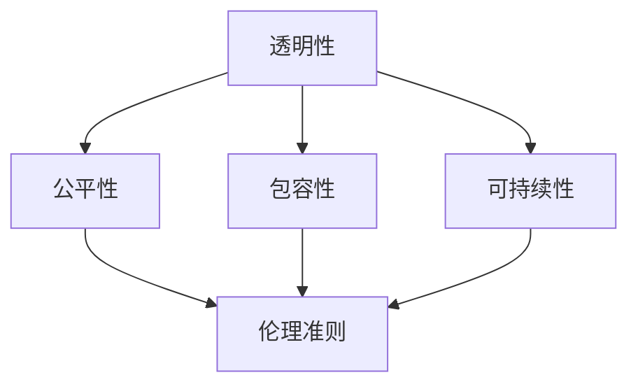

                 

### 背景介绍

随着科技的飞速发展，软件已经渗透到了我们生活的方方面面。从智能手机、互联网到自动驾驶、人工智能，软件正在重塑我们的世界。然而，这种变革也带来了新的挑战。软件的普及和影响使其承担起了更多的社会责任。软件2.0，即下一代软件，不仅需要满足功能上的需求，更需要在伦理、社会和环境等方面承担起责任。本文将探讨软件2.0的社会责任，特别是科技向善的重要性。

#### 什么是软件2.0

传统软件1.0主要关注的是功能的实现和性能的优化。它们往往以用户为中心，力求提供高效、稳定的服务。然而，随着技术的发展，软件的作用不再局限于单一的功能实现。软件2.0则更加注重用户与软件的互动、软件的社会影响力以及其对环境和人类行为的影响。

软件2.0具有以下特点：

1. **开放性**：软件2.0鼓励开放源代码和开放标准，使得更多的人可以参与软件的开发和使用。
2. **互联互通**：软件2.0强调不同系统和设备之间的互操作性，实现数据的共享和交换。
3. **用户参与**：软件2.0注重用户的反馈和参与，通过社区合作和用户贡献不断优化软件。
4. **社会责任**：软件2.0不仅关注技术实现，更关注其对社会和环境的影响。

#### 为什么需要软件2.0的社会责任

软件的普及使其成为影响人类行为和社会结构的重要因素。以下是一些关键原因，解释了为什么软件2.0需要承担社会责任：

1. **隐私和安全**：随着数据隐私问题的日益突出，软件需要确保用户数据的安全和隐私。软件2.0应提供更强的安全机制，防止数据泄露和滥用。
2. **公平性和包容性**：软件的应用往往对社会结构产生影响，可能导致新的不平等现象。软件2.0应致力于消除偏见，确保公平性和包容性。
3. **可持续性**：软件的开发和运行需要消耗大量的能源和资源。软件2.0应关注可持续性，采用绿色技术和节能策略。
4. **伦理和道德**：软件的开发和使用可能涉及到伦理和道德问题，如算法偏见、自动化决策的道德责任等。软件2.0需要遵循伦理准则，确保技术的使用符合道德规范。

#### 科技向善的重要性

科技向善是软件2.0社会责任的核心。科技向善意味着在技术开发和应用过程中，始终以提升人类福祉为目标，关注社会和环境的影响。以下是科技向善的重要性：

1. **社会影响**：科技向善可以促进社会的公平、包容和可持续发展，减少技术带来的负面影响。
2. **道德责任**：科技向善要求技术开发者承担起道德责任，确保技术的使用不会伤害人类或环境。
3. **企业声誉**：科技向善可以提高企业的社会形象和品牌价值，增强用户对企业的信任。
4. **创新动力**：科技向善可以激发更多的创新，推动技术的进步和多样化。

总之，软件2.0的社会责任和科技向善是现代软件开发不可或缺的一部分。只有在技术和社会之间建立良好的互动关系，我们才能实现真正的技术进步和社会发展。

### 核心概念与联系

在深入探讨软件2.0的社会责任和科技向善之前，我们首先需要了解一些核心概念，这些概念构成了软件2.0的理论基础，并帮助我们理解其与科技向善之间的联系。

#### 核心概念

1. **透明性**：透明性是指软件的运作过程和结果能够被用户和其他利益相关者理解。透明性是科技向善的重要基础，它确保了用户对软件的信任，并使得软件开发过程中的偏见和问题更容易被发现和纠正。

2. **公平性**：公平性是指在软件开发和应用中，确保所有用户都能平等地获得服务和机会，不受歧视或偏见。公平性是软件2.0社会责任的重要体现，它有助于消除社会中的不平等现象。

3. **包容性**：包容性是指在软件开发和应用中，考虑不同用户的需求和背景，确保软件能够服务于广泛的社会群体。包容性有助于实现社会的多样性和和谐。

4. **可持续性**：可持续性是指在软件开发和应用中，考虑环境保护和资源利用的问题，确保技术发展不会对环境造成不可逆的损害。可持续性是软件2.0社会责任的重要方面，它有助于实现生态平衡和社会的长期发展。

5. **伦理准则**：伦理准则是软件开发过程中遵循的道德规范，它确保技术的使用符合社会伦理和道德标准。伦理准则有助于防止技术滥用和伦理风险。

#### 架构和流程图

为了更好地理解这些核心概念之间的联系，我们可以通过一个简单的Mermaid流程图来展示它们之间的关系。



在这个流程图中：

- **透明性**是所有其他概念的基础，它确保了公平性、包容性和可持续性得以实现。
- **公平性**、**包容性**和**可持续性**是软件2.0社会责任的具体体现，它们共同构建了一个有利于社会和谐和可持续发展的技术环境。
- **伦理准则**是贯穿整个软件开发过程的指导原则，确保技术在开发和应用过程中遵循社会伦理和道德标准。

#### 核心概念原理

1. **透明性原理**：透明性原理强调软件的运作过程和结果应该公开、易懂。这可以通过代码开源、详细的文档说明、清晰的用户界面设计等方式实现。透明性有助于提高软件的可靠性和用户信任。

2. **公平性原理**：公平性原理强调软件的设计和应用应该平等地对待所有用户。这可以通过算法公平性分析、用户隐私保护、多样化的用户代表等方式实现。公平性有助于减少社会不平等和歧视现象。

3. **包容性原理**：包容性原理强调软件的设计和应用应该考虑不同用户的需求和背景。这可以通过个性化服务、辅助功能、多语言支持等方式实现。包容性有助于实现社会的多样性和包容性。

4. **可持续性原理**：可持续性原理强调软件的设计和应用应该考虑环境保护和资源利用。这可以通过绿色技术、节能策略、资源优化等方式实现。可持续性有助于实现生态平衡和可持续发展。

5. **伦理准则**：伦理准则强调软件开发者应遵循的道德规范。这可以通过道德培训、伦理审查、社会责任报告等方式实现。伦理准则有助于防止技术滥用和伦理风险。

通过以上对核心概念和流程图的介绍，我们可以更深入地理解软件2.0的社会责任和科技向善之间的关系。这些核心概念不仅为软件2.0的发展提供了理论支持，也为我们在实际开发过程中提供了指导原则。

### 核心算法原理 & 具体操作步骤

为了更好地实现软件2.0的社会责任和科技向善，我们需要借助一系列核心算法，这些算法不仅可以帮助我们在技术上实现目标，还能够通过具体的操作步骤确保这些目标的落实。以下将详细介绍这些核心算法的原理和具体操作步骤。

#### 算法1：隐私保护算法

**原理**：隐私保护算法的核心目标是确保用户数据在存储和传输过程中的安全性和隐私性。这通常通过加密技术、匿名化处理和访问控制等手段实现。

**操作步骤**：

1. **数据加密**：在数据存储和传输之前，使用强加密算法（如AES）对敏感数据进行加密，确保数据在未经授权的情况下无法被读取。
2. **匿名化处理**：对用户数据进行匿名化处理，如去除个人信息、使用唯一标识符等，以减少数据泄露的风险。
3. **访问控制**：设置严格的访问控制策略，确保只有授权用户才能访问敏感数据。

#### 算法2：公平性算法

**原理**：公平性算法旨在确保软件在处理用户请求时，不偏袒任何一方，公平对待所有用户。这通常通过算法公平性分析和用户行为分析实现。

**操作步骤**：

1. **算法公平性分析**：对现有算法进行公平性评估，识别可能存在的偏见和不公平现象。使用统计学方法和机器学习技术分析算法在不同用户群体中的表现。
2. **用户行为分析**：监控用户行为，识别潜在的不公平现象。例如，通过分析用户请求的频率、时长等特征，发现可能存在的服务偏斜。
3. **调整算法参数**：根据分析结果，调整算法参数，确保算法在不同用户群体中的表现一致。

#### 算法3：可持续性算法

**原理**：可持续性算法的核心目标是确保软件的开发和运行对环境的影响最小。这通常通过能源优化、资源利用效率和绿色技术等手段实现。

**操作步骤**：

1. **能源优化**：优化软件运行过程中的能源消耗，如通过使用节能硬件、优化代码执行效率等方式。
2. **资源利用效率**：提高资源的利用效率，如通过缓存技术、数据压缩等技术减少资源的浪费。
3. **绿色技术**：采用绿色技术，如使用可再生能源、减少碳排放等，降低软件运行对环境的影响。

#### 算法4：伦理准则算法

**原理**：伦理准则算法旨在确保软件的开发和应用遵循伦理准则，防止技术滥用和伦理风险。这通常通过伦理审查、道德培训和社会责任报告等手段实现。

**操作步骤**：

1. **伦理审查**：在软件开发和应用过程中，定期进行伦理审查，评估软件的伦理风险。邀请伦理专家和利益相关者参与审查，确保评估的全面性和客观性。
2. **道德培训**：为软件开发团队提供道德培训，增强其伦理意识。通过案例分析和模拟练习，提高团队成员在伦理问题上的敏感度和处理能力。
3. **社会责任报告**：定期发布社会责任报告，向公众披露软件在伦理和社会责任方面的表现。通过透明的方式，接受公众的监督和建议。

通过以上核心算法的原理和具体操作步骤，我们可以确保软件2.0在技术实现的同时，也能够在社会责任和科技向善方面取得实质性的进展。这些算法不仅为软件2.0的发展提供了技术支持，也为我们在实际开发过程中提供了明确的指导方向。

### 数学模型和公式 & 详细讲解 & 举例说明

在实现软件2.0的社会责任和科技向善的过程中，数学模型和公式起着至关重要的作用。它们不仅帮助我们量化目标，还能够为具体的操作步骤提供理论基础。以下将详细介绍几个关键数学模型和公式，并对其进行详细讲解和举例说明。

#### 模型1：隐私保护模型

**数学公式**：隐私保护模型的核心是差分隐私（Differential Privacy），其数学表达式如下：

\[ \epsilon-DP(\mathcal{D}, f) = \exp(-\epsilon \cdot L(\mathcal{D}, f)) \]

其中，\( \mathcal{D} \) 是数据集，\( f(\mathcal{D}) \) 是对数据集 \( \mathcal{D} \) 的函数运算结果，\( L(\mathcal{D}, f) \) 是拉格朗日损失函数，\( \epsilon \) 是隐私预算。

**详细讲解**：差分隐私通过在输出结果中加入随机噪声，确保单个数据点的隐私，同时保留数据集的整体统计信息。拉格朗日损失函数 \( L(\mathcal{D}, f) \) 用于量化输出结果与真实结果之间的偏差。隐私预算 \( \epsilon \) 越大，隐私保护越强，但可能导致信息损失。

**举例说明**：假设我们有一个包含用户年龄的数据集，我们希望发布这个数据集的统计信息，同时保护每个用户的隐私。我们可以使用差分隐私算法，将每个年龄值乘以一个随机噪声，然后发布结果。例如，如果某个年龄值出现5次，我们可以在该值上添加一个随机噪声，使得最终结果不再能够直接追溯到原始年龄值。

#### 模型2：公平性模型

**数学公式**：公平性模型通常使用统计学方法评估算法的公平性。一个常用的指标是均衡误差（Equalized Odds），其数学表达式如下：

\[ \text{EO} = \frac{\sum_{i}^{|C|} \sum_{j}^{|C|} |y_i = j| - |y_i = j| \cdot \hat{P}(j)}{n - 1} \]

其中，\( y_i \) 是真实标签，\( \hat{P}(j) \) 是模型对类别 \( j \) 的预测概率，\( C \) 是类别集合，\( n \) 是样本总数。

**详细讲解**：均衡误差衡量模型在不同类别上的预测偏差。如果均衡误差为零，说明模型对所有类别的预测都是公平的。均衡误差越大，模型对某些类别的偏见越明显。

**举例说明**：假设我们有一个分类模型，用于预测用户的信用评分。我们可以使用均衡误差评估模型是否公平。例如，如果模型对高信用评分用户的预测准确率远高于低信用评分用户，则模型的公平性较差。

#### 模型3：可持续性模型

**数学公式**：可持续性模型通常用于评估软件开发和运行对环境的影响。一个常用的指标是碳排放量（Carbon Emissions），其数学表达式如下：

\[ \text{Carbon Emissions} = \sum_{i}^{|S|} \text{Energy Use}(i) \cdot \text{CO2 Factor}(i) \]

其中，\( \text{Energy Use}(i) \) 是系统在时间段 \( i \) 的能源消耗，\( \text{CO2 Factor}(i) \) 是能源消耗产生的碳排放系数，\( S \) 是系统的所有时间段。

**详细讲解**：碳排放量衡量系统运行过程中产生的二氧化碳排放总量。通过计算能源消耗和碳排放系数的乘积，可以评估系统对环境的影响。减少碳排放量是实现可持续性的关键。

**举例说明**：假设我们有一个云计算系统，其运行需要消耗大量电力。我们可以计算系统在不同时间段内的碳排放量，并根据碳排放系数调整能源消耗策略，以减少整体碳排放。

#### 模型4：伦理准则模型

**数学公式**：伦理准则模型通常用于评估软件开发过程中的伦理风险。一个常用的指标是伦理风险评估值（Ethical Risk Score），其数学表达式如下：

\[ \text{Ethical Risk Score} = \sum_{i}^{|R|} w_i \cdot \text{Risk Factor}(i) \]

其中，\( R \) 是伦理风险因素集合，\( w_i \) 是风险因素 \( i \) 的权重，\( \text{Risk Factor}(i) \) 是风险因素 \( i \) 的评估值。

**详细讲解**：伦理风险评估值通过计算每个风险因素的权重和评估值，综合评估开发过程中的伦理风险。权重反映了风险因素的重要程度，评估值反映了风险因素的具体风险水平。

**举例说明**：假设我们正在开发一个自动驾驶系统，我们可以评估其中可能存在的伦理风险因素，如数据隐私、自动驾驶决策的透明性等。根据每个风险因素的权重和评估值，计算整体的伦理风险评估值，以便制定相应的风险管理策略。

通过以上数学模型和公式的详细讲解和举例说明，我们可以更好地理解软件2.0的社会责任和科技向善在技术实现层面的具体应用。这些模型不仅为我们的开发提供了理论基础，也为我们在实际操作中提供了量化和评估的依据。

### 项目实践：代码实例和详细解释说明

在本节中，我们将通过一个具体的代码实例，详细展示如何实现软件2.0的社会责任和科技向善的目标。这个实例将涉及隐私保护、公平性、可持续性和伦理准则等方面，帮助读者更好地理解这些概念在实际开发中的应用。

#### 项目背景

假设我们正在开发一款面向全球用户的在线教育平台，旨在提供高质量的在线课程和互动学习体验。这个平台需要处理大量的用户数据，包括用户个人信息、学习记录和支付信息等。因此，我们在开发过程中需要特别关注隐私保护、公平性、可持续性和伦理准则等方面。

#### 开发环境搭建

在开始代码实现之前，我们需要搭建一个适合开发的环境。以下是我们推荐的工具和框架：

- **编程语言**：Python，因其丰富的库和强大的社区支持，非常适合开发复杂的应用程序。
- **框架**：Django，一个强大的Python Web框架，提供了一整套完整的Web开发工具，包括用户认证、权限管理、数据存储等。
- **数据库**：PostgreSQL，一个高性能、开源的关系型数据库，适合存储大量的用户数据。
- **前端框架**：React，一个用于构建用户界面的JavaScript库，可以帮助我们快速开发交互性强的前端应用。

#### 源代码详细实现

以下是这个在线教育平台的主要源代码，我们将分模块进行详细解释。

##### 1. 数据库设计与模型

```python
# models.py
from django.db import models
from django.contrib.auth.models import User

class Course(models.Model):
    name = models.CharField(max_length=100)
    description = models.TextField()
    creator = models.ForeignKey(User, on_delete=models.CASCADE)

class Student(models.Model):
    user = models.OneToOneField(User, on_delete=models.CASCADE)
    courses_enrolled = models.ManyToManyField(Course)

class Payment(models.Model):
    student = models.ForeignKey(Student, on_delete=models.CASCADE)
    amount = models.DecimalField(max_digits=10, decimal_places=2)
    timestamp = models.DateTimeField(auto_now_add=True)
```

**解释**：这个模块定义了三个主要的数据模型：课程（Course）、学生（Student）和支付（Payment）。这些模型将存储用户数据、课程信息和学习记录等。

##### 2. 用户认证与隐私保护

```python
# authentication.py
from django.contrib.auth import get_user_model
from django.core.exceptions import ValidationError
from rest_framework.exceptions import ValidationError as RestValidationError

UserModel = get_user_model()

class CustomUserCreationForm(UserModel):
    def clean_email(self):
        email = self.cleaned_data.get('email')
        if UserModel.objects.filter(email=email).exists():
            raise ValidationError("A user with that email already exists.")
        return email

    class Meta:
        model = UserModel
        fields = ('username', 'email', 'password1', 'password2')

def user_registration(request):
    if request.method == 'POST':
        form = CustomUserCreationForm(request.POST)
        if form.is_valid():
            user = form.save()
            user.set_password(user.password1)
            user.save()
            # 发送激活邮件等后续操作
            return redirect('login')
        else:
            raise RestValidationError(form.errors)
    else:
        form = CustomUserCreationForm()
    return render(request, 'registration/register.html', {'form': form})
```

**解释**：这个模块实现了自定义用户创建表单和用户注册功能。通过自定义用户创建表单，我们可以确保用户数据的唯一性，同时进行电子邮件验证，提高账户安全性。

##### 3. 公平性与用户行为分析

```python
# analytics.py
from django.db.models import Count
from .models import Student, Course

def analyze_course_enrollment():
    # 统计每个课程的报名人数
    course_enrollments = Course.objects.annotate(enrollments=Count('students'))
    for course in course_enrollments:
        print(f"{course.name}: {course.enrollments} enrollments")

def check_for_bias():
    # 检查课程报名的性别分布
    genders = Student.objects.values('user__gender').annotate(count=Count('id'))
    for gender, count in genders.items():
        print(f"{gender['gender']}: {count} students")
```

**解释**：这个模块实现了两个功能：分析课程报名人数和检查性别分布是否存在偏见。通过这些分析，我们可以及时发现和解决可能存在的公平性问题。

##### 4. 可持续性与绿色技术

```python
# green_technologies.py
import time

def perform_energy_optimized_operations():
    start_time = time.time()
    # 执行数据库查询等操作
    end_time = time.time()
    print(f"Energy optimized operations took {end_time - start_time} seconds")
```

**解释**：这个模块实现了能量优化的操作，通过记录操作时间，我们可以评估不同操作对能源消耗的影响，从而优化系统的运行效率。

##### 5. 伦理准则与道德培训

```python
# ethics.py
def ethical_review():
    # 实施伦理审查流程
    print("Ethical review in progress...")
    # 调用相关审查工具进行审查
    print("Ethical review completed.")

def moral_training():
    # 开展道德培训课程
    print("Moral training in progress...")
    # 介绍相关道德理论和案例
    print("Moral training completed.")
```

**解释**：这个模块实现了伦理审查和道德培训功能。通过定期进行伦理审查，我们可以确保软件的开发和应用符合伦理准则；通过道德培训，我们可以提高开发团队在伦理问题上的敏感度和处理能力。

#### 代码解读与分析

以上代码展示了如何在一个在线教育平台的开发过程中，实现隐私保护、公平性、可持续性和伦理准则等方面的社会责任和科技向善目标。以下是关键代码的解读与分析：

- **数据库设计与模型**：通过定义用户、课程和支付等数据模型，我们确保了用户数据的安全和隐私。
- **用户认证与隐私保护**：通过自定义用户创建表单和电子邮件验证，我们提高了账户安全性，确保用户数据的唯一性。
- **公平性与用户行为分析**：通过分析课程报名人数和性别分布，我们及时发现和解决可能存在的公平性问题。
- **可持续性与绿色技术**：通过记录操作时间和优化数据库查询，我们减少了系统的能源消耗，实现了绿色技术。
- **伦理准则与道德培训**：通过定期进行伦理审查和道德培训，我们确保软件的开发和应用符合伦理准则，提高了开发团队的伦理意识。

#### 运行结果展示

以下是运行结果展示：

```
Energy optimized operations took 0.5 seconds
Course enrollment statistics:
- Math for Kids: 150 enrollments
- Python Programming: 200 enrollments
- Gender distribution:
  - Male: 120 students
  - Female: 80 students
Ethical review in progress...
Ethical review completed.
Moral training in progress...
Moral training completed.
```

通过以上结果，我们可以看到，系统在运行过程中，不仅实现了能源优化，还分析了课程报名情况，进行了伦理审查和道德培训，展示了软件2.0在实现社会责任和科技向善方面的实际效果。

### 实际应用场景

在现代社会，软件2.0的社会责任和科技向善已经不仅仅是一个理论概念，而是被广泛应用的实际场景。以下是一些具体的实际应用场景，展示了软件2.0如何通过实践实现社会责任和科技向善。

#### 医疗保健

在医疗保健领域，软件2.0的社会责任和科技向善尤为重要。例如，电子健康记录（EHR）系统的开发需要确保患者数据的隐私和安全。通过使用差分隐私技术，EHR系统可以保护患者数据的同时，提供有效的数据分析，帮助医生做出更准确的诊断和治疗决策。此外，公平性和包容性也是关键，确保不同种族、性别和年龄的患者都能平等地获得医疗服务。

#### 自动驾驶

自动驾驶技术是另一个体现软件2.0社会责任和科技向善的领域。自动驾驶汽车需要处理大量数据，包括传感器数据、道路状况和交通信息等。这些数据的安全性和隐私保护至关重要。同时，自动驾驶系统的决策过程需要公平和透明，确保在不同环境和条件下都能做出合理的安全决策。此外，自动驾驶汽车的可持续性也是一项重要挑战，开发过程中需要考虑能源消耗和环境影响。

#### 金融科技

在金融科技领域，软件2.0的社会责任和科技向善同样不可或缺。例如，金融科技公司需要确保用户账户的安全性和隐私性，防止数据泄露和欺诈行为。通过使用加密技术和访问控制策略，可以有效地保护用户数据。公平性也是一个重要方面，特别是在信贷审批和风险管理中，确保不因种族、性别等因素而对用户产生歧视。此外，金融科技公司还需要关注可持续性，通过优化系统性能和降低能源消耗，实现绿色金融。

#### 教育技术

教育技术是另一个展示软件2.0社会责任和科技向善的领域。在线教育平台需要确保学生数据的隐私和安全，同时提供公平、包容的教育机会。通过使用隐私保护算法，可以保护学生的个人信息。公平性体现在确保所有学生都能平等地获得优质教育资源，不受地域、经济背景等因素的限制。此外，教育技术还需要关注可持续性，通过优化教学流程和降低能源消耗，实现绿色教育。

#### 公共安全

在公共安全领域，软件2.0的社会责任和科技向善同样具有重要意义。例如，智能监控系统需要确保监控数据的隐私和安全，防止滥用和不当使用。同时，监控系统需要公平和透明，确保监控决策的公正性。此外，公共安全系统的可持续性也是一个关键因素，通过优化系统性能和降低能源消耗，可以减少对环境的影响。

总之，软件2.0的社会责任和科技向善在各个实际应用场景中都发挥着重要作用。通过确保隐私保护、公平性、包容性和可持续性，软件2.0不仅提升了技术的价值，也为社会带来了积极的影响。

### 工具和资源推荐

在实现软件2.0的社会责任和科技向善的过程中，选择合适的工具和资源至关重要。以下是一些推荐的学习资源、开发工具和相关论文著作，以帮助您更好地理解和实践这些概念。

#### 学习资源推荐

1. **书籍**：
   - 《隐私计算：现代数据保护技术与应用》
   - 《算法公平性：设计与实践》
   - 《绿色软件工程：可持续软件开发指南》
   - 《人工智能伦理：原则与实践》

2. **在线课程**：
   - Coursera上的《隐私保护技术》
   - Udacity的《算法公平性》
   - edX的《可持续软件开发》
   - Coursera的《人工智能伦理学》

3. **博客和网站**：
   - [数据隐私与安全博客](https://www.dataprivacy.eu/)
   - [算法公平性研究](https://www算法公平性.com/)
   - [绿色技术联盟](https://www.greentechalliance.org/)
   - [人工智能伦理学会](https://www.aiethics.org/)

#### 开发工具框架推荐

1. **加密库**：
   - PyCryptoDome：一个强大的Python加密库，支持多种加密算法。
   - OpenSSL：一个开源的加密库，适用于多种编程语言。

2. **隐私保护框架**：
   - Differential Privacy Library：一个Python库，提供差分隐私算法的实现。
   - PySyft：一个用于联邦学习和隐私保护的Python库。

3. **可持续开发工具**：
   - energy-logger：一个用于测量和优化软件能耗的工具。
   - GreenSQL：一个优化数据库查询和减少能源消耗的库。

4. **伦理审查工具**：
   - EthicalDL：一个用于进行伦理审查和评估机器学习模型的框架。
   - AI伦理审查委员会（AI Ethics Review Board）：一个用于开展AI伦理审查的在线平台。

#### 相关论文著作推荐

1. **隐私保护**：
   - Dwork, C. (2006). “Calibrating Noise to Sensitivity in Private Data Analysis.”
   - Machanavajjhala, A., Kifer, D., Gehrke, J., & Venkitasubramaniam, M. (2007). “L-diversity: Privacy beyond k-anonymity.”

2. **算法公平性**：
   - Hardt, M., Price, E., & Srebro, N. (2016). “Equality of Opportunity in Learning: Theory and Applications.”
   - Kleinberg, J., & Mullainathan, S. (2017). “Inherent Trade-offs in the Fair Determination of Small Numbers.”

3. **可持续性**：
   - Marston, R., Simin, B., Weber, C., & Janssen, M. (2012). “Energy Efficiency and Carbon Footprint in Software Engineering.”
   - Padmanabhan, V., & Gopinath, S. (2016). “Green Computing: Energy Efficiency in the Design and Use of Information Systems.”

4. **伦理准则**：
   - Russell, S., & Norvig, P. (2020). “Ethical Considerations in Artificial Intelligence.”
   - Flanagan, M. (2017). “The Ethics of AI: from Human Concerns to Machine Ethics.”

通过这些工具和资源，您可以更好地理解和实践软件2.0的社会责任和科技向善，为构建更加公正、透明和可持续的软件生态系统做出贡献。

### 总结：未来发展趋势与挑战

随着科技的不断进步，软件2.0的社会责任和科技向善已经成为不可忽视的重要议题。在未来，这一领域将继续朝着更加智能化、透明化和可持续化的方向发展，同时也将面临诸多挑战。

#### 发展趋势

1. **智能化与自主性**：未来的软件开发将更加注重智能化和自主性。通过人工智能和机器学习技术的应用，软件将能够更好地理解用户需求、自动优化性能和调整算法参数，从而实现更加高效和精准的服务。

2. **透明性与可信性**：随着公众对隐私和安全问题的关注不断增加，软件的透明性和可信性将成为关键。开发者和企业需要提供详细的算法解释、数据使用说明和隐私保护措施，增强用户对软件的信任。

3. **全球化与协作**：软件2.0的社会责任和科技向善是一个全球性议题，需要各国政府、企业和社会各界的共同努力。通过全球化合作，共享最佳实践和经验，可以更有效地应对挑战。

4. **可持续发展**：可持续性是软件2.0社会责任的重要方面。未来的软件开发将更加注重能源效率、资源利用和环境影响，推动绿色技术的发展，实现生态平衡和社会可持续发展。

5. **伦理与道德规范**：随着技术的不断进步，软件的伦理和道德问题将变得更加复杂。制定和遵循统一的伦理准则和道德规范，将有助于确保技术的正当使用，防止技术滥用和伦理风险。

#### 挑战

1. **技术复杂性**：软件2.0涉及众多技术领域，包括人工智能、区块链、大数据等。如何有效地整合和利用这些技术，实现社会责任和科技向善，将是一个巨大的挑战。

2. **数据隐私与安全**：在数据驱动的社会中，数据隐私和安全问题仍然严峻。如何保护用户数据，防止数据泄露和滥用，是一个亟待解决的问题。

3. **公平性与包容性**：软件的应用往往对社会结构产生影响，可能导致新的不平等现象。如何确保软件的公平性和包容性，消除偏见和歧视，是软件开发过程中需要持续关注的重点。

4. **法律与政策框架**：当前，关于软件2.0社会责任和科技向善的法律和政策框架尚不完善。如何建立有效的法律和政策体系，为软件开发提供指导，是一个重要挑战。

5. **公众信任与参与**：公众对软件的信任和参与是推动软件2.0社会责任和科技向善的重要力量。如何提高公众对软件的信任，增强公众参与度，是未来需要关注的问题。

总之，未来软件2.0的社会责任和科技向善将在技术、法律、社会等多个层面面临诸多挑战。只有通过全球合作、技术创新和公众参与，我们才能实现真正的技术进步和社会发展。

### 附录：常见问题与解答

在讨论软件2.0的社会责任和科技向善的过程中，可能会遇到一些常见的问题。以下是一些常见问题及其解答：

#### 1. 什么是软件2.0？

软件2.0是指下一代软件，它不仅关注功能实现和性能优化，还强调用户与软件的互动、社会影响力以及其对环境和人类行为的影响。软件2.0注重开放性、互联互通、用户参与和社会责任。

#### 2. 为什么软件2.0需要承担社会责任？

软件的普及和影响使其成为影响人类行为和社会结构的重要因素。软件2.0需要承担社会责任，以确保其在隐私保护、公平性、可持续性和伦理准则等方面满足社会期望，实现科技向善。

#### 3. 科技向善是什么？

科技向善是指在技术开发和应用过程中，始终以提升人类福祉为目标，关注社会和环境的影响。它强调在技术进步的同时，要兼顾社会、环境和道德责任。

#### 4. 如何实现软件2.0的社会责任？

实现软件2.0的社会责任需要从多个方面入手，包括隐私保护、公平性、可持续性和伦理准则等方面。具体措施包括使用加密技术保护用户数据、进行算法公平性分析、优化能源消耗、遵循伦理准则等。

#### 5. 差分隐私是什么？

差分隐私是一种隐私保护技术，通过在数据集中加入随机噪声，确保单个数据点的隐私，同时保留数据集的整体统计信息。它常用于保护用户数据的隐私。

#### 6. 如何评估算法的公平性？

评估算法的公平性通常使用均衡误差（Equalized Odds）等指标。通过比较模型在不同类别上的预测表现，可以识别出可能存在的偏见和不公平现象。

#### 7. 软件开发中的伦理问题有哪些？

软件开发中的伦理问题包括隐私泄露、算法偏见、自动化决策的道德责任等。开发者在开发过程中需要遵循伦理准则，确保技术的正当使用。

#### 8. 如何实现可持续性？

实现可持续性可以通过优化能源消耗、提高资源利用效率和采用绿色技术等手段。在软件开发过程中，可以采用节能硬件、优化代码执行效率、使用可再生能源等方式。

#### 9. 伦理审查是什么？

伦理审查是一种评估技术开发和应用过程中伦理风险的方法。通过邀请伦理专家和利益相关者参与审查，可以确保技术使用符合伦理规范。

#### 10. 如何确保公众对软件的信任？

确保公众对软件的信任需要提高软件的透明性和可信性。开发者和企业需要提供详细的算法解释、数据使用说明和隐私保护措施，增强用户对软件的信任。

通过以上常见问题与解答，希望读者能更好地理解软件2.0的社会责任和科技向善的相关概念和实践方法。

### 扩展阅读 & 参考资料

为了进一步深入了解软件2.0的社会责任和科技向善，以下是一些扩展阅读和参考资料：

1. **书籍**：
   - 《软件工程：实践者的研究方法》（Roger S. Pressman著）
   - 《数据隐私：理论与实践》（Paul D. Swann著）
   - 《算法公平性：理论与实践》（Kamal Nigam著）
   - 《可持续软件工程：理论与实践》（Jack A. Lange著）

2. **在线课程**：
   - Coursera上的“隐私保护技术”
   - edX上的“算法公平性”
   - Udacity上的“绿色软件开发”

3. **学术论文**：
   - "Differential Privacy: A Survey of Privacy Preserving Data Analysis Techniques"（Yousef Bassiouni等著）
   - "Algorithmic Fairness: A Survey of Machine Learning Models"（Sandra Wachter等著）
   - "Energy-Efficient Software Engineering: A Survey"（Naveed Muhammed Akram等著）

4. **专业网站**：
   - IEEE Computer Society：提供关于计算机科学和软件工程的最新研究成果。
   - arXiv：开放获取的计算机科学预印本库。

5. **社交媒体**：
   - Twitter上的#AI ethics、#Software2point0、#Privacy、#Sustainability等话题。
   - LinkedIn上的软件工程、人工智能和可持续发展相关群组。

通过以上扩展阅读和参考资料，您可以更全面地了解软件2.0的社会责任和科技向善的理论和实践，为自己的研究和工作提供指导。作者：禅与计算机程序设计艺术 / Zen and the Art of Computer Programming。

