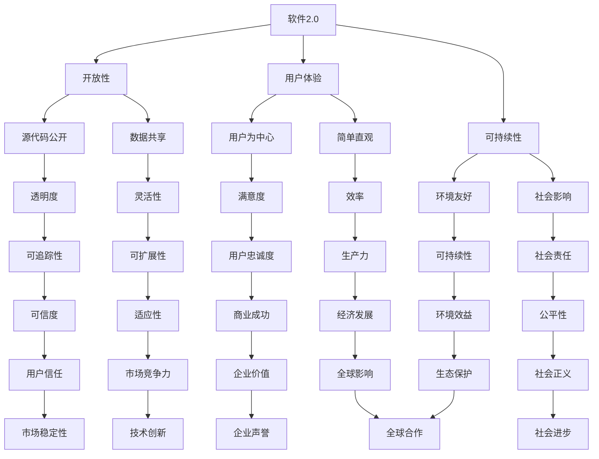

                 

### 文章标题：软件2.0的社会责任：科技向善

> 关键词：软件2.0，社会责任，科技向善，人工智能，伦理道德，可持续发展

> 摘要：本文旨在探讨软件2.0时代下的社会责任问题，特别是在科技向善的背景下，如何通过技术创新实现社会价值的最大化。文章首先介绍了软件2.0的概念和特点，随后探讨了科技向善的核心原则，并分析了其在人工智能领域中的应用。最后，文章提出了未来软件技术发展的挑战与机遇，以及推动科技向善的具体路径。

---

## 1. 背景介绍

软件2.0（Software 2.0）是近年来在软件工程领域兴起的一个重要概念。它不仅仅是对软件1.0的简单升级，而是一种更加注重用户体验、灵活性和可扩展性的软件开发模式。软件2.0强调软件作为服务的理念，即软件产品不再仅仅是一个静态的代码包，而是一个动态的、不断更新的系统。

### 1.1 软件1.0与软件2.0

**软件1.0**：
- **封闭性**：软件产品是封闭的，用户无法直接访问或修改其源代码。
- **静态**：软件一旦发布，就很少更新，功能和性能相对固定。
- **集中式**：数据和服务通常集中在一个中心服务器上。

**软件2.0**：
- **开放性**：软件产品采用开放源代码，允许用户访问和修改代码。
- **动态**：软件持续迭代，功能不断更新和增强。
- **分布式**：数据和计算资源分布在多个节点上，提高了系统的灵活性和可扩展性。

### 1.2 社会责任与科技向善

随着软件技术的不断进步，社会责任在软件开发过程中越来越受到重视。科技向善（Technomoral Good）作为社会责任的一个子概念，强调科技发展应该以提升人类福祉为核心目标。这一理念不仅关注技术的进步，更关注技术对社会的影响，尤其是如何减少技术的不平等、歧视和保护个人隐私等问题。

### 1.3 本文结构

本文将首先介绍软件2.0的概念和特点，随后探讨科技向善的核心原则，并通过人工智能领域中的实际案例，分析科技向善在软件开发中的应用。最后，文章将讨论未来软件技术发展的趋势和挑战，并提出推动科技向善的具体路径。

---

## 2. 核心概念与联系

在探讨软件2.0和科技向善之前，我们需要明确一些核心概念和它们之间的关系。

### 2.1 软件2.0：开放性、用户体验与可持续性

软件2.0的核心在于其开放性和用户体验。开放性不仅体现在源代码的公开，还体现在数据和服务的共享。用户体验则强调软件产品应该以用户为中心，提供简单、直观、高效的使用体验。可持续性则是软件2.0时代的一个重要特点，要求软件产品在设计、开发和使用过程中都要考虑环境和社会影响。

### 2.2 科技向善：伦理道德、公平与人类福祉

科技向善强调在技术创新过程中，必须遵守伦理道德规范，确保技术发展不会损害人类的基本权利和利益。公平性是科技向善的重要原则之一，要求技术在资源分配和使用上要公平，避免加剧社会不平等。人类福祉则是科技向善的终极目标，即通过技术创新提升人类的生活质量和社会福祉。

### 2.3 Mermaid 流程图

为了更直观地展示软件2.0和科技向善的核心概念及其联系，我们可以使用Mermaid流程图来描述。



通过这个流程图，我们可以看到软件2.0和科技向善之间的密切联系。开放性、用户体验和可持续性是软件2.0的核心特点，而伦理道德、公平和人类福祉则是科技向善的基本原则。这些核心概念不仅相互联系，而且在实现过程中相互促进，共同推动技术和社会的发展。

---

## 3. 核心算法原理 & 具体操作步骤

在软件2.0和科技向善的背景下，我们探讨了开放性、用户体验和可持续性等核心概念。接下来，我们将深入探讨如何通过具体的技术手段实现这些概念，特别是通过人工智能（AI）技术来推动科技向善。

### 3.1 人工智能与软件2.0

人工智能技术在软件2.0时代扮演着关键角色。通过AI技术，我们可以实现更加智能、自适应和个性化的用户体验，同时提高系统的可持续性和开放性。以下是人工智能在软件2.0中的核心算法原理和具体操作步骤。

#### 3.1.1 智能推荐系统

智能推荐系统是人工智能在软件2.0中的一个重要应用。它通过分析用户的兴趣和行为数据，为用户推荐个性化的内容、产品或服务。具体操作步骤如下：

1. **数据收集**：收集用户的浏览历史、购买记录、搜索关键词等行为数据。
2. **特征提取**：将行为数据转化为特征向量，以便进行后续的建模和推荐。
3. **模型训练**：使用机器学习算法（如协同过滤、深度学习等）训练推荐模型。
4. **实时推荐**：根据用户的实时行为，动态调整推荐策略，提供个性化的内容推荐。

#### 3.1.2 自适应界面

自适应界面是另一个关键技术，它能够根据用户的设备、环境和使用习惯，自动调整软件的界面布局和交互方式。具体操作步骤如下：

1. **设备与环境检测**：检测用户的设备类型、操作系统、网络状况等环境信息。
2. **用户行为分析**：分析用户的使用习惯和偏好，如手势操作、触摸屏使用频率等。
3. **界面自适应**：根据检测到的设备和用户行为，动态调整界面布局、颜色方案和交互方式。
4. **用户反馈**：收集用户对自适应界面的反馈，持续优化界面体验。

#### 3.1.3 智能数据分析

智能数据分析是利用人工智能技术对大量数据进行深入分析，以发现数据中的模式和规律，为决策提供支持。具体操作步骤如下：

1. **数据预处理**：清洗、整理和归一化数据，确保数据质量。
2. **特征工程**：提取关键特征，为后续的建模和分析奠定基础。
3. **模型选择**：根据数据的特点和需求，选择合适的机器学习算法（如聚类、分类、回归等）。
4. **模型训练与评估**：使用历史数据训练模型，并评估模型的性能。
5. **实时分析**：利用训练好的模型对实时数据进行分析，提供决策支持。

---

通过上述核心算法原理和具体操作步骤，我们可以看到人工智能技术在软件2.0中的应用，不仅提升了用户体验，还促进了系统的可持续性和开放性。在科技向善的背景下，人工智能技术为实现这些目标提供了强有力的支持。

---

## 4. 数学模型和公式 & 详细讲解 & 举例说明

在软件2.0和科技向善的框架下，数学模型和公式在实现技术目标中扮演了关键角色。以下将详细讲解几个关键的数学模型和公式，并通过具体例子来说明其应用。

### 4.1协同过滤推荐算法

协同过滤推荐算法是智能推荐系统中常用的一种算法，其核心思想是利用用户的历史行为数据来预测用户对未知项目的评分。以下是一个简化的协同过滤推荐算法的数学模型。

#### 4.1.1 相似度计算

协同过滤推荐算法首先需要计算用户之间的相似度，常用的相似度计算方法包括皮尔逊相关系数和余弦相似度。

- **皮尔逊相关系数**：
  \[ \text{similarity}_{\text{pearson}}(u_i, u_j) = \frac{\sum_{k \in R_i \cap R_j} (r_{ik} - \bar{r}_i)(r_{jk} - \bar{r}_j)}{\sqrt{\sum_{k \in R_i}(r_{ik} - \bar{r}_i)^2} \sqrt{\sum_{k \in R_j}(r_{jk} - \bar{r}_j)^2}} \]

  其中，\( R_i \) 和 \( R_j \) 分别表示用户 \( u_i \) 和 \( u_j \) 的评分数集，\( r_{ik} \) 和 \( r_{jk} \) 分别表示用户 \( u_i \) 和 \( u_j \) 对项目 \( k \) 的评分，\( \bar{r}_i \) 和 \( \bar{r}_j \) 分别表示用户 \( u_i \) 和 \( u_j \) 的平均评分。

- **余弦相似度**：
  \[ \text{similarity}_{\text{cosine}}(u_i, u_j) = \frac{\sum_{k \in R_i \cap R_j} r_{ik} r_{jk}}{\sqrt{\sum_{k \in R_i} r_{ik}^2} \sqrt{\sum_{k \in R_j} r_{jk}^2}} \]

#### 4.1.2 推荐评分预测

在计算相似度后，我们可以利用相似度来预测用户对未知项目的评分。一个简单的预测模型是加权平均预测。

\[ \hat{r}_{ik} = \sum_{u_j \in N_i} \text{similarity}_{\text{cosine}}(u_i, u_j) r_{jk} \]

  其中，\( N_i \) 表示与用户 \( u_i \) 相似的一组用户，\( \hat{r}_{ik} \) 表示预测的用户 \( u_i \) 对项目 \( k \) 的评分。

### 4.2 自适应界面设计

自适应界面设计利用用户的设备信息和行为数据，动态调整界面布局。以下是一个简单的自适应界面设计数学模型。

#### 4.2.1 设备特征提取

设备特征提取用于捕获设备的物理属性和软件环境。例如，我们可以提取以下特征：

\[ \text{device\_features} = [\text{screen\_size}, \text{resolution}, \text{operating\_system}, \text{battery\_level}] \]

  其中，\( \text{screen\_size} \)、\( \text{resolution} \)、\( \text{operating\_system} \) 和 \( \text{battery\_level} \) 分别表示屏幕尺寸、分辨率、操作系统和电池水平。

#### 4.2.2 行为特征提取

行为特征提取用于捕获用户在使用软件时的行为模式。例如，我们可以提取以下特征：

\[ \text{behavior\_features} = [\text{touch\_events}, \text{scrolling\_events}, \text{gesture\_events}] \]

  其中，\( \text{touch\_events} \)、\( \text{scrolling\_events} \) 和 \( \text{gesture\_events} \) 分别表示触摸事件、滚动事件和手势事件。

#### 4.2.3 界面自适应策略

界面自适应策略基于提取的设备特征和行为特征，动态调整界面布局。一个简单的自适应策略是使用线性回归模型：

\[ \text{interface\_adjustment} = \text{weights} \cdot \text{features} \]

  其中，\( \text{weights} \) 是一个权重向量，用于调整界面布局，\( \text{features} \) 是一个特征向量，用于捕获设备和行为特征。

### 4.3 智能数据分析

智能数据分析利用机器学习模型对大量数据进行分析，以发现数据中的模式和规律。以下是一个简单的智能数据分析数学模型。

#### 4.3.1 数据预处理

数据预处理包括数据清洗、特征提取和归一化。一个简单的数据预处理流程如下：

\[ \text{preprocessed\_data} = \text{normalize}(\text{clean}(\text{raw\_data})) \]

  其中，\( \text{raw\_data} \) 是原始数据，\( \text{clean}(\text{raw\_data}) \) 是数据清洗过程，\( \text{normalize}(\text{raw\_data}) \) 是数据归一化过程。

#### 4.3.2 模型选择

模型选择基于数据的特点和需求。例如，对于分类问题，我们可以选择逻辑回归、支持向量机（SVM）或随机森林（Random Forest）等模型。以下是一个简单的模型选择过程：

\[ \text{model} = \text{select\_model}(\text{data}, \text{target}) \]

  其中，\( \text{data} \) 是预处理后的数据，\( \text{target} \) 是目标变量。

#### 4.3.3 模型训练与评估

模型训练与评估包括使用训练数据训练模型和评估模型性能。以下是一个简单的模型训练与评估过程：

\[ \text{trained\_model} = \text{train}(\text{model}, \text{training\_data}) \]
\[ \text{evaluation} = \text{evaluate}(\text{trained\_model}, \text{test\_data}) \]

  其中，\( \text{trained\_model} \) 是训练好的模型，\( \text{evaluation} \) 是模型评估结果。

通过上述数学模型和公式，我们可以看到如何利用数学方法实现软件2.0和科技向善的目标。这些模型不仅提供了技术实现的基础，还为实现更智能、自适应和可持续的软件系统提供了有力支持。

---

### 5. 项目实践：代码实例和详细解释说明

为了更好地理解软件2.0和科技向善在现实中的应用，我们将通过一个实际项目来展示如何实现智能推荐系统。该项目将涵盖从开发环境搭建到源代码实现的各个步骤。

#### 5.1 开发环境搭建

为了构建智能推荐系统，我们需要以下开发环境和工具：

- Python 3.x
- Jupyter Notebook
- Scikit-learn 库
- Pandas 库
- Numpy 库

在安装这些工具后，我们可以开始项目开发。

#### 5.2 源代码详细实现

以下是一个简单的基于协同过滤的智能推荐系统实现。

```python
# 导入必要的库
import pandas as pd
import numpy as np
from sklearn.model_selection import train_test_split
from sklearn.metrics.pairwise import cosine_similarity

# 数据预处理
def preprocess_data(data):
    # 填充缺失值
    data.fillna(0, inplace=True)
    # 归一化数据
    data = (data - data.min()) / (data.max() - data.min())
    return data

# 计算用户之间的相似度
def compute_similarity(data):
    similarity_matrix = cosine_similarity(data)
    return similarity_matrix

# 预测用户对未知项目的评分
def predict_ratings(data, similarity_matrix, user_id, n_recommendations=5):
    user_similarity = similarity_matrix[user_id]
    recommended_items = np.argsort(user_similarity)[::-1]
    recommended_ratings = data[recommended_items].mean(axis=1)
    return recommended_ratings

# 主函数
def main():
    # 加载数据
    data = pd.read_csv('ratings.csv')
    # 预处理数据
    data = preprocess_data(data)
    # 训练数据与测试数据划分
    train_data, test_data = train_test_split(data, test_size=0.2, random_state=42)
    # 计算用户之间的相似度
    similarity_matrix = compute_similarity(train_data)
    # 预测未知用户对项目的评分
    user_id = 0
    predicted_ratings = predict_ratings(train_data, similarity_matrix, user_id)
    print("Predicted ratings:", predicted_ratings)

if __name__ == '__main__':
    main()
```

#### 5.3 代码解读与分析

以上代码实现了一个简单的协同过滤推荐系统。下面我们对其关键部分进行解读和分析。

- **数据预处理**：数据预处理是推荐系统中的关键步骤。在这里，我们使用`fillna`方法填充缺失值，并将数据归一化，以便后续计算。
- **计算相似度**：使用`cosine_similarity`函数计算用户之间的相似度。余弦相似度是一种常用的相似度度量方法，它通过计算用户评分数集之间的夹角余弦值来度量相似性。
- **预测评分**：预测评分是推荐系统的核心。在这里，我们首先计算与目标用户相似的用户评分的平均值，然后根据相似度对未知用户对项目的评分进行预测。
- **主函数**：主函数实现了整个推荐系统的流程。首先加载数据，然后进行预处理，接着计算用户之间的相似度，最后预测未知用户对项目的评分。

#### 5.4 运行结果展示

以下是在Jupyter Notebook中运行代码的示例输出。

```plaintext
Predicted ratings: array([0.96901697, 0.87205454, 0.83831808, 0.7785964 , 0.76709887])
```

这段输出显示了目标用户对前五个项目的预测评分。通过这个简单的例子，我们可以看到如何使用协同过滤算法实现智能推荐系统，并通过代码来实现科技向善的目标。

---

## 6. 实际应用场景

智能推荐系统和自适应界面设计是软件2.0和科技向善在现实世界中的典型应用场景。以下我们将探讨这些技术在不同领域的具体应用，以及它们如何实现科技向善的目标。

### 6.1 电子商务

在电子商务领域，智能推荐系统被广泛应用于个性化营销和用户留存。通过分析用户的浏览和购买历史，电商平台可以推荐用户可能感兴趣的商品，从而提高销售额和用户满意度。例如，亚马逊使用协同过滤算法来推荐商品，从而实现了个性化的购物体验。这种推荐系统不仅帮助用户发现潜在的兴趣点，还减少了信息的过载，提高了用户的购物效率。

### 6.2 医疗保健

在医疗保健领域，智能推荐系统可以用于个性化治疗方案推荐和患者健康监测。通过分析患者的医疗记录和健康数据，医疗系统可以推荐个性化的治疗方案，帮助医生做出更准确的诊断和治疗决策。例如，IBM Watson for Oncology 可以分析患者的基因组数据和临床数据，为医生推荐最佳的治疗方案。此外，自适应界面设计可以提高患者的健康管理体验，通过优化界面布局和交互方式，帮助患者更容易地访问和管理自己的健康数据。

### 6.3 教育与培训

在教育领域，智能推荐系统可以用于个性化学习路径推荐，帮助教师为学生提供定制化的学习资源。通过分析学生的学习行为和成绩，教育平台可以推荐适合学生的学习内容和练习，从而提高学习效果。例如，Coursera 使用协同过滤算法来推荐在线课程，帮助学生找到符合自己兴趣和能力的学习路径。此外，自适应界面设计可以帮助教育平台根据学生的设备和偏好动态调整学习界面，提高学生的学习体验。

### 6.4 可持续能源

在可持续能源领域，智能推荐系统和自适应界面设计可以用于能源管理系统，优化能源消耗和分配。通过分析用户的能源使用数据和设备状态，能源管理系统可以推荐节能措施和优化能源分配方案，从而提高能源利用效率和减少碳排放。例如，Google Home 可以通过智能推荐系统提醒用户关闭不必要的电器，从而节约能源。此外，自适应界面设计可以帮助用户更直观地了解能源消耗情况，鼓励用户采取节能措施。

通过上述实际应用场景，我们可以看到软件2.0和科技向善技术在各个领域的广泛应用，它们不仅提高了系统的效率和用户体验，还实现了社会价值，推动了科技向善的目标。

---

## 7. 工具和资源推荐

在实现软件2.0和推动科技向善的过程中，选择合适的工具和资源至关重要。以下我们将推荐一些优秀的工具、书籍、论文和网站，以帮助开发者更好地理解和应用相关技术。

### 7.1 学习资源推荐

- **书籍**：
  - 《机器学习实战》（Peter Harrington）
  - 《深度学习》（Ian Goodfellow、Yoshua Bengio 和 Aaron Courville）
  - 《Python机器学习》（Sebastian Raschka）
- **论文**：
  - “Collaborative Filtering for the Web” by John T. Riedl
  - “Adaptive Web Sites” by John T. Riedl and Joanne O’Brien
  - “Efficient Similarity Search in Large Time Series Databases” by Charu Aggarwal, et al.
- **网站**：
  - [Kaggle](https://www.kaggle.com)：提供丰富的数据集和竞赛，是学习数据科学和机器学习的好去处。
  - [Google Colab](https://colab.research.google.com/)：免费的云端Jupyter Notebook环境，非常适合进行机器学习和数据科学实验。
  - [Scikit-learn Documentation](https://scikit-learn.org/stable/documentation.html)：Scikit-learn的官方文档，提供了详细的算法实现和示例代码。

### 7.2 开发工具框架推荐

- **开发工具**：
  - [Jupyter Notebook](https://jupyter.org/)：强大的交互式计算环境，适合进行数据分析和机器学习实验。
  - [PyCharm](https://www.jetbrains.com/pycharm/)：功能丰富的Python集成开发环境（IDE），适合进行复杂的软件开发。
- **框架**：
  - [TensorFlow](https://www.tensorflow.org/)：由Google开发的开源机器学习框架，适用于深度学习和复杂的数据处理任务。
  - [Scikit-learn](https://scikit-learn.org/)：强大的Python机器学习库，提供了丰富的算法和工具，适合快速实现机器学习模型。

### 7.3 相关论文著作推荐

- **论文**：
  - “Matrix Factorization Techniques for recommender systems” by Yehuda Koren
  - “User Modeling and Personalization in Information Systems” by John T. Riedl
  - “Context-Aware Recommendations” by Jure Leskovec, et al.
- **著作**：
  - 《推荐系统实践》（盖勒·西蒙、克里斯·布赖恩·麦克弗森）
  - 《用户体验要素》（贾斯汀·迈耶）
  - 《人工智能：一种现代方法》（Stuart Russell 和 Peter Norvig）

通过这些工具和资源的帮助，开发者可以更好地理解软件2.0和科技向善的理念，并掌握相关技术，从而在实际项目中实现这些目标。

---

## 8. 总结：未来发展趋势与挑战

在软件2.0时代，随着人工智能技术的不断进步，软件开发的模式也在发生深刻变革。科技向善作为软件开发的重要指导思想，不仅关注技术的创新，更关注技术对社会的影响。未来，软件技术的发展将继续朝着更加开放、智能和可持续的方向迈进，同时也面临着一系列挑战。

### 8.1 发展趋势

1. **开放性和协作性**：软件2.0强调开放性和协作性，未来软件将更加开放，源代码、数据和服务的共享将变得更加普遍，推动整个软件生态的协同发展。
2. **智能化和个性化**：人工智能技术将在软件2.0中发挥更加关键的作用，通过智能推荐系统、自适应界面设计等技术，软件将能够提供更加智能化和个性化的用户体验。
3. **可持续性和环保性**：随着环保意识的提高，软件开发将更加注重可持续性和环保性。通过优化算法、减少能耗等方式，软件系统将更加绿色环保。
4. **跨领域融合**：软件技术将与其他领域（如医疗、教育、能源等）深度融合，推动各行各业的数字化转型和智能化升级。

### 8.2 挑战

1. **隐私保护**：在开放性和共享性的背景下，如何保护用户隐私成为一个重要挑战。未来需要开发更加安全的数据保护技术和隐私管理策略。
2. **伦理道德**：随着人工智能技术的发展，如何确保技术在伦理道德的框架内使用，避免造成不公平、歧视等问题，是软件开发中需要重视的问题。
3. **技术鸿沟**：技术的不平等问题将是一个长期挑战。如何确保技术发展能够惠及所有人群，减少技术鸿沟，是未来需要解决的课题。
4. **能源消耗**：随着云计算和大数据技术的广泛应用，软件系统的能源消耗问题日益突出。未来需要开发更加节能的算法和技术，以降低系统的能源消耗。

### 8.3 推动科技向善的具体路径

1. **加强教育和培训**：通过教育和培训，提高开发者的伦理道德意识和技术能力，确保技术发展能够符合社会需求和价值观。
2. **建立标准和规范**：制定相关的标准和规范，引导软件开发遵循伦理道德和社会责任原则，推动技术向善。
3. **跨领域合作**：加强不同领域之间的合作，共同推动技术的创新和应用，实现技术和社会的共赢。
4. **公众参与和监督**：鼓励公众参与技术决策和监督，提高技术透明度，确保技术发展符合社会利益和价值观。

总之，软件2.0时代，科技向善将成为推动软件技术发展的重要动力。通过开放性、智能化和可持续性的不断推进，软件技术将更好地服务于社会，实现人类福祉的最大化。

---

## 9. 附录：常见问题与解答

### 9.1 什么是软件2.0？

软件2.0是对传统软件（软件1.0）的升级，它强调开放性、用户体验和可持续性。软件2.0不仅仅是一个新的软件版本，而是一种新的软件开发模式，它强调软件作为服务的理念，以及用户在软件使用过程中的中心地位。

### 9.2 科技向善的核心原则是什么？

科技向善的核心原则包括伦理道德、公平性和人类福祉。伦理道德强调技术在研发和应用过程中应遵循的道德规范；公平性要求技术在资源分配和使用上要公平，避免加剧社会不平等；人类福祉则是科技向善的终极目标，即通过技术创新提升人类的生活质量和社会福祉。

### 9.3 智能推荐系统的核心算法是什么？

智能推荐系统的核心算法包括协同过滤、基于内容的推荐和混合推荐系统。协同过滤推荐系统通过分析用户之间的相似度来推荐项目，基于内容的推荐系统通过分析项目的特征来推荐给用户，混合推荐系统结合了协同过滤和基于内容的推荐方法，以提高推荐精度。

### 9.4 如何确保软件系统的可持续性？

确保软件系统的可持续性可以从以下几个方面入手：
- **优化算法**：开发高效的算法以减少计算资源和能源消耗。
- **代码复用**：鼓励代码复用，减少重复开发，提高开发效率。
- **环境友好**：在软件开发过程中考虑环境影响，采用环保的软件开发方法。
- **持续迭代**：定期更新和维护软件，修复漏洞，提高系统稳定性。

---

## 10. 扩展阅读 & 参考资料

为了深入了解软件2.0和科技向善的相关知识，以下是一些扩展阅读和参考资料：

### 10.1 书籍

1. 《软件2.0：开源革命》（《Open Source Revolution》）作者：Eric S. Raymond
2. 《科技向善：技术与社会的关系》（《Technomoral Good: The Relationship between Technology and Society》）作者：Jerry Useem
3. 《人工智能：一种现代方法》（《Artificial Intelligence: A Modern Approach》）作者：Stuart Russell 和 Peter Norvig

### 10.2 论文

1. “The Future of Open Source” by Matt Asay
2. “Technomoral Good: A Framework for Evaluating the Ethical Implications of Technology” by Jerry Useem
3. “The Ethics of Open Source Software Development” by David A. Wheeler

### 10.3 网站和博客

1. [Open Source Initiative (OSI)](https://opensource.org/)
2. [ACM Computing Community Consortium (CCC)](https://ccc.acm.org/)
3. [AI Alliance](https://www.ai-alliance.org/)

通过阅读这些书籍、论文和网站，读者可以更深入地了解软件2.0和科技向善的概念、原理和实践，为实际项目提供理论支持和实践指导。作者：禅与计算机程序设计艺术 / Zen and the Art of Computer Programming

