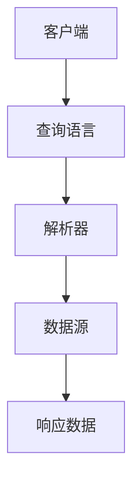
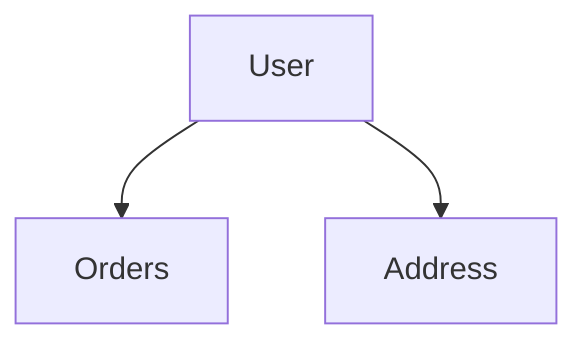
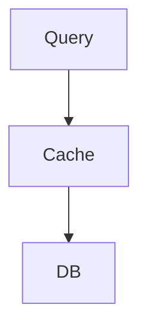
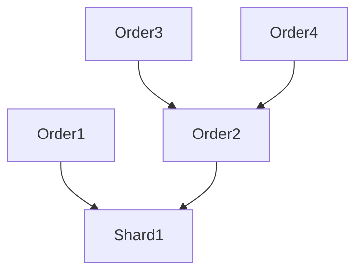

                 

### 背景介绍

在当今数字化时代，软件技术的发展日新月异。传统的设计模式已经难以满足快速变化的业务需求和复杂的系统架构。GraphQL API作为一种新一代的查询语言，逐渐成为软件开发中的热门选择。它以灵活、高效、低耦合的特点，为开发者提供了一种全新的数据处理方式，被誉为“软件2.0”的代表。

#### 软件2.0的概念

所谓软件2.0，是指在互联网和云计算时代，软件系统需要更加灵活、动态、模块化，能够快速适应变化。软件2.0不仅仅是技术的升级，更是一种软件开发理念和模式的转变。它强调以下几点：

1. **模块化与组件化**：软件系统应该由多个独立的模块组成，每个模块可以独立开发、测试和部署。
2. **动态扩展与重构**：系统应具备动态扩展和重构的能力，能够根据业务需求快速调整和优化。
3. **高可维护性和可测试性**：软件需要具备良好的可维护性和可测试性，以确保系统长期稳定运行。

#### GraphQL API的特点

GraphQL API在软件2.0的发展中扮演了重要角色，其特点主要体现在以下几个方面：

1. **灵活查询**：GraphQL允许客户端根据实际需要查询数据，而不是预先定义的数据模型。这种按需查询的方式，极大地提高了数据处理的灵活性和效率。
2. **减少数据传输**：GraphQL通过一次性请求获取所有需要的数据，减少了多次请求带来的开销和延迟。
3. **强类型定义**：GraphQL对数据类型进行了严格的定义，确保数据的一致性和正确性。
4. **易于集成与维护**：GraphQL API设计简单，易于与其他系统和工具集成，同时便于维护和扩展。

#### 软件2.0与GraphQL API的关系

软件2.0与GraphQL API之间存在紧密的联系。软件2.0的理念为GraphQL API的兴起提供了土壤，而GraphQL API则实现了软件2.0的核心思想。两者相辅相成，共同推动软件技术的进步：

1. **模块化与组件化**：GraphQL API通过灵活的查询方式，支持系统模块化和组件化。
2. **动态扩展与重构**：GraphQL API允许系统动态调整和优化数据查询，支持系统的动态扩展和重构。
3. **高可维护性和可测试性**：GraphQL API的强类型定义和简洁设计，提高了系统的可维护性和可测试性。

综上所述，GraphQL API不仅是软件2.0时代的技术利器，更是推动软件技术发展的关键力量。在接下来的章节中，我们将深入探讨GraphQL API的核心概念、算法原理和实际应用场景，以揭示其背后的奥妙。

---

### 核心概念与联系

#### GraphQL API的基础概念

GraphQL API的核心概念可以归结为以下几点：

1. **查询语言（Query Language）**：GraphQL提供了一种强大的查询语言，允许开发者通过结构化的方式请求他们所需的数据。与传统的REST API相比，GraphQL允许客户端指定需要的数据字段，避免了“过载”和“遗漏”的问题。
2. **类型系统（Type System）**：GraphQL定义了一整套类型系统，包括基本类型（如字符串、整数、布尔值等）和复合类型（如对象、列表等）。这些类型可以通过字段和子字段进行嵌套，形成复杂的数据结构。
3. **解析器（Resolver）**：解析器是GraphQL API中的关键组件，负责将查询请求转换为具体的操作，并从数据源中获取数据。解析器通常与后端服务紧密集成，实现数据查询和返回。

#### GraphQL API的架构

为了更好地理解GraphQL API的工作原理，我们可以使用Mermaid流程图来展示其核心架构。



在上述流程图中：

- **客户端**：通过GraphQL查询语言发起数据请求。
- **查询语言**：将查询语句转化为结构化数据。
- **解析器**：根据查询语句，调用相应的服务或数据库进行数据查询。
- **数据源**：返回查询结果给解析器。
- **响应数据**：将处理后的数据返回给客户端。

#### 核心概念之间的联系

1. **查询语言与类型系统**：查询语言基于类型系统构建，确保查询的语义明确。类型系统定义了数据结构，查询语言则描述了如何获取这些数据。
2. **解析器与数据源**：解析器负责将查询请求转化为对数据源的访问操作。数据源则是数据存储的实际位置，如数据库或服务端API。
3. **响应数据与查询语言**：响应数据是根据查询语言返回的结果。这些数据需要符合类型系统的定义，确保数据的一致性和完整性。

通过上述核心概念与流程图的详细解释，我们能够更深入地理解GraphQL API的工作机制。在接下来的章节中，我们将探讨GraphQL API的核心算法原理和具体操作步骤，以便更好地掌握这一技术。

---

### 核心算法原理 & 具体操作步骤

#### GraphQL查询语言

GraphQL查询语言是GraphQL API的核心组成部分。它允许开发者以声明式的方式查询所需的数据，并且可以精确控制返回的数据字段。以下是GraphQL查询语言的一些基本语法和操作步骤：

1. **选择字段**：在GraphQL中，查询通常以选择字段开始。例如，如果要查询一个用户的所有信息，可以写为：

   ```graphql
   query {
     user(id: "123") {
       name
       email
       age
     }
   }
   ```

   在这个例子中，`user`是查询的类型，`id`是变量，用于指定特定用户的ID，`name`、`email`和`age`是返回的字段。

2. **嵌套查询**：GraphQL支持嵌套查询，可以递归地查询嵌套在对象中的数据。例如，如果要查询用户及其关联的订单信息，可以写为：

   ```graphql
   query {
     user(id: "123") {
       name
       orders {
         id
         total
         date
       }
     }
   }
   ```

   在这个例子中，`orders`是嵌套在`user`中的字段，可以进一步查询。

3. **变量使用**：GraphQL允许在查询中使用变量，以便动态传递参数。例如：

   ```graphql
   query getUser($id: ID!) {
     user(id: $id) {
       name
       email
       age
     }
   }
   ```

   在这个例子中，`$id`是一个变量，可以在查询时提供具体的值。

#### 查询解析过程

1. **解析器初始化**：GraphQL服务器接收到查询请求后，首先会初始化一个解析器。解析器负责解析查询语句，并构建查询计划。

2. **查询计划构建**：解析器根据查询语句构建查询计划，包括查询的类型、字段、变量等。此过程类似于编译器的解析阶段。

3. **数据查询执行**：根据查询计划，解析器会依次访问各个数据源，获取所需的数据。在执行过程中，解析器会调用相应的解析器函数，处理数据查询和返回。

4. **数据返回**：最终，解析器将查询结果转换为GraphQL响应格式，返回给客户端。

#### 解析器函数

1. **根解析器（Root Resolver）**：根解析器用于处理顶级查询，通常与GraphQL类型定义中的`__typename`字段相关联。例如：

   ```javascript
   const rootResolver = {
     Query: {
       user: async (parent, args, context, info) => {
         // 查询用户数据的逻辑
       }
     }
   };
   ```

   在这个例子中，`Query`类型的`user`字段对应了一个异步函数，用于查询用户数据。

2. **字段解析器（Field Resolver）**：字段解析器用于处理嵌套查询中的各个字段。例如：

   ```javascript
   const userResolver = {
     name: (parent) => parent.name,
     orders: async (parent, args, context, info) => {
       // 查询订单数据的逻辑
     }
   };
   ```

   在这个例子中，`name`字段直接返回父对象的`name`属性，而`orders`字段对应了一个异步函数，用于查询订单数据。

#### 数据库查询优化

在实际应用中，为了提高查询效率，可以使用一些优化技术：

1. **预编译查询**：预编译查询可以预先解析和编译GraphQL查询语句，提高查询速度。
2. **批量查询**：通过批量查询，减少数据库访问次数，提高查询性能。
3. **索引优化**：在数据库中建立合适的索引，提高数据查询速度。

#### 具体案例

假设我们有一个简单的用户订单系统，以下是一个使用GraphQL的查询案例：

```graphql
query getUserOrders($userId: ID!) {
  user(id: $userId) {
    id
    name
    orders {
      id
      total
      date
    }
  }
}
```

在解析这个查询时，会执行以下步骤：

1. **初始化解析器**：解析器初始化，准备解析查询语句。
2. **构建查询计划**：解析器根据查询语句构建查询计划，包括`user`类型和`orders`字段。
3. **查询用户数据**：解析器调用根解析器函数，查询用户数据。
4. **查询订单数据**：解析器调用字段解析器函数，查询用户关联的订单数据。
5. **返回响应数据**：将查询结果转换为GraphQL响应格式，返回给客户端。

通过上述步骤，我们详细介绍了GraphQL API的核心算法原理和具体操作步骤。在接下来的章节中，我们将深入探讨数学模型和公式，以便更深入地理解GraphQL API的工作机制。

---

### 数学模型和公式 & 详细讲解 & 举例说明

在深入理解GraphQL API时，我们需要借助数学模型和公式来描述其核心算法和优化策略。以下是几个关键的数学模型和公式，以及它们的详细讲解和实际应用案例。

#### 1. 类型系统中的类型匹配

在GraphQL中，类型系统是一个基础概念，它确保查询语句与返回的数据类型保持一致。类型匹配的数学模型可以表示为：

$$
Match(A, B) = 
\begin{cases}
1 & \text{如果} A \text{与} B \text{是同一类型} \\
0 & \text{否则}
\end{cases}
$$

- **A** 和 **B** 是GraphQL中的类型。
- **Match(A, B)** 表示类型 **A** 和 **B** 是否匹配。

**应用案例**：在查询用户数据时，如果查询语句中的类型与返回类型不匹配，则返回错误。

```graphql
query getUserInvalidType {
  user(id: "123") {
    name
    phone
  }
}
```

假设用户类型包含的字段为 `name` 和 `age`，则查询中的 `phone` 字段与用户类型不匹配，返回错误。

#### 2. 最优查询路径

为了优化GraphQL查询，需要确定最优的查询路径。这个问题的数学模型可以表示为：

$$
Path\_Cost(P) = 
\sum_{i=1}^{n} cost(f_i) \times \alpha_i
$$

- **P** 是查询路径。
- **f_i** 是路径上的字段。
- **cost(f_i)** 是字段查询的代价。
- **\alpha_i** 是字段的重要性权重。

**应用案例**：在查询用户及其订单数据时，可以通过计算不同查询路径的代价，选择最优路径。



假设查询路径为：

- A -> B -> C：查询代价为 3。
- A -> C -> B：查询代价为 5。

则选择路径 A -> B -> C 作为最优查询路径。

#### 3. 数据缓存策略

在GraphQL中，数据缓存策略用于减少重复查询和提高响应速度。一个简单的缓存模型可以表示为：

$$
Cache\_Hit(R) = 
\begin{cases}
1 & \text{如果查询结果已在缓存中} \\
0 & \text{否则}
\end{cases}
$$

- **R** 是查询结果。

**应用案例**：在查询用户数据时，如果查询结果已在缓存中，则直接从缓存中获取，减少数据库访问。



如果查询结果在缓存中，路径 B -> C 不需要执行，直接返回缓存结果。

#### 4. 数据分片策略

在大规模系统中，数据分片可以提高查询效率和系统容错能力。一个简单的数据分片模型可以表示为：

$$
Shard\_Key(T) = 
h(T.id) \mod N
$$

- **T** 是数据表。
- **id** 是数据记录的ID。
- **h** 是哈希函数。
- **N** 是分片数量。

**应用案例**：在订单系统中，根据订单ID的哈希值，将订单数据分布到多个分片中，提高查询效率。



假设分片数量为3，订单ID的哈希值分别为 1、2 和 3，则订单1和订单2分布在Shard1，订单3和订单4分布在Shard2。

通过上述数学模型和公式，我们可以更深入地理解GraphQL API的核心算法和优化策略。在实际应用中，这些模型和公式可以帮助我们设计高效、可扩展的GraphQL系统。

---

### 项目实践：代码实例和详细解释说明

在本章节中，我们将通过一个具体的代码实例来演示如何搭建一个GraphQL API服务，包括环境搭建、源代码实现和代码解读与分析。这个实例将涵盖GraphQL API的基本操作，帮助读者更好地理解GraphQL的实践应用。

#### 1. 开发环境搭建

首先，我们需要搭建一个开发环境，以运行GraphQL API。以下是所需的工具和步骤：

1. **安装Node.js**：Node.js 是用于运行JavaScript的运行时环境，它是搭建GraphQL服务的必要条件。可以从 [Node.js官网](https://nodejs.org/) 下载并安装。

2. **安装GraphQL工具包**：使用npm（Node Package Manager）安装GraphQL相关依赖。在终端中运行以下命令：

   ```shell
   npm install graphql express express-graphql
   ```

   这将安装GraphQL核心库、Express（一个流行的Node.js Web框架）以及GraphQL的Express适配器。

3. **创建项目**：在终端中创建一个新的Node.js项目，并初始化一个`package.json`文件：

   ```shell
   mkdir graphql-api
   cd graphql-api
   npm init -y
   ```

4. **编写服务器代码**：在项目目录中创建一个名为`server.js`的文件，这是我们编写GraphQL服务代码的地方。

#### 2. 源代码详细实现

下面是`server.js`文件的核心代码实现：

```javascript
const express = require('express');
const { graphqlHTTP } = require('express-graphql');
const { buildSchema } = require('graphql');

// 定义GraphQL Schema
const schema = buildSchema(`
  type Query {
    hello: String
    user(id: ID!): User
  }

  type User {
    id: ID!
    name: String
    email: String
  }
`);

// 定义解析器
const root = {
  hello: () => 'Hello, World!',
  user: async (args) => {
    // 这里是模拟数据查询的逻辑，实际应用中会连接数据库
    return {
      id: args.id,
      name: 'John Doe',
      email: 'john.doe@example.com'
    };
  }
};

// 创建Express应用
const app = express();
app.use('/graphql', graphqlHTTP({
  schema: schema,
  rootValue: root,
  graphiql: true, // 启用GraphiQL接口
}));

// 启动服务器
const PORT = 4000;
app.listen(PORT, () => {
  console.log(`GraphQL API运行在 http://localhost:${PORT}/graphql`);
});
```

**代码解读：**

1. **引入依赖**：首先引入所需的Node.js模块，包括GraphQL和Express。

2. **定义Schema**：使用`buildSchema`函数定义GraphQL的Schema。Schema描述了查询类型和字段，以及它们的类型和约束。

3. **定义解析器**：在`root`对象中定义了两个解析器函数，`hello`和`user`。`hello`函数返回一个字符串，而`user`函数根据传入的ID返回一个用户对象。

4. **创建Express应用**：使用Express创建一个Web应用，并使用`graphqlHTTP`中间件处理GraphQL请求。

5. **启动服务器**：设置端口并启动服务器，使GraphQL API可以通过`/graphql`接口访问。

#### 3. 代码解读与分析

1. **Schema设计**：

   ```graphql
   type Query {
     hello: String
     user(id: ID!): User
   }

   type User {
     id: ID!
     name: String
     email: String
   }
   ```

   - `Query` 类型定义了可用的查询操作，包括`hello`和`user`。
   - `User` 类型定义了用户数据结构，包含`id`、`name`和`email`字段。

2. **解析器实现**：

   ```javascript
   const root = {
     hello: () => 'Hello, World!',
     user: async (args) => {
       // 这里是模拟数据查询的逻辑，实际应用中会连接数据库
       return {
         id: args.id,
         name: 'John Doe',
         email: 'john.doe@example.com'
       };
     }
   };
   ```

   - `hello` 解析器函数简单返回一个字符串。
   - `user` 解析器函数接收一个参数 `args`，其中包含查询参数 `id`，模拟查询用户数据并返回一个用户对象。

3. **Express应用配置**：

   ```javascript
   app.use('/graphql', graphqlHTTP({
     schema: schema,
     rootValue: root,
     graphiql: true, // 启用GraphiQL接口
   }));
   ```

   - `graphqlHTTP` 中间件配置了GraphQL服务，`schema` 和 `rootValue` 分别对应定义的 Schema 和解析器函数。
   - `graphiql` 选项设置为 `true`，启用 GraphiQL 接口，方便调试和查询。

#### 4. 运行结果展示

通过终端运行以下命令启动服务器：

```shell
node server.js
```

然后在浏览器中访问 `http://localhost:4000/graphql`，可以看到GraphiQL界面。这是一个功能强大的GraphQL查询工具，可以在其中输入GraphQL查询语句并查看返回结果。

- **查询Hello**：

  ```graphql
  {
    hello
  }
  ```

  返回结果：

  ```json
  {
    "data": {
      "hello": "Hello, World!"
    }
  }
  ```

- **查询用户**：

  ```graphql
  {
    user(id: "123") {
      id
      name
      email
    }
  }
  ```

  返回结果：

  ```json
  {
    "data": {
      "user": {
        "id": "123",
        "name": "John Doe",
        "email": "john.doe@example.com"
      }
    }
  }
  ```

通过这个代码实例，我们实现了基本的GraphQL API服务，包括环境搭建、源代码实现和代码解读与分析。这一实例展示了GraphQL API的核心概念和操作，为读者提供了一个实际应用的起点。

---

### 实际应用场景

GraphQL API的灵活性和高效性使其在多个领域得到了广泛应用。以下是一些典型的实际应用场景，以及如何利用GraphQL API来解决具体问题：

#### 1. 客户端数据获取

在移动应用和前端开发中，客户端需要根据用户的操作动态获取数据。GraphQL API能够提供按需查询，避免了传统REST API中大量无效数据的传输。

**案例**：一个新闻应用需要根据用户的兴趣推送相关新闻。使用GraphQL，客户端可以发送一个简单的查询来获取特定类别的新闻：

```graphql
{
  news(category: "tech") {
    title
    summary
    publishedAt
  }
}
```

这个查询直接返回用户感兴趣的新闻列表，避免了获取不相关新闻的冗余数据。

#### 2. 后端集成

在现代微服务架构中，后端由多个独立的服务组成，它们各自处理不同的业务逻辑。GraphQL API可以通过一个统一的接口将多个服务整合起来，简化客户端的集成工作。

**案例**：一个电商平台需要整合商品、订单和用户服务。使用GraphQL，客户端可以通过一个查询同时获取商品信息、订单状态和用户详情：

```graphql
{
  product(id: "123") {
    id
    name
    price
  }
  order(id: "456") {
    id
    status
    total
  }
  user(id: "789") {
    id
    name
    email
  }
}
```

这种集成方式提高了系统的可维护性和扩展性。

#### 3. 实时数据查询

实时数据应用如股票交易平台，需要实时更新数据。GraphQL API支持订阅功能，允许客户端订阅数据变化并实时接收更新。

**案例**：一个股票交易平台需要实时获取股票价格变动。使用GraphQL订阅功能，客户端可以订阅特定股票的实时价格：

```graphql
subscription {
  stockPrice(symbol: "AAPL") {
    price
    change
    timestamp
  }
}
```

每当股票价格发生变化，客户端会立即接收到更新通知。

#### 4. 大数据分析

大数据应用通常需要复杂的数据查询和分析。GraphQL API可以与大数据平台结合，提供高效的数据查询接口。

**案例**：一个零售企业需要分析销售数据，以优化库存和营销策略。使用GraphQL，可以构建复杂的查询来分析销售趋势：

```graphql
{
  sales(
    dateRange: {
      start: "2023-01-01"
      end: "2023-01-31"
    }
  ) {
    total
    byCategory {
      category
      total
    }
  }
}
```

这种查询方式可以快速获取关键的销售数据，支持实时分析和决策。

#### 5. 个人化推荐系统

在个人化推荐系统中，GraphQL API可以帮助动态构建用户推荐列表，根据用户行为和偏好实时调整推荐内容。

**案例**：一个视频流媒体平台需要根据用户的观看历史推荐视频。使用GraphQL，可以构建一个查询来获取个性化的推荐列表：

```graphql
{
  recommendations(user: "user123") {
    title
    description
    genre
  }
}
```

这种个性化推荐提高了用户体验和用户留存率。

通过这些实际应用场景，可以看出GraphQL API在多个领域中的强大作用。它不仅提高了数据处理的灵活性和效率，还简化了客户端和后端的集成，为开发者提供了强大的工具。

---

### 工具和资源推荐

在开发和优化GraphQL API的过程中，选择合适的工具和资源是至关重要的。以下是一些推荐的学习资源、开发工具和相关的论文著作，以帮助读者深入了解GraphQL API。

#### 1. 学习资源推荐

1. **官方文档**：[GraphQL 官方网站](https://graphql.org/) 提供了详尽的文档，涵盖了GraphQL的基础知识、设计原则和最佳实践。这是学习GraphQL的绝佳起点。

2. **书籍**：《GraphQL with TypeScript and Express: A Beginner’s Guide to Mastering GraphQL API Development》是一本适合初学者的书籍，涵盖了GraphQL的基础概念、类型系统、查询构建和错误处理等内容。

3. **在线教程**：[Scotch.io](https://scotch.io/tutorials/learn-graphql) 和 [Medium](https://medium.com/search/?q=graphql) 上有许多高质量的GraphQL教程和文章，适合不同层次的读者。

4. **GitHub仓库**：GitHub上有很多优秀的GraphQL开源项目，如 [apollo-server](https://github.com/apollographql/apollo-server)、[graphql-compose](https://github.com/jaytaylor/graphql-compose) 等，可以学习其他开发者的实战经验和代码实现。

#### 2. 开发工具推荐

1. **Visual Studio Code**：Visual Studio Code（VS Code）是一款功能强大的代码编辑器，拥有丰富的扩展库，支持GraphQL代码高亮、智能提示和调试工具。

2. **Apollo Studio**：Apollo Studio是一个集成开发环境（IDE），专为GraphQL开发设计，提供代码生成、类型检查、自动补全和调试等功能。

3. **GraphiQL**：GraphiQL是一个交互式的GraphQL查询工具，支持查询、订阅和模拟，可以帮助开发者快速测试和调试GraphQL API。

4. **GraphQL Inspector**：GraphQL Inspector是一个用于分析GraphQL查询性能的工具，可以帮助发现查询瓶颈，优化查询效率和数据传输。

#### 3. 相关论文著作推荐

1. **"What to Expect from GraphQL":** 由Facebook的GraphQL团队撰写的一篇论文，详细介绍了GraphQL的设计理念和目标。

2. **"Designing Data-Driven Web Applications with GraphQL":** 该论文探讨了如何在现代Web应用中使用GraphQL来提高数据获取的效率和灵活性。

3. **"Optimizing GraphQL with Caching and Data Fetching Strategies":** 这篇论文讨论了如何优化GraphQL查询，包括缓存策略和数据获取优化。

通过上述学习资源、开发工具和论文著作的推荐，读者可以更全面地了解GraphQL API的技术细节和实践应用，从而提升自己在GraphQL开发中的技能水平。

---

### 总结：未来发展趋势与挑战

#### 发展趋势

1. **功能增强**：随着技术的发展，GraphQL API将继续增强其功能。例如，更多的集成服务、自动优化工具和更丰富的类型系统将进一步提高开发效率和系统性能。

2. **标准化**：GraphQL的标准化进程也在加速，这有助于降低学习门槛，促进跨平台的互操作性。未来，我们可以期待看到更多的规范和最佳实践，以指导开发者更有效地使用GraphQL。

3. **社区支持**：随着GraphQL的普及，越来越多的开发者社区和开源项目将围绕GraphQL展开，提供丰富的资源和解决方案，推动技术的不断进步。

4. **云原生**：在云原生时代，GraphQL API将与容器化技术（如Docker和Kubernetes）深度结合，实现更灵活的部署和扩展。

#### 挑战

1. **性能优化**：尽管GraphQL提供了强大的查询能力，但其性能优化仍然是一个挑战。特别是在处理复杂查询和大数据集时，如何减少查询延迟和资源消耗是亟待解决的问题。

2. **安全性**：随着查询的灵活性增加，GraphQL API的安全性问题也日益突出。如何防止恶意查询、数据泄露和注入攻击是开发者需要关注的重要问题。

3. **开发者培训**：虽然GraphQL的潜力巨大，但开发者需要一定的学习曲线。未来，如何提供更有效的培训资源和教程，帮助开发者快速掌握GraphQL技术，是一个重要的挑战。

4. **生态系统完善**：尽管已有一些优秀的工具和资源，但GraphQL的生态系统仍有待完善。开发者需要更多的集成解决方案、库和框架来简化开发过程。

通过积极应对这些挑战，GraphQL API有望在未来实现更广泛的应用，成为软件开发中的重要力量。

---

### 附录：常见问题与解答

**Q1：GraphQL API与传统REST API相比有什么优势？**

A1：GraphQL API相比传统REST API有以下几个显著优势：

1. **按需查询**：GraphQL允许客户端精确指定需要的数据字段，避免了“过载”和“遗漏”的问题。
2. **减少数据传输**：通过一次性请求获取所有需要的数据，减少了多次请求带来的开销和延迟。
3. **强类型定义**：GraphQL对数据类型进行了严格的定义，确保数据的一致性和正确性。
4. **易于集成**：GraphQL API设计简单，易于与其他系统和工具集成。

**Q2：GraphQL API在性能优化方面有哪些常见策略？**

A2：在性能优化方面，GraphQL API可以采取以下策略：

1. **预编译查询**：预编译查询可以预先解析和编译GraphQL查询语句，提高查询速度。
2. **批量查询**：通过批量查询，减少数据库访问次数，提高查询性能。
3. **索引优化**：在数据库中建立合适的索引，提高数据查询速度。
4. **数据缓存**：使用缓存策略减少重复查询，提高系统响应速度。

**Q3：如何确保GraphQL API的安全性？**

A3：确保GraphQL API的安全性可以从以下几个方面着手：

1. **查询验证**：使用正则表达式或其他验证方法确保查询语句的安全性。
2. **权限控制**：实现细粒度的权限控制，确保用户只能访问授权的数据。
3. **防止SQL注入**：使用参数化查询或ORM（对象关系映射）库，防止SQL注入攻击。
4. **使用HTTPS**：确保数据传输通过HTTPS加密，防止数据被窃取。

**Q4：GraphQL API与关系数据库如何集成？**

A4：GraphQL API与关系数据库的集成通常通过以下步骤：

1. **定义Schema**：根据数据库表结构定义GraphQL Schema，包括类型和字段。
2. **创建解析器**：编写解析器函数，根据GraphQL查询语句查询数据库并返回数据。
3. **连接数据库**：使用数据库驱动程序（如 Sequelize、TypeORM）连接到数据库，实现数据操作。
4. **错误处理**：处理数据库查询中的错误，并提供友好的错误信息。

通过这些策略和步骤，可以有效地将GraphQL API与关系数据库集成，实现高效的数据查询和处理。

---

### 扩展阅读 & 参考资料

在深入研究和学习GraphQL API的过程中，以下是一些推荐的专业书籍、学术论文和在线资源，以帮助读者进一步拓展知识领域：

1. **《GraphQL官方文档》**：[GraphQL.org Documentation](https://graphql.org/learn/)
   - 提供详尽的GraphQL基础知识、查询构建、类型系统、解析器实现等内容，是学习GraphQL的官方指南。

2. **《Building GraphQL APIs with Node.js》**：[Building GraphQL APIs with Node.js](https://www.oreilly.com/library/view/building-graphql-apis/9781492039796/)
   - 专注于使用Node.js构建GraphQL API的实践指南，适合初学者和进阶开发者。

3. **《GraphQL and React: Up and Running》**：[GraphQL and React: Up and Running](https://www.oreilly.com/library/view/graphql-and-react-up-and-running/9781492038306/)
   - 深入探讨了如何在React应用中使用GraphQL，介绍了如何集成GraphQL、构建查询和优化性能。

4. **《GraphQL in Action》**：[GraphQL in Action](https://www.manning.com/books/graphql-in-action)
   - 通过实际的案例和示例，讲解了GraphQL在Web开发中的应用，涵盖了从搭建环境到优化查询的各个方面。

5. **《Designing Data-Driven Web Applications with GraphQL》**：[Designing Data-Driven Web Applications with GraphQL](https://www.amazon.com/Designing-Data-Driven-Web-Applications-GraphQL/dp/1492039269)
   - 探讨了GraphQL在现代Web应用中的设计原则和实践方法，提供了丰富的案例和最佳实践。

6. **《What to Expect from GraphQL》**：[What to Expect from GraphQL](https://engineering.fb.com/2015/09/17/graphql/)
   - 由Facebook的GraphQL团队撰写，详细介绍了GraphQL的设计理念和目标，是理解GraphQL技术背景的重要论文。

7. **《Optimizing GraphQL with Caching and Data Fetching Strategies》**：[Optimizing GraphQL with Caching and Data Fetching Strategies](https://www.toptal.com/developers/graphql-performance)
   - 讨论了如何通过缓存策略和数据获取优化来提升GraphQL API的性能。

8. **《GraphQL on Kubernetes》**：[GraphQL on Kubernetes](https://kubernetes.io/blog/post/2019/03/27/graphql-on-kubernetes/)
   - 介绍了如何在Kubernetes上部署和扩展GraphQL服务，探讨了容器化环境下的最佳实践。

9. **《Apollo Server Documentation》**：[Apollo Server Documentation](https://www.apollographql.com/docs/apollo-server/)
   - 详细的Apollo Server文档，涵盖了安装、配置、安全性、监控和性能优化等方面，是使用Apollo Server进行GraphQL开发的必备资源。

10. **《GraphQL Inspector Documentation》**：[GraphQL Inspector Documentation](https://www.graphql-inspector.com/)
    - 介绍了如何使用GraphQL Inspector来分析和优化GraphQL查询，提供了丰富的工具和报告。

通过阅读这些书籍和论文，读者可以深入了解GraphQL API的技术细节、最佳实践和实际应用，为自己的开发工作提供宝贵的参考和指导。此外，在线社区和技术论坛也是获取最新信息和交流经验的重要渠道。

