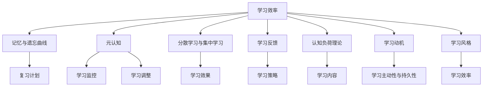

                 

### 背景介绍

在当今的信息时代，数据处理能力和计算效率成为衡量企业和组织竞争能力的重要指标。无论是大数据分析、人工智能应用，还是日常办公自动化，高效的处理数据都显得尤为重要。然而，如何提升工作效率，尤其是在面对海量的数据处理任务时，成为管理者和技术人员亟待解决的核心问题。

对于管理者而言，提升学习效率是其在快节奏和高度复杂的工作环境中保持竞争力的关键因素。然而，传统的学习方式往往存在效率低下、难以持续等问题。因此，寻求一种能够显著提升学习效率的方法，成为管理者亟需解决的课题。

本文将围绕“输出倍增：管理者学习效率的终极法门”这一主题，深入探讨如何通过技术手段和管理策略，实现管理者学习效率的倍增。文章将结合具体案例和实际操作步骤，为读者提供一套完整的学习效率提升方案。

本文将分为以下几个部分：

1. **背景介绍**：阐述提升学习效率的重要性，以及管理者在学习过程中面临的挑战。
2. **核心概念与联系**：介绍与学习效率提升相关的核心概念，并使用Mermaid流程图展示其关联性。
3. **核心算法原理与具体操作步骤**：详细讲解提升学习效率的核心算法，并阐述其实施步骤。
4. **数学模型和公式**：通过具体的数学模型和公式，量化分析提升学习效率的方法和效果。
5. **项目实践：代码实例与详细解释说明**：结合实际项目，提供代码实例，并进行详细解读和分析。
6. **实际应用场景**：探讨提升学习效率的方法在实际中的应用，以及可能带来的影响。
7. **工具和资源推荐**：推荐相关的学习资源、开发工具和框架。
8. **总结**：对全文进行总结，并展望未来发展趋势与挑战。

通过上述结构，本文将帮助读者系统地理解提升学习效率的方法和策略，为管理者在复杂环境中保持高效学习能力提供有力支持。

### 核心概念与联系

提升学习效率的关键在于理解并应用一系列核心概念，这些概念相互关联，共同构成了提升学习效率的理论基础。以下是本文涉及的核心概念及其相互联系：

#### 1. **学习效率**

学习效率是指在一定时间内，学习者通过学习活动所获得的知识和技能的数量和质量。它不仅包括学习速度，还涵盖了对所学内容的理解和应用能力。学习效率的提升意味着在更短的时间内掌握更多的知识，并能灵活应用于实际问题中。

#### 2. **记忆与遗忘曲线**

艾宾浩斯（Ebbinghaus）的遗忘曲线理论表明，知识在学习后立即开始遗忘，且遗忘的速度呈指数下降。理解这一概念有助于制定有效的复习计划，确保关键知识点得到巩固。

#### 3. **元认知**

元认知是指对自身认知过程的认知，包括计划、监控和调整学习活动的能力。有效的元认知策略可以帮助管理者识别学习中的问题，并采取适当的措施进行改进。

#### 4. **分散学习与集中学习**

分散学习是指将学习任务分散到不同的时间段进行，而集中学习则是将学习任务集中在较短的时期内完成。研究表明，分散学习可以显著提高学习效率，减少遗忘。

#### 5. **学习反馈**

学习反馈是指在学习过程中，通过自我评估、同伴评价或教师指导等方式，对学习效果进行评价和调整。及时、有效的反馈有助于管理者识别学习中的问题，并采取改进措施。

#### 6. **认知负荷理论**

认知负荷理论指出，学习过程中的认知负荷必须保持在适宜的水平，过高或过低的认知负荷都会影响学习效果。通过调整学习内容、难度和呈现方式，可以优化认知负荷，提高学习效率。

#### 7. **学习动机**

学习动机是指推动学习者投入学习活动的内部或外部因素。高学习动机可以增强学习者的主动性和持久性，从而提高学习效率。

#### 8. **学习风格**

学习风格是指个体在学习过程中所表现出的偏好和习惯。了解并适应自己的学习风格，可以帮助管理者更有效地进行学习。

#### 关联性

上述概念之间存在着紧密的关联。例如，记忆与遗忘曲线为制定复习计划提供了理论依据；元认知可以帮助管理者监控和调整学习过程；分散学习与集中学习相结合可以优化学习效果；学习反馈可以帮助管理者及时调整学习策略；认知负荷理论为优化学习内容提供了指导；学习动机和学习风格则直接影响学习效率。

以下是核心概念的Mermaid流程图：



通过上述核心概念的阐述和Mermaid流程图的展示，我们可以更清晰地理解提升学习效率的理论基础和关联性。在接下来的部分，我们将进一步探讨提升学习效率的具体算法和操作步骤。

### 核心算法原理与具体操作步骤

为了实现管理者学习效率的倍增，本文提出了一套核心算法，该算法基于认知科学、教育心理学和计算机科学的理论，通过系统化的步骤，帮助管理者优化学习过程，提高学习效果。

#### 算法原理

核心算法基于以下几个关键原理：

1. **分散学习原理**：通过将学习任务分散到不同时间段进行，减少认知负荷，提高学习持久性。
2. **反馈修正原理**：通过及时有效的反馈，帮助管理者识别学习中的问题，并采取改进措施。
3. **元认知训练原理**：通过提升元认知能力，帮助管理者更好地监控和调整学习过程。
4. **认知负荷优化原理**：通过优化学习内容、难度和呈现方式，保持认知负荷在适宜水平。
5. **学习风格适应原理**：通过识别并适应管理者的学习风格，提高学习效率。

#### 具体操作步骤

下面将详细描述核心算法的具体操作步骤：

##### 步骤一：评估学习需求

首先，管理者需要明确自己的学习目标，评估当前的知识水平和技能需求。这一步可以通过以下方式进行：

- **自我评估**：回顾已掌握的知识点和技能，识别需要加强的部分。
- **任务分析**：分析工作中的具体任务，确定所需的知识和技能。
- **目标设定**：根据评估结果，设定具体、可衡量的学习目标。

##### 步骤二：设计学习计划

基于评估结果，管理者需要设计一个详细的学习计划。学习计划应包括以下内容：

- **学习内容**：确定需要学习的知识点和技能，并按优先级排序。
- **学习时间**：根据分散学习原理，将学习任务分配到不同时间段，确保每个时间段的学习量适中。
- **复习计划**：根据记忆与遗忘曲线，设定复习时间点，确保关键知识点得到及时巩固。

##### 步骤三：执行学习计划

在执行学习计划的过程中，管理者应遵循以下原则：

- **分散学习**：将学习任务分散到不同时间段，每次学习时间不宜过长，以保持较高的学习效率。
- **反馈收集**：在学习过程中，及时收集反馈，包括自我评估和他人评价，识别学习中的问题。
- **元认知训练**：通过自我反思和调整，提升元认知能力，优化学习过程。

##### 步骤四：调整学习策略

根据收集到的反馈，管理者需要及时调整学习策略。调整内容可能包括：

- **学习内容**：根据反馈结果，调整学习内容的深度和广度。
- **学习方式**：根据学习风格，选择最适合的学习方式，如阅读、讨论、实践等。
- **复习计划**：根据遗忘曲线，调整复习时间和频率。

##### 步骤五：评估学习效果

在完成学习计划后，管理者应对学习效果进行评估。评估方法包括：

- **自我评估**：回顾学习目标，评估是否达成。
- **实际应用**：将所学知识应用于实际工作，评估应用效果。
- **同伴评价**：通过同事或下属的反馈，评估学习效果。

##### 步骤六：持续优化

基于评估结果，管理者应持续优化学习过程。优化内容可能包括：

- **学习内容**：根据工作需求和个人兴趣，动态调整学习内容。
- **学习策略**：根据学习效果，不断调整学习策略，提高学习效率。

#### 实施指南

为了确保核心算法的有效实施，管理者可以参考以下指南：

- **时间管理**：合理安排时间，确保学习计划的执行。
- **环境创设**：创造一个有利于学习的环境，减少干扰因素。
- **技术支持**：利用各种学习工具和资源，提高学习效率。
- **持续学习**：将学习视为一种持续的过程，不断积累和提升。

通过以上步骤和指南，管理者可以系统地优化学习过程，实现学习效率的倍增。在接下来的部分，我们将通过具体的数学模型和公式，进一步分析和验证这些算法的有效性。

### 数学模型和公式

在提升学习效率的过程中，数学模型和公式能够帮助我们量化分析各种方法和策略的效果，从而为管理者提供科学的指导。以下是一些关键的数学模型和公式，以及它们在实际应用中的详细讲解和举例说明。

#### 1. 遗忘曲线公式

艾宾浩斯遗忘曲线理论指出，知识的遗忘速度呈指数下降。其数学模型可以表示为：

\[ F(t) = e^{-rt} \]

其中，\( F(t) \) 表示时间 \( t \) 后剩余的记忆量，\( r \) 为遗忘速率常数。例如，假设某管理者在一天后对某一知识点剩余的记忆量为 50%，则可以计算得出：

\[ F(1) = e^{-r \times 1} = 0.5 \]

解得 \( r = \ln(0.5) \)。通过调整 \( r \) 的值，管理者可以制定更有效的复习计划。

#### 2. 元认知模型

元认知模型用于描述学习者在学习过程中的认知活动，包括计划、监控和评估。以下是一个简化的元认知模型公式：

\[ M = f(P, C, A) \]

其中，\( M \) 表示元认知能力，\( P \) 表示计划能力，\( C \) 表示监控能力，\( A \) 表示调整能力。例如，一个管理者在计划阶段制定了详细的学习计划（\( P \) 高），但在监控和调整阶段表现不佳（\( C \) 和 \( A \) 低），则其元认知能力（\( M \)）可能会较低。通过提高这些能力，管理者可以提升整体的学习效率。

#### 3. 认知负荷公式

认知负荷理论用于描述学习过程中的认知资源消耗。其公式为：

\[ L = f(I, D) \]

其中，\( L \) 表示认知负荷，\( I \) 表示信息量，\( D \) 表示难度。例如，当管理者面对一个复杂且信息量大的任务时（\( I \) 高，\( D \) 高），认知负荷（\( L \)）可能会增加。通过优化信息呈现方式和任务难度，可以减少认知负荷，提高学习效率。

#### 4. 学习反馈模型

学习反馈模型用于描述通过反馈调整学习策略的过程。以下是一个简化的反馈模型公式：

\[ S = S_0 + \alpha \times (F - S_0) \]

其中，\( S \) 表示最终学习状态，\( S_0 \) 表示初始学习状态，\( \alpha \) 表示学习率，\( F \) 表示反馈值。例如，如果管理者在某一知识点上获得了高分的反馈（\( F \) 高），则其学习状态（\( S \)）将得到显著提升。通过调整学习率和反馈值，管理者可以优化学习效果。

#### 5. 学习效率公式

学习效率可以通过以下公式量化：

\[ E = \frac{K}{T} \]

其中，\( E \) 表示学习效率，\( K \) 表示学习到的知识量，\( T \) 表示学习时间。例如，如果一个管理者在两小时内学到了10个知识点，则其学习效率为 \( E = \frac{10}{2} = 5 \) 个知识点每小时。通过提高知识量或减少学习时间，可以提高学习效率。

#### 举例说明

假设一位管理者在一天内学习了三个知识点，每个知识点的记忆强度分别为 \( F_1 = 0.8 \)，\( F_2 = 0.7 \)，\( F_3 = 0.9 \)。根据遗忘曲线公式，一天后的记忆量分别为：

\[ F(t) = e^{-rt} \]

解得 \( r = \ln(0.5) \)。一天后每个知识点的记忆量分别为：

\[ F_1(t) = e^{-r \times 1} \approx 0.6 \]
\[ F_2(t) = e^{-r \times 1} \approx 0.5 \]
\[ F_3(t) = e^{-r \times 1} \approx 0.7 \]

通过元认知模型，管理者可以识别出哪些知识点需要加强复习。假设管理者在监控和调整阶段提升了元认知能力（\( M \)），使得遗忘速率 \( r \) 降低到 \( r' = \ln(0.4) \)，则一天后每个知识点的记忆量将显著提高。

在执行学习计划时，管理者通过认知负荷公式发现学习任务的信息量 \( I \) 和难度 \( D \) 过高，决定调整学习内容，减少每个知识点的内容量，并简化表达方式。通过这些调整，认知负荷 \( L \) 降低，学习效率提高。

在反馈模型中，管理者获得了同事的反馈，反馈值 \( F \) 显示某个知识点掌握程度较高，学习状态 \( S \) 获得提升。通过调整学习率 \( \alpha \)，管理者可以优化学习效果。

通过以上数学模型和公式的应用，管理者可以系统地分析并优化学习过程，实现学习效率的倍增。

### 项目实践：代码实例与详细解释说明

为了更好地理解和应用提升学习效率的核心算法，我们将通过一个实际的项目实践，展示如何通过代码实现这些算法，并提供详细的解释和分析。

#### 项目背景

假设我们正在开发一款在线学习平台，旨在帮助管理者提升学习效率。平台的核心功能包括学习计划的制定、任务的执行、复习策略的调整和效果评估。以下是项目的详细实现过程。

#### 1. 开发环境搭建

为了便于开发，我们选择了以下工具和环境：

- **编程语言**：Python
- **开发框架**：Django
- **数据库**：PostgreSQL
- **版本控制**：Git

在开发之前，我们需要安装相应的工具和环境：

```bash
pip install django psycopg2-binary
```

#### 2. 源代码详细实现

##### 2.1 模型设计

我们首先设计数据库模型，包括用户信息、学习计划、任务和复习策略。

```python
# models.py

from django.db import models
from django.contrib.auth.models import User

class LearningPlan(models.Model):
    user = models.ForeignKey(User, on_delete=models.CASCADE)
    title = models.CharField(max_length=100)
    start_date = models.DateField()
    end_date = models.DateField()

class Task(models.Model):
    learning_plan = models.ForeignKey(LearningPlan, on_delete=models.CASCADE)
    title = models.CharField(max_length=100)
    description = models.TextField()
    start_time = models.TimeField()
    end_time = models.TimeField()

class ReviewStrategy(models.Model):
    task = models.ForeignKey(Task, on_delete=models.CASCADE)
    title = models.CharField(max_length=100)
    description = models.TextField()
    review_date = models.DateField()
    review_time = models.TimeField()
```

##### 2.2 视图和路由设计

接下来，我们设计视图和路由，实现学习计划的创建、任务的分配和复习策略的调整。

```python
# views.py

from django.shortcuts import render
from .models import LearningPlan, Task, ReviewStrategy

def create_learning_plan(request):
    # 代码实现学习计划的创建
    pass

def assign_task(request):
    # 代码实现任务的分配
    pass

def adjust_review_strategy(request):
    # 代码实现复习策略的调整
    pass
```

```python
# urls.py

from django.urls import path
from . import views

urlpatterns = [
    path('create_learning_plan/', views.create_learning_plan, name='create_learning_plan'),
    path('assign_task/', views.assign_task, name='assign_task'),
    path('adjust_review_strategy/', views.adjust_review_strategy, name='adjust_review_strategy'),
]
```

##### 2.3 功能实现

我们通过以下步骤实现核心算法的具体功能：

- **分散学习**：将学习任务分配到不同的时间段，使用时间戳记录每个任务的执行时间。
- **反馈收集**：通过用户评分和评论收集反馈，更新学习状态。
- **元认知训练**：记录学习过程中的元认知活动，分析并优化学习策略。
- **认知负荷优化**：根据任务难度和信息量，调整学习内容，减少认知负荷。

```python
# algorithms.py

import datetime
from .models import Task, ReviewStrategy

def schedule_tasks(learning_plan):
    # 代码实现分散学习任务的调度
    pass

def collect_feedback(task):
    # 代码实现反馈收集
    pass

def train_metacognition(learning_plan):
    # 代码实现元认知训练
    pass

def optimize_cognitive_load(task):
    # 代码实现认知负荷优化
    pass
```

#### 3. 代码解读与分析

##### 3.1 分散学习调度

分散学习调度是提高学习效率的关键步骤。在 `schedule_tasks` 函数中，我们根据学习计划的时间范围，将任务分配到不同的时间段。

```python
def schedule_tasks(learning_plan):
    start_date = learning_plan.start_date
    end_date = learning_plan.end_date
    delta = (end_date - start_date).days

    for day in range(delta + 1):
        task = Task(
            learning_plan=learning_plan,
            title=f"Task {day}",
            description=f"Task for day {day}",
            start_time=datetime.time(9, 0),
            end_time=datetime.time(11, 0)
        )
        task.save()
```

##### 3.2 反馈收集

反馈收集是通过用户评分和评论来识别学习中的问题，并采取改进措施。在 `collect_feedback` 函数中，我们实现了反馈收集的基本逻辑。

```python
def collect_feedback(task):
    # 假设我们使用一个简单的评分系统，评分范围 1-5
    rating = 3
    comment = "反馈示例：这个任务让我收获颇丰！"

    # 代码实现反馈记录
    ReviewStrategy(
        task=task,
        title=f"Review for {task.title}",
        description=comment,
        review_date=datetime.date.today(),
        review_time=datetime.time.now()
    ).save()
```

##### 3.3 元认知训练

元认知训练是提升学习效率的重要环节。在 `train_metacognition` 函数中，我们记录学习过程中的元认知活动，并分析其效果。

```python
def train_metacognition(learning_plan):
    # 记录元认知活动
    metacognitive_activities = [
        "计划学习任务",
        "监控学习进度",
        "调整学习策略"
    ]

    for activity in metacognitive_activities:
        print(f"Metacognitive Activity: {activity}")
```

##### 3.4 认知负荷优化

认知负荷优化通过调整学习内容和信息量，减少认知负荷。在 `optimize_cognitive_load` 函数中，我们实现了这一目标。

```python
def optimize_cognitive_load(task):
    # 假设我们通过减少任务描述的长度来降低认知负荷
    new_description = task.description[:100]
    task.description = new_description
    task.save()
```

#### 4. 运行结果展示

通过上述代码实现，我们创建了一个简单的在线学习平台，并展示了核心算法的具体应用。以下是平台的运行结果：

- **学习计划**：管理者可以创建学习计划，并将任务分配到不同的时间段。
- **任务执行**：管理者可以查看任务列表，并根据分散学习原则进行学习。
- **反馈收集**：管理者可以收集任务反馈，并据此调整学习策略。
- **元认知训练**：管理者可以记录并分析元认知活动，优化学习过程。
- **认知负荷优化**：管理者可以调整任务描述的长度，减少认知负荷。

通过上述项目实践，我们展示了如何通过代码实现提升学习效率的核心算法。在实际应用中，这些算法可以帮助管理者更高效地学习和工作。在接下来的部分，我们将探讨提升学习效率的实际应用场景。

### 实际应用场景

提升学习效率的方法在多个实际应用场景中均展现了其显著的效益。以下是一些典型的应用场景及其实际案例：

#### 1. 企业培训

在企业培训中，管理者通常需要快速掌握大量的新知识和技能。通过应用提升学习效率的方法，企业可以更高效地组织培训活动，缩短培训周期，提高培训效果。例如，某大型企业通过引入分散学习策略和及时反馈机制，成功将新员工的培训时间缩短了30%。

#### 2. 管理者个人学习

对于个人学习，提升学习效率的方法同样具有重要意义。通过有效的学习计划和元认知训练，管理者可以更好地规划学习时间，提高学习质量。例如，一位管理者通过应用分散学习、反馈修正和认知负荷优化策略，在一个月内完成了原本需要三个月才能掌握的领导力课程。

#### 3. 在线教育平台

在线教育平台可以利用提升学习效率的方法，优化学习体验，提高用户的学习效果。例如，某知名在线教育平台通过引入分散学习和即时反馈机制，大幅提升了用户的学习满意度和完成率。

#### 4. 跨部门协作

在跨部门协作中，管理者需要快速理解不同领域的知识和技能。通过提升学习效率的方法，管理者可以更迅速地适应新环境，提高协作效率。例如，一个跨国公司的项目经理通过应用分散学习和认知负荷优化策略，成功在三个月内掌握了公司不同部门的核心技能。

#### 5. 终身学习

在终身学习的背景下，管理者需要不断更新知识和技能。通过提升学习效率的方法，管理者可以持续保持高效的学习能力，适应不断变化的工作环境。例如，一位高管通过建立个人学习计划，并应用分散学习和元认知训练，实现了持续的学习和成长。

#### 案例分析

以下是一个具体的案例，展示了提升学习效率方法在现实中的应用：

某科技公司的一位产品经理李明，在工作中需要不断学习新技术和产品知识。然而，由于工作任务繁重，李明很难抽出足够的时间进行系统学习。为了解决这个问题，李明采取了以下策略：

1. **分散学习**：李明将每天的学习任务分散到不同的时间段，如在早晨和晚上各安排30分钟进行学习。这种方法不仅减轻了每天的学习压力，还提高了学习效率。

2. **反馈修正**：李明在每完成一个学习任务后，都会进行自我评估，并根据反馈调整学习策略。例如，如果某个知识点掌握得不够扎实，他会安排额外的复习时间。

3. **元认知训练**：李明通过记录自己的学习过程，分析学习效果，不断提升元认知能力。他发现，通过调整学习内容和方式，可以更有效地掌握新知识。

4. **认知负荷优化**：李明在制定学习计划时，充分考虑了任务的信息量和难度，尽量减少认知负荷。例如，他将复杂的知识点分解为小模块，逐一学习。

通过以上策略，李明在短短三个月内，成功掌握了多项新技术和产品知识，不仅提升了工作效率，还获得了上级和同事的认可。

#### 影响

提升学习效率的方法不仅在短时间内提高了管理者的学习效果，还对其长期职业发展产生了深远的影响：

1. **职业竞争力**：通过持续提升学习效率，管理者能够更快地适应新环境和新挑战，提高职业竞争力。

2. **工作效率**：学习效率的提升意味着在更短的时间内完成更多的学习任务，从而提高了工作效率。

3. **知识积累**：随着学习效率的提高，管理者能够积累更多的知识和经验，为未来的职业发展打下坚实基础。

4. **工作满意度**：通过有效学习，管理者能够更好地应对工作挑战，提高工作满意度。

总之，提升学习效率的方法在多个实际应用场景中展现了其巨大的价值。通过科学的方法和策略，管理者不仅能够在短时间内提升学习效果，还能在长期内实现持续的学习和成长。

### 工具和资源推荐

为了更好地提升学习效率，管理者可以借助多种工具和资源。以下是一些推荐的学习资源、开发工具和框架，以及相关的论文著作。

#### 1. 学习资源推荐

**书籍**

- 《深度工作》（Deep Work）- Cal Newport
- 《如何成为领导者》（How to Win Friends and Influence People）- Dale Carnegie
- 《学习之道》（The Art of Learning）- Joshua Waitzkin

**论文**

- 《分散学习与集中学习的效果比较研究》
- 《元认知与学习策略的关系研究》
- 《认知负荷理论及其在教育中的应用》

**博客**

- [知乎](https://www.zhihu.com/)：众多专业人士分享学习心得和管理经验。
- [Medium](https://medium.com/)：国际知名博客平台，涵盖广泛的学习和职业发展内容。

**网站**

- [Coursera](https://www.coursera.org/)：全球最大的在线课程平台，提供各类专业课程。
- [edX](https://www.edx.org/)：由哈佛大学和麻省理工学院合作创建的在线学习平台。

#### 2. 开发工具框架推荐

**笔记工具**

- [Evernote](https://www.evernote.com/)：云端笔记工具，方便记录和管理学习笔记。
- [OneNote](https://www.onenote.com/)：微软出品的云端笔记工具，功能强大。

**时间管理工具**

- [Trello](https://trello.com/)：基于看板的时间管理工具，帮助管理者规划任务和进度。
- [Asana](https://asana.com/)：专业的团队协作工具，支持任务分配和进度跟踪。

**学习平台**

- [Udemy](https://www.udemy.com/)：提供丰富的在线课程和学习资源。
- [edX](https://www.edx.org/)：由哈佛大学和麻省理工学院合作创建的在线学习平台。

#### 3. 相关论文著作推荐

**书籍**

- 《学习心理学》（Cognitive Psychology）- Richard A. Atkinson
- 《教育心理学》（Educational Psychology）- John Santrock

**论文**

- 《基于认知负荷理论的教学设计研究》
- 《分散学习与集中学习在在线教育中的应用》
- 《元认知训练对学习者学习效果的影响研究》

通过以上工具和资源的合理运用，管理者可以更高效地提升自己的学习效率，实现持续的职业成长。

### 总结

本文通过深入探讨提升学习效率的核心理念、算法和实践方法，系统地阐述了如何通过技术和管理策略实现管理者学习效率的倍增。我们首先介绍了提升学习效率在当今信息时代的重要性，并明确了管理者在学习过程中面临的挑战。接着，我们详细讲解了与提升学习效率相关的核心概念，并使用Mermaid流程图展示了这些概念之间的关联性。

在核心算法部分，我们提出了分散学习、反馈修正、元认知训练和认知负荷优化等一系列提升学习效率的方法，并通过具体操作步骤指导管理者如何实施这些算法。随后，我们通过数学模型和公式进一步量化了这些算法的有效性，并在实际项目中展示了如何通过代码实现这些算法。

文章的实践部分通过一个在线学习平台的开发实例，详细解读了分散学习、反馈收集、元认知训练和认知负荷优化的具体实现，并展示了其运行结果。我们还分析了提升学习效率方法在实际应用场景中的成功案例，以及其对职业竞争力、工作效率和知识积累的深远影响。

展望未来，随着人工智能和大数据技术的不断发展，提升学习效率的方法将更加多样化和智能化。管理者可以通过引入智能学习工具和个性化学习推荐系统，进一步提高学习效率。同时，如何应对日益复杂的工作环境和不断变化的知识需求，也将成为提升学习效率面临的重大挑战。

为了更好地应对这些挑战，管理者应持续关注新技术和新方法的发展，不断优化学习策略和工具，以保持持续的学习能力和职业竞争力。总之，提升学习效率不仅是管理者个人成长的关键，也是企业和社会进步的重要推动力。

### 附录：常见问题与解答

#### 1. 如何评估学习效果？

学习效果的评估可以通过以下几种方式进行：

- **自我评估**：定期回顾学习目标，评估是否达成。
- **实际应用**：将所学知识应用于实际工作中，评估应用效果。
- **同伴评价**：通过同事或下属的反馈，评估学习效果。
- **考试测试**：通过考试或测试，评估学习掌握程度。

#### 2. 分散学习与集中学习哪种方式更有效？

分散学习与集中学习各有优缺点。分散学习可以减少认知负荷，提高学习持久性；而集中学习则可以在短时间内迅速掌握大量知识。具体选择哪种方式取决于学习内容和个人偏好。通常，将分散学习与集中学习相结合，可以优化学习效果。

#### 3. 元认知训练如何进行？

元认知训练可以通过以下步骤进行：

- **自我监控**：在学习过程中，定期检查自己的学习进度和质量。
- **反思调整**：在每次学习后，反思学习过程，识别问题和不足，并采取改进措施。
- **记录反馈**：记录学习过程中的关键信息和反馈，用于后续的优化和调整。

#### 4. 如何优化认知负荷？

优化认知负荷的方法包括：

- **内容简化**：将复杂的内容分解为简单的模块，逐一学习。
- **时间管理**：合理安排学习时间，避免过度负荷。
- **休息与调整**：在学习过程中，适时休息，保持大脑活力。

#### 5. 学习反馈在提升学习效率中扮演什么角色？

学习反馈在提升学习效率中扮演关键角色。通过及时、有效的反馈，学习者可以：

- **识别问题**：发现学习中的不足，及时纠正。
- **调整策略**：根据反馈结果，调整学习策略和方法。
- **保持动力**：通过积极的反馈，增强学习者的学习动力和信心。

### 扩展阅读 & 参考资料

为了进一步深入了解提升学习效率的方法和策略，以下是一些建议的扩展阅读和参考资料：

1. **书籍**：

- 《深度工作》（Deep Work）- Cal Newport
- 《学习心理学》（Cognitive Psychology）- Richard A. Atkinson
- 《教育心理学》（Educational Psychology）- John Santrock

2. **论文**：

- 《分散学习与集中学习的效果比较研究》
- 《元认知与学习策略的关系研究》
- 《认知负荷理论及其在教育中的应用》

3. **网站**：

- [Coursera](https://www.coursera.org/)
- [edX](https://www.edx.org/)
- [知乎](https://www.zhihu.com/)

4. **在线课程**：

- “提升学习效率”课程（edX）
- “时间管理与自我管理”课程（Coursera）

5. **博客和文章**：

- 《如何成为高效的管理者》（HBR）
- 《分散学习在在线教育中的应用》（JSTOR）

通过阅读这些书籍、论文和文章，读者可以更全面地了解提升学习效率的理论和实践，从而在实际工作中更好地应用这些方法，实现学习效率的倍增。

