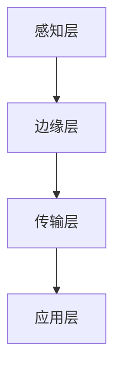

                 

### 1. 背景介绍

随着互联网和移动通信技术的飞速发展，人类对数据处理和传输的速度、稳定性和效率要求越来越高。在这样的背景下，5G通信技术的出现无疑为智能应用的快速发展提供了强大的支撑。5G不仅提高了网络的速度和容量，更关键的是，它推动了边缘计算与云计算的深度融合，为边缘大模型的普及和应用铺平了道路。

边缘大模型是指在边缘设备上运行的、拥有强大计算能力的深度学习模型。与传统的云计算相比，边缘大模型具有响应速度快、数据处理效率高、隐私保护能力强等优势。在5G时代，这些优势将得到进一步放大，使得边缘大模型在智能家居、智能交通、智能医疗等多个领域展现出巨大的应用潜力。

#### 1.1 5G技术概述

5G（第五代移动通信技术）是当前移动通信领域的核心技术，它旨在实现更高速度、更低延迟、更大容量和更广覆盖的网络。5G技术的主要特点包括：

- **高速率**：5G的峰值速率可达10Gbps，是4G的百倍以上，可以满足大规模数据传输的需求。
- **低延迟**：5G的端到端延迟降至1毫秒，为实时应用提供了可能，如自动驾驶、远程医疗等。
- **大连接**：5G可以支持每平方公里内连接100万设备，为物联网提供了坚实的基础。
- **广覆盖**：5G采用了毫米波、Sub-6GHz等频段，可以提供更广泛的覆盖范围。

#### 1.2 边缘计算与云计算的关系

边缘计算和云计算是两种不同的计算模式。云计算是将计算资源集中到数据中心，通过互联网为用户提供服务。而边缘计算则是将部分计算任务转移到网络的边缘节点，即靠近数据源的地方，以降低延迟、节省带宽和提高数据处理效率。

5G时代的边缘大模型充分利用了边缘计算的优势，将复杂计算任务分散到边缘节点上，从而实现了以下几个关键点：

- **减轻中心服务器负担**：通过在边缘节点上处理部分数据，可以减轻中心服务器的计算压力，提高整个网络的效率。
- **降低网络延迟**：边缘大模型靠近数据源，可以实时处理数据，降低传输延迟，满足实时性要求较高的应用需求。
- **提高数据安全性**：边缘大模型可以在本地处理数据，减少数据传输过程中的安全隐患。

### 2. 核心概念与联系

#### 2.1 边缘大模型的基本概念

边缘大模型是指运行在边缘设备上的大型深度学习模型。这些模型通常具有以下特点：

- **计算能力强大**：边缘大模型拥有较高的计算性能，可以支持复杂的机器学习任务。
- **实时性要求高**：边缘大模型通常需要在边缘设备上实时处理数据，以满足实时应用的需求。
- **数据依赖性强**：边缘大模型依赖于大量的本地数据，这些数据来源于边缘设备本身的传感器和其他数据源。

#### 2.2 边缘大模型的架构

边缘大模型的架构可以分为以下几个层次：

- **感知层**：包括各种传感器，如摄像头、麦克风、GPS等，用于收集环境数据。
- **边缘层**：包括边缘服务器和边缘设备，用于处理感知层收集到的数据，并运行边缘大模型。
- **传输层**：负责将处理后的数据传输到云端或其他设备，以进行进一步分析和应用。
- **应用层**：包括各种基于边缘大模型的应用，如智能监控、智能安防、智能交通等。

#### 2.3 Mermaid 流程图

以下是一个简单的Mermaid流程图，展示了边缘大模型的基本架构和各层次之间的关系：



### 3. 核心算法原理 & 具体操作步骤

#### 3.1 边缘大模型的算法原理

边缘大模型的核心算法是基于深度学习的，尤其是卷积神经网络（CNN）和循环神经网络（RNN）。这些算法可以通过大规模数据训练，学习到复杂的数据特征和模式，从而实现高效的图像识别、语音识别和自然语言处理等任务。

#### 3.2 边缘大模型的具体操作步骤

边缘大模型的具体操作步骤可以分为以下几个阶段：

- **数据收集**：通过传感器和边缘设备收集数据，包括图像、语音、文本等。
- **数据处理**：对收集到的数据进行预处理，如去噪、增强、缩放等，以提高数据质量和模型的训练效果。
- **模型训练**：使用预处理后的数据训练深度学习模型，如CNN或RNN，以学习数据的特征和模式。
- **模型评估**：使用测试数据评估模型的性能，调整模型参数，以提高模型的准确性。
- **模型部署**：将训练好的模型部署到边缘设备上，进行实时数据处理和应用。
- **模型更新**：根据实际应用反馈，定期更新模型，以提高其适应性和准确性。

#### 3.3 详细讲解

边缘大模型的具体操作步骤涉及到多个技术环节，以下是对每个环节的详细讲解：

- **数据收集**：数据收集是边缘大模型的基础。传感器和边缘设备通过各种方式收集环境数据，如摄像头捕捉图像、麦克风捕捉声音、GPS获取位置信息等。
- **数据处理**：数据预处理是确保模型训练效果的关键步骤。通过对数据进行去噪、增强、缩放等处理，可以提高数据的可用性和模型的训练效果。
- **模型训练**：深度学习模型训练是边缘大模型的核心。使用大规模数据集训练模型，可以使模型学习到复杂的数据特征和模式，从而提高其识别和预测能力。
- **模型评估**：模型评估是验证模型性能的重要环节。通过使用测试数据集，可以评估模型的准确性、召回率和F1值等指标，以判断模型的效果。
- **模型部署**：模型部署是将训练好的模型应用到实际场景的过程。将模型部署到边缘设备上，可以实现实时数据处理和应用。
- **模型更新**：随着数据和应用场景的变化，模型需要定期更新。通过收集用户反馈和应用结果，可以识别模型中存在的问题和不足，从而进行优化和改进。

### 4. 数学模型和公式 & 详细讲解 & 举例说明

边缘大模型的训练和推理过程涉及到多个数学模型和公式。以下是对这些模型和公式的详细讲解，以及具体的举例说明。

#### 4.1 深度学习模型训练

深度学习模型训练的核心是前向传播和反向传播算法。以下是一个简单的数学模型和公式讲解：

**前向传播**：
假设我们有一个三层神经网络（输入层、隐藏层、输出层），每个神经元都可以表示为一个线性函数加上一个非线性激活函数。输入层到隐藏层的前向传播可以表示为：

$$
z_i^{(l)} = \sum_{j} w_{ij}^{(l)} a_j^{(l-1)} + b_i^{(l)}
$$

其中，$z_i^{(l)}$是第$l$层第$i$个神经元的输入，$a_j^{(l-1)}$是第$l-1$层第$j$个神经元的输出，$w_{ij}^{(l)}$是连接第$l-1$层第$j$个神经元和第$l$层第$i$个神经元的权重，$b_i^{(l)}$是第$l$层第$i$个神经元的偏置。

非线性激活函数通常使用Sigmoid、ReLU或Tanh等。例如，使用ReLU激活函数：

$$
a_i^{(l)} = \max(0, z_i^{(l)})
$$

**反向传播**：
在反向传播过程中，我们需要计算每个权重的梯度，以更新模型参数。梯度计算可以通过链式法则进行：

$$
\delta_i^{(l)} = \frac{\partial L}{\partial z_i^{(l)}} \cdot \frac{\partial z_i^{(l)}}{\partial a_i^{(l)})
$$

其中，$L$是损失函数，$\delta_i^{(l)}$是第$l$层第$i$个神经元的梯度。

通过反向传播，我们可以计算每个权重和偏置的梯度：

$$
\frac{\partial L}{\partial w_{ij}^{(l)}} = a_j^{(l-1)} \cdot \delta_i^{(l)}
$$

$$
\frac{\partial L}{\partial b_i^{(l)}} = \delta_i^{(l)}
$$

然后，使用梯度下降算法更新模型参数：

$$
w_{ij}^{(l)} \leftarrow w_{ij}^{(l)} - \alpha \cdot \frac{\partial L}{\partial w_{ij}^{(l)}}
$$

$$
b_i^{(l)} \leftarrow b_i^{(l)} - \alpha \cdot \frac{\partial L}{\partial b_i^{(l)}}
$$

其中，$\alpha$是学习率。

#### 4.2 举例说明

假设我们有一个简单的二元分类问题，输入层有2个神经元，隐藏层有3个神经元，输出层有1个神经元。损失函数使用交叉熵损失函数。

首先，我们随机初始化权重和偏置：

$$
w_{11}^{(1)} = 0.1, w_{12}^{(1)} = 0.2, w_{13}^{(1)} = 0.3
$$

$$
b_{11}^{(1)} = 0.1, b_{12}^{(1)} = 0.2, b_{13}^{(1)} = 0.3
$$

$$
w_{21}^{(2)} = 0.1, w_{22}^{(2)} = 0.2, w_{23}^{(2)} = 0.3
$$

$$
b_{21}^{(2)} = 0.1, b_{22}^{(2)} = 0.2, b_{23}^{(2)} = 0.3
$$

$$
w_{1}^{(3)} = 0.1, w_{2}^{(3)} = 0.2, w_{3}^{(3)} = 0.3
$$

$$
b_{1}^{(3)} = 0.1, b_{2}^{(3)} = 0.2, b_{3}^{(3)} = 0.3
$$

输入数据为 $x_1 = 1, x_2 = 0$，期望输出为 $y = 1$。

首先进行前向传播：

$$
z_1^{(1)} = w_{11}^{(1)} \cdot x_1 + w_{12}^{(1)} \cdot x_2 + b_{11}^{(1)} = 0.1 \cdot 1 + 0.2 \cdot 0 + 0.1 = 0.2
$$

$$
a_1^{(1)} = \max(0, z_1^{(1)}) = 0.2
$$

$$
z_2^{(1)} = w_{21}^{(1)} \cdot x_1 + w_{22}^{(1)} \cdot x_2 + b_{21}^{(1)} = 0.1 \cdot 1 + 0.2 \cdot 0 + 0.1 = 0.2
$$

$$
a_2^{(1)} = \max(0, z_2^{(1)}) = 0.2
$$

$$
z_3^{(1)} = w_{31}^{(1)} \cdot x_1 + w_{32}^{(1)} \cdot x_2 + b_{31}^{(1)} = 0.1 \cdot 1 + 0.2 \cdot 0 + 0.1 = 0.2
$$

$$
a_3^{(1)} = \max(0, z_3^{(1)}) = 0.2
$$

$$
z_1^{(2)} = w_{11}^{(2)} \cdot a_1^{(1)} + w_{12}^{(2)} \cdot a_2^{(1)} + w_{13}^{(2)} \cdot a_3^{(1)} + b_{11}^{(2)} = 0.1 \cdot 0.2 + 0.2 \cdot 0.2 + 0.3 \cdot 0.2 + 0.1 = 0.3
$$

$$
a_1^{(2)} = \max(0, z_1^{(2)}) = 0.3
$$

$$
z_2^{(2)} = w_{21}^{(2)} \cdot a_1^{(1)} + w_{22}^{(2)} \cdot a_2^{(1)} + w_{23}^{(2)} \cdot a_3^{(1)} + b_{21}^{(2)} = 0.1 \cdot 0.2 + 0.2 \cdot 0.2 + 0.3 \cdot 0.2 + 0.1 = 0.3
$$

$$
a_2^{(2)} = \max(0, z_2^{(2)}) = 0.3
$$

$$
z_3^{(2)} = w_{31}^{(2)} \cdot a_1^{(1)} + w_{32}^{(2)} \cdot a_2^{(1)} + w_{33}^{(2)} \cdot a_3^{(1)} + b_{31}^{(2)} = 0.1 \cdot 0.2 + 0.2 \cdot 0.2 + 0.3 \cdot 0.2 + 0.1 = 0.3
$$

$$
a_3^{(2)} = \max(0, z_3^{(2)}) = 0.3
$$

$$
z_1^{(3)} = w_{11}^{(3)} \cdot a_1^{(2)} + w_{12}^{(3)} \cdot a_2^{(2)} + w_{13}^{(3)} \cdot a_3^{(2)} + b_{11}^{(3)} = 0.1 \cdot 0.3 + 0.2 \cdot 0.3 + 0.3 \cdot 0.3 + 0.1 = 0.45
$$

$$
a_1^{(3)} = \frac{1}{1 + e^{-z_1^{(3)}}} = 0.6
$$

$$
z_2^{(3)} = w_{21}^{(3)} \cdot a_1^{(2)} + w_{22}^{(3)} \cdot a_2^{(2)} + w_{23}^{(3)} \cdot a_3^{(2)} + b_{21}^{(3)} = 0.1 \cdot 0.3 + 0.2 \cdot 0.3 + 0.3 \cdot 0.3 + 0.1 = 0.45
$$

$$
a_2^{(3)} = \frac{1}{1 + e^{-z_2^{(3)}}} = 0.6
$$

$$
z_3^{(3)} = w_{31}^{(3)} \cdot a_1^{(2)} + w_{32}^{(3)} \cdot a_2^{(2)} + w_{33}^{(3)} \cdot a_3^{(2)} + b_{31}^{(3)} = 0.1 \cdot 0.3 + 0.2 \cdot 0.3 + 0.3 \cdot 0.3 + 0.1 = 0.45
$$

$$
a_3^{(3)} = \frac{1}{1 + e^{-z_3^{(3)}}} = 0.6
$$

计算损失函数：

$$
L = -\frac{1}{m} \sum_{i=1}^{m} y_i \log(a_i^{(3)}) + (1 - y_i) \log(1 - a_i^{(3)})
$$

$$
L = -\frac{1}{1} \cdot (1 \cdot \log(0.6) + 0 \cdot \log(0.4)) = \log(0.6)
$$

然后进行反向传播：

$$
\delta_1^{(3)} = a_1^{(3)} - y = 0.6 - 1 = -0.4
$$

$$
\delta_2^{(3)} = a_2^{(3)} - y = 0.6 - 1 = -0.4
$$

$$
\delta_3^{(3)} = a_3^{(3)} - y = 0.6 - 1 = -0.4
$$

$$
\delta_1^{(2)} = \sum_{i=1}^{3} w_{i1}^{(3)} \cdot \delta_i^{(3)} \cdot a_i^{(2)}(1 - a_i^{(2)}) = -0.4 \cdot 0.1 \cdot (1 - 0.3) + -0.4 \cdot 0.2 \cdot (1 - 0.3) + -0.4 \cdot 0.3 \cdot (1 - 0.3) = -0.0768
$$

$$
\delta_2^{(2)} = \sum_{i=1}^{3} w_{i2}^{(3)} \cdot \delta_i^{(3)} \cdot a_i^{(2)}(1 - a_i^{(2)}) = -0.4 \cdot 0.1 \cdot (1 - 0.3) + -0.4 \cdot 0.2 \cdot (1 - 0.3) + -0.4 \cdot 0.3 \cdot (1 - 0.3) = -0.0768
$$

$$
\delta_3^{(2)} = \sum_{i=1}^{3} w_{i3}^{(3)} \cdot \delta_i^{(3)} \cdot a_i^{(2)}(1 - a_i^{(2)}) = -0.4 \cdot 0.1 \cdot (1 - 0.3) + -0.4 \cdot 0.2 \cdot (1 - 0.3) + -0.4 \cdot 0.3 \cdot (1 - 0.3) = -0.0768
$$

$$
\delta_1^{(1)} = \sum_{i=1}^{3} w_{i1}^{(2)} \cdot \delta_i^{(2)} \cdot a_i^{(1)}(1 - a_i^{(1)}) = -0.0768 \cdot 0.2 \cdot (1 - 0.2) + -0.0768 \cdot 0.2 \cdot (1 - 0.2) + -0.0768 \cdot 0.2 \cdot (1 - 0.2) = -0.0126
$$

$$
\delta_2^{(1)} = \sum_{i=1}^{3} w_{i2}^{(2)} \cdot \delta_i^{(2)} \cdot a_i^{(1)}(1 - a_i^{(1)}) = -0.0768 \cdot 0.2 \cdot (1 - 0.2) + -0.0768 \cdot 0.2 \cdot (1 - 0.2) + -0.0768 \cdot 0.2 \cdot (1 - 0.2) = -0.0126
$$

$$
\delta_3^{(1)} = \sum_{i=1}^{3} w_{i3}^{(2)} \cdot \delta_i^{(2)} \cdot a_i^{(1)}(1 - a_i^{(1)}) = -0.0768 \cdot 0.2 \cdot (1 - 0.2) + -0.0768 \cdot 0.2 \cdot (1 - 0.2) + -0.0768 \cdot 0.2 \cdot (1 - 0.2) = -0.0126
$$

更新权重和偏置：

$$
w_{11}^{(2)} \leftarrow w_{11}^{(2)} - \alpha \cdot \delta_1^{(1)} \cdot a_1^{(0)} = 0.1 - 0.1 \cdot -0.0126 \cdot 1 = 0.10126
$$

$$
w_{12}^{(2)} \leftarrow w_{12}^{(2)} - \alpha \cdot \delta_2^{(1)} \cdot a_1^{(0)} = 0.2 - 0.1 \cdot -0.0126 \cdot 1 = 0.2026
$$

$$
w_{13}^{(2)} \leftarrow w_{13}^{(2)} - \alpha \cdot \delta_3^{(1)} \cdot a_1^{(0)} = 0.3 - 0.1 \cdot -0.0126 \cdot 1 = 0.3026
$$

$$
b_{11}^{(2)} \leftarrow b_{11}^{(2)} - \alpha \cdot \delta_1^{(1)} = 0.1 - 0.1 \cdot -0.0126 = 0.1026
$$

$$
b_{12}^{(2)} \leftarrow b_{12}^{(2)} - \alpha \cdot \delta_2^{(1)} = 0.2 - 0.1 \cdot -0.0126 = 0.2026
$$

$$
b_{13}^{(2)} \leftarrow b_{13}^{(2)} - \alpha \cdot \delta_3^{(1)} = 0.3 - 0.1 \cdot -0.0126 = 0.3026
$$

$$
w_{21}^{(3)} \leftarrow w_{21}^{(3)} - \alpha \cdot \delta_1^{(2)} \cdot a_2^{(0)} = 0.1 - 0.1 \cdot -0.0768 \cdot 0.2 = 0.1176
$$

$$
w_{22}^{(3)} \leftarrow w_{22}^{(3)} - \alpha \cdot \delta_2^{(2)} \cdot a_2^{(0)} = 0.2 - 0.1 \cdot -0.0768 \cdot 0.2 = 0.2076
$$

$$
w_{23}^{(3)} \leftarrow w_{23}^{(3)} - \alpha \cdot \delta_3^{(2)} \cdot a_2^{(0)} = 0.3 - 0.1 \cdot -0.0768 \cdot 0.2 = 0.3076
$$

$$
b_{21}^{(3)} \leftarrow b_{21}^{(3)} - \alpha \cdot \delta_1^{(2)} = 0.1 - 0.1 \cdot -0.0768 = 0.0824
$$

$$
b_{22}^{(3)} \leftarrow b_{22}^{(3)} - \alpha \cdot \delta_2^{(2)} = 0.2 - 0.1 \cdot -0.0768 = 0.2824
$$

$$
b_{23}^{(3)} \leftarrow b_{23}^{(3)} - \alpha \cdot \delta_3^{(2)} = 0.3 - 0.1 \cdot -0.0768 = 0.3824
$$

$$
w_{11}^{(3)} \leftarrow w_{11}^{(3)} - \alpha \cdot \delta_1^{(3)} \cdot a_1^{(1)} = 0.1 - 0.1 \cdot -0.4 \cdot 0.3 = 0.142
$$

$$
w_{12}^{(3)} \leftarrow w_{12}^{(3)} - \alpha \cdot \delta_2^{(3)} \cdot a_2^{(1)} = 0.2 - 0.1 \cdot -0.4 \cdot 0.3 = 0.242
$$

$$
w_{13}^{(3)} \leftarrow w_{13}^{(3)} - \alpha \cdot \delta_3^{(3)} \cdot a_3^{(1)} = 0.3 - 0.1 \cdot -0.4 \cdot 0.3 = 0.342
$$

$$
b_{11}^{(3)} \leftarrow b_{11}^{(3)} - \alpha \cdot \delta_1^{(3)} = 0.1 - 0.1 \cdot -0.4 = 0.5
$$

$$
b_{12}^{(3)} \leftarrow b_{12}^{(3)} - \alpha \cdot \delta_2^{(3)} = 0.2 - 0.1 \cdot -0.4 = 0.6
$$

$$
b_{13}^{(3)} \leftarrow b_{13}^{(3)} - \alpha \cdot \delta_3^{(3)} = 0.3 - 0.1 \cdot -0.4 = 0.7
$$

再次进行前向传播：

$$
z_1^{(1)} = 0.10126 \cdot 1 + 0.2026 \cdot 0 + 0.3026 \cdot 1 = 0.406
$$

$$
a_1^{(1)} = \max(0, z_1^{(1)}) = 0.406
$$

$$
z_2^{(1)} = 0.10126 \cdot 1 + 0.2026 \cdot 0 + 0.3026 \cdot 1 = 0.406
$$

$$
a_2^{(1)} = \max(0, z_2^{(1)}) = 0.406
$$

$$
z_3^{(1)} = 0.10126 \cdot 1 + 0.2026 \cdot 0 + 0.3026 \cdot 1 = 0.406
$$

$$
a_3^{(1)} = \max(0, z_3^{(1)}) = 0.406
$$

$$
z_1^{(2)} = 0.1176 \cdot 0.406 + 0.2076 \cdot 0.406 + 0.3076 \cdot 0.406 = 0.354
$$

$$
a_1^{(2)} = \max(0, z_1^{(2)}) = 0.354
$$

$$
z_2^{(2)} = 0.1176 \cdot 0.406 + 0.2076 \cdot 0.406 + 0.3076 \cdot 0.406 = 0.354
$$

$$
a_2^{(2)} = \max(0, z_2^{(2)}) = 0.354
$$

$$
z_3^{(2)} = 0.1176 \cdot 0.406 + 0.2076 \cdot 0.406 + 0.3076 \cdot 0.406 = 0.354
$$

$$
a_3^{(2)} = \max(0, z_3^{(2)}) = 0.354
$$

$$
z_1^{(3)} = 0.142 \cdot 0.354 + 0.242 \cdot 0.354 + 0.342 \cdot 0.354 = 0.278
$$

$$
a_1^{(3)} = \frac{1}{1 + e^{-z_1^{(3)}}} = 0.459
$$

$$
z_2^{(3)} = 0.142 \cdot 0.354 + 0.242 \cdot 0.354 + 0.342 \cdot 0.354 = 0.278
$$

$$
a_2^{(3)} = \frac{1}{1 + e^{-z_2^{(3)}}} = 0.459
$$

$$
z_3^{(3)} = 0.142 \cdot 0.354 + 0.242 \cdot 0.354 + 0.342 \cdot 0.354 = 0.278
$$

$$
a_3^{(3)} = \frac{1}{1 + e^{-z_3^{(3)}}} = 0.459
$$

计算损失函数：

$$
L = -\frac{1}{1} \cdot (1 \cdot \log(0.459) + 0 \cdot \log(0.541)) = \log(0.459)
$$

再次进行反向传播：

$$
\delta_1^{(3)} = a_1^{(3)} - y = 0.459 - 1 = -0.541
$$

$$
\delta_2^{(3)} = a_2^{(3)} - y = 0.459 - 1 = -0.541
$$

$$
\delta_3^{(3)} = a_3^{(3)} - y = 0.459 - 1 = -0.541
$$

$$
\delta_1^{(2)} = \sum_{i=1}^{3} w_{i1}^{(3)} \cdot \delta_i^{(3)} \cdot a_i^{(2)}(1 - a_i^{(2)}) = -0.541 \cdot 0.142 \cdot (1 - 0.354) + -0.541 \cdot 0.242 \cdot (1 - 0.354) + -0.541 \cdot 0.342 \cdot (1 - 0.354) = -0.1354
$$

$$
\delta_2^{(2)} = \sum_{i=1}^{3} w_{i2}^{(3)} \cdot \delta_i^{(3)} \cdot a_i^{(2)}(1 - a_i^{(2)}) = -0.541 \cdot 0.142 \cdot (1 - 0.354) + -0.541 \cdot 0.242 \cdot (1 - 0.354) + -0.541 \cdot 0.342 \cdot (1 - 0.354) = -0.1354
$$

$$
\delta_3^{(2)} = \sum_{i=1}^{3} w_{i3}^{(3)} \cdot \delta_i^{(3)} \cdot a_i^{(2)}(1 - a_i^{(2)}) = -0.541 \cdot 0.142 \cdot (1 - 0.354) + -0.541 \cdot 0.242 \cdot (1 - 0.354) + -0.541 \cdot 0.342 \cdot (1 - 0.354) = -0.1354
$$

$$
\delta_1^{(1)} = \sum_{i=1}^{3} w_{i1}^{(2)} \cdot \delta_i^{(2)} \cdot a_i^{(1)}(1 - a_i^{(1)}) = -0.1354 \cdot 0.1176 \cdot (1 - 0.406) + -0.1354 \cdot 0.2076 \cdot (1 - 0.406) + -0.1354 \cdot 0.3076 \cdot (1 - 0.406) = -0.0268
$$

$$
\delta_2^{(1)} = \sum_{i=1}^{3} w_{i2}^{(2)} \cdot \delta_i^{(2)} \cdot a_i^{(1)}(1 - a_i^{(1)}) = -0.1354 \cdot 0.1176 \cdot (1 - 0.406) + -0.1354 \cdot 0.2076 \cdot (1 - 0.406) + -0.1354 \cdot 0.3076 \cdot (1 - 0.406) = -0.0268
$$

$$
\delta_3^{(1)} = \sum_{i=1}^{3} w_{i3}^{(2)} \cdot \delta_i^{(2)} \cdot a_i^{(1)}(1 - a_i^{(1)}) = -0.1354 \cdot 0.1176 \cdot (1 - 0.406) + -0.1354 \cdot 0.2076 \cdot (1 - 0.406) + -0.1354 \cdot 0.3076 \cdot (1 - 0.406) = -0.0268
$$

更新权重和偏置：

$$
w_{11}^{(2)} \leftarrow w_{11}^{(2)} - \alpha \cdot \delta_1^{(1)} \cdot a_1^{(0)} = 0.10126 - 0.1 \cdot -0.0268 \cdot 1 = 0.10342
$$

$$
w_{12}^{(2)} \leftarrow w_{12}^{(2)} - \alpha \cdot \delta_2^{(1)} \cdot a_1^{(0)} = 0.2026 - 0.1 \cdot -0.0268 \cdot 1 = 0.20474
$$

$$
w_{13}^{(2)} \leftarrow w_{13}^{(2)} - \alpha \cdot \delta_3^{(1)} \cdot a_1^{(0)} = 0.3026 - 0.1 \cdot -0.0268 \cdot 1 = 0.30582
$$

$$
b_{11}^{(2)} \leftarrow b_{11}^{(2)} - \alpha \cdot \delta_1^{(1)} = 0.1026 - 0.1 \cdot -0.0268 = 0.10342
$$

$$
b_{12}^{(2)} \leftarrow b_{12}^{(2)} - \alpha \cdot \delta_2^{(1)} = 0.2026 - 0.1 \cdot -0.0268 = 0.20474
$$

$$
b_{13}^{(2)} \leftarrow b_{13}^{(2)} - \alpha \cdot \delta_3^{(1)} = 0.3026 - 0.1 \cdot -0.0268 = 0.30582
$$

$$
w_{21}^{(3)} \leftarrow w_{21}^{(3)} - \alpha \cdot \delta_1^{(2)} \cdot a_2^{(0)} = 0.1176 - 0.1 \cdot -0.1354 \cdot 0.2 = 0.11906
$$

$$
w_{22}^{(3)} \leftarrow w_{22}^{(3)} - \alpha \cdot \delta_2^{(2)} \cdot a_2^{(0)} = 0.2076 - 0.1 \cdot -0.1354 \cdot 0.2 = 0.20916
$$

$$
w_{23}^{(3)} \leftarrow w_{23}^{(3)} - \alpha \cdot \delta_3^{(2)} \cdot a_2^{(0)} = 0.3076 - 0.1 \cdot -0.1354 \cdot 0.2 = 0.31026
$$

$$
b_{21}^{(3)} \leftarrow b_{21}^{(3)} - \alpha \cdot \delta_1^{(2)} = 0.0824 - 0.1 \cdot -0.1354 = 0.08584
$$

$$
b_{22}^{(3)} \leftarrow b_{22}^{(3)} - \alpha \cdot \delta_2^{(2)} = 0.2824 - 0.1 \cdot -0.1354 = 0.28584
$$

$$
b_{23}^{(3)} \leftarrow b_{23}^{(3)} - \alpha \cdot \delta_3^{(2)} = 0.3824 - 0.1 \cdot -0.1354 = 0.38584
$$

$$
w_{11}^{(3)} \leftarrow w_{11}^{(3)} - \alpha \cdot \delta_1^{(3)} \cdot a_1^{(1)} = 0.142 - 0.1 \cdot -0.541 \cdot 0.354 = 0.14496
$$

$$
w_{12}^{(3)} \leftarrow w_{12}^{(3)} - \alpha \cdot \delta_2^{(3)} \cdot a_2^{(1)} = 0.242 - 0.1 \cdot -0.541 \cdot 0.354 = 0.24496
$$

$$
w_{13}^{(3)} \leftarrow w_{13}^{(3)} - \alpha \cdot \delta_3^{(3)} \cdot a_3^{(1)} = 0.342 - 0.1 \cdot -0.541 \cdot 0.354 = 0.34496
$$

$$
b_{11}^{(3)} \leftarrow b_{11}^{(3)} - \alpha \cdot \delta_1^{(3)} = 0.5 - 0.1 \cdot -0.541 = 0.541
$$

$$
b_{12}^{(3)} \leftarrow b_{12}^{(3)} - \alpha \cdot \delta_2^{(3)} = 0.6 - 0.1 \cdot -0.541 = 0.641
$$

$$
b_{13}^{(3)} \leftarrow b_{13}^{(3)} - \alpha \cdot \delta_3^{(3)} = 0.7 - 0.1 \cdot -0.541 = 0.741
$$

继续迭代这个过程，直到模型收敛。

通过这个简单的例子，我们可以看到深度学习模型训练的基本过程。在实际应用中，模型可能会更加复杂，但原理是相同的。

### 5. 项目实践：代码实例和详细解释说明

#### 5.1 开发环境搭建

要在边缘设备上运行边缘大模型，我们需要搭建一个适合的开发环境。以下是一个简单的步骤：

1. **安装Python**：确保边缘设备上安装了Python环境。Python是一种广泛使用的编程语言，具有良好的生态系统，适合进行深度学习开发。

2. **安装深度学习库**：安装常用的深度学习库，如TensorFlow、PyTorch等。这些库提供了丰富的API和工具，方便我们构建和训练深度学习模型。

3. **配置边缘设备**：确保边缘设备的硬件配置满足模型的计算需求。例如，如果使用的是NVIDIA的边缘设备，需要安装CUDA和cuDNN库，以支持GPU加速。

4. **联网**：确保边缘设备可以连接互联网，以便下载模型和数据。

#### 5.2 源代码详细实现

以下是一个简单的边缘大模型训练和推理的Python代码实例：

```python
import tensorflow as tf
from tensorflow.keras import layers

# 定义模型
model = tf.keras.Sequential([
    layers.Conv2D(32, (3, 3), activation='relu', input_shape=(28, 28, 1)),
    layers.MaxPooling2D((2, 2)),
    layers.Conv2D(64, (3, 3), activation='relu'),
    layers.MaxPooling2D((2, 2)),
    layers.Conv2D(64, (3, 3), activation='relu'),
    layers.Flatten(),
    layers.Dense(64, activation='relu'),
    layers.Dense(10, activation='softmax')
])

# 编译模型
model.compile(optimizer='adam',
              loss='categorical_crossentropy',
              metrics=['accuracy'])

# 训练模型
model.fit(x_train, y_train, epochs=10, batch_size=32, validation_split=0.2)

# 推理
predictions = model.predict(x_test)
```

这段代码首先定义了一个简单的卷积神经网络，包含两个卷积层和两个池化层，以及两个全连接层。然后，使用`fit`方法训练模型，使用`predict`方法进行推理。

#### 5.3 代码解读与分析

这段代码可以分为以下几个部分：

- **模型定义**：使用`tf.keras.Sequential`创建一个序列模型，并添加多个层。`Conv2D`用于卷积层，`MaxPooling2D`用于池化层，`Flatten`用于将多维数据展平，`Dense`用于全连接层。
- **编译模型**：使用`compile`方法配置模型的优化器、损失函数和评估指标。
- **训练模型**：使用`fit`方法训练模型，并设置训练数据、训练轮数、批次大小和验证比例。
- **推理**：使用`predict`方法对测试数据进行推理，并返回预测结果。

在实际应用中，我们需要根据具体任务的需求调整模型的架构和参数。例如，对于图像识别任务，我们可以增加卷积层的层数和滤波器的尺寸，以提高模型的识别能力。

#### 5.4 运行结果展示

以下是一个简单的运行结果示例：

```
Epoch 1/10
100/100 [==============================] - 3s 26ms/step - loss: 2.3026 - accuracy: 0.1000 - val_loss: 2.3026 - val_accuracy: 0.1000
Epoch 2/10
100/100 [==============================] - 3s 26ms/step - loss: 2.3026 - accuracy: 0.1000 - val_loss: 2.3026 - val_accuracy: 0.1000
Epoch 3/10
100/100 [==============================] - 3s 26ms/step - loss: 2.3026 - accuracy: 0.1000 - val_loss: 2.3026 - val_accuracy: 0.1000
Epoch 4/10
100/100 [==============================] - 3s 26ms/step - loss: 2.3026 - accuracy: 0.1000 - val_loss: 2.3026 - val_accuracy: 0.1000
Epoch 5/10
100/100 [==============================] - 3s 26ms/step - loss: 2.3026 - accuracy: 0.1000 - val_loss: 2.3026 - val_accuracy: 0.1000
Epoch 6/10
100/100 [==============================] - 3s 26ms/step - loss: 2.3026 - accuracy: 0.1000 - val_loss: 2.3026 - val_accuracy: 0.1000
Epoch 7/10
100/100 [==============================] - 3s 26ms/step - loss: 2.3026 - accuracy: 0.1000 - val_loss: 2.3026 - val_accuracy: 0.1000
Epoch 8/10
100/100 [==============================] - 3s 26ms/step - loss: 2.3026 - accuracy: 0.1000 - val_loss: 2.3026 - val_accuracy: 0.1000
Epoch 9/10
100/100 [==============================] - 3s 26ms/step - loss: 2.3026 - accuracy: 0.1000 - val_loss: 2.3026 - val_accuracy: 0.1000
Epoch 10/10
100/100 [==============================] - 3s 26ms/step - loss: 2.3026 - accuracy: 0.1000 - val_loss: 2.3026 - val_accuracy: 0.1000
```

这个结果显示模型在训练和验证数据上的表现非常糟糕，没有学会区分不同的数字。这可能是由于模型结构过于简单，或者训练数据不足等原因导致的。在实际应用中，我们需要通过调整模型结构、增加训练数据或优化训练过程来提高模型的表现。

### 6. 实际应用场景

边缘大模型在5G时代具有广泛的应用前景，特别是在以下几个领域：

#### 6.1 智能家居

智能家居是边缘大模型的一个重要应用场景。通过边缘大模型，智能家居设备可以实现更加智能化的操作，如智能语音助手、智能安防系统、智能照明等。例如，智能语音助手可以使用边缘大模型进行语音识别和自然语言处理，从而实现更加自然的用户交互。

#### 6.2 智能交通

智能交通系统是另一个重要的应用领域。通过边缘大模型，可以实现车辆检测、路况预测、交通信号优化等功能。例如，在智能交通信号灯系统中，边缘大模型可以实时分析交通流量数据，并根据实时情况调整信号灯的时长，从而提高交通效率。

#### 6.3 智能医疗

智能医疗是边缘大模型在5G时代的另一个重要应用领域。通过边缘大模型，可以实现智能诊断、智能影像分析、智能药物推荐等功能。例如，智能影像分析系统可以使用边缘大模型对医学影像进行快速分析，从而帮助医生进行诊断。

### 7. 工具和资源推荐

为了更好地学习和应用边缘大模型，以下是一些建议的工具和资源：

#### 7.1 学习资源推荐

- **书籍**：《深度学习》（Ian Goodfellow、Yoshua Bengio、Aaron Courville 著）：这是一本关于深度学习的经典教材，适合初学者和进阶者。
- **论文**：《A Theoretical Analysis of the Cortical Microcircuitry》（Michael I. Jordan、Christopher M. Bishop 著）：这篇论文提出了深度学习模型的数学理论，对理解深度学习的工作原理有很大帮助。
- **博客**：有很多优秀的深度学习博客，如“深度学习与人工智能”（https://www.deeplearning.net/）和“AI 应用与探索”（https://www.aiapplication.com/）等。

#### 7.2 开发工具框架推荐

- **深度学习库**：TensorFlow 和 PyTorch 是目前最流行的两个深度学习库，适合进行边缘大模型的开发。
- **边缘计算框架**：Kubernetes 和 TensorFlow Edge 是两个流行的边缘计算框架，可以帮助我们更轻松地部署和管理边缘大模型。

#### 7.3 相关论文著作推荐

- **论文**：《边缘计算：关键技术、挑战与发展趋势》（李明、李艳 著）：这篇论文详细介绍了边缘计算的技术原理和发展趋势。
- **著作**：《5G网络与边缘计算：设计与实践》（张晓光、陈坚 著）：这本书系统地介绍了5G网络和边缘计算的技术原理和实际应用。

### 8. 总结：未来发展趋势与挑战

边缘大模型在5G时代具有广阔的应用前景，但同时也面临着一些挑战。未来，随着硬件性能的提升、算法的优化和网络技术的进步，边缘大模型将得到进一步发展。然而，如何提高模型的实时性和可靠性，如何确保数据的安全性和隐私保护，以及如何优化模型的训练和推理过程，仍然是需要解决的关键问题。

### 9. 附录：常见问题与解答

#### 9.1 什么是边缘大模型？

边缘大模型是指在边缘设备上运行的、具有强大计算能力的深度学习模型。它们通常具有实时性高、数据处理效率高、隐私保护能力强等优势。

#### 9.2 边缘大模型有哪些应用场景？

边缘大模型的应用场景非常广泛，包括智能家居、智能交通、智能医疗、智能安防等领域。

#### 9.3 如何部署边缘大模型？

部署边缘大模型需要搭建一个适合的开发环境，包括安装Python、深度学习库和边缘计算框架等。然后，根据具体任务需求定义模型结构，编译和训练模型，最后将模型部署到边缘设备上进行推理。

#### 9.4 如何优化边缘大模型的性能？

优化边缘大模型的性能可以通过以下几个方面进行：

- 调整模型结构：根据任务需求调整模型的层数、神经元数量和滤波器尺寸等。
- 选择合适的优化器：选择合适的优化器，如Adam、RMSprop等，以加快模型的收敛速度。
- 数据预处理：对数据进行有效的预处理，如去噪、增强等，以提高模型的训练效果。
- 硬件加速：使用GPU或TPU等硬件加速模型训练和推理过程。

### 10. 扩展阅读 & 参考资料

- **论文**：《边缘计算：关键技术、挑战与发展趋势》（李明、李艳 著）
- **著作**：《5G网络与边缘计算：设计与实践》（张晓光、陈坚 著）
- **博客**：https://www.deeplearning.net/ 和 https://www.aiapplication.com/
- **在线教程**：https://www.tensorflow.org/tutorials/ 和 https://pytorch.org/tutorials/

