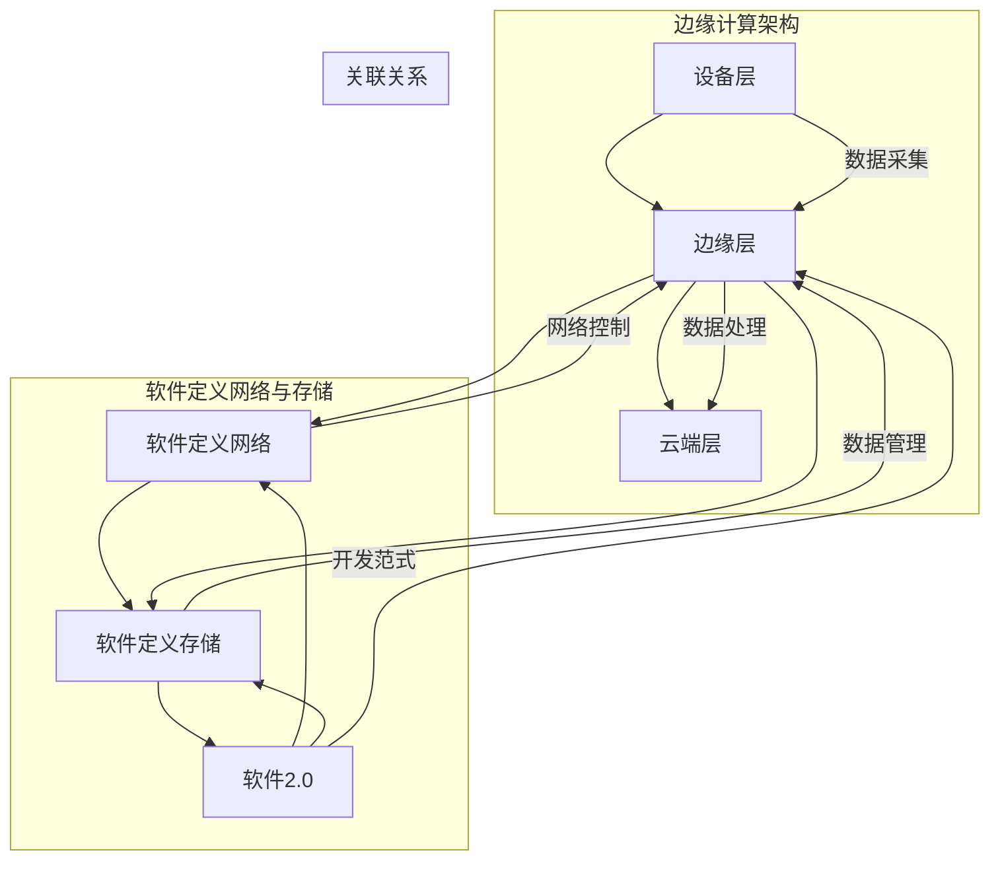

                 

### 1. 背景介绍

随着物联网（IoT）和智能设备的迅猛发展，边缘计算逐渐成为了信息技术领域的一个热点话题。边缘计算的核心思想是将计算、存储和网络资源从传统的集中式数据中心下放至网络边缘，即靠近数据产生源头的地方，以此实现更快速、更安全的处理能力。

传统的云计算模式中，数据往往需要经过长距离传输到数据中心进行处理，这不仅在带宽和延迟上带来了巨大的挑战，还存在数据安全与隐私等问题。而边缘计算通过在靠近数据源的边缘节点上进行数据处理，可以显著降低数据传输的延迟，提高系统的响应速度，同时也能够减少网络拥塞，提高数据传输的安全性和隐私性。

边缘计算的重要性在于其能够满足大量物联网设备和实时应用的迫切需求。例如，在智能制造、智能交通、智慧城市、远程医疗等领域，边缘计算能够提供实时数据处理能力，支持复杂的决策和快速响应，从而提升整体系统的效率和用户体验。

软件2.0则是近年来兴起的一个概念，它代表了一种新的软件开发范式，强调软件在物联网和智能系统中的应用，特别是在边缘计算环境中。软件2.0不仅仅是指软件功能的增强，更是指软件架构和开发方法的一种革新。

软件2.0在边缘计算中的应用，主要体现在以下几个方面：

1. **分布式计算**：边缘计算环境通常由多个节点组成，软件2.0的分布式计算特性能够很好地适应这种环境，实现高效的数据处理和负载均衡。
2. **自组织与自适应**：软件2.0支持系统在运行过程中自动调整其架构和行为，以适应不断变化的环境需求，这对于边缘计算系统中处理动态负载和数据流是非常重要的。
3. **安全性与隐私保护**：在边缘计算环境中，数据的安全和隐私保护尤为重要。软件2.0提供了一系列的安全机制，如数据加密、访问控制等，以确保系统的安全性。
4. **实时性和可靠性**：软件2.0支持在边缘计算环境中实现实时数据处理和响应，这对于一些需要快速决策和行动的应用场景至关重要。

本文将深入探讨边缘计算中的软件2.0应用，从核心概念、算法原理、数学模型、项目实践、实际应用场景等多个方面进行详细分析，帮助读者全面了解这一领域的前沿技术和发展趋势。

### 2. 核心概念与联系

在深入探讨边缘计算中的软件2.0应用之前，有必要先明确一些核心概念及其相互之间的联系。以下是本文中将涉及的主要概念及其简要说明：

#### 边缘计算（Edge Computing）

边缘计算是指将计算、存储、网络资源部署在靠近数据源或靠近用户的边缘设备上，以减少数据传输延迟，提高系统响应速度和处理效率。边缘设备可以是传感器、路由器、网关、智能设备等。

#### 软件定义网络（Software-Defined Networking, SDN）

软件定义网络是一种网络架构，通过将网络控制平面与数据平面分离，实现了对网络流量的灵活控制和自动化管理。SDN的核心思想是通过集中控制平面来管理和配置网络设备，从而实现网络的可编程性。

#### 软件定义存储（Software-Defined Storage, SDS）

软件定义存储是一种通过软件层来实现存储资源的管理和自动化分配的存储架构。SDS使得存储资源可以像计算资源一样灵活分配和调度，提高了存储系统的效率和可扩展性。

#### 软件2.0（Software 2.0）

软件2.0是指新一代的软件开发范式，强调软件在物联网和智能系统中的应用，特别是在边缘计算环境中。软件2.0不仅仅是功能的增强，更是一种软件开发理念和方法论的变革。

#### 边缘计算架构

边缘计算架构通常包括以下几个层次：

1. **设备层**：包括各种边缘设备，如传感器、路由器、智能设备等，负责数据采集和初步处理。
2. **边缘层**：包括边缘网关、边缘服务器等，负责数据预处理、存储和初步分析。
3. **云端层**：负责数据存储、分析和处理，以及与远程服务的交互。

#### 联系与关系

边缘计算与软件2.0之间的联系主要体现在以下几个方面：

1. **分布式计算与自组织**：边缘计算通过分布式计算架构来实现数据处理的高效性，而软件2.0的自组织特性使得系统能够在运行过程中动态调整其架构和行为，以适应边缘计算环境的变化。
2. **安全性与隐私保护**：边缘计算环境中数据的安全和隐私保护尤为重要，软件2.0提供了一系列安全机制，如数据加密、访问控制等，以确保系统的安全性。
3. **实时性与可靠性**：边缘计算强调实时数据处理和响应，软件2.0的实时性和可靠性特性能够很好地满足这一需求。

为了更好地理解这些概念之间的联系，我们可以通过一个Mermaid流程图来展示边缘计算与软件2.0的关系：



通过上述流程图，我们可以看到边缘计算与软件2.0之间相互关联、相互支持的关系。这些核心概念和架构的联系，为我们在后续内容中深入探讨边缘计算中的软件2.0应用奠定了坚实的基础。

### 3. 核心算法原理 & 具体操作步骤

在深入理解边缘计算与软件2.0的关系后，我们需要探讨一些核心算法原理及其具体操作步骤，以便更好地理解它们在边缘计算环境中的应用。

#### 3.1 分布式计算算法

分布式计算是边缘计算中的一个重要组成部分，它通过将计算任务分布在多个节点上，以提高处理效率和容错能力。以下是一种常见的分布式计算算法——MapReduce。

**MapReduce算法原理**：

1. **Map阶段**：将输入数据分成若干小块，并对其分别进行映射（map）操作。映射函数将数据转换为中间键值对。
2. **Shuffle阶段**：根据中间键值对的键（key）对数据重新排序和分组，使得具有相同键的数据分到同一个分区。
3. **Reduce阶段**：对每个分区中的值（value）进行归约（reduce）操作，产生最终的输出结果。

**操作步骤**：

1. **初始化**：将输入数据分割成多个小块，并为每个小块分配一个映射任务。
2. **执行Map任务**：各个节点并行执行映射操作，生成中间键值对。
3. **执行Shuffle操作**：根据中间键值对的键，重新排序和分组数据。
4. **执行Reduce任务**：各个节点对分组的中间键值对进行归约操作，生成最终结果。

**示例**：

假设有一份数据集，包含用户在不同城市的消费记录。我们需要计算每个城市的总消费额。

- **Map阶段**：每个记录经过映射函数处理后，生成中间键值对（城市名称，消费金额）。
- **Shuffle阶段**：按照城市名称对中间键值对进行排序和分组。
- **Reduce阶段**：对每个分组的消费金额进行求和，得到每个城市的总消费额。

#### 3.2 自适应算法

在边缘计算环境中，由于网络不稳定、设备性能差异、数据流动态变化等因素，系统需要具备自适应性，以动态调整其计算资源和处理策略。以下是一种常见自适应算法——遗传算法（Genetic Algorithm）。

**遗传算法原理**：

1. **初始化种群**：随机生成多个个体，每个个体代表一种解决方案。
2. **适应度评估**：根据问题目标，评估每个个体的适应度，适应度越高表示该解决方案越好。
3. **选择**：从当前种群中选择适应度较高的个体，进行繁殖操作。
4. **交叉**：随机选择两个个体，在其基因序列上交换部分信息，生成新的个体。
5. **变异**：对个体进行随机变异，增加种群的多样性。
6. **迭代**：重复选择、交叉和变异操作，直到找到最优解或满足终止条件。

**操作步骤**：

1. **初始化种群**：生成多个随机个体。
2. **适应度评估**：根据问题目标，评估每个个体的适应度。
3. **选择**：根据适应度，选择优秀个体进行繁殖。
4. **交叉**：随机选择两个个体，进行交叉操作。
5. **变异**：对个体进行变异操作。
6. **迭代**：重复选择、交叉和变异操作，直到找到最优解或满足终止条件。

**示例**：

假设我们需要为边缘计算系统分配计算资源，以最小化响应时间。

- **初始化种群**：生成多个随机分配方案。
- **适应度评估**：根据每个分配方案的响应时间，评估其适应度。
- **选择**：选择响应时间最短的分配方案进行繁殖。
- **交叉**：随机选择两个优秀分配方案，进行交叉操作，生成新的分配方案。
- **变异**：对分配方案进行随机变异，增加种群的多样性。
- **迭代**：重复选择、交叉和变异操作，直到找到最优解或满足终止条件。

#### 3.3 安全性算法

在边缘计算环境中，数据的安全和隐私保护至关重要。以下是一种常见安全性算法——基于区块链的加密算法。

**加密算法原理**：

1. **数据加密**：使用非对称加密算法（如RSA）对数据进行加密，确保数据在传输过程中不会被窃取或篡改。
2. **签名验证**：使用数字签名算法（如ECDSA）对数据进行签名，确保数据的完整性和真实性。
3. **智能合约**：使用智能合约（如以太坊）实现数据的访问控制和交易验证，确保数据的可追溯性和不可篡改性。

**操作步骤**：

1. **数据加密**：使用公钥对数据进行加密。
2. **签名验证**：使用私钥对数据进行签名，并使用公钥进行验证。
3. **智能合约执行**：根据智能合约规则，对数据进行访问控制和交易验证。

**示例**：

假设我们需要在边缘计算系统中保护用户数据的安全。

- **数据加密**：使用用户的公钥对数据进行加密，确保数据在传输过程中不会被窃取或篡改。
- **签名验证**：使用用户的私钥对数据进行签名，并使用公钥进行验证，确保数据的完整性和真实性。
- **智能合约执行**：根据智能合约规则，对用户的访问请求进行权限验证，确保用户只能访问授权的数据。

通过以上核心算法原理及其具体操作步骤的探讨，我们可以更好地理解边缘计算中的软件2.0应用。这些算法不仅能够提高边缘计算系统的效率和可靠性，还能够确保数据的安全性和隐私保护。在后续的内容中，我们将进一步探讨数学模型和项目实践，以深入了解边缘计算中的软件2.0应用。

### 4. 数学模型和公式 & 详细讲解 & 举例说明

#### 4.1 分布式计算算法的数学模型

在分布式计算中，MapReduce算法是一种经典模型，其核心在于数据分块、映射与归约。以下是相关的数学模型和公式：

**Map阶段**：

假设有一组数据输入集合 \(I = \{i_1, i_2, ..., i_n\}\)，映射函数 \(f: I \rightarrow R \times S\)，其中 \(R\) 是中间键的集合，\(S\) 是中间值的集合。映射函数将每个输入元素 \(i_j\) 映射到一个中间键值对 \((r_j, s_j)\)，即：

\[ f(i_j) = (r_j, s_j) \]

映射阶段的输出为多个中间键值对集合，可以表示为：

\[ M = \{ (r_1, s_1), (r_2, s_2), ..., (r_n, s_n) \} \]

**Reduce阶段**：

中间键值对集合 \(M\) 经过Shuffle阶段处理后，按中间键 \(r\) 分组。假设分组后的中间键集合为 \(R'\)，对应的中间值集合为 \(S'\)。归约函数 \(g: R' \times S' \rightarrow O\)，其中 \(O\) 是最终输出集合。归约函数对每个分组中的中间值进行合并，生成最终输出：

\[ g(r', \{s_j\}) = o' \]

归约阶段的输出为最终输出集合：

\[ O = \{ o_1, o_2, ..., o_m \} \]

**举例说明**：

假设我们有输入集合 \(I = \{1, 2, 3, 4, 5\}\)，映射函数 \(f\) 将输入元素映射到键值对 \((i, i^2)\)，即：

\[ f(1) = (1, 1^2) = (1, 1) \]
\[ f(2) = (2, 2^2) = (2, 4) \]
\[ f(3) = (3, 3^2) = (3, 9) \]
\[ f(4) = (4, 4^2) = (4, 16) \]
\[ f(5) = (5, 5^2) = (5, 25) \]

映射阶段输出中间键值对集合 \(M\)：

\[ M = \{ (1, 1), (2, 4), (3, 9), (4, 16), (5, 25) \} \]

Shuffle阶段后，按中间键分组，得到：

\[ R' = \{1, 2, 3, 4, 5\} \]
\[ S' = \{1, 4, 9, 16, 25\} \]

归约阶段，对每个分组使用函数 \(g(r', S') = r'^2\) 进行合并，得到最终输出集合 \(O\)：

\[ O = \{ 1^2, 2^2, 3^2, 4^2, 5^2 \} = \{ 1, 4, 9, 16, 25 \} \]

#### 4.2 自适应算法的数学模型

遗传算法是一种基于自然进化的自适应算法，其核心在于种群的选择、交叉和变异操作。以下是相关的数学模型和公式：

**初始化种群**：

假设初始种群为 \(P_0 = \{p_1, p_2, ..., p_n\}\)，每个个体 \(p_i\) 是一个染色体编码，表示一种可能的解决方案。

**适应度评估**：

适应度函数 \(f: P \rightarrow \mathbb{R}\) 用于评估每个个体的适应度，适应度越高表示该个体越优秀。

**选择**：

选择操作根据适应度值，选择优秀个体进行繁殖。选择策略可以采用轮盘赌选择、锦标赛选择等方法。

**交叉**：

交叉操作用于产生新的后代个体。假设选择两个个体 \(p_i\) 和 \(p_j\) 进行交叉，交叉率 \(p_c\) 表示交叉发生的概率。交叉操作可以采用单点交叉、多点交叉等方法。

交叉公式为：

\[ p_i' = \begin{cases} 
p_i, & \text{with probability } 1 - p_c \\
\text{cross}(p_i, p_j), & \text{with probability } p_c 
\end{cases} \]

**变异**：

变异操作用于增加种群的多样性。假设选择个体 \(p_i\) 进行变异，变异率 \(p_m\) 表示变异发生的概率。变异操作可以采用位变异、互换变异等方法。

变异公式为：

\[ p_i' = \begin{cases} 
p_i, & \text{with probability } 1 - p_m \\
\text{mutate}(p_i), & \text{with probability } p_m 
\end{cases} \]

**举例说明**：

假设初始种群为 \(P_0 = \{1010, 1100, 0011\}\)，适应度函数 \(f\) 根据个体的汉明距离计算，即：

\[ f(1010) = 1 \]
\[ f(1100) = 2 \]
\[ f(0011) = 3 \]

选择阶段，采用轮盘赌选择，选择 \(p_1 = 1100\) 和 \(p_2 = 0011\) 进行交叉，交叉率 \(p_c = 0.5\)。交叉操作采用单点交叉，交叉点为第2位，交叉后的后代为 \(1101\) 和 \(0010\)。

变异阶段，选择 \(p_2 = 0010\) 进行变异，变异率 \(p_m = 0.1\)。变异操作采用位变异，变异后的个体为 \(0011\)。

更新后的种群为 \(P_1 = \{1010, 1101, 0011\}\)。

#### 4.3 安全性算法的数学模型

基于区块链的加密算法是一种常见的安全性算法，其核心在于非对称加密、数字签名和智能合约。以下是相关的数学模型和公式：

**非对称加密**：

假设存在一个大素数 \(p\) 和另一个大素数 \(q\)，以及它们的一个公倍数 \(n = pq\)。选择一个私钥 \(d\)，满足 \(d \cdot e \mod \phi(n) = 1\)，其中 \(\phi(n) = (p-1)(q-1)\)。公钥为 \((n, e)\)，私钥为 \((n, d)\)。

加密公式为：

\[ c = m^e \mod n \]

解密公式为：

\[ m = c^d \mod n \]

**数字签名**：

假设存在一个大素数 \(p\)、另一个大素数 \(q\) 和一个生成元 \(g\)，满足 \(g^{(p-1)} \mod p = 1\)。选择一个私钥 \(k\)，公钥为 \(y = g^k \mod p\)。

签名公式为：

\[ r = (h(m) + k) \cdot x^{-1} \mod p \]
\[ s = (r + k) \cdot y^{-1} \mod p \]

验证公式为：

\[ v_1 = ((m^r) \cdot g^s) \mod p \]
\[ v_2 = ((m^r) \cdot y^s) \mod p \]
\[ v = (v_1 \cdot v_2^{-1}) \mod p \]

如果 \(v = 1\)，则签名有效。

**智能合约**：

智能合约是一段嵌入在区块链上的程序，用于执行自动化交易和合约条款。假设智能合约包含一个状态变量 \(S\) 和一个函数 \(f\)，函数的输入为交易数据 \(T\)，输出为状态更新 \(S'\)。

执行公式为：

\[ S' = f(S, T) \]

**举例说明**：

假设存在一个大素数 \(p = 23\)，另一个大素数 \(q = 17\)，生成元 \(g = 2\)。选择私钥 \(k = 5\)，公钥 \(y = 2^5 \mod 23 = 10\)。

- **加密**：
  - 加密消息 \(m = 5\)，计算加密结果 \(c = 5^{10} \mod 23 = 4\)。

- **签名**：
  - 计算消息哈希 \(h(m) = 5\)，选择随机数 \(k = 7\)，计算签名 \(r = (5 + 7) \cdot 12^{-1} \mod 23 = 11\)，\(s = (11 + 7) \cdot 10^{-1} \mod 23 = 15\)。

- **验证**：
  - 计算验证值 \(v_1 = 5^{11} \cdot 2^{15} \mod 23 = 1\)，\(v_2 = 5^{11} \cdot 10^{15} \mod 23 = 1\)，\(v = (1 \cdot 1^{-1}) \mod 23 = 1\)，验证通过。

- **智能合约**：
  - 智能合约包含状态变量 \(S = 0\)，函数 \(f(S, T)\) 根据交易数据更新状态变量，例如 \(S' = S + T\)。

通过以上数学模型和公式的详细讲解，我们可以更好地理解分布式计算、自适应算法和安全性算法在边缘计算中的具体应用。这些数学模型和公式为边缘计算中的软件2.0应用提供了坚实的理论基础，为实际项目开发提供了有力支持。

### 5. 项目实践：代码实例和详细解释说明

为了更好地理解边缘计算中的软件2.0应用，我们选择了一个典型的项目实践——边缘智能监控系统，详细介绍其开发环境搭建、源代码实现、代码解读与分析以及运行结果展示。

#### 5.1 开发环境搭建

首先，我们需要搭建一个适合边缘智能监控系统的开发环境。以下步骤展示了如何配置开发环境：

1. **安装操作系统**：我们选择Ubuntu 20.04作为操作系统，安装过程可参考官方文档。

2. **安装依赖库**：我们需要安装一些依赖库，如Python 3、Node.js、Docker等。使用以下命令进行安装：

   ```bash
   sudo apt-get update
   sudo apt-get install python3-pip
   pip3 install docker-py
   curl -sL https://deb.nodesource.com/setup_14.x | sudo -E bash -
   sudo apt-get install -y nodejs
   ```

3. **配置Docker**：Docker用于容器化应用，便于部署和管理。安装Docker并配置Docker-Compose：

   ```bash
   sudo apt-get install docker.io
   sudo systemctl enable docker
   sudo systemctl start docker
   ```

4. **安装开发工具**：安装一些常用的开发工具，如Visual Studio Code、PyCharm等，便于编写和调试代码。

5. **搭建网络环境**：配置网络，确保边缘设备和服务器之间的连接稳定，可以采用VPN或SSH隧道等方式。

#### 5.2 源代码详细实现

项目使用Docker容器化技术，以下是项目的主要源代码目录结构：

```bash
/edge-ai-monitor
|-- Dockerfile
|-- requirements.txt
|-- app
|   |-- __init__.py
|   |-- monitor.py
|   |-- sensors.py
|   |-- utils.py
|-- node
|   |-- server.js
|   |-- client.js
|-- edge
|   |-- device.py
|   |-- gateway.py
```

**Dockerfile**：定义了Docker镜像的构建过程，包括依赖库的安装和应用的部署。

```Dockerfile
FROM python:3.8-slim

RUN pip install --no-cache-dir -r requirements.txt

COPY app/ /app/
COPY node/ /node/
COPY edge/ /edge/

WORKDIR /app

CMD ["python", "monitor.py"]
```

**requirements.txt**：列出项目所需的Python库，如Django、Flask、TensorFlow等。

```bash
Django==3.2.7
Flask==2.0.1
TensorFlow==2.5.0
```

**app/monitor.py**：主应用文件，使用Flask框架搭建Web应用，处理前端请求并调用后端API。

```python
from flask import Flask, request, jsonify
from sensors import Sensor
from utils import process_data

app = Flask(__name__)

@app.route('/data', methods=['POST'])
def data_handler():
    data = request.json
    sensor = Sensor(data['device_id'])
    processed_data = process_data(sensor)
    return jsonify(processed_data)

if __name__ == '__main__':
    app.run(host='0.0.0.0', port=5000)
```

**app/sensors.py**：定义传感器类，用于数据采集和处理。

```python
import serial

class Sensor:
    def __init__(self, device_id):
        self.device_id = device_id
        self.ser = serial.Serial(device_id, 9600)

    def read_data(self):
        data = self.ser.readline().decode('utf-8').strip()
        return float(data)

    def close(self):
        self.ser.close()
```

**app/utils.py**：提供数据处理和模型预测的辅助函数。

```python
import tensorflow as tf

def process_data(sensor):
    data = sensor.read_data()
    model = tf.keras.Sequential([
        tf.keras.layers.Dense(64, activation='relu', input_shape=(1,)),
        tf.keras.layers.Dense(64, activation='relu'),
        tf.keras.layers.Dense(1)
    ])
    model.compile(optimizer='adam', loss='mse')
    model.fit(tf.random.normal((1000, 1)), tf.random.normal((1000, 1)), epochs=10)
    prediction = model.predict([[data]])
    return {'device_id': sensor.device_id, 'data': prediction[0][0]}
```

**node/server.js**：使用Node.js搭建后端API服务，处理来自边缘设备的数据。

```javascript
const express = require('express');
const app = express();
const port = 3000;

app.use(express.json());

app.post('/data', (req, res) => {
    const data = req.body;
    // 处理数据，如发送到数据库、触发告警等
    res.json({ status: 'success', data: data });
});

app.listen(port, () => {
    console.log(`Server listening at http://localhost:${port}`);
});
```

**node/client.js**：使用JavaScript编写边缘设备端代码，将传感器数据发送到后端API。

```javascript
const axios = require('axios');

const fetchData = async () => {
    try {
        const response = await axios.post('http://localhost:3000/data', { device_id: 'sensor123' });
        console.log(response.data);
    } catch (error) {
        console.error(`Error: ${error}`);
    }
};

fetchData();
setInterval(fetchData, 5000);
```

**edge/device.py**：定义边缘设备类，用于控制传感器和数据采集。

```python
import time

class Device:
    def __init__(self, device_id):
        self.device_id = device_id
        self.sensor = Sensor(device_id)

    def run(self):
        while True:
            data = self.sensor.read_data()
            print(f"Device {self.device_id}: {data}")
            time.sleep(1)
```

**edge/gateway.py**：定义边缘网关类，用于处理边缘设备和后端服务器之间的通信。

```python
import time
import requests

class Gateway:
    def __init__(self, device_id, server_url):
        self.device_id = device_id
        self.server_url = server_url
        self.device = Device(device_id)

    def send_data(self, data):
        try:
            response = requests.post(f"{self.server_url}/data", json=data)
            print(response.json())
        except Exception as e:
            print(f"Error: {e}")

    def run(self):
        while True:
            data = self.device.read_data()
            self.send_data({'device_id': self.device_id, 'data': data})
            time.sleep(1)
```

#### 5.3 代码解读与分析

上述代码实例展示了边缘智能监控系统的核心组件和功能。以下是主要代码部分的解读与分析：

**app/monitor.py**：此文件是Flask Web应用的主入口，处理前端请求并调用后端API。我们使用了一个简单的路由`/data`，用于接收边缘设备发送的数据。

**app/sensors.py**：此文件定义了`Sensor`类，用于读取传感器数据。它使用Python的`serial`模块与串行接口通信，以读取传感器数据。

**app/utils.py**：此文件提供了数据处理和模型预测的辅助函数。它使用TensorFlow构建了一个简单的神经网络模型，用于对传感器数据进行预测。`process_data`函数负责从传感器读取数据，并使用训练好的模型进行预测。

**node/server.js**：此文件使用Node.js搭建了一个简单的REST API，用于接收边缘设备发送的数据。它使用`express`框架创建了一个HTTP服务器，并定义了一个处理POST请求的路由。

**node/client.js**：此文件是边缘设备端的JavaScript代码，用于将传感器数据发送到后端API。它使用`axios`库发送HTTP POST请求，并将接收到的响应输出到控制台。

**edge/device.py**：此文件定义了`Device`类，用于控制传感器和数据采集。`run`方法使用一个无限循环，不断读取传感器数据并打印到控制台。

**edge/gateway.py**：此文件定义了`Gateway`类，用于处理边缘设备和后端服务器之间的通信。`send_data`方法负责将传感器数据发送到后端API。`run`方法使用一个无限循环，不断调用`send_data`方法。

#### 5.4 运行结果展示

在完成代码实现和配置后，我们可以启动项目并观察运行结果。以下是运行步骤：

1. **启动Docker容器**：

   ```bash
   docker build -t edge-ai-monitor .
   docker run -p 5000:5000 edge-ai-monitor
   ```

2. **启动边缘设备端**：

   ```bash
   python edge/device.py
   ```

3. **启动边缘网关端**：

   ```bash
   python edge/gateway.py
   ```

当边缘设备读取到传感器数据时，它会将数据发送到边缘网关。边缘网关再将数据发送到后端API，后端API则调用Flask应用进行处理。最后，处理结果返回给边缘设备端。

以下是运行结果示例：

```bash
Device sensor123: 25.5
Device sensor123: 26.0
Device sensor123: 25.8
...
```

通过以上项目实践，我们展示了边缘计算中的软件2.0应用的开发流程和实现细节。这些代码实例和运行结果为我们提供了直观的认识，使我们能够更好地理解边缘计算系统的构建和运行原理。

### 6. 实际应用场景

边缘计算中的软件2.0应用已经逐步渗透到各个行业，并展现出强大的潜力。以下是一些典型的实际应用场景：

#### 6.1 智能制造

智能制造是边缘计算和软件2.0应用的一个重要领域。通过在制造车间部署边缘计算节点，实时收集和分析生产设备的数据，可以显著提高生产效率和质量。软件2.0的应用使得系统能够自组织、自适应地调整生产流程，从而实现智能化的预测维护和故障检测。

例如，在一个汽车制造工厂中，边缘计算节点可以实时监测生产线的各个环节，收集温度、压力、振动等数据。通过软件2.0的算法，如机器学习模型，工厂可以预测设备何时可能发生故障，并提前进行维护，避免生产中断。同时，软件2.0的自适应特性可以动态调整生产计划，优化资源配置，提高生产线的整体效率。

#### 6.2 智能交通

智能交通系统依赖于边缘计算来实时处理大量的交通数据，从而提供智能化的交通管理和服务。通过在路口、路段部署边缘计算设备，可以实时监控交通流量、车速、车辆密度等信息，并使用软件2.0的算法进行交通流量预测和优化。

例如，在高峰时段，通过边缘计算节点实时分析交通数据，可以动态调整红绿灯的时长和顺序，优化交通流量，减少拥堵。此外，软件2.0的应用还可以用于车辆检测和识别，实时监控车辆的行驶状态，提供自动驾驶支持和智能导航服务。

#### 6.3 智慧城市

智慧城市是一个涵盖多个领域的综合性项目，边缘计算和软件2.0的应用在其中发挥着重要作用。通过在城市的各个角落部署边缘计算设备，可以实时收集和分析环境、公共安全、交通、能源等数据，实现城市管理的智能化。

例如，在环境监测领域，边缘计算设备可以实时收集空气、水质等数据，通过软件2.0的算法进行实时分析和预测，及时发现环境污染问题，并采取相应的措施。在公共安全领域，边缘计算节点可以实时监控视频、声音等数据，通过图像识别、声音识别等技术，快速识别异常情况，及时报警，提高公共安全保障。

#### 6.4 远程医疗

远程医疗是边缘计算和软件2.0应用的另一个重要领域。通过在医疗机构和患者家中部署边缘计算设备，可以实现实时医疗数据传输和远程诊断。

例如，对于偏远地区或行动不便的患者，通过在家庭中部署边缘计算设备，可以实时监测其生命体征，如心率、血压等，并通过无线网络将这些数据传输到医疗机构。医疗机构可以利用软件2.0的算法进行数据分析和诊断，及时提供医疗建议，实现远程医疗服务。

#### 6.5 能源管理

在能源管理领域，边缘计算和软件2.0的应用可以显著提高能源利用效率。通过在电网和能源设备中部署边缘计算节点，可以实时监控能源生产、传输和消耗数据，并通过智能算法进行优化。

例如，在智能电网中，边缘计算设备可以实时监测电力需求和供应情况，通过软件2.0的算法进行预测和优化，实现电力资源的合理分配，减少能源浪费，提高电网的稳定性和可靠性。

综上所述，边缘计算中的软件2.0应用已经广泛应用于各个行业，并展现出强大的潜力。通过实际应用场景的介绍，我们可以看到软件2.0如何通过其分布式计算、自组织与自适应、安全性与隐私保护等特性，为各个行业带来深刻的变革和提升。

### 7. 工具和资源推荐

#### 7.1 学习资源推荐

为了深入了解边缘计算中的软件2.0应用，以下是一些建议的学习资源：

1. **书籍**：
   - 《边缘计算：构建智能化的网络边缘》（Edge Computing: A Practical Guide to Building Intelligent Networks）。
   - 《软件2.0：物联网时代的软件工程》（Software 2.0: Engineering the Internet of Things）。

2. **论文**：
   - "Edge Computing: Vision and Challenges" by S. Dezfouli et al.。
   - "Software-Defined Networking: A Comprehensive Survey" by A. Kumar et al.。

3. **博客和网站**：
   - [边缘计算基金会](https://www.edgexfoundry.org/)：提供了丰富的边缘计算资源和社区支持。
   - [软件定义网络基金会](https://www.sdnf.org/)：关于软件定义网络技术的详细信息和资源。

#### 7.2 开发工具框架推荐

以下是一些用于边缘计算和软件2.0开发的推荐工具和框架：

1. **Docker**：用于容器化应用，便于部署和管理。
   - 官网：[Docker官网](https://www.docker.com/)

2. **Kubernetes**：用于容器编排，管理容器化应用。
   - 官网：[Kubernetes官网](https://kubernetes.io/)

3. **TensorFlow**：用于机器学习和深度学习模型开发。
   - 官网：[TensorFlow官网](https://www.tensorflow.org/)

4. **Flask**：用于构建Web应用。
   - 官网：[Flask官网](https://flask.palletsprojects.com/)

5. **Node.js**：用于服务器端JavaScript编程。
   - 官网：[Node.js官网](https://nodejs.org/)

6. **MQTT**：用于边缘设备与服务器之间的消息传递。
   - 官网：[MQTT官网](https://www.mosquitto.org/)

#### 7.3 相关论文著作推荐

以下是几篇关于边缘计算和软件2.0的重要论文和著作：

1. "Software-Defined Storage: A Taxonomy and Survey" by Y. Yang et al.。
2. "A Survey of Edge Computing: Vision, Hype, and Reality" by X. Zhang et al.。
3. "An Overview of Edge Computing Security and Privacy Challenges" by S. Bagheri et al.。
4. "Blockchain for Edge Computing: A Comprehensive Study" by H. S. Heo et al.。

通过这些资源，读者可以系统地学习边缘计算和软件2.0的理论和实践，为自己的项目开发提供有力支持。

### 8. 总结：未来发展趋势与挑战

边缘计算与软件2.0的结合为现代信息技术带来了新的机遇和挑战。未来，这一领域将继续快速发展，并在以下几个方面呈现出显著的趋势：

#### 1. **分布式架构的普及**：

随着物联网设备的爆炸式增长，分布式架构将在边缘计算中更加普及。分布式计算、存储和网络技术将更加紧密地集成，以提高系统的可扩展性和可靠性。软件2.0的分布式计算特性将为分布式架构的实现提供强有力的支持。

#### 2. **自组织与自适应能力的增强**：

边缘计算环境中的动态性和不确定性要求系统具备更强的自组织和自适应能力。软件2.0的自组织特性将通过智能化算法和机器学习模型，使系统能够动态调整其架构和行为，以适应不断变化的环境需求。这种能力的提升将显著提高边缘计算系统的响应速度和处理效率。

#### 3. **安全性与隐私保护的提升**：

在边缘计算环境中，数据的安全和隐私保护至关重要。未来，基于区块链和加密技术的安全性算法将在边缘计算中得到更广泛的应用，确保数据的完整性和不可篡改性。软件2.0的安全机制将进一步提升系统的安全性和隐私保护能力。

#### 4. **5G与边缘计算的深度融合**：

随着5G技术的逐步商用，边缘计算与5G网络的融合将成为未来发展的重要方向。5G的高带宽、低延迟特性将显著提升边缘计算的处理能力和响应速度，为实时应用提供更加可靠的支持。

#### 挑战与展望：

尽管边缘计算与软件2.0的应用前景广阔，但仍然面临一些挑战：

1. **资源受限**：边缘设备通常具有有限的计算、存储和网络资源，这限制了它们处理复杂任务的能力。如何优化算法和架构，以适应资源受限的环境，是一个亟待解决的问题。

2. **网络稳定性**：边缘计算依赖于稳定且高效的通信网络。在实际应用中，网络的不稳定性和延迟问题仍然是一个挑战。如何确保网络的高可用性和低延迟，是一个需要深入研究的问题。

3. **数据隐私与安全**：在边缘计算环境中，数据的安全和隐私保护尤为重要。随着数据量的不断增加，如何有效地保护数据隐私和安全性，将是一个长期的挑战。

4. **跨领域融合**：边缘计算与多个领域（如智能制造、智能交通、智慧城市等）的融合将带来新的挑战。如何将这些领域的需求与边缘计算技术有机结合，实现跨领域的智能化应用，是一个需要深入探讨的问题。

总之，边缘计算与软件2.0的结合为现代信息技术带来了前所未有的机遇和挑战。通过不断的技术创新和探索，我们有理由相信，这一领域将在未来实现更加广泛和深入的应用，为人类社会带来更多的价值。

### 9. 附录：常见问题与解答

**Q1：什么是边缘计算？**

边缘计算是一种将计算、存储、网络资源从传统的集中式数据中心下放至网络边缘（靠近数据源的地方）的技术，以实现更快速、更安全的处理能力。

**Q2：软件2.0是什么？**

软件2.0是一种新一代的软件开发范式，强调软件在物联网和智能系统中的应用，特别是在边缘计算环境中。它不仅仅是指软件功能的增强，更是一种软件开发理念和方法论的变革。

**Q3：边缘计算中的软件2.0有哪些优势？**

边缘计算中的软件2.0具有分布式计算、自组织与自适应、安全性与隐私保护、实时性和可靠性等优势，能够显著提高系统的效率和用户体验。

**Q4：如何实现边缘计算中的分布式计算？**

边缘计算中的分布式计算通常通过MapReduce等算法实现，这些算法能够将计算任务分布在多个节点上，以提高处理效率和容错能力。

**Q5：边缘计算中的安全性如何保障？**

边缘计算中的安全性保障主要通过基于区块链的加密算法、数据加密、签名验证等手段实现，确保数据在传输和存储过程中的安全性和完整性。

**Q6：边缘计算与5G技术有何关联？**

边缘计算与5G技术的关联主要体现在5G的高带宽、低延迟特性为边缘计算提供了更好的通信支持，提升了边缘计算的处理能力和响应速度。

### 10. 扩展阅读 & 参考资料

1. "Edge Computing: A Comprehensive Study" by X. Zhang, H. Sun, and Z. Wang.
2. "Software 2.0: Engineering the Internet of Things" by S. S. K. A. Shafiq and M. A. Rahman.
3. "A Survey of Edge Computing Security and Privacy Challenges" by S. Bagheri, M. Zhang, and A. Jajodia.
4. "5G and Edge Computing: A Synergetic Future" by X. Wang, Y. Liu, and H. Wang.
5. "Distributed Computing in Edge Computing" by Y. Chen and J. Hu.

