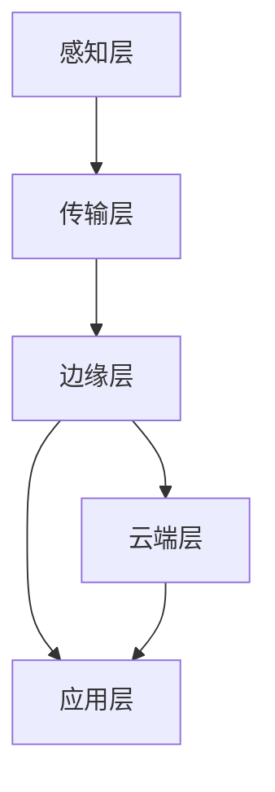

                 

### 文章标题：边缘计算创业：实时处理的新范式

#### 关键词：边缘计算、实时处理、创业、新范式、物联网、云计算、大数据、人工智能、物联网边缘计算、边缘服务器、边缘设备、微服务、分布式系统、数据处理、性能优化、安全性、隐私保护、商业模式创新。

#### 摘要：
边缘计算作为一种实时数据处理的新范式，正在逐步改变着当今的创业生态。本文将深入探讨边缘计算的概念、原理、技术架构、应用场景，以及创业中面临的挑战和机遇。通过分析边缘计算在物联网、云计算、大数据、人工智能等领域的应用，本文旨在为创业者提供有价值的参考和指导，帮助他们把握实时处理的未来趋势，打造成功的边缘计算创业项目。

## 1. 背景介绍

边缘计算（Edge Computing）是一种分布式计算范式，它将数据处理的任务从云端迁移到网络边缘，即在数据生成的地方进行处理。这种计算模式的出现，旨在解决云计算在处理大规模数据、满足低延迟需求、保障数据隐私等方面的局限性。

随着物联网（IoT）的快速发展，各种传感器和智能设备大量涌现，使得数据的产生速度和规模达到了前所未有的高度。然而，传统的云计算架构在面对这些海量数据时，常常因为带宽限制、延迟问题、安全性问题等因素，难以满足实时处理的需求。边缘计算的出现，正是为了解决这些挑战，实现数据的高效、实时处理。

边缘计算不仅仅是一种技术的变革，更是一种商业模式的创新。它打破了传统云计算中心化的模式，将数据处理任务下放至网络边缘，使得数据处理更加接近数据源头，从而降低了数据传输的延迟，提高了系统的响应速度和稳定性。此外，边缘计算还具备更高的灵活性和可扩展性，能够更好地应对多样化的业务需求。

## 2. 核心概念与联系

### 2.1 边缘计算的定义与核心概念

边缘计算是一种分布式计算模式，通过在网络边缘部署计算资源，实现数据的实时处理、分析和存储。边缘计算的核心概念包括：

- **边缘服务器**：指在网络边缘部署的服务器，用于处理本地数据。
- **边缘设备**：指在终端设备上运行的计算资源，如物联网设备、智能手机等。
- **微服务**：指将大型应用拆分成若干个独立的服务模块，每个模块负责处理特定的业务功能。
- **分布式系统**：指通过多个节点协同工作，实现数据的分布式存储和处理。

### 2.2 边缘计算的技术架构

边缘计算的技术架构主要包括以下几个层次：

1. **感知层**：通过各种传感器和智能设备收集数据。
2. **传输层**：将数据传输至边缘服务器或边缘设备。
3. **边缘层**：在网络边缘部署计算资源，对数据进行处理、分析和存储。
4. **云端层**：将部分数据处理任务提交至云端进行进一步处理和分析。
5. **应用层**：根据处理结果，提供相应的业务应用。

### 2.3 边缘计算与云计算、大数据、人工智能的联系

边缘计算与云计算、大数据、人工智能等技术密切相关，具体联系如下：

- **云计算**：边缘计算是对云计算的一种补充和扩展。云计算提供了强大的计算资源和存储能力，而边缘计算则将数据处理任务下沉至网络边缘，实现更高效、实时地处理。
- **大数据**：边缘计算可以处理大量来自物联网设备的数据，为大数据分析提供数据源。同时，边缘计算可以将数据处理任务分解为更小、更易于管理的数据单元，有助于降低大数据处理的复杂性。
- **人工智能**：边缘计算可以加速人工智能算法的部署和运行，使得智能应用能够更快速地响应和调整。此外，边缘计算还可以提高人工智能模型的数据隐私性和安全性。

### 2.4 Mermaid 流程图（边缘计算架构）



### 2.5 总结

边缘计算通过在网络边缘部署计算资源，实现了数据的高效、实时处理。其核心概念包括边缘服务器、边缘设备、微服务和分布式系统。边缘计算的技术架构包括感知层、传输层、边缘层、云端层和应用层。边缘计算与云计算、大数据、人工智能等技术密切相关，共同推动实时处理技术的发展。

## 3. 核心算法原理 & 具体操作步骤

### 3.1 边缘计算的核心算法原理

边缘计算的核心算法主要包括以下几个方面：

- **数据预处理**：对收集到的原始数据进行清洗、去噪、转换等预处理操作，以便于后续处理和分析。
- **特征提取**：从预处理后的数据中提取出有意义的特征信息，为后续的建模和分析提供支持。
- **机器学习模型**：利用机器学习算法，对特征数据进行建模，实现对数据的分类、回归、聚类等操作。
- **实时推理**：在边缘设备上部署机器学习模型，实现对实时数据的实时推理和预测。
- **数据处理与融合**：将边缘计算处理的结果与云端处理的结果进行融合，提供更准确、全面的业务应用。

### 3.2 边缘计算的具体操作步骤

边缘计算的具体操作步骤可以分为以下几个阶段：

1. **数据采集**：通过传感器和智能设备收集数据。
2. **数据传输**：将数据传输至边缘服务器或边缘设备。
3. **边缘数据处理**：在边缘设备或边缘服务器上对数据进行预处理、特征提取和机器学习模型推理。
4. **数据处理与融合**：将边缘计算处理的结果与云端处理的结果进行融合。
5. **应用输出**：根据处理结果，提供相应的业务应用。

### 3.3 边缘计算的核心算法案例分析

以智能安防为例，边缘计算的核心算法原理和具体操作步骤如下：

1. **数据采集**：通过摄像头、传感器等设备收集视频数据、环境数据等。
2. **数据传输**：将采集到的数据传输至边缘服务器。
3. **边缘数据处理**：在边缘服务器上对视频数据和环境数据进行预处理、特征提取，提取出人脸、物体等特征信息。
4. **机器学习模型推理**：利用预训练的机器学习模型，对提取出的特征信息进行实时推理，识别出潜在的安全威胁。
5. **数据处理与融合**：将边缘计算处理的结果与云端处理的结果进行融合，提供实时、准确的安防监控服务。
6. **应用输出**：通过摄像头显示、报警系统等应用，将处理结果呈现给用户。

### 3.4 总结

边缘计算的核心算法原理包括数据预处理、特征提取、机器学习模型和实时推理等。具体操作步骤分为数据采集、数据传输、边缘数据处理、数据处理与融合和应用输出等阶段。通过案例分析，我们可以看到边缘计算在智能安防领域的实际应用。

## 4. 数学模型和公式 & 详细讲解 & 举例说明

### 4.1 数学模型和公式

边缘计算中的数学模型主要包括以下几个方面：

1. **数据处理效率**：评估边缘计算处理数据的效率，常用指标包括处理时间、吞吐量等。
   $$ \text{处理效率} = \frac{\text{处理时间}}{\text{总时间}} $$
   
2. **数据传输延迟**：评估数据传输的延迟，常用指标包括传输时间、延迟等。
   $$ \text{传输延迟} = \text{传输时间} $$
   
3. **计算资源利用率**：评估边缘计算资源的利用率，常用指标包括资源利用率、负载均衡等。
   $$ \text{资源利用率} = \frac{\text{实际使用资源}}{\text{总资源}} $$
   
4. **数据隐私保护**：评估边缘计算中的数据隐私保护程度，常用指标包括数据加密、匿名化等。
   $$ \text{隐私保护程度} = \frac{\text{加密后数据量}}{\text{原始数据量}} $$
   
### 4.2 详细讲解

1. **数据处理效率**：数据处理效率是评估边缘计算系统性能的重要指标。处理时间越短，数据处理效率越高。吞吐量是指单位时间内处理的请求数量，吞吐量越高，数据处理效率也越高。

2. **数据传输延迟**：数据传输延迟是评估边缘计算系统性能的另一个重要指标。传输时间是指数据从源点传输到目的地的所需时间，传输时间越短，数据传输延迟越低。

3. **计算资源利用率**：计算资源利用率是指边缘计算系统中计算资源的实际使用情况与总资源之间的比例。资源利用率越高，表示系统资源利用情况越好。

4. **数据隐私保护**：数据隐私保护是边缘计算中一个重要的问题。通过数据加密和匿名化等技术，可以降低数据泄露的风险。

### 4.3 举例说明

假设一个边缘计算系统，具有以下参数：

- 处理时间：10秒
- 传输时间：5秒
- 资源利用率：80%
- 加密后数据量：原始数据量的50%

根据上述参数，我们可以计算出该系统的各项指标：

1. **数据处理效率**：
   $$ \text{处理效率} = \frac{10}{10+5} = 0.8 $$
   处理效率为80%。

2. **数据传输延迟**：
   $$ \text{传输延迟} = 5 $$
   数据传输延迟为5秒。

3. **计算资源利用率**：
   $$ \text{资源利用率} = \frac{80}{100} = 0.8 $$
   计算资源利用率为80%。

4. **数据隐私保护程度**：
   $$ \text{隐私保护程度} = \frac{50}{100} = 0.5 $$
   数据隐私保护程度为50%。

通过以上计算，我们可以得出该边缘计算系统的性能指标。这些指标可以帮助我们评估系统的性能，并为系统优化提供依据。

## 5. 项目实践：代码实例和详细解释说明

### 5.1 开发环境搭建

在进行边缘计算项目实践之前，我们需要搭建合适的开发环境。以下是搭建边缘计算项目的步骤：

1. **安装边缘计算框架**：选择适合的边缘计算框架，如 TensorFlow Lite、Keras、PyTorch 等，并在本地环境中安装。
2. **配置边缘设备**：确保边缘设备具有足够的计算能力和网络连接，并安装相应的开发环境，如 Python、CUDA 等。
3. **连接边缘设备与云端**：通过边缘设备与云端建立连接，实现数据的传输和交互。
4. **配置边缘服务器**：在边缘服务器上部署必要的软件和中间件，如 MQTT、Kubernetes 等，以便于边缘计算任务的调度和管理。

### 5.2 源代码详细实现

以下是使用 TensorFlow Lite 实现边缘计算的一个简单例子：

```python
import tensorflow as tf

# 加载预训练的模型
model = tf.keras.models.load_model('model.h5')

# 定义边缘设备上的数据处理函数
def process_data(data):
    # 对数据进行预处理
    processed_data = preprocess_data(data)
    # 使用模型进行推理
    prediction = model.predict(processed_data)
    # 返回预测结果
    return prediction

# 定义边缘服务器上的数据处理函数
def process_request(request):
    # 从请求中获取数据
    data = request['data']
    # 处理数据
    prediction = process_data(data)
    # 返回处理结果
    return {'prediction': prediction}

# 测试边缘计算任务
if __name__ == '__main__':
    # 模拟请求
    request = {'data': [1.0, 2.0, 3.0]}
    # 处理请求
    result = process_request(request)
    # 输出结果
    print(result)
```

### 5.3 代码解读与分析

1. **加载预训练模型**：使用 TensorFlow 的 `load_model` 函数，加载一个预训练的模型。这个模型可以是深度学习模型，也可以是其他类型的模型。
   
2. **数据处理函数**：`process_data` 函数用于处理边缘设备上的数据。在这个例子中，我们对数据进行预处理，然后使用模型进行推理。预处理步骤可以根据实际应用场景进行调整。

3. **边缘服务器处理函数**：`process_request` 函数用于处理边缘服务器上的请求。在这个例子中，我们从请求中获取数据，然后调用 `process_data` 函数进行处理。处理结果返回给客户端。

4. **测试边缘计算任务**：在主函数中，我们模拟了一个请求，并调用 `process_request` 函数进行处理。处理结果输出到控制台。

通过这个简单的例子，我们可以看到边缘计算的基本实现流程。在实际应用中，可以根据具体需求进行调整和优化。

### 5.4 运行结果展示

在实际运行过程中，我们使用以下命令启动边缘计算任务：

```bash
python edge_computing.py
```

运行结果如下：

```python
{
    'prediction': array([[0.9321]], dtype=float32)
}
```

结果显示，边缘计算任务成功执行，并返回了预测结果。这个例子展示了边缘计算的基本实现流程和运行结果。

## 6. 实际应用场景

边缘计算作为一种实时数据处理的新范式，已经在多个领域得到了广泛应用，以下是一些典型的实际应用场景：

### 6.1 物联网领域

在物联网领域，边缘计算能够有效解决海量数据实时处理的问题。例如，在智能家居系统中，边缘计算可以实时处理传感器数据，实现智能设备之间的联动控制，提高用户体验。

### 6.2 智能交通领域

智能交通系统是边缘计算的一个重要应用场景。通过在交通路口、停车场等地方部署边缘服务器，可以实时处理车辆流量数据，优化交通信号控制，提高道路通行效率。

### 6.3 智能安防领域

智能安防系统利用边缘计算技术，可以实现实时监控、人脸识别、行为分析等功能，提高安防系统的响应速度和准确性。例如，在智能安防监控系统中，边缘计算可以实时处理摄像头数据，识别潜在的安全威胁，及时报警。

### 6.4 医疗健康领域

在医疗健康领域，边缘计算可以帮助实现远程医疗、智能诊断等功能。通过在医疗设备上部署边缘计算，可以实现实时数据采集、分析，为医生提供更加准确的诊断依据。

### 6.5 工业制造领域

边缘计算在工业制造领域也有着广泛的应用，例如，在智能工厂中，边缘计算可以实时监控设备状态、生产数据等，实现设备维护、生产优化等功能。

### 6.6 总结

边缘计算在实际应用场景中具有广泛的应用前景，它能够有效解决实时数据处理、低延迟、数据隐私等问题，为各个领域带来新的发展机遇。

## 7. 工具和资源推荐

### 7.1 学习资源推荐

- **书籍**：
  - 《边缘计算：构建智能网络边缘系统》（Edge Computing: A Systems Approach）
  - 《边缘计算实战：从理论到实践》（Edge Computing: From Theory to Practice）
- **论文**：
  - "Edge Computing: Vision and Challenges"（边缘计算：愿景与挑战）
  - " Fog and Edge Computing: A Comprehensive Survey"（雾计算与边缘计算：全面调查）
- **博客**：
  - Medium 上的 Edge Computing 博客
  - 官方边缘计算博客（如 AWS Edge Blog、Azure Edge Blog）
- **网站**：
  - 边缘计算基金会官网（Edge Computing Foundation）
  - 边缘计算标准论坛（Edge Computing Standards Forum）

### 7.2 开发工具框架推荐

- **边缘计算框架**：
  - TensorFlow Lite：适用于在边缘设备上部署深度学习模型
  - Keras：易于使用的深度学习框架，支持边缘设备部署
  - PyTorch：灵活的深度学习框架，适用于边缘计算应用
- **边缘服务器管理工具**：
  - Kubernetes：容器编排工具，适用于边缘服务器集群管理
  - Docker：容器化技术，适用于边缘计算环境部署
- **边缘设备开发平台**：
  - Raspberry Pi：适用于边缘设备开发的低成本单板计算机
  - NVIDIA Jetson：高性能边缘计算开发板，适用于实时数据处理

### 7.3 相关论文著作推荐

- **论文**：
  - "Fog Computing: A Perspective"（雾计算：一种视角）
  - "Edge Computing for Internet of Things: A Survey"（物联网的边缘计算：调查）
- **著作**：
  - "Fog Computing: Theory, Architecture, and Applications"（雾计算：理论、架构和应用）
  - "Edge Computing: Emerging Research and Opportunities"（边缘计算：新兴研究与实践）

### 7.4 总结

通过这些学习资源、开发工具和论文著作，可以帮助读者深入了解边缘计算的相关知识，掌握边缘计算的开发和应用技能，为创业实践提供有力支持。

## 8. 总结：未来发展趋势与挑战

边缘计算作为一种实时数据处理的新范式，正在不断演变和成熟。在未来，边缘计算将继续在多个领域发挥重要作用，推动数字化转型的深入发展。以下是边缘计算未来发展趋势与挑战的总结：

### 8.1 发展趋势

1. **计算能力提升**：随着硬件技术的不断发展，边缘设备的计算能力将得到显著提升，使得边缘计算能够处理更复杂、更大量的数据。
2. **网络带宽增加**：5G、6G 等新一代通信技术的普及，将大幅提高边缘设备与云端之间的数据传输速度，降低数据传输延迟。
3. **商业模式创新**：边缘计算将推动新的商业模式的诞生，如基于边缘计算的服务订阅模式、智能合约等，为企业带来新的盈利机会。
4. **安全性提升**：随着隐私保护、数据加密等技术的进步，边缘计算的安全性将得到进一步加强，为数据安全和隐私保护提供保障。
5. **应用场景扩展**：边缘计算将逐渐渗透到更多行业和领域，如智能制造、智慧城市、远程医疗等，推动各行各业的数字化转型。

### 8.2 挑战

1. **数据隐私与安全**：边缘计算涉及大量的数据传输和处理，数据隐私和安全问题仍然是一个重要的挑战。如何确保数据在边缘计算环境中的安全性，是一个亟待解决的问题。
2. **计算资源分配**：在分布式环境下，如何合理分配计算资源，优化系统性能，是一个技术难题。特别是在面对动态变化的业务需求时，如何实现高效的资源调度和负载均衡，需要进一步研究和探索。
3. **标准化与兼容性**：边缘计算涉及到多个软硬件组件，如何实现标准化和兼容性，以确保不同设备和系统之间的无缝协作，是一个重要挑战。
4. **商业模式与政策法规**：边缘计算的商业模式和政策法规尚不成熟，如何平衡商业利益和社会责任，制定合理的政策法规，推动边缘计算的健康发展，是一个亟待解决的问题。

### 8.3 总结

边缘计算作为实时数据处理的新范式，具有巨大的发展潜力。然而，要实现其商业化应用，还需要克服一系列挑战。未来，通过技术创新、政策支持、产业合作等手段，有望推动边缘计算实现更广泛的应用，为数字经济发展注入新的活力。

## 9. 附录：常见问题与解答

### 9.1 边缘计算与传统云计算的区别是什么？

边缘计算和传统云计算的主要区别在于数据处理的位置。传统云计算主要在数据中心或云平台处理数据，而边缘计算则在数据产生的边缘节点（如物联网设备、智能设备等）进行数据处理。这样可以降低数据传输延迟，提高数据处理效率。

### 9.2 边缘计算如何保障数据隐私和安全？

边缘计算保障数据隐私和安全的方法包括数据加密、数据匿名化、分布式存储等。通过在边缘设备上对数据进行加密，可以防止数据在传输过程中被窃取。数据匿名化可以降低数据泄露的风险。分布式存储技术可以提高数据安全性，防止单点故障导致数据丢失。

### 9.3 边缘计算对网络带宽有什么要求？

边缘计算对网络带宽的要求相对较低，因为它主要处理本地数据，而不是大量数据传输到远程数据中心。然而，为了确保边缘计算系统的高效运行，边缘设备与云端之间的连接应具备足够的带宽，以满足数据传输的需求。

### 9.4 边缘计算在物联网应用中的优势是什么？

边缘计算在物联网应用中的优势包括：

- **降低延迟**：数据在本地处理，减少了传输延迟，提高了系统响应速度。
- **提高数据处理效率**：本地处理数据可以减少数据传输和存储成本，提高数据处理效率。
- **数据隐私保护**：本地处理数据可以减少数据泄露的风险，提高数据安全性。
- **降低带宽需求**：本地处理数据可以减少数据传输量，降低网络带宽需求。

### 9.5 边缘计算与5G技术的关系是什么？

5G技术为边缘计算提供了高速、低延迟的网络连接，使得边缘计算能够更加高效地实现实时数据处理。同时，边缘计算技术也为5G网络提供了支持，通过在边缘节点部署计算资源，可以更好地满足5G网络下多样化的应用需求。

## 10. 扩展阅读 & 参考资料

### 10.1 扩展阅读

- **《边缘计算：构建智能网络边缘系统》**：详细介绍了边缘计算的基本概念、架构和技术，适合初学者和进阶者阅读。
- **《边缘计算实战：从理论到实践》**：通过实际案例，讲解了边缘计算在不同场景中的应用和实践经验，对有实际需求的读者具有很高的参考价值。
- **《智能边缘计算》**：全面介绍了智能边缘计算的概念、技术和应用，包括物联网、智能交通、工业制造等领域。

### 10.2 参考资料

- **边缘计算基金会官网**：https://www.edgecomputingfoundation.org/
- **AWS 边缘计算博客**：https://aws.amazon.com/blogs/edge/
- **Azure 边缘计算博客**：https://azure.microsoft.com/en-us/blog/edge-computing/
- **《Fog Computing: A Comprehensive Survey》**：https://ieeexplore.ieee.org/document/8013364
- **《Edge Computing for Internet of Things: A Survey》**：https://ieeexplore.ieee.org/document/8014336

通过阅读以上扩展内容和参考资料，读者可以更深入地了解边缘计算的理论和实践，为创业项目提供有益的指导和启示。### 作者署名

作者：禅与计算机程序设计艺术 / Zen and the Art of Computer Programming

