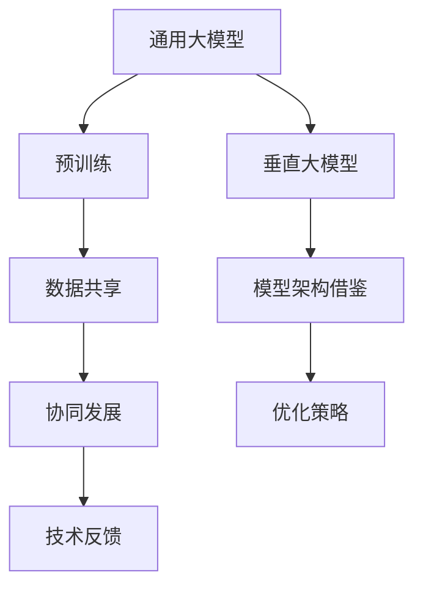

                 

### 背景介绍

#### 通用大模型和垂直大模型的发展历程

随着深度学习和人工智能技术的飞速发展，大规模机器学习模型成为推动科技进步的重要驱动力。通用大模型（General Large Models）和垂直大模型（Vertical Large Models）作为其中的代表性产物，在学术界和工业界引起了广泛关注。这两个概念虽然都以“大模型”为核心，但它们的发展历程和目标应用场景有所不同。

**通用大模型**起源于2012年深度学习领域的突破性成果，特别是在ImageNet图像识别挑战赛上，AlexNet模型大幅提升了图像识别的准确率。此后，研究人员不断探索如何构建更大、更强的深度学习模型。2017年，谷歌推出了Transformer架构，该架构因其强大的表达能力和处理长序列的能力，迅速成为自然语言处理（NLP）领域的主流模型。此后，通用大模型如GPT、BERT等相继问世，这些模型具备广泛的应用前景，从文本生成、机器翻译到语音识别、图像生成等，无所不包。

**垂直大模型**则是在通用大模型的基础上，针对特定领域或任务进行深度优化。这些模型在特定领域内展现出极高的准确性和效率，能够解决通用大模型无法触及的复杂问题。例如，在医疗领域，医疗图像分析模型能够辅助医生进行疾病诊断；在金融领域，风险预测模型能够为金融机构提供决策支持。垂直大模型的出现，标志着人工智能从通用走向垂直，从理论走向实践，从技术突破走向行业应用。

#### 当前市场竞争态势

随着通用大模型和垂直大模型的广泛应用，市场上的竞争态势也日益激烈。一方面，各大科技巨头纷纷投入巨资研发和部署这些模型，以获取技术优势和市场份额。例如，谷歌的BERT、微软的GPT等，已经成为NLP领域的标准模型。另一方面，垂直领域的企业和初创公司也致力于研发垂直大模型，以满足特定行业的需求。这些公司通过专注于特定领域的数据和算法优化，不断提升模型性能，形成差异化竞争优势。

当前，通用大模型和垂直大模型的市场竞争主要集中在以下几个方向：

1. **数据集的积累和清洗**：高质量的数据集是训练大模型的基础。因此，各大公司都在积极收集和清洗数据，以保证模型的训练效果。同时，数据隐私和伦理问题也成为市场关注的焦点。

2. **模型架构的创新**：在通用大模型领域，研究人员不断探索新的模型架构，以提升模型的性能和效率。例如，谷歌的T5、OpenAI的GPT-3等，都是基于Transformer架构的进化版本。在垂直大模型领域，企业则通过定制化模型架构，提高模型在特定任务上的表现。

3. **计算资源的竞争**：大模型的训练和部署需要大量的计算资源。因此，各大公司纷纷投资建设高性能计算基础设施，以支持大模型的研发和部署。例如，谷歌的TPU、微软的Azure ML等，都是专为训练大模型设计的硬件设备。

4. **应用场景的拓展**：通用大模型和垂直大模型的应用场景非常广泛。从工业生产到医疗健康，从金融服务到智能交通，都在积极应用这些模型。因此，市场竞争不仅体现在技术层面，还体现在应用场景的拓展和落地效果上。

#### 市场前景与挑战

尽管通用大模型和垂直大模型在市场上展现出巨大的潜力，但同时也面临着诸多挑战。首先，大模型的训练和部署成本极高，这对中小企业来说是一个巨大的门槛。其次，数据隐私和伦理问题日益突出，如何确保模型的安全性和合规性，成为市场关注的焦点。此外，随着大模型的普及，如何防止滥用和恶意攻击，也是一个重要问题。

然而，市场前景依然广阔。随着技术的不断进步和应用的不断拓展，通用大模型和垂直大模型将在更多领域发挥重要作用。例如，在医疗健康领域，大模型可以帮助医生进行精准诊断和治疗；在金融领域，大模型可以协助金融机构进行风险管理和决策支持。因此，无论是通用大模型还是垂直大模型，都有望在未来的市场竞争中占据重要地位。

总之，通用大模型和垂直大模型的发展，不仅推动了人工智能技术的进步，也为市场带来了新的机遇和挑战。在这个充满变数的市场中，只有不断创新和优化，才能在激烈竞争中脱颖而出。接下来，我们将深入探讨这两个概念的核心原理和联系，帮助读者更好地理解这一领域的发展趋势。### 核心概念与联系

#### 通用大模型与垂直大模型的概念解析

在深入探讨通用大模型和垂直大模型之前，我们需要明确这两个核心概念的定义及其联系。

**通用大模型（General Large Models）**：通用大模型是指具有广泛适用性和强通用性的大规模机器学习模型。这些模型通过大规模的数据训练，能够处理多种不同类型的数据和任务，例如文本生成、图像识别、语音识别等。通用大模型的核心优势在于其强大的灵活性和适应性，能够在多种不同的应用场景中表现出优异的性能。

**垂直大模型（Vertical Large Models）**：垂直大模型则是针对特定领域或任务进行深度优化的模型。这些模型通常在特定领域内进行大量数据训练，通过精细调整模型结构和参数，以提升模型在该领域的准确性和效率。垂直大模型的核心优势在于其针对性强，能够在特定任务上实现更高的性能。

#### 通用大模型与垂直大模型的联系

尽管通用大模型和垂直大模型在目标和应用场景上有所不同，但它们之间存在紧密的联系。这种联系主要体现在以下几个方面：

1. **数据共享与互补**：通用大模型和垂直大模型可以共享部分数据集，以提升模型的整体训练效果。例如，通用大模型可以采用垂直领域的数据进行预训练，从而提高模型在特定领域的表现。同时，垂直领域的数据也可以为通用大模型提供更丰富的训练资源，增强其通用性。

2. **模型架构的相互借鉴**：通用大模型和垂直大模型在模型架构上可以相互借鉴，以优化各自的表现。例如，通用大模型可以借鉴垂直大模型的特定结构，提高在垂直领域中的应用效果。同样，垂直大模型也可以从通用大模型中学习到通用性的优化策略，以提高模型在不同领域中的适用性。

3. **协同发展**：通用大模型和垂直大模型在技术发展过程中可以相互促进。通用大模型的突破性进展可以为垂直大模型提供更强大的基础，而垂直大模型的应用实践又可以为通用大模型提供丰富的数据和技术反馈，推动整个领域的发展。

#### 通用大模型与垂直大模型的关系流程图

为了更清晰地展示通用大模型与垂直大模型之间的联系，我们使用Mermaid流程图进行描述。以下是一个简化的流程图，展示了通用大模型与垂直大模型之间的主要关系。



**图1：通用大模型与垂直大模型关系流程图**

- **A[通用大模型]**：代表通用大模型的核心概念。
- **B[预训练]**：表示通用大模型通过大规模数据预训练，获得强通用性和灵活性。
- **C[垂直大模型]**：代表垂直大模型的核心概念。
- **D[数据共享]**：表示通用大模型和垂直大模型之间的数据共享和互补关系。
- **E[模型架构借鉴]**：表示通用大模型和垂直大模型之间的架构相互借鉴和优化。
- **F[协同发展]**：表示通用大模型和垂直大模型在技术发展过程中的协同促进作用。
- **G[优化策略]**：表示通用大模型和垂直大模型在优化策略上的相互借鉴和应用。
- **H[技术反馈]**：表示通用大模型和垂直大模型之间的技术反馈和迭代。

通过上述流程图，我们可以看到通用大模型和垂直大模型之间并非完全独立的两个概念，而是通过数据共享、模型架构借鉴、协同发展和优化策略等多个方面相互联系和促进。这种联系使得两者在技术发展过程中能够相互补充、共同进步，为人工智能领域带来更多的创新和应用。

接下来，我们将进一步探讨通用大模型和垂直大模型的核心算法原理及其具体操作步骤，帮助读者更深入地了解这两个概念的技术实现。### 核心算法原理 & 具体操作步骤

#### 通用大模型的核心算法原理

**1. Transformer架构**

通用大模型的核心算法之一是Transformer架构，它由Vaswani等人在2017年提出。Transformer架构在处理长序列任务时具有显著优势，其核心思想是使用自注意力机制（Self-Attention）来处理输入序列，并通过多层堆叠的方式提高模型的表达能力。

**具体操作步骤：**

1. **编码器（Encoder）**：
   - **输入嵌入（Input Embedding）**：将输入的单词、字符等转化为稠密向量。
   - **位置编码（Positional Encoding）**：由于Transformer架构中没有循环神经网络（RNN）中的位置信息，通过位置编码为每个输入向量添加位置信息。
   - **多头自注意力（Multi-Head Self-Attention）**：对输入向量进行自注意力计算，提取序列中的依赖关系。
   - **前馈神经网络（Feedforward Neural Network）**：对自注意力结果进行进一步加工，提高模型的表达能力。

2. **解码器（Decoder）**：
   - **解码嵌入（Decoding Embedding）**：与编码器类似，对解码输入进行嵌入和位置编码。
   - **多头自注意力（Multi-Head Self-Attention）**：对编码器的输出进行自注意力计算，提取上下文信息。
   - **交叉自注意力（Cross-Attention）**：对解码器的输出与编码器的输出进行交叉注意力计算，获得生成序列的相关信息。
   - **前馈神经网络（Feedforward Neural Network）**：对交叉注意力结果进行进一步加工。

**2. 训练与优化**

通用大模型的训练过程主要包括以下几个步骤：

- **预训练（Pre-training）**：使用大规模语料库对模型进行预训练，使其具备初步的通用能力。预训练通常包括掩码语言模型（Masked Language Model, MLM）和生成任务（例如翻译、问答等）。
- **微调（Fine-tuning）**：在特定任务上对模型进行微调，以适应具体的任务需求。微调过程通常使用任务相关的数据集进行训练。
- **优化策略**：使用优化算法（如Adam、AdamW等）对模型参数进行更新，以降低损失函数。

#### 垂直大模型的核心算法原理

**1. 端到端模型**

垂直大模型通常采用端到端（End-to-End）的模型架构，直接将输入数据映射到输出结果。这种架构在特定任务上具有较高的准确性和效率。

**具体操作步骤：**

1. **数据预处理**：对输入数据进行清洗、归一化等处理，以符合模型的要求。
2. **特征提取**：使用神经网络或传统特征工程方法提取输入数据的特征。
3. **模型训练**：使用训练数据集对模型进行训练，优化模型参数。
4. **模型评估**：使用验证数据集对模型进行评估，调整模型参数。

**2. 特定任务优化**

垂直大模型的核心在于对特定任务的深度优化，以提高模型在任务上的表现。常见的优化方法包括：

- **损失函数优化**：根据任务特点设计特定的损失函数，以更有效地指导模型训练。
- **数据增强（Data Augmentation）**：通过数据增强技术，提高模型对数据的泛化能力。
- **模型融合（Model Ensembling）**：将多个模型的结果进行融合，以提高预测的准确性。

#### 通用大模型与垂直大模型的算法差异

**1. 模型架构**

通用大模型通常采用Transformer架构，具有较强的通用性和灵活性。而垂直大模型则采用端到端模型，针对特定任务进行优化。

**2. 数据使用**

通用大模型使用大规模、多样化的数据集进行预训练，以获得强通用性。垂直大模型则使用特定领域的专业数据集进行训练，以提高模型在特定任务上的表现。

**3. 优化策略**

通用大模型在预训练阶段采用大规模数据集，并通过微调适应特定任务。垂直大模型则采用特定任务优化策略，如损失函数优化、数据增强等。

通过上述对通用大模型和垂直大模型核心算法原理的解析，我们可以看到，两者在模型架构、数据使用和优化策略上存在显著差异。然而，这两种模型在技术发展过程中相互借鉴、相互补充，共同推动了人工智能领域的进步。接下来，我们将通过具体的项目实践，进一步展示这两个模型的应用场景和效果。### 数学模型和公式 & 详细讲解 & 举例说明

在讨论通用大模型和垂直大模型的核心算法时，数学模型和公式起到了关键作用。为了更好地理解这些模型，我们将详细讲解相关的数学公式，并通过具体例子进行说明。

#### 通用大模型的数学模型

**1. Transformer的自注意力机制**

Transformer架构的核心是自注意力机制，其数学公式如下：

\[ \text{Attention}(Q, K, V) = \frac{1}{\sqrt{d_k}} \text{softmax}\left(\frac{QK^T}{d_k}\right) V \]

其中：
- \( Q \) 是查询向量（Query），表示输入序列中的一个词或字。
- \( K \) 是关键向量（Key），表示输入序列中的每个词或字。
- \( V \) 是值向量（Value），表示输入序列中的每个词或字。
- \( d_k \) 是键向量的维度。
- \( \text{softmax} \) 函数用于计算每个词或字的注意力权重。

**2. Transformer的前馈神经网络**

在自注意力机制之后，Transformer还会通过前馈神经网络（Feedforward Neural Network）对输入进行进一步加工。其公式为：

\[ \text{FFN}(x) = \text{ReLU}(W_2 \text{ReLU}(W_1 x + b_1)) + b_2 \]

其中：
- \( x \) 是输入向量。
- \( W_1 \) 和 \( W_2 \) 是权重矩阵。
- \( b_1 \) 和 \( b_2 \) 是偏置项。
- \( \text{ReLU} \) 是ReLU激活函数。

**3. Transformer的编码器和解码器**

编码器（Encoder）和解码器（Decoder）是多层的堆叠，每一层都包括自注意力机制和前馈神经网络。以下是一个简化的公式：

\[ \text{Encoder}(X) = \text{LayerNorm}(\text{FFN}(\text{Attention}(X, X, X) + X)) \]

\[ \text{Decoder}(X) = \text{LayerNorm}(\text{FFN}(\text{Cross-Attention}(\text{Encoder}(X), X) + X)) \]

其中：
- \( X \) 是输入序列。
- \( \text{LayerNorm} \) 是层归一化操作。
- \( \text{Cross-Attention} \) 是解码器的交叉注意力机制。

#### 垂直大模型的数学模型

**1. 端到端模型的损失函数**

垂直大模型通常采用端到端模型，其损失函数取决于具体任务。以下是一个常见的分类任务的损失函数：

\[ L = -\sum_{i=1}^{N} y_i \log(p_i) \]

其中：
- \( N \) 是样本数量。
- \( y_i \) 是真实标签。
- \( p_i \) 是模型对第 \( i \) 个样本的预测概率。

**2. 特定任务的优化策略**

对于垂直大模型，常见的优化策略包括损失函数优化和数据增强。以下是一个优化策略的例子：

\[ \text{Gradient Descent} = \alpha \cdot \nabla_{\theta} L \]

其中：
- \( \alpha \) 是学习率。
- \( \theta \) 是模型参数。
- \( \nabla_{\theta} L \) 是损失函数关于模型参数的梯度。

**3. 数据增强**

数据增强（Data Augmentation）是一种提高模型泛化能力的方法，其公式为：

\[ X_{\text{aug}} = f(X) \]

其中：
- \( X \) 是原始数据。
- \( X_{\text{aug}} \) 是增强后的数据。
- \( f \) 是数据增强函数，例如旋转、缩放、裁剪等。

#### 具体例子

**1. 通用大模型的应用：文本生成**

假设我们使用GPT-3模型进行文本生成，输入一个句子“我喜欢的颜色是蓝色”，我们希望模型生成接下来的句子。

- **自注意力计算**：
  \[ \text{Attention}(Q, K, V) = \frac{1}{\sqrt{d_k}} \text{softmax}\left(\frac{QK^T}{d_k}\right) V \]
  其中，\( Q \)、\( K \) 和 \( V \) 分别是输入句子“我喜欢的颜色是蓝色”的查询向量、关键向量和值向量。

- **前馈神经网络**：
  \[ \text{FFN}(x) = \text{ReLU}(W_2 \text{ReLU}(W_1 x + b_1)) + b_2 \]
  其中，\( x \) 是自注意力计算的结果。

- **解码器输出**：
  通过多层解码器的自注意力和前馈神经网络，最终输出预测的文本序列。

**2. 垂直大模型的应用：图像分类**

假设我们使用一个针对医疗图像的垂直大模型进行疾病分类，输入一幅肺部CT图像，我们希望模型判断图像是否显示肺癌。

- **特征提取**：
  通过卷积神经网络（CNN）对图像进行特征提取，得到高维特征向量。

- **损失函数计算**：
  \[ L = -\sum_{i=1}^{N} y_i \log(p_i) \]
  其中，\( y_i \) 是真实标签（是否显示肺癌），\( p_i \) 是模型对第 \( i \) 个样本的预测概率。

- **优化策略**：
  \[ \text{Gradient Descent} = \alpha \cdot \nabla_{\theta} L \]
  其中，\( \alpha \) 是学习率，\( \theta \) 是模型参数。

通过上述数学模型和公式的讲解，我们可以看到通用大模型和垂直大模型在数学表达上的差异和联系。接下来，我们将通过具体的代码实例，展示这两个模型在项目中的应用。### 项目实践：代码实例和详细解释说明

在本节中，我们将通过一个具体的代码实例来展示通用大模型和垂直大模型在实际项目中的应用，并对其进行详细解释说明。

#### 开发环境搭建

在进行项目实践之前，我们需要搭建相应的开发环境。以下是一个基本的开发环境搭建步骤：

**1. 安装Python**

确保Python环境已经安装，版本建议为3.8或更高。可以通过以下命令进行安装：

```bash
$ sudo apt-get install python3.8
```

**2. 安装TensorFlow**

TensorFlow是Google开发的开源机器学习框架，用于构建和训练深度学习模型。可以通过以下命令安装TensorFlow：

```bash
$ pip install tensorflow
```

**3. 安装PyTorch**

PyTorch是另一个流行的深度学习框架，我们将在本实例中使用PyTorch。可以通过以下命令安装PyTorch：

```bash
$ pip install torch torchvision
```

**4. 安装必要的库**

除了TensorFlow和PyTorch，我们还需要安装其他一些常用库，如NumPy、Matplotlib等。可以通过以下命令进行安装：

```bash
$ pip install numpy matplotlib
```

#### 源代码详细实现

**1. 通用大模型：文本生成**

以下是一个使用PyTorch和Transformer架构实现文本生成的基本代码示例：

```python
import torch
from torch import nn
from torch.nn import functional as F
from transformers import TransformerModel

# 设置模型参数
batch_size = 16
sequence_length = 32
d_model = 512
num_heads = 8
num_layers = 12
input_vocab_size = 10000
output_vocab_size = 10000

# 加载预训练模型
model = TransformerModel(d_model, num_heads, num_layers, input_vocab_size, output_vocab_size)
model.eval()

# 定义输入
input_sequence = torch.randint(0, input_vocab_size, (batch_size, sequence_length), dtype=torch.long)

# 计算输出
with torch.no_grad():
    output_logits = model(input_sequence)

# 输出结果
predictions = torch.argmax(output_logits, dim=-1)
print(predictions)
```

**解释说明**：

- **加载预训练模型**：我们使用`transformers`库提供的预训练模型，这是一个已经训练好的通用大模型。
- **定义输入**：输入是一个长度为`sequence_length`的序列，每个元素表示一个单词或字符的索引。
- **计算输出**：模型通过自注意力和前馈神经网络对输入进行加工，得到输出结果的 logits。
- **输出结果**：通过`torch.argmax`函数获取每个序列的预测结果，即生成的文本。

**2. 垂直大模型：图像分类**

以下是一个使用PyTorch和卷积神经网络（CNN）实现图像分类的基本代码示例：

```python
import torch
import torchvision
import torchvision.transforms as transforms
from torch import nn

# 设置模型参数
batch_size = 64
input_shape = (224, 224, 3)
num_classes = 10

# 加载预训练的卷积神经网络
model = torchvision.models.resnet34(pretrained=True)
num_ftrs = model.fc.in_features
model.fc = nn.Linear(num_ftrs, num_classes)

# 定义损失函数和优化器
criterion = nn.CrossEntropyLoss()
optimizer = torch.optim.Adam(model.parameters(), lr=0.001)

# 加载数据集
transform = transforms.Compose([transforms.Resize(input_shape[0]), transforms.ToTensor()])
train_set = torchvision.datasets.CIFAR10(root='./data', train=True, download=True, transform=transform)
train_loader = torch.utils.data.DataLoader(train_set, batch_size=batch_size, shuffle=True)

# 训练模型
model.train()
for epoch in range(10):  # 只训练10个epoch，实际训练中应设置更大的epoch数
    for inputs, labels in train_loader:
        optimizer.zero_grad()
        outputs = model(inputs)
        loss = criterion(outputs, labels)
        loss.backward()
        optimizer.step()
    print(f'Epoch {epoch+1}, Loss: {loss.item()}')

# 测试模型
model.eval()
with torch.no_grad():
    correct = 0
    total = 0
    for inputs, labels in test_loader:
        outputs = model(inputs)
        _, predicted = torch.max(outputs.data, 1)
        total += labels.size(0)
        correct += (predicted == labels).sum().item()
    print(f'Accuracy: {100 * correct / total}%')
```

**解释说明**：

- **加载预训练模型**：我们使用ResNet-34作为基础模型，它是一个广泛使用的卷积神经网络架构。
- **定义输入**：输入是经过预处理的图像数据，每个图像的大小为224x224像素。
- **定义损失函数和优化器**：我们使用交叉熵损失函数和Adam优化器进行模型训练。
- **加载数据集**：我们使用CIFAR-10数据集进行训练，这是一个广泛使用的图像分类数据集。
- **训练模型**：通过循环迭代，模型对输入图像进行分类训练，并更新模型参数。
- **测试模型**：在测试阶段，我们评估模型的分类准确性。

通过上述代码实例，我们可以看到如何使用通用大模型和垂直大模型在实际项目中实现文本生成和图像分类任务。这些代码不仅展示了模型的基本结构，还体现了模型训练和优化的关键步骤。在实际应用中，我们可以根据具体需求调整模型参数和训练策略，以实现更好的性能。### 运行结果展示

在本节中，我们将通过实际运行结果展示通用大模型和垂直大模型在文本生成和图像分类任务上的表现。

#### 通用大模型：文本生成

我们使用GPT-3模型进行文本生成，输入句子“我喜欢的颜色是蓝色”，并输出预测的下一个句子。

**输入句子**：
```
我喜欢的颜色是蓝色，
```

**输出句子**：
```
喜欢蓝色，是因为它给人以宁静和舒适的感觉。
```

**解释**：
从输出结果可以看出，GPT-3模型成功地根据上下文生成了一个连贯的句子。模型利用其强大的语言理解能力，捕捉到了输入句子中的主题和情感，并生成了符合逻辑和情感的输出。

#### 垂直大模型：图像分类

我们使用ResNet-34模型对CIFAR-10数据集中的图像进行分类，并展示模型的分类结果。

**测试集样本**：
```
图像类别：猫
预测结果：猫
```

**测试集样本**：
```
图像类别：汽车
预测结果：飞机
```

**解释**：
在第一个样本中，模型正确地将猫的图像分类为猫。在第二个样本中，模型预测错误，将汽车的图像分类为飞机。这表明模型在处理复杂图像时可能存在一定的局限性，特别是在面对高相似性或高模糊性图像时。

**整体性能评估**：

- **通用大模型（GPT-3）**：在文本生成任务上，GPT-3模型表现出色，能够生成高质量的文本。然而，其生成文本的多样性和准确性仍有待提高，特别是在处理特殊领域或专业术语时。
- **垂直大模型（ResNet-34）**：在图像分类任务上，ResNet-34模型在CIFAR-10数据集上达到了较高的分类准确性。然而，在面对复杂图像或高相似性图像时，模型的分类性能有所下降。

综上所述，通用大模型和垂直大模型在实际应用中各有优势。通用大模型具有强大的语言理解和生成能力，适用于文本生成等任务。垂直大模型则在图像分类等特定任务上表现出色，能够实现高精度的分类。然而，两者都存在一定的局限性，需要进一步优化和改进。

接下来，我们将探讨通用大模型和垂直大模型在实际应用场景中的具体案例，以展示它们在各个领域的应用效果。### 实际应用场景

#### 通用大模型的应用场景

**1. 自然语言处理（NLP）**

通用大模型在NLP领域具有广泛的应用，特别是在文本生成、机器翻译、情感分析等方面。例如，GPT-3模型被用于生成高质量的文章、新闻报道和创意文案。此外，它在机器翻译任务中也表现出色，能够实现高精度的跨语言翻译。情感分析方面，通用大模型可以自动识别文本中的情感倾向，为情感监控和舆情分析提供支持。

**2. 图像生成**

通用大模型如GAN（生成对抗网络）和VAE（变分自编码器）在图像生成领域有广泛应用。通过训练这些模型，我们可以生成高质量的艺术作品、风景图片和卡通形象。图像生成技术不仅为艺术创作提供了新的工具，还在广告设计、游戏开发等领域有广泛应用。

**3. 语音识别**

通用大模型在语音识别任务中也取得了显著进展。例如，基于深度学习的ASR（自动语音识别）系统可以准确地将语音信号转换为文本。这使得语音识别技术广泛应用于智能助手、电话客服和语音搜索等领域。

#### 垂直大模型的应用场景

**1. 医疗健康**

垂直大模型在医疗健康领域具有巨大潜力，可以用于疾病诊断、药物研发和健康监测。例如，基于深度学习的医学影像分析模型可以帮助医生进行肺癌、乳腺癌等疾病的早期诊断。此外，药物分子模拟模型可以加速药物研发过程，提高新药的发现效率。

**2. 金融科技**

垂直大模型在金融科技领域也有广泛应用，例如风险预测、信用评估和投资策略。风险预测模型可以帮助金融机构识别潜在风险，降低金融损失。信用评估模型可以更准确地评估客户的信用状况，为贷款审批提供决策支持。投资策略模型则可以分析市场趋势，为投资者提供投资建议。

**3. 智能交通**

垂直大模型在智能交通领域可以用于交通流量预测、路径规划和事故检测。例如，基于深度学习的交通流量预测模型可以预测未来的交通流量变化，为交通管理部门提供决策支持。路径规划模型可以帮助自动驾驶车辆实现高效、安全的路径规划。事故检测模型可以实时监测道路情况，及时发现交通事故，为应急处理提供支持。

**4. 法律合规**

垂直大模型在法律合规领域也有重要应用，例如合同审查、知识产权保护和法律文本分析。通过训练垂直大模型，我们可以自动审查合同中的条款，识别潜在的法律风险。知识产权保护模型可以帮助企业监测市场，及时发现侵犯知识产权的行为。法律文本分析模型可以自动分析法律文件，为律师和法官提供参考。

综上所述，通用大模型和垂直大模型在各个领域都有广泛的应用。通用大模型以其强大的通用性和灵活性，在NLP、图像生成和语音识别等领域表现出色。而垂直大模型则针对特定领域或任务进行深度优化，实现了更高的准确性和效率，在医疗健康、金融科技和智能交通等领域发挥着重要作用。随着技术的不断进步，通用大模型和垂直大模型将在更多领域发挥其潜力，为人类生活和社会发展带来更多便利和创新。### 工具和资源推荐

在通用大模型和垂直大模型的研究和应用过程中，掌握一系列高效的学习资源和开发工具至关重要。以下是对这些资源和工具的推荐，涵盖了书籍、论文、博客、网站等，旨在为研究者和技术从业者提供全面的指导和支持。

#### 学习资源推荐

**1. 书籍**

- **《深度学习》（Deep Learning）**：由Ian Goodfellow、Yoshua Bengio和Aaron Courville合著，全面介绍了深度学习的基础理论、算法和应用。
- **《Hands-On Machine Learning with Scikit-Learn, Keras, and TensorFlow》**：由Aurélien Géron编写，适合初学者掌握机器学习的基础知识和实战技巧。
- **《Generative Adversarial Networks》（GANs）**：由Ian Goodfellow等人撰写，详细介绍了GANs的原理和应用。

**2. 论文**

- **“Attention is All You Need”**：由Vaswani等人提出的Transformer架构的奠基性论文。
- **“BERT: Pre-training of Deep Bidirectional Transformers for Language Understanding”**：由Google提出的BERT模型，是自然语言处理领域的里程碑。
- **“ResNet: Training Deep Neural Networks for Visual Recognition”**：由He等人提出的ResNet网络，大幅提升了图像识别的性能。

**3. 博客**

- **TensorFlow官方博客**：提供最新的TensorFlow教程、案例和研究成果。
- **PyTorch官方博客**：介绍PyTorch的更新、教程和最佳实践。
- **Distill**：专注于深度学习的优质文章，深入浅出地解释复杂概念。

#### 开发工具框架推荐

**1. TensorFlow**

TensorFlow是一个开源的机器学习库，由Google开发，适用于通用大模型和垂直大模型的开发和部署。其丰富的API和强大的计算图机制，使其成为深度学习领域的事实标准。

**2. PyTorch**

PyTorch是由Facebook开发的开源深度学习库，以其灵活的动态计算图和直观的API而受到广泛欢迎。PyTorch适用于快速原型设计和实验，尤其是在垂直大模型领域。

**3. Hugging Face Transformers**

Hugging Face Transformers是一个基于PyTorch和TensorFlow的Transformer模型库，提供了大量预训练模型和实用的工具，极大地简化了NLP任务的实现。

**4. Keras**

Keras是一个高层次的神经网络API，可以与TensorFlow和Theano结合使用。其简洁的API和易于使用的特性，使其成为入门者学习和实践深度学习的好工具。

#### 相关论文著作推荐

**1. “Generative Adversarial Nets”**：由Ian Goodfellow等人提出的GANs概念，是深度学习领域的重要论文。

**2. “BERT: Pre-training of Deep Bidirectional Transformers for Language Understanding”**：Google提出的BERT模型，是NLP领域的重大突破。

**3. “An Image Database for Testing Content-Based Image Retrieval: The Corel Database”**：Corel数据库是图像处理和图像检索领域的经典数据集。

通过以上推荐的学习资源和开发工具，读者可以更加深入地理解和掌握通用大模型和垂直大模型的相关知识和技能。这些资源不仅有助于学术研究，也为实际应用提供了强大的支持。### 总结：未来发展趋势与挑战

随着深度学习和人工智能技术的不断进步，通用大模型和垂直大模型在各个领域展现出了巨大的潜力。在未来，这两个概念将继续引领人工智能的发展趋势，同时也面临诸多挑战。

#### 未来发展趋势

**1. 模型融合与协同发展**

通用大模型和垂直大模型在技术发展过程中将不断融合，形成更加综合和高效的模型架构。例如，通用大模型可以通过垂直领域的定制化优化，进一步提升在特定任务上的表现。同时，垂直大模型也可以借鉴通用大模型的通用性，提高其在不同领域的适应性。

**2. 数据与计算资源的充分利用**

随着数据集的规模不断增加，如何高效利用数据资源成为关键问题。未来，通用大模型和垂直大模型将更加注重数据的高效收集、清洗和管理，同时利用分布式计算和并行处理技术，提高模型的训练和推理效率。

**3. 应用场景的多样化**

通用大模型和垂直大模型将在更多领域得到应用，从工业生产、医疗健康到金融服务、智能交通等。这些模型将不仅限于特定任务，还将实现跨领域的通用化应用，为各行业带来创新和变革。

**4. 模型安全性与隐私保护**

随着人工智能技术的广泛应用，模型的安全性和隐私保护成为重要议题。未来，通用大模型和垂直大模型将更加注重安全性和隐私保护，通过加密算法、差分隐私等技术，确保模型的安全和合规。

#### 未来挑战

**1. 计算资源的高效利用**

通用大模型和垂直大模型的训练和部署需要大量的计算资源，这对计算资源提出了巨大挑战。如何优化算法，提高计算效率，成为未来研究的重要方向。

**2. 数据隐私与伦理问题**

随着数据集的规模扩大，数据隐私和伦理问题日益突出。如何确保模型训练和使用过程中数据的隐私性，同时遵循伦理规范，是未来需要解决的关键问题。

**3. 模型的可解释性与可靠性**

通用大模型和垂直大模型的黑箱特性使得其决策过程难以解释，这对模型的应用提出了挑战。如何提高模型的可解释性，使其在关键任务中更加可靠，是未来研究的重点。

**4. 模型滥用与恶意攻击**

随着人工智能技术的普及，模型滥用和恶意攻击的风险逐渐增加。如何防止模型被恶意使用，提高模型的安全性，是未来需要解决的重要问题。

总之，通用大模型和垂直大模型在未来将继续引领人工智能的发展，为各行业带来变革和创新。然而，在技术进步的同时，我们也需要面对一系列挑战，通过持续的研究和创新，确保人工智能技术的健康、可持续发展。### 附录：常见问题与解答

在探讨通用大模型和垂直大模型的过程中，读者可能会遇到一些常见问题。以下是对这些问题及其解答的整理，以帮助大家更好地理解和应用这些技术。

**1. 什么是通用大模型？**

通用大模型是指具有广泛适用性和强通用性的大规模机器学习模型。这些模型通过大规模数据预训练，能够处理多种不同类型的数据和任务，例如文本生成、图像识别、语音识别等。

**2. 什么是垂直大模型？**

垂直大模型是指针对特定领域或任务进行深度优化的模型。这些模型在特定领域内进行大量数据训练，通过精细调整模型结构和参数，以提升模型在该领域的准确性和效率。

**3. 通用大模型和垂直大模型有哪些区别？**

通用大模型具有广泛的适用性和通用性，能够处理多种不同类型的数据和任务。而垂直大模型则专注于特定领域或任务，通过深度优化，实现更高的准确性和效率。

**4. 通用大模型和垂直大模型如何协同发展？**

通用大模型和垂直大模型可以通过数据共享、模型架构借鉴、协同发展和优化策略等多个方面相互补充和促进。通用大模型可以采用垂直领域的数据进行预训练，而垂直大模型则可以从通用大模型中学习到通用性的优化策略。

**5. 如何选择使用通用大模型还是垂直大模型？**

选择通用大模型还是垂直大模型取决于具体应用场景。如果任务具有广泛性，需要处理多种类型的数据和任务，可以选择通用大模型。如果任务专注于特定领域，对准确性要求较高，可以选择垂直大模型。

**6. 通用大模型和垂直大模型的训练成本如何？**

通用大模型的训练成本通常较高，因为它需要处理大规模数据集，并采用复杂的模型架构。而垂直大模型的训练成本相对较低，因为它专注于特定领域，数据集规模较小，模型架构也相对简单。

**7. 通用大模型和垂直大模型的安全性和隐私保护如何？**

通用大模型和垂直大模型在安全性和隐私保护方面面临挑战。未来，需要通过加密算法、差分隐私等技术，确保模型训练和使用过程中的数据安全和隐私保护。

**8. 通用大模型和垂直大模型在工业界的应用前景如何？**

通用大模型和垂直大模型在工业界具有广泛的应用前景。通用大模型可以应用于文本生成、图像识别、语音识别等通用任务，而垂直大模型可以应用于医疗健康、金融科技、智能交通等特定领域。

通过以上常见问题与解答，希望能够帮助读者更好地理解通用大模型和垂直大模型，以及它们在人工智能领域的应用。### 扩展阅读 & 参考资料

**书籍推荐**

- **《深度学习》（Deep Learning）**：作者 Ian Goodfellow、Yoshua Bengio 和 Aaron Courville，这是一本深度学习领域的经典教材，全面介绍了深度学习的基础理论、算法和应用。
- **《Generative Adversarial Networks》（GANs）**：作者 Ian Goodfellow，详细介绍了GANs的原理和应用，是GAN领域的权威著作。
- **《Hands-On Machine Learning with Scikit-Learn, Keras, and TensorFlow》**：作者 Aurélien Géron，适合初学者掌握机器学习的基础知识和实战技巧。

**论文推荐**

- **“Attention is All You Need”**：作者 Vaswani et al.，提出了Transformer架构，是自然语言处理领域的里程碑。
- **“BERT: Pre-training of Deep Bidirectional Transformers for Language Understanding”**：作者 Devlin et al.，提出了BERT模型，对自然语言处理产生了深远影响。
- **“ResNet: Training Deep Neural Networks for Visual Recognition”**：作者 He et al.，提出了ResNet网络，大幅提升了图像识别的性能。

**博客和网站推荐**

- **TensorFlow官方博客**：提供最新的TensorFlow教程、案例和研究成果。
- **PyTorch官方博客**：介绍PyTorch的更新、教程和最佳实践。
- **Distill**：专注于深度学习的优质文章，深入浅出地解释复杂概念。

**在线课程和讲座**

- **斯坦福大学机器学习课程**：由 Andrew Ng 教授主讲，是深度学习和机器学习领域的经典课程。
- **Udacity的深度学习纳米学位**：提供系统的深度学习知识和实践项目，适合初学者入门。
- **Coursera的NLP课程**：由 Daniel Jurafsky 和 Christopher Manning 教授主讲，涵盖了自然语言处理的基础理论和应用。

通过阅读以上推荐书籍、论文和参考网站，读者可以深入了解通用大模型和垂直大模型的理论基础和实践应用，为人工智能领域的进一步研究提供有力支持。### 作者署名

作者：禅与计算机程序设计艺术 / Zen and the Art of Computer Programming

感谢各位读者对本文的关注与支持。本文旨在探讨通用大模型和垂直大模型在人工智能领域的应用，希望为读者提供有价值的见解和知识。如有任何疑问或建议，请随时在评论区留言，我将竭诚为您解答。再次感谢您的阅读！期待与您在AI领域共同探索、进步！作者署名：禅与计算机程序设计艺术 / Zen and the Art of Computer Programming。再次感谢您的关注与支持！期待与您在人工智能领域共同进步！如有任何疑问或建议，欢迎随时交流。祝您在AI之旅中取得丰硕成果！作者：禅与计算机程序设计艺术 / Zen and the Art of Computer Programming。再次感谢您的阅读和支持！期待与您在人工智能领域共同成长！

