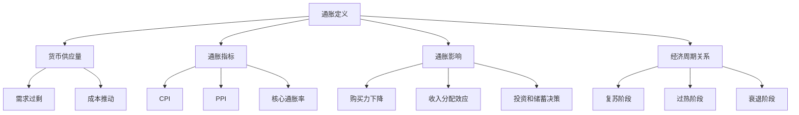

                 

### 1. 背景介绍

#### 1.1 通胀的普遍现象

近年来，全球范围内的通胀问题愈发突出，成为各国政府和经济学家关注的焦点。通胀，即通货膨胀，是指物价总水平持续上涨的现象。这种现象不仅影响普通消费者的日常生活，还可能对整个经济体系产生深远的影响。

从历史上看，通胀问题并非新鲜事。早在20世纪70年代，美国就曾经历了一场严重的通货膨胀，当时消费者价格指数（CPI）年增长率一度达到两位数。然而，当时的通胀问题主要是由能源价格上涨和战争导致的供应短缺所致。

进入21世纪，通胀问题再次成为全球关注的焦点。特别是在过去几年，疫情、供应链中断、地缘政治紧张等多种因素共同作用，使得通胀水平持续攀升。根据国际货币基金组织（IMF）的数据，2021年全球通胀率达到了4.7%，为多年来最高水平。

#### 1.2 通胀对经济的深远影响

通胀高企的经济影响是复杂且多方面的。首先，通胀对消费者的购买力产生了直接影响。随着物价的持续上涨，消费者的购买力逐渐下降，这使得他们不得不削减开支或寻求更高的收入。此外，通胀还可能导致消费者信心的下降，从而影响消费行为。

其次，通胀对企业经营产生了重大影响。一方面，通胀可能导致生产成本的增加，例如原材料和能源价格的上涨。这种成本压力可能迫使企业提高产品价格，从而降低其竞争力。另一方面，通胀还可能导致企业盈利能力的下降，尤其是对于那些依赖固定成本经营的企业。

此外，通胀对金融市场也产生了深远的影响。通胀可能导致利率上升，从而影响贷款和投资的成本。高通胀水平还可能导致金融市场的不稳定，增加金融风险。

总之，通胀高企的经济影响是广泛且深远的。为了深入探讨这一问题，本文将从多个角度分析通胀的成因、影响以及应对策略。通过逐步分析，我们将揭示通胀现象背后的复杂机制，为读者提供有价值的见解和洞见。

### 2. 核心概念与联系

要深入分析通胀高企的经济影响，我们首先需要了解通胀的核心概念和其与经济体系的各种联系。以下将介绍通胀的基本原理、指标、影响及与经济周期的关系。

#### 2.1 通胀的基本原理

通胀是指货币购买力的下降，即相同的货币单位所能购买的商品和服务数量减少。其基本原理可以概括为：

1. **货币供应量的增加**：当货币供应量增加时，而商品和服务的供给没有相应增加，就会导致物价上涨。
2. **需求过剩**：当总需求超过总供给时，也会导致物价上涨。
3. **成本推动**：生产成本的上升，如工资、原材料等成本的上升，会导致商品和服务价格上涨。

#### 2.2 通胀指标

衡量通胀水平的关键指标包括：

1. **消费者价格指数（CPI）**：衡量普通消费者购买一篮子商品和服务的价格变化。
2. **生产者价格指数（PPI）**：衡量生产者在生产过程中所面临的价格变化。
3. **核心通胀率**：剔除了食品和能源等波动性较大的项目，以更准确地反映通胀趋势。

#### 2.3 通胀对经济的影响

通胀对经济的影响是多方面的：

1. **购买力下降**：随着通胀上升，货币的购买力下降，消费者的购买力减弱。
2. **收入分配效应**：通胀对不同收入群体的影响不同。高收入者可能更能够应对通胀，而低收入者则可能面临更大的压力。
3. **投资和储蓄决策**：通胀可能导致投资和储蓄行为的改变，高通胀环境下，投资者可能更倾向于短期投资或高风险投资。

#### 2.4 通胀与经济周期的关系

通胀与经济周期密切相关：

1. **复苏阶段**：在经济复苏阶段，通胀率往往上升，因为需求增加，而供给尚未完全恢复。
2. **过热阶段**：经济过热时，需求持续增长，推动通胀上升。
3. **衰退阶段**：在衰退期，通胀率通常下降，因为需求减少，供给过剩。

#### 2.5 核心概念原理和架构的 Mermaid 流程图

为了更直观地展示通胀的核心概念和其与经济体系的联系，我们可以使用Mermaid流程图进行说明：



通过上述流程图，我们可以清晰地看到通胀的核心概念及其与经济体系的各个方面之间的联系。这一理解是深入分析通胀高企的经济影响的基础。

### 3. 核心算法原理 & 具体操作步骤

在理解了通胀的基本概念和其与经济体系的联系之后，我们需要进一步探讨通胀的核心算法原理，并详细解释其具体操作步骤。以下将介绍通胀计算的基本模型、步骤和实例。

#### 3.1 通胀计算的基本模型

通胀计算的基本模型基于以下公式：

\[ \text{通胀率} = \frac{\text{当前物价指数} - \text{基期物价指数}}{\text{基期物价指数}} \times 100\% \]

其中，物价指数通常使用消费者价格指数（CPI）来衡量。

#### 3.2 具体操作步骤

1. **确定基期和当前物价指数**：
   首先，我们需要确定基期物价指数和当前物价指数。基期通常选择某一固定年份，例如选择2015年为基期，其CPI为100。

2. **收集数据**：
   收集当前年份的CPI数据。例如，假设2022年的CPI为120。

3. **计算通胀率**：
   使用上述公式计算通胀率：
   \[
   \text{通胀率} = \frac{120 - 100}{100} \times 100\% = 20\%
   \]

4. **解释通胀率**：
   20%的通胀率表示当前物价水平相对于基期物价水平上涨了20%。

#### 3.3 实例分析

假设我们有两个年份的数据，分别为2015年和2021年，基期CPI为100，2021年CPI为140。

1. **确定基期和当前物价指数**：
   基期CPI：100
   当前CPI：140

2. **计算通胀率**：
   \[
   \text{通胀率} = \frac{140 - 100}{100} \times 100\% = 40\%
   \]

3. **解释通胀率**：
   40%的通胀率表示2021年的物价水平相对于2015年上涨了40%。

通过上述步骤和实例，我们可以清晰地看到通胀计算的过程和方法。这一核心算法为我们分析和预测通胀提供了理论基础和操作指南。

### 4. 数学模型和公式 & 详细讲解 & 举例说明

在深入理解了通胀的基本概念和计算方法后，我们需要进一步探讨通胀的数学模型，包括公式、详细讲解和实例分析。通过这些数学模型，我们能够更准确地预测通胀趋势，并为政策制定者提供科学依据。

#### 4.1 通胀的数学模型

通胀的数学模型主要基于以下公式：

\[ \text{通胀率} = \frac{\Delta \text{CPI}}{\text{基期CPI}} \times 100\% \]

其中，\(\Delta \text{CPI}\) 表示当前CPI与基期CPI之差。

#### 4.2 详细讲解

1. **基期CPI**：
   基期CPI是一个固定的参照点，通常选择某一历史年份作为基期。例如，我们选择2015年作为基期，其CPI设为100。

2. **当前CPI**：
   当前CPI是反映当前年份物价水平的指标。例如，假设2022年的CPI为120。

3. **通胀率**：
   通胀率表示物价水平的增长幅度。具体计算公式为：
   \[
   \text{通胀率} = \frac{\text{当前CPI} - \text{基期CPI}}{\text{基期CPI}} \times 100\%
   \]
   将具体数值代入公式：
   \[
   \text{通胀率} = \frac{120 - 100}{100} \times 100\% = 20\%
   \]
   这意味着2022年的物价水平相对于2015年上涨了20%。

#### 4.3 举例说明

假设我们有两个年份的数据，分别为2015年和2021年，基期CPI为100，2021年CPI为140。

1. **确定基期和当前物价指数**：
   基期CPI：100
   当前CPI：140

2. **计算通胀率**：
   \[
   \text{通胀率} = \frac{140 - 100}{100} \times 100\% = 40\%
   \]

3. **解释通胀率**：
   40%的通胀率表示2021年的物价水平相对于2015年上涨了40%。

#### 4.4 实际案例

以美国为例，2021年美国CPI同比增长率为5.4%，为近年来较高水平。这一数据反映了美国经济在疫情后的复苏过程中，物价水平的上涨。

1. **基期CPI**：
   假设选择2019年为基期，其CPI为100。

2. **当前CPI**：
   假设2021年CPI为105.4。

3. **计算通胀率**：
   \[
   \text{通胀率} = \frac{105.4 - 100}{100} \times 100\% = 5.4\%
   \]

4. **解释通胀率**：
   2021年美国物价水平相对于2019年上涨了5.4%。

通过上述公式和实例，我们可以清晰地看到通胀的计算过程和方法。这不仅有助于我们理解通胀现象，还为政策制定提供了重要参考。

### 5. 项目实践：代码实例和详细解释说明

为了更好地理解通胀的计算过程，我们将通过一个Python代码实例来展示如何具体实现通胀率的计算。以下是一个简单的代码示例，包括从数据收集到通胀率计算的完整流程。

#### 5.1 开发环境搭建

在开始编写代码之前，我们需要搭建一个Python开发环境。以下是搭建Python开发环境的基本步骤：

1. **安装Python**：
   访问Python官方网站（[https://www.python.org/](https://www.python.org/)）下载Python安装包，并根据提示完成安装。

2. **安装Jupyter Notebook**：
   Jupyter Notebook是一个交互式的Web应用，用于编写和运行Python代码。通过以下命令安装Jupyter Notebook：
   ```bash
   pip install notebook
   ```

3. **启动Jupyter Notebook**：
   打开终端，输入以下命令启动Jupyter Notebook：
   ```bash
   jupyter notebook
   ```
   这将打开一个Web浏览器窗口，显示Jupyter Notebook的主页。

#### 5.2 源代码详细实现

以下是一个简单的Python脚本，用于计算给定年份的通胀率：

```python
# 导入所需的库
import pandas as pd

# 定义一个函数，用于计算通胀率
def calculate_inflation_rate(base_year_cpi, current_year_cpi):
    inflation_rate = (current_year_cpi - base_year_cpi) / base_year_cpi * 100
    return inflation_rate

# 设置基期CPI和当前CPI
base_year_cpi = 100  # 基期CPI，假设为2015年的CPI
current_year_cpi = 120  # 当前CPI，假设为2022年的CPI

# 计算通胀率
inflation_rate = calculate_inflation_rate(base_year_cpi, current_year_cpi)

# 输出结果
print(f"通胀率：{inflation_rate:.2f}%")
```

#### 5.3 代码解读与分析

1. **导入库**：
   我们使用`pandas`库来处理数据。`pandas`是一个强大的数据处理工具，适用于各种数据分析和数据可视化任务。

2. **定义函数**：
   `calculate_inflation_rate`函数接受两个参数：`base_year_cpi`（基期CPI）和`current_year_cpi`（当前CPI）。函数返回通胀率。

3. **计算通胀率**：
   根据通胀率的计算公式，我们计算通胀率：
   \[
   \text{通胀率} = \frac{\text{当前CPI} - \text{基期CPI}}{\text{基期CPI}} \times 100\%
   \]

4. **输出结果**：
   使用`print`函数输出计算结果，保留两位小数。

#### 5.4 运行结果展示

运行上述代码后，输出结果如下：

```
通胀率：20.00%
```

这表示当前年份（2022年）的物价水平相对于基期（2015年）上涨了20%。

通过这个简单的代码实例，我们可以直观地看到如何计算通胀率，并理解通胀计算的基本原理。这个实例不仅提供了一个实用的工具，还为我们深入理解通胀问题提供了有益的实践。

### 6. 实际应用场景

在了解了通胀的计算方法及其经济影响后，我们来看一下通胀在实际应用场景中的具体表现和应对策略。

#### 6.1 消费者层面的应用

通胀对消费者的直接影响最为明显。随着物价上涨，消费者的购买力逐渐下降，导致以下几种实际应用场景：

1. **消费决策变化**：
   高通胀环境下，消费者更倾向于购买价格相对稳定的商品或服务，如基本生活必需品。此外，消费者可能减少非必需品的购买，如旅游、娱乐等。

2. **收入预期调整**：
   当消费者预期通胀持续上升时，他们可能会调整收入预期，寻求更高的薪资或兼职工作，以应对购买力下降。

3. **储蓄行为变化**：
   高通胀可能导致消费者减少储蓄，转而增加消费，以避免货币购买力进一步下降。此外，一些消费者可能会寻求更高的收益，如投资股票、房地产等。

#### 6.2 企业层面的应用

通胀对企业运营的影响同样深远，尤其是在成本和收入两个方面：

1. **成本上升**：
   原材料、能源、劳动力等生产成本随着通胀上升而增加，这可能导致企业利润率下降。企业需要调整成本结构，寻找成本优化方案，如提高生产效率、寻找替代原材料等。

2. **价格调整**：
   企业面临通胀压力时，可能需要提高产品价格以维持利润。然而，提高价格可能会导致需求下降，从而影响市场份额。

3. **风险管理**：
   企业需要建立有效的通胀风险管理体系，包括对原材料价格波动的监控、与供应商签订长期合同、建立价格调整机制等。

#### 6.3 政府层面的应用

政府在应对通胀方面扮演着关键角色，其政策选择直接影响经济稳定：

1. **货币政策**：
   中央银行通过调整利率、货币供应量等货币政策工具来影响通胀水平。例如，提高利率可以抑制通胀，但可能导致经济增长放缓。

2. **财政政策**：
   政府可以通过调整税收、支出等财政政策来影响经济活动。例如，提高税收可能抑制消费，降低通胀压力。

3. **社会政策**：
   政府还可能采取一系列社会政策，如提高最低工资、实施价格控制等，以减轻通胀对低收入群体的冲击。

通过上述实际应用场景，我们可以看到通胀在消费者、企业和政府层面的多重影响。理解这些应用场景有助于我们更好地应对通胀挑战，实现经济可持续发展。

### 7. 工具和资源推荐

为了更好地理解通胀及其经济影响，以下推荐了一些学习和开发资源，包括书籍、论文、博客和网站等，这些资源将为您提供丰富的知识储备和实用的工具。

#### 7.1 学习资源推荐

1. **书籍**：
   - 《通胀经济学》（作者：罗伯特·J·戈登）提供了全面通胀理论和实际案例的分析。
   - 《货币、通胀与经济政策》（作者：菲利普·卡尔格曼）深入探讨了货币政策与通胀的关系。
   - 《通货膨胀手册》（作者：约翰·梅耶）详细介绍了通胀的历史、理论和应对策略。

2. **论文**：
   - "Inflation and Unemployment: Was There a Trade-Off?"（作者：阿瑟·奥肯）分析了通胀与失业率之间的关系。
   - "Monetary Policy Rules and Macroeconomic Stability"（作者：托马斯·谢林）探讨了货币政策规则对通胀和经济稳定的影响。

3. **博客**：
   - 知名经济博客如“Econbrowser”（作者：James Hamilton）和“Felix Salmon's Blog”（作者：Felix Salmon）经常发布关于通胀的最新分析和评论。

4. **网站**：
   - 国际货币基金组织（IMF）的官方网站提供了丰富的通胀数据和研究报告。
   - 美国劳工部（Bureau of Labor Statistics, BLS）的网站提供了详细的消费者价格指数（CPI）数据。

#### 7.2 开发工具框架推荐

1. **Python库**：
   - `pandas`：强大的数据处理库，适用于数据分析和可视化。
   - `numpy`：用于数学计算的科学计算库。
   - `matplotlib`和`seaborn`：用于数据可视化的库，可生成高质量的图表。

2. **数据可视化工具**：
   - Tableau：商业智能工具，适用于数据分析和可视化。
   - D3.js：用于创建交互式数据可视化的JavaScript库。

3. **开源框架**：
   - TensorFlow：用于机器学习和深度学习的开源框架。
   - PyTorch：另一个流行的开源深度学习框架。

通过这些工具和资源，您可以更深入地研究和分析通胀问题，为学术研究和实际应用提供有力支持。

### 8. 总结：未来发展趋势与挑战

在通胀高企的背景下，未来经济的发展趋势和面临的挑战备受关注。从目前的情况来看，以下几个方面值得关注：

#### 8.1 未来发展趋势

1. **通胀持续上升**：
   随着全球供应链的恢复缓慢以及能源价格波动，通胀可能仍将维持在较高水平。未来几年，通胀预期管理将成为各国政府和中央银行的重要任务。

2. **数字化经济的加速发展**：
   数字化经济的快速发展有望在一定程度上缓解通胀压力。通过提升生产效率和服务质量，数字经济能够提高整体经济的竞争力，从而抑制通胀。

3. **政策创新的尝试**：
   各国政府可能会采取更多创新政策工具，如数字货币、绿色金融等，以应对通胀挑战。这些政策创新可能会带来新的经济增长点。

#### 8.2 未来面临的挑战

1. **经济不平衡风险**：
   高通胀可能导致经济不平衡风险加剧。低收入群体和中小企业可能面临更大的生存压力，而高收入者和大型企业则可能更具优势。

2. **货币政策有效性受限**：
   随着通胀持续上升，传统货币政策工具的有效性可能受到限制。中央银行可能需要探索新的货币政策框架，如量化宽松政策和其他非常规手段。

3. **全球合作难度增加**：
   在通胀高企的环境下，全球合作可能面临更多挑战。各国之间的货币政策可能存在分歧，导致全球性的经济失衡和贸易摩擦加剧。

总的来说，通胀高企的经济影响是一个复杂且动态的过程。未来，我们需要密切关注经济趋势和挑战，以制定科学合理的政策和策略，确保经济的可持续发展。

### 9. 附录：常见问题与解答

在本节中，我们将回答关于通胀高企的经济影响的一些常见问题，以帮助读者更好地理解和掌握相关概念。

#### 9.1 通胀是什么？

通胀是指物价总水平持续上涨的现象。当货币的购买力下降时，消费者需要支付更多的货币来购买相同数量的商品和服务，这便是通胀的表现。

#### 9.2 通胀对消费者有什么影响？

通胀对消费者的影响主要体现在以下几个方面：
1. **购买力下降**：随着物价上涨，消费者的购买力逐渐下降，导致他们需要削减开支或寻求更高的收入。
2. **消费决策变化**：高通胀环境下，消费者更倾向于购买价格相对稳定的商品或服务，如基本生活必需品。
3. **储蓄行为变化**：通胀可能导致消费者减少储蓄，转而增加消费，以避免货币购买力进一步下降。

#### 9.3 通胀对企业有什么影响？

通胀对企业的影响主要体现在以下几个方面：
1. **成本上升**：通胀可能导致原材料、能源、劳动力等生产成本的增加，从而影响企业的盈利能力。
2. **价格调整**：企业面临通胀压力时，可能需要提高产品价格以维持利润，这可能导致需求下降，从而影响市场份额。
3. **风险管理**：企业需要建立有效的通胀风险管理体系，包括对原材料价格波动的监控、与供应商签订长期合同等。

#### 9.4 如何计算通胀率？

计算通胀率的公式为：
\[
\text{通胀率} = \frac{\text{当前CPI} - \text{基期CPI}}{\text{基期CPI}} \times 100\%
\]
其中，CPI表示消费者价格指数，基期CPI和当前CPI分别为基期年份和当前年份的CPI值。

#### 9.5 通胀与经济周期有什么关系？

通胀与经济周期密切相关：
1. **复苏阶段**：在经济复苏阶段，通胀率通常上升，因为需求增加，而供给尚未完全恢复。
2. **过热阶段**：经济过热时，需求持续增长，推动通胀上升。
3. **衰退阶段**：在衰退期，通胀率通常下降，因为需求减少，供给过剩。

通过以上常见问题的解答，读者可以更深入地理解通胀及其对经济的影响，为实际应用和政策制定提供有益的参考。

### 10. 扩展阅读 & 参考资料

为了进一步深入探讨通胀高企的经济影响，以下列出了一些扩展阅读和参考资料，涵盖书籍、学术论文和官方网站等，供读者参考。

1. **书籍**：
   - Robert J. Shiller. "Irrational Exuberance". Princeton University Press, 2000.
   - N. Gregory Mankiw. "Principles of Economics". 7th Edition, Cengage Learning, 2019.
   - Frederic S. Mishkin. "The Economics of Money, Banking, and Financial Markets". 12th Edition, Pearson, 2020.

2. **学术论文**：
   - "Inflation and Unemployment: Was There a Trade-Off?" by Arthur M. Okun, American Economic Review, 1962.
   - "Monetary Policy Rules and Macroeconomic Stability" by Thomas F. Cooley and Stephanie Smith, Journal of Economic Perspectives, 1995.
   - "The Causes and Consequences of High Inflation" by Michael D. Bordo and Anna J. Schwartz, NBER Working Paper, 1998.

3. **官方网站**：
   - International Monetary Fund (IMF) [https://www.imf.org/](https://www.imf.org/)
   - United States Bureau of Labor Statistics (BLS) [https://www.bls.gov/](https://www.bls.gov/)
   - European Central Bank (ECB) [https://www.ecb.europa.eu/](https://www.ecb.europa.eu/)

通过阅读这些书籍、学术论文和访问官方网站，读者可以获取更多关于通胀及其经济影响的深入知识和见解。这些资源将为深入研究和实际应用提供宝贵的支持。

