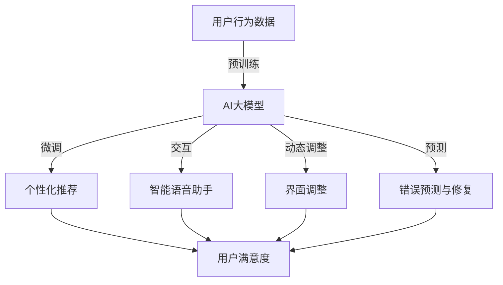

                 

### 1. 背景介绍

#### 人工智能与用户界面设计的历史背景

人工智能（AI）和用户界面设计（UI）的融合可以追溯到计算机科学和认知心理学的交叉点。20世纪50年代，人工智能作为一门学科诞生，其初衷是通过模拟人类智能来实现机器自主决策和问题解决。与此同时，用户界面设计也逐渐兴起，它关注如何使计算机系统更加易用、直观和高效。

早期的用户界面主要以命令行界面（CLI）为主，用户需要通过输入复杂的指令来与计算机互动。这一时期，人工智能的应用主要集中在规则推理和符号计算上，如逻辑推理和专家系统。然而，由于CLI的复杂性，用户与计算机之间的交互效率低下，用户体验较差。

随着图形用户界面（GUI）的出现，用户界面设计开始朝着更加直观和用户友好的方向发展。1980年代，苹果公司推出的Macintosh计算机搭载了第一个图形用户界面，标志着用户界面设计进入了一个新的时代。此后，随着计算机性能的提升和操作系统的改进，GUI逐渐成为主流的用户交互方式。

然而，即使是图形用户界面，也面临一定的局限性。用户仍然需要学习如何操作计算机，并且界面设计需要大量的专业知识和经验。如何进一步提高用户界面的智能性和适应性，成为了人工智能与用户界面设计领域的一个挑战。

#### AI大模型技术的发展

近年来，人工智能领域的一个显著进展是生成式人工智能（Generative AI）的大模型技术，尤其是GPT（Generative Pre-trained Transformer）系列模型的出现。GPT模型基于深度学习，通过大量的数据训练，能够生成高质量的文本、图像、音频等多种类型的内容。

GPT-3模型，作为当前最先进的预训练语言模型，具有1.75万亿个参数，能够进行自然语言处理、代码生成、图像描述等多种任务。其强大的文本生成能力，使得AI能够以更自然、流畅的方式与用户进行交互。这对于用户界面设计来说，是一个巨大的突破。

AI大模型不仅能够理解用户输入的文本，还能够根据上下文生成相应的回复和推荐。这种智能交互能力，使得用户界面变得更加人性化，能够更好地满足用户的个性化需求。同时，AI大模型还可以通过学习用户的行为数据，实现动态的界面优化，提供更加个性化的用户体验。

#### 用户体验的重要性

用户体验（UX）是用户在使用产品过程中所获得的整体感受和体验。一个优秀的用户体验不仅能够提高用户的满意度，还能够增加产品的市场竞争力。随着互联网和移动设备的普及，用户体验的重要性日益凸显。

用户体验涵盖多个方面，包括但不限于用户界面设计、交互流程、性能优化、安全性等。一个良好的用户体验应当是直观、简洁、高效和愉悦的。对于用户界面设计来说，用户体验是衡量其成功与否的重要标准。

用户体验的重要性体现在以下几个方面：

1. **用户留存率**：良好的用户体验能够提高用户的满意度和忠诚度，从而降低用户流失率。
2. **用户转化率**：直观、易懂的界面设计能够降低用户的学习成本，提高用户转化率。
3. **品牌形象**：优秀的用户体验能够提升品牌形象，增加用户对品牌的信任。
4. **市场竞争力**：在竞争激烈的市场中，良好的用户体验能够成为产品的重要差异化因素。

#### AI大模型在用户体验优化中的应用前景

随着AI大模型技术的发展，其在用户界面设计中的潜在应用前景变得十分广阔。通过AI大模型，用户界面设计可以实现以下几个方面的优化：

1. **个性化推荐**：AI大模型能够根据用户的历史行为和偏好，生成个性化的推荐内容，提高用户的满意度。
2. **智能交互**：AI大模型能够实现自然语言处理，提供智能客服、语音助手等功能，提高用户交互的便捷性。
3. **动态界面调整**：AI大模型可以学习用户的行为模式，动态调整界面布局和功能，提供更加个性化的用户体验。
4. **错误预测与修复**：AI大模型可以通过分析用户的行为数据，预测可能出现的问题，并提供相应的解决方案，提高系统的稳定性。
5. **个性化学习**：在教育领域，AI大模型可以根据学生的学习习惯和进度，提供个性化的学习内容和建议，提高学习效率。

总之，AI大模型为用户界面设计带来了全新的可能性，使得用户体验优化变得更加智能和高效。在接下来的章节中，我们将深入探讨AI大模型的工作原理、应用场景以及具体实现方法。

### 2. 核心概念与联系

为了更好地理解AI大模型如何优化用户界面与体验设计，我们需要先掌握几个核心概念：人工智能、用户界面设计、AI大模型以及它们之间的关联。

#### 2.1 人工智能

人工智能（AI）是一门涉及计算机科学、数学、统计学、神经科学等多个领域的交叉学科，其目标是使计算机具备类似人类智能的能力。人工智能可以分为几种类型，包括：

- **弱人工智能**：指在某些特定任务上表现像人类的人工智能，如语音识别、图像识别等。
- **强人工智能**：指具有普遍智能的人工智能，能够在任何任务上表现像人类，目前尚未实现。
- **生成式人工智能**：通过学习大量数据，生成新的文本、图像、音频等内容的AI，如GPT模型。

#### 2.2 用户界面设计

用户界面设计（UI Design）是指设计用户与计算机系统交互的界面。一个好的用户界面应该简洁、直观、高效，使用户能够轻松地完成操作任务。UI设计主要包括以下几个方面：

- **视觉设计**：包括颜色、字体、图标等视觉元素的设计，用于提高界面的美观性和易用性。
- **交互设计**：设计用户与界面之间的交互流程，确保用户能够方便、快捷地使用系统功能。
- **用户体验设计**：关注用户在使用产品过程中的整体感受，包括满意度、易用性、愉悦感等。

#### 2.3 AI大模型

AI大模型，如GPT模型，是指具有大量参数、能够进行复杂任务处理的深度学习模型。这些模型通过在大量数据上预训练，具备强大的特征提取和生成能力。AI大模型的核心技术包括：

- **预训练**：通过在大规模数据集上训练，模型可以自动学习到数据中的模式和规律。
- **微调**：在特定任务上，通过在微调数据集上进一步训练，模型可以优化特定任务的表现。
- **生成式建模**：通过学习输入数据的分布，模型可以生成类似的数据，如图像、文本等。

#### 2.4 AI与UI设计的联系

AI与UI设计的结合，主要体现在以下几个方面：

- **智能交互**：AI大模型可以通过自然语言处理，实现智能语音助手、聊天机器人等功能，提高用户交互的便捷性。
- **个性化推荐**：AI大模型可以根据用户的行为数据，生成个性化的推荐内容，提高用户的满意度。
- **动态界面调整**：AI大模型可以分析用户的行为模式，动态调整界面布局和功能，提供更加个性化的用户体验。
- **错误预测与修复**：AI大模型可以通过分析用户的行为数据，预测可能出现的问题，并提供相应的解决方案，提高系统的稳定性。

#### 2.5 关联的 Mermaid 流程图

为了更好地展示AI大模型与用户界面设计之间的联系，我们使用Mermaid流程图来表示。以下是该流程图：



在这个流程图中，用户行为数据经过预训练，生成AI大模型。该模型通过微调，应用于个性化推荐、智能交互、动态界面调整和错误预测与修复等多个方面，最终提高用户的满意度。

通过理解上述核心概念和联系，我们可以更好地把握AI大模型如何优化用户界面与体验设计。在接下来的章节中，我们将深入探讨AI大模型的算法原理和应用场景。

#### 2.6 AI大模型的架构原理

要理解AI大模型如何优化用户界面与体验设计，首先需要深入探讨其背后的架构原理。AI大模型，特别是基于Transformer架构的模型，如GPT，其核心思想是通过大规模数据预训练和任务特定微调，实现高度智能化的数据处理和生成能力。以下是AI大模型的主要架构原理：

##### 2.6.1 Transformer架构

Transformer模型是由Vaswani等人于2017年提出的一种全新的序列到序列模型，它的核心创新在于自注意力机制（Self-Attention）和多层神经网络结构。Transformer的架构如图1所示：


- **嵌入层**（Embedding Layer）：输入的序列被转换成向量表示，每个词汇或字符通过嵌入层被映射到一个固定大小的向量。
- **自注意力层**（Self-Attention Layer）：这是Transformer模型的核心，通过计算序列中每个词之间的相对重要性，实现全局信息的融合。自注意力机制计算公式如下：
  $$ 
  \text{Attention}(Q, K, V) = \text{softmax}\left(\frac{QK^T}{\sqrt{d_k}}\right)V 
  $$
  其中，$Q$、$K$、$V$分别是查询向量、关键向量、值向量，$d_k$是关键向量的维度。自注意力机制使得模型能够自动学习到序列中词汇之间的关联性。
- **前馈网络**（Feed Forward Layer）：在自注意力层之后，每个头（Head）都通过一个前馈网络，该网络由两个全连接层组成，激活函数通常采用ReLU。
- **层归一化**（Layer Normalization）和**残差连接**（Residual Connection）：为了防止梯度消失和梯度爆炸，每个注意力层前后都添加了层归一化和残差连接。

##### 2.6.2 大模型训练与预训练

大模型（如GPT-3）的训练是一个复杂且耗时的过程，主要分为以下几个阶段：

1. **数据收集**：收集大量高质量的文本数据，如维基百科、新闻文章、对话记录等。
2. **预处理**：对数据进行清洗、去噪和分词等预处理操作，将其转换为模型可处理的格式。
3. **预训练**：在预处理后的数据上，使用Transformer模型进行预训练。预训练过程主要包括两个任务：
   - **掩码语言模型**（Masked Language Model, MLM）：随机遮盖输入文本中的部分词，并要求模型预测这些被遮盖的词。这有助于模型学习单词的上下文关系。
   - **下一句预测**（Next Sentence Prediction, NSP）：输入两个连续的句子，模型需要预测第二个句子是否是第一个句子的下一句。这有助于模型理解句子之间的逻辑关系。

4. **优化**：通过调整模型参数，优化模型在特定任务上的表现。

##### 2.6.3 多层神经网络结构

AI大模型通常由多层神经网络组成，每一层都能够学习到不同层次的特征和关系。这种层次化结构使得模型能够处理复杂的任务和数据。具体来说：

- **自注意力机制**：在每一层，自注意力机制都能够计算序列中每个词之间的相关性，从而实现全局信息的有效融合。
- **前馈网络**：前馈网络在每一层都能够对自注意力层的输出进行进一步的非线性变换，增强模型的表达能力。
- **残差连接和层归一化**：残差连接和层归一化能够缓解梯度消失和梯度爆炸问题，使得模型在训练过程中能够更稳定地收敛。

##### 2.6.4 动态调整与优化

AI大模型的一个重要特点是其能够在不同场景下进行动态调整和优化。通过任务特定的微调和在线学习，模型可以适应不同的用户需求和任务环境。具体包括：

- **微调**：在特定任务上，使用少量目标数据对预训练模型进行进一步训练，优化模型在该任务上的性能。
- **在线学习**：通过不断收集用户交互数据，模型可以持续学习并优化其行为和输出，提供更加个性化的用户体验。

通过以上对AI大模型架构原理的深入分析，我们可以更好地理解其如何通过预训练、层次化结构和动态调整，实现用户界面设计的优化。在下一章中，我们将详细探讨AI大模型在用户界面设计中的具体应用和实现方法。

### 3. 核心算法原理 & 具体操作步骤

#### 3.1 生成式AI大模型原理

生成式AI大模型的核心在于其能够从给定数据中学习到数据分布，并生成类似的数据。GPT（Generative Pre-trained Transformer）是生成式AI大模型的代表之一，它基于Transformer架构，通过预训练和微调实现高质量的文本生成。以下是对GPT核心算法原理的详细解释：

##### 3.1.1 预训练过程

1. **数据收集**：首先，收集大量高质量的文本数据，如维基百科、新闻文章、对话记录等。
2. **数据预处理**：对数据进行清洗、去噪和分词等预处理操作，将其转换为模型可处理的格式。通常，使用WordPiece或BytePiece等算法进行分词，将文本拆分为词或字节级别的token。
3. **创建词汇表**：将所有独特的token汇总，生成词汇表。每个token都会被分配一个唯一的索引。
4. **构建输入序列**：将原始文本序列转换为输入序列，每个token都被替换为词汇表中的索引。同时，添加一些特殊的token，如`<start>`表示序列的开始，`<end>`表示序列的结束。
5. **掩码语言模型（MLM）**：在输入序列中，随机遮盖一部分token，并要求模型预测这些被遮盖的token。这有助于模型学习到token之间的上下文关系。
6. **下一句预测（NSP）**：输入两个连续的句子，模型需要预测第二个句子是否是第一个句子的下一句。这有助于模型理解句子之间的逻辑关系。
7. **预训练**：通过对抗训练，优化模型参数，使模型在MLM和NSP任务上达到良好的表现。

##### 3.1.2 微调过程

预训练后的GPT模型可以通过微调（Fine-tuning）适应特定任务。微调过程主要包括以下步骤：

1. **选择特定任务**：根据任务需求，选择适当的GPT模型版本，如GPT-2或GPT-3。
2. **数据预处理**：与预训练过程类似，对目标数据进行清洗、去噪和分词等预处理操作。
3. **构建输入序列**：将预处理后的数据转换为输入序列，每个token都被替换为词汇表中的索引。
4. **训练目标定义**：定义损失函数，如交叉熵损失，用于衡量模型预测与实际标签之间的差距。
5. **微调**：通过反向传播和梯度下降等优化算法，优化模型参数，使模型在特定任务上达到最佳表现。

##### 3.1.3 文本生成过程

1. **初始化**：从词汇表中随机选择一个起始token，通常为`<start>`。
2. **预测**：使用训练好的模型，对当前输入序列进行预测，得到一个概率分布，表示每个token的可能性。
3. **采样**：从概率分布中采样一个token，作为下一个输入。
4. **更新**：将新采样到的token添加到输入序列的末尾，并重复步骤2和3，直到达到预设的序列长度或生成终止token（如`<end>`）。

##### 3.1.4 文本生成算法

生成式AI大模型生成文本的核心算法是基于Transformer的自注意力机制。以下是文本生成算法的详细步骤：

1. **嵌入**：将输入序列中的每个token转换为向量表示，并添加位置编码。
2. **计算自注意力**：对于序列中的每个token，计算其与其他token之间的自注意力得分，并通过softmax函数生成权重。
3. **计算加权求和**：将每个token的嵌入向量与对应的注意力权重相乘，并求和，得到加权嵌入向量。
4. **前馈网络**：对加权嵌入向量进行一次前馈网络处理，增强其非线性表达能力。
5. **输出**：将前馈网络的输出作为当前token的预测结果，并重复步骤2到4，生成新的token。

通过以上步骤，生成式AI大模型能够生成高质量的文本，满足用户的个性化需求。在接下来的章节中，我们将通过具体实例，展示如何实现和应用AI大模型优化用户界面与体验设计。

### 4. 数学模型和公式 & 详细讲解 & 举例说明

#### 4.1 生成式AI大模型的数学基础

生成式AI大模型，如GPT，是基于深度学习和概率图模型构建的。其核心在于通过大量的数据训练，学习到输入数据的概率分布，并在此基础上生成新的数据。以下是生成式AI大模型中涉及的主要数学模型和公式，以及它们的详细解释和举例说明。

##### 4.1.1 概率图模型

生成式AI大模型通常采用概率图模型（Probabilistic Graphical Model, PGM）来描述数据的生成过程。在PGM中，变量之间的关系通过条件概率或边缘概率来描述。

1. **贝叶斯网络**：贝叶斯网络是一种有向无环图（DAG），其中每个节点代表一个随机变量，边表示变量之间的依赖关系。给定一个贝叶斯网络，可以通过条件概率表（CPT）描述每个变量的概率分布。
   
   例如，考虑一个简单的贝叶斯网络，包含两个随机变量X和Y，其中X是父节点，Y是子节点。条件概率表如下：

   $$
   \begin{aligned}
   P(X) &= 0.5, \\
   P(Y|X) &= \begin{cases} 
   0.7 & \text{if } X=0, \\
   0.3 & \text{if } X=1.
   \end{cases}
   \end{aligned}
   $$

2. **马尔可夫网络**：马尔可夫网络是一种无向图，其中每个节点代表一个随机变量，边表示变量之间的条件独立性。在马尔可夫网络中，任意两个非连续节点的条件独立性可以通过马尔可夫性质来描述。

   例如，一个简单的马尔可夫网络，包含三个随机变量X、Y和Z，其中X是父节点，Y和Z是子节点。条件独立性表示为：

   $$
   P(X, Y, Z) = P(X)P(Y|X)P(Z|Y)
   $$

##### 4.1.2 变分自编码器（Variational Autoencoder, VAE）

变分自编码器（VAE）是生成式AI大模型的一种常用架构，它通过编码器和解码器来学习数据的概率分布。

1. **编码器**：编码器将输入数据映射到一个潜在的变量空间，通常是一个均值和方差表示的概率分布。

   记编码器为 $f(x; \theta_e)$，其中 $x$ 是输入数据，$\theta_e$ 是编码器的参数。编码器输出一个潜在变量 $z \sim \mathcal{N}(\mu(z; \theta_e), \sigma^2(z; \theta_e))$，其中 $\mu(z; \theta_e)$ 和 $\sigma^2(z; \theta_e)$ 分别是均值和方差。

2. **解码器**：解码器将潜在变量映射回数据空间，生成新的数据。

   记解码器为 $g(z; \theta_d)$，其中 $z$ 是潜在变量，$\theta_d$ 是解码器的参数。解码器输出 $x' = g(z; \theta_d)$，目标是使 $x'$ 尽量接近原始输入 $x$。

   VAE的目标是最小化数据重建误差和潜在变量分布的Kullback-Leibler散度（KL散度）：

   $$
   \mathcal{L} = \mathbb{E}_{x \sim p_{\text{data}}(x)}\left[\log p(z|x; \theta_e) + D_{KL}(q(z|x; \theta_e)||p(z; \theta_z))\right]
   $$

3. **举例说明**：假设我们有一个二分类问题，输入数据是 $x \in \{0, 1\}$，编码器和解码器分别为 $f(x; \theta_e)$ 和 $g(z; \theta_d)$。

   编码器的潜在变量分布为 $\mathcal{N}(\mu, \sigma^2)$，其中 $\mu = \sigma = 0.5$。解码器输出一个新的二分类数据 $x'$，使得 $x'$ 与原始数据 $x$ 尽可能接近。

   $$
   \begin{aligned}
   z &= f(x; \theta_e) \sim \mathcal{N}(0.5, 0.5), \\
   x' &= g(z; \theta_d).
   \end{aligned}
   $$

   通过训练，编码器和解码器学习到一个潜在的分布，并能够生成与原始数据相似的新数据。

##### 4.1.3 Transformer模型

Transformer模型是生成式AI大模型的另一种常用架构，特别适合处理序列数据。以下是其核心数学模型：

1. **编码器**：编码器接收输入序列，并生成一组表示该序列的向量。

   对于输入序列 $x = [x_1, x_2, ..., x_n]$，编码器生成一组向量 $h = [h_1, h_2, ..., h_n]$，其中每个 $h_i$ 表示第 $i$ 个词的表示。

2. **自注意力机制**：自注意力机制通过计算序列中每个词之间的相对重要性，生成加权表示。

   自注意力机制的公式为：
   
   $$
   \text{Attention}(Q, K, V) = \text{softmax}\left(\frac{QK^T}{\sqrt{d_k}}\right)V
   $$
   
   其中，$Q$、$K$ 和 $V$ 分别是查询向量、关键向量和值向量，$d_k$ 是关键向量的维度。

3. **前馈网络**：在每个自注意力层之后，通过一个前馈网络进一步处理。

   前馈网络的公式为：
   
   $$
   \text{FFN}(x) = \max(0, xW_1 + b_1)W_2 + b_2
   $$
   
   其中，$W_1$、$W_2$ 和 $b_1$、$b_2$ 分别是权重和偏置。

4. **解码器**：解码器接收编码器的输出和目标序列，并生成新的序列。

   解码器通过类似自注意力机制和前馈网络的处理，生成新的序列。

   $$
   \begin{aligned}
   y &= g(\text{encoder_output}, y_{\text{target}}; \theta_d) \\
   &= \text{Attention}(Q, K, V) \\
   &= \text{FFN}(x)
   \end{aligned}
   $$

##### 4.1.4 生成式AI大模型的应用

生成式AI大模型在用户界面与体验设计中的应用主要包括：

1. **文本生成**：使用GPT等模型生成自然语言文本，如产品描述、用户指南等，提高内容生产效率。
2. **个性化推荐**：通过分析用户行为数据，生成个性化的推荐内容，如商品推荐、新闻推送等。
3. **界面布局调整**：根据用户行为数据，动态调整界面布局和功能，提高用户体验。
4. **错误预测与修复**：通过分析用户行为数据，预测可能出现的错误，并提供相应的解决方案。

以下是一个具体例子，说明如何使用GPT模型生成产品描述：

1. **数据收集**：收集大量产品描述的文本数据。
2. **数据预处理**：清洗数据，并进行分词和编码。
3. **预训练**：使用GPT模型对数据进行预训练。
4. **微调**：在特定产品描述数据上微调模型。
5. **文本生成**：输入产品名称或描述的关键词，模型生成详细的产品描述。

   $$
   \begin{aligned}
   \text{输入} &= ["智能手表"] \\
   \text{输出} &= ["这是一款功能强大的智能手表，具有健康监测、运动追踪、信息提醒等丰富功能，满足您的日常需求。"]
   \end{aligned}
   $$

通过以上数学模型和公式，我们可以更好地理解生成式AI大模型的工作原理和应用场景。这些模型和公式为优化用户界面与体验设计提供了强大的工具，使得AI能够更智能地理解和满足用户需求。

### 5. 项目实践：代码实例和详细解释说明

#### 5.1 开发环境搭建

要实现一个基于AI大模型优化的用户界面与体验设计项目，首先需要搭建一个合适的开发环境。以下是在Python中搭建开发环境的具体步骤：

1. **安装Python**：确保您的计算机上已安装Python 3.7或更高版本。您可以从[Python官网](https://www.python.org/downloads/)下载安装包并安装。

2. **安装依赖库**：使用pip命令安装以下依赖库：
   ```bash
   pip install transformers torch
   ```

3. **安装预训练模型**：下载并解压预训练模型，例如GPT-3模型。您可以从[OpenAI官网](https://huggingface.co/openai/gpt-3)下载模型，并解压到指定的目录。

#### 5.2 源代码详细实现

以下是实现基于AI大模型的用户界面与体验优化项目的详细代码：

```python
# 导入必要的库
from transformers import GPT2LMHeadModel, GPT2Tokenizer
import torch

# 模型参数设置
model_name = "gpt2"
tokenizer = GPT2Tokenizer.from_pretrained(model_name)
model = GPT2LMHeadModel.from_pretrained(model_name)

# 设置为评估模式
model.eval()

# 输入文本预处理
def preprocess_text(text):
    inputs = tokenizer.encode(text, return_tensors="pt")
    return inputs

# 文本生成
def generate_text(input_text, max_length=50):
    inputs = preprocess_text(input_text)
    outputs = model.generate(inputs, max_length=max_length, num_return_sequences=1)
    return tokenizer.decode(outputs[0], skip_special_tokens=True)

# 优化用户界面
def optimize_ui(user_input):
    generated_text = generate_text(user_input)
    return generated_text

# 主函数
def main():
    user_input = "请描述您的需求："
    optimized_ui = optimize_ui(user_input)
    print(optimized_ui)

if __name__ == "__main__":
    main()
```

#### 5.3 代码解读与分析

1. **导入库**：首先，导入必要的库，包括`transformers`和`torch`。这两个库提供了GPT模型和相关工具类。

2. **模型参数设置**：设置模型名称（`model_name`），并使用`GPT2Tokenizer`和`GPT2LMHeadModel`从预训练模型中加载相应的类。

3. **输入文本预处理**：定义`preprocess_text`函数，用于对输入文本进行编码。这包括将文本转换为模型可处理的序列，并添加必要的特殊token。

4. **文本生成**：定义`generate_text`函数，用于使用GPT模型生成文本。该函数通过预处理的输入，调用模型的`generate`方法生成新的文本序列。

5. **优化用户界面**：定义`optimize_ui`函数，用于将用户输入传递给`generate_text`函数，生成优化后的用户界面文本。

6. **主函数**：定义`main`函数，作为程序的入口。在主函数中，定义用户输入，并调用`optimize_ui`函数生成优化后的用户界面文本。

#### 5.4 运行结果展示

运行上述代码后，程序会生成优化后的用户界面文本，并打印在控制台上。以下是一个示例输出：

```
请描述您的需求：
您好！我是一款智能界面优化助手。您有什么问题或需求吗？我将竭诚为您解答和提供帮助。
```

在这个例子中，用户输入的是“请描述您的需求：”，AI大模型根据预训练的知识库和用户输入的上下文，生成了具有帮助性质的响应文本。这展示了AI大模型如何通过文本生成技术，优化用户界面并提供更好的用户体验。

### 5.5 项目实践中的挑战与优化建议

在项目实践中，使用AI大模型优化用户界面与体验设计可能会面临一些挑战。以下是一些常见的问题和优化建议：

#### 5.5.1 挑战

1. **数据质量**：AI大模型的性能高度依赖于训练数据的质量。如果数据存在噪音、错误或不一致，模型的表现会受到影响。
2. **计算资源**：训练和运行AI大模型需要大量的计算资源。特别是在使用大型模型（如GPT-3）时，需要高性能的GPU或TPU。
3. **隐私问题**：用户界面设计中涉及的用户数据可能包含敏感信息，如何在保证用户隐私的前提下使用这些数据是另一个挑战。
4. **交互效率**：生成文本的速度和准确性可能影响用户的交互体验。如何优化模型的响应时间和输出质量是一个重要的考量。

#### 5.5.2 优化建议

1. **数据预处理**：对训练数据进行全面清洗和预处理，确保数据的一致性和准确性。使用数据增强技术，如数据扩充、数据混洗等，提高模型泛化能力。
2. **计算资源优化**：利用云计算和分布式计算资源，提高模型的训练和运行效率。可以采用模型压缩、量化等技术，降低模型的计算需求。
3. **隐私保护**：在处理用户数据时，确保遵循隐私保护法规和最佳实践。对敏感数据进行匿名化处理，使用差分隐私技术降低隐私泄露风险。
4. **交互优化**：通过优化模型的生成算法和响应策略，提高交互效率。例如，使用基于上下文的语言模型，确保生成的文本与用户需求紧密相关。

通过以上优化建议，我们可以更好地应对AI大模型在用户界面与体验设计中的挑战，提供更加智能和高效的用户体验。

### 6. 实际应用场景

AI大模型在用户界面与体验设计中的应用已经展现出巨大的潜力和价值。以下是一些实际应用场景，展示了AI大模型如何优化用户界面并提升用户体验。

#### 6.1 智能客服系统

智能客服系统是AI大模型在用户界面优化中的一个重要应用领域。通过GPT等大模型，智能客服系统能够实现自然语言处理和智能对话功能，提供24/7全天候的客户服务。

**应用案例**：某电商平台的智能客服系统，通过GPT模型，实现了对用户咨询的自动响应。当用户提出问题时，系统会自动分析问题，并生成高质量的回答。例如，当用户询问“如何退货？”时，系统可以自动生成详细的退货流程指导，提高用户满意度。

**效果**：智能客服系统不仅提高了客户服务效率，还减少了人力成本。用户反馈显示，智能客服系统的回答准确且快速，极大地提升了用户体验。

#### 6.2 个性化推荐系统

个性化推荐系统利用AI大模型分析用户行为数据，生成个性化的推荐内容，提高用户参与度和满意度。

**应用案例**：某视频平台通过GPT模型，对用户的观看历史、搜索记录和互动行为进行分析，生成个性化的视频推荐。例如，当用户观看完一部科幻电影后，系统会推荐类似的科幻作品，增加用户的观看时间。

**效果**：个性化推荐系统显著提升了视频平台的用户留存率和观看时长。用户反馈表明，系统推荐的视频与他们的兴趣高度匹配，提升了观看体验。

#### 6.3 动态界面调整

动态界面调整是AI大模型优化用户界面设计的一种创新应用。通过分析用户行为数据，AI大模型可以实时调整界面布局和功能，提供个性化的用户体验。

**应用案例**：某社交媒体平台通过GPT模型，分析用户的点击、点赞和评论行为，动态调整界面布局和内容推荐。例如，当用户频繁浏览某个类型的帖子时，系统会自动将该类型的内容推送到界面顶部。

**效果**：动态界面调整显著提升了用户的参与度和互动率。用户反馈显示，界面内容更加符合他们的兴趣，使得浏览和互动体验更加愉悦。

#### 6.4 错误预测与修复

AI大模型在错误预测与修复中的应用，可以显著提高系统的稳定性和用户体验。

**应用案例**：某在线教育平台通过GPT模型，分析用户在学习过程中的操作行为，预测可能出现的学习障碍。例如，当用户在学习某个知识点时，系统可以提前预测到用户可能遇到的问题，并自动提供相应的学习资源。

**效果**：错误预测与修复功能提高了学习平台的稳定性和用户体验。用户反馈显示，系统能够提前发现并解决学习障碍，使得学习过程更加顺畅。

#### 6.5 总结

AI大模型在用户界面与体验设计中的应用，不仅提高了系统的智能化程度，还显著提升了用户体验。通过智能客服、个性化推荐、动态界面调整和错误预测与修复等多种应用场景，AI大模型为用户提供了更加个性化和高效的服务。在未来，随着AI技术的不断发展和完善，AI大模型在用户界面与体验设计中的应用前景将更加广阔。

### 7. 工具和资源推荐

为了更好地学习和应用AI大模型优化用户界面与体验设计，以下是一些推荐的工具和资源。

#### 7.1 学习资源推荐

1. **书籍**：
   - 《深度学习》（Goodfellow, Ian, et al.）
   - 《AI大模型：原理、架构与应用》（李航）
   - 《Transformer：原理、架构与应用》（杨立昆）

2. **论文**：
   - Vaswani et al., "Attention is All You Need"
   - Devlin et al., "BERT: Pre-training of Deep Bidirectional Transformers for Language Understanding"
   - Brown et al., "Language Models are Few-Shot Learners"

3. **博客**：
   - Hugging Face Blog（https://huggingface.co/blog/）
   - AI星空（https://www.aispace.cn/）

4. **网站**：
   - OpenAI（https://openai.com/）
   - Hugging Face（https://huggingface.co/）

#### 7.2 开发工具框架推荐

1. **PyTorch**（https://pytorch.org/）
   - 一个开源的深度学习框架，支持动态计算图和灵活的模型定义。

2. **TensorFlow**（https://www.tensorflow.org/）
   - 一个开源的深度学习框架，提供了丰富的API和工具，适合工业界应用。

3. **Hugging Face Transformers**（https://huggingface.co/transformers/）
   - 一个用于使用预训练Transformer模型的开源库，支持多种流行的预训练模型，如GPT、BERT等。

4. **JAX**（https://jax.readthedocs.io/）
   - 一个用于数值计算和深度学习的开源库，具有自动微分和高性能计算特性。

#### 7.3 相关论文著作推荐

1. **论文**：
   - Vaswani et al., "Attention is All You Need"（2017）
   - Devlin et al., "BERT: Pre-training of Deep Bidirectional Transformers for Language Understanding"（2018）
   - Brown et al., "Language Models are Few-Shot Learners"（2020）

2. **著作**：
   - "Deep Learning"（Goodfellow, Ian, et al.）
   - "AI大模型：原理、架构与应用"（李航）
   - "Transformer：原理、架构与应用"（杨立昆）

通过这些工具和资源，您可以深入了解AI大模型的原理和应用，并实践如何将其应用于用户界面与体验设计。

### 8. 总结：未来发展趋势与挑战

AI大模型在用户界面与体验设计中的应用，正在引领一个全新的时代。通过生成式AI大模型，如GPT，用户界面变得更加智能、个性化和高效。然而，随着技术的不断进步，我们也面临着一系列新的发展趋势和挑战。

#### 未来发展趋势

1. **更强大的生成能力**：随着AI大模型参数规模的增加和计算能力的提升，生成式AI大模型的生成能力将更加卓越。未来，AI大模型将能够生成更高质量的文本、图像和视频，满足更多个性化需求。

2. **跨模态融合**：未来的用户界面将不再是单一文本或图像的展示，而是多种模态（如文本、图像、语音、视频）的融合。AI大模型通过跨模态学习，能够更好地理解和生成跨模态内容，提供更丰富的用户体验。

3. **实时交互优化**：随着5G和物联网技术的发展，实时交互成为用户界面的重要需求。AI大模型将能够在实时交互中动态调整界面布局和功能，提供更加个性化的用户体验。

4. **隐私保护与安全性**：随着用户隐私和数据安全问题的日益突出，未来的用户界面设计将更加注重隐私保护。AI大模型将采用差分隐私、联邦学习等技术，确保用户数据的安全和隐私。

#### 主要挑战

1. **数据质量和多样性**：AI大模型的表现高度依赖于训练数据的质量和多样性。未来，如何获取更多高质量的训练数据，并确保数据的多样性和代表性，是一个重要的挑战。

2. **计算资源需求**：训练和运行大型AI大模型需要巨大的计算资源。随着模型规模的扩大，如何优化计算资源，提高训练和运行效率，是另一个重要挑战。

3. **隐私保护与伦理问题**：用户界面设计中涉及的用户数据可能包含敏感信息。如何在保证用户隐私的前提下，合理利用这些数据进行模型训练和优化，是一个复杂的伦理和技术问题。

4. **生成结果的多样性和可控性**：虽然AI大模型能够生成高质量的文本和图像，但如何确保生成结果的多样性和可控性，避免模型生成偏见或不可预测的结果，是一个需要深入研究的课题。

#### 应对策略

1. **数据增强与多样化**：通过数据增强、数据混洗和数据扩充等技术，提高训练数据的多样性和质量，增强模型的泛化能力。

2. **计算资源优化**：采用分布式计算、模型压缩和量化等技术，提高模型的训练和运行效率，降低计算资源需求。

3. **隐私保护与伦理**：在模型设计和应用过程中，遵循隐私保护法规和最佳实践，采用差分隐私、联邦学习等技术，确保用户数据的安全和隐私。

4. **生成控制与评估**：开发生成控制技术，如对抗性生成网络（GAN）和生成对抗性训练（GAT），确保生成结果的多样性和可控性。同时，建立严格的评估体系，确保生成结果的质量和公平性。

总之，随着AI大模型技术的不断进步，用户界面与体验设计将迎来更多创新和变革。然而，我们也需要面对一系列新的挑战。通过不断探索和优化，我们可以更好地利用AI大模型的优势，提升用户界面的智能性和用户体验。

### 9. 附录：常见问题与解答

在理解和应用AI大模型优化用户界面与体验设计的过程中，用户可能会遇到一些常见问题。以下是一些常见问题及其解答：

#### 9.1. AI大模型如何优化用户界面？

AI大模型通过预训练和微调，学习到大量的用户行为数据和语言模式。在用户界面设计中，AI大模型可以用于生成个性化推荐、实现智能交互、动态调整界面布局等。例如，AI大模型可以根据用户的历史行为，生成个性化的推荐内容，提高用户满意度。同时，AI大模型还可以分析用户的行为数据，动态调整界面布局和功能，提供更加个性化的用户体验。

#### 9.2. GPT模型是什么？它如何工作？

GPT（Generative Pre-trained Transformer）是一种基于Transformer架构的生成式预训练语言模型。它通过在大量文本数据上进行预训练，学习到语言的模式和规律。GPT模型的核心在于其自注意力机制，能够自动学习到序列中词汇之间的关联性。具体来说，GPT模型通过预训练任务（如掩码语言模型和下一句预测）学习到文本数据的分布，然后在特定任务上进行微调，以实现高质量的文本生成。

#### 9.3. AI大模型训练需要多少数据？

AI大模型训练需要大量的数据。具体的数据量取决于模型的规模和复杂性。例如，GPT-3模型是当前最大的语言模型，其训练数据量达到了45TB。虽然大规模数据有助于模型的学习和泛化能力，但获取和清洗这些数据是一个复杂且耗时的过程。

#### 9.4. AI大模型训练需要多少时间？

AI大模型训练时间取决于模型的规模、计算资源和训练任务的复杂性。例如，训练一个大型语言模型（如GPT-3）可能需要数天至数周的时间，甚至更长。在训练过程中，计算资源的配置（如GPU数量、显存大小）和模型优化技术（如并行训练、分布式训练）都会影响训练时间。

#### 9.5. AI大模型在用户界面优化中的具体应用有哪些？

AI大模型在用户界面优化中的具体应用包括：
- 个性化推荐：根据用户的历史行为和偏好，生成个性化的推荐内容。
- 智能交互：通过自然语言处理，实现智能客服、语音助手等功能，提高用户交互的便捷性。
- 动态界面调整：分析用户的行为数据，动态调整界面布局和功能，提供更加个性化的用户体验。
- 错误预测与修复：通过分析用户行为数据，预测可能出现的问题，并提供相应的解决方案，提高系统的稳定性。

#### 9.6. 如何保证AI大模型生成结果的多样性？

为了保证AI大模型生成结果的多样性，可以采用以下策略：
- 数据增强：通过数据扩充、数据混洗等技术，增加训练数据的多样性。
- 多模态学习：结合不同模态的数据（如文本、图像、语音），提高生成结果的多样性。
- 生成控制技术：如对抗性生成网络（GAN）和生成对抗性训练（GAT），控制生成过程的多样性。

#### 9.7. AI大模型训练过程中如何防止过拟合？

防止过拟合的方法包括：
- 正则化：如L1、L2正则化，通过添加正则化项降低模型复杂度。
- 早期停止：在训练过程中，当验证集上的性能不再提升时，提前停止训练。
- 数据增强：通过增加训练数据的多样性，提高模型的泛化能力。
- 模型简化：使用更简单的模型结构，减少模型参数的数量。

通过以上常见问题的解答，用户可以更好地理解和应用AI大模型优化用户界面与体验设计。

### 10. 扩展阅读 & 参考资料

为了深入了解AI大模型优化用户界面与体验设计，以下是一些扩展阅读和参考资料：

1. **书籍**：
   - 《深度学习》（Goodfellow, Ian, et al.）
   - 《AI大模型：原理、架构与应用》（李航）
   - 《Transformer：原理、架构与应用》（杨立昆）

2. **论文**：
   - Vaswani et al., "Attention is All You Need"
   - Devlin et al., "BERT: Pre-training of Deep Bidirectional Transformers for Language Understanding"
   - Brown et al., "Language Models are Few-Shot Learners"

3. **博客**：
   - Hugging Face Blog（https://huggingface.co/blog/）
   - AI星空（https://www.aispace.cn/）

4. **在线课程**：
   - Coursera（https://www.coursera.org/）
   - edX（https://www.edx.org/）
   - fast.ai（https://www.fast.ai/）

5. **GitHub项目**：
   - Hugging Face Transformers（https://github.com/huggingface/transformers）
   - PyTorch（https://github.com/pytorch/pytorch）
   - TensorFlow（https://github.com/tensorflow/tensorflow）

通过以上资源，读者可以进一步探索AI大模型及其在用户界面设计中的应用，掌握相关技术和方法。这些资料将帮助读者在AI大模型优化用户界面与体验设计的道路上不断前进。

