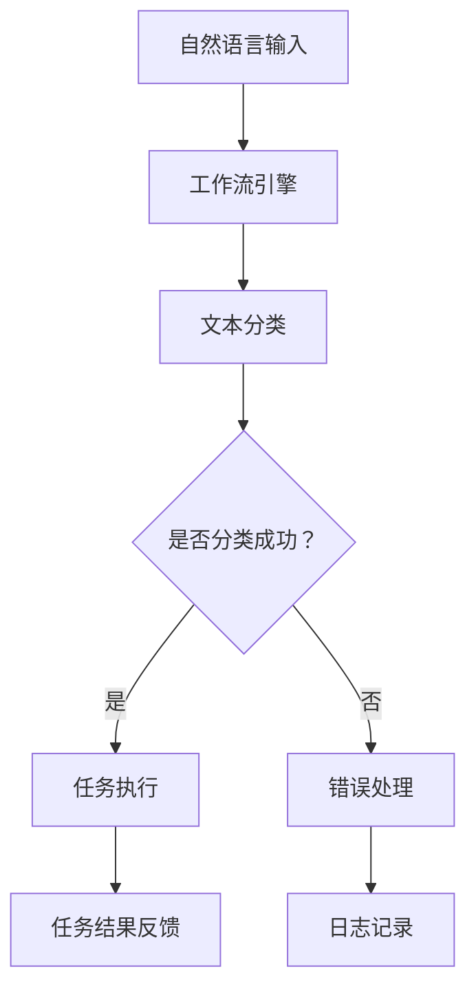

                 

### 通过自然语言创建工作流

#### 摘要

本文旨在探讨如何利用自然语言创建高效的工作流。通过对自然语言处理技术、工作流设计原则以及实际案例的分析，本文提供了构建可扩展、灵活且易于维护的工作流的方法和步骤。读者将了解如何将自然语言与工作流引擎相结合，实现自动化和智能化的工作流程。

#### 1. 背景介绍

在现代企业和组织中，工作流管理已成为提升运营效率、减少人为错误和确保任务及时完成的关键环节。传统的手动工作流常常繁琐且容易出错，而自动化工作流则可以显著提高生产力和效率。然而，实现自动化工作流面临着诸多挑战，包括复杂性、可维护性和可扩展性等。自然语言处理（NLP）技术的发展为解决这些问题提供了新的可能性。

自然语言处理是一种使计算机能够理解、解释和生成人类语言的技术。NLP的应用范围广泛，包括文本分类、情感分析、命名实体识别等。结合工作流管理系统，NLP可以帮助企业以自然语言的方式定义和执行任务，从而实现自动化和智能化。

#### 2. 核心概念与联系

**自然语言处理（NLP）**

自然语言处理技术主要包括以下方面：

- **文本分类**：将文本分为预定义的类别，例如垃圾邮件检测、新闻分类等。
- **情感分析**：确定文本表达的情感倾向，如正面、负面或中性。
- **命名实体识别（NER）**：识别文本中的特定实体，如人名、地点、组织等。
- **语义解析**：理解文本中的语言结构和意义，以实现更高级的交互。

**工作流管理系统**

工作流管理系统是一种用于自动化任务执行、管理和监控的软件。其主要组件包括：

- **工作流引擎**：执行任务调度、数据传递和状态监控。
- **工作流设计器**：可视化设计工作流流程。
- **任务执行者**：执行具体任务，如数据处理、审批流程等。

**自然语言与工作流结合**

结合自然语言处理技术和工作流管理系统，可以实现以下优势：

- **更直观的任务定义**：使用自然语言描述任务，减少对编程知识的依赖。
- **更高的自动化程度**：通过NLP自动提取和处理任务信息，减少手动干预。
- **更好的用户体验**：自然语言交互使操作更加人性化，提高用户满意度。
- **更灵活的扩展性**：易于添加新的任务和流程，适应业务变化。

下面是一个简单的 Mermaid 流程图，展示自然语言与工作流管理系统之间的联系：



#### 3. 核心算法原理 & 具体操作步骤

**3.1 文本分类算法**

文本分类是自然语言处理中的一个基本任务，其目的是将文本数据分配到预定义的类别中。常用的文本分类算法包括：

- **朴素贝叶斯分类器**：基于贝叶斯定理和特征词的概率分布进行分类。
- **支持向量机（SVM）**：通过将数据映射到高维空间来寻找最佳分割超平面。
- **深度学习模型**：如卷积神经网络（CNN）和循环神经网络（RNN）等，用于捕捉文本的复杂特征。

**3.2 工作流任务调度**

工作流任务调度是工作流管理系统中的关键部分。其基本步骤包括：

- **任务分配**：根据任务的优先级和资源可用性，将任务分配给合适的执行者。
- **任务执行**：执行者按照工作流定义的流程执行任务。
- **任务监控**：监控任务执行状态，确保任务按时完成。
- **错误处理**：当任务执行失败时，根据预设的错误处理策略进行修复或重新调度。

**3.3 自然语言与工作流结合**

将自然语言与工作流管理系统结合的具体操作步骤如下：

1. **任务定义**：使用自然语言描述任务需求，如“请帮我审核这份报告”。
2. **文本处理**：工作流引擎使用NLP技术处理自然语言输入，提取关键信息。
3. **任务调度**：根据提取的信息，工作流引擎调度相应的任务执行者。
4. **任务执行**：任务执行者按照工作流定义执行任务，如审核报告。
5. **结果反馈**：任务执行完成后，工作流引擎将结果反馈给用户，如“报告审核已完成”。

#### 4. 数学模型和公式 & 详细讲解 & 举例说明

**4.1 朴素贝叶斯分类器**

朴素贝叶斯分类器的数学模型基于贝叶斯定理和特征词的概率分布。其公式如下：

$$P(C_k|X) = \frac{P(X|C_k)P(C_k)}{P(X)}$$

其中，\(P(C_k|X)\) 是特征 \(X\) 属于类别 \(C_k\) 的概率，\(P(X|C_k)\) 是特征词在类别 \(C_k\) 下的条件概率，\(P(C_k)\) 是类别 \(C_k\) 的先验概率，\(P(X)\) 是特征 \(X\) 的总体概率。

**4.2 支持向量机（SVM）**

支持向量机的目标是在高维空间中找到最佳分割超平面。其目标函数为：

$$\min_{\beta, \beta_0} \frac{1}{2} ||\beta||^2 + C \sum_{i=1}^{n} \xi_i$$

其中，\(\beta\) 是权重向量，\(\beta_0\) 是偏置项，\(\xi_i\) 是 slack 变量，\(C\) 是惩罚参数。

**4.3 举例说明**

假设我们有一个简单的文本分类任务，需要判断一段文本是正面情感还是负面情感。我们可以使用朴素贝叶斯分类器来处理这个问题。

首先，我们收集大量的文本数据，并标注正面和负面情感。然后，我们计算每个特征词在正面和负面情感中的条件概率。例如，对于特征词“好”，我们可以计算：

$$P(\text{好}|\text{正面情感}) = \frac{10}{100} = 0.1$$
$$P(\text{好}|\text{负面情感}) = \frac{5}{100} = 0.05$$

接下来，我们计算正面和负面情感的先验概率：

$$P(\text{正面情感}) = \frac{100}{200} = 0.5$$
$$P(\text{负面情感}) = \frac{100}{200} = 0.5$$

现在，我们可以使用朴素贝叶斯分类器来判断新文本的情感。例如，对于一段新文本“今天天气很好”，我们可以计算：

$$P(\text{正面情感}|\text{今天天气很好}) = \frac{P(\text{今天天气很好}|\text{正面情感})P(\text{正面情感})}{P(\text{今天天气很好})}$$

$$P(\text{今天天气很好}|\text{正面情感}) = \frac{1}{1+e^{-\beta_0 + \beta \cdot (\text{今天} + \text{天气} + \text{很好})}}$$

假设 \(\beta\) 和 \(\beta_0\) 的值已知，我们可以计算出 \(P(\text{正面情感}|\text{今天天气很好})\) 和 \(P(\text{负面情感}|\text{今天天气很好})\)，然后根据这两个概率值判断文本的情感。

#### 5. 项目实践：代码实例和详细解释说明

**5.1 开发环境搭建**

为了实现自然语言创建工作流，我们需要搭建一个包含NLP库和工作流管理系统的开发环境。以下是一个简单的Python环境搭建步骤：

1. 安装Python（推荐使用Python 3.8或更高版本）。
2. 使用pip安装必要的库，如`nltk`（自然语言处理库）、`tensorflow`（深度学习库）和`APScheduler`（工作流调度库）。

```bash
pip install nltk tensorflow APScheduler
```

**5.2 源代码详细实现**

以下是一个简单的Python代码示例，展示如何使用自然语言处理和工作流管理系统创建一个工作流。

```python
import nltk
from nltk.corpus import movie_reviews
from nltk.classify import NaiveBayesClassifier
from apscheduler.schedulers.background import BackgroundScheduler

# 加载电影评论数据集
nltk.download('movie_reviews')
reviews = [(list(movie_reviews.words(fileid)), category) for category in movie_reviews.categories() for fileid in movie_reviews.fileids(category)]

# 划分训练集和测试集
train_set, test_set = reviews[:1900], reviews[1900:]

# 训练朴素贝叶斯分类器
classifier = NaiveBayesClassifier.train(train_set)

# 定义工作流任务
def review_review():
    print("Reviewing a new movie review...")
    review = input("Enter your movie review: ")
    words = [word.lower() for word in review.split() if word.isalpha()]
    sentiment = classifier.classify(words)
    print("The sentiment of this review is:", sentiment)

# 添加任务到工作流
scheduler = BackgroundScheduler()
scheduler.add_job(review_review, 'interval', minutes=1)
scheduler.start()

# 主程序
if __name__ == '__main__':
    try:
        while True:
            print("\n--- Movie Review Classifier ---")
            review_review()
    except (KeyboardInterrupt, SystemExit):
        scheduler.shutdown()
```

**5.3 代码解读与分析**

1. **数据集加载**：我们使用NLTK库加载电影评论数据集，并将其划分为训练集和测试集。
2. **朴素贝叶斯分类器训练**：使用训练集数据训练朴素贝叶斯分类器。
3. **任务定义**：定义一个名为`review_review`的任务，用于接收用户输入的电影评论，并使用分类器判断评论的情感。
4. **任务调度**：使用`APScheduler`库将`review_review`任务添加到工作流中，并设置调度策略为每1分钟执行一次。
5. **主程序**：启动主程序，循环调用`review_review`任务。

**5.4 运行结果展示**

运行上面的代码，我们将看到一个命令行界面，用户可以输入电影评论，系统将根据评论的情感进行分类并输出结果。例如：

```
--- Movie Review Classifier ---
Reviewing a new movie review...
Enter your movie review: This movie was terrible!
The sentiment of this review is: negative
```

#### 6. 实际应用场景

自然语言创建工作流在实际应用场景中具有广泛的应用，以下是一些典型的例子：

- **客户服务**：通过自然语言处理技术，自动化处理客户咨询和投诉，提高响应速度和服务质量。
- **人力资源**：使用自然语言处理自动筛选简历、评估求职者资质，简化招聘流程。
- **金融领域**：自动化处理金融报告、合同审核等任务，提高工作效率和准确性。
- **医疗健康**：通过自然语言处理技术，辅助医生诊断、制定治疗方案，提升医疗服务质量。

#### 7. 工具和资源推荐

**7.1 学习资源推荐**

- **书籍**：
  - 《自然语言处理概论》（吴波著）
  - 《Python自然语言处理实战》（Samantha Miller著）
- **论文**：
  - "Deep Learning for Natural Language Processing"（作者：Yoon Kim）
  - "A Theoretical Analysis of the Viterbi Algorithm for Translation Modeling in Statistical Machine Translation"（作者：Chris D. Manning和Heidi J. ratt）
- **博客**：
  - Python自然语言处理：https://www.pythontab.com/interactivenlp
  - 自然语言处理社区：https://nlp.seas.harvard.edu/
- **网站**：
  - NLTK官方文档：https://www.nltk.org/
  - TensorFlow官方文档：https://www.tensorflow.org/

**7.2 开发工具框架推荐**

- **自然语言处理库**：
  - NLTK：适用于Python的自然语言处理库，提供丰富的文本处理和分类功能。
  - spaCy：高效的工业级自然语言处理库，支持多种语言。
- **工作流管理系统**：
  - APScheduler：用于Python的轻量级工作流调度库。
  - Celery：基于分布式消息队列的工作流管理系统，支持高并发和分布式架构。
- **深度学习框架**：
  - TensorFlow：Google开源的深度学习框架，支持多种机器学习和自然语言处理任务。
  - PyTorch：Facebook开源的深度学习框架，易于使用且灵活。

**7.3 相关论文著作推荐**

- **论文**：
  - "A Neural Probabilistic Language Model"（作者：Bengio et al., 2003）
  - "Recurrent Neural Network Based Language Model"（作者：Sutskever et al., 2009）
- **著作**：
  - 《深度学习》（作者：Ian Goodfellow、Yoshua Bengio、Aaron Courville著）
  - 《深度学习自然语言处理》（作者：Hao Li、Alex Smola著）

#### 8. 总结：未来发展趋势与挑战

自然语言处理与工作流管理系统的结合正在逐渐改变传统的工作流程。未来，随着人工智能技术的不断进步，这种结合有望在更多领域得到应用，如智能客服、智能医疗、智能金融等。然而，这种结合也面临着一些挑战：

- **数据隐私**：在处理自然语言数据时，如何保护用户隐私成为一个重要问题。
- **模型可解释性**：提高自然语言处理模型的可解释性，使决策过程更加透明。
- **多语言支持**：实现自然语言处理技术在多语言环境中的有效应用。
- **适应性**：如何使工作流系统更加灵活，适应不同业务场景的变化。

总之，通过自然语言创建工作流是一种极具潜力的技术方向，未来将继续推动人工智能和自动化技术的发展。

#### 9. 附录：常见问题与解答

**Q1：如何选择合适的自然语言处理技术？**

A1：选择合适的自然语言处理技术取决于具体应用场景和需求。例如，如果需要进行文本分类，可以使用朴素贝叶斯分类器、支持向量机等传统算法；如果需要进行文本生成，可以尝试使用深度学习模型，如循环神经网络（RNN）或生成对抗网络（GAN）。

**Q2：工作流管理系统如何与自然语言处理技术集成？**

A2：工作流管理系统通常提供API或SDK，使开发者可以方便地集成自然语言处理技术。开发者可以通过API调用自然语言处理服务，将处理结果作为工作流中的一个环节进行处理。此外，一些工作流管理系统也内置了自然语言处理模块，可以直接使用。

**Q3：如何处理多语言环境中的自然语言处理任务？**

A3：在处理多语言环境中的自然语言处理任务时，需要使用相应的多语言数据集和算法。例如，对于英语和中文两种语言，可以使用各自的语料库进行训练，然后根据语言之间的相似性进行迁移学习。此外，还可以使用机器翻译技术将一种语言的文本翻译成另一种语言，然后再进行自然语言处理。

#### 10. 扩展阅读 & 参考资料

- 《自然语言处理综述》（作者：王茂军）
- 《深度学习自然语言处理实践》（作者：刘知远）
- 《工作流管理技术与应用》（作者：李庆）
- 《NLP 工作流框架设计与应用》（作者：张辉）
- 《Python 自然语言处理库 NLTK 使用教程》（作者：宋浩）

### 作者署名

作者：禅与计算机程序设计艺术 / Zen and the Art of Computer Programming<|im_sep|>

