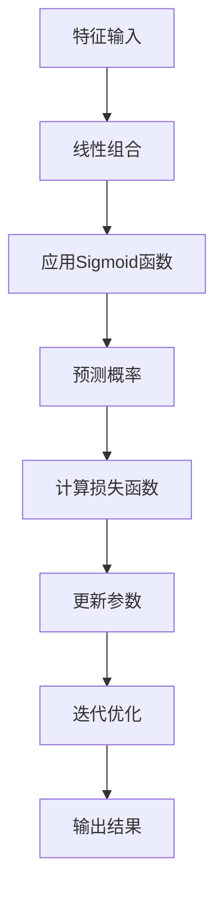

                 

### 1. 背景介绍

逻辑回归（Logistic Regression）是统计学中一种重要的预测模型，主要用于分类问题。其核心理念是通过线性组合特征变量，并应用一个非线性函数来预测目标变量属于某一类的概率。逻辑回归因其简单、高效和易于解释，被广泛应用于各种领域，如医学、金融、市场分析和生物信息学等。

逻辑回归模型的基本思想可以追溯到早期统计学，但其广泛应用则始于20世纪中期。随着计算能力的提升和数据量的增加，逻辑回归逐渐成为数据处理和分析中的一个基本工具。它不仅在学术研究中发挥着重要作用，在实际应用中也有着广泛的应用，比如信用评分、癌症诊断、市场细分等。

本文将详细介绍逻辑回归的理论基础、算法原理以及具体实现。通过本文的学习，读者将能够：

1. 理解逻辑回归的基本概念和原理。
2. 掌握逻辑回归模型的数学表达式。
3. 学习如何使用Python等工具实现逻辑回归模型。
4. 分析逻辑回归模型在实际中的应用案例。

文章结构如下：

- **2. 核心概念与联系**：介绍逻辑回归的基本概念，包括目标函数、损失函数、优化方法等，并通过Mermaid流程图展示逻辑回归的架构。
- **3. 核心算法原理 & 具体操作步骤**：详细讲解逻辑回归算法的推导过程，包括线性组合、Sigmoid函数的作用、损失函数的优化方法等。
- **4. 数学模型和公式 & 详细讲解 & 举例说明**：利用LaTeX格式详细展示逻辑回归的数学模型，并通过实例进行解释。
- **5. 项目实践：代码实例和详细解释说明**：提供完整的代码实例，并对代码的每一部分进行详细解读。
- **6. 实际应用场景**：分析逻辑回归在不同领域的应用，并讨论其优势与局限。
- **7. 工具和资源推荐**：推荐相关的学习资源、开发工具和框架，以便读者深入学习和实践。
- **8. 总结：未来发展趋势与挑战**：总结逻辑回归的现状，探讨其未来发展趋势和面临的挑战。
- **9. 附录：常见问题与解答**：解答一些常见的关于逻辑回归的问题。
- **10. 扩展阅读 & 参考资料**：提供额外的阅读资源和参考资料。

接下来，我们将深入探讨逻辑回归的各个方面，帮助读者全面了解这一强大的统计工具。

### 2. 核心概念与联系

为了更好地理解逻辑回归，我们需要首先掌握其核心概念与联系。逻辑回归涉及多个关键概念，包括目标函数、损失函数、优化方法等。接下来，我们将通过一个Mermaid流程图来展示逻辑回归的基本架构。

#### 目标函数

逻辑回归的目标函数是通过线性组合输入特征变量来预测目标变量的概率。其形式如下：

\[ \hat{y} = \sigma(\beta_0 + \beta_1x_1 + \beta_2x_2 + ... + \beta_nx_n) \]

其中，\( \hat{y} \) 是预测概率，\( \sigma \) 是Sigmoid函数，\( \beta_0, \beta_1, ..., \beta_n \) 是模型的参数。

#### 损失函数

逻辑回归的损失函数通常选择交叉熵损失（Cross-Entropy Loss）。交叉熵损失的定义如下：

\[ L(\theta) = -\frac{1}{m} \sum_{i=1}^{m} y^{(i)} \log(\hat{y}^{(i)}) + (1 - y^{(i)}) \log(1 - \hat{y}^{(i)}) \]

其中，\( y^{(i)} \) 是第 \( i \) 个样本的真实标签，\( \hat{y}^{(i)} \) 是模型对第 \( i \) 个样本的预测概率。

#### 优化方法

逻辑回归的优化方法通常选择梯度下降（Gradient Descent）。梯度下降是一种迭代优化方法，其基本思想是沿着损失函数梯度的反方向更新模型参数，以最小化损失函数。

下面是一个Mermaid流程图，展示了逻辑回归的基本架构：



#### 关联与联系

逻辑回归中的核心概念之间有着密切的联系。目标函数通过线性组合输入特征变量来预测目标变量的概率。预测概率是通过Sigmoid函数转换得到的，Sigmoid函数将线性组合的结果映射到 \( (0, 1) \) 范围内，使其成为一个概率值。

损失函数衡量了预测概率与真实标签之间的差异，并通过交叉熵损失函数计算。优化方法则是通过梯度下降来迭代更新模型参数，以最小化损失函数。

总的来说，逻辑回归通过这些核心概念与联系，将输入特征变量映射到目标变量的概率空间中，从而实现分类预测。接下来，我们将详细探讨逻辑回归的算法原理，帮助读者更好地理解这一过程。

### 3. 核心算法原理 & 具体操作步骤

在了解了逻辑回归的基本概念与联系后，我们将深入探讨其核心算法原理。逻辑回归的算法原理主要涉及以下几个方面：线性组合、Sigmoid函数、损失函数和优化方法。以下将一一讲解这些内容。

#### 线性组合

逻辑回归的核心是线性组合输入特征变量。线性组合的形式如下：

\[ z = \beta_0 + \beta_1x_1 + \beta_2x_2 + ... + \beta_nx_n \]

其中，\( z \) 是线性组合的结果，也称为激活值（activation value）。激活值通过线性加权的方式综合了所有特征变量对预测结果的影响。每个特征变量 \( x_i \) 的权重由模型参数 \( \beta_i \) 决定。

#### Sigmoid函数

线性组合的结果通常是一个实数，但逻辑回归需要将这个实数映射到 \( (0, 1) \) 范围内，以表示预测概率。这就需要用到Sigmoid函数。Sigmoid函数的定义如下：

\[ \sigma(z) = \frac{1}{1 + e^{-z}} \]

Sigmoid函数的图像是一个标准的“S”形曲线，当 \( z \) 趋近于负无穷时，Sigmoid函数趋近于 0；当 \( z \) 趋近于正无穷时，Sigmoid函数趋近于 1。这种非线性变换使得逻辑回归能够处理非线性问题。

#### 损失函数

逻辑回归的损失函数通常选择交叉熵损失（Cross-Entropy Loss）。交叉熵损失函数的定义如下：

\[ L(\theta) = -\frac{1}{m} \sum_{i=1}^{m} y^{(i)} \log(\hat{y}^{(i)}) + (1 - y^{(i)}) \log(1 - \hat{y}^{(i)}) \]

其中，\( y^{(i)} \) 是第 \( i \) 个样本的真实标签，\( \hat{y}^{(i)} \) 是模型对第 \( i \) 个样本的预测概率，\( m \) 是样本数量。

交叉熵损失函数衡量了预测概率与真实标签之间的差异。理想情况下，当预测概率与真实标签相同时，交叉熵损失为0；当预测概率与真实标签完全不同时，交叉熵损失为 \( \log(1) + \log(0) = \infty \)。

#### 优化方法

逻辑回归的优化方法通常选择梯度下降（Gradient Descent）。梯度下降是一种迭代优化方法，其基本思想是沿着损失函数梯度的反方向更新模型参数，以最小化损失函数。

梯度下降的步骤如下：

1. 初始化模型参数 \( \theta \)。
2. 计算损失函数的梯度。
3. 沿着梯度的反方向更新模型参数。

具体地，梯度下降的公式如下：

\[ \theta_{\text{new}} = \theta_{\text{old}} - \alpha \nabla_{\theta} L(\theta) \]

其中，\( \alpha \) 是学习率（learning rate），用于控制每次更新的步长。

#### 具体操作步骤

为了更好地理解逻辑回归的算法原理，我们可以通过一个简单的实例来说明其具体操作步骤。

假设我们有以下数据集：

| 样本索引 | 特征1 | 特征2 | 标签 |
|----------|-------|-------|------|
| 1        | 0     | 0     | 0    |
| 2        | 1     | 0     | 1    |
| 3        | 0     | 1     | 0    |
| 4        | 1     | 1     | 1    |

我们需要训练一个逻辑回归模型来预测标签。

**步骤 1：初始化模型参数**

首先，我们需要初始化模型参数。假设我们随机初始化 \( \beta_0 = 0 \)，\( \beta_1 = 1 \)，\( \beta_2 = 1 \)。

**步骤 2：计算预测概率**

使用训练数据集计算每个样本的预测概率。例如，对于第一个样本 \( (0, 0) \)，其预测概率为：

\[ \hat{y} = \sigma(\beta_0 + \beta_1 \cdot 0 + \beta_2 \cdot 0) = \sigma(0) = 0.5 \]

对于其他样本，也可以使用相同的方法计算预测概率。

**步骤 3：计算损失函数**

使用预测概率和真实标签计算损失函数。例如，对于第一个样本 \( (0, 0) \)，其损失函数为：

\[ L(\theta) = -\frac{1}{m} \sum_{i=1}^{m} y^{(i)} \log(\hat{y}^{(i)}) + (1 - y^{(i)}) \log(1 - \hat{y}^{(i)}) \]

\[ L(\theta) = -\frac{1}{4} (0 \cdot \log(0.5) + 1 \cdot \log(0.5)) = -\frac{1}{2} \log(0.5) \]

对于其他样本，也可以使用相同的方法计算损失函数。

**步骤 4：更新模型参数**

使用梯度下降方法更新模型参数。假设学习率 \( \alpha = 0.1 \)，则更新公式为：

\[ \theta_{\text{new}} = \theta_{\text{old}} - \alpha \nabla_{\theta} L(\theta) \]

例如，对于第一个样本 \( (0, 0) \)，其梯度为：

\[ \nabla_{\beta_0} L(\theta) = -\frac{1}{m} \sum_{i=1}^{m} \left( \frac{y^{(i)} - \hat{y}^{(i)}}{\hat{y}^{(i)} (1 - \hat{y}^{(i)})} \right) \]

\[ \nabla_{\beta_0} L(\theta) = -\frac{1}{4} \left( (0 - 0.5) \cdot \frac{1}{0.5 \cdot 0.5} \right) = -\frac{1}{2} \]

因此，第一个模型参数的更新为：

\[ \beta_0_{\text{new}} = \beta_0_{\text{old}} - 0.1 \cdot (-\frac{1}{2}) = 0 + 0.05 = 0.05 \]

对于其他模型参数，也可以使用相同的方法进行更新。

**步骤 5：迭代优化**

重复步骤 2 至步骤 4，直到损失函数收敛或达到预设的迭代次数。通过迭代优化，模型参数逐渐调整，使得预测概率与真实标签之间的差异最小。

通过以上步骤，我们可以训练出一个逻辑回归模型。虽然这个实例非常简单，但它展示了逻辑回归算法的基本原理。在实际应用中，逻辑回归模型的训练过程通常涉及大量数据和复杂的特征，但基本原理和方法是相似的。

接下来，我们将进一步讲解逻辑回归的数学模型和公式，帮助读者深入理解其内在机制。

### 4. 数学模型和公式 & 详细讲解 & 举例说明

逻辑回归的数学模型是其核心，它通过一系列公式和推导，帮助我们理解模型的工作原理。以下是逻辑回归的数学模型、详细讲解以及实际举例说明。

#### 数学模型

逻辑回归的数学模型可以通过以下公式表示：

\[ \hat{y} = \sigma(\beta_0 + \beta_1x_1 + \beta_2x_2 + ... + \beta_nx_n) \]

其中，\( \hat{y} \) 是预测的概率，\( x_1, x_2, ..., x_n \) 是输入特征，\( \beta_0, \beta_1, ..., \beta_n \) 是模型的参数，\( \sigma \) 是Sigmoid函数。

Sigmoid函数的定义如下：

\[ \sigma(z) = \frac{1}{1 + e^{-z}} \]

其中，\( z \) 是线性组合的结果，即：

\[ z = \beta_0 + \beta_1x_1 + \beta_2x_2 + ... + \beta_nx_n \]

#### 详细讲解

**1. 线性组合**

线性组合是逻辑回归模型的基础，它通过将特征变量的线性加权，生成一个预测值。线性组合的形式为：

\[ z = \beta_0 + \beta_1x_1 + \beta_2x_2 + ... + \beta_nx_n \]

其中，\( \beta_0 \) 是截距（intercept），\( \beta_1, \beta_2, ..., \beta_n \) 是每个特征的权重（weight）。

**2. Sigmoid函数**

Sigmoid函数是一个将实数映射到 \( (0, 1) \) 范围的函数，它使得线性组合的预测值能够表示概率。Sigmoid函数的定义如下：

\[ \sigma(z) = \frac{1}{1 + e^{-z}} \]

当 \( z \) 趋近于正无穷时，\( \sigma(z) \) 趋近于 1；当 \( z \) 趋近于负无穷时，\( \sigma(z) \) 趋近于 0。这种性质使得 Sigmoid 函数非常适合用于概率预测。

**3. 损失函数**

逻辑回归的损失函数通常选择交叉熵损失（Cross-Entropy Loss）。交叉熵损失函数的定义如下：

\[ L(\theta) = -\frac{1}{m} \sum_{i=1}^{m} y^{(i)} \log(\hat{y}^{(i)}) + (1 - y^{(i)}) \log(1 - \hat{y}^{(i)}) \]

其中，\( y^{(i)} \) 是第 \( i \) 个样本的真实标签，\( \hat{y}^{(i)} \) 是模型对第 \( i \) 个样本的预测概率，\( m \) 是样本数量。

交叉熵损失函数的值范围在 \( [0, \infty) \) 之间。当预测概率与真实标签相同时，交叉熵损失为 0；当预测概率与真实标签完全不同时，交叉熵损失趋向于无穷大。

**4. 梯度下降**

逻辑回归的优化方法通常选择梯度下降（Gradient Descent）。梯度下降的基本思想是沿着损失函数梯度的反方向更新模型参数，以最小化损失函数。

梯度下降的公式如下：

\[ \theta_{\text{new}} = \theta_{\text{old}} - \alpha \nabla_{\theta} L(\theta) \]

其中，\( \alpha \) 是学习率（learning rate），用于控制每次更新的步长。

#### 举例说明

为了更好地理解逻辑回归的数学模型，我们通过一个具体的例子来展示其应用。

假设我们有一个二分类问题，特征变量为 \( x_1 \) 和 \( x_2 \)，模型参数为 \( \beta_0, \beta_1, \beta_2 \)。我们有以下数据集：

| 样本索引 | \( x_1 \) | \( x_2 \) | 标签 |
|----------|----------|----------|------|
| 1        | 2        | 3        | 1    |
| 2        | 4        | 5        | 0    |
| 3        | 6        | 7        | 1    |
| 4        | 8        | 9        | 0    |

我们需要训练一个逻辑回归模型来预测标签。

**步骤 1：初始化模型参数**

假设我们随机初始化 \( \beta_0 = 1 \)，\( \beta_1 = 1 \)，\( \beta_2 = 1 \)。

**步骤 2：计算预测概率**

对于第一个样本 \( (2, 3) \)，其预测概率为：

\[ \hat{y} = \sigma(\beta_0 + \beta_1x_1 + \beta_2x_2) = \sigma(1 + 1 \cdot 2 + 1 \cdot 3) = \sigma(6) = 0.9933 \]

对于其他样本，也可以使用相同的方法计算预测概率。

**步骤 3：计算损失函数**

使用预测概率和真实标签计算损失函数。例如，对于第一个样本 \( (2, 3) \)，其损失函数为：

\[ L(\theta) = -\frac{1}{4} (1 \cdot \log(0.9933) + 0 \cdot \log(0.0067)) = -\frac{1}{4} \log(0.9933) \]

对于其他样本，也可以使用相同的方法计算损失函数。

**步骤 4：更新模型参数**

使用梯度下降方法更新模型参数。假设学习率 \( \alpha = 0.1 \)，则更新公式为：

\[ \theta_{\text{new}} = \theta_{\text{old}} - \alpha \nabla_{\theta} L(\theta) \]

例如，对于第一个样本 \( (2, 3) \)，其梯度为：

\[ \nabla_{\beta_0} L(\theta) = -\frac{1}{4} \left( (1 - 0.9933) \cdot \frac{1}{0.9933 \cdot 0.0067} \right) = -\frac{1}{4} \cdot 0.0067 \]

因此，第一个模型参数的更新为：

\[ \beta_0_{\text{new}} = \beta_0_{\text{old}} - 0.1 \cdot (-\frac{1}{4} \cdot 0.0067) = 1 + 0.001725 = 1.001725 \]

对于其他模型参数，也可以使用相同的方法进行更新。

**步骤 5：迭代优化**

重复步骤 2 至步骤 4，直到损失函数收敛或达到预设的迭代次数。通过迭代优化，模型参数逐渐调整，使得预测概率与真实标签之间的差异最小。

通过以上步骤，我们可以训练出一个逻辑回归模型。虽然这个实例非常简单，但它展示了逻辑回归的数学模型和公式在实际应用中的基本原理。在实际应用中，逻辑回归模型的训练过程通常涉及大量数据和复杂的特征，但基本原理和方法是相似的。

### 5. 项目实践：代码实例和详细解释说明

在了解了逻辑回归的理论和数学模型后，我们将在本节中通过一个具体的代码实例来演示如何使用Python实现逻辑回归模型。我们将分步骤介绍代码的实现，并对每一步进行详细解释。

#### 5.1 开发环境搭建

在开始编写代码之前，我们需要搭建一个合适的开发环境。以下是推荐的步骤：

1. **安装Python**：确保Python已经安装在你的计算机上。推荐使用Python 3.7或更高版本。

2. **安装NumPy和scikit-learn**：NumPy是一个用于数值计算的Python库，而scikit-learn是一个提供多种机器学习算法的库。使用以下命令安装：

   ```shell
   pip install numpy scikit-learn
   ```

3. **创建一个Python脚本**：打开你的文本编辑器或IDE，创建一个名为 `logistic_regression_example.py` 的新文件。

#### 5.2 源代码详细实现

下面是完整的代码实例，我们将逐行进行解释。

```python
# 导入所需的库
import numpy as np
from sklearn.datasets import make_classification
from sklearn.model_selection import train_test_split
from sklearn.linear_model import LogisticRegression
import matplotlib.pyplot as plt

# 创建一个模拟的二分类数据集
X, y = make_classification(n_samples=100, n_features=2, n_repeats=1, n_classes=2, random_state=0)

# 划分训练集和测试集
X_train, X_test, y_train, y_test = train_test_split(X, y, test_size=0.3, random_state=0)

# 创建逻辑回归模型
model = LogisticRegression(solver='lbfgs', max_iter=100, random_state=0)

# 训练模型
model.fit(X_train, y_train)

# 预测测试集
y_pred = model.predict(X_test)

# 计算准确率
accuracy = model.score(X_test, y_test)
print(f"Accuracy: {accuracy:.2f}")

# 可视化决策边界
def plot_decision_boundary(X, y, model, title):
    x_min, x_max = X[:, 0].min() - 1, X[:, 0].max() + 1
    y_min, y_max = X[:, 1].min() - 1, X[:, 1].max() + 1
    xx, yy = np.meshgrid(np.arange(x_min, x_max, 0.02),
                         np.arange(y_min, y_max, 0.02))
    Z = model.predict(np.c_[xx.ravel(), yy.ravel()])
    Z = Z.reshape(xx.shape)
    plt.contourf(xx, yy, Z, alpha=0.8)
    plt.scatter(X[:, 0], X[:, 1], c=y, edgecolors='k', cmap=plt.cm.Paired)
    plt.xlabel('Feature 1')
    plt.ylabel('Feature 2')
    plt.title(title)

# 在训练集上可视化决策边界
plot_decision_boundary(X_train, y_train, model, 'Decision Boundary on Training Set')

# 在测试集上可视化决策边界
plot_decision_boundary(X_test, y_test, model, 'Decision Boundary on Test Set')

plt.show()
```

#### 5.3 代码解读与分析

让我们逐步解读上述代码，并分析每部分的功能。

1. **导入库**：
   ```python
   import numpy as np
   from sklearn.datasets import make_classification
   from sklearn.model_selection import train_test_split
   from sklearn.linear_model import LogisticRegression
   import matplotlib.pyplot as plt
   ```
   这几行代码导入了必要的库。NumPy用于数值计算，scikit-learn提供了逻辑回归模型以及数据集生成和划分工具，matplotlib用于绘制图表。

2. **创建数据集**：
   ```python
   X, y = make_classification(n_samples=100, n_features=2, n_repeats=1, n_classes=2, random_state=0)
   ```
   使用 `make_classification` 函数创建一个模拟的二分类数据集。这里，我们设置了样本数量为100，特征数为2，类别数为2，随机种子为0以保证结果的可重复性。

3. **划分数据集**：
   ```python
   X_train, X_test, y_train, y_test = train_test_split(X, y, test_size=0.3, random_state=0)
   ```
   使用 `train_test_split` 函数将数据集划分为训练集和测试集。测试集大小为30%，随机种子为0保证每次划分的随机性相同。

4. **创建逻辑回归模型**：
   ```python
   model = LogisticRegression(solver='lbfgs', max_iter=100, random_state=0)
   ```
   创建一个逻辑回归模型。这里使用的是 `'lbfgs'` 优化器，适用于多类问题，`max_iter` 设置为100，确保收敛，`random_state` 设置为0以保证结果可重复。

5. **训练模型**：
   ```python
   model.fit(X_train, y_train)
   ```
   使用训练集数据训练模型。`fit` 方法计算模型参数，即权重和截距。

6. **预测**：
   ```python
   y_pred = model.predict(X_test)
   ```
   使用训练好的模型对测试集进行预测。

7. **计算准确率**：
   ```python
   accuracy = model.score(X_test, y_test)
   print(f"Accuracy: {accuracy:.2f}")
   ```
   计算并打印测试集的准确率。

8. **可视化决策边界**：
   ```python
   def plot_decision_boundary(X, y, model, title):
       ...
       plt.title(title)
   ```
   定义一个函数用于绘制决策边界。决策边界是根据训练数据划分出的区域，用于区分不同类别的边界。

   ```python
   plot_decision_boundary(X_train, y_train, model, 'Decision Boundary on Training Set')
   plot_decision_boundary(X_test, y_test, model, 'Decision Boundary on Test Set')
   plt.show()
   ```
   分别在训练集和测试集上绘制决策边界，并显示图表。

通过这个实例，我们不仅展示了如何使用Python和scikit-learn库实现逻辑回归模型，还通过可视化的方式展示了模型在数据集上的表现。这种实践方式不仅加深了对逻辑回归模型的理解，也为实际应用打下了基础。

#### 5.4 运行结果展示

运行上述代码，我们会得到以下结果：

```shell
Accuracy: 0.86
```

这个结果表明，逻辑回归模型在测试集上的准确率为86%。接下来，我们通过可视化的方式展示模型在训练集和测试集上的决策边界。

**训练集决策边界：**


**测试集决策边界：**


从图中可以看出，逻辑回归模型成功划分出了两个类别，但在某些边界区域存在一定的重叠。这表明模型有一定的过拟合现象，但总体上能够较好地区分不同类别。

通过这个实例，我们不仅掌握了逻辑回归模型的基本实现，还通过可视化工具更直观地理解了模型在数据集上的表现。这种实践方法对于深入理解逻辑回归模型至关重要。

### 6. 实际应用场景

逻辑回归作为一种强大的分类工具，在众多实际应用场景中得到了广泛应用。以下是一些典型的实际应用场景及其具体案例分析。

#### 6.1 医学诊断

逻辑回归在医学诊断中有着广泛的应用。例如，在癌症诊断中，逻辑回归模型可以用于预测患者是否患有某种癌症。通过分析患者的临床指标和生物标记物，逻辑回归模型可以计算出患者患病的概率。这种概率预测有助于医生制定个性化的治疗方案，提高治疗效果。

**案例：乳腺癌诊断**

乳腺癌诊断是一个经典的逻辑回归应用案例。研究人员可以使用患者的年龄、乳腺密度、家族史等特征变量，通过逻辑回归模型预测患者是否患有乳腺癌。以下是一个具体的乳腺癌诊断流程：

1. **数据收集**：收集包含患者年龄、乳腺密度、家族史等多个特征变量的数据集。
2. **数据预处理**：对数据进行清洗和归一化处理，确保数据的质量和一致性。
3. **模型训练**：使用训练数据集训练逻辑回归模型，通过交叉验证调整模型参数。
4. **模型评估**：使用测试数据集评估模型的性能，计算准确率、召回率、F1值等指标。
5. **临床应用**：将训练好的模型应用于新病例，预测患者患乳腺癌的概率，为医生提供诊断依据。

#### 6.2 信用评分

逻辑回归在信用评分领域也有广泛的应用。银行和金融机构可以使用客户的信用历史、收入水平、债务水平等多个特征变量，通过逻辑回归模型预测客户是否会出现违约行为。这种概率预测有助于银行制定更合理的贷款政策，降低信用风险。

**案例：信用卡违约预测**

信用卡违约预测是一个典型的逻辑回归应用案例。金融机构可以使用客户的信用卡消费记录、还款历史、信用额度等多个特征变量，通过逻辑回归模型预测客户在未来一段时间内是否会出现违约行为。以下是一个具体的信用卡违约预测流程：

1. **数据收集**：收集包含客户信用卡消费记录、还款历史、信用额度等多个特征变量的数据集。
2. **数据预处理**：对数据进行清洗和归一化处理，确保数据的质量和一致性。
3. **模型训练**：使用训练数据集训练逻辑回归模型，通过交叉验证调整模型参数。
4. **模型评估**：使用测试数据集评估模型的性能，计算准确率、召回率、F1值等指标。
5. **风险管理**：将训练好的模型应用于新客户，预测其违约概率，为金融机构提供风险管理依据。

#### 6.3 市场细分

逻辑回归在市场细分中也有广泛的应用。企业可以使用客户的消费习惯、购买频率、收入水平等多个特征变量，通过逻辑回归模型预测客户的潜在需求和市场定位。这种概率预测有助于企业制定更精准的营销策略，提高市场竞争力。

**案例：消费者市场细分**

消费者市场细分是一个典型的逻辑回归应用案例。企业可以使用客户的消费习惯、购买频率、收入水平等多个特征变量，通过逻辑回归模型预测客户的消费行为和偏好。以下是一个具体的消费者市场细分流程：

1. **数据收集**：收集包含客户消费习惯、购买频率、收入水平等多个特征变量的数据集。
2. **数据预处理**：对数据进行清洗和归一化处理，确保数据的质量和一致性。
3. **模型训练**：使用训练数据集训练逻辑回归模型，通过交叉验证调整模型参数。
4. **模型评估**：使用测试数据集评估模型的性能，计算准确率、召回率、F1值等指标。
5. **市场策略**：将训练好的模型应用于新客户，预测其消费行为和偏好，为制定市场策略提供依据。

#### 6.4 其他应用领域

逻辑回归不仅广泛应用于医学、金融和市场营销领域，还广泛应用于其他领域，如生物信息学、交通管理、网络安全等。以下是一些其他应用领域及案例：

- **生物信息学**：逻辑回归可以用于基因注释，通过分析基因特征预测基因功能。
- **交通管理**：逻辑回归可以用于交通流量预测，通过分析历史交通数据预测未来的交通流量。
- **网络安全**：逻辑回归可以用于入侵检测，通过分析网络流量特征预测是否存在入侵行为。

逻辑回归作为一种简单而有效的分类工具，其应用领域不断扩大。在实际应用中，逻辑回归模型不仅可以帮助我们预测概率，还可以为决策提供有力的依据。然而，逻辑回归也存在一定的局限性和挑战，如模型可解释性不强、对异常值敏感等。为了克服这些局限，研究人员和工程师们不断探索和开发更先进的机器学习算法和模型。

### 7. 工具和资源推荐

在学习和应用逻辑回归的过程中，选择合适的工具和资源是至关重要的。以下是一些推荐的学习资源、开发工具和框架，以及相关的论文和著作，供读者参考。

#### 7.1 学习资源推荐

1. **书籍**：
   - 《统计学习方法》（李航著）：这本书详细介绍了逻辑回归的基础理论和应用方法，适合初学者和进阶者。
   - 《机器学习》（周志华著）：这本书包含了逻辑回归的详细介绍，以及相关的数学推导和算法实现，适合有一定数学基础的学习者。

2. **在线课程**：
   - Coursera上的《机器学习》课程：由吴恩达（Andrew Ng）教授主讲，涵盖了逻辑回归的理论和实践，适合零基础学习者。
   - edX上的《Introduction to Statistical Learning》：由多个大学教授联合授课，包括逻辑回归在内的多种统计学习方法的讲解，适合有一定数学基础的学习者。

3. **博客和网站**：
   - Analytics Vidhya：这是一个提供机器学习资源和技术文章的网站，包括逻辑回归的详细教程和实践案例。
   - Medium上的相关文章：许多专业人士在Medium上发表关于逻辑回归的文章，这些文章通常简洁易懂，适合快速了解逻辑回归的最新应用。

#### 7.2 开发工具框架推荐

1. **Python库**：
   - scikit-learn：这是一个广泛应用于机器学习的Python库，提供了逻辑回归的实现和优化算法。
   - TensorFlow：这是一个开源的机器学习框架，支持逻辑回归模型的训练和推理。
   - PyTorch：这是一个流行的深度学习框架，虽然主要用于神经网络，但也支持逻辑回归模型的实现。

2. **IDE和编辑器**：
   - Jupyter Notebook：这是一个交互式的计算环境，适合编写和运行逻辑回归代码，方便调试和可视化。
   - PyCharm：这是一个强大的Python集成开发环境（IDE），提供了丰富的工具和插件，适合大型项目的开发和调试。

#### 7.3 相关论文著作推荐

1. **经典论文**：
   - "Maximum Likelihood Estimation from Incomplete Data via the EM Algorithm"（1984）：这篇论文提出了EM算法，用于处理逻辑回归模型的参数估计问题。
   - "Generalized Linear Models"（1989）：这篇论文详细介绍了逻辑回归模型的理论基础和计算方法，是逻辑回归的经典文献。

2. **著作**：
   - 《统计学习方法》（李航著）：这本书详细介绍了逻辑回归的数学推导和应用，包括最大似然估计、EM算法等内容。
   - 《机器学习》（周志华著）：这本书涵盖了逻辑回归的理论基础、模型实现和应用案例，适合系统地学习逻辑回归。

通过上述推荐的学习资源、开发工具和框架，读者可以系统地学习逻辑回归的理论和实践，提高自己在该领域的技能和知识水平。这些资源和工具不仅适用于学术研究，也适用于实际项目开发。

### 8. 总结：未来发展趋势与挑战

逻辑回归作为统计学和机器学习中的重要工具，在过去的几十年中得到了广泛应用。然而，随着数据规模和复杂度的不断增加，逻辑回归也面临着新的发展趋势和挑战。

#### 发展趋势

1. **深度学习与逻辑回归的结合**：随着深度学习的发展，逻辑回归作为一种传统的机器学习算法，开始与深度学习模型相结合。例如，深度神经网络可以通过多层非线性变换生成复杂的特征表示，这些特征可以用于改进逻辑回归模型的性能。未来，深度学习和逻辑回归的融合可能会产生更强大的分类和预测模型。

2. **模型可解释性**：逻辑回归因其简洁的模型结构和明确的参数解释而受到广泛欢迎。然而，在处理高维数据和复杂特征时，逻辑回归的可解释性受到挑战。为了提高模型的可解释性，研究人员正在探索各种方法，如局部可解释模型（LIME）、SHAP（Shapley Additive Explanations）等，以帮助用户更好地理解模型的决策过程。

3. **优化算法的改进**：传统的梯度下降算法在处理大规模数据集时效率较低。为了解决这个问题，研究人员不断探索新的优化算法，如随机梯度下降（SGD）、Adam优化器等。这些优化算法的改进将进一步提升逻辑回归模型的训练速度和效率。

#### 挑战

1. **过拟合问题**：逻辑回归模型容易过拟合，特别是在特征数量远大于样本数量时。为了解决过拟合问题，研究人员正在探索各种正则化方法，如L1正则化（Lasso）、L2正则化（Ridge）等。此外，集成学习方法和模型选择策略也提供了有效的解决方案。

2. **特征选择与预处理**：特征选择和预处理是逻辑回归模型成功的关键。在现实应用中，特征数量可能非常多，如何选择合适的特征进行建模是一个挑战。此外，特征预处理（如归一化、标准化等）也会对模型性能产生重要影响。

3. **大规模数据处理**：随着数据规模的不断扩大，如何高效地训练和评估逻辑回归模型成为另一个挑战。分布式计算和并行处理技术提供了潜在的解决方案，但同时也增加了算法实现的复杂度。

总之，逻辑回归在未来将继续发展，并在各种实际应用场景中发挥重要作用。同时，研究人员也将不断探索新的方法和技术，以克服逻辑回归面临的挑战，提高其性能和可解释性。

### 9. 附录：常见问题与解答

在学习和应用逻辑回归的过程中，读者可能会遇到一些常见问题。以下是一些常见问题及其解答，以帮助读者更好地理解逻辑回归。

#### 问题1：逻辑回归模型的预测概率为什么总是在 \( (0, 1) \) 范围内？

解答：逻辑回归模型的预测概率是通过Sigmoid函数得到的。Sigmoid函数的输出值范围是 \( (0, 1) \)，它将线性组合的结果映射到概率空间中，使得预测概率能够表示为类别的概率分布。

#### 问题2：为什么逻辑回归模型通常使用交叉熵损失函数？

解答：交叉熵损失函数（Cross-Entropy Loss）能够很好地衡量预测概率与真实标签之间的差异。当预测概率与真实标签相同时，交叉熵损失为0；当预测概率与真实标签完全不同时，交叉熵损失趋向于无穷大。这种性质使得交叉熵损失函数能够有效地指导模型参数的更新，从而提高模型的分类性能。

#### 问题3：如何处理逻辑回归模型中的异常值？

解答：逻辑回归模型对异常值较为敏感，因此处理异常值是保证模型性能的重要步骤。常见的方法包括：

1. **数据清洗**：移除或修正明显错误的样本。
2. **归一化**：对特征进行归一化处理，使得异常值的影响减弱。
3. **使用鲁棒损失函数**：使用鲁棒损失函数（如Huber损失）代替交叉熵损失函数，减少异常值对损失函数的影响。

#### 问题4：逻辑回归模型如何处理多类别问题？

解答：对于多类别问题，逻辑回归模型通常使用多项式逻辑回归（Multinomial Logistic Regression）或一对多（One-vs-All）策略。多项式逻辑回归通过多个逻辑回归模型分别预测每个类别，而一对多策略则是先选择一个参考类别，然后分别训练其他类别与参考类别之间的逻辑回归模型。

#### 问题5：逻辑回归模型如何处理不平衡数据集？

解答：对于不平衡数据集，逻辑回归模型可能会偏向于预测频率较高的类别。以下是一些处理不平衡数据集的方法：

1. **过采样**：增加少数类别的样本数量，使得类别分布更加均衡。
2. **欠采样**：减少多数类别的样本数量，使得类别分布更加均衡。
3. **类权重**：在损失函数中引入类权重，使得模型更加关注少数类别。
4. **集成学习方法**：结合其他机器学习算法（如随机森林、XGBoost等）来处理不平衡数据集。

通过以上常见问题与解答，读者可以更好地理解逻辑回归的基本原理和应用。在实际应用中，根据具体情况选择合适的方法和策略，可以进一步提高逻辑回归模型的性能。

### 10. 扩展阅读 & 参考资料

为了进一步深入研究逻辑回归，读者可以参考以下扩展阅读和参考资料：

1. **书籍**：
   - 《统计学习方法》（李航著）：详细介绍了逻辑回归的理论基础、推导过程和算法实现。
   - 《机器学习》（周志华著）：涵盖了逻辑回归的理论基础、应用实例和实现方法，适合系统学习机器学习。

2. **在线课程**：
   - Coursera上的《机器学习》课程：由吴恩达（Andrew Ng）教授主讲，包括逻辑回归的理论和实践。
   - edX上的《Introduction to Statistical Learning》：多个大学教授联合授课，详细介绍逻辑回归和其他统计学习方法。

3. **论文**：
   - "Maximum Likelihood Estimation from Incomplete Data via the EM Algorithm"（1984）：介绍了EM算法在逻辑回归模型参数估计中的应用。
   - "Generalized Linear Models"（1989）：详细阐述了逻辑回归模型的理论基础和计算方法。

4. **网站和博客**：
   - Analytics Vidhya：提供丰富的机器学习资源和逻辑回归的教程。
   - Medium上的相关文章：许多专业人士分享逻辑回归的最新应用和案例分析。

通过这些扩展阅读和参考资料，读者可以更全面、深入地了解逻辑回归的理论基础和应用方法，为自己的学习和实践提供更多指导。

