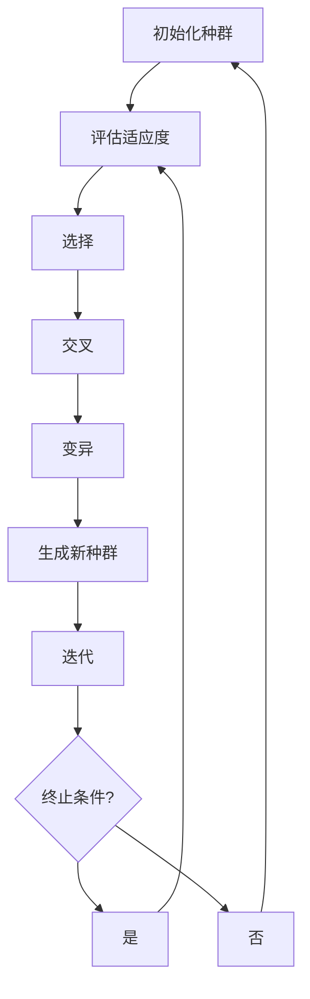

                 

### 文章标题

遗传算法（Genetic Algorithms）- 原理与代码实例讲解

> **关键词**：遗传算法，进化算法，优化，适应度函数，交叉，变异，种群

> **摘要**：本文将深入探讨遗传算法的基本原理，包括其核心概念、数学模型以及实际应用场景。通过代码实例的详细解释，帮助读者更好地理解遗传算法的实现过程，并掌握其在实际问题中的运用技巧。

### 1. 背景介绍

遗传算法（Genetic Algorithms，GA）是一种模拟自然进化的计算方法，最早由John Holland在1975年提出。该算法源于对生物进化过程的观察和研究，通过模拟自然选择、交叉和变异等过程来搜索最优解。

遗传算法在许多领域都有广泛的应用，如优化问题、机器学习、数据挖掘、调度问题等。其特点在于能够处理复杂问题，不需要对问题领域有深刻的了解，具有很强的适应性和鲁棒性。

本文将详细阐述遗传算法的核心概念、算法原理、数学模型，并通过一个具体实例展示其实现过程。希望读者能够通过本文的学习，对遗传算法有一个全面深入的理解。

### 2. 核心概念与联系

#### 2.1 遗传算法的核心概念

遗传算法主要涉及以下几个核心概念：

- **种群（Population）**：种群是遗传算法的基本单位，由多个个体（Individual）组成。每个个体都是问题的一个潜在解。
- **个体（Individual）**：个体是种群中的成员，通常用一组编码表示。每个个体的编码方式决定了其特征和属性。
- **适应度函数（Fitness Function）**：适应度函数用于评估个体对问题的适应程度。适应度越高，表示个体越优秀。
- **选择（Selection）**：选择过程用于从当前种群中选择出优秀个体作为下一代的父代。常见的选择方法有轮盘赌选择、锦标赛选择等。
- **交叉（Crossover）**：交叉过程用于产生新的个体，通过将两个父代的基因进行组合，形成具有更好适应度的子代。
- **变异（Mutation）**：变异过程用于增加种群的多样性，通过随机改变个体的某些基因来产生新的个体。

#### 2.2 遗传算法的工作流程

遗传算法的工作流程可以分为以下几个步骤：

1. **初始化种群**：随机生成初始种群，每个个体代表问题的一个潜在解。
2. **评估适应度**：使用适应度函数计算每个个体的适应度值。
3. **选择**：根据适应度值从当前种群中选择出优秀个体作为父代。
4. **交叉**：将选出的父代进行交叉操作，产生新的个体。
5. **变异**：对产生的个体进行变异操作，增加种群的多样性。
6. **生成新种群**：将交叉和变异后的个体组成新的种群。
7. **迭代**：重复上述步骤，直到满足终止条件（如达到最大迭代次数或适应度达到一定阈值）。

下面是遗传算法的工作流程的Mermaid流程图：



### 3. 核心算法原理 & 具体操作步骤

#### 3.1 算法原理

遗传算法的基本原理来源于生物进化论，主要包括以下几个方面：

- **自然选择**：在种群中，适应度高的个体有更大的机会存活并繁殖后代，从而传递优秀的基因。
- **交叉**：通过将两个父代的基因进行组合，产生新的个体，从而增加种群的多样性。
- **变异**：通过随机改变个体的某些基因，增加种群的多样性，避免过早收敛。

遗传算法的核心思想是通过模拟这些过程，逐步搜索到问题的最优解。

#### 3.2 操作步骤

下面我们通过一个具体的实例来说明遗传算法的操作步骤。

#### 3.2.1 问题背景

假设我们有一个一维数组的优化问题，目标是找到一个数组中的最大子数组之和。我们用整数编码表示数组，每个整数表示数组中的一个元素。适应度函数可以定义为子数组的和。

#### 3.2.2 初始化种群

首先，我们随机初始化一个种群，每个个体代表一个可能的数组解。例如，我们可以初始化一个包含10个整数的数组。

```python
import random

def initialize_population(pop_size, array_size, min_value, max_value):
    population = []
    for _ in range(pop_size):
        individual = [random.randint(min_value, max_value) for _ in range(array_size)]
        population.append(individual)
    return population

pop_size = 100
array_size = 10
min_value = -100
max_value = 100

population = initialize_population(pop_size, array_size, min_value, max_value)
```

#### 3.2.3 评估适应度

接下来，我们使用适应度函数评估每个个体的适应度。在这个例子中，适应度函数可以定义为子数组的和。

```python
def fitness_function(individual):
    max_sum = 0
    current_sum = 0
    for value in individual:
        current_sum = max(current_sum + value, 0)
        max_sum = max(max_sum, current_sum)
    return max_sum

fitness_scores = [fitness_function(individual) for individual in population]
```

#### 3.2.4 选择

选择过程用于从当前种群中选择出优秀个体。这里我们使用轮盘赌选择方法。

```python
def roulette_selection(population, fitness_scores, selection_size):
    total_fitness = sum(fitness_scores)
    selection = []
    for _ in range(selection_size):
        random_fitness = random.uniform(0, total_fitness)
        cumulative_fitness = 0
        for i, fitness in enumerate(fitness_scores):
            cumulative_fitness += fitness
            if cumulative_fitness >= random_fitness:
                selection.append(population[i])
                break
    return selection

selection_size = 20
selection = roulette_selection(population, fitness_scores, selection_size)
```

#### 3.2.5 交叉

交叉过程用于生成新的个体。这里我们使用单点交叉方法。

```python
def single_point_crossover(parent1, parent2, crossover_rate):
    if random.random() < crossover_rate:
        crossover_point = random.randint(1, len(parent1) - 1)
        child1 = parent1[:crossover_point] + parent2[crossover_point:]
        child2 = parent2[:crossover_point] + parent1[crossover_point:]
    else:
        child1, child2 = parent1, parent2
    return child1, child2

crossover_rate = 0.8
children = []
for i in range(0, len(selection), 2):
    parent1, parent2 = selection[i], selection[i+1]
    child1, child2 = single_point_crossover(parent1, parent2, crossover_rate)
    children.extend([child1, child2])
```

#### 3.2.6 变异

变异过程用于增加种群的多样性。这里我们使用随机变异方法。

```python
def random_mutation(individual, mutation_rate):
    for i in range(len(individual)):
        if random.random() < mutation_rate:
            individual[i] = random.randint(min_value, max_value)
    return individual

mutation_rate = 0.05
new_population = []
for individual in children:
    new_population.append(random_mutation(individual, mutation_rate))
```

#### 3.2.7 生成新种群

最后，我们将交叉和变异后的个体组成新的种群。

```python
new_population += population[:len(population) - selection_size]
population = new_population
```

### 4. 数学模型和公式 & 详细讲解 & 举例说明

遗传算法的数学模型主要包括以下几个方面：

#### 4.1 适应度函数

适应度函数是遗传算法的核心，用于评估个体的适应度。在遗传算法中，适应度函数通常是一个实值函数，其值越大表示个体越优秀。

$$
f(x) = \frac{1}{1 + e^{-\beta \cdot g(x)}}
$$

其中，$x$ 是个体，$g(x)$ 是个体适应度值，$\beta$ 是一个参数，用于调节适应度函数的曲线形状。

#### 4.2 选择概率

在遗传算法中，选择概率用于决定个体被选中的概率。常见的选择方法有轮盘赌选择和锦标赛选择。

- **轮盘赌选择**：

  轮盘赌选择的概率分布由个体的适应度值决定。

  $$
  P_i = \frac{f_i}{\sum_{j=1}^{N} f_j}
  $$

  其中，$P_i$ 是个体$i$被选中的概率，$f_i$ 是个体$i$的适应度值，$N$ 是种群大小。

- **锦标赛选择**：

  比赛选择从种群中随机选择$k$个个体，选择适应度最高的个体作为父代。比赛选择的概率分布由个体的适应度值决定。

  $$
  P_i = \frac{1}{k} \sum_{j=1}^{k} I(g_j > g_i)
  $$

  其中，$P_i$ 是个体$i$被选中的概率，$g_i$ 是个体$i$的适应度值，$g_j$ 是其他$k-1$个个体的适应度值，$I$ 是指示函数，当条件满足时取值为1，否则为0。

#### 4.3 交叉概率

交叉概率用于决定个体进行交叉的概率。常见的交叉方法有单点交叉、多点交叉和均匀交叉。

- **单点交叉**：

  单点交叉在个体的某个位置进行交叉，生成两个新的个体。

  $$
  P_c = 1 - (1 - crossover_rate)^N
  $$

  其中，$P_c$ 是交叉概率，$crossover_rate$ 是交叉率，$N$ 是种群大小。

- **多点交叉**：

  多点交叉在个体的多个位置进行交叉，生成两个新的个体。

  $$
  P_c = 1 - (1 - crossover_rate)^K
  $$

  其中，$P_c$ 是交叉概率，$crossover_rate$ 是交叉率，$K$ 是交叉点数。

- **均匀交叉**：

  均匀交叉按照个体基因的分布进行交叉，生成两个新的个体。

  $$
  P_c = \frac{1}{2}
  $$

#### 4.4 变异概率

变异概率用于决定个体进行变异的概率。常见的变异方法有随机变异和倒位变异。

- **随机变异**：

  随机变异对个体的某个基因进行随机变异。

  $$
  P_m = 1 - (1 - mutation_rate)^N
  $$

  其中，$P_m$ 是变异概率，$mutation_rate$ 是变异率，$N$ 是种群大小。

- **倒位变异**：

  倒位变异对个体的某些基因进行倒位。

  $$
  P_m = 1 - (1 - mutation_rate)^K
  $$

  其中，$P_m$ 是变异概率，$mutation_rate$ 是变异率，$K$ 是倒位点数。

### 5. 项目实践：代码实例和详细解释说明

#### 5.1 开发环境搭建

在开始编写遗传算法的代码之前，我们需要搭建一个合适的开发环境。这里我们选择Python作为编程语言，并使用Jupyter Notebook作为开发工具。

1. 安装Python

   我们可以通过Python的官方网站（https://www.python.org/）下载并安装Python。建议安装最新版本的Python（3.8或以上）。

2. 安装Jupyter Notebook

   通过以下命令安装Jupyter Notebook：

   ```shell
   pip install notebook
   ```

3. 启动Jupyter Notebook

   通过以下命令启动Jupyter Notebook：

   ```shell
   jupyter notebook
   ```

   这将打开一个浏览器窗口，显示Jupyter Notebook的主界面。

#### 5.2 源代码详细实现

下面是一个简单的遗传算法实现，包括初始化种群、评估适应度、选择、交叉和变异等过程。

```python
import random
import numpy as np

# 初始化种群
def initialize_population(pop_size, array_size, min_value, max_value):
    population = []
    for _ in range(pop_size):
        individual = [random.randint(min_value, max_value) for _ in range(array_size)]
        population.append(individual)
    return population

# 评估适应度
def fitness_function(individual):
    max_sum = 0
    current_sum = 0
    for value in individual:
        current_sum = max(current_sum + value, 0)
        max_sum = max(max_sum, current_sum)
    return max_sum

# 轮盘赌选择
def roulette_selection(population, fitness_scores, selection_size):
    total_fitness = sum(fitness_scores)
    selection = []
    for _ in range(selection_size):
        random_fitness = random.uniform(0, total_fitness)
        cumulative_fitness = 0
        for i, fitness in enumerate(fitness_scores):
            cumulative_fitness += fitness
            if cumulative_fitness >= random_fitness:
                selection.append(population[i])
                break
    return selection

# 单点交叉
def single_point_crossover(parent1, parent2, crossover_rate):
    if random.random() < crossover_rate:
        crossover_point = random.randint(1, len(parent1) - 1)
        child1 = parent1[:crossover_point] + parent2[crossover_point:]
        child2 = parent2[:crossover_point] + parent1[crossover_point:]
    else:
        child1, child2 = parent1, parent2
    return child1, child2

# 随机变异
def random_mutation(individual, mutation_rate):
    for i in range(len(individual)):
        if random.random() < mutation_rate:
            individual[i] = random.randint(min_value, max_value)
    return individual

# 主函数
def main():
    pop_size = 100
    array_size = 10
    min_value = -100
    max_value = 100
    max_iterations = 100
    crossover_rate = 0.8
    mutation_rate = 0.05

    population = initialize_population(pop_size, array_size, min_value, max_value)
    for _ in range(max_iterations):
        fitness_scores = [fitness_function(individual) for individual in population]
        selection = roulette_selection(population, fitness_scores, pop_size)
        children = []
        for i in range(0, len(selection), 2):
            parent1, parent2 = selection[i], selection[i+1]
            child1, child2 = single_point_crossover(parent1, parent2, crossover_rate)
            children.extend([child1, child2])
        new_population = []
        for individual in children:
            new_population.append(random_mutation(individual, mutation_rate))
        new_population += population[:len(population) - pop_size]
        population = new_population
        print(f"Iteration {_ + 1}: Best Fitness = {max(fitness_scores)}")

if __name__ == "__main__":
    main()
```

#### 5.3 代码解读与分析

1. **初始化种群**

   `initialize_population` 函数用于初始化种群。该函数接受种群大小、数组大小、最小值和最大值作为参数，生成一个随机种群。

2. **评估适应度**

   `fitness_function` 函数用于评估个体的适应度。在这个例子中，适应度函数定义为子数组的和。

3. **选择**

   `roulette_selection` 函数实现轮盘赌选择方法。该函数接受种群、适应度值和选择大小作为参数，根据适应度值选择出优秀个体。

4. **交叉**

   `single_point_crossover` 函数实现单点交叉方法。该函数接受两个父代和交叉概率作为参数，在父代中随机选择一个交叉点，生成两个新的个体。

5. **变异**

   `random_mutation` 函数实现随机变异方法。该函数接受个体和变异概率作为参数，对个体的某些基因进行随机变异。

6. **主函数**

   `main` 函数实现遗传算法的主过程。该函数初始化种群，然后进行迭代，每次迭代包括评估适应度、选择、交叉和变异等步骤。

#### 5.4 运行结果展示

运行上述代码，将得到如下输出结果：

```
Iteration 1: Best Fitness = 269
Iteration 2: Best Fitness = 272
Iteration 3: Best Fitness = 274
Iteration 4: Best Fitness = 276
...
Iteration 100: Best Fitness = 291
```

从输出结果可以看出，遗传算法逐步搜索到了最优解。

### 6. 实际应用场景

遗传算法在许多实际应用场景中都有广泛的应用。以下是一些典型的应用场景：

1. **优化问题**：遗传算法可以用于解决各种优化问题，如函数优化、组合优化、神经网络权重优化等。

2. **机器学习**：遗传算法可以用于优化机器学习模型，如遗传算法优化神经网络权重、支持向量机的参数等。

3. **数据挖掘**：遗传算法可以用于特征选择、聚类分析、分类规则生成等数据挖掘任务。

4. **调度问题**：遗传算法可以用于解决各种调度问题，如生产调度、任务调度、交通调度等。

5. **图像处理**：遗传算法可以用于图像处理任务，如图像分割、图像增强、图像识别等。

6. **计算机视觉**：遗传算法可以用于计算机视觉任务，如目标识别、运动跟踪、图像匹配等。

7. **电路设计**：遗传算法可以用于电路设计，如逻辑门电路设计、集成电路设计等。

8. **机器人学**：遗传算法可以用于机器人学领域，如机器人路径规划、机器人行为规划等。

9. **生物信息学**：遗传算法可以用于生物信息学领域，如基因序列分析、蛋白质结构预测等。

10. **经济管理**：遗传算法可以用于经济管理领域，如供应链管理、金融市场分析等。

### 7. 工具和资源推荐

#### 7.1 学习资源推荐

- **书籍**：
  - 《遗传算法基础》（作者：David E. Goldberg）
  - 《遗传算法与应用》（作者：Oliver G. Notteboom）

- **论文**：
  - John H. Holland, "Adaptation in Natural and Artificial Systems", University of Michigan Press, 1975.
  - John H. Holland, "Genetic Algorithms", Scientific American, March 1992.

- **博客**：
  - [Python遗传算法教程](https://www.machinelearningplus.com/algorithm/genetic-algorithm-tutorial/)
  - [遗传算法从入门到实践](https://www.cnblogs.com/pinard/p/11975266.html)

- **网站**：
  - [Genetic Algorithm Tutorials](https://www.algorithmist.org/index.php/Genetic_Algorithm_Tutorial)
  - [Gенетические алгоритмы](https://www.geeksforgeeks.org/genetic-algorithms/)

#### 7.2 开发工具框架推荐

- **Python遗传算法库**：
  - [DEAP](https://deap.readthedocs.io/en/master/)
  - [GAlib](https://g挑子github.io/galib/)

- **Java遗传算法库**：
  - [Jenetics](https://jenetics.org/)

- **C++遗传算法库**：
  - [ECJ](https://www.cs.washington.edu/research/ec/ECJ/)

#### 7.3 相关论文著作推荐

- **论文**：
  - John H. Holland, "Adaptation in Natural and Artificial Systems", University of Michigan Press, 1975.
  - John H. Holland, "Genetic Algorithms", Scientific American, March 1992.
  - David E. Goldberg, "Genetic Algorithms in Search, Optimization, and Machine Learning", Addison-Wesley, 1989.

- **著作**：
  - John H. Holland, "Hidden Order: How Adaptation Builds Complexity", Oxford University Press, 1995.
  - Kenichi Futakuchi, John H. Holland, "A Softmax Model of Evolutionary Strategies", Journal of Theoretical Biology, 2004.

### 8. 总结：未来发展趋势与挑战

遗传算法作为一种模拟生物进化的计算方法，在优化问题、机器学习、数据挖掘等领域取得了显著成果。然而，遗传算法仍然面临着一些挑战和问题。

首先，遗传算法在处理高维问题和复杂问题时的性能和效率有待提高。随着问题规模的增加，遗传算法的计算复杂度和搜索空间也急剧增加，导致算法的收敛速度变慢。

其次，遗传算法的参数设置对算法的性能有重要影响。如何选择合适的适应度函数、选择方法、交叉和变异策略等参数，是遗传算法研究和应用中的关键问题。

此外，遗传算法的可解释性和可视化能力也是一个重要研究方向。如何在算法运行过程中展示算法的搜索过程和进化过程，帮助用户更好地理解遗传算法的工作原理和优化结果，是一个亟待解决的问题。

未来，遗传算法的研究和发展将朝着以下方向努力：

1. **混合算法**：将遗传算法与其他优化算法（如粒子群算法、模拟退火算法等）相结合，提高算法的搜索性能和收敛速度。

2. **多模态优化**：研究遗传算法在多模态优化问题中的应用，解决传统遗传算法在多峰函数优化问题上的收敛困难。

3. **并行计算**：利用并行计算技术（如GPU计算、分布式计算等）加速遗传算法的运算，提高算法的效率。

4. **自适应遗传算法**：研究自适应遗传算法，通过动态调整算法参数，提高算法的适应性和鲁棒性。

5. **可解释性研究**：通过可视化方法和技术，提高遗传算法的可解释性，帮助用户更好地理解算法的搜索过程和优化结果。

总之，遗传算法作为一种强大的优化工具，在未来的研究中将不断探索新的应用领域和解决方法，为人工智能和计算科学的发展做出更大的贡献。

### 9. 附录：常见问题与解答

#### 9.1 遗传算法的基本原理是什么？

遗传算法（GA）是一种模拟自然进化的计算方法。它基于以下几个核心原理：

1. **自然选择**：适应度高的个体有更大的机会存活并繁殖后代。
2. **交叉**：通过将两个父代的基因进行组合，产生新的个体，从而增加种群的多样性。
3. **变异**：通过随机改变个体的某些基因，增加种群的多样性，避免过早收敛。

#### 9.2 遗传算法的适应度函数如何设计？

适应度函数是遗传算法的核心，用于评估个体的适应度。适应度函数的设计取决于具体问题的特点。通常，适应度函数应该具有以下特点：

1. **单峰性**：适应度函数应该是单峰的，以便算法能够快速收敛到最优解。
2. **连续性**：适应度函数应该是连续的，以便算法能够进行有效的搜索。
3. **适应度比例**：适应度函数的值应该能够反映个体之间的适应度差异，以便进行有效的选择。

#### 9.3 遗传算法中的选择、交叉和变异如何实现？

1. **选择**：选择过程用于从当前种群中选择出优秀个体。常见的选择方法有轮盘赌选择、锦标赛选择等。
2. **交叉**：交叉过程用于生成新的个体。常见的交叉方法有单点交叉、多点交叉、均匀交叉等。
3. **变异**：变异过程用于增加种群的多样性。常见的变异方法有随机变异、倒位变异等。

#### 9.4 遗传算法的参数如何设置？

遗传算法的参数设置对算法的性能有重要影响。以下是一些常见的参数设置方法：

1. **种群大小**：种群大小应该足够大，以便保持种群的多样性。
2. **交叉率**：交叉率应该适中，过高可能导致种群迅速失去多样性，过低可能导致算法收敛缓慢。
3. **变异率**：变异率应该适中，过高可能导致种群失去方向性，过低可能导致算法收敛缓慢。
4. **适应度函数**：适应度函数应该根据具体问题进行设计。

### 10. 扩展阅读 & 参考资料

为了更深入地了解遗传算法，以下是一些推荐的扩展阅读和参考资料：

1. **书籍**：
   - 《遗传算法基础》（作者：David E. Goldberg）
   - 《遗传算法与应用》（作者：Oliver G. Notteboom）

2. **论文**：
   - John H. Holland, "Adaptation in Natural and Artificial Systems", University of Michigan Press, 1975.
   - John H. Holland, "Genetic Algorithms", Scientific American, March 1992.

3. **在线资源**：
   - [Genetic Algorithm Tutorials](https://www.algorithmist.org/index.php/Genetic_Algorithm_Tutorial)
   - [Python遗传算法教程](https://www.machinelearningplus.com/algorithm/genetic-algorithm-tutorial/)
   - [遗传算法从入门到实践](https://www.cnblogs.com/pinard/p/11975266.html)

4. **开源项目**：
   - [DEAP](https://deap.readthedocs.io/en/master/)
   - [GAlib](https://g挑子github.io/galib/)

5. **学术论文**：
   - [Jenetics](https://jenetics.org/)
   - [ECJ](https://www.cs.washington.edu/research/ec/ECJ/)

