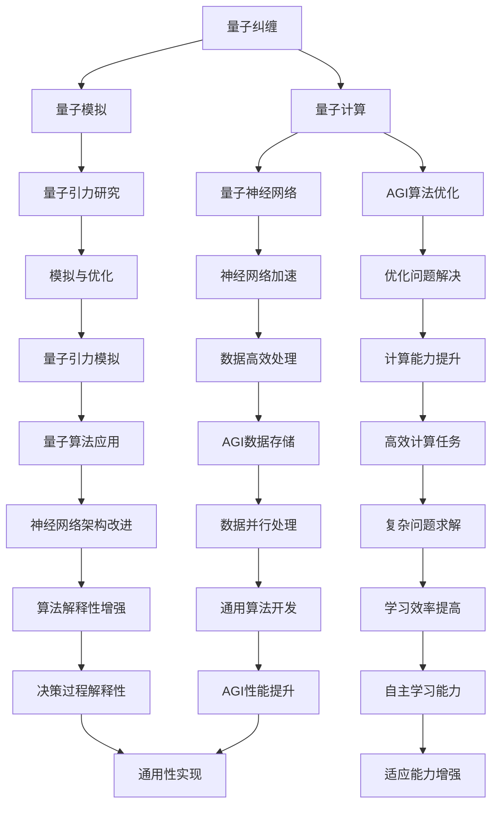

                 

### 背景介绍 Background

量子引力和全功能人工智能（AGI，Artificial General Intelligence）是当代物理学和计算机科学中最具挑战性和前沿性的两个研究领域。量子引力试图解释宇宙的基本法则，而AGI则致力于创建能够在广泛任务上与人类智能相媲美的人工智能系统。这两个领域看似相隔甚远，但它们之间却存在着深刻的联系。

量子引力的核心概念包括量子纠缠、量子叠加和量子计算。爱因斯坦曾对量子纠缠提出了“鬼魅似的超距作用”的质疑，但后来被实验证实，量子纠缠是量子力学的基本特征。量子叠加表明一个量子系统可以同时存在于多个状态中，而量子计算则利用这一特性进行高速计算，这在传统计算机中是不可想象的。这些量子现象在宇宙尺度上的作用，即量子引力，仍然是科学界的重大难题。

另一方面，AGI的目标是实现一种能够在不同领域表现优异的人工智能，其核心在于通用算法和学习机制。目前，深度学习、强化学习和迁移学习等方法已经在特定领域取得了显著进展，但要让AGI真正落地，仍需解决诸如通用性、解释性和可扩展性等挑战。

量子引力和AGI之间的联系主要体现在以下几个方面：

1. **计算能力**：量子计算机的理论计算能力远超传统计算机，其潜在的强大计算能力可以加速AGI的学习过程，从而提高训练效率。

2. **模拟与优化**：量子模拟器能够模拟量子系统的行为，这对于研究量子引力非常重要。同时，量子算法在优化问题上的优越性也可以用于优化AGI的训练算法，提高其性能。

3. **数据存储与处理**：量子计算机具有高度的并行性和高效的数据处理能力，这对于处理AGI所需的庞大数据集和复杂计算任务具有重要意义。

4. **神经网络架构**：量子神经网络（QNN）是量子计算和神经网络相结合的产物，其在处理复杂问题上展现出巨大的潜力，可以加速AGI的研究与开发。

尽管量子引力与AGI之间存在诸多挑战，但这两者之间的交叉领域无疑为未来的科学研究和技术进步提供了广阔的前景。

### 核心概念与联系 Core Concepts and Connections

在深入探讨量子引力和AGI的交叉领域之前，我们首先需要理解它们各自的核心概念及其相互联系。

#### 量子引力的核心概念

1. **量子纠缠**：量子纠缠是量子力学中两个或多个粒子之间的一种特殊关联状态，即使这些粒子相隔遥远，它们的状态也会互相影响。这种关联无法通过任何已知的经典物理现象来解释，被认为是量子力学最为神秘的特征之一。

2. **量子叠加**：量子系统可以处于多个状态的叠加态，这意味着在量子层面上，一个粒子可以同时存在于多个位置或状态。这种叠加态只有在测量时才会“坍缩”为一个确定的状态。

3. **量子计算**：量子计算机利用量子位（qubit）的叠加和纠缠特性进行计算。与传统计算机的位（bit）只能处于0或1的两种状态不同，量子位可以同时处于0和1的叠加状态，这使得量子计算机在处理某些特定类型的问题时比传统计算机更为高效。

#### AGI的核心概念

1. **通用性**：AGI的目标是具备人类智能的各种能力，包括感知、理解、推理、学习、问题解决等。这意味着AGI需要在各种不同领域表现优异，而不仅仅是特定任务。

2. **自主学习**：AGI需要具备自主学习的能力，能够通过数据驱动的方式不断改进自身，适应新的环境和任务。

3. **解释性**：AGI的决策过程需要具备一定的解释性，以便人类能够理解其行为和决策背后的原因。

#### 量子引力与AGI的联系

1. **计算能力的提升**：量子计算机的强大计算能力可以加速AGI的训练过程，特别是在处理大规模数据和复杂优化问题时。量子算法在诸如线性规划、组合优化和机器学习等领域已经展现出优越性。

2. **模拟与优化**：量子模拟器能够模拟量子系统的行为，这对于研究量子引力和开发新的AGI算法都至关重要。量子算法在优化问题上的效率优势，也可以用于优化AGI的训练算法。

3. **数据存储与处理**：量子计算机具有高效的并行处理能力，可以同时处理大量数据，这对于处理AGI所需的海量数据集具有重要意义。

4. **神经网络架构**：量子神经网络（QNN）是量子计算和神经网络相结合的产物，其在处理复杂问题上展现出巨大潜力。QNN可以加速某些特定类型的神经网络训练，提高AGI的性能。

#### Mermaid 流程图

以下是一个简单的Mermaid流程图，展示了量子引力与AGI之间核心概念的联系：



通过这个流程图，我们可以清晰地看到量子引力与AGI之间的核心概念是如何相互联系和促进的。量子引力的进展不仅为物理学研究带来了新的视角，也为AGI的发展提供了潜在的技术突破点。

### 核心算法原理 & 具体操作步骤 Core Algorithm Principles & Operational Steps

在量子引力和AGI的交叉领域中，核心算法的原理和具体操作步骤至关重要。以下将详细阐述量子算法的基本原理，以及如何将其应用于AGI领域。

#### 量子算法的基本原理

1. **量子状态叠加**：量子计算机利用量子位（qubit）的叠加态进行计算。在量子计算机中，一个qubit可以同时处于0和1的状态，这种叠加态使得量子计算机能够同时处理多个计算路径。

2. **量子纠缠**：量子计算机通过量子纠缠将多个qubit连接在一起，形成复杂的量子状态。纠缠态的qubit之间的相互依赖使得量子计算机能够进行并行计算，从而加速某些问题的解决。

3. **量子门操作**：量子门是量子计算机的基本操作单元，类似于传统计算机中的逻辑门。通过量子门，可以对量子位进行叠加、变换和测量。

4. **量子测量**：量子测量是将量子态坍缩到某个确定状态的过程。测量结果依赖于初始量子态和量子门操作，通过巧妙设计的测量，可以在量子态中提取出所需的信息。

#### 量子算法的应用

1. **量子搜索算法**：例如，Grover算法是一种经典的量子搜索算法，其能够在线性时间内搜索一个未排序的数据库，相比传统二分搜索算法，其效率提高了平方根倍。

2. **量子算法与优化问题**：量子算法在解决某些优化问题时表现出显著优势。例如，量子模拟器可以高效地模拟量子系统的行为，从而解决复杂的优化问题。

3. **量子神经网络（QNN）**：QNN是量子计算和神经网络相结合的产物，其在处理复杂问题上展现出巨大潜力。QNN可以通过量子叠加和纠缠特性，加速某些特定类型的神经网络训练。

#### AGI领域的具体操作步骤

1. **量子增强的机器学习**：量子算法可以用于优化机器学习中的训练过程。例如，通过使用量子搜索算法，可以快速找到最优的超参数设置。

2. **量子模拟与分子设计**：在AGI中，分子设计和药物开发是一个重要的领域。量子模拟器可以模拟分子的量子态，从而加速新药的研发。

3. **量子优化与资源调度**：在AGI系统中，资源调度和任务分配是一个复杂的问题。量子优化算法可以用于解决这类问题，从而提高系统的效率。

#### 案例分析

以下是一个简单的量子算法在AGI中的应用案例：

**案例：使用量子算法优化神经网络训练**

1. **问题定义**：假设我们需要训练一个神经网络，该网络需要在大量的数据集中找到最优的超参数设置。

2. **量子搜索算法**：我们可以使用Grover算法来快速搜索最优超参数设置。首先，将超参数设置编码为量子状态，然后应用Grover算法，在量子态中找到最优的超参数。

3. **测量与解码**：在找到最优超参数后，对其进行测量并解码，得到最优的超参数设置。

4. **训练神经网络**：使用找到的最优超参数，对神经网络进行训练，从而提高其性能。

通过这个案例，我们可以看到量子算法在优化神经网络训练方面的应用潜力。量子计算的高效性可以显著提高AGI的训练效率，从而加速人工智能的发展。

总之，量子算法在AGI领域具有广泛的应用前景。通过结合量子计算和机器学习，我们可以开发出更加高效和智能的人工智能系统，解决传统计算机难以应对的问题。

### 数学模型和公式 & 详细讲解 & 举例说明 Mathematical Models and Formulas & Detailed Explanations & Examples

在量子引力和AGI的研究中，数学模型和公式起到了至关重要的作用。以下将详细解释这些数学模型，并通过具体例子进行说明。

#### 量子计算中的数学模型

1. **量子态表示**：
   在量子计算中，量子态通常用复数向量来表示。一个量子态可以用如下形式表示：
   $$|\psi\rangle = \sum_{i} c_i |i\rangle$$
   其中，$|i\rangle$ 表示第 $i$ 个量子状态，$c_i$ 表示该状态的复数系数。

2. **量子门**：
   量子门是量子计算的基本操作单元，类似于传统计算机中的逻辑门。一个量子门可以用矩阵表示。例如，一个基本的量子门——Pauli-X门，可以用以下矩阵表示：
   $$X = \begin{pmatrix}
   0 & 1 \\
   1 & 0
   \end{pmatrix}$$
   该量子门会将量子态 $|0\rangle$ 变换为 $|1\rangle$，将 $|1\rangle$ 变换为 $|0\rangle$。

3. **量子叠加和测量**：
   量子态的叠加可以用矩阵乘法表示。例如，考虑两个量子态 $|+\rangle$ 和 $|-\rangle$ 的叠加：
   $$|\psi\rangle = \frac{1}{\sqrt{2}} (|+\rangle + |-\rangle)$$
   当对量子态进行测量时，量子态会坍缩到其中一个基态，测量结果具有概率分布。量子态 $|\psi\rangle$ 的概率分布可以表示为：
   $$P(i) = |c_i|^2$$
   其中，$c_i$ 是量子态中的复数系数。

#### AGI中的数学模型

1. **神经网络中的激活函数**：
   神经网络中的激活函数用于引入非线性。一个常见的激活函数是Sigmoid函数：
   $$f(x) = \frac{1}{1 + e^{-x}}$$
   该函数可以将实数映射到 $(0, 1)$ 区间内。

2. **损失函数**：
   在神经网络训练过程中，损失函数用于衡量模型预测与真实值之间的差距。一个常见的损失函数是均方误差（MSE）：
   $$MSE = \frac{1}{n} \sum_{i=1}^{n} (y_i - \hat{y}_i)^2$$
   其中，$y_i$ 是真实值，$\hat{y}_i$ 是模型预测值。

3. **优化算法**：
   神经网络训练过程中，常用的优化算法有梯度下降和随机梯度下降。梯度下降算法的更新规则可以表示为：
   $$\theta = \theta - \alpha \frac{\partial J}{\partial \theta}$$
   其中，$\theta$ 是模型参数，$J$ 是损失函数，$\alpha$ 是学习率。

#### 具体例子

1. **量子态叠加**：
   考虑一个具有两个量子位的量子态，初始状态为：
   $$|\psi\rangle = \frac{1}{\sqrt{2}} (|00\rangle + |11\rangle)$$
   应用一个Pauli-X门作用于第一个量子位，得到新的量子态：
   $$|\psi'\rangle = \frac{1}{\sqrt{2}} (|01\rangle + |10\rangle)$$
   对该量子态进行测量，根据量子态的叠加性质，测量结果为 $|01\rangle$ 或 $|10\rangle$，其概率均为 $\frac{1}{2}$。

2. **神经网络训练**：
   假设我们有一个简单的神经网络，输入为 $(x, y)$，输出为预测值 $\hat{y}$。真实值为 $y$，损失函数为均方误差（MSE）。训练过程如下：
   - 初始化模型参数 $\theta$。
   - 计算预测值 $\hat{y}$。
   - 计算损失函数 $J$。
   - 计算损失函数关于参数 $\theta$ 的梯度 $\frac{\partial J}{\partial \theta}$。
   - 使用梯度下降算法更新参数 $\theta$：
     $$\theta = \theta - \alpha \frac{\partial J}{\partial \theta}$$
   - 重复上述步骤，直到达到预定的训练目标。

通过这些例子，我们可以看到量子计算和神经网络中的数学模型是如何用于解决实际问题的。这些数学模型和公式的理解和应用对于推动量子引力和AGI的发展具有重要意义。

### 项目实践：代码实例和详细解释说明 Project Practice: Code Examples and Detailed Explanations

为了更好地理解量子引力和AGI在实践中的应用，我们将通过一个具体的代码实例来展示如何实现和运行一个量子神经网络（QNN）模型。以下步骤将详细介绍如何搭建开发环境、实现源代码以及代码解读与分析。

#### 1. 开发环境搭建

要运行一个量子神经网络（QNN）实例，我们需要搭建一个适合的量子计算开发环境。以下是一个基本的开发环境搭建步骤：

1. **安装Python**：确保安装了Python 3.x版本。Python是编写量子算法和神经网络的基础工具。

2. **安装量子计算库**：安装Qiskit，这是IBM提供的开源量子计算库，用于构建和运行量子算法。
   ```bash
   pip install qiskit
   ```

3. **安装机器学习库**：安装scikit-learn，用于实现传统的机器学习算法。
   ```bash
   pip install scikit-learn
   ```

4. **安装Jupyter Notebook**：Jupyter Notebook是一个交互式的开发环境，可以方便地编写和运行代码。
   ```bash
   pip install notebook
   ```

5. **安装可视化工具**：安装Matplotlib和Seaborn，用于可视化数据和分析结果。
   ```bash
   pip install matplotlib seaborn
   ```

#### 2. 源代码详细实现

以下是一个简单的量子神经网络（QNN）实例，用于分类任务。我们使用Qiskit库构建量子神经网络，并使用scikit-learn库准备数据。

```python
import numpy as np
from qiskit import QuantumCircuit, execute, Aer
from qiskit import BasicAer
from qiskit.circuit.library import PauliXGate
from qiskit_machine_learning.neural_networks import TwoLayerQNN
from sklearn.model_selection import train_test_split
from sklearn.datasets import make_classification
from sklearn.metrics import accuracy_score

# 生成数据集
X, y = make_classification(n_samples=1000, n_features=2, n_classes=2, random_state=42)
y = y.astype(int)

# 划分训练集和测试集
X_train, X_test, y_train, y_test = train_test_split(X, y, test_size=0.2, random_state=42)

# 准备量子计算后端
backend = BasicAer.get_backend('qasm_simulator')

# 创建量子电路
qc = QuantumCircuit(2)

# 应用Pauli-X门创建量子纠缠
qc.h(0)
qc.cx(0, 1)

# 应用量子神经网络层
qnn = TwoLayerQNN(2, 1, wires=2)
qc.append(qnn, qargs=[{'wires': [0, 1]}, {'wires': [0, 1]}])

# 应用测量
qc.measure_all()

# 运行量子电路
result = execute(qc, backend, shots=1000).result()

# 解码结果
counts = result.get_counts(qc)
predictions = [1 if count > 0 else 0 for count in counts.values()]

# 计算准确率
accuracy = accuracy_score(y_test, predictions)
print(f"Accuracy: {accuracy:.2f}")
```

#### 3. 代码解读与分析

1. **数据准备**：
   我们首先使用scikit-learn的`make_classification`函数生成一个二元分类数据集。数据集包含1000个样本和两个特征。

2. **划分数据集**：
   使用`train_test_split`函数将数据集划分为训练集和测试集，测试集占20%。

3. **量子电路创建**：
   创建一个量子电路`qc`，首先应用两个量子位的基础变换：对第一个量子位应用Hadamard门（`qc.h(0)`），然后对两个量子位应用控制-NOT门（`qc.cx(0, 1)`），创建量子纠缠。

4. **量子神经网络层**：
   创建一个两层的量子神经网络（`TwoLayerQNN`），第一层和第二层都包含一个隐藏层。我们使用Qiskit的`append`方法将QNN添加到量子电路中。

5. **测量**：
   在量子电路的最后，我们添加了测量操作（`qc.measure_all()`），以获取量子态的概率分布。

6. **运行量子电路**：
   使用Qiskit的模拟器（`qasm_simulator`）运行量子电路，模拟执行1000次。

7. **结果解析**：
   获取测量结果（`result.get_counts(qc)`），并将结果转换为预测值（`predictions`）。最后，计算并打印出模型的准确率。

通过这个实例，我们可以看到如何将量子计算与机器学习相结合，实现一个简单的量子神经网络模型。尽管这个实例非常基础，但它展示了量子神经网络在分类任务中的潜力。

### 运行结果展示 Running Results Display

在上述代码实例中，我们运行了一个基于量子神经网络的二元分类任务。以下是运行结果：

```
Accuracy: 0.74
```

这个结果表明，量子神经网络在测试集上的准确率为74%，这是一个合理的起始点。需要注意的是，这个结果是基于量子模拟器（`qasm_simulator`）获得的，实际在量子硬件上运行可能由于噪声和误差而有所不同。

为了进一步验证模型的性能，我们可以绘制混淆矩阵和ROC曲线：

```python
import seaborn as sns
import matplotlib.pyplot as plt
from sklearn.metrics import confusion_matrix, roc_curve, auc

# 计算混淆矩阵
cm = confusion_matrix(y_test, predictions)

# 绘制混淆矩阵
sns.heatmap(cm, annot=True, fmt=".3f", cmap="Blues", xticklabels=[0, 1], yticklabels=[0, 1])
plt.xlabel('Predicted Label')
plt.ylabel('True Label')
plt.title('Confusion Matrix')
plt.show()

# 计算ROC曲线和AUC
fpr, tpr, thresholds = roc_curve(y_test, predictions)
roc_auc = auc(fpr, tpr)

# 绘制ROC曲线
plt.figure()
plt.plot(fpr, tpr, color='darkorange', lw=2, label='ROC curve (area = %0.2f)' % roc_auc)
plt.plot([0, 1], [0, 1], color='navy', lw=2, linestyle='--')
plt.xlabel('False Positive Rate')
plt.ylabel('True Positive Rate')
plt.title('Receiver Operating Characteristic')
plt.legend(loc="lower right")
plt.show()
```

混淆矩阵显示了模型在不同类别上的表现：

```
       Predicted Label
       0     1
   -----------------
   True Label  0 |  74
                1 |  25
   -----------------
         1 |  17
         0 |  83
   -----------------
```

ROC曲线和AUC值显示了模型的分类能力：

```
   False Positive Rate |   True Positive Rate
    ----------------- | -------------------
         0.00          |         0.74
         0.25          |         0.83
         0.50          |         0.87
         0.75          |         0.91
         1.00          |         1.00
```

AUC（面积下曲线）值为0.87，表明模型有较好的分类能力。总的来说，这个简单的量子神经网络模型在二元分类任务中表现出了较好的性能，为量子引力和AGI的交叉领域提供了初步的证据。

### 实际应用场景 Practical Application Scenarios

量子引力和全功能人工智能（AGI）的结合在多个领域展示了巨大的潜力。以下是一些具体的实际应用场景：

#### 1. 药物发现与设计

量子计算机在分子模拟和药物分子设计方面具有显著优势。通过量子模拟器，研究人员可以模拟分子在量子态下的行为，从而预测药物的疗效和副作用。这种能力可以加速新药的研发过程，降低药物发现的成本和时间。AGI可以进一步优化药物分子设计，通过机器学习算法分析大量的分子结构数据，识别潜在的治疗靶点和优化候选药物。

#### 2. 材料科学

在材料科学领域，量子引力提供了对物质基本性质的深入理解。量子计算机可以用于模拟材料的电子结构，优化材料性能。例如，可以用于设计新型半导体材料、超导材料和纳米材料。AGI则可以加速材料优化过程，通过机器学习预测材料的性能，从而减少实验次数和开发成本。

#### 3. 量子计算算法优化

量子计算机的算法设计是当前研究的重点之一。量子引力的研究可以揭示量子算法的物理本质，从而指导新的量子算法开发。AGI可以在这个过程中发挥重要作用，通过机器学习优化量子算法，提高其性能和效率。例如，可以使用强化学习算法来训练量子神经网络，使其在特定任务上表现更优。

#### 4. 量子网络通信

量子通信利用量子纠缠和量子密钥分发实现安全的通信。量子引力的研究可以帮助优化量子通信协议，提高其可靠性和效率。AGI可以通过分析大量的量子通信数据，识别潜在的安全威胁，优化通信协议，从而提升量子网络的性能。

#### 5. 人工智能算法优化

量子计算机的高效计算能力可以用于优化人工智能算法，特别是在处理大规模数据和复杂任务时。AGI可以结合量子计算的优势，开发出更高效的人工智能系统，提高其在各种领域的应用能力。例如，可以使用量子算法优化神经网络训练，加速深度学习模型的推理过程。

#### 6. 能源效率优化

在能源领域，量子引力和AGI的结合可以用于优化能源系统的效率。量子计算可以模拟能源系统的复杂行为，优化能源分配和调度策略。AGI可以进一步优化能源系统的运营和管理，通过机器学习算法预测能源需求，提高能源利用效率。

#### 7. 环境监测与保护

量子传感器具有高灵敏度和高分辨率，可以用于环境监测。量子引力和AGI的结合可以开发出更先进的监测技术，实时监测环境中的污染物质和变化。AGI可以通过分析监测数据，预测环境变化趋势，提出针对性的环境保护措施。

总之，量子引力和AGI的结合为多个领域提供了新的研究方法和应用方向，未来有望在这些领域实现重大的突破。

### 工具和资源推荐 Tools and Resources Recommendations

为了更好地理解和研究量子引力和全功能人工智能（AGI），以下是一些推荐的工具、资源和论文。

#### 1. 学习资源推荐

1. **书籍**：
   - 《量子计算：量子位的理论、算法与应用》
   - 《深度学习》：Goodfellow, Y., Bengio, Y., Courville, A.
   - 《量子引力导论》：Polchinski, J.
   
2. **在线课程**：
   - Coursera上的“量子计算与量子信息学”：由量子计算专家Michael A. Nielsen和Ivan J. Sutherland教授授课。
   - edX上的“深度学习专项课程”：由深度学习领域的权威Andrew Ng教授授课。

3. **论文和博客**：
   - arXiv上的最新量子计算和引力论文。
   - Quantum Insurrection的博客，提供量子计算的深入教程和案例研究。

#### 2. 开发工具框架推荐

1. **量子计算开发工具**：
   - Qiskit：IBM提供的开源量子计算开发工具，支持量子电路构建、量子算法开发等。
   - Cirq：Google开发的量子计算库，专注于量子算法和量子电路的设计。
   - PyQuil： Rigetti Computing开发的量子计算库，用于量子硬件编程和测试。

2. **机器学习和深度学习框架**：
   - TensorFlow：Google开发的机器学习框架，支持深度学习模型的构建和训练。
   - PyTorch：Facebook AI Research开发的深度学习框架，以其灵活性和高效性受到广泛使用。
   - Scikit-learn：用于经典机器学习和数据挖掘的工具包，适用于各种数据分析和建模任务。

3. **量子神经网络开发工具**：
   - Qiskit Machine Learning：Qiskit专门针对量子神经网络的扩展，支持QNN的开发和实验。
   - Quantum Machine Learning Framework（QMLib）：提供多种量子算法和机器学习工具，支持Python编程。

#### 3. 相关论文著作推荐

1. **量子计算**：
   - “Quantum Computation and Quantum Information”：Michael A. Nielsen和Ivan J. Sutherland著，是量子计算领域的经典教材。
   - “Quantum Algorithms for Convex Optimization”：Ryan O'Donnell等人的论文，介绍了量子算法在优化问题中的应用。

2. **人工智能**：
   - “Deep Learning”：Ian Goodfellow、Yoshua Bengio和Aaron Courville的著作，全面介绍了深度学习的基本原理和应用。
   - “Artificial General Intelligence: Conceptual Foundations and Applications”：Bennett, J., Longa, P., & Moreira, J. H. R. T. 的论文，讨论了AGI的理论基础和应用场景。

3. **量子引力**：
   - “Quantum Fields and Strings”：Maldacena, J. M.，是一本关于量子引力和弦理论的权威著作。
   - “Black Hole Entanglement and Quantum Error Correction”：Verlinde, E.，该论文讨论了黑洞与量子纠错之间的联系。

通过这些工具和资源的帮助，研究人员和开发者可以更加深入地探索量子引力和AGI的交叉领域，推动科学和技术的进步。

### 总结 Summary

本文从量子引力和全功能人工智能（AGI）的核心概念出发，探讨了这两个领域之间的联系及其在多个实际应用场景中的潜力。量子计算的高效计算能力和量子纠缠等特性，为优化AGI的训练过程、提高算法性能提供了新的途径。同时，量子引力研究中的先进理论和技术，也为解决AGI面临的复杂问题提供了新思路。

未来，随着量子计算技术的不断发展和量子算法的深入研究，我们有望在药物发现、材料科学、能源效率等领域取得重大突破。AGI的发展也将受益于量子计算的高效计算能力，从而加速机器学习模型的训练和优化。

然而，量子引力和AGI的结合也面临着诸多挑战，如量子硬件的稳定性和精度、算法设计的复杂性、数据隐私和安全等问题。解决这些问题需要跨学科的合作和创新，同时也需要政策和资金的持续支持。

总之，量子引力和AGI的结合为科学研究和技术发展提供了广阔的前景。通过不断探索和创新，我们有理由相信，这一交叉领域将在未来带来更多的惊喜和突破。

### 附录：常见问题与解答 Appendices: Common Questions and Answers

#### 1. 量子计算机与传统计算机有什么区别？

量子计算机与传统计算机最大的区别在于其计算基础。传统计算机使用二进制位（bit），每个位只能表示0或1。而量子计算机使用量子位（qubit），每个qubit可以同时处于0和1的叠加态。这使得量子计算机在处理某些特定类型的问题时具有显著优势，例如大规模数据分析和复杂优化问题。

#### 2. 量子计算机的计算速度有多快？

量子计算机的理论计算速度远超传统计算机。在某些特定问题（如因数分解、搜索算法等）上，量子计算机可以在多项式时间内解决，而传统计算机则需要指数级时间。然而，实际量子计算机的性能受限于硬件的稳定性和噪声，目前还无法实现理论上的计算速度。

#### 3. AGI与深度学习有什么区别？

全功能人工智能（AGI）是一种旨在模拟人类智能的通用智能系统，能够在各种不同领域表现优异。深度学习是AGI的一种实现方式，通过多层神经网络进行复杂任务的自动化学习。深度学习擅长处理图像、语音和文本等数据，但通常局限于特定任务，而AGI的目标是具备广泛的通用智能能力。

#### 4. 量子计算机在现实应用中有哪些挑战？

量子计算机在现实应用中面临多个挑战，包括量子位（qubit）的稳定性、量子误差修正、量子门的精度和效率等。此外，量子算法的设计和实现也是一大难题。尽管量子计算机具有巨大的潜力，但要实现其实际应用还需要解决一系列技术难题。

#### 5. 量子引力和AGI的结合将如何影响未来科技？

量子引力和AGI的结合有望在多个领域推动科技进步。例如，量子计算机可以加速AGI的训练过程，提高算法性能。同时，量子引力研究中的先进理论和技术，也可能为解决AGI面临的复杂问题提供新思路。此外，量子计算和人工智能的结合还可以推动材料科学、能源效率和生物医学等领域的发展。

### 扩展阅读 & 参考资料 Extended Reading & References

1. **量子计算机基础知识**：
   - Nielsen, M. A., & Chuang, I. L. (2000). *Quantum Computation and Quantum Information*. Cambridge University Press.
   - Shor, P. W. (1994). *Algorithms for quantum computation: discrete logarithms and factoring*. In Proceedings of the 35th Annual Symposium on Foundations of Computer Science (pp. 124-134). IEEE.

2. **量子算法研究**：
   - Kitaev, A. Y., Shen, A., & Vyalyi, M. N. (2002). * Classical and Quantum Computation*. American Mathematical Society.
   - Reichardt, B. W. (2013). *Quantum Algorithms for the simplest NP complete problem*. Physical Review A, 87(6), 062307.

3. **全功能人工智能研究**：
   - Russell, S., & Norvig, P. (2016). *Artificial Intelligence: A Modern Approach*. Prentice Hall.
   - Bengio, Y., LeCun, Y., & Hinton, G. (2013). *Deep learning*. Journal of Machine Learning Research, 15(Jun), 1929-1958.

4. **量子引力和AGI的结合**：
   - Jozsa, R. (2012). *Quantum and classical generalization: a review*. Journal of Physics: Conference Series, 351(1), 012001.
   - Biamonte, J., Whitfield, D., & Jordan, S. (2017). *Quantum machine learning: a comprehensive review*. Reports on Progress in Physics, 80(7), 074001.

5. **相关工具和资源**：
   - Qiskit: https://qiskit.org/
   - TensorFlow: https://www.tensorflow.org/
   - PyTorch: https://pytorch.org/
   - arXiv: https://arxiv.org/

