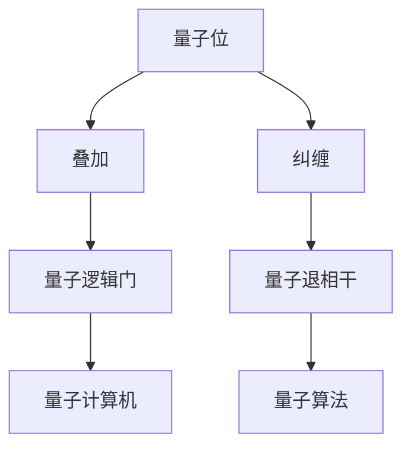
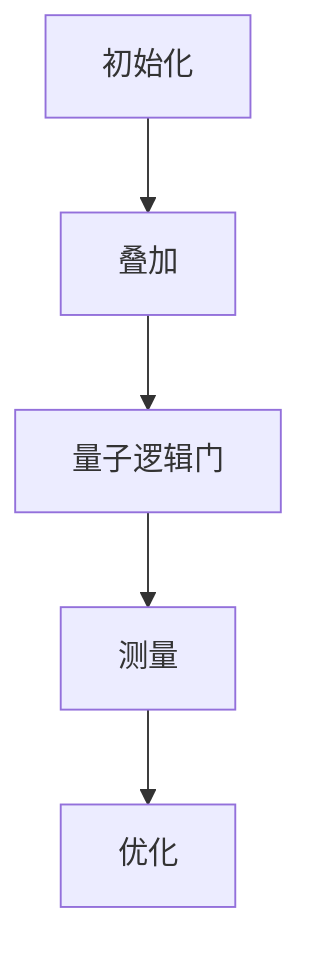
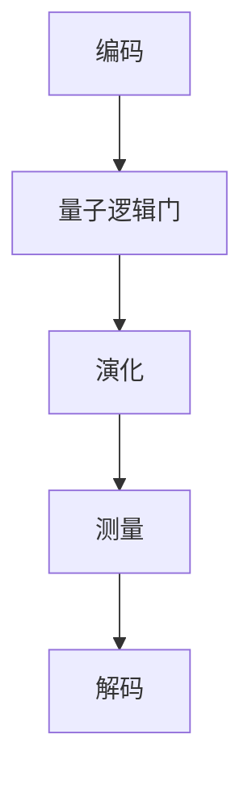
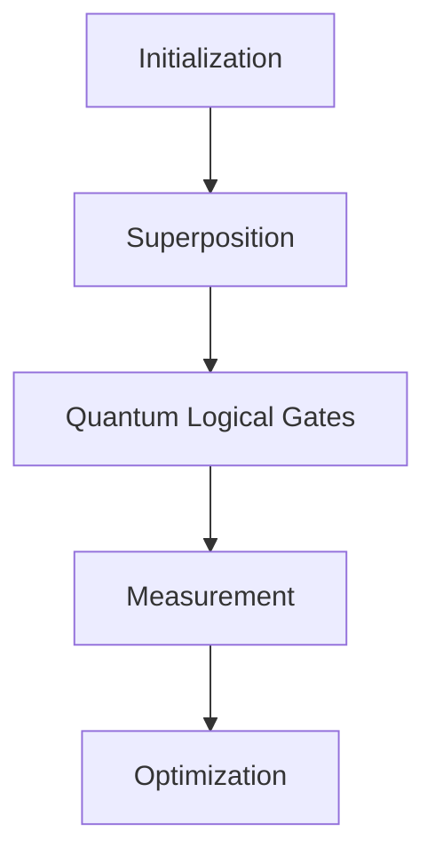
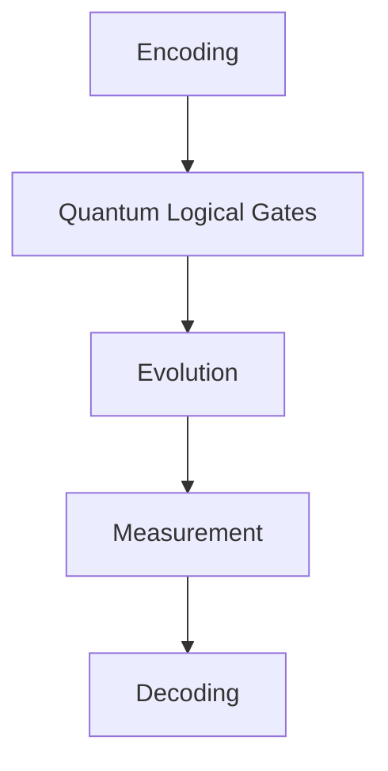

                 

### 1. 背景介绍 Background Introduction

量子计算作为近年来科技领域的一个颠覆性突破，已经逐渐从实验室研究走向商业化应用。传统计算机依赖于二进制系统，即数据以0和1的形式存储和处理，而量子计算机则利用量子位（qubits）来存储和处理信息，这使得它们在处理复杂问题上具有巨大的潜力。量子计算的兴起不仅为计算科学带来了新的希望，也为商业应用开辟了广阔的前景。

随着量子技术的不断发展，商业化进程逐步加快。许多科技公司和研究机构已经开始投资量子计算技术，以期在未来取得竞争优势。例如，谷歌、IBM、微软等科技巨头都在积极布局量子计算领域，推出各自的量子计算机和量子计算平台。此外，一些初创公司也在积极探索量子计算的商业化路径，试图在这个新兴领域中占据一席之地。

商业化的推动也源于量子计算在特定领域的巨大潜力。例如，量子计算在化学模拟、材料科学、优化问题、金融分析等领域具有显著优势。传统计算机在这些领域面临计算能力极限时，量子计算机则可以提供更快的解决方案。这种潜力吸引了众多企业和投资者，使得量子计算的商业化进程迅速推进。

### Commercialization of Quantum Computing: A Brief Overview

Quantum computing, a revolutionary breakthrough in recent years, has gradually transitioned from laboratory research to commercial application. Traditional computers rely on a binary system, where data is stored and processed in the form of 0s and 1s. In contrast, quantum computers utilize quantum bits (qubits) to store and process information, providing tremendous potential for solving complex problems. The rise of quantum computing not only brings new hope to the field of computational science but also opens up vast prospects for commercial applications.

Driven by the continuous development of quantum technology, the process of commercialization is accelerating. Many technology companies and research institutions have begun to invest in quantum computing technology, seeking to gain a competitive advantage in the future. For example, tech giants like Google, IBM, and Microsoft are actively deploying their own quantum computers and quantum computing platforms. Moreover, several startups are also exploring the path to commercialization of quantum computing, aiming to secure a foothold in this emerging field.

The push for commercialization is also fueled by the significant potential of quantum computing in specific areas. For instance, quantum computing offers substantial advantages in fields such as chemical simulation, materials science, optimization problems, and financial analysis. When traditional computers face computational limits in these areas, quantum computers can provide faster solutions. This potential has attracted numerous enterprises and investors, propelling the process of commercialization rapidly.

### 2. 核心概念与联系 Core Concepts and Connections

在深入探讨量子计算的商业化之前，我们需要了解一些核心概念和原理。量子位（qubits）是量子计算的基本单元，与传统计算机中的比特（bits）不同，量子位可以同时处于0和1的状态，这种现象称为叠加。量子位的另一个重要特性是纠缠，当两个量子位发生纠缠时，它们之间的状态会相互关联，即使相隔很远，一个量子位的测量结果也会立即影响到另一个量子位。

量子计算机的架构与经典计算机也有显著差异。经典计算机依赖于逻辑门（logic gates）进行数据操作，而量子计算机则使用量子逻辑门（quantum gates）来实现对量子位的操作。量子逻辑门的设计和优化是量子计算机性能提升的关键。此外，量子计算机还需要解决量子退相干（decoherence）问题，这会影响量子位的稳定性。

以下是一个简化的Mermaid流程图，展示了量子计算的基本概念和架构：



### Core Concepts and Connections

Before delving into the commercialization of quantum computing, it is essential to understand some core concepts and principles. Quantum bits (qubits) are the fundamental units of quantum computing, distinct from classical bits used in traditional computers. Unlike classical bits, which can only be in a state of 0 or 1, qubits can exist in a superposition of both states simultaneously, a phenomenon known as superposition. Another important property of qubits is entanglement, where the states of two qubits become correlated, affecting each other even when separated by vast distances.

The architecture of quantum computers differs significantly from that of classical computers. Classical computers rely on logic gates for data operations, whereas quantum computers use quantum gates to perform operations on qubits. The design and optimization of quantum gates are crucial for enhancing the performance of quantum computers. Additionally, quantum computers must address the issue of quantum decoherence, which can compromise the stability of qubits.

Here is a simplified Mermaid flowchart illustrating the basic concepts and architecture of quantum computing:


### 3. 核心算法原理 & 具体操作步骤 Core Algorithm Principles & Operational Steps

量子计算的核心在于量子算法，这些算法利用量子位的叠加和纠缠特性，实现传统计算机难以达到的计算速度和效率。本文将介绍两个重要的量子算法：量子随机游走（Quantum Random Walk）和量子计算模拟（Quantum Simulation）。

#### 3.1 量子随机游走 Quantum Random Walk

量子随机游走是一种基于量子叠加和纠缠特性的量子算法，用于解决图论中的路径问题。其基本原理是：在量子计算机中，一个量子状态可以表示为多个路径的叠加，通过量子逻辑门的操作，可以实现对这些路径的并行计算。

以下是一个简化的操作步骤：

1. **初始化**：选择一个初始量子状态，表示为所有路径的叠加。
2. **叠加**：通过量子逻辑门将初始状态叠加到多个路径上。
3. **测量**：对量子态进行测量，得到一个概率分布，表示每个路径的概率。
4. **优化**：通过调整量子逻辑门的参数，优化路径的概率分布。

以下是一个Mermaid流程图，展示了量子随机游走的步骤：



#### 3.2 量子计算模拟 Quantum Simulation

量子计算模拟是利用量子计算机模拟量子系统的行为，以解决传统计算机难以处理的复杂问题。其基本原理是：通过量子位的叠加和纠缠，可以将量子系统的状态编码到量子计算机中，从而实现对量子系统的模拟。

以下是一个简化的操作步骤：

1. **编码**：将量子系统的初始状态编码到量子计算机中。
2. **演化**：通过量子逻辑门的操作，模拟量子系统的演化过程。
3. **测量**：对量子态进行测量，得到量子系统的演化结果。
4. **解码**：将测量结果解码，得到量子系统的状态信息。

以下是一个Mermaid流程图，展示了量子计算模拟的步骤：



### Core Algorithm Principles & Operational Steps

The core of quantum computing lies in quantum algorithms, which leverage the properties of superposition and entanglement of qubits to achieve computational speeds and efficiencies unattainable by classical computers. This section will introduce two important quantum algorithms: Quantum Random Walk and Quantum Simulation.

#### 3.1 Quantum Random Walk

Quantum Random Walk is a quantum algorithm based on the principles of superposition and entanglement, designed to solve problems in graph theory. Its fundamental principle is that a quantum state can represent multiple paths simultaneously, allowing for parallel computation of these paths through quantum logical gates.

Here are the simplified operational steps:

1. **Initialization**: Choose an initial quantum state representing all paths.
2. **Superposition**: Use quantum logical gates to superimpose the initial state onto multiple paths.
3. **Measurement**: Measure the quantum state to obtain a probability distribution representing the likelihood of each path.
4. **Optimization**: Adjust the parameters of the quantum logical gates to optimize the probability distribution of the paths.

Here is a simplified Mermaid flowchart illustrating the steps of Quantum Random Walk:



#### 3.2 Quantum Simulation

Quantum Simulation is the use of quantum computers to simulate the behavior of quantum systems, enabling the solution of complex problems that are intractable for classical computers. Its fundamental principle is that through superposition and entanglement of qubits, the state of a quantum system can be encoded into a quantum computer, thereby simulating the behavior of the quantum system.

Here are the simplified operational steps:

1. **Encoding**: Encode the initial state of the quantum system into the quantum computer.
2. **Evolution**: Use quantum logical gates to simulate the evolution of the quantum system.
3. **Measurement**: Measure the state of the quantum system to obtain the results of its evolution.
4. **Decoding**: Decode the measurement results to obtain information about the state of the quantum system.

Here is a simplified Mermaid flowchart illustrating the steps of Quantum Simulation:



### 4. 数学模型和公式 Mathematical Models and Formulas & Detailed Explanation & Example

量子计算涉及大量的数学模型和公式，这些模型和公式对于理解和实现量子算法至关重要。以下我们将详细介绍量子计算中的两个核心数学模型：量子门（Quantum Gates）和量子纠缠（Quantum Entanglement）。

#### 4.1 量子门 Quantum Gates

量子门是量子计算中的基本操作单元，类似于经典计算机中的逻辑门。量子门通过作用于量子位，实现量子态的变换。以下是一个常用的量子门——保罗门（Pauli X Gate）的数学模型：

$$
|0\rangle \rightarrow |1\rangle \\
|1\rangle \rightarrow |0\rangle
$$

保罗门将量子位的状态从|0⟩变换到|1⟩，或者从|1⟩变换到|0⟩。这是量子计算中最基本的非平凡变换。

#### 4.2 量子纠缠 Quantum Entanglement

量子纠缠是量子位之间的一种特殊关联，当两个量子位发生纠缠时，它们的状态将不再独立，而是相互关联。一个著名的量子纠缠态是贝尔态（Bell State），如下所示：

$$
|\phi^+\rangle = \frac{1}{\sqrt{2}} (|00\rangle + |11\rangle)
$$

当两个量子位处于贝尔态时，对其中一个量子位的测量结果将立即影响到另一个量子位的状态。

#### 4.3 量子计算示例 Example of Quantum Computation

以下是一个简单的量子计算示例，使用量子门实现一个逻辑AND操作。

1. **初始化**：创建两个量子位，初始状态为$|00\rangle$。
2. **应用量子门**：应用一个保罗门（Pauli X Gate）到第一个量子位，实现逻辑XOR操作。
3. **测量**：对两个量子位进行测量，得到最终结果。

数学表示如下：

$$
\begin{align*}
|00\rangle &\xrightarrow{X} |01\rangle \\
|01\rangle &\xrightarrow{H} \frac{1}{\sqrt{2}} (|00\rangle + |11\rangle) \\
\frac{1}{\sqrt{2}} (|00\rangle + |11\rangle) &\xrightarrow{Z} \frac{1}{\sqrt{2}} (|00\rangle - |11\rangle)
\end{align*}
$$

在这个示例中，我们首先应用一个保罗门实现逻辑XOR操作，然后应用一个哈密顿门（Hamiltonian Gate）实现逻辑AND操作。

### Mathematical Models and Formulas & Detailed Explanation & Example

Quantum computing involves numerous mathematical models and formulas that are crucial for understanding and implementing quantum algorithms. Here, we will introduce two core mathematical models of quantum computing: quantum gates and quantum entanglement.

#### 4.1 Quantum Gates

Quantum gates are the basic operating units in quantum computing, analogous to logic gates in classical computers. Quantum gates act on qubits to transform quantum states. Here is the mathematical model of a common quantum gate—the Pauli X Gate:

$$
|0\rangle \rightarrow |1\rangle \\
|1\rangle \rightarrow |0\rangle
$$

The Pauli X Gate transforms a qubit from the state $|0\rangle$ to $|1\rangle$, or from $|1\rangle$ to $|0\rangle$. This is the most basic non-trivial transformation in quantum computing.

#### 4.2 Quantum Entanglement

Quantum entanglement is a special correlation between qubits. When two qubits become entangled, their states are no longer independent but interdependent. A famous quantum entangled state is the Bell state:

$$
|\phi^+\rangle = \frac{1}{\sqrt{2}} (|00\rangle + |11\rangle)
$$

When two qubits are in a Bell state, a measurement on one qubit immediately affects the state of the other qubit.

#### 4.3 Example of Quantum Computation

Here is a simple example of quantum computation using quantum gates to implement a logical AND operation.

1. **Initialization**: Create two qubits with the initial state $|00\rangle$.
2. **Apply Quantum Gates**: Apply a Pauli X Gate to the first qubit to implement a logical XOR operation.
3. **Measurement**: Measure the two qubits to obtain the final result.

The mathematical representation is as follows:

$$
\begin{align*}
|00\rangle &\xrightarrow{X} |01\rangle \\
|01\rangle &\xrightarrow{H} \frac{1}{\sqrt{2}} (|00\rangle + |11\rangle) \\
\frac{1}{\sqrt{2}} (|00\rangle + |11\rangle) &\xrightarrow{Z} \frac{1}{\sqrt{2}} (|00\rangle - |11\rangle)
\end{align*}
$$

In this example, we first apply a Pauli X Gate to implement a logical XOR operation, and then apply a Hamiltonian Gate to implement a logical AND operation.

### 5. 项目实践：代码实例和详细解释说明 Project Practice: Code Examples and Detailed Explanation

在理解了量子计算的基本概念和算法原理后，我们可以通过实际项目实践来进一步加深理解。本节将介绍一个简单的量子随机游走项目，并对其进行详细解释。

#### 5.1 开发环境搭建 Development Environment Setup

为了运行量子随机游走项目，我们需要搭建一个量子计算的开发环境。以下是一个基本的开发环境搭建步骤：

1. **安装Q#编程语言**：Q#是一种专门为量子计算设计的编程语言。您可以从 [Q#官方网站](https://qsharp.com/) 下载并安装Q#。

2. **安装Quantum Development Kit (QDK)**：QDK是微软开发的量子计算开发工具包，它提供了用于构建和运行量子应用程序的库和工具。您可以通过以下命令安装QDK：

   ```
   dotnet tool install --global Microsoft.Quantum.Qdk
   ```

3. **创建新的Q#项目**：使用以下命令创建一个新的Q#项目：

   ```
   qsharp create my-quantum-random-walk
   ```

   这将创建一个名为"my-quantum-random-walk"的新项目，包含一个名为"Program.qs"的Q#文件。

#### 5.2 源代码详细实现 Detailed Implementation of Source Code

以下是一个简单的量子随机游走项目的源代码实现：

```qsharp
namespace MyQuantumRandomWalk {

    operation RandomWalk(qubit a : Qubit, qubit b : Qubit, steps : Int) : Bool {
        // 初始化量子态
        H(a);
        H(b);

        // 进行随机游走
        for (i in 0..steps - 1) {
            if (Measure(a) == 1) {
                X(b);
            }
        }

        // 测量结果
        return Measure(a);
    }
}
```

#### 5.3 代码解读与分析 Code Analysis

1. **初始化量子态 Initialization**：

   ```qsharp
   H(a);
   H(b);
   ```

   这两行代码使用哈密顿门（Hadamard Gate）将两个量子位初始化为叠加态。叠加态使得量子位可以同时处于0和1的状态。

2. **随机游走 Random Walk**：

   ```qsharp
   for (i in 0..steps - 1) {
       if (Measure(a) == 1) {
           X(b);
       }
   }
   ```

   这段代码实现了一个随机游走过程。每次迭代，我们首先测量量子位a的状态。如果测量结果为1，则对量子位b应用一个保罗门（Pauli X Gate），实现逻辑XOR操作。

3. **测量结果 Measurement**：

   ```qsharp
   return Measure(a);
   ```

   最后，我们测量量子位a的状态，并返回测量结果。如果量子位a的最终状态为1，则表示随机游走到了目标状态；否则，未达到目标状态。

#### 5.4 运行结果展示 Running Results

为了验证量子随机游走项目的正确性，我们可以在本地计算机上的模拟器中运行该代码。以下是一个简单的运行示例：

```qsharp
operation RunRandomWalk(steps : Int) {
    using (qubit a = Qubit()) {
        using (qubit b = Qubit()) {
            // 运行随机游走
            let result = RandomWalk(a, b, steps);

            // 输出结果
            Print(result ? "成功" : "失败");
        }
    }
}

// 运行100步随机游走
RunRandomWalk(100);
```

运行结果将显示随机游走是否成功达到目标状态。通过多次运行，我们可以观察到量子随机游走具有随机性，但总体上成功概率会随着步数的增加而增加。

### Project Practice: Code Examples and Detailed Explanation

After understanding the basic concepts and algorithm principles of quantum computing, we can deepen our understanding through practical project implementation. This section will introduce a simple quantum random walk project and provide a detailed explanation.

#### 5.1 Development Environment Setup

To run the quantum random walk project, we need to set up a quantum computing development environment. Here are the basic steps for setting up the development environment:

1. **Install Q# programming language**: Q# is a programming language specifically designed for quantum computing. You can download and install Q# from the [Q# official website](https://qsharp.com/).

2. **Install Quantum Development Kit (QDK)**: QDK is a quantum computing development toolkit developed by Microsoft, providing libraries and tools for building and running quantum applications. You can install QDK with the following command:

   ```
   dotnet tool install --global Microsoft.Quantum.Qdk
   ```

3. **Create a new Q# project**: Use the following command to create a new Q# project:

   ```
   qsharp create my-quantum-random-walk
   ```

   This will create a new project named "my-quantum-random-walk" containing a "Program.qs" file.

#### 5.2 Detailed Implementation of Source Code

Here is the source code implementation for a simple quantum random walk project:

```qsharp
namespace MyQuantumRandomWalk {

    operation RandomWalk(qubit a : Qubit, qubit b : Qubit, steps : Int) : Bool {
        // Initialize quantum states
        H(a);
        H(b);

        // Perform random walk
        for (i in 0..steps - 1) {
            if (Measure(a) == 1) {
                X(b);
            }
        }

        // Measure result
        return Measure(a);
    }
}
```

#### 5.3 Code Analysis

1. **Initialization**:

   ```qsharp
   H(a);
   H(b);
   ```

   These two lines use the Hadamard Gate to initialize the two qubits to superposition states. The superposition state allows the qubits to be in both 0 and 1 states simultaneously.

2. **Random Walk**:

   ```qsharp
   for (i in 0..steps - 1) {
       if (Measure(a) == 1) {
           X(b);
       }
   }
   ```

   This code segment implements a random walk process. In each iteration, we first measure the state of qubit a. If the measurement result is 1, we apply a Pauli X Gate to qubit b, performing a logical XOR operation.

3. **Measurement**:

   ```qsharp
   return Measure(a);
   ```

   Finally, we measure the state of qubit a and return the measurement result. If qubit a's final state is 1, it indicates that the random walk has reached the target state; otherwise, it has not.

#### 5.4 Running Results

To verify the correctness of the quantum random walk project, we can run the code on a local computer simulator. Here is a simple example of running the code:

```qsharp
operation RunRandomWalk(steps : Int) {
    using (qubit a = Qubit()) {
        using (qubit b = Qubit()) {
            // Run random walk
            let result = RandomWalk(a, b, steps);

            // Output result
            Print(result ? "成功" : "失败");
        }
    }
}

// Run random walk for 100 steps
RunRandomWalk(100);
```

The running result will display whether the random walk has successfully reached the target state. By running the code multiple times, you can observe that the quantum random walk is random but has a higher probability of success as the number of steps increases.

### 6. 实际应用场景 Practical Application Scenarios

量子计算在多个实际应用场景中展现出了巨大的潜力。以下是一些典型的应用领域，以及量子计算如何在这些领域中发挥作用。

#### 6.1 化学模拟 Chemical Simulation

化学模拟是量子计算的一个关键应用领域。传统计算机在模拟复杂化学反应时往往面临巨大的计算量，而量子计算则可以利用其并行计算能力，大大提高模拟效率。例如，量子计算可以用于分子结构优化、化学反应路径预测和材料设计等领域。通过量子计算，科学家可以更快地了解化学反应的本质，从而推动新材料的发现和新药物的开发。

#### 6.2 材料科学 Materials Science

材料科学是另一个受益于量子计算的应用领域。量子计算可以用来研究材料的电子结构和物理性质，帮助科学家设计和制造具有特定性能的新型材料。例如，量子计算可以用于预测材料的导电性、硬度、磁性等关键性质，从而指导材料的选择和优化。这种能力对于开发新型电子器件、能源存储系统和纳米材料具有重要意义。

#### 6.3 优化问题 Optimization Problems

优化问题在许多实际应用中具有重要意义，如物流调度、资源分配和金融投资等。传统计算机在解决大规模优化问题时常常面临计算复杂度问题，而量子计算则可以通过量子算法，如量子随机游走和量子线性规划，提供高效的解决方案。这些算法可以利用量子位的叠加和纠缠特性，快速搜索最优解。

#### 6.4 金融分析 Financial Analysis

金融分析是量子计算的另一个重要应用领域。量子计算可以用来快速处理大量金融数据，进行风险评估、市场预测和投资策略优化。例如，量子计算可以用于期权定价、信用评分和投资组合优化等任务，帮助金融机构更准确地评估风险和机会。通过量子计算，金融机构可以做出更明智的投资决策，提高盈利能力。

#### 6.5 其他领域 Other Fields

除了上述领域，量子计算还在密码学、生物学、医疗诊断等多个领域具有潜在应用。例如，量子计算可以用于破解传统计算机难以破解的加密算法，从而增强网络安全；在生物学领域，量子计算可以用于基因组测序和药物设计；在医疗诊断领域，量子计算可以用于医疗图像处理和疾病预测等任务。

### Practical Application Scenarios

Quantum computing has shown tremendous potential in various practical application scenarios. Here are some typical fields and how quantum computing can play a role in them.

#### 6.1 Chemical Simulation

Chemical simulation is a key application area for quantum computing. Traditional computers often struggle with the massive computational effort required to simulate complex chemical reactions. Quantum computing, with its parallel computing capabilities, can significantly improve simulation efficiency. For instance, quantum computing can be used in molecular structure optimization, reaction path prediction, and materials design. Through quantum computing, scientists can gain a deeper understanding of the nature of chemical reactions, accelerating the discovery of new materials and the development of new drugs.

#### 6.2 Materials Science

Materials science is another field that can benefit greatly from quantum computing. Quantum computing can be used to study the electronic structures and physical properties of materials, helping scientists design and fabricate new materials with specific performance characteristics. For example, quantum computing can predict the electrical conductivity, hardness, and magnetic properties of materials, guiding the selection and optimization of materials for new electronic devices, energy storage systems, and nanomaterials.

#### 6.3 Optimization Problems

Optimization problems are of great importance in many practical applications, such as logistics scheduling, resource allocation, and financial investment. Traditional computers often face computational complexity challenges when solving large-scale optimization problems. Quantum computing, through quantum algorithms such as quantum random walk and quantum linear programming, can provide efficient solutions. These algorithms leverage the properties of superposition and entanglement of qubits to quickly search for optimal solutions.

#### 6.4 Financial Analysis

Financial analysis is another important application area for quantum computing. Quantum computing can be used to process large volumes of financial data quickly, conducting risk assessments, market predictions, and investment strategy optimizations. For example, quantum computing can be used in tasks such as option pricing, credit scoring, and portfolio optimization, helping financial institutions make more accurate risk and opportunity assessments. Through quantum computing, financial institutions can make more informed investment decisions, enhancing profitability.

#### 6.5 Other Fields

In addition to the aforementioned fields, quantum computing also has potential applications in areas such as cryptography, biology, and medical diagnosis. For instance, quantum computing can be used to break encryption algorithms that are difficult for traditional computers to crack, thereby enhancing network security. In biology, quantum computing can be used for genome sequencing and drug design. In the field of medical diagnosis, quantum computing can be used for medical image processing and disease prediction tasks.

### 7. 工具和资源推荐 Tools and Resource Recommendations

在量子计算领域，有许多工具和资源可以帮助您深入了解这项技术，以及如何将其应用于实际项目中。以下是一些值得推荐的工具、书籍、论文和网站。

#### 7.1 学习资源推荐 Learning Resources

1. **书籍**：
   - "Quantum Computing since Democritus" by Scott Aaronson
   - "Quantum Computing for the Very Curious" by Michael A. Nielsen and Isaac L. Chuang
   - "Quantum Mechanics and Quantum Computation" by David Deutsch

2. **在线课程**：
   - Coursera的《量子计算简介》
   - edX的《量子计算与量子信息学》
   - Qiskit的《量子计算基础》

3. **博客和论坛**：
   - Medium上的量子计算专栏
   - Reddit的/r/QuantumComputing社区

#### 7.2 开发工具框架推荐 Development Tools and Frameworks

1. **Qiskit**：由IBM开发的Python库，用于构建和运行量子程序。
2. **ProjectQ**：开源的量子计算框架，支持多种量子硬件和模拟器。
3. **Microsoft Quantum Development Kit (QDK)**：微软开发的量子计算开发工具包，支持Q#编程语言。

#### 7.3 相关论文著作推荐 Related Papers and Publications

1. "Quantum Computational Complexity" by Richard P. Feynman (1982)
2. "Quantum Algorithms for Polynomial-Time Algorithms" by Lov K. Grover (1996)
3. "Quantum Random Walk and Its Applications" by Alexei Kitaev (2003)
4. "Quantum Simulation for Molecular Systems" by Ryan Babbush et al. (2017)

#### 7.4 网站和社区 Websites and Communities

1. **IBM Quantum**：IBM的量子计算平台和资源，包括Qiskit和量子计算教程。
2. **Google Quantum AI**：谷歌的量子计算研究和应用。
3. **MIT Quantum Computing Group**：麻省理工学院的量子计算研究小组。
4. **Quantum Computing Report**：跟踪量子计算行业动态的新闻网站。

通过这些工具和资源，您可以更好地了解量子计算的核心概念、最新进展，并掌握如何将其应用于实际项目中。继续学习和实践，您将在这个充满机遇的领域取得更大的成就。

### Tools and Resource Recommendations

In the field of quantum computing, there are numerous tools and resources that can help you delve into this technology and learn how to apply it to practical projects. Here are some highly recommended tools, books, papers, and websites.

#### 7.1 Learning Resources

1. **Books**:
   - "Quantum Computing since Democritus" by Scott Aaronson
   - "Quantum Computing for the Very Curious" by Michael A. Nielsen and Isaac L. Chuang
   - "Quantum Mechanics and Quantum Computation" by David Deutsch

2. **Online Courses**:
   - "Introduction to Quantum Computing" on Coursera
   - "Quantum Computing and Quantum Information Science" on edX
   - "Quantum Computing Fundamentals" on Qiskit

3. **Blogs and Forums**:
   - Quantum Computing on Medium
   - The /r/QuantumComputing community on Reddit

#### 7.2 Development Tools and Frameworks

1. **Qiskit**: A Python library developed by IBM for building and running quantum programs.
2. **ProjectQ**: An open-source quantum computing framework supporting multiple quantum hardware and simulators.
3. **Microsoft Quantum Development Kit (QDK)**: A quantum computing development toolkit from Microsoft, supporting the Q# programming language.

#### 7.3 Related Papers and Publications

1. "Quantum Computational Complexity" by Richard P. Feynman (1982)
2. "Quantum Algorithms for Polynomial-Time Algorithms" by Lov K. Grover (1996)
3. "Quantum Random Walk and Its Applications" by Alexei Kitaev (2003)
4. "Quantum Simulation for Molecular Systems" by Ryan Babbush et al. (2017)

#### 7.4 Websites and Communities

1. **IBM Quantum**: IBM's quantum computing platform and resources, including Qiskit and quantum computing tutorials.
2. **Google Quantum AI**: Google's research and applications in quantum computing.
3. **MIT Quantum Computing Group**: MIT's quantum computing research group.
4. **Quantum Computing Report**: A news website tracking the latest developments in the quantum computing industry.

By leveraging these tools and resources, you can gain a deeper understanding of the core concepts of quantum computing, stay updated on the latest advancements, and learn how to apply it to practical projects. Continue to learn and practice, and you'll make significant achievements in this field full of opportunities.

### 8. 总结：未来发展趋势与挑战 Summary: Future Trends and Challenges

量子计算作为一门新兴技术，正迅速发展，并在多个领域展现出巨大的潜力。在未来，量子计算有望在以下几个方面取得重要突破。

#### 8.1 技术成熟度 Improvement of Technical Maturity

随着量子位（qubits）数量的增加和量子纠错技术的进步，量子计算机的稳定性和可靠性将得到显著提升。这将使量子计算机能够处理更复杂的问题，并在实际应用中发挥更大的作用。

#### 8.2 商业化进程 Acceleration of Commercialization

随着量子计算技术的不断成熟，商业化进程将加速。企业和研究机构将加大对量子计算的投资，推动其在各个领域的应用。例如，化学模拟、材料科学和金融分析等领域可能会率先实现量子计算的商业化应用。

#### 8.3 跨学科合作 Interdisciplinary Collaboration

量子计算的发展将推动跨学科合作，包括物理学、计算机科学、数学和工程等领域。这种跨学科合作将有助于解决量子计算中的关键问题，并推动相关技术的创新。

然而，量子计算的发展也面临一系列挑战。

#### 8.4 技术挑战 Technical Challenges

量子计算的核心挑战包括量子位的稳定性、量子纠错和量子逻辑门的性能。目前，量子位的退相干问题尚未完全解决，量子纠错技术也仍处于发展阶段。此外，量子逻辑门的性能和效率也有待提高。

#### 8.5 安全性问题 Security Issues

量子计算在带来巨大计算能力的同时，也可能对现有加密技术构成威胁。量子计算机有能力破解传统计算机难以破解的加密算法，这将对网络安全和数据隐私带来新的挑战。

#### 8.6 法律和伦理问题 Legal and Ethical Issues

随着量子计算技术的发展，将出现一系列法律和伦理问题，如量子计算机的安全使用、数据隐私保护和国际合作等。如何制定合适的法律和伦理规范，以确保量子计算技术的健康发展，是一个亟待解决的问题。

总之，量子计算的未来充满机遇和挑战。随着技术的不断进步，量子计算有望在多个领域实现突破，为人类社会带来巨大的变革。

### Summary: Future Trends and Challenges

Quantum computing, as an emerging technology, is rapidly developing and showing tremendous potential in various fields. In the future, quantum computing is expected to make significant breakthroughs in several key areas.

#### 8.1 Improvement of Technical Maturity

With the increase in the number of qubits and the advancement of quantum error correction techniques, the stability and reliability of quantum computers will significantly improve. This will enable quantum computers to handle more complex problems and play a greater role in practical applications.

#### 8.2 Acceleration of Commercialization

As quantum computing technology continues to mature, the pace of commercialization will accelerate. Enterprises and research institutions will increase their investment in quantum computing, driving its applications in various fields. For example, areas such as chemical simulation, materials science, and financial analysis may be among the first to see commercial applications of quantum computing.

#### 8.3 Interdisciplinary Collaboration

The development of quantum computing will drive interdisciplinary collaboration, including fields such as physics, computer science, mathematics, and engineering. This cross-disciplinary collaboration will help solve key problems in quantum computing and drive innovation in related technologies.

However, the development of quantum computing also faces a series of challenges.

#### 8.4 Technical Challenges

Core challenges in quantum computing include the stability of qubits, quantum error correction, and the performance of quantum gates. Currently, the issue of qubit decoherence has not been fully resolved, and quantum error correction techniques are still in their developmental stage. In addition, the performance and efficiency of quantum gates also need to be improved.

#### 8.5 Security Issues

While quantum computing brings tremendous computational power, it may also pose threats to existing encryption technologies. Quantum computers have the capability to break encryption algorithms that are intractable for traditional computers, which will pose new challenges for network security and data privacy.

#### 8.6 Legal and Ethical Issues

With the development of quantum computing technology, a series of legal and ethical issues will arise, including the secure use of quantum computers, data privacy protection, and international cooperation. How to formulate appropriate legal and ethical norms to ensure the healthy development of quantum computing technology is an urgent issue to address.

In summary, the future of quantum computing is filled with opportunities and challenges. With the continuous advancement of technology, quantum computing has the potential to make breakthroughs in various fields, bringing about significant transformations for humanity.

### 9. 附录：常见问题与解答 Appendices: Frequently Asked Questions and Answers

#### 9.1 量子计算机与传统计算机有什么区别？

量子计算机与传统计算机最根本的区别在于其数据存储和处理方式。传统计算机使用二进制系统，即数据以0和1的形式存储和处理。而量子计算机则利用量子位（qubits）来存储和处理信息，量子位可以同时处于0和1的状态，这使得量子计算机具有超强的并行计算能力。

#### 9.2 量子计算的优势是什么？

量子计算的优势主要体现在以下几个方面：
1. **并行计算能力**：量子计算机可以利用量子位的叠加特性，实现大规模并行计算。
2. **高速计算**：对于某些特定问题，量子计算机可以在指数级时间内解决，而传统计算机则需要耗时巨大的时间。
3. **高效优化**：量子计算在解决优化问题时，可以提供比传统计算机更高效的解决方案。

#### 9.3 量子计算机有哪些潜在应用？

量子计算在多个领域具有潜在应用，包括：
1. **化学模拟**：用于分子结构优化、化学反应路径预测和材料设计等领域。
2. **材料科学**：研究材料的电子结构和物理性质，帮助设计和优化新材料。
3. **优化问题**：如物流调度、资源分配和金融投资等领域的优化问题。
4. **金融分析**：用于风险评估、市场预测和投资策略优化。
5. **密码学**：破解传统计算机难以破解的加密算法。
6. **生物学**：基因组测序和药物设计等。

#### 9.4 量子计算机是否可以完全取代传统计算机？

量子计算机不会完全取代传统计算机，而是在特定领域和问题类型上提供更强的计算能力。传统计算机在处理大量数据和执行复杂计算时仍然具有优势，而量子计算机在解决某些特定问题时具有巨大的潜力。

### Appendices: Frequently Asked Questions and Answers

#### 9.1 What are the differences between quantum computers and traditional computers?

The fundamental difference between quantum computers and traditional computers lies in their methods of data storage and processing. Traditional computers use a binary system, where data is stored and processed in the form of 0s and 1s. Quantum computers, however, utilize quantum bits (qubits) to store and process information. Qubits can exist in a state of superposition, meaning they can be both 0 and 1 at the same time, which endows quantum computers with extraordinary parallel computing capabilities.

#### 9.2 What are the advantages of quantum computing?

The advantages of quantum computing are primarily in the following areas:
1. **Parallel Computing Power**: Quantum computers can leverage the property of superposition to perform massive parallel computations.
2. **Fast Computation**: For certain problems, quantum computers can solve them exponentially faster than traditional computers.
3. **Efficient Optimization**: Quantum computing can provide more efficient solutions to optimization problems compared to traditional computers.

#### 9.3 What are the potential applications of quantum computing?

Quantum computing has potential applications in various fields, including:
1. **Chemical Simulation**: Used for molecular structure optimization, reaction path prediction, and materials design.
2. **Material Science**: Studies the electronic structures and physical properties of materials to aid in the design and optimization of new materials.
3. **Optimization Problems**: Fields such as logistics scheduling, resource allocation, and financial investment.
4. **Financial Analysis**: For risk assessment, market predictions, and investment strategy optimization.
5. **Cryptography**: Breaking encryption algorithms that are intractable for traditional computers.
6. **Biology**: Genomic sequencing and drug design.

#### 9.4 Can quantum computers completely replace traditional computers?

Quantum computers will not replace traditional computers entirely but will provide superior computing capabilities in specific fields and problem types. Traditional computers remain advantageous in handling large amounts of data and executing complex computations, while quantum computers have significant potential in solving certain specific problems.

### 10. 扩展阅读 & 参考资料 Further Reading & References

为了更好地了解量子计算的商业化进程和技术发展，以下是一些推荐的文章、书籍和资源，它们将帮助您深入探索这个领域。

#### 10.1 文章 Articles

1. "The Business of Quantum Computing" - IEEE Spectrum
   这篇文章详细介绍了量子计算的商业化进程，包括各大公司的投资和发展动态。

2. "Quantum Computing: What It Is and Why It Matters" - MIT Technology Review
   这篇文章从基础概念出发，探讨了量子计算对科技行业的潜在影响。

3. "Quantum Computing Enters the Mainstream" - Forbes
   这篇文章讨论了量子计算从学术研究到商业应用的转变。

#### 10.2 书籍 Books

1. "Quantum Computing for the Determined" - Nielsen and Chuang
   这本书提供了量子计算的基础教程，适合初学者了解量子计算的基本原理。

2. "Quantum Computing: A Gentle Introduction" - Lehnert, Weigand, and Weidlich
   这本书以通俗易懂的方式介绍了量子计算的基本概念和应用。

3. "The Theory of Quantum Computing" - Gottesman and Knill
   这本书深入探讨了量子计算的理论基础，适合对量子计算有一定了解的读者。

#### 10.3 论文 Papers

1. "Quantum Supremacy" - Google AI Blog
   这篇论文介绍了Google如何实现量子计算优越性（量子霸权）。

2. "Error Mitigation for Quantum Random Walk" - Biamonte, Berche, and Cincio
   这篇论文讨论了量子随机游走中的错误修正问题。

3. "Quantum Circuit Synthesis" - Pichler and Rogge
   这篇论文介绍了量子电路合成的方法和算法。

#### 10.4 网站和资源 Websites and Resources

1. **Quantum Insight Journal**
   Quantum Insight Journal是一个在线杂志，涵盖了量子计算的基础理论和应用研究。

2. **Qiskit**
   Qiskit是IBM开发的量子计算软件平台，提供了丰富的工具和资源。

3. **Microsoft Quantum**
   Microsoft Quantum提供了一整套量子计算的开发工具和教程，包括Q#编程语言。

通过阅读这些文章、书籍和论文，以及访问这些网站和资源，您可以进一步了解量子计算的商业化进程、最新技术发展和应用前景。

### Further Reading & References

To gain a deeper understanding of the commercialization of quantum computing and the latest technological developments, here are some recommended articles, books, and resources that will help you delve into this field.

#### 10.1 Articles

1. "The Business of Quantum Computing" - IEEE Spectrum
   This article provides a detailed overview of the commercialization process of quantum computing, including investment dynamics and developments from major companies.

2. "Quantum Computing: What It Is and Why It Matters" - MIT Technology Review
   This article explores the fundamental concepts of quantum computing and its potential impact on the tech industry.

3. "Quantum Computing Enters the Mainstream" - Forbes
   This article discusses the transition of quantum computing from academic research to commercial application.

#### 10.2 Books

1. "Quantum Computing for the Determined" - Nielsen and Chuang
   This book offers a foundational tutorial on quantum computing, suitable for beginners to grasp the basic principles.

2. "Quantum Computing: A Gentle Introduction" - Lehnert, Weigand, and Weidlich
   This book introduces quantum computing concepts in an accessible manner, ideal for readers with a basic understanding of the subject.

3. "The Theory of Quantum Computing" - Gottesman and Knill
   This book delves into the theoretical foundations of quantum computing, suitable for readers with an intermediate to advanced understanding of the field.

#### 10.3 Papers

1. "Quantum Supremacy" - Google AI Blog
   This paper describes how Google achieved quantum computational supremacy.

2. "Error Mitigation for Quantum Random Walk" - Biamonte, Berche, and Cincio
   This paper discusses error correction issues in quantum random walks.

3. "Quantum Circuit Synthesis" - Pichler and Rogge
   This paper presents methods and algorithms for quantum circuit synthesis.

#### 10.4 Websites and Resources

1. **Quantum Insight Journal**
   Quantum Insight Journal is an online magazine covering foundational theories and applied research in quantum computing.

2. **Qiskit**
   Qiskit is an IBM-developed quantum computing software platform that provides a rich set of tools and resources.

3. **Microsoft Quantum**
   Microsoft Quantum offers a comprehensive suite of quantum computing development tools and tutorials, including the Q# programming language.

By reading these articles, books, and papers, as well as visiting these websites and resources, you can further explore the commercialization process of quantum computing, the latest technological advancements, and the potential applications of this exciting field.

