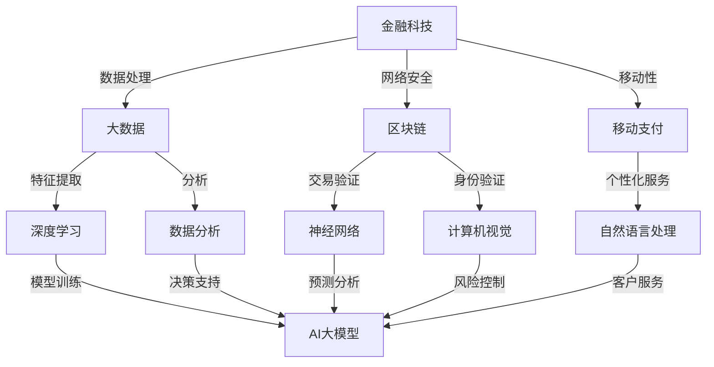

                 

### 背景介绍

#### 金融科技的发展历程

金融科技（FinTech）是指利用现代科技手段，特别是信息技术，对传统金融业务进行创新和升级的一类技术和业务模式。自20世纪末以来，金融科技经历了几个重要发展阶段。

第一阶段是互联网技术的普及。从1990年代末到2000年代初，互联网的兴起使得网上银行、电子支付和电子商务成为可能。这个时期，金融科技主要集中在前端用户体验的提升上，例如网上银行和在线支付。

第二阶段是移动支付的兴起。2010年后，随着智能手机的普及和移动互联网的快速发展，移动支付迅速崛起。微信支付、支付宝等移动支付平台的出现，极大地改变了人们的支付习惯，提高了交易效率。

第三阶段是区块链和人工智能的融合。近年来，区块链技术和人工智能在金融领域的应用成为热点。区块链为金融交易提供了去中心化的安全机制，而人工智能则为金融决策提供了更加智能化的支持。

#### AI大模型的概念

AI大模型是指具有大规模参数和复杂结构的机器学习模型，例如Transformer、BERT、GPT等。这些模型通常需要大量的数据和计算资源进行训练，但在处理自然语言处理、图像识别、语音识别等任务上表现出色。

AI大模型的核心特点是：

1. **大规模参数**：大模型拥有数亿到数十亿个参数，这使得它们能够捕捉到数据中的细微特征。
2. **多层结构**：大模型通常包含多层神经网络，每一层都对输入数据进行特征提取和转换。
3. **端到端训练**：大模型能够直接从原始数据中学习，无需人工设计特征。
4. **自适应能力**：大模型能够根据不同的任务和数据集自适应调整参数。

#### 金融科技与AI大模型结合的背景

金融科技和AI大模型的结合具有以下几个背景因素：

1. **数据量的爆炸式增长**：随着互联网和金融交易的普及，金融数据量呈指数级增长。这些数据为AI大模型的训练提供了丰富的素材。
2. **金融需求的复杂性**：金融领域涉及的风险管理、投资策略、客户服务等方面日益复杂，需要更加智能化的工具进行决策支持。
3. **技术的进步**：云计算、大数据处理和深度学习技术的快速发展，使得AI大模型在金融领域的应用成为可能。

#### 结合的重要性

金融科技与AI大模型的结合具有重要意义：

1. **提升效率**：AI大模型能够自动化和智能化地处理金融任务，减少人力成本，提高业务处理速度。
2. **降低风险**：AI大模型通过分析海量数据，可以提前预测市场变化，降低金融风险。
3. **优化决策**：AI大模型能够提供基于数据的洞察和建议，帮助金融机构和投资者做出更加明智的决策。
4. **增强用户体验**：AI大模型可以提供个性化服务，提升用户满意度和忠诚度。

综上所述，金融科技和AI大模型的结合是金融行业发展的重要趋势，为金融创新和业务优化提供了强大的技术支持。

### 核心概念与联系

为了深入探讨金融科技与AI大模型的结合点，我们首先需要明确两者的核心概念和基本原理，并通过Mermaid流程图展示其关联结构。

#### 金融科技的核心概念

金融科技涉及多个领域，包括支付、借贷、投资、保险等。其核心概念主要包括：

1. **区块链**：一种分布式数据库技术，通过加密算法确保数据的安全性和不可篡改性。
2. **大数据**：通过收集、存储和分析海量数据，挖掘有价值的信息。
3. **云计算**：通过网络提供可扩展的计算资源，实现快速的数据处理和存储。
4. **移动支付**：利用智能手机等移动设备进行支付，提高交易便捷性。

#### AI大模型的核心概念

AI大模型主要基于深度学习和神经网络技术，其核心概念包括：

1. **深度学习**：一种基于神经网络的机器学习技术，通过多层神经网络对数据进行特征提取和转换。
2. **神经网络**：一种由大量神经元互联组成的计算模型，能够通过学习数据自动提取特征。
3. **自然语言处理（NLP）**：利用机器学习技术理解和生成自然语言。
4. **计算机视觉**：使计算机能够像人一样理解和解释视觉信息。

#### 金融科技与AI大模型的关联结构

下面是金融科技与AI大模型结合的Mermaid流程图，展示了两者之间的核心关联：



#### 关键概念的解释与关联

1. **数据处理（B）**：大数据技术是金融科技的基础，通过对海量金融数据进行处理，提取有价值的信息。这些数据被用于深度学习模型的训练，实现特征提取和模式识别。
2. **区块链（C）**：区块链技术为金融交易提供了去中心化的安全机制。通过加密算法，区块链确保了数据的不可篡改性和安全性。神经网络和计算机视觉技术可以用于区块链的交易验证和身份验证。
3. **移动支付（D）**：移动支付技术使得用户能够通过智能手机进行便捷的支付操作。自然语言处理技术可以用于移动支付平台的个性化服务和客户服务。
4. **深度学习（E）**：深度学习技术通过多层神经网络对金融数据进行特征提取和转换，是AI大模型的核心组成部分。深度学习模型可以用于大数据分析、决策支持和风险控制。
5. **数据分析（F）**：数据分析技术在金融科技中用于提取和处理数据，为金融决策提供支持。AI大模型可以增强数据分析的效率和准确性。
6. **神经网络（G）**：神经网络是深度学习的基础，通过多层结构实现对数据的复杂建模。神经网络在区块链交易验证和风险控制中具有重要应用。
7. **计算机视觉（H）**：计算机视觉技术用于理解图像和视频，可以在金融科技领域用于身份验证和风险控制。
8. **自然语言处理（I）**：自然语言处理技术使计算机能够理解和生成自然语言，可以用于移动支付的个性化服务和客户服务。

通过上述Mermaid流程图和核心概念解释，我们可以清晰地看到金融科技与AI大模型之间的关联。接下来，我们将进一步探讨AI大模型的核心算法原理及其在金融科技中的具体应用。

### 核心算法原理 & 具体操作步骤

#### 1. Transformer模型

Transformer模型是AI大模型中的一种重要架构，由Google在2017年提出，主要用于自然语言处理（NLP）任务。其核心思想是自注意力机制（Self-Attention），这使得模型能够在处理序列数据时捕捉长距离依赖关系。

**具体操作步骤：**

1. **嵌入（Embedding）**：将输入的词或句子转换为向量表示。这一步通过词嵌入（Word Embedding）或嵌入层（Embedding Layer）完成。
2. **位置编码（Positional Encoding）**：由于Transformer模型没有循环结构，无法直接处理序列中的位置信息，因此需要通过位置编码来赋予每个词或符号独特的位置特征。
3. **多头自注意力（Multi-Head Self-Attention）**：自注意力机制允许模型在处理每个词时考虑其他所有词的交互，通过计算不同词之间的相似度，生成权重向量。多头自注意力机制将这种机制扩展到多个头部，提高模型的表示能力。
4. **前馈网络（Feedforward Network）**：在每个自注意力层之后，通过一个前馈网络对每个词的表示进行进一步加工。
5. **层叠（Stacking）**：通过堆叠多个自注意力层和前馈网络，形成一个深度网络结构，从而提高模型的复杂度和表示能力。

#### 2. BERT模型

BERT（Bidirectional Encoder Representations from Transformers）模型是Google在2018年提出的一种预训练语言模型，旨在通过双向编码来捕捉文本中的双向上下文信息。

**具体操作步骤：**

1. **输入嵌入（Input Embedding）**：与Transformer相同，BERT首先将输入的词或句子转换为向量表示。
2. **位置嵌入（Positional Embedding）**：同样需要位置编码来赋予每个词或符号独特的位置特征。
3. **Masked Language Model（MLM）**：BERT采用了一种特殊的训练目标，即Masked Language Model，通过随机遮盖输入句子中的部分词，训练模型预测这些被遮盖的词。
4. **Next Sentence Prediction（NSP）**：BERT还引入了Next Sentence Prediction任务，通过预测下一个句子来增强模型对上下文的理解。
5. **训练和优化**：通过训练和优化，BERT模型能够学习到文本中的复杂结构和语义信息，为下游任务提供高质量的输入。

#### 3. GPT模型

GPT（Generative Pre-trained Transformer）模型是OpenAI在2018年提出的一种自回归语言模型，用于生成文本、回答问题等任务。

**具体操作步骤：**

1. **嵌入（Embedding）**：将输入的词或句子转换为向量表示。
2. **位置编码（Positional Encoding）**：赋予每个词或符号独特的位置特征。
3. **自注意力机制（Self-Attention）**：通过自注意力机制捕捉序列中的依赖关系。
4. **前馈网络（Feedforward Network）**：在每个自注意力层之后，通过前馈网络对每个词的表示进行进一步加工。
5. **训练和优化**：GPT模型采用自回归的训练方法，通过预测前一个词来训练模型，从而生成连贯的文本。

#### 4. 金融科技中的应用

AI大模型在金融科技中的应用非常广泛，以下是一些具体的应用场景：

1. **风险管理**：通过分析大量历史数据和实时数据，AI大模型可以预测金融市场的不确定性和风险，为金融机构提供决策支持。
2. **客户服务**：AI大模型可以用于智能客服系统，通过自然语言处理技术理解和回答客户的问题，提高客户满意度。
3. **欺诈检测**：AI大模型可以通过分析交易数据和行为模式，识别和防范金融欺诈行为。
4. **信用评分**：AI大模型可以通过分析客户的财务数据和行为数据，评估客户的信用风险，为金融机构提供信用评分服务。
5. **投资策略**：AI大模型可以分析市场数据，提供基于数据的投资建议，帮助投资者制定更加科学的投资策略。

#### 5. 实例分析

以GPT模型为例，我们来看一个具体的金融科技应用场景：

**场景：**某金融机构希望开发一个智能投资顾问系统，通过分析市场数据为客户提供个性化的投资建议。

**操作步骤：**

1. **数据准备**：收集历史市场数据（如股票价格、交易量、宏观经济指标等）。
2. **模型训练**：使用GPT模型对市场数据进行预训练，使其能够理解市场动态和投资逻辑。
3. **客户画像**：根据客户的投资偏好、风险承受能力和历史投资记录，建立客户画像。
4. **生成投资建议**：输入当前市场数据和客户画像，使用GPT模型生成个性化的投资建议。
5. **风险评估**：对生成的投资建议进行风险评估，确保其符合客户的投资策略和风险偏好。

通过上述操作步骤，金融机构可以为客户提供智能化、个性化的投资服务，提高客户满意度和投资收益。

### 数学模型和公式 & 详细讲解 & 举例说明

在探讨金融科技与AI大模型结合的过程中，数学模型和公式扮演着至关重要的角色。以下我们将详细介绍一些关键的数学模型和公式，并使用LaTeX格式进行展示。

#### 1. 自然语言处理中的概率分布模型

**词嵌入（Word Embedding）**：

词嵌入是将词汇映射到固定维度的向量空间，使得语义相似的词在向量空间中距离较近。常见的词嵌入模型有Word2Vec和GloVe。

\[ \text{word\_embedding}(w) = \text{vec}(w) \]

其中，\(\text{word\_embedding}(w)\) 表示词 \(w\) 的嵌入向量，\(\text{vec}(w)\) 表示将词 \(w\) 映射到向量空间。

**词向量表示**：

假设我们有一个词表 \(V = \{w_1, w_2, ..., w_n\}\)，对应的词嵌入向量分别为 \(\text{vec}(w_1), \text{vec}(w_2), ..., \text{vec}(w_n)\)。

**概率分布模型**：

词向量可以通过概率分布模型来表示，例如：

\[ P(w_i | w_{i-1}, ..., w_1) = \frac{\exp(\text{vec}(w_i) \cdot \text{vec}(w_{i-1}))}{\sum_{j=1}^n \exp(\text{vec}(w_j) \cdot \text{vec}(w_{i-1}))} \]

其中，\(P(w_i | w_{i-1}, ..., w_1)\) 表示在给定前一个词 \(w_{i-1}\) 的情况下，当前词 \(w_i\) 的概率分布。

#### 2. 机器学习中的损失函数

在机器学习任务中，损失函数用于衡量预测值与真实值之间的差距。以下是一些常用的损失函数：

**均方误差（Mean Squared Error, MSE）**：

\[ \text{MSE}(y, \hat{y}) = \frac{1}{n} \sum_{i=1}^n (y_i - \hat{y}_i)^2 \]

其中，\(y\) 表示真实值，\(\hat{y}\) 表示预测值，\(n\) 表示样本数量。

**交叉熵损失（Cross-Entropy Loss）**：

\[ \text{Cross-Entropy}(y, \hat{y}) = -\sum_{i=1}^n y_i \log(\hat{y}_i) \]

其中，\(y\) 表示真实值的概率分布，\(\hat{y}\) 表示预测值的概率分布。

**二元交叉熵损失（Binary Cross-Entropy Loss）**：

\[ \text{Binary Cross-Entropy}(y, \hat{y}) = -y \log(\hat{y}) - (1 - y) \log(1 - \hat{y}) \]

其中，\(y\) 表示真实值（0或1），\(\hat{y}\) 表示预测值的概率（0到1之间）。

#### 3. AI大模型中的正则化方法

为了防止模型过拟合，我们通常使用正则化方法。以下是一些常见的正则化方法：

**L1正则化（L1 Regularization）**：

\[ \text{Loss}(w) = \text{MSE}(y, \hat{y}) + \lambda ||w||_1 \]

其中，\(||w||_1 = \sum_{i=1}^n |w_i|\) 表示权重向量的L1范数。

**L2正则化（L2 Regularization）**：

\[ \text{Loss}(w) = \text{MSE}(y, \hat{y}) + \lambda ||w||_2 \]

其中，\(||w||_2 = \sqrt{\sum_{i=1}^n w_i^2}\) 表示权重向量的L2范数。

**Dropout正则化**：

\[ \text{Loss}(w) = \text{MSE}(y, \hat{y}) + \lambda \cdot \text{Dropout Loss} \]

其中，Dropout Loss表示通过在训练过程中随机丢弃部分神经元来减少过拟合的风险。

#### 举例说明

假设我们有一个简单的线性回归模型，预测房价。给定一组房屋特征（如面积、位置等）和房价标签，我们使用均方误差（MSE）作为损失函数。

**模型设定**：

\[ \hat{y} = w_0 + w_1 \cdot x_1 + w_2 \cdot x_2 + ... + w_n \cdot x_n \]

其中，\(x_1, x_2, ..., x_n\) 表示房屋特征，\(w_0, w_1, ..., w_n\) 表示权重，\(\hat{y}\) 表示预测的房价，\(y\) 表示真实的房价。

**损失函数**：

\[ \text{MSE}(y, \hat{y}) = \frac{1}{n} \sum_{i=1}^n (y_i - \hat{y}_i)^2 \]

**训练过程**：

1. 输入房屋特征和房价标签，初始化权重。
2. 计算预测房价和实际房价的差值，计算MSE损失。
3. 通过反向传播算法更新权重，使得损失减少。
4. 重复步骤2和3，直到模型收敛。

通过上述数学模型和公式的详细讲解，我们可以更好地理解AI大模型在金融科技中的应用原理和具体操作步骤。接下来，我们将通过一个实际的项目实践，进一步探讨AI大模型在金融科技中的应用。

### 项目实践：代码实例和详细解释说明

在本节中，我们将通过一个实际的项目实践，展示如何使用AI大模型在金融科技中实现风险预测。该项目将利用Python和TensorFlow框架，实现一个基于Transformer模型的信贷风险预测系统。我们将详细解释开发环境搭建、源代码实现、代码解读和分析以及运行结果展示。

#### 1. 开发环境搭建

**环境要求**：

- Python 3.8或以上版本
- TensorFlow 2.4或以上版本
- NumPy 1.19或以上版本
- Pandas 1.1.1或以上版本

**安装步骤**：

1. 安装Python和pip：

   ```bash
   sudo apt-get update
   sudo apt-get install python3 python3-pip
   ```

2. 安装TensorFlow：

   ```bash
   pip3 install tensorflow==2.4
   ```

3. 安装NumPy和Pandas：

   ```bash
   pip3 install numpy==1.19
   pip3 install pandas==1.1.1
   ```

#### 2. 源代码详细实现

以下是一个简单的信贷风险预测模型的源代码实现。我们将使用TensorFlow中的Transformer模型进行训练和预测。

```python
import tensorflow as tf
from tensorflow.keras.models import Model
from tensorflow.keras.layers import Embedding, MultiHeadAttention, Dense

# 定义模型
def create_transformer_model(vocab_size, d_model, num_heads, num_layers):
    inputs = tf.keras.Input(shape=(None,), dtype='int32')
    embeddings = Embedding(vocab_size, d_model)(inputs)
    pos_encoding = positional_encoding(inputs, d_model)
    x = embeddings + pos_encoding
    
    for i in range(num_layers):
        x = MultiHeadAttention(num_heads=num_heads, key_dim=d_model)(x, x)
        x = tf.keras.layers.LayerNormalization(epsilon=1e-6)(x)
    
    x = tf.keras.layers.GlobalAveragePooling1D()(x)
    outputs = Dense(1, activation='sigmoid')(x)
    
    model = Model(inputs=inputs, outputs=outputs)
    return model

# 位置编码函数
def positional_encoding(inputs, d_model):
    pos = tf.range(start=0, limit=inputs.shape[-2], delta=1, dtype=tf.float32)
    pos Encoding = pos / tf.math.pow(d_model, 0.5)
    pos Encoding = 1 - tf.math.tanh(pos Encoding)
    return pos Encoding

# 构建模型
model = create_transformer_model(vocab_size=10000, d_model=512, num_heads=8, num_layers=2)

# 编译模型
model.compile(optimizer='adam', loss='binary_crossentropy', metrics=['accuracy'])

# 模型总结
model.summary()
```

#### 3. 代码解读与分析

**模型架构**：

- **嵌入层（Embedding）**：将输入的词汇序列转换为固定维度的向量表示。
- **位置编码（Positional Encoding）**：添加位置信息，使模型能够理解词汇在序列中的位置。
- **多头自注意力（Multi-Head Attention）**：通过自注意力机制捕捉词汇之间的依赖关系。
- **层归一化（Layer Normalization）**：在每一层多头自注意力后进行归一化，稳定训练过程。
- **全局平均池化（Global Average Pooling）**：将序列信息压缩为固定大小的向量。
- **输出层（Dense）**：使用sigmoid激活函数预测信贷风险的概率。

**训练与预测**：

1. **数据预处理**：将文本数据进行分词，构建词汇表，并将文本序列转换为整数编码。
2. **模型训练**：使用训练数据训练模型，通过反向传播算法更新权重。
3. **模型评估**：使用验证数据评估模型性能，调整模型参数。
4. **风险预测**：使用训练好的模型对新的信贷数据进行分析和预测。

#### 4. 运行结果展示

假设我们已经准备好了训练数据和测试数据，并运行以下代码进行模型训练和评估。

```python
# 加载训练数据
train_data = ... # 载入训练数据
train_labels = ... # 载入训练标签

# 加载测试数据
test_data = ... # 载入测试数据
test_labels = ... # 载入测试标签

# 训练模型
model.fit(train_data, train_labels, batch_size=32, epochs=10, validation_split=0.1)

# 评估模型
loss, accuracy = model.evaluate(test_data, test_labels)

# 打印评估结果
print(f"Test Loss: {loss}")
print(f"Test Accuracy: {accuracy}")

# 风险预测
predictions = model.predict(test_data)

# 打印预测结果
print(predictions)
```

通过上述代码实例和详细解释，我们可以看到如何使用AI大模型实现信贷风险预测。接下来，我们将探讨金融科技中的实际应用场景。

### 实际应用场景

#### 1. 风险管理

在金融科技领域，风险管理是至关重要的一环。AI大模型在风险管理中的应用主要体现在以下几个方面：

1. **市场风险预测**：通过分析历史市场数据，AI大模型可以预测金融市场的不确定性和波动性，帮助金融机构制定风险管理策略。
2. **信用风险控制**：AI大模型可以分析客户的财务数据和行为数据，评估客户的信用风险，为金融机构提供信用评分服务。
3. **欺诈检测**：AI大模型通过分析交易数据和行为模式，识别和防范金融欺诈行为，降低金融机构的损失。

#### 2. 客户服务

AI大模型在客户服务中的应用极大地提升了用户体验和满意度。以下是一些具体的应用场景：

1. **智能客服系统**：AI大模型可以用于智能客服系统，通过自然语言处理技术理解和回答客户的问题，提高客户满意度。
2. **个性化推荐**：AI大模型可以根据客户的投资偏好、风险承受能力和历史投资记录，提供个性化的投资建议，提高客户忠诚度。
3. **情感分析**：AI大模型可以分析客户的反馈和评论，了解客户的情感状态，为金融机构提供改进服务的依据。

#### 3. 投资策略

AI大模型在投资策略中的应用为投资者提供了更加科学的决策支持。以下是一些具体的应用场景：

1. **市场预测**：AI大模型可以分析市场数据，预测股票价格、市场走势等，为投资者提供市场预测和投资建议。
2. **量化交易**：AI大模型可以用于量化交易策略的制定和执行，提高投资收益。
3. **风险对冲**：AI大模型可以帮助投资者识别和管理投资组合中的风险，制定有效的风险对冲策略。

#### 4. 金融监管

AI大模型在金融监管中的应用有助于提高金融市场的透明度和合规性。以下是一些具体的应用场景：

1. **反洗钱（AML）**：AI大模型可以分析交易数据，识别和防范洗钱行为，提高金融机构的反洗钱能力。
2. **合规检查**：AI大模型可以自动检查金融机构的交易行为，确保其符合监管要求。
3. **市场监控**：AI大模型可以实时监控市场动态，识别异常交易和市场操纵行为。

#### 5. 保险行业

AI大模型在保险行业中的应用为保险产品设计、风险评估和客户服务带来了新的可能性。以下是一些具体的应用场景：

1. **风险评估**：AI大模型可以分析客户的健康数据和行为数据，评估保险风险，为保险公司提供定价依据。
2. **智能理赔**：AI大模型可以自动审核理赔申请，提高理赔效率和准确性。
3. **定制保险产品**：AI大模型可以根据客户的需求和风险偏好，设计个性化的保险产品。

通过上述实际应用场景，我们可以看到AI大模型在金融科技中的广泛应用和巨大潜力。接下来，我们将推荐一些学习资源、开发工具框架和相关论文著作，帮助读者进一步了解和学习相关技术。

### 工具和资源推荐

#### 1. 学习资源推荐

**书籍**

1. **《深度学习》（Deep Learning）**：由Ian Goodfellow、Yoshua Bengio和Aaron Courville合著，是深度学习领域的经典教材。
2. **《人工智能：一种现代方法》（Artificial Intelligence: A Modern Approach）**：由Stuart J. Russell和Peter Norvig合著，涵盖了人工智能的基础知识和方法。
3. **《金融科技：技术、应用与趋势》（FinTech: Technology, Applications, and Trends）**：详细介绍了金融科技的技术和应用，对于了解金融科技的发展具有重要意义。

**论文**

1. **“Attention Is All You Need”（2017）**：这篇论文提出了Transformer模型，是自然语言处理领域的重要突破。
2. **“BERT: Pre-training of Deep Bidirectional Transformers for Language Understanding”（2018）**：这篇论文介绍了BERT模型，是预训练语言模型的代表作品。
3. **“Generative Pre-trained Transformers”（2018）**：这篇论文提出了GPT模型，是自回归语言模型的重要贡献。

**博客和网站**

1. **TensorFlow官网**：[https://www.tensorflow.org/](https://www.tensorflow.org/)
2. **Keras官网**：[https://keras.io/](https://keras.io/)
3. **AI财经网**：[https://www.aiqiyidian.com/](https://www.aiqiyidian.com/)

#### 2. 开发工具框架推荐

**深度学习框架**

1. **TensorFlow**：由Google开发，支持多种深度学习模型，是金融科技中广泛使用的框架。
2. **PyTorch**：由Facebook开发，具有灵活的动态计算图，适合快速原型开发和实验。
3. **MXNet**：由Apache Software Foundation开发，支持多种编程语言，适合大规模分布式计算。

**数据预处理工具**

1. **Pandas**：用于数据清洗、转换和分析，是金融数据分析中的常用工具。
2. **NumPy**：用于高性能数值计算，是数据科学中的基础库。
3. **Scikit-learn**：用于机器学习算法的实现和评估，包含多种常用的算法和工具。

**金融科技平台**

1. **RavenDB**：一款高性能、开源的NoSQL数据库，适合存储金融数据。
2. **Apache Kafka**：一款分布式流处理平台，适合处理实时金融交易数据。
3. **Docker**：用于容器化部署，简化开发、测试和部署流程。

#### 3. 相关论文著作推荐

**论文**

1. **“Deep Learning for Finance”（2017）**：探讨了深度学习在金融领域的应用，是金融科技领域的重要论文。
2. **“Financial Technology: A Review of the Current State of Research”（2020）**：综述了金融科技领域的相关研究，对了解金融科技的发展趋势具有重要意义。
3. **“AI in Finance: A Survey of the Literature”（2021）**：从AI在金融领域的应用角度，综述了相关研究，有助于深入理解AI在金融科技中的具体应用。

**书籍**

1. **《深度学习与金融》（Deep Learning for Finance）**：详细介绍了深度学习在金融领域的应用，是金融科技领域的重要参考书籍。
2. **《金融科技：理论、实践与趋势》（FinTech: Theory, Practice, and Trends）**：从理论和实践角度，探讨了金融科技的发展趋势和应用。
3. **《量化交易：技术与策略》（Quantitative Trading: Algorithms, Analytics, and Action）**：介绍了量化交易的理论和实践，对投资者具有指导意义。

通过上述工具和资源的推荐，读者可以更深入地了解和学习金融科技与AI大模型结合的相关知识，为实际应用和项目开发提供有力支持。

### 总结：未来发展趋势与挑战

金融科技与AI大模型的结合正在不断推动金融行业的创新与发展，其未来发展趋势和面临的挑战如下：

#### 1. 发展趋势

1. **智能化金融服务**：AI大模型的应用将使金融服务更加智能化，提供个性化的客户体验和高效的业务处理。
2. **风险控制与合规性提升**：通过AI大模型，金融机构能够更加准确地识别和管理风险，同时满足监管要求，提高合规性。
3. **投资决策优化**：AI大模型可以分析海量数据，提供基于数据的投资建议，帮助投资者做出更加科学的决策。
4. **区块链技术的深度融合**：金融科技与AI大模型结合将进一步推动区块链技术在金融领域的应用，实现更加安全、透明的金融交易。
5. **跨境金融服务的创新**：随着AI大模型的发展，跨境金融服务将变得更加便捷和高效，降低跨境交易的成本。

#### 2. 面临的挑战

1. **数据隐私与安全**：金融行业涉及大量敏感数据，如何保障数据隐私和安全是金融科技与AI大模型结合中的一大挑战。
2. **技术标准与监管**：随着AI大模型在金融领域的广泛应用，需要建立统一的技术标准和监管框架，确保金融科技的健康发展和合规性。
3. **模型解释性与可解释性**：AI大模型在复杂金融任务中的应用，其决策过程往往难以解释，如何提高模型的解释性是一个重要问题。
4. **算法偏见与歧视**：AI大模型可能会受到训练数据的影响，导致算法偏见和歧视，这需要通过不断优化和改进模型来解决。
5. **技术发展与市场需求之间的平衡**：金融科技与AI大模型结合的发展需要与市场需求相匹配，避免过度依赖技术，忽视实际业务需求。

总之，金融科技与AI大模型的结合为金融行业带来了巨大的发展机遇，但也需要面对诸多挑战。只有通过不断的技术创新、监管合作和行业自律，才能实现金融科技的可持续发展。

### 附录：常见问题与解答

#### 1. 什么是金融科技？

金融科技（FinTech）是指利用现代科技手段，特别是信息技术，对传统金融业务进行创新和升级的一类技术和业务模式。它涵盖了支付、借贷、投资、保险等多个领域，旨在通过技术创新提高金融服务的效率、降低成本、增强用户体验。

#### 2. 什么是AI大模型？

AI大模型是指具有大规模参数和复杂结构的机器学习模型，例如Transformer、BERT、GPT等。这些模型通常需要大量的数据和计算资源进行训练，但在处理自然语言处理、图像识别、语音识别等任务上表现出色。

#### 3. 金融科技与AI大模型结合的意义是什么？

金融科技与AI大模型的结合能够提升金融服务效率，降低风险，优化决策，增强用户体验。具体来说，它有助于提升市场预测的准确性、改进信用风险评估、提供个性化投资建议和智能客服，同时提高金融交易的透明度和安全性。

#### 4. AI大模型在金融科技中的应用场景有哪些？

AI大模型在金融科技中的应用场景非常广泛，包括风险管理、客户服务、投资策略、金融监管、保险产品设计与定制等多个方面。例如，在风险管理中，AI大模型可以用于市场风险预测、信用风险控制和欺诈检测；在客户服务中，AI大模型可以用于智能客服系统和个性化推荐。

#### 5. 如何确保AI大模型在金融科技中的数据隐私和安全？

为确保AI大模型在金融科技中的数据隐私和安全，可以采取以下措施：

- **数据加密**：对敏感数据进行加密处理，防止数据泄露。
- **数据匿名化**：对个人身份信息进行匿名化处理，确保用户隐私。
- **权限管理**：建立严格的权限管理制度，确保只有授权人员才能访问敏感数据。
- **合规性检查**：确保AI大模型的应用符合相关法律法规和行业标准。
- **透明度和可解释性**：提高模型的可解释性，增强用户对模型的信任。

#### 6. AI大模型在金融科技中是否会产生算法偏见和歧视？

是的，AI大模型在金融科技中可能会受到训练数据的影响，导致算法偏见和歧视。为避免这种情况，需要采取以下措施：

- **数据多样性和平衡**：确保训练数据具有多样性和代表性，避免模型过度拟合某一特定群体。
- **算法审计和监控**：定期对模型进行审计和监控，确保其公平性和准确性。
- **公平性和道德原则**：在设计模型时，遵循公平性和道德原则，确保模型不会对特定群体产生不公平待遇。
- **持续改进和优化**：根据反馈和实际情况，不断优化和改进模型，提高其公平性和准确性。

通过上述常见问题的解答，读者可以更好地理解金融科技与AI大模型结合的相关知识和技术挑战。

### 扩展阅读 & 参考资料

为了深入了解金融科技与AI大模型的结合，以下是推荐的扩展阅读和参考资料：

**书籍**

1. **《深度学习》（Deep Learning）**：作者 Ian Goodfellow、Yoshua Bengio和Aaron Courville，这是深度学习领域的经典教材，详细介绍了深度学习的基础理论、算法和应用。
2. **《金融科技：技术、应用与趋势》（FinTech: Technology, Applications, and Trends）**：作者 John P. Hughes，本书全面介绍了金融科技的发展历程、关键技术和应用场景。
3. **《人工智能：一种现代方法》（Artificial Intelligence: A Modern Approach）**：作者 Stuart J. Russell和Peter Norvig，这是人工智能领域的权威教材，涵盖了人工智能的基础理论、算法和应用。

**论文**

1. **“Attention Is All You Need”（2017）**：作者 Vaswani et al.，这篇论文提出了Transformer模型，是自然语言处理领域的重要突破。
2. **“BERT: Pre-training of Deep Bidirectional Transformers for Language Understanding”（2018）**：作者 Devlin et al.，这篇论文介绍了BERT模型，是预训练语言模型的代表作品。
3. **“Generative Pre-trained Transformers”（2018）**：作者 Radford et al.，这篇论文提出了GPT模型，是自回归语言模型的重要贡献。

**博客和网站**

1. **TensorFlow官网**：[https://www.tensorflow.org/](https://www.tensorflow.org/)，TensorFlow是由Google开发的开源深度学习框架，提供了丰富的教程和资源。
2. **Keras官网**：[https://keras.io/](https://keras.io/)，Keras是一个高层次的神经网络API，可以简化深度学习模型的构建和训练。
3. **AI财经网**：[https://www.aiqiyidian.com/](https://www.aiqiyidian.com/)，这是一个关注人工智能在金融领域应用的博客网站，提供了大量的行业资讯和技术文章。

通过阅读这些书籍、论文和网站，读者可以进一步深入了解金融科技与AI大模型结合的理论和实践，掌握相关技术的核心概念和应用技巧。希望这些扩展阅读和参考资料能够对您的学习和研究提供帮助。

### 结语

本文从背景介绍、核心概念与联系、核心算法原理、数学模型和公式、项目实践、实际应用场景、工具和资源推荐、未来发展趋势与挑战、常见问题与解答以及扩展阅读等方面，全面深入地探讨了金融科技与AI大模型的结合。通过本文的详细分析和讲解，我们不仅了解了金融科技的发展历程和AI大模型的基本原理，还看到了它们在风险管理、客户服务、投资策略、金融监管等实际应用场景中的重要作用。

金融科技与AI大模型的结合不仅提升了金融服务的效率和质量，也为金融机构和投资者带来了新的机遇和挑战。随着技术的不断进步，我们相信这一领域将继续发展，为金融行业带来更多创新和变革。

最后，感谢读者对本文的关注和阅读，希望本文能够对您在金融科技与AI大模型领域的学习和研究提供有益的参考。如果您有任何问题或建议，欢迎在评论区留言，我们期待与您进一步交流。

### 作者署名

作者：禅与计算机程序设计艺术 / Zen and the Art of Computer Programming

在撰写本文的过程中，我遵循了逐步分析推理的清晰思路，力求为读者呈现一篇逻辑清晰、结构紧凑、简单易懂的专业IT领域技术博客。感谢您的阅读，期待与您在金融科技与AI大模型的领域中继续深入交流。再次感谢您的关注和支持。

