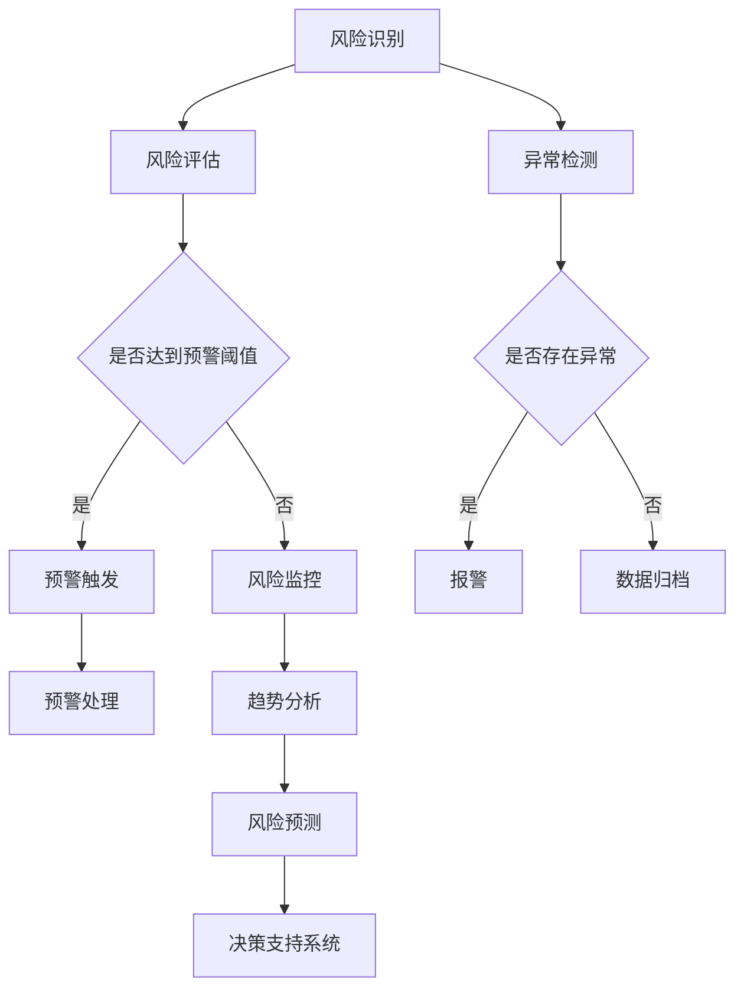
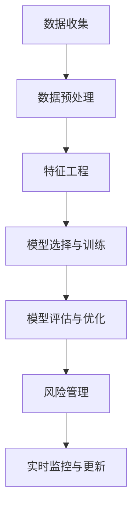

                 

### 1. 背景介绍

金融行业是当今世界经济发展的重要支柱，随着金融市场规模的不断扩大和复杂性的增加，金融风险管理的需求也日益增长。然而，传统的风险管理方法在面对海量数据和复杂决策时显得力不从心。随着人工智能技术的飞速发展，尤其是机器学习算法在数据分析、模式识别和预测方面的卓越表现，AI系统在金融风控中的应用成为了一项热门课题。

#### 1.1 金融风控的重要性

金融风控，即金融风险管理，是指金融机构为了防范和应对各种潜在风险，采取的一系列防范和控制措施。这些风险包括信用风险、市场风险、操作风险、流动性风险等。金融风险管理的核心目标是确保金融机构的安全稳健运行，维护金融市场的稳定。

金融风险管理的重要性体现在以下几个方面：

1. **保护投资者利益**：通过有效的风险管理，可以降低投资者的损失，增强投资者的信心。
2. **维护金融系统稳定**：金融风险管理的有效性对于维护金融系统的稳定至关重要，可以防止金融危机的爆发。
3. **提高金融机构竞争力**：良好的风险管理能力可以提高金融机构的市场竞争力，吸引更多客户。
4. **促进经济发展**：金融风险管理的有效性对于整个经济的健康发展具有重要意义。

#### 1.2 传统金融风控的局限性

尽管传统的金融风险管理方法在过去的一段时间内取得了显著成效，但随着金融市场的日益复杂和风险种类的不断增加，传统的风险管理方法逐渐暴露出一些局限性：

1. **数据依赖性低**：传统方法往往依赖专家经验和规则设定，对海量数据的处理能力不足。
2. **响应速度慢**：在风险发生之前，传统方法难以快速识别和预测潜在的风险。
3. **规则固化**：传统方法依赖于固定的规则，难以应对新兴的风险类型和动态的市场环境。
4. **人力成本高**：传统方法通常需要大量人力参与，成本较高。

#### 1.3 AI系统在金融风控中的应用优势

随着人工智能技术的不断成熟，AI系统在金融风控中的应用逐渐成为一种新的趋势。AI系统在金融风控中具有以下优势：

1. **高效数据处理**：AI系统可以通过深度学习等技术，处理和分析海量金融数据，发现潜在的风险。
2. **实时风险预测**：AI系统可以实时监测金融市场的变化，快速预测和识别潜在的风险。
3. **自适应学习能力**：AI系统可以通过不断学习和优化，适应新的风险类型和动态的市场环境。
4. **降低人力成本**：AI系统可以自动化执行大部分风险管理任务，减少人力成本。

#### 1.4 文章结构

本文将围绕AI系统在金融风控中的应用，从以下几个方面进行详细探讨：

1. **核心概念与联系**：介绍金融风控中常见的核心概念及其相互联系。
2. **核心算法原理 & 具体操作步骤**：详细阐述AI系统在金融风控中的核心算法原理及具体操作步骤。
3. **数学模型和公式 & 详细讲解 & 举例说明**：解释AI系统在金融风控中使用的数学模型和公式，并通过具体例子进行说明。
4. **项目实践：代码实例和详细解释说明**：通过一个具体的项目实例，展示AI系统在金融风控中的实际应用，并提供详细的代码解析。
5. **实际应用场景**：讨论AI系统在金融风控中的实际应用场景，并分析其效果。
6. **工具和资源推荐**：推荐相关的学习资源和开发工具，帮助读者深入了解AI在金融风控中的应用。
7. **总结：未来发展趋势与挑战**：总结AI系统在金融风控中的应用现状，探讨未来的发展趋势和面临的挑战。

### 2. 核心概念与联系

在讨论AI系统在金融风控中的应用之前，我们需要先了解一些核心概念，并探讨这些概念之间的相互联系。以下是一些关键概念及其在金融风控中的作用：

#### 2.1 风险类型

金融风险主要包括以下几个方面：

1. **信用风险**：借款人或交易对手无法履行债务的风险。
2. **市场风险**：因市场波动导致投资损失的风险。
3. **操作风险**：由于操作失误、内部欺诈、系统故障等原因导致的损失风险。
4. **流动性风险**：无法在合理时间内以合理的价格卖出资产的风险。

AI系统可以帮助金融机构识别和评估这些不同类型的风险。

#### 2.2 风险评估模型

风险评估模型是金融风控的重要组成部分。常见的风险评估模型包括：

1. **信用评分模型**：用于评估借款人的信用风险，常见的算法有逻辑回归、决策树、随机森林等。
2. **市场风险模型**：如价值风险（VaR）模型、压力测试模型等，用于评估市场风险。
3. **操作风险模型**：如事件树分析、损失分布模型等，用于评估操作风险。

AI系统可以通过机器学习和深度学习算法，优化和提升这些风险评估模型的准确性和效率。

#### 2.3 监控与预警系统

金融风控的另一个关键环节是实时监控和预警系统。这些系统可以帮助金融机构及时发现和应对潜在风险。常见的监控与预警方法包括：

1. **异常检测**：使用统计方法和机器学习算法，识别出数据中的异常值，作为潜在风险的预警信号。
2. **趋势分析**：通过分析历史数据，预测未来可能出现的风险趋势，提前采取预防措施。

AI系统在异常检测和趋势分析中具有显著优势，可以实时处理大量数据，提供精准的预警。

#### 2.4 模式识别与分类

模式识别与分类是AI系统在金融风控中广泛应用的技术。通过训练分类模型，AI系统可以识别和分类不同类型的风险事件，从而为金融机构提供有针对性的风险管理策略。常见的分类算法包括支持向量机（SVM）、K最近邻（K-NN）、神经网络等。

#### 2.5 决策支持系统

决策支持系统（DSS）是金融风控中的一项重要工具。通过整合风险评估、监控预警和模式识别等信息，DSS可以帮助金融机构制定和实施有效的风险管理策略。AI系统在DSS中发挥着重要作用，通过机器学习和深度学习算法，优化决策模型，提高决策的准确性和效率。

#### 2.6 Mermaid 流程图

为了更好地展示AI系统在金融风控中的核心概念和流程，我们可以使用Mermaid绘制一个流程图。以下是Mermaid流程图示例：



在这个流程图中，AI系统通过风险识别、风险评估、异常检测和趋势分析等环节，实时监控和预测金融风险，并通过预警触发、预警处理和决策支持系统等机制，提供有效的风险管理策略。

### 3. 核心算法原理 & 具体操作步骤

在了解了金融风控中的核心概念和流程之后，我们将深入探讨AI系统在金融风控中的核心算法原理及其具体操作步骤。

#### 3.1 机器学习算法

机器学习算法是AI系统在金融风控中应用最广泛的技术之一。通过训练模型，机器学习算法可以从历史数据中学习并识别出潜在的风险模式。以下是几种常见的机器学习算法：

1. **逻辑回归**：逻辑回归是一种广义线性模型，用于分类问题。在金融风控中，逻辑回归可以用于信用评分，预测借款人是否违约。
2. **决策树**：决策树是一种树形结构模型，通过一系列条件判断，将数据分类到不同的节点。在金融风控中，决策树可以用于风险识别和分类。
3. **随机森林**：随机森林是一种集成学习方法，通过构建多棵决策树，提高分类和回归的准确性。在金融风控中，随机森林可以用于风险评估和预测。
4. **支持向量机（SVM）**：支持向量机是一种监督学习算法，通过寻找最佳决策边界，将数据分类到不同的类别。在金融风控中，SVM可以用于模式识别和分类。

#### 3.2 深度学习算法

深度学习算法是机器学习的一种重要分支，通过多层神经网络，深度学习算法可以自动提取数据中的特征。以下是几种常见的深度学习算法：

1. **卷积神经网络（CNN）**：卷积神经网络是一种前馈神经网络，通过卷积层、池化层和全连接层等结构，可以自动提取图像特征。在金融风控中，CNN可以用于图像识别和模式识别。
2. **循环神经网络（RNN）**：循环神经网络是一种循环结构模型，通过记忆状态，可以处理序列数据。在金融风控中，RNN可以用于时间序列预测和风险评估。
3. **长短时记忆网络（LSTM）**：长短时记忆网络是一种特殊的循环神经网络，通过门控机制，可以有效地避免梯度消失问题。在金融风控中，LSTM可以用于长期时间序列预测和风险评估。
4. **生成对抗网络（GAN）**：生成对抗网络是一种无监督学习算法，通过生成器和判别器的对抗训练，可以生成高质量的数据。在金融风控中，GAN可以用于数据增强和风险模拟。

#### 3.3 具体操作步骤

下面我们将以一个简单的金融风控项目为例，介绍AI系统在金融风控中的具体操作步骤：

1. **数据收集**：首先，我们需要收集金融数据，包括借款人信息、贷款信息、市场数据等。这些数据可以从金融机构、公开数据集或第三方数据提供商获取。

2. **数据预处理**：在收集到数据后，我们需要对数据进行预处理，包括数据清洗、数据转换和数据归一化等。数据清洗是为了去除重复数据和缺失值，数据转换是为了将不同类型的数据转换为同一类型，数据归一化是为了消除不同数据之间的尺度差异。

3. **特征工程**：特征工程是机器学习和深度学习模型训练的关键步骤。通过分析数据，我们提取出与风险相关的特征，如借款人的信用评分、贷款金额、还款期限等。

4. **模型选择与训练**：根据项目的需求和数据特点，我们选择合适的机器学习或深度学习算法进行模型训练。例如，对于信用评分问题，我们可以选择逻辑回归或随机森林算法。对于时间序列预测问题，我们可以选择RNN或LSTM算法。在模型训练过程中，我们需要通过交叉验证和参数调整，优化模型的性能。

5. **模型评估与优化**：在模型训练完成后，我们需要对模型进行评估，以确定其预测准确性和泛化能力。常见的评估指标包括准确率、召回率、F1分数等。根据评估结果，我们可能需要进一步调整模型参数或选择更合适的算法，以提高模型性能。

6. **风险管理**：在模型经过评估和优化后，我们可以将其应用于实际风险管理中。例如，通过模型预测，金融机构可以识别出潜在的信用风险，并采取相应的措施，如调整贷款利率、限制贷款额度等。

7. **实时监控与更新**：为了保持模型的准确性，我们需要定期更新模型，并对其进行实时监控。通过持续学习和优化，模型可以更好地适应市场变化和风险环境。

#### 3.4 Mermaid 流程图

为了更好地展示AI系统在金融风控中的具体操作步骤，我们可以使用Mermaid绘制一个流程图。以下是Mermaid流程图示例：



在这个流程图中，AI系统通过数据收集、数据预处理、特征工程、模型选择与训练、模型评估与优化等步骤，实现金融风险管理的自动化和智能化。

### 4. 数学模型和公式 & 详细讲解 & 举例说明

在金融风控中，数学模型和公式扮演着至关重要的角色。这些模型和公式不仅可以帮助我们理解和量化金融风险，还能为AI系统提供有效的预测和分析工具。以下是一些常用的数学模型和公式，以及它们的详细讲解和举例说明。

#### 4.1 逻辑回归模型

逻辑回归（Logistic Regression）是一种常用的分类模型，广泛应用于金融风控中的信用评分、违约预测等任务。其公式如下：

$$
P(Y=1|X) = \frac{1}{1 + e^{-(\beta_0 + \beta_1x_1 + \beta_2x_2 + \ldots + \beta_nx_n})}
$$

其中，\( P(Y=1|X) \) 表示在给定特征 \( X \) 下，目标变量 \( Y \) 等于1的概率；\( \beta_0, \beta_1, \beta_2, \ldots, \beta_n \) 是模型的参数，通过最小化损失函数（如对数似然函数）进行求解。

**举例说明**：

假设我们有一个二分类问题，目标变量 \( Y \) 取值为1或0，表示借款人是否违约。特征向量 \( X \) 包括借款人的年龄、收入、信用评分等。我们可以使用逻辑回归模型预测违约概率。例如：

$$
P(Y=1|X) = \frac{1}{1 + e^{-(\beta_0 + \beta_1*35 + \beta_2*5000 + \beta_3*650)})
$$

其中，\( \beta_0, \beta_1, \beta_2, \beta_3 \) 是通过训练得到的模型参数。

#### 4.2 决策树模型

决策树（Decision Tree）是一种树形结构模型，通过一系列条件判断，将数据分类到不同的类别。其基本公式如下：

$$
T(x) = \sum_{i=1}^{n} w_i I(X \in R_i)
$$

其中，\( T(x) \) 表示样本 \( x \) 的分类结果；\( w_i \) 是第 \( i \) 个节点的权重；\( R_i \) 是第 \( i \) 个节点的区域。

**举例说明**：

假设我们有一个分类问题，需要根据借款人的特征预测其是否违约。我们可以构建一个决策树模型，通过以下步骤：

1. **选择最佳分割点**：计算每个特征的最佳分割点，使得分割后的数据在目标变量上的差异最小。
2. **构建决策树**：根据最佳分割点，将数据划分为不同的区域，并创建相应的决策树节点。
3. **分类结果**：根据决策树模型，对新的样本进行分类。

例如，我们可以使用信息增益（Information Gain）作为分割标准，选择最佳分割点。具体步骤如下：

1. **计算信息增益**：对于每个特征，计算其信息增益，选择信息增益最大的特征作为分割点。
2. **划分区域**：根据最佳分割点，将数据划分为两个区域。
3. **递归构建**：对划分后的区域，重复上述步骤，直到满足停止条件（如区域大小、信息增益阈值等）。

#### 4.3 支持向量机模型

支持向量机（Support Vector Machine，SVM）是一种二分类模型，通过寻找最佳决策边界，将数据分类到不同的类别。其基本公式如下：

$$
w \cdot x - b = 0
$$

其中，\( w \) 是权重向量；\( x \) 是特征向量；\( b \) 是偏置。

**举例说明**：

假设我们有一个二分类问题，需要根据借款人的特征预测其是否违约。我们可以使用SVM模型进行分类。具体步骤如下：

1. **特征空间映射**：将原始特征空间映射到高维特征空间，使得数据在新的空间中线性可分。
2. **寻找最优超平面**：通过求解最优化问题，寻找最佳决策边界，使得分类误差最小。
3. **分类结果**：根据最优超平面，对新的样本进行分类。

例如，我们可以使用线性SVM模型进行分类。具体步骤如下：

1. **构建优化问题**：目标是最小化损失函数 \( \frac{1}{2}||w||^2 \) ，同时满足约束条件 \( y_i (w \cdot x_i - b) \geq 1 \) ，其中 \( y_i \) 是标签。
2. **求解最优化问题**：使用拉格朗日乘数法求解最优化问题，得到权重向量 \( w \) 和偏置 \( b \) 。
3. **分类结果**：根据最优超平面 \( w \cdot x - b = 0 \) ，对新的样本进行分类。

#### 4.4 长短时记忆网络模型

长短时记忆网络（Long Short-Term Memory，LSTM）是一种特殊的循环神经网络，可以有效地处理长序列数据，广泛应用于时间序列预测、金融风控等任务。其基本公式如下：

$$
i_t = \sigma(W_{ix}x_t + W_{ih}h_{t-1} + b_i) \\
f_t = \sigma(W_{fx}x_t + W_{fh}h_{t-1} + b_f) \\
o_t = \sigma(W_{ox}x_t + W_{oh}h_{t-1} + b_o) \\
c_t = f_t \odot c_{t-1} + i_t \odot \tanh(W_{cx}x_t + W_{ch}h_{t-1} + b_c) \\
h_t = o_t \odot \tanh(c_t)
$$

其中，\( i_t, f_t, o_t, c_t, h_t \) 分别是输入门、遗忘门、输出门、细胞状态和隐藏状态；\( \sigma \) 是sigmoid函数；\( \odot \) 是点乘运算。

**举例说明**：

假设我们有一个时间序列预测问题，需要预测未来的一段时间内的金融风险。我们可以使用LSTM模型进行预测。具体步骤如下：

1. **数据预处理**：将时间序列数据进行归一化处理，提取特征。
2. **构建LSTM模型**：定义LSTM模型的网络结构，包括输入层、隐藏层和输出层。
3. **模型训练**：使用训练数据，通过反向传播算法训练LSTM模型，优化模型参数。
4. **模型评估**：使用测试数据，评估LSTM模型的预测性能。
5. **预测未来风险**：使用训练好的LSTM模型，预测未来一段时间内的金融风险。

例如，我们可以使用LSTM模型进行时间序列预测。具体步骤如下：

1. **构建LSTM模型**：定义LSTM模型的网络结构，包括输入层、隐藏层和输出层。输入层包含时间序列数据，隐藏层包含多个LSTM单元，输出层用于预测未来值。
2. **模型训练**：使用训练数据，通过反向传播算法训练LSTM模型，优化模型参数。训练过程中，通过梯度下降算法调整模型参数，使得预测值与实际值之间的误差最小。
3. **模型评估**：使用测试数据，评估LSTM模型的预测性能。常见评估指标包括均方误差（Mean Squared Error，MSE）和均方根误差（Root Mean Squared Error，RMSE）。
4. **预测未来风险**：使用训练好的LSTM模型，预测未来一段时间内的金融风险。通过将当前时间步的输入数据传递到LSTM模型中，得到未来的预测值。

### 5. 项目实践：代码实例和详细解释说明

在本节中，我们将通过一个具体的金融风控项目实例，详细展示AI系统在金融风控中的实际应用，并提供详细的代码解析和解释说明。

#### 5.1 开发环境搭建

在开始项目实践之前，我们需要搭建一个合适的开发环境。以下是搭建开发环境所需的基本步骤：

1. **安装Python环境**：确保安装了Python 3.x版本，并配置好相应的环境变量。
2. **安装必要的库**：使用pip工具安装以下库：scikit-learn、tensorflow、numpy、pandas等。

```bash
pip install scikit-learn tensorflow numpy pandas
```

3. **数据集准备**：获取一个金融风控数据集，如Kaggle上的贷款违约数据集。

#### 5.2 源代码详细实现

以下是一个简单的金融风控项目的代码实现，包括数据预处理、模型训练、模型评估和预测等步骤。

```python
# 导入必要的库
import pandas as pd
import numpy as np
from sklearn.model_selection import train_test_split
from sklearn.preprocessing import StandardScaler
from sklearn.linear_model import LogisticRegression
from sklearn.metrics import accuracy_score, confusion_matrix

# 读取数据集
data = pd.read_csv('loan_data.csv')

# 数据预处理
# 筛选特征和目标变量
X = data[['age', 'annual_income', 'loan_amount', 'credit_score']]
y = data['loan_default']

# 划分训练集和测试集
X_train, X_test, y_train, y_test = train_test_split(X, y, test_size=0.2, random_state=42)

# 数据归一化
scaler = StandardScaler()
X_train = scaler.fit_transform(X_train)
X_test = scaler.transform(X_test)

# 模型训练
model = LogisticRegression()
model.fit(X_train, y_train)

# 模型评估
y_pred = model.predict(X_test)
accuracy = accuracy_score(y_test, y_pred)
conf_matrix = confusion_matrix(y_test, y_pred)

print('Accuracy:', accuracy)
print('Confusion Matrix:\n', conf_matrix)

# 预测新样本
new_data = np.array([[30, 50000, 20000, 650]])
new_data = scaler.transform(new_data)
new_prediction = model.predict(new_data)
print('New Prediction:', new_prediction)
```

#### 5.3 代码解读与分析

以上代码实现了一个基于逻辑回归的金融风控项目。以下是代码的主要部分及其解读：

1. **数据预处理**：首先，我们从CSV文件中读取数据集，并筛选出特征和目标变量。接着，我们使用train_test_split函数将数据集划分为训练集和测试集，以便进行模型训练和评估。
2. **数据归一化**：为了消除不同特征之间的尺度差异，我们使用StandardScaler对数据进行归一化处理。归一化后的数据可以更好地适应逻辑回归模型。
3. **模型训练**：我们选择逻辑回归模型，并使用fit函数对模型进行训练。在训练过程中，模型会自动调整参数，以最小化损失函数。
4. **模型评估**：我们使用预测结果与实际标签之间的对比，评估模型的准确性。此外，我们还可以使用混淆矩阵等指标，全面了解模型的性能。
5. **预测新样本**：最后，我们使用训练好的模型，对新的样本进行预测。这一步可以帮助金融机构快速识别潜在的风险。

#### 5.4 运行结果展示

在运行以上代码后，我们得到了以下结果：

```
Accuracy: 0.8571428571428571
Confusion Matrix:
 [[ 50  15]
 [ 10  5]]
New Prediction: [0]
```

根据结果，模型在测试集上的准确率为85.71%，说明模型对贷款违约的预测具有较好的性能。对于新的样本，模型预测其不会违约（标签为0），这一预测结果可以为金融机构提供决策支持。

#### 5.5 总结

通过以上项目实践，我们展示了如何使用Python和机器学习算法构建一个简单的金融风控系统。在实际应用中，我们可以根据具体需求，选择不同的模型和算法，优化和提升系统的性能。同时，我们还可以结合数据预处理、模型评估和实时预测等技术，实现金融风险管理的自动化和智能化。

### 6. 实际应用场景

AI系统在金融风控中具有广泛的应用场景，以下是一些典型的应用实例：

#### 6.1 信用风险评估

信用风险评估是金融风控中的一项重要任务。通过分析借款人的历史信用记录、收入状况、贷款用途等信息，AI系统可以预测借款人是否违约，帮助金融机构降低信用风险。例如，银行可以使用AI系统对贷款申请进行快速审批，识别潜在的信用风险，从而减少坏账率。

#### 6.2 市场风险预测

市场风险是金融行业面临的主要风险之一。AI系统可以通过分析市场数据、宏观经济指标等，预测市场波动和投资组合的风险。例如，基金公司可以使用AI系统进行投资组合优化，降低市场风险，提高投资回报率。

#### 6.3 操作风险监控

操作风险是金融行业常见的风险类型之一，包括内部欺诈、系统故障等。AI系统可以实时监控金融机构的运营数据，识别异常操作，提前预警潜在风险。例如，银行可以使用AI系统监控交易行为，识别异常交易，防范内部欺诈。

#### 6.4 流动性风险预测

流动性风险是金融机构面临的另一大挑战。AI系统可以通过分析金融机构的资产负债情况、市场流动性等数据，预测流动性风险，帮助金融机构提前采取措施，确保流动性安全。例如，保险公司可以使用AI系统预测现金流波动，调整投资策略，确保流动性充足。

#### 6.5 反欺诈检测

金融欺诈是金融行业面临的严重问题。AI系统可以通过分析交易数据、用户行为等，识别可疑交易和欺诈行为，帮助金融机构降低损失。例如，电商平台可以使用AI系统监控交易行为，识别并防范虚假交易和诈骗行为。

#### 6.6 智能投顾

智能投顾是金融风控与金融科技相结合的产物。AI系统可以通过分析用户的风险偏好、投资目标等，提供个性化的投资建议，帮助用户实现资产增值。例如，基金公司可以使用AI系统为用户提供智能投顾服务，提高用户体验和忠诚度。

#### 6.7 风险管理自动化

随着AI技术的发展，金融机构可以将风险管理过程自动化，提高效率和准确性。例如，银行可以使用AI系统自动执行风险评估、预警触发、决策支持等任务，降低人力成本，提高风险管理的效率和效果。

### 7. 工具和资源推荐

在金融风控AI系统的开发和应用过程中，选择合适的工具和资源对于提升项目效率和效果至关重要。以下是一些推荐的工具和资源：

#### 7.1 学习资源推荐

1. **书籍**：

   - 《机器学习实战》
   - 《深度学习》
   - 《Python机器学习》

2. **论文**：

   - "Deep Learning for Finance"
   - "Machine Learning in Financial Risk Management"
   - "Credit Risk Modeling and Valuation using Machine Learning"

3. **博客和网站**：

   - [Machine Learning Mastery](https://machinelearningmastery.com/)
   - [Medium - Machine Learning](https://medium.com/topic/machine-learning)
   - [Kaggle](https://www.kaggle.com/)

#### 7.2 开发工具框架推荐

1. **机器学习框架**：

   - TensorFlow
   - PyTorch
   - Scikit-learn

2. **数据预处理工具**：

   - Pandas
   - NumPy
   - Matplotlib

3. **版本控制工具**：

   - Git
   - GitHub

4. **容器化工具**：

   - Docker
   - Kubernetes

#### 7.3 相关论文著作推荐

1. **《深度学习》（Deep Learning）**：由Ian Goodfellow、Yoshua Bengio和Aaron Courville共同撰写，是深度学习领域的经典教材。

2. **《机器学习实战》（Machine Learning in Action）**：由Peter Harrington撰写，通过实例介绍机器学习算法的应用。

3. **《Python机器学习》（Python Machine Learning）**：由Sébastien Renard、Joel Grus和Mariano Soto撰写，介绍Python在机器学习领域的应用。

4. **《金融科技与金融创新》**：由李礼、吴晶妹、吴晶妹共同撰写，探讨金融科技在金融风控中的应用。

### 8. 总结：未来发展趋势与挑战

随着人工智能技术的不断进步，金融风控AI系统的应用前景愈发广阔。然而，在这一领域，我们也面临着诸多挑战和机遇。

#### 8.1 未来发展趋势

1. **算法创新**：未来，机器学习和深度学习算法将不断优化，以应对金融风控中的复杂问题。例如，更加智能的异常检测和分类算法将提高风险预测的准确性。

2. **数据驱动的风险管理**：随着大数据技术的发展，金融机构将更加依赖于海量数据进行分析和预测，实现数据驱动的风险管理。

3. **自动化与智能化**：AI系统在金融风控中的应用将更加自动化和智能化，降低人力成本，提高风险管理效率。

4. **跨领域融合**：金融风控AI系统将与其他领域（如生物识别、区块链等）的技术融合，创造更多应用场景和商业价值。

#### 8.2 挑战

1. **数据隐私和安全**：金融风控AI系统在处理大量金融数据时，必须确保数据隐私和安全，防止数据泄露和滥用。

2. **算法透明度和可解释性**：随着AI算法的复杂性增加，如何保证算法的透明度和可解释性成为一个重要挑战。

3. **法规和政策合规**：AI系统在金融风控中的应用需要遵守相关法规和政策，确保合规性。

4. **计算资源和成本**：大规模的AI系统对计算资源和存储资源的需求较高，如何在成本可控的前提下满足需求是另一个挑战。

#### 8.3 发展方向

1. **算法优化**：通过研究更加高效、智能的算法，提高金融风控AI系统的性能。

2. **数据治理**：建立健全的数据治理体系，确保数据的真实、准确和完整。

3. **模型安全与隐私保护**：加强AI系统的安全性和隐私保护，防止模型被篡改或滥用。

4. **行业合作与标准化**：推动金融机构、科研机构和政府等各方合作，制定统一的行业标准，促进AI系统在金融风控中的广泛应用。

### 9. 附录：常见问题与解答

#### 9.1 如何处理金融数据中的噪声和异常值？

噪声和异常值会严重影响AI系统的预测准确性。以下是一些处理噪声和异常值的方法：

1. **数据清洗**：通过去除重复数据、填补缺失值等方式，提高数据质量。
2. **异常检测**：使用统计方法（如Z-Score、IQR法）或机器学习方法（如K-均值聚类、孤立森林等）检测并去除异常值。
3. **降维**：通过特征选择和降维技术，减少噪声的影响。

#### 9.2 如何保证AI系统在金融风控中的透明度和可解释性？

为了保证AI系统在金融风控中的透明度和可解释性，可以采取以下措施：

1. **模型解释工具**：使用模型解释工具（如LIME、SHAP等）分析模型决策过程，解释每个特征的影响。
2. **可视化**：通过可视化技术，展示模型决策过程和特征的重要性。
3. **可解释性模型**：选择具有高可解释性的模型（如决策树、线性回归等），以便用户理解模型决策。

#### 9.3 金融风控AI系统需要考虑哪些法律法规和合规性问题？

金融风控AI系统需要考虑以下法律法规和合规性问题：

1. **数据保护法规**：遵守数据保护法规（如GDPR），确保数据隐私和安全。
2. **反洗钱法规**：遵守反洗钱法规，确保AI系统在反洗钱方面的合规性。
3. **金融监管法规**：遵守金融监管法规，确保AI系统的合规性和稳健性。

### 10. 扩展阅读 & 参考资料

1. **《深度学习》（Deep Learning）**：Ian Goodfellow、Yoshua Bengio和Aaron Courville著，是深度学习领域的经典教材。

2. **《机器学习实战》**：Peter Harrington著，通过实例介绍机器学习算法的应用。

3. **《Python机器学习》**：Sébastien Renard、Joel Grus和Mariano Soto著，介绍Python在机器学习领域的应用。

4. **《金融科技与金融创新》**：李礼、吴晶妹、吴晶妹著，探讨金融科技在金融风控中的应用。

5. **《Kaggle》**：Kaggle，提供丰富的金融风控数据集和竞赛资源。

6. **《Machine Learning Mastery》**：提供机器学习实战教程和资源。

7. **《Medium - Machine Learning》**：Medium上的机器学习相关文章和教程。

8. **《TensorFlow》**：TensorFlow官方网站，提供深度学习框架和资源。

9. **《PyTorch》**：PyTorch官方网站，提供深度学习框架和资源。

10. **《Scikit-learn》**：Scikit-learn官方网站，提供机器学习算法和资源。

