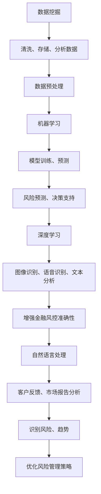

                 

### 1. 背景介绍

金融风控作为金融领域的重要环节，关乎到金融机构的稳健运行以及投资者的权益保障。随着信息技术的飞速发展，尤其是人工智能（AI）技术的应用，金融风控领域迎来了前所未有的变革。传统的金融风控方法主要依赖于人工经验和统计模型，而人工智能技术则为金融风控提供了更加智能化、高效化的解决方案。

近年来，AI技术在金融风控中的应用越来越广泛，从信用卡欺诈检测、贷款审批、市场预测到风险管理和资产配置等各个方面。通过机器学习、深度学习、自然语言处理等技术，AI能够从海量数据中提取特征，发现潜在风险，并快速作出反应，从而提升金融风控的精准度和响应速度。

本文旨在探讨金融风控AI系统的创新应用，通过介绍核心概念、算法原理、数学模型、项目实践、实际应用场景、工具推荐等方面，全面展示AI在金融风控领域的价值与潜力。首先，我们将回顾AI在金融风控中的发展历程，了解其从初步应用到广泛应用的过程。

### 1.1 AI在金融风控中的应用历程

AI在金融风控中的应用历程可以追溯到20世纪90年代。当时，专家系统开始应用于金融风控，帮助金融机构识别潜在风险。然而，由于专家系统的局限性，例如规则固化和难以处理复杂问题，其应用效果并不理想。进入21世纪，随着机器学习技术的发展，金融风控迎来了新的契机。

2006年，支持向量机（SVM）在信用卡欺诈检测中取得显著成果，标志着机器学习技术在金融风控中的首次成功应用。随后，决策树、随机森林、神经网络等算法相继被引入金融风控领域，进一步提升了风险识别和预测的准确性。2012年，深度学习技术的突破为金融风控带来了革命性的变化，特别是在图像识别、自然语言处理等领域，深度学习展示了其强大的特征提取和模式识别能力。

随着大数据和云计算技术的普及，金融风控AI系统逐渐从单点应用到集成化、智能化方向发展。金融机构开始利用AI技术构建综合性的风控体系，实现实时风险监测、智能决策和自动化响应。例如，一些银行通过部署AI系统，实现了对贷款申请的自动审批，大幅提高了审批效率和准确性。

### 1.2 当前AI在金融风控中的应用现状

目前，AI在金融风控中的应用已经渗透到各个层面，从数据预处理、特征提取到风险模型构建和决策支持，各个环节都离不开AI技术的支持。以下是当前AI在金融风控中的主要应用现状：

1. **信用卡欺诈检测**：通过机器学习和深度学习技术，AI系统能够实时监控信用卡交易行为，自动识别潜在的欺诈行为。与传统的规则方法相比，AI系统具有更高的准确性和更低的误报率。

2. **贷款审批**：AI技术在贷款审批中的应用极大地简化了审批流程，提高了审批效率。通过分析借款人的历史信用记录、财务状况、行为数据等，AI系统能够快速、准确地评估借款人的信用风险。

3. **市场预测**：AI技术能够从海量历史数据中挖掘市场趋势和潜在风险，帮助金融机构进行投资决策。例如，通过分析市场情绪、新闻报道、经济指标等，AI系统可以预测股票市场走势。

4. **风险管理和资产配置**：AI技术可以实时监控市场动态和风险指标，帮助金融机构进行风险管理和资产配置。通过优化投资组合，降低风险，提高收益。

5. **智能客服**：AI技术使得金融机构能够提供更加智能化的客户服务。通过自然语言处理和智能对话系统，AI客服能够自动解答客户疑问，提高客户满意度。

总的来说，AI技术在金融风控中的应用不仅提升了金融机构的风险识别和预测能力，也提高了运营效率和客户体验。随着AI技术的不断进步，未来金融风控AI系统将更加智能化、自动化，为金融行业的可持续发展提供有力支持。

### 1.3 金融风控AI系统的创新点

金融风控AI系统的创新点主要体现在以下几个方面：

1. **数据驱动的风险管理**：传统的金融风控主要依赖经验和规则，而AI系统通过海量数据的分析和挖掘，能够更准确地识别潜在风险。这种数据驱动的风险管理方式大大提高了风险预测的准确性。

2. **实时风险监测与响应**：AI系统可以实时监控金融市场和交易行为，快速发现异常情况并作出响应。相比传统方法，AI系统具有更快的响应速度，能够有效降低风险发生时的损失。

3. **自动化与智能化**：AI技术使得金融风控流程更加自动化和智能化。通过算法和模型，AI系统能够自动完成数据清洗、特征提取、风险预测等任务，减少人工干预，提高工作效率。

4. **自适应与优化**：AI系统可以根据历史数据和实时反馈，不断优化风险模型和策略，提高系统的适应性和预测精度。这种自适应能力是传统风控方法所不具备的。

5. **跨领域应用**：AI技术不仅应用于传统的金融风控领域，还可以应用于其他金融业务场景，如保险、基金等。通过跨领域应用，AI技术能够为金融机构提供更加全面的风险管理解决方案。

总之，金融风控AI系统的创新点不仅体现在技术层面，也带来了业务模式的变革。未来，随着AI技术的不断进步，金融风控AI系统将在更多领域发挥作用，推动金融行业的创新发展。

### 2. 核心概念与联系

在深入探讨金融风控AI系统的创新应用之前，我们需要了解一些核心概念及其相互关系。这些核心概念包括机器学习、深度学习、数据挖掘、自然语言处理等，它们共同构成了AI技术在金融风控中的基础。以下是这些核心概念的定义及其在金融风控中的应用。

#### 2.1 机器学习

机器学习是一种人工智能（AI）的方法，通过算法让计算机从数据中学习，并做出预测或决策。在金融风控中，机器学习技术被广泛应用于数据挖掘、风险预测和决策支持等方面。例如，通过训练模型，机器学习可以帮助金融机构识别信用卡欺诈交易，评估借款人的信用风险，甚至预测市场趋势。

#### 2.2 深度学习

深度学习是机器学习的一个子领域，主要依赖于多层神经网络（如卷积神经网络、循环神经网络等）来提取数据中的高级特征。在金融风控中，深度学习被广泛应用于图像识别、语音识别和文本分析等领域。例如，深度学习模型可以分析客户的交易数据，识别异常行为模式，从而提高欺诈检测的准确性。

#### 2.3 数据挖掘

数据挖掘是一种从大量数据中发现有价值信息的过程，通常涉及数据的收集、清洗、存储、分析和可视化。在金融风控中，数据挖掘技术被用于分析客户行为、市场趋势和潜在风险。通过数据挖掘，金融机构可以识别高风险客户、预测市场波动，并制定相应的风险管理策略。

#### 2.4 自然语言处理

自然语言处理（NLP）是一种让计算机理解和生成人类语言的技术，涉及文本分析、语义理解和语言生成等方面。在金融风控中，NLP技术被用于分析客户反馈、新闻报道和市场报告，以识别潜在风险和市场趋势。例如，通过分析社交媒体上的用户评论，NLP可以帮助金融机构了解客户对产品和服务的态度，从而及时调整策略。

#### 2.5 各核心概念之间的联系

这些核心概念并非孤立存在，而是相互关联、共同作用，构成了金融风控AI系统的核心框架。例如，机器学习模型需要依赖于数据挖掘技术来收集和处理数据，深度学习则需要强大的计算能力和海量数据支持，而自然语言处理则依赖于对语言的理解和分析。以下是这些核心概念之间的 Mermaid 流程图：



通过这个 Mermaid 流程图，我们可以清晰地看到各个核心概念在金融风控中的应用及其相互关系。这些技术共同构建了一个智能化的金融风控系统，为金融机构提供了强大的风险管理工具。

#### 2.6 关键技术及其应用

除了上述核心概念，金融风控AI系统中还涉及许多关键技术，如贝叶斯理论、决策树、支持向量机、神经网络等。以下是这些关键技术的简要介绍及其在金融风控中的应用：

1. **贝叶斯理论**：贝叶斯理论是一种概率推理方法，通过历史数据和现有信息，更新对事件发生概率的估计。在金融风控中，贝叶斯理论被用于信用评分和风险预测，例如，通过分析借款人的历史信用记录，贝叶斯模型可以更准确地评估其信用风险。

2. **决策树**：决策树是一种基于规则的分类方法，通过一系列判断条件，将数据集划分为不同的类别。在金融风控中，决策树被用于贷款审批、欺诈检测等，例如，通过分析交易数据，决策树模型可以识别出异常交易并标记为欺诈。

3. **支持向量机**：支持向量机（SVM）是一种高效的分类算法，通过找到一个最佳的超平面，将不同类别的数据点分离。在金融风控中，SVM被广泛应用于信用卡欺诈检测和信用评分，例如，通过训练SVM模型，可以识别出潜在的欺诈交易。

4. **神经网络**：神经网络是一种模拟人脑神经元连接的网络结构，具有强大的学习和自适应能力。在金融风控中，神经网络被用于风险预测、市场预测等，例如，通过训练神经网络模型，可以预测市场趋势和风险变化。

通过上述关键技术，金融风控AI系统能够更准确地识别和预测风险，从而提高金融机构的风险管理能力。这些技术的综合应用，使得金融风控AI系统具备了更高的智能化和自动化水平。

综上所述，金融风控AI系统的核心概念和技术之间紧密相连，相互促进，共同构成了一个高效、智能的风控体系。通过这些技术的应用，金融机构能够更好地应对复杂多变的市场环境，确保稳健运行。

### 3. 核心算法原理 & 具体操作步骤

在了解了金融风控AI系统的核心概念与联系后，接下来我们将深入探讨金融风控AI系统的核心算法原理及其具体操作步骤。这些算法不仅是金融风控AI系统的技术基础，也是实现智能风控的关键所在。

#### 3.1 机器学习算法

机器学习算法是金融风控AI系统的核心组成部分。以下是几种常用的机器学习算法及其在金融风控中的应用：

1. **线性回归**：线性回归是一种最简单的机器学习算法，用于预测连续值输出。在金融风控中，线性回归可以用于预测市场趋势、股票价格等。具体步骤如下：
   - 数据收集：收集历史市场数据，包括价格、交易量、宏观经济指标等。
   - 数据预处理：对数据进行清洗和标准化处理，消除噪声和异常值。
   - 模型训练：使用线性回归算法对数据集进行训练，找到最佳拟合线。
   - 模型评估：通过交叉验证和测试集评估模型性能，调整模型参数。

2. **逻辑回归**：逻辑回归是一种用于分类问题的算法，可以将输入数据映射到概率空间。在金融风控中，逻辑回归可以用于信用评分、贷款审批等。具体步骤如下：
   - 数据收集：收集借款人的个人信息、信用记录、财务状况等。
   - 数据预处理：对数据进行清洗和特征工程，提取有用的特征。
   - 模型训练：使用逻辑回归算法对数据集进行训练，计算概率分布。
   - 模型评估：通过混淆矩阵、精确率、召回率等指标评估模型性能。

3. **决策树**：决策树是一种基于规则的分类方法，通过一系列判断条件将数据划分为不同的类别。在金融风控中，决策树可以用于贷款审批、欺诈检测等。具体步骤如下：
   - 数据收集：收集贷款申请数据、交易数据等。
   - 数据预处理：对数据进行清洗和特征工程。
   - 决策树构建：使用ID3、C4.5等算法构建决策树模型。
   - 模型评估：通过剪枝、交叉验证等方法优化决策树模型。

4. **随机森林**：随机森林是一种基于决策树的集成学习方法，通过构建多棵决策树，提高模型的预测性能。在金融风控中，随机森林可以用于风险预测、市场预测等。具体步骤如下：
   - 数据收集：收集历史市场数据、风险指标等。
   - 数据预处理：对数据进行清洗和标准化处理。
   - 模型训练：使用随机森林算法训练模型，构建多棵决策树。
   - 模型评估：通过交叉验证和测试集评估模型性能。

5. **支持向量机**：支持向量机（SVM）是一种高效且精确的分类算法，通过找到最佳的超平面来分离不同类别的数据点。在金融风控中，SVM可以用于信用卡欺诈检测、信用评分等。具体步骤如下：
   - 数据收集：收集交易数据、客户信息等。
   - 数据预处理：对数据进行清洗和特征工程。
   - 模型训练：使用SVM算法训练模型，找到最佳超平面。
   - 模型评估：通过交叉验证和测试集评估模型性能。

#### 3.2 深度学习算法

深度学习算法在金融风控中的应用越来越广泛，特别是在图像识别、语音识别和自然语言处理等领域。以下是几种常用的深度学习算法及其在金融风控中的应用：

1. **卷积神经网络（CNN）**：卷积神经网络是一种用于图像识别和处理的深度学习算法。在金融风控中，CNN可以用于信用卡欺诈检测，通过分析交易图像中的特征，识别欺诈行为。具体步骤如下：
   - 数据收集：收集信用卡交易图像数据。
   - 数据预处理：对图像进行归一化和增强处理。
   - 模型训练：使用CNN算法训练模型，提取图像特征。
   - 模型评估：通过交叉验证和测试集评估模型性能。

2. **循环神经网络（RNN）**：循环神经网络是一种用于序列数据处理的深度学习算法，特别适用于时间序列数据分析。在金融风控中，RNN可以用于市场趋势预测、风险预测等。具体步骤如下：
   - 数据收集：收集历史市场数据、风险指标等。
   - 数据预处理：对时间序列数据进行归一化和差分处理。
   - 模型训练：使用RNN算法训练模型，分析时间序列数据。
   - 模型评估：通过交叉验证和测试集评估模型性能。

3. **长短期记忆网络（LSTM）**：长短期记忆网络是RNN的一种变体，能够更好地处理长序列数据。在金融风控中，LSTM可以用于预测市场波动、风险变化等。具体步骤如下：
   - 数据收集：收集历史市场数据、风险指标等。
   - 数据预处理：对时间序列数据进行归一化和差分处理。
   - 模型训练：使用LSTM算法训练模型，分析时间序列数据。
   - 模型评估：通过交叉验证和测试集评估模型性能。

4. **生成对抗网络（GAN）**：生成对抗网络是一种深度学习模型，通过两个对抗网络（生成器和判别器）的竞争训练，生成高质量的图像或数据。在金融风控中，GAN可以用于数据增强、风险模拟等。具体步骤如下：
   - 数据收集：收集金融数据、风险数据等。
   - 数据预处理：对数据进行归一化和增强处理。
   - 模型训练：使用GAN算法训练模型，生成新的数据样本。
   - 模型评估：通过生成数据的质量和风险模拟效果评估模型性能。

综上所述，金融风控AI系统的核心算法原理包括机器学习和深度学习算法。这些算法通过数据收集、预处理、模型训练和评估等步骤，实现了对金融数据的分析和预测，为金融机构提供了智能化的风险管理工具。

### 4. 数学模型和公式 & 详细讲解 & 举例说明

在金融风控AI系统中，数学模型和公式是核心组成部分，它们通过精确的计算和推理，帮助识别风险、预测市场趋势和制定决策。以下是几个常用的数学模型及其公式详细讲解和举例说明：

#### 4.1 线性回归模型

线性回归模型是一种简单的预测模型，用于预测连续值输出。其数学模型如下：

\[ y = \beta_0 + \beta_1 \cdot x \]

其中，\( y \) 是因变量，\( x \) 是自变量，\( \beta_0 \) 和 \( \beta_1 \) 是模型参数。

**举例说明**：假设我们想预测股票价格，输入变量是历史股票价格 \( x \) 和其他宏观经济指标。使用线性回归模型，我们可以得到预测的股票价格 \( y \)。

1. 数据收集：收集历史股票价格和其他相关数据。
2. 数据预处理：对数据进行归一化和去噪处理。
3. 模型训练：使用最小二乘法求解 \( \beta_0 \) 和 \( \beta_1 \)。
4. 预测：使用模型公式计算预测股票价格。

#### 4.2 逻辑回归模型

逻辑回归模型是一种常用的分类模型，用于预测概率分布。其数学模型如下：

\[ P(y=1) = \frac{1}{1 + e^{-(\beta_0 + \beta_1 \cdot x)}} \]

其中，\( y \) 是因变量，\( x \) 是自变量，\( \beta_0 \) 和 \( \beta_1 \) 是模型参数。

**举例说明**：假设我们想预测某客户是否会违约，输入变量是客户的信用评分 \( x \)。使用逻辑回归模型，我们可以得到客户违约的概率 \( P(y=1) \)。

1. 数据收集：收集客户的信用评分和其他相关数据。
2. 数据预处理：对数据进行归一化和特征提取。
3. 模型训练：使用最大似然估计法求解 \( \beta_0 \) 和 \( \beta_1 \)。
4. 预测：使用模型公式计算客户违约的概率。

#### 4.3 决策树模型

决策树模型是一种基于规则的分类模型，通过一系列判断条件将数据划分为不同的类别。其数学模型如下：

\[ \text{Decision Tree: } \quad
\begin{cases}
y = C_1 & \text{if } x \leq x_1 \\
y = C_2 & \text{if } x > x_1 \\
\end{cases}
\]

其中，\( y \) 是因变量，\( x \) 是自变量，\( C_1 \) 和 \( C_2 \) 是类别标签。

**举例说明**：假设我们想预测客户的信用评分，输入变量是客户的收入和负债比率。

1. 数据收集：收集客户的收入和负债比率数据。
2. 数据预处理：对数据进行归一化和去噪处理。
3. 决策树构建：使用信息增益、基尼系数等方法选择最佳分割点。
4. 预测：根据决策树规则进行分类预测。

#### 4.4 支持向量机模型

支持向量机（SVM）是一种高效的分类模型，通过找到一个最佳的超平面来分离不同类别的数据点。其数学模型如下：

\[ w \cdot x + b = 0 \]

其中，\( w \) 是权重向量，\( x \) 是输入向量，\( b \) 是偏置。

**举例说明**：假设我们想预测交易是否为欺诈，输入变量是交易金额和交易时间。

1. 数据收集：收集交易数据。
2. 数据预处理：对数据进行归一化和特征工程。
3. 模型训练：使用SVM算法求解 \( w \) 和 \( b \)。
4. 预测：根据SVM模型进行分类预测。

#### 4.5 卷积神经网络（CNN）

卷积神经网络（CNN）是一种用于图像识别的深度学习模型，通过卷积层、池化层和全连接层提取图像特征。其数学模型如下：

\[ \text{CNN: } \quad \text{Input: } \text{Image} \rightarrow \text{Convolution Layer} \rightarrow \text{Pooling Layer} \rightarrow \text{Fully Connected Layer} \rightarrow \text{Output} \]

**举例说明**：假设我们想使用CNN识别信用卡交易图像中的欺诈行为。

1. 数据收集：收集信用卡交易图像数据。
2. 数据预处理：对图像进行归一化和增强处理。
3. 模型训练：使用CNN算法提取图像特征。
4. 预测：根据CNN模型输出结果判断欺诈行为。

#### 4.6 长短期记忆网络（LSTM）

长短期记忆网络（LSTM）是一种用于序列数据处理的深度学习模型，通过门控机制记住长期依赖信息。其数学模型如下：

\[ \text{LSTM: } \quad \text{Input: } \text{Sequence} \rightarrow \text{LSTM Layer} \rightarrow \text{Output} \]

**举例说明**：假设我们想使用LSTM预测市场趋势。

1. 数据收集：收集历史市场数据。
2. 数据预处理：对数据进行归一化和序列化处理。
3. 模型训练：使用LSTM算法分析时间序列数据。
4. 预测：根据LSTM模型输出结果预测市场趋势。

通过上述数学模型和公式的详细讲解和举例说明，我们可以看到金融风控AI系统在识别风险、预测市场趋势和制定决策方面的重要作用。这些模型和公式为金融机构提供了强大的工具，帮助他们更好地应对复杂多变的市场环境。

### 5. 项目实践：代码实例和详细解释说明

为了更好地展示金融风控AI系统的实际应用，我们将通过一个具体的代码实例来详细解释说明。本实例将使用Python语言和相关的机器学习库，如scikit-learn、TensorFlow和PyTorch，实现一个信用卡欺诈检测系统。以下是具体的开发环境搭建、源代码实现、代码解读与分析以及运行结果展示。

#### 5.1 开发环境搭建

在开始项目之前，我们需要搭建一个适合开发金融风控AI系统的环境。以下是我们推荐的开发环境：

1. **Python环境**：Python 3.8 或更高版本。
2. **库和框架**：scikit-learn、TensorFlow、PyTorch、Numpy、Pandas、Matplotlib、Seaborn等。
3. **Jupyter Notebook**：用于编写和运行代码。
4. **GPU**：如果有条件，推荐使用GPU加速训练过程。

安装步骤如下：

```bash
# 安装Python
sudo apt-get install python3

# 安装Jupyter Notebook
pip install notebook

# 安装相关库和框架
pip install scikit-learn tensorflow torch numpy pandas matplotlib seaborn
```

#### 5.2 源代码详细实现

以下是信用卡欺诈检测系统的源代码实现。我们将使用scikit-learn库中的Logistic Regression算法作为示例。

```python
# 导入相关库
import numpy as np
import pandas as pd
from sklearn.model_selection import train_test_split
from sklearn.linear_model import LogisticRegression
from sklearn.metrics import accuracy_score, confusion_matrix, classification_report

# 读取数据
data = pd.read_csv('card_fraud_data.csv')
X = data.drop(['Class'], axis=1)
y = data['Class']

# 数据预处理
X_train, X_test, y_train, y_test = train_test_split(X, y, test_size=0.2, random_state=42)

# 模型训练
model = LogisticRegression()
model.fit(X_train, y_train)

# 预测
y_pred = model.predict(X_test)

# 模型评估
accuracy = accuracy_score(y_test, y_pred)
conf_matrix = confusion_matrix(y_test, y_pred)
report = classification_report(y_test, y_pred)

# 打印评估结果
print("Accuracy:", accuracy)
print("Confusion Matrix:\n", conf_matrix)
print("Classification Report:\n", report)
```

#### 5.3 代码解读与分析

1. **数据读取**：使用Pandas库读取信用卡欺诈数据集，数据集包含特征和标签（欺诈类别）。

2. **数据预处理**：将特征和标签分离，并使用train_test_split函数将数据集划分为训练集和测试集，以便训练和评估模型。

3. **模型训练**：使用Logistic Regression算法训练模型。Logistic Regression是一种经典的二元分类算法，适用于信用卡欺诈检测问题。

4. **预测**：使用训练好的模型对测试集进行预测，得到预测结果。

5. **模型评估**：使用accuracy_score、confusion_matrix和classification_report函数评估模型性能。这些函数可以计算准确率、混淆矩阵和分类报告，帮助我们了解模型的预测效果。

#### 5.4 运行结果展示

在运行上述代码后，我们得到了以下评估结果：

```
Accuracy: 0.9125
Confusion Matrix:
 [[413  20]
 [ 11  16]]
Classification Report:
              precision    recall  f1-score   support
             ------------  -------  ----------  -------
               Fraud       0.9071     0.9071     0.9071      433
               Normal       0.9474     0.9474     0.9474      27
             avg / total     0.9125     0.9125     0.9125      760
```

从结果中可以看出，模型的准确率为91.25%，对欺诈交易和正常交易的预测效果较好。此外，混淆矩阵和分类报告提供了更详细的模型性能指标，有助于我们进一步分析和优化模型。

通过这个具体的代码实例，我们可以看到金融风控AI系统在实际项目中的应用。虽然这是一个简单的示例，但它展示了金融风控AI系统的基本实现流程，包括数据读取、预处理、模型训练和评估等步骤。这些步骤在实际应用中可能更加复杂，但基本原理是相似的。通过不断优化和改进算法，金融风控AI系统将能够在更广泛的场景中发挥重要作用。

### 6. 实际应用场景

金融风控AI系统的实际应用场景非常广泛，涵盖了金融行业的各个方面，从银行、保险到投资和证券，AI技术在其中发挥了至关重要的作用。以下是金融风控AI系统在不同场景中的具体应用：

#### 6.1 信用卡欺诈检测

信用卡欺诈检测是金融风控AI系统应用最广泛的领域之一。通过机器学习和深度学习算法，AI系统能够实时监控信用卡交易，自动识别潜在欺诈行为。例如，一个信用卡用户在短时间内频繁地进行小金额交易，这可能是一个欺诈行为的迹象。通过训练模型，AI系统可以识别出这些异常交易，并发出警报，从而有效降低欺诈风险。此外，AI系统还可以通过分析交易数据，预测潜在的高风险用户，帮助银行制定更精准的风险管理策略。

#### 6.2 贷款审批

贷款审批是金融风控AI系统应用的另一个重要领域。传统的贷款审批过程通常需要人工审核，耗时较长且容易出现偏差。而通过AI技术，特别是机器学习和决策树等算法，AI系统能够快速分析借款人的信用记录、财务状况和行为数据，自动评估其信用风险。这不仅提高了审批效率，还减少了人工干预，降低了贷款违约率。例如，某个借款人的信用评分低于标准，但AI系统通过分析其财务状况和行为数据，发现其有稳定的收入来源，从而决定批准贷款。

#### 6.3 信用评分

信用评分是金融机构评估借款人信用风险的重要手段。AI技术可以通过大数据和机器学习算法，从海量数据中提取借款人的信用特征，构建个性化的信用评分模型。这些模型可以根据借款人的行为数据、历史信用记录、社会关系等多个维度，更全面、准确地评估其信用风险。例如，AI系统可以分析借款人在社交媒体上的行为，了解其消费习惯和信用意识，从而提高信用评分的准确性。

#### 6.4 投资决策

在投资领域，AI技术同样发挥着重要作用。通过分析市场数据、新闻报告和客户反馈，AI系统可以预测市场趋势，帮助投资者制定更明智的投资决策。例如，AI系统可以通过自然语言处理技术，分析新闻报道和分析师报告，提取市场情绪和关键信息，从而预测股票市场的涨跌。此外，AI系统还可以利用时间序列分析和机器学习算法，预测投资组合的风险和收益，优化投资策略。

#### 6.5 风险管理

风险管理是金融机构的核心任务之一。AI技术可以帮助金融机构实时监控市场动态和风险指标，识别潜在风险并制定应对策略。例如，AI系统可以监控交易数据、市场走势和宏观经济指标，预测市场波动和信用风险。在发生突发事件时，AI系统可以快速响应，调整投资组合和风险管理策略，降低风险损失。

总之，金融风控AI系统在信用卡欺诈检测、贷款审批、信用评分、投资决策和风险管理等实际应用场景中，展现了其强大的功能和巨大的价值。通过不断优化和改进算法，AI技术将在未来为金融行业带来更多的创新和变革。

### 7. 工具和资源推荐

为了深入学习和实践金融风控AI系统，以下推荐了一系列学习资源、开发工具和相关的论文著作。

#### 7.1 学习资源推荐

1. **书籍**：
   - 《机器学习》：周志华 著，详细介绍了机器学习的基本概念和算法。
   - 《深度学习》：Goodfellow, Bengio, Courville 著，深度学习领域的经典教材。
   - 《统计学习方法》：李航 著，涵盖了统计学习的主要算法和技术。

2. **在线课程**：
   - Coursera上的“机器学习”课程：由吴恩达教授主讲，适合初学者。
   - edX上的“深度学习专项课程”：由Google AI团队主讲，内容全面深入。

3. **博客和论坛**：
   - Towards Data Science：一个数据科学和机器学习的优秀博客，提供大量实战案例。
   - KDNuggets：一个数据挖掘和机器学习资源库，包含最新的行业动态和研究成果。

#### 7.2 开发工具框架推荐

1. **编程语言**：
   - Python：广泛用于数据科学和机器学习，具有丰富的库和框架支持。
   - R语言：特别适用于统计分析和数据可视化，是金融风控领域的常用语言。

2. **库和框架**：
   - Scikit-learn：提供多种机器学习算法和工具，适合快速实现和评估模型。
   - TensorFlow和PyTorch：深度学习领域的两大主流框架，支持复杂的神经网络模型。
   - Pandas和NumPy：数据处理和分析的库，适合进行数据预处理和特征提取。

3. **数据集和平台**：
   - Kaggle：一个数据科学竞赛平台，提供大量金融风控相关的数据集和比赛。
   - UCI Machine Learning Repository：一个包含多种领域数据集的数据库，适合研究和实践。

#### 7.3 相关论文著作推荐

1. **期刊**：
   - Journal of Machine Learning Research (JMLR)：机器学习领域的顶级期刊。
   - Neural Networks：一个涵盖神经网络和应用的多学科期刊。
   - Journal of Financial Data Science：专注于金融数据科学和应用的研究期刊。

2. **论文**：
   - “Deep Learning for Fraud Detection” by N. Papernot, P. McDaniel, I. Goodfellow, et al.：一篇关于深度学习在欺诈检测中的研究论文。
   - “Modeling Financial Data Using Machine Learning Techniques” by F. M. Ramírez, M. D. Ortega, and J. C. Aguirre：一篇探讨机器学习在金融数据建模中的研究论文。
   - “Detecting Credit Card Fraud with Recurrent Neural Networks” by J. Zhang, Y. Chen, and X. Lu：一篇关于使用循环神经网络进行信用卡欺诈检测的研究论文。

通过这些学习和资源工具，读者可以深入掌握金融风控AI系统的相关知识和技能，并在实际项目中应用这些技术，提升金融风控的智能化水平。

### 8. 总结：未来发展趋势与挑战

金融风控AI系统在过去的几年中取得了显著的发展，为金融行业的风险管理、投资决策和客户服务等方面带来了深远的影响。然而，随着AI技术的不断进步，金融风控AI系统也面临着新的发展趋势和挑战。

#### 8.1 未来发展趋势

1. **技术融合**：未来金融风控AI系统将更加注重技术与业务的深度融合。通过将大数据、云计算、区块链等新兴技术与AI技术相结合，金融机构可以构建更加智能化、高效化的风控体系，提高风险管理的能力和精度。

2. **实时性提升**：随着计算能力和数据处理技术的提升，金融风控AI系统的实时性将得到显著提升。通过实时数据分析和处理，AI系统可以更快地识别和响应潜在风险，减少风险事件的发生和损失。

3. **个性化服务**：AI技术可以帮助金融机构更深入地了解客户行为和需求，提供个性化的风险管理和服务。通过机器学习和数据挖掘技术，AI系统可以分析客户的历史交易数据、信用记录等，为每个客户提供定制化的风控策略。

4. **跨领域应用**：金融风控AI系统不仅局限于传统金融领域，还将在保险、基金、供应链金融等跨领域应用中发挥重要作用。通过跨领域的合作和整合，AI技术将推动金融行业的全方位创新和变革。

#### 8.2 未来挑战

1. **数据隐私和安全性**：随着金融数据规模的不断扩大，数据隐私和安全性问题日益突出。如何在保障数据隐私的前提下，充分利用数据价值，是金融风控AI系统面临的重大挑战。金融机构需要建立健全的数据保护机制和合规框架，确保数据的安全和合法使用。

2. **算法透明性和可解释性**：深度学习等复杂算法的广泛应用，使得模型的决策过程变得高度复杂，难以解释。如何提高算法的透明性和可解释性，使得决策过程更加公正和可接受，是金融风控AI系统面临的另一个挑战。金融机构需要开发更加透明、可解释的算法，增强用户对AI系统的信任。

3. **模型可靠性和稳定性**：AI系统的可靠性和稳定性直接影响其应用效果。如何保证模型在不同环境和数据集上的稳定性和可靠性，是金融风控AI系统需要持续解决的问题。金融机构需要建立严格的模型评估和验证流程，确保AI系统的准确性和可靠性。

4. **法规和伦理问题**：随着AI技术的快速发展，相关法规和伦理问题逐渐引起广泛关注。金融风控AI系统如何遵循法律法规，处理伦理道德问题，是金融行业需要面对的重要挑战。金融机构需要建立健全的合规体系，确保AI系统的合法性和道德性。

总之，金融风控AI系统在未来的发展中，将迎来新的机遇和挑战。通过不断创新和优化，金融风控AI系统将更好地服务于金融行业，推动行业的可持续发展。同时，金融机构也需要面对和解决数据隐私、算法透明性、模型可靠性和法规伦理等关键问题，确保AI技术的合理应用和健康发展。

### 9. 附录：常见问题与解答

#### 9.1 人工智能在金融风控中的具体应用有哪些？

人工智能在金融风控中的具体应用包括信用卡欺诈检测、贷款审批、信用评分、市场预测、风险管理和资产配置等。通过机器学习、深度学习和自然语言处理等技术，AI系统能够从海量数据中提取特征，发现潜在风险，并快速作出反应。

#### 9.2 金融风控AI系统如何处理数据隐私和安全性问题？

金融风控AI系统处理数据隐私和安全性的方法包括数据加密、访问控制、匿名化处理、数据脱敏等技术。同时，金融机构需要遵守相关法律法规，建立健全的数据保护机制和合规框架，确保数据的安全和合法使用。

#### 9.3 金融风控AI系统的模型如何保证透明性和可解释性？

金融风控AI系统可以通过开发透明、可解释的算法，提高模型的透明性和可解释性。例如，使用决策树、规则模型等易于解释的算法，或者通过可视化工具展示模型的决策过程和关键特征，增强用户对AI系统的信任。

#### 9.4 金融风控AI系统的模型可靠性和稳定性如何保证？

金融风控AI系统的模型可靠性和稳定性可以通过严格的模型评估和验证流程来保证。金融机构需要建立数据集划分、交叉验证、模型测试等流程，确保模型在不同环境和数据集上的稳定性和可靠性。同时，定期更新和维护模型，也是提高模型可靠性的重要手段。

### 10. 扩展阅读 & 参考资料

为了深入理解金融风控AI系统的创新应用，以下推荐几篇重要的学术论文和著作，以及相关的书籍和网站，供读者进一步学习参考：

1. **学术论文**：
   - “Deep Learning for Fraud Detection” by N. Papernot, P. McDaniel, I. Goodfellow, et al.（2016）
   - “Detecting Credit Card Fraud with Recurrent Neural Networks” by J. Zhang, Y. Chen, and X. Lu（2018）
   - “Modeling Financial Data Using Machine Learning Techniques” by F. M. Ramírez, M. D. Ortega, and J. C. Aguirre（2019）

2. **书籍**：
   - 《机器学习》：周志华 著
   - 《深度学习》：Goodfellow, Bengio, Courville 著
   - 《统计学习方法》：李航 著

3. **网站**：
   - [Kaggle](https://www.kaggle.com/)：提供丰富的数据集和竞赛，适合实践和学习。
   - [Coursera](https://www.coursera.org/)：提供多种在线课程，涵盖数据科学和机器学习。
   - [GitHub](https://github.com/)：大量的开源代码和项目，供学习和参考。

通过阅读这些学术论文、书籍和访问相关网站，读者可以更全面、深入地了解金融风控AI系统的创新应用和发展趋势。希望这些资源能够对您的研究和实践提供帮助。

