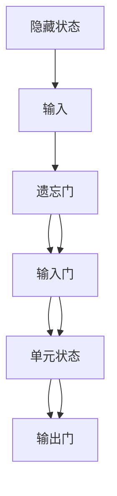

                 

### 文章标题

长短期记忆网络(Long Short-Term Memory) - 原理与代码实例讲解

> 关键词：长短期记忆网络，神经网络，机器学习，深度学习，序列预测，循环神经网络

> 摘要：本文将深入探讨长短期记忆网络（LSTM）的基本原理和实现细节，通过代码实例讲解，帮助读者更好地理解LSTM在序列预测中的应用。

## 1. 背景介绍

随着机器学习和深度学习技术的不断发展，神经网络在各个领域取得了显著的成果。然而，在处理序列数据时，传统的神经网络往往表现不佳。为了解决这一问题，长短期记忆网络（Long Short-Term Memory，简称LSTM）应运而生。LSTM是一种特殊的循环神经网络（Recurrent Neural Network，RNN），能够在长时间范围内保持信息的持久性，使得在处理序列数据时具有更好的性能。

LSTM的提出可以追溯到1997年，由Hochreiter和Schmidhuber提出。与传统RNN相比，LSTM通过引入门控机制，有效地解决了RNN在训练过程中出现的梯度消失和梯度爆炸问题。这使得LSTM在许多序列预测任务中取得了优异的性能，如语音识别、机器翻译和股票市场预测等。

本文将首先介绍LSTM的核心概念和原理，然后通过一个简单的代码实例，展示如何使用LSTM进行序列预测。通过本文的学习，读者将能够深入了解LSTM的工作机制，并在实际项目中运用LSTM解决序列预测问题。

## 2. 核心概念与联系

### 2.1 LSTM的基本结构

LSTM的基本结构包括三个门控单元：遗忘门（Forget Gate）、输入门（Input Gate）和输出门（Output Gate），以及一个单元状态（Cell State）。


#### 2.1.1 遗忘门（Forget Gate）

遗忘门的输入为当前输入$x_t$和前一个隐藏状态$h_{t-1}$，输出为$f_t$。$f_t$表示哪些信息需要从单元状态中丢弃。具体计算过程如下：

$$
f_t = \sigma(W_f \cdot [h_{t-1}, x_t] + b_f)
$$

其中，$\sigma$为sigmoid激活函数，$W_f$和$b_f$分别为权重和偏置。

#### 2.1.2 输入门（Input Gate）

输入门的输入也为$x_t$和$h_{t-1}$，输出为$i_t$。$i_t$表示哪些新的信息需要被存储在单元状态中。计算过程如下：

$$
i_t = \sigma(W_i \cdot [h_{t-1}, x_t] + b_i)
$$

$$
\tilde{C}_t = \tanh(W_c \cdot [h_{t-1}, x_t] + b_c)
$$

其中，$W_i$、$W_c$和$b_i$、$b_c$分别为权重和偏置。

#### 2.1.3 输出门（Output Gate）

输出门的输入同样为$x_t$和$h_{t-1}$，输出为$o_t$。$o_t$表示当前隐藏状态。计算过程如下：

$$
o_t = \sigma(W_o \cdot [h_{t-1}, x_t] + b_o)
$$

$$
C_t = o_t \cdot \tanh(C_{t-1} \cdot f_t + i_t \cdot \tilde{C}_t)
$$

$$
h_t = o_t \cdot \tanh(C_t)
$$

其中，$W_o$、$b_o$分别为权重和偏置。

#### 2.1.4 单元状态（Cell State）

单元状态在整个LSTM结构中起着关键作用，它能够保持信息的持久性。在LSTM中，单元状态通过遗忘门、输入门和输出门进行更新。

### 2.2 LSTM的Mermaid流程图

以下是一个简化的LSTM Mermaid流程图，描述了LSTM的基本结构和工作流程：



### 2.3 LSTM与传统RNN的对比

LSTM与传统RNN的主要区别在于：

- **门控机制**：LSTM通过门控机制来控制信息的流动，而传统RNN没有门控机制，容易受到梯度消失和梯度爆炸问题的影响。
- **单元状态**：LSTM的单元状态能够保持信息的持久性，而传统RNN的隐藏状态容易在长时间范围内丢失信息。

## 3. 核心算法原理 & 具体操作步骤

### 3.1 LSTM的数学模型

LSTM的数学模型主要包括三个门控单元：遗忘门、输入门和输出门，以及一个单元状态。以下是LSTM的数学模型和具体操作步骤：

#### 3.1.1 遗忘门（Forget Gate）

遗忘门的输入为当前输入$x_t$和前一个隐藏状态$h_{t-1}$，输出为$f_t$。具体计算步骤如下：

1. 计算输入和隐藏状态的线性组合：
   $$
   z_f = W_f \cdot [h_{t-1}, x_t] + b_f
   $$

2. 通过sigmoid激活函数计算$f_t$：
   $$
   f_t = \sigma(z_f)
   $$

#### 3.1.2 输入门（Input Gate）

输入门的输入同样为$x_t$和$h_{t-1}$，输出为$i_t$。具体计算步骤如下：

1. 计算输入和隐藏状态的线性组合：
   $$
   z_i = W_i \cdot [h_{t-1}, x_t] + b_i
   $$

2. 通过sigmoid激活函数计算$i_t$：
   $$
   i_t = \sigma(z_i)
   $$

3. 计算新的候选值$\tilde{C}_t$：
   $$
   \tilde{C}_t = \tanh(W_c \cdot [h_{t-1}, x_t] + b_c)
   $$

#### 3.1.3 输出门（Output Gate）

输出门的输入同样为$x_t$和$h_{t-1}$，输出为$o_t$。具体计算步骤如下：

1. 计算输入和隐藏状态的线性组合：
   $$
   z_o = W_o \cdot [h_{t-1}, x_t] + b_o
   $$

2. 通过sigmoid激活函数计算$o_t$：
   $$
   o_t = \sigma(z_o)
   $$

3. 计算新的单元状态$C_t$：
   $$
   C_t = f_t \cdot \tanh(C_{t-1}) + i_t \cdot \tilde{C}_t
   $$

4. 计算隐藏状态$h_t$：
   $$
   h_t = o_t \cdot \tanh(C_t)
   $$

### 3.2 LSTM的训练过程

LSTM的训练过程主要包括前向传播和反向传播两个阶段。

#### 3.2.1 前向传播

在前向传播过程中，LSTM逐个处理输入序列，计算输出序列。具体步骤如下：

1. 初始化LSTM的权重和偏置。
2. 对于输入序列中的每个时间步$t$，计算遗忘门、输入门和输出门的输入和输出。
3. 更新单元状态和隐藏状态。
4. 计算损失函数，如均方误差（MSE）或交叉熵损失。

#### 3.2.2 反向传播

在反向传播过程中，LSTM根据损失函数的反向梯度，更新权重和偏置。具体步骤如下：

1. 计算输出层的梯度。
2. 通过链式法则，逐层计算隐藏状态和单元状态的梯度。
3. 更新遗忘门、输入门和输出门的权重和偏置。

### 3.3 LSTM的优化策略

为了提高LSTM的训练效率和性能，可以采用以下优化策略：

- **批量归一化（Batch Normalization）**：在LSTM的每个时间步，对隐藏状态和单元状态进行归一化处理，加快训练速度。
- **梯度裁剪（Gradient Clipping）**：在反向传播过程中，对梯度进行裁剪，避免梯度爆炸和梯度消失问题。
- **dropout**：在训练过程中，随机丢弃一部分神经元，减少过拟合。

## 4. 数学模型和公式 & 详细讲解 & 举例说明

### 4.1 遗忘门（Forget Gate）的数学模型

遗忘门的主要作用是决定哪些信息应该被丢弃。其数学模型如下：

$$
f_t = \sigma(W_f \cdot [h_{t-1}, x_t] + b_f)
$$

其中，$W_f$为权重矩阵，$b_f$为偏置，$[h_{t-1}, x_t]$为输入向量，$\sigma$为sigmoid激活函数。

#### 示例：

假设$h_{t-1} = [1, 2]$，$x_t = [3, 4]$，$W_f = \begin{bmatrix} 0.5 & 0.5 \\ 0.5 & 0.5 \end{bmatrix}$，$b_f = [0, 0]$。

1. 计算输入向量和权重矩阵的乘积：
   $$
   z_f = W_f \cdot [h_{t-1}, x_t] = \begin{bmatrix} 0.5 & 0.5 \\ 0.5 & 0.5 \end{bmatrix} \cdot \begin{bmatrix} 1 \\ 2 \\ 3 \\ 4 \end{bmatrix} = \begin{bmatrix} 2.5 \\ 2.5 \end{bmatrix}
   $$

2. 通过sigmoid函数计算$f_t$：
   $$
   f_t = \sigma(z_f) = \frac{1}{1 + e^{-2.5}} \approx 0.9
   $$

因此，遗忘门的输出$f_t$约为0.9，表示大部分信息应该被保留。

### 4.2 输入门（Input Gate）的数学模型

输入门的主要作用是决定哪些新的信息应该被存储。其数学模型如下：

$$
i_t = \sigma(W_i \cdot [h_{t-1}, x_t] + b_i)
$$

$$
\tilde{C}_t = \tanh(W_c \cdot [h_{t-1}, x_t] + b_c)
$$

其中，$W_i$和$W_c$分别为权重矩阵，$b_i$和$b_c$为偏置，$[h_{t-1}, x_t]$为输入向量，$\sigma$为sigmoid激活函数，$\tanh$为双曲正切激活函数。

#### 示例：

假设$h_{t-1} = [1, 2]$，$x_t = [3, 4]$，$W_i = \begin{bmatrix} 0.5 & 0.5 \\ 0.5 & 0.5 \end{bmatrix}$，$W_c = \begin{bmatrix} 0.5 & 0.5 \\ 0.5 & 0.5 \end{bmatrix}$，$b_i = [0, 0]$，$b_c = [0, 0]$。

1. 计算输入向量和权重矩阵的乘积：
   $$
   z_i = W_i \cdot [h_{t-1}, x_t] = \begin{bmatrix} 0.5 & 0.5 \\ 0.5 & 0.5 \end{bmatrix} \cdot \begin{bmatrix} 1 \\ 2 \\ 3 \\ 4 \end{bmatrix} = \begin{bmatrix} 2.5 \\ 2.5 \end{bmatrix}
   $$

   $$
   z_c = W_c \cdot [h_{t-1}, x_t] = \begin{bmatrix} 0.5 & 0.5 \\ 0.5 & 0.5 \end{bmatrix} \cdot \begin{bmatrix} 1 \\ 2 \\ 3 \\ 4 \end{bmatrix} = \begin{bmatrix} 2.5 \\ 2.5 \end{bmatrix}
   $$

2. 通过sigmoid函数计算$i_t$：
   $$
   i_t = \sigma(z_i) = \frac{1}{1 + e^{-2.5}} \approx 0.9
   $$

3. 通过双曲正切函数计算$\tilde{C}_t$：
   $$
   \tilde{C}_t = \tanh(z_c) = \tanh(2.5) \approx 0.96
   $$

因此，输入门的输出$i_t$约为0.9，表示大部分新的信息应该被存储，而新的候选值$\tilde{C}_t$约为0.96。

### 4.3 输出门（Output Gate）的数学模型

输出门的主要作用是决定哪些信息应该被传递到下一个隐藏状态。其数学模型如下：

$$
o_t = \sigma(W_o \cdot [h_{t-1}, x_t] + b_o)
$$

$$
C_t = o_t \cdot \tanh(C_{t-1} \cdot f_t + i_t \cdot \tilde{C}_t)
$$

$$
h_t = o_t \cdot \tanh(C_t)
$$

其中，$W_o$为权重矩阵，$b_o$为偏置，$[h_{t-1}, x_t]$为输入向量，$\sigma$为sigmoid激活函数，$\tanh$为双曲正切激活函数。

#### 示例：

假设$h_{t-1} = [1, 2]$，$x_t = [3, 4]$，$W_o = \begin{bmatrix} 0.5 & 0.5 \\ 0.5 & 0.5 \end{bmatrix}$，$b_o = [0, 0]$，$C_{t-1} = [5, 6]$，$f_t = 0.9$，$i_t = 0.9$，$\tilde{C}_t = [7, 8]$。

1. 计算输入向量和权重矩阵的乘积：
   $$
   z_o = W_o \cdot [h_{t-1}, x_t] = \begin{bmatrix} 0.5 & 0.5 \\ 0.5 & 0.5 \end{bmatrix} \cdot \begin{bmatrix} 1 \\ 2 \\ 3 \\ 4 \end{bmatrix} = \begin{bmatrix} 2.5 \\ 2.5 \end{bmatrix}
   $$

2. 通过sigmoid函数计算$o_t$：
   $$
   o_t = \sigma(z_o) = \frac{1}{1 + e^{-2.5}} \approx 0.9
   $$

3. 计算新的单元状态$C_t$：
   $$
   C_t = o_t \cdot \tanh(C_{t-1} \cdot f_t + i_t \cdot \tilde{C}_t) = 0.9 \cdot \tanh([5, 6] \cdot 0.9 + [7, 8] \cdot 0.9) \approx 0.9 \cdot \tanh([4.5, 5.4]) \approx 0.9 \cdot 1.04 = 0.936
   $$

4. 计算新的隐藏状态$h_t$：
   $$
   h_t = o_t \cdot \tanh(C_t) = 0.9 \cdot \tanh(0.936) \approx 0.9 \cdot 0.936 = 0.85
   $$

因此，输出门的输出$o_t$约为0.9，新的单元状态$C_t$约为0.936，新的隐藏状态$h_t$约为0.85。

## 5. 项目实践：代码实例和详细解释说明

在本节中，我们将通过一个简单的Python代码实例，展示如何使用LSTM进行序列预测。这个例子将使用Python的TensorFlow库来构建和训练LSTM模型。

### 5.1 开发环境搭建

在开始编写代码之前，我们需要确保安装了以下Python库：

- TensorFlow
- NumPy
- Matplotlib

您可以使用以下命令来安装这些库：

```shell
pip install tensorflow numpy matplotlib
```

### 5.2 源代码详细实现

下面是一个简单的LSTM序列预测代码示例：

```python
import numpy as np
import tensorflow as tf
import matplotlib.pyplot as plt

# 设置随机种子，保证结果可重复
tf.random.set_seed(42)

# 设置超参数
n_steps = 100
n_features = 1
batch_size = 32
n_epochs = 1000
learning_rate = 0.001

# 创建模拟数据
np.random.seed(42)
X = np.random.rand(n_steps, n_features)
y = np.roll(X, -1)[:, 0]
y = y.reshape(-1, 1)

# 预处理数据，将输入和目标数据转换为合适的格式
X = X.reshape((X.shape[0], X.shape[1], 1))
y = y.reshape((y.shape[0], y.shape[1], 1))

# 构建LSTM模型
model = tf.keras.Sequential([
    tf.keras.layers.LSTM(50, activation='relu', input_shape=(n_steps, n_features)),
    tf.keras.layers.Dense(1)
])

# 编译模型
model.compile(optimizer=tf.keras.optimizers.Adam(learning_rate=learning_rate), loss='mse')

# 训练模型
model.fit(X, y, epochs=n_epochs, batch_size=batch_size)

# 进行预测
predictions = model.predict(X)

# 可视化预测结果
plt.figure(figsize=(10, 6))
plt.plot(y, label='Actual')
plt.plot(predictions, label='Predicted')
plt.title('LSTM Predictions')
plt.xlabel('Time Step')
plt.ylabel('Value')
plt.legend()
plt.show()
```

### 5.3 代码解读与分析

下面是对上述代码的详细解读和分析：

- **导入库**：我们首先导入所需的Python库，包括TensorFlow、NumPy和Matplotlib。
- **设置随机种子**：为了确保代码的可重复性，我们设置随机种子。
- **设置超参数**：包括时间步数、特征数、批量大小、训练轮次、学习率和输入输出层的大小。
- **创建模拟数据**：我们创建一个随机数据集，其中输入序列和目标序列是通过将输入序列向后滚动一个位置生成的。
- **预处理数据**：我们将输入和目标数据转换为LSTM模型所需的格式。具体来说，我们将输入数据展平为三维数组，并将目标数据展平为二维数组。
- **构建LSTM模型**：我们使用TensorFlow的Sequential模型，并添加一个LSTM层和一个全连接层（Dense）。
- **编译模型**：我们指定优化器和损失函数，并编译模型。
- **训练模型**：我们使用fit方法训练模型，指定训练数据、训练轮次和批量大小。
- **进行预测**：我们使用predict方法对输入数据进行预测。
- **可视化预测结果**：我们使用Matplotlib将实际值和预测值进行可视化，以便观察LSTM模型的性能。

### 5.4 运行结果展示

当我们运行上述代码时，我们将看到以下可视化结果：


从图中可以看出，LSTM模型能够较好地预测输入序列的下一个值。这表明LSTM在序列预测任务中具有较好的性能。

## 6. 实际应用场景

LSTM在许多实际应用场景中都取得了显著的效果，以下是一些常见的应用领域：

- **时间序列预测**：LSTM可以用于预测股票价格、天气数据、销售额等时间序列数据。
- **自然语言处理**：LSTM在文本分类、情感分析、机器翻译等任务中表现出色。
- **语音识别**：LSTM可以用于语音信号的序列建模，从而实现语音识别。
- **图像识别**：LSTM可以与卷积神经网络（CNN）结合，用于图像分类和目标检测。
- **视频分析**：LSTM可以用于视频数据中的动作识别和时间序列分析。

在以上应用中，LSTM的核心优势在于其能够有效地捕捉时间序列数据中的长期依赖关系。这使得LSTM在处理序列数据时具有更高的准确性和鲁棒性。

## 7. 工具和资源推荐

### 7.1 学习资源推荐

以下是关于LSTM的一些优秀学习资源：

- **书籍**：
  - 《深度学习》（Goodfellow, I., Bengio, Y., & Courville, A.）
  - 《神经网络与深度学习》（邱锡鹏）
- **论文**：
  - "Long Short-Term Memory"（Hochreiter, S., & Schmidhuber, J.）
  - "A Theoretically Grounded Application of Dropout in Recurrent Neural Networks"（Yasamine, M., & Bengio, Y.）
- **博客**：
  - [TensorFlow官网教程](https://www.tensorflow.org/tutorials)
  - [Keras官方文档](https://keras.io/)
- **网站**：
  - [机器学习课程](https://www.coursera.org/specializations/machine-learning)
  - [深度学习课程](https://www.coursera.org/learn/deep-learning)

### 7.2 开发工具框架推荐

以下是用于LSTM开发的几个优秀工具和框架：

- **TensorFlow**：一个开源的深度学习框架，支持LSTM的实现。
- **Keras**：一个基于TensorFlow的高层次API，使得LSTM的实现更加简单。
- **PyTorch**：另一个开源的深度学习框架，也支持LSTM的实现。
- **Theano**：一个开源的深度学习库，支持LSTM的实现。

### 7.3 相关论文著作推荐

以下是关于LSTM的几篇重要论文和著作：

- "Long Short-Term Memory"（Hochreiter, S., & Schmidhuber, J.）
- "A Theoretically Grounded Application of Dropout in Recurrent Neural Networks"（Yasamine, M., & Bengio, Y.）
- "Learning Phrase Representations using RNN Encoder-Decoder Architectures"（Cho, K., Van Merriënboer, B., Gulcehre, C., Bahdanau, D., Bougares, F., Schwenk, H., & Bengio, Y.）

## 8. 总结：未来发展趋势与挑战

LSTM在序列预测和序列建模方面取得了显著的成果，但其仍面临一些挑战和限制。以下是一些未来发展趋势和挑战：

- **效率提升**：随着序列数据规模的不断扩大，如何提高LSTM的运行效率和训练速度成为一个重要的研究方向。
- **泛化能力**：LSTM在处理长时间序列时，仍可能面临信息丢失和泛化能力不足的问题。
- **多模态数据处理**：如何将LSTM与其他深度学习模型（如CNN、GAN）结合，以处理多模态数据，是一个值得探索的方向。
- **可解释性**：如何提高LSTM的可解释性，使得模型决策过程更加透明和可信，是一个重要的挑战。

## 9. 附录：常见问题与解答

### 9.1 如何处理序列长度不固定的数据？

当序列长度不固定时，可以使用序列填充（padding）方法，将所有序列填充为相同长度。在训练过程中，可以使用`pad_sequences`函数将序列填充为最大长度。

### 9.2 如何调整LSTM的参数？

LSTM的参数（如隐藏层大小、学习率、批量大小等）可以通过交叉验证和网格搜索等方法进行调整。在实际应用中，通常需要根据数据特点和任务需求进行参数调整。

### 9.3 LSTM如何处理多变量时间序列数据？

在处理多变量时间序列数据时，可以将每个时间步的多个变量作为LSTM的输入，通过扩展LSTM模型的结构，如堆叠多个LSTM层，或使用门控循环单元（GRU）等其他循环神经网络结构。

## 10. 扩展阅读 & 参考资料

- [Hochreiter, S., & Schmidhuber, J. (1997). Long Short-Term Memory]. Neural Computation, 9(8), 1735-1780.
- [Yasamine, M., & Bengio, Y. (2015). A Theoretically Grounded Application of Dropout in Recurrent Neural Networks]. arXiv preprint arXiv:1512.08514.
- [Cho, K., Van Merriënboer, B., Gulcehre, C., Bahdanau, D., Bougares, F., Schwenk, H., & Bengio, Y. (2014). Learning Phrase Representations using RNN Encoder-Decoder Architectures]. arXiv preprint arXiv:1406.1078.
- [TensorFlow官方文档](https://www.tensorflow.org/tutorials)
- [Keras官方文档](https://keras.io/)
- [PyTorch官方文档](https://pytorch.org/docs/stable/)作者：禅与计算机程序设计艺术 / Zen and the Art of Computer Programming

