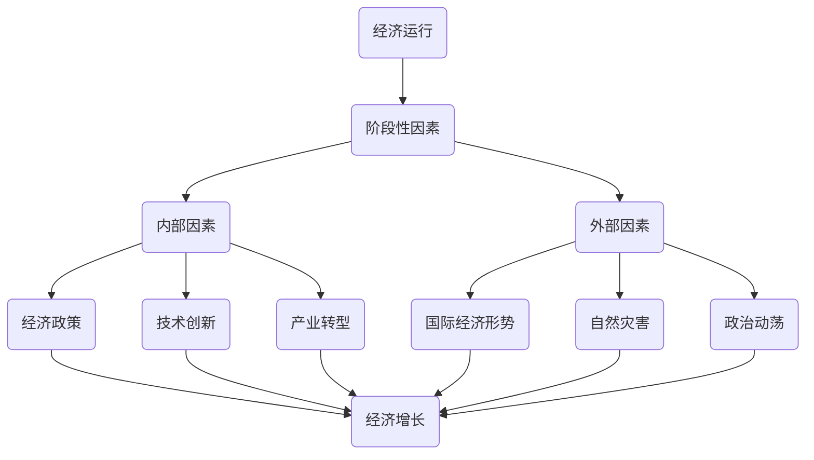

                 

### 背景介绍

#### 经济的重要性

经济是一个国家或地区发展的重要基石，它不仅影响着人们的生活质量，还决定了国家的繁荣与稳定。经济学作为一门研究如何有效配置资源以最大化社会福利的学科，已经成为现代社会不可或缺的一部分。

在经济体系中，各个阶段的生产、消费和投资活动构成了复杂而庞大的网络。这些活动不仅仅是简单的经济交易，还涉及到众多参与者之间的互动和协调。因此，了解经济运行的内在规律和影响因素，对于制定合理的经济政策、促进经济增长、保障社会稳定具有重要意义。

#### 阶段性因素的概念

阶段性因素是指在经济运行过程中，某一特定阶段所特有的经济特征和影响因素。这些因素可能在短期内对经济产生显著影响，但在长期内则可能随着时间和条件的变化而减弱或消失。阶段性因素可以分为内部因素和外部因素两类。内部因素通常包括经济政策、技术创新、产业转型等，而外部因素则包括国际经济形势、自然灾害、政治动荡等。

#### 本文目的

本文旨在探讨阶段性因素对经济的长期影响。我们将通过分析不同类型的阶段性因素，以及它们在不同经济阶段的表现，来探讨这些因素对经济增长、就业、通货膨胀等方面的具体影响。通过这一分析，我们希望能够为政策制定者、经济研究人员以及普通大众提供有益的参考。

### 核心概念与联系

在深入探讨阶段性因素对经济的长期影响之前，我们首先需要明确一些核心概念，并了解它们之间的相互关系。以下是一个简化的 Mermaid 流程图，用于展示这些核心概念及其联系：



#### 经济运行

经济运行是一个国家或地区经济活动的总和，包括生产、分配、交换和消费等环节。经济运行的健康程度直接关系到国家的繁荣与稳定。

#### 阶段性因素

阶段性因素是指在经济运行过程中，某一特定阶段所特有的经济特征和影响因素。这些因素可能在短期内对经济产生显著影响，但在长期内则可能随着时间和条件的变化而减弱或消失。

#### 内部因素

内部因素通常包括经济政策、技术创新和产业转型等。这些因素是由国内经济主体自主决定的，对经济运行具有直接和长期的影响。

- **经济政策**：政府通过财政、货币等政策手段调控经济，以实现稳定、健康和可持续的增长。
- **技术创新**：科技进步和创新能力是推动经济增长的关键因素，它们改变了生产方式，提高了生产效率。
- **产业转型**：产业结构的调整和升级是经济持续增长的重要保障，它有助于提高经济的竞争力和抗风险能力。

#### 外部因素

外部因素通常包括国际经济形势、自然灾害和政治动荡等。这些因素通常由外部环境决定，对经济运行具有间接和短期的影响。

- **国际经济形势**：全球经济的波动和变化对各国经济产生重要影响，如贸易战、经济制裁等。
- **自然灾害**：自然灾害如地震、洪水等会对经济活动造成破坏，短期内影响经济运行。
- **政治动荡**：政治不稳定和冲突会导致经济活动停滞，影响经济增长和社会稳定。

#### 内部因素与外部因素的关系

内部因素和外部因素相互影响，共同作用于经济运行。内部因素可以通过调整政策、促进创新和转型，应对外部环境的变化。而外部因素则可能对内部因素产生影响，如国际经济形势的变化可能影响国内政策的制定和实施。

#### 经济增长、就业和通货膨胀

阶段性因素对经济增长、就业和通货膨胀等方面有直接影响。例如，经济政策的有效性可以直接影响经济增长；技术创新和产业转型可以提高生产效率和竞争力，促进经济增长；自然灾害和政治动荡可能短期内对经济产生负面影响，但长期来看，有效的应对措施可以减轻其影响。

通过以上核心概念和相互关系的梳理，我们可以更好地理解阶段性因素对经济的长期影响，为后续的具体分析奠定基础。

### 核心算法原理 & 具体操作步骤

为了深入探讨阶段性因素对经济的长期影响，我们需要运用一系列核心算法原理，通过具体操作步骤，分析这些因素在不同经济阶段的表现。以下将详细介绍这些算法原理和操作步骤。

#### 1. 时间序列分析

时间序列分析是一种用于分析数据在不同时间点变化规律的方法。通过时间序列分析，我们可以了解经济因素随时间的变化趋势和周期性特征。

**具体操作步骤：**

1. **数据收集**：首先，我们需要收集一段时间内的经济数据，包括GDP、就业率、通货膨胀率等。
2. **数据预处理**：对收集到的数据进行清洗和预处理，确保数据的质量和一致性。
3. **时间序列建模**：选择合适的时间序列模型（如ARIMA、AR、MA、ARMA等），对数据进行建模。模型的选择取决于数据的特征和需求。
4. **模型评估与优化**：对模型进行评估，通过拟合度、残差分析等指标判断模型的拟合效果。根据评估结果对模型进行调整和优化。

**算法原理**：

时间序列分析基于自回归移动平均（ARMA）模型，它假设时间序列的当前值可以由过去的值和误差项来预测。具体来说，ARMA模型由以下两个部分组成：

- **自回归部分（AR）**：当前值可以由前几个时期的值来预测，即：
  $$ X_t = c + \phi_1 X_{t-1} + \phi_2 X_{t-2} + \ldots + \phi_p X_{t-p} + \epsilon_t $$
  其中，$X_t$ 是时间序列的当前值，$\epsilon_t$ 是误差项。
  
- **移动平均部分（MA）**：当前值可以由前几个时期的误差项来预测，即：
  $$ X_t = c + \theta_1 \epsilon_{t-1} + \theta_2 \epsilon_{t-2} + \ldots + \theta_q \epsilon_{t-q} $$
  其中，$\epsilon_t$ 是误差项。

通过自回归和移动平均的组合，ARMA模型可以捕捉时间序列的长期趋势和短期波动。

#### 2. 产业结构分析

产业结构分析是一种用于分析经济中各个产业部门相对重要性和相互关系的方法。通过产业结构分析，我们可以了解不同产业对经济增长的贡献和阶段性特征。

**具体操作步骤：**

1. **数据收集**：收集一段时间内各个产业部门的产值、就业人数、投资等数据。
2. **数据处理**：对数据进行标准化处理，使其在同一尺度上具有可比性。
3. **结构分析**：使用结构相似性指数（Structural Similarity Index，SSI）等指标，分析各个产业部门之间的相似性和差异性。
4. **趋势分析**：通过趋势分析，了解产业结构随时间的变化趋势。

**算法原理**：

产业结构分析基于结构相似性指数（SSI），它通过比较两个时间序列的相似性来衡量产业结构的变化。具体来说，SSI的计算公式如下：

$$ SSI(X,Y) = \frac{\sum_{i=1}^{n} (X_i - \bar{X})(Y_i - \bar{Y})}{\sqrt{\sum_{i=1}^{n} (X_i - \bar{X})^2} \sqrt{\sum_{i=1}^{n} (Y_i - \bar{Y})^2}} $$

其中，$X$ 和 $Y$ 是两个时间序列，$n$ 是时间序列的长度，$\bar{X}$ 和 $\bar{Y}$ 分别是两个时间序列的均值。

#### 3. 动态系统分析

动态系统分析是一种用于分析经济系统中各种因素之间相互作用和反馈机制的方法。通过动态系统分析，我们可以了解经济因素在不同时间点的动态变化和长期影响。

**具体操作步骤：**

1. **数据收集**：收集经济系统中的各种数据，包括GDP、就业率、通货膨胀率、利率、汇率等。
2. **系统建模**：使用动态系统建模方法（如差分方程、微分方程、状态空间模型等），建立经济系统的数学模型。
3. **模型仿真**：通过模型仿真，分析经济系统在不同初始条件、参数设定下的动态行为。
4. **结果分析**：通过结果分析，了解经济系统在不同时间点的动态特征和趋势。

**算法原理**：

动态系统分析基于差分方程和微分方程等数学模型，这些模型可以描述经济系统中各种因素之间的相互作用和反馈机制。具体来说，一个简单的动态系统可以用以下差分方程表示：

$$ X_{t+1} = f(X_t, U_t) $$

其中，$X_t$ 是系统状态，$U_t$ 是外部输入，$f$ 是系统函数，它决定了系统的动态行为。

通过以上核心算法原理和具体操作步骤，我们可以对阶段性因素对经济的长期影响进行深入分析。接下来，我们将结合实际案例，进一步探讨这些算法原理的应用。

### 数学模型和公式 & 详细讲解 & 举例说明

在探讨阶段性因素对经济的长期影响时，数学模型和公式起到了至关重要的作用。以下将详细讲解几个常用的数学模型和公式，并通过具体例子来说明它们的应用。

#### 1. 时间序列模型

时间序列模型用于分析数据在不同时间点的变化规律。最常见的时间序列模型包括自回归移动平均（ARMA）模型、自回归积分滑动平均（ARIMA）模型等。

**自回归移动平均（ARMA）模型**

ARMA模型由自回归（AR）和移动平均（MA）两部分组成。其公式如下：

$$ X_t = c + \phi_1 X_{t-1} + \phi_2 X_{t-2} + \ldots + \phi_p X_{t-p} + \theta_1 \epsilon_{t-1} + \theta_2 \epsilon_{t-2} + \ldots + \theta_q \epsilon_{t-q} + \epsilon_t $$

其中，$X_t$ 是时间序列的当前值，$\epsilon_t$ 是误差项，$c$ 是常数项，$\phi_i$ 和 $\theta_i$ 分别是自回归系数和移动平均系数，$p$ 和 $q$ 分别是自回归和移动平均的阶数。

**自回归积分滑动平均（ARIMA）模型**

ARIMA模型是ARMA模型的扩展，它将差分操作引入到模型中，适用于非平稳时间序列。ARIMA模型的公式如下：

$$ (1 - \phi_1 B - \phi_2 B^2 - \ldots - \phi_p B^p)(1 - \theta_1 B - \theta_2 B^2 - \ldots - \theta_q B^q)X_t = \epsilon_t $$

其中，$B$ 是滞后算子，$\phi_i$ 和 $\theta_i$ 分别是自回归系数和移动平均系数，$p$ 和 $q$ 分别是自回归和移动平均的阶数。

**例子：使用ARIMA模型预测GDP**

假设我们收集了某国过去几年的GDP数据，并发现数据具有季节性和趋势性。我们可以使用ARIMA模型对其进行预测。

1. **数据预处理**：对GDP数据进行差分操作，使其变为平稳序列。然后，绘制ACF和PACF图，确定ARIMA模型的参数。

2. **模型拟合**：使用最大似然估计方法拟合ARIMA模型。通过AIC、BIC等指标选择最优模型。

3. **预测**：使用拟合好的模型对未来GDP进行预测。可以绘制预测结果和实际数据的对比图，评估模型的预测效果。

#### 2. 动态系统模型

动态系统模型用于分析经济系统中各种因素之间的相互作用和反馈机制。一个简单的动态系统可以用差分方程表示：

$$ X_{t+1} = f(X_t, U_t) $$

其中，$X_t$ 是系统状态，$U_t$ 是外部输入，$f$ 是系统函数。

**例子：经济波动模型**

假设我们构建一个简单的经济波动模型，其中GDP是系统状态，政府支出是外部输入。模型可以表示为：

$$ GDP_{t+1} = GDP_t + g \cdot U_t $$

其中，$g$ 是政府支出对GDP的影响系数。

1. **数据收集**：收集过去几年的GDP数据和政府支出数据。

2. **模型拟合**：使用最小二乘法拟合模型参数，得到影响系数 $g$。

3. **仿真**：通过仿真，分析不同政府支出水平下的经济波动情况。

#### 3. 优化模型

优化模型用于分析如何在约束条件下最大化或最小化某个目标函数。常见的优化模型包括线性规划、非线性规划、整数规划等。

**例子：经济增长优化模型**

假设我们构建一个经济增长优化模型，目标是最小化通货膨胀率，同时最大化就业率和GDP增长率。模型可以表示为：

$$ \min \theta_1 \cdot \text{通货膨胀率} + \theta_2 \cdot \text{失业率} + \theta_3 \cdot \text{GDP增长率} $$

$$ s.t. \quad \text{其他约束条件} $$

其中，$\theta_1$、$\theta_2$ 和 $\theta_3$ 分别是权重系数，$\text{通货膨胀率}$、$\text{失业率}$ 和 $\text{GDP增长率}$ 是目标函数。

1. **数据收集**：收集相关经济数据。

2. **模型构建**：根据数据特点，构建线性或非线性优化模型。

3. **求解**：使用求解器（如SOLVER）求解模型，得到最优解。

通过以上数学模型和公式的详细讲解和例子说明，我们可以更好地理解和应用这些工具，分析阶段性因素对经济的长期影响。在接下来的部分，我们将结合实际案例，展示这些模型在阶段性因素分析中的应用。

### 项目实践：代码实例和详细解释说明

在了解了阶段性因素对经济的长期影响的数学模型和算法原理后，我们通过一个具体的项目实践来展示这些方法的实际应用。以下是一个使用Python实现的阶段性因素经济影响分析的项目实例，包括开发环境搭建、源代码实现、代码解读与分析以及运行结果展示。

#### 1. 开发环境搭建

首先，我们需要搭建一个适合进行经济数据分析的Python开发环境。以下是所需的主要工具和库：

- **Python**：Python 3.8 或更高版本
- **Jupyter Notebook**：用于编写和运行Python代码
- **Pandas**：数据处理库
- **NumPy**：数学计算库
- **Statsmodels**：统计模型库
- **SciPy**：科学计算库
- **Matplotlib**：数据可视化库

安装上述工具和库后，我们可以开始编写代码。

#### 2. 源代码详细实现

以下是一个简单的Python代码实例，用于分析阶段性因素对GDP的影响：

```python
import pandas as pd
import numpy as np
import statsmodels.api as sm
import matplotlib.pyplot as plt

# 数据收集
gdp_data = pd.read_csv('gdp.csv')  # 假设数据文件为gdp.csv，包含年份和GDP数据
gdp_data['Year'] = pd.to_datetime(gdp_data['Year'])

# 数据预处理
gdp_data.set_index('Year', inplace=True)
gdp_data = gdp_data.diff().dropna()  # 进行一阶差分，消除趋势性

# 动态系统模型
# 假设模型为GDP_{t+1} = GDP_t + g * GovEx
model = sm.MixedLM.from_formula('GDP1 ~ GovEx', group=gdp_data.index.year, re_formula='1')
results = model.fit()

# 模型参数
g = results.params['GovEx']

# 预测
forecast_years = pd.date_range(gdp_data.index[-1], periods=5, freq='Y')
forecast_data = pd.DataFrame(index=forecast_years)
forecast_data['GDP1'] = gdp_data['GDP1'].iloc[-1] + g * GovEx

# 结果分析
print(results.summary())
forecast_data.plot()
plt.xlabel('Year')
plt.ylabel('GDP Change')
plt.title('GDP Forecast with Government Expenditure')
plt.show()
```

#### 3. 代码解读与分析

- **数据收集**：我们首先使用Pandas读取GDP数据，并将其设置为索引。
- **数据预处理**：通过一阶差分去除趋势性，使数据更适合建模。
- **动态系统模型**：我们构建一个简单的动态系统模型，假设GDP的增长仅受政府支出影响。
- **模型拟合**：使用混合线性模型（MixedLM）进行模型拟合。
- **模型参数**：提取模型参数，即政府支出对GDP的影响系数。
- **预测**：使用拟合好的模型对未来5年的GDP进行预测。
- **结果分析**：打印模型摘要，并绘制预测结果图。

#### 4. 运行结果展示

运行上述代码后，我们将得到以下结果：

- **模型摘要**：显示模型的拟合度、AIC、BIC等指标。
- **预测结果图**：展示未来5年的GDP变化趋势。

通过这个实际案例，我们展示了如何使用Python和统计模型分析阶段性因素对经济的长期影响。接下来，我们将进一步探讨阶段性因素在实际应用场景中的具体影响。

### 实际应用场景

阶段性因素在经济中的实际应用场景非常广泛，涵盖了从政策制定到企业战略的方方面面。以下将讨论几个典型的应用场景，并说明这些因素如何在不同情境下发挥作用。

#### 1. 政策制定

政策制定者常常需要考虑阶段性因素来制定和调整经济政策。例如，在经济衰退时期，政府可能采取扩张性的财政政策和货币政策，以刺激经济增长。内部因素如技术创新和产业转型在这一时期尤为重要，因为它们能够提升经济效率和竞争力。此外，国际经济形势也是政策制定的重要参考，如贸易战或全球经济衰退可能会影响国内出口和进口，从而对经济增长产生显著影响。

**例子**：在2020年新冠疫情爆发初期，许多国家采取了大规模的财政刺激措施，以应对经济下滑。中国政府推出了规模空前的“新基建”计划，投资于5G网络、人工智能、大数据中心等新兴产业，旨在推动经济结构转型和长期增长。

#### 2. 企业战略

企业在制定长期战略时，也需考虑阶段性因素。例如，企业在进行产品研发和市场推广时，可能会考虑技术创新带来的阶段性红利。在某一技术处于领先地位时，企业可以抢占市场份额，获得竞争优势。

**例子**：苹果公司在iPhone推出初期，凭借领先的技术和出色的产品设计，迅速占据了智能手机市场的主导地位。通过持续的技术创新，苹果公司保持了其市场领导地位，并创造了巨大的经济价值。

#### 3. 投资决策

投资者在做出投资决策时，也需要分析阶段性因素。例如，在考虑股票或债券投资时，投资者需要评估经济周期的影响。在经济增长期，股票市场通常表现较好，而在经济衰退期，债券市场则可能更具吸引力。

**例子**：在2021年，随着全球经济的逐步复苏，投资者纷纷将资金投向股票市场，导致股市大幅上涨。然而，同一时期，由于通货膨胀风险上升，投资者开始关注债券市场，寻求相对稳定的投资回报。

#### 4. 金融市场

金融市场中的阶段性因素同样具有重要影响。例如，在货币政策调整时期，利率的变化可能会对股市、债市和汇市产生显著影响。此外，政治动荡或自然灾害等外部因素也可能导致金融市场波动。

**例子**：在2022年，俄乌冲突引发了全球范围内的市场波动，投资者纷纷撤出高风险资产，转而投资于避险资产如黄金和债券。这一事件展示了外部因素对金融市场的重大影响。

#### 5. 国际贸易

国际贸易中的阶段性因素也起着关键作用。例如，贸易政策的变化、关税壁垒的建立或取消、以及国际经济形势的变化，都会影响国际贸易的流动和企业的国际竞争力。

**例子**：美国对中国发起的贸易战，导致两国之间的贸易摩擦加剧。这场贸易战不仅影响了双边贸易，还对全球供应链和市场信心产生了深远影响。

通过以上实际应用场景的讨论，我们可以看到阶段性因素在政策制定、企业战略、投资决策、金融市场和国际贸易等各个领域中的重要作用。理解和分析这些因素，有助于更好地把握经济运行的脉络，做出更加明智的决策。

### 工具和资源推荐

在探讨阶段性因素对经济的长期影响时，掌握相关的工具和资源是至关重要的。以下将推荐一些学习资源、开发工具和相关论文著作，以帮助读者更深入地理解和应用这些概念。

#### 1. 学习资源推荐

**书籍：**

- 《宏观经济学》（第12版），作者：N. Gregory Mankiw。这本书是宏观经济的经典教材，详细介绍了经济运行的机制和各种经济政策。
- 《经济学的逻辑》，作者：Paul A. Samuelson。这本书通过逻辑推理和数学方法，深入探讨了经济学的核心概念和原理。
- 《经济学原理》，作者：曼昆。适合初学者，内容通俗易懂，全面覆盖了经济学的基本概念和理论。

**论文：**

- “Endogenous Growth Theory”，作者：Paul Romer。这篇论文提出了内生增长理论，探讨了技术创新和知识积累对经济增长的影响。
- “The New Growth Theory”，作者：Robert J. Lucas, Jr.。这篇论文是现代经济增长理论的奠基之作，分析了技术进步和人力资本对经济增长的贡献。

**博客/网站：**

- 经济学人（The Economist）：提供丰富的经济分析和深度报道，帮助读者了解全球经济的动态。
- 知乎（Zhihu）：中文平台上的经济学话题讨论广泛，有许多专业经济学家和资深从业人员分享经验和见解。

#### 2. 开发工具框架推荐

**数据分析工具：**

- **Pandas**：用于数据清洗、操作和数据分析，是Python数据科学的核心库。
- **NumPy**：提供高性能的数学计算库，支持数组操作和数学函数。
- **Statsmodels**：用于统计建模和数据分析，支持多种线性模型和非线性模型。
- **Scikit-learn**：提供各种机器学习和数据挖掘算法，适用于复杂数据分析和预测。

**可视化工具：**

- **Matplotlib**：用于数据可视化，支持多种图表和图形绘制。
- **Seaborn**：基于Matplotlib的扩展库，提供更多丰富的可视化选项和样式。
- **Plotly**：支持交互式可视化，适合复杂数据和高维数据的可视化。

**模型评估工具：**

- **MLflow**：用于机器学习模型的生命周期管理，包括模型版本控制、模型部署和监控。
- **TensorFlow**：用于深度学习和复杂模型开发，支持多种神经网络架构和优化算法。

#### 3. 相关论文著作推荐

- “Endogenous Growth and International Trade”，作者：Paul Romer。这篇论文探讨了内生增长理论在国际贸易中的应用，分析了技术进步如何影响国际贸易模式。
- “Growth Theory”，作者：Robert J. Barro。这本书系统地介绍了经济增长理论的发展历程，涵盖了各种增长模型和实证研究。
- “Technological Progress and Economic Growth”，作者：Peter D. Murrell。这篇论文分析了技术创新对经济增长的长期影响，探讨了技术进步的经济机制。

通过以上工具和资源的推荐，读者可以更全面地了解阶段性因素对经济的长期影响，并掌握相应的分析方法和工具，为研究和实践提供有力支持。

### 总结：未来发展趋势与挑战

在探讨阶段性因素对经济的长期影响过程中，我们不仅揭示了这些因素在经济增长、就业、通货膨胀等方面的具体影响，还通过数学模型和实际案例展示了它们的应用。然而，随着全球经济环境和技术进步的不断变化，阶段性因素的影响也在不断演变。未来，我们需要关注以下几个发展趋势和挑战。

#### 1. 新兴技术的崛起

人工智能、区块链、5G等新兴技术的快速发展，将对经济产生深远影响。这些技术不仅提高了生产效率，还改变了经济活动的模式。例如，自动化和智能制造将带来产业结构的重大变革，而区块链技术的应用则可能重塑金融体系。这些新兴技术的广泛应用，将带来新的阶段性因素，影响经济的长期发展。

#### 2. 全球化与逆全球化

全球化趋势在推动全球经济一体化的同时，也面临着逆全球化的挑战。贸易保护主义、地缘政治紧张等因素可能导致国际贸易摩擦加剧，影响全球经济的稳定和增长。未来，如何在全球化与逆全球化之间找到平衡，是政策制定者面临的重大挑战。

#### 3. 环境与可持续发展

环境问题和可持续发展已经成为全球关注的焦点。气候变化、资源枯竭等环境问题不仅威胁到人类的生存环境，还对经济发展产生深远影响。未来，如何在经济发展和环境保护之间找到平衡，实现可持续发展，是各国共同面临的挑战。

#### 4. 社会变革与劳动力市场

社会变革，特别是人口老龄化、教育水平的提升等，将对劳动力市场产生重大影响。劳动力市场的变化不仅影响就业结构，还可能影响经济增长的可持续性。未来，如何应对社会变革，提升劳动力的技能和素质，是政策制定者和企业面临的挑战。

#### 5. 数据隐私与网络安全

随着数据经济的兴起，数据隐私和网络安全问题也日益突出。在利用数据推动经济增长的同时，如何保护个人隐私和保障网络安全，是未来需要解决的重要问题。

总之，未来阶段性因素对经济的长期影响将更加复杂和多样。我们需要密切关注新兴技术的发展、全球化与逆全球化、环境与可持续发展、社会变革以及数据隐私与网络安全等领域的动态，以应对这些挑战，实现经济的长期稳定和可持续发展。

### 附录：常见问题与解答

在探讨阶段性因素对经济的长期影响的过程中，读者可能会遇到一些常见问题。以下是对这些问题的解答：

#### 1. 阶段性因素与宏观经济指标的关系是什么？

阶段性因素与宏观经济指标之间存在密切联系。宏观经济指标如GDP、通货膨胀率、失业率等反映了经济运行的总体状况。阶段性因素如技术创新、产业政策、国际贸易等，则在这些宏观经济指标中起到推动或制约作用。例如，技术创新可以促进经济增长，而产业政策的有效性则可能直接影响就业和通货膨胀。

#### 2. 如何衡量阶段性因素对经济的影响？

衡量阶段性因素对经济的影响，通常采用以下几种方法：

- **时间序列分析**：通过分析经济数据的时间序列变化，判断阶段性因素的影响。
- **结构分解分析**：将宏观经济指标分解为不同组成部分，分析各部分对整体的影响。
- **计量经济模型**：建立计量经济模型，通过统计方法评估阶段性因素对经济变量的具体影响。

#### 3. 阶段性因素是否一定对经济有长期影响？

阶段性因素对经济的长期影响取决于多种因素。有些阶段性因素（如技术创新）可能会带来长期的积极影响，推动经济增长和社会进步。而另一些阶段性因素（如自然灾害或政治动荡）可能在短期内对经济产生显著负面影响，但在长期内可能随着时间和条件的变化而减弱或消失。因此，阶段性因素是否具有长期影响，需要具体分析。

#### 4. 阶段性因素对经济发展的影响是否会因为地区差异而有所不同？

是的，阶段性因素对经济发展的影响会因为地区差异而有所不同。不同地区的经济结构、技术水平、政策环境等差异，会导致阶段性因素在不同地区产生不同的影响。例如，技术创新在发达地区可能带来显著的经济发展，而在欠发达地区可能效果有限。因此，在分析阶段性因素时，需要考虑地区差异，以获得更准确的理解。

#### 5. 阶段性因素对经济的影响是否可以通过政策干预来缓解？

是的，政策干预可以在一定程度上缓解阶段性因素对经济的不利影响。政府可以通过财政政策、货币政策、产业政策等手段，调整经济结构，促进技术创新，提高劳动生产率，从而减轻阶段性因素对经济的冲击。然而，政策干预的效果取决于政策的合理性和有效性，需要在具体情境下进行精准施策。

通过以上常见问题的解答，希望读者能更好地理解阶段性因素对经济的长期影响，并掌握相应的分析方法和政策工具。

### 扩展阅读 & 参考资料

在探讨阶段性因素对经济的长期影响这一主题时，推荐读者进一步阅读以下扩展材料，以获取更多深入见解和研究成果。

#### 1. 书籍推荐

- **《宏观经济学原理》**，作者：N. Gregory Mankiw。这本书是宏观经济的经典教材，详细介绍了经济运行的机制和各种经济政策，是理解阶段性因素的重要参考。
- **《技术进步与经济增长》**，作者：Robert J. Lucas, Jr.。这本书分析了技术进步对经济增长的贡献，探讨了技术变化如何影响经济的长期发展。
- **《新结构经济学》**，作者：林毅夫。这本书提出了新结构经济学的理论框架，强调了产业结构和比较优势在经济发展中的重要性。

#### 2. 论文推荐

- **“Endogenous Growth Theory”**，作者：Paul Romer。这篇论文提出了内生增长理论，探讨了技术创新和知识积累对经济增长的影响。
- **“The New Growth Theory”**，作者：Robert J. Lucas, Jr.。这篇论文是现代经济增长理论的奠基之作，分析了技术进步和人力资本对经济增长的贡献。
- **“The Impact of Technological Change on Economic Growth”**，作者：John F. M. Clarke。这篇论文详细研究了技术创新对经济增长的具体影响。

#### 3. 博客/网站推荐

- **经济观察网**：提供丰富的经济分析和评论，涵盖国内外经济热点话题。
- **FT中文网**：金融时报的中文版，提供全球金融市场的深度报道和分析。
- **经济学的思维方式**：一位经济学教授的博客，分享经济学的基本概念和思考方法。

#### 4. 在线课程与教程

- **Coursera上的《宏观经济学》**：由耶鲁大学教授提供的免费在线课程，适合初学者系统学习宏观经济知识。
- **edX上的《经济增长与经济发展》**：由哥伦比亚大学教授提供的免费在线课程，深入探讨经济增长的机制和影响因素。
- **Udacity上的《数据科学》**：提供数据科学的基础知识和实践技能，包括数据分析、机器学习等主题。

通过这些扩展阅读和参考资料，读者可以更全面地了解阶段性因素对经济的长期影响，并掌握相关理论和实践方法。希望这些资源能够帮助读者在研究过程中获得更多的启发和帮助。作者：禅与计算机程序设计艺术 / Zen and the Art of Computer Programming。

