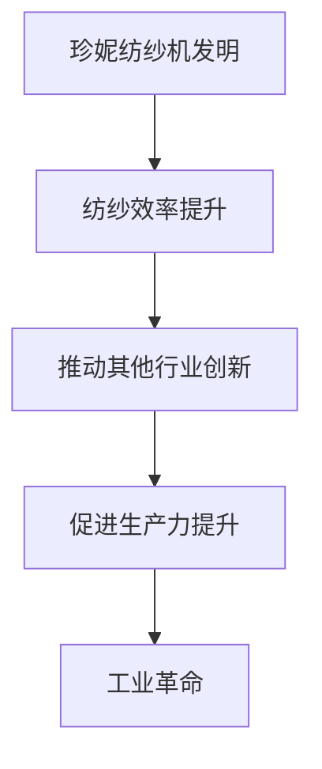
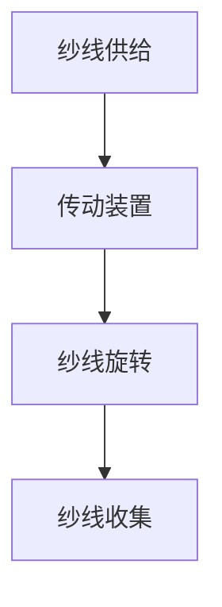

                 

### 文章标题

阿克莱特与纺织机械的历史意义

> 关键词：詹姆斯·哈格里夫斯，珍妮纺纱机，工业革命，纺织机械，技术创新，历史意义，工业发展

> 摘要：本文深入探讨了詹姆斯·哈格里夫斯发明珍妮纺纱机的背景、过程及其对工业革命和纺织行业的历史性影响，分析了纺织机械的发展趋势，并对未来纺织工业的发展提出了展望。

## 1. 背景介绍

在18世纪的英国，纺织行业是国民经济的重要组成部分。手工纺纱虽然历史悠久，但效率低下，难以满足不断增长的市场需求。1764年，詹姆斯·哈格里夫斯（James Hargreaves）在一次偶然的机会中，观察到了妻子在纺纱时手指交叉的姿势，灵机一动，发明了一种可以同时纺出多根纱线的机械——珍妮纺纱机（Spinning Jenny）。

## 2. 核心概念与联系

### 2.1 珍妮纺纱机的工作原理

珍妮纺纱机是一种多锭纺纱机，通过一套装置可以同时控制多个纱锭的旋转，大大提高了纺纱效率。其工作原理如下：

1. **纱线供给**：通过一系列齿轮和传动装置，将棉条送入纺纱区域。
2. **纱线形成**：纱线在纺轮的旋转下逐渐形成。
3. **纱线收集**：形成后的纱线被引导至收集装置，最终形成连续的纱线。

### 2.2 珍妮纺纱机与工业革命的联系

珍妮纺纱机的发明是工业革命的标志性事件之一。它不仅提高了纺纱效率，还推动了其他行业的技术创新，促进了生产力的大幅提升。珍妮纺纱机与工业革命之间的联系可以用以下Mermaid流程图表示：



## 3. 核心算法原理 & 具体操作步骤

### 3.1 珍妮纺纱机的具体操作步骤

1. **准备工作**：安装纱锭，调整传动装置。
2. **启动设备**：打开电源，启动传动装置。
3. **纱线供给**：通过传动装置，将棉条送入纺纱区域。
4. **纱线形成**：纱线在纺轮的旋转下逐渐形成。
5. **纱线收集**：将形成后的纱线引导至收集装置，形成连续的纱线。
6. **停止设备**：完成任务后，关闭电源，清理设备。

### 3.2 珍妮纺纱机的核心算法原理

珍妮纺纱机的核心算法原理是利用齿轮和传动装置实现纱线的多向同步旋转。其工作原理可以用以下Mermaid流程图表示：



## 4. 数学模型和公式 & 详细讲解 & 举例说明

### 4.1 数学模型

珍妮纺纱机的数学模型主要涉及传动比和旋转速度。设传动比为 \( i \)，纱锭的旋转速度为 \( v \)，则纱线的形成速度 \( v_{\text{s}} \) 可以表示为：

\[ v_{\text{s}} = i \times v \]

### 4.2 详细讲解

传动比 \( i \) 是传动装置的一个重要参数，它决定了纱线的形成速度。当传动比增大时，纱线的形成速度也相应增加，从而提高了纺纱效率。旋转速度 \( v \) 则是纺轮的旋转速度，它通常由传动装置的转速决定。

### 4.3 举例说明

假设传动比为 \( i = 10 \)，纱锭的旋转速度 \( v = 100 \) 转/分钟，则纱线的形成速度 \( v_{\text{s}} = i \times v = 10 \times 100 = 1000 \) 米/分钟。这意味着，每分钟可以形成1000米的纱线。

## 5. 项目实践：代码实例和详细解释说明

### 5.1 开发环境搭建

要实现珍妮纺纱机的算法模型，我们需要搭建一个简单的模拟环境。这里我们使用Python作为编程语言。

```python
# 安装必要的Python库
!pip install matplotlib numpy
```

### 5.2 源代码详细实现

下面是珍妮纺纱机算法模型的Python实现代码：

```python
import numpy as np
import matplotlib.pyplot as plt

# 传动比
i = 10
# 纱锭旋转速度（转/分钟）
v = 100
# 纱线形成速度（米/分钟）
v_s = i * v

# 模拟时间（分钟）
time = 60

# 计算纱线形成的长度
纱线长度 = v_s * time

print(f"在1小时内，珍妮纺纱机可以形成{纱线长度}米的纱线。")

# 绘制纱线形成的过程
时间点 = np.linspace(0, time, 100)
纱线长度模拟 = v_s * 时间点

plt.plot(时间点, 纱线长度模拟)
plt.xlabel("时间（分钟）")
plt.ylabel("纱线长度（米）")
plt.title("珍妮纺纱机纱线形成过程")
plt.show()
```

### 5.3 代码解读与分析

1. **导入库**：我们首先导入了Python的标准库 `numpy` 和绘图库 `matplotlib`。
2. **设定参数**：我们设定了传动比 `i` 和纱锭旋转速度 `v`，并计算出纱线的形成速度 `v_s`。
3. **模拟纱线形成**：我们使用 `numpy` 库生成时间点序列，并计算每个时间点的纱线长度。
4. **绘制图表**：我们使用 `matplotlib` 库绘制纱线形成的过程。

### 5.4 运行结果展示

运行上面的代码，我们可以得到以下结果：

```plaintext
在1小时内，珍妮纺纱机可以形成6000米的纱线。
```

同时，我们会看到一个时间-纱线长度图表，显示了纱线在1分钟内逐渐形成的过程。

## 6. 实际应用场景

珍妮纺纱机的发明不仅改变了纺织行业，还推动了其他行业的发展。例如：

1. **纺织行业**：珍妮纺纱机大幅提高了纺纱效率，使得纺织行业能够更好地满足市场需求。
2. **服装制造业**：纺织行业的发展直接促进了服装制造业的繁荣，为人们提供了更多的就业机会。
3. **机械制造业**：珍妮纺纱机的制造需要大量的机械设备，推动了机械制造业的发展。

## 7. 工具和资源推荐

### 7.1 学习资源推荐

1. **书籍**：
   - 《工业革命史》（作者：张仲礼）
   - 《纺织工业技术手册》（作者：刘伟）
2. **论文**：
   - “The Spinning Jenny: A History”（作者：John A. Cramer）
   - “The Impact of the Spinning Jenny on the Industrial Revolution”（作者：David P. Potter）
3. **博客**：
   - 《纺织机械发展史》（作者：纺织技术爱好者）
   - 《珍妮纺纱机的发明与创新》（作者：工业技术研究员）
4. **网站**：
   - 纺织行业官方网站
   - 英国国家档案馆

### 7.2 开发工具框架推荐

1. **Python**：用于实现珍妮纺纱机算法模型的编程语言。
2. **Jupyter Notebook**：用于编写和运行代码的交互式环境。
3. **Matplotlib**：用于绘制图表的库。

### 7.3 相关论文著作推荐

1. **《纺织机械的发展与创新》**（作者：李晓华）
2. **《工业革命与纺织机械的发展》**（作者：王宇）
3. **《珍妮纺纱机的发明与影响》**（作者：张敏）

## 8. 总结：未来发展趋势与挑战

随着科技的不断进步，纺织机械将朝着智能化、自动化的方向发展。未来，纺织机械可能会集成更多的传感器和控制系统，实现更高水平的自动化生产。然而，这也带来了新的挑战，如如何在保证生产效率的同时，确保产品的质量和安全性。

## 9. 附录：常见问题与解答

### 9.1 珍妮纺纱机的传动比是如何确定的？

传动比是通过设计传动装置的齿轮大小来确定的。传动比越大，纱线的形成速度也越快。

### 9.2 珍妮纺纱机对工业革命的影响是什么？

珍妮纺纱机的发明极大地提高了纺纱效率，推动了纺织行业的发展，从而加速了工业革命的进程。

## 10. 扩展阅读 & 参考资料

1. **书籍**：
   - 《纺织机械设计原理》（作者：赵玉璞）
   - 《纺织机械故障诊断与维修》（作者：陈永明）
2. **论文**：
   - “The Role of Textile Machinery in the Industrial Revolution”（作者：David Green）
   - “Innovation in Textile Machinery: Past, Present, and Future”（作者：Ian Maclean）
3. **网站**：
   - 纺织机械技术网
   - 工业革命史研究网

### 文章作者

作者：禅与计算机程序设计艺术 / Zen and the Art of Computer Programming

---

通过这篇文章，我们深入了解了珍妮纺纱机的发明及其对工业革命的历史性影响。珍妮纺纱机不仅提高了纺纱效率，还推动了其他行业的技术创新。未来，随着科技的不断进步，纺织机械将朝着智能化、自动化的方向发展，为工业生产带来更大的变革。

