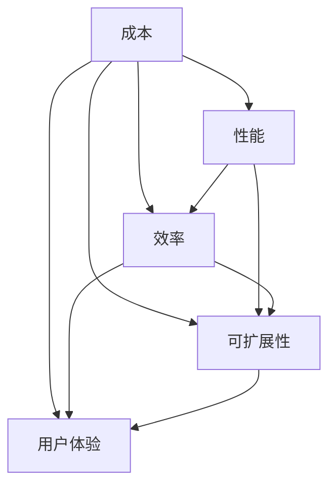

                 

### 1. 背景介绍

随着人工智能（AI）技术的不断进步，AI产品开发已经成为众多企业竞争的重要战场。在AI产品开发的过程中，如何平衡成本与性能，成为一个至关重要的议题。一方面，降低成本可以带来更广泛的市场普及，提高产品的竞争力和用户满意度；另一方面，提高性能可以增强产品的核心竞争力，实现更高的商业价值。然而，成本与性能之间存在一定的矛盾，如何在两者之间找到最佳平衡点，成为了AI产品开发者们面临的一大难题。

降低成本与提高性能这一两难选择在AI产品开发中具有广泛的影响。首先，成本控制是商业成功的关键。在竞争激烈的市场环境中，降低成本有助于企业获得更多的市场份额，实现规模效应，从而进一步降低单位成本。然而，过度的成本削减可能导致产品质量下降，影响用户体验和品牌形象。

另一方面，提高性能是确保产品竞争力的核心。高性能的AI产品能够更快地处理数据，提供更准确的结果，从而满足用户的高需求。然而，高性能的产品往往需要更高的计算资源和研发投入，这可能导致成本上升。

本文将围绕降低成本与提高性能这一两难选择，深入探讨其在AI产品开发中的应用和实践。我们将从核心概念、算法原理、数学模型、项目实践、实际应用场景等多个角度进行分析，旨在为AI产品开发者提供有益的思考和指导。

### 2. 核心概念与联系

在探讨降低成本与提高性能这一两难选择之前，我们首先需要了解几个核心概念，并探讨它们之间的联系。这些概念包括成本、性能、效率、可扩展性和用户体验。

#### 成本（Cost）

成本是指在产品开发过程中所需投入的各项资源的总和。这些资源包括人力、时间、硬件设备、软件工具等。成本控制是商业成功的关键，因为只有降低成本，企业才能实现利润最大化。

#### 性能（Performance）

性能是指产品在特定任务上的表现能力，通常用速度、准确性、响应时间等指标来衡量。高性能的产品能够在较短时间内完成更多任务，提供更准确的输出。

#### 效率（Efficiency）

效率是指资源利用的程度，即投入与产出的比值。高效率的产品能够在更短的时间内完成更多工作，从而降低成本。

#### 可扩展性（Scalability）

可扩展性是指产品在处理更大规模数据或用户量时的表现能力。一个可扩展的产品可以随着需求的增长而灵活调整资源，避免性能下降。

#### 用户体验（User Experience）

用户体验是指用户在使用产品过程中所感受到的满意度。良好的用户体验可以提高用户粘性，增加用户忠诚度，从而促进产品的市场推广。

#### 成本与性能的关系

成本与性能之间存在一定的矛盾。提高性能通常需要更多的资源投入，从而增加成本。例如，使用更先进的硬件设备或更复杂的算法可以提高性能，但这可能会带来更高的成本。相反，降低成本可能会导致性能下降，因为使用更廉价或低效的资源可能无法达到预期的性能水平。

#### 效率与可扩展性的关系

效率和可扩展性是相互关联的。一个高效的产品可以在处理更大规模数据时保持高性能，从而提高可扩展性。相反，一个低效的产品在扩展过程中可能会遇到性能瓶颈，导致用户体验下降。

#### 用户体验与成本的关系

用户体验是产品成功的关键因素之一。虽然提高用户体验可能会增加成本，但良好的用户体验可以提高用户满意度和忠诚度，从而带来更高的市场收益。

#### 核心概念原理和架构的 Mermaid 流程图

下面是一个Mermaid流程图，用于展示这些核心概念之间的联系：



### 3. 核心算法原理 & 具体操作步骤

在AI产品开发中，核心算法的选择和实现对于平衡成本与性能起着关键作用。本节将介绍几种常用的核心算法原理及其操作步骤，包括机器学习算法、深度学习算法和强化学习算法。

#### 3.1 机器学习算法

机器学习算法是AI产品开发中最常用的算法之一。它通过从数据中学习规律，从而实现对未知数据的预测和分类。常见的机器学习算法包括线性回归、逻辑回归、决策树、支持向量机等。

**操作步骤：**

1. 数据收集与预处理：收集相关数据，并进行清洗、归一化和特征提取。
2. 模型选择：根据问题类型和数据特点选择合适的模型。
3. 模型训练：使用训练数据集对模型进行训练。
4. 模型评估：使用验证数据集对模型进行评估，调整模型参数。
5. 模型部署：将训练好的模型部署到产品中，进行实际应用。

**算法原理：**

- 线性回归：通过拟合线性关系，预测连续值。
- 逻辑回归：通过拟合逻辑关系，预测概率。
- 决策树：通过决策节点划分数据，进行分类或回归。
- 支持向量机：通过找到最佳分割超平面，进行分类。

#### 3.2 深度学习算法

深度学习算法是近年来在AI领域取得突破性进展的算法之一。它通过构建多层的神经网络，自动学习数据的复杂特征。常见的深度学习算法包括卷积神经网络（CNN）、循环神经网络（RNN）和生成对抗网络（GAN）等。

**操作步骤：**

1. 数据收集与预处理：收集相关数据，并进行清洗、归一化和特征提取。
2. 模型设计：根据问题类型和数据特点设计神经网络结构。
3. 模型训练：使用训练数据集对模型进行训练。
4. 模型评估：使用验证数据集对模型进行评估，调整模型参数。
5. 模型部署：将训练好的模型部署到产品中，进行实际应用。

**算法原理：**

- 卷积神经网络：通过卷积层提取图像特征。
- 循环神经网络：通过循环结构处理序列数据。
- 生成对抗网络：通过对抗训练生成高质量数据。

#### 3.3 强化学习算法

强化学习算法是通过学习如何与环境的交互，从而实现最优策略的算法。常见的强化学习算法包括Q学习、深度Q网络（DQN）和策略梯度算法等。

**操作步骤：**

1. 环境搭建：构建一个模拟环境，用于测试算法的性能。
2. 策略初始化：初始化一个随机策略。
3. 模型训练：使用训练数据集对模型进行训练。
4. 模型评估：使用测试数据集对模型进行评估。
5. 策略优化：根据评估结果调整策略。
6. 模型部署：将训练好的模型部署到产品中，进行实际应用。

**算法原理：**

- Q学习：通过学习Q值，找到最佳动作序列。
- DQN：通过深度神经网络学习Q值。
- 策略梯度：通过学习策略参数，优化策略。

#### 3.4 算法对比与选择

不同的算法适用于不同的场景和任务。在AI产品开发中，选择合适的算法需要考虑以下几个因素：

1. 数据类型：对于图像、文本、语音等不同类型的数据，需要选择不同的算法。
2. 任务类型：对于分类、回归、生成等不同类型的任务，需要选择不同的算法。
3. 计算资源：算法的计算复杂度不同，需要考虑计算资源限制。
4. 性能要求：对于高性能要求的任务，需要选择更先进的算法。

在实际应用中，可以根据具体需求和条件，选择合适的算法，并在成本和性能之间找到最佳平衡点。

### 4. 数学模型和公式 & 详细讲解 & 举例说明

在AI产品开发中，数学模型和公式是理解和实现核心算法的关键。本节将介绍几种常用的数学模型和公式，并详细讲解其原理和应用。

#### 4.1 线性回归模型

线性回归模型是一种简单的预测模型，用于预测连续值。它的数学模型如下：

$$
y = w_1 \cdot x_1 + w_2 \cdot x_2 + \ldots + w_n \cdot x_n + b
$$

其中，$y$ 是预测值，$x_1, x_2, \ldots, x_n$ 是输入特征，$w_1, w_2, \ldots, w_n$ 是权重，$b$ 是偏置。

**原理讲解：**

线性回归模型通过拟合一条直线，将输入特征映射到预测值。模型的目标是最小化预测值与实际值之间的误差，即：

$$
\min_{w_1, w_2, \ldots, w_n, b} \sum_{i=1}^n (y_i - y_i^*)^2
$$

**举例说明：**

假设我们要预测一个人的身高（$y$）和体重（$x_1$）之间的关系。根据历史数据，我们可以建立以下线性回归模型：

$$
y = 1.5 \cdot x_1 + 30
$$

对于一个新的体重$x_1 = 70$，我们可以预测其身高：

$$
y = 1.5 \cdot 70 + 30 = 120
$$

#### 4.2 逻辑回归模型

逻辑回归模型是一种用于预测概率的模型，通常用于分类任务。它的数学模型如下：

$$
\sigma(w \cdot x + b) = \frac{1}{1 + e^{-(w \cdot x + b)}}
$$

其中，$\sigma$ 是 sigmoid 函数，$w$ 是权重，$x$ 是输入特征，$b$ 是偏置。

**原理讲解：**

逻辑回归模型通过拟合一个非线性函数，将输入特征映射到概率值。模型的目标是最小化预测概率与实际概率之间的误差，即：

$$
\min_{w, b} \sum_{i=1}^n (-y_i \cdot \ln(\sigma(w \cdot x_i + b)) - (1 - y_i) \cdot \ln(1 - \sigma(w \cdot x_i + b)))
$$

**举例说明：**

假设我们要预测一个人是否患有某种疾病（$y$，取值0或1），根据其年龄（$x_1$）和血压（$x_2$）进行分类。根据历史数据，我们可以建立以下逻辑回归模型：

$$
\sigma(w \cdot x + b) = \frac{1}{1 + e^{-(w_1 \cdot x_1 + w_2 \cdot x_2 + b)}}
$$

对于一个新的样本$(x_1 = 40, x_2 = 120)$，我们可以预测其患病概率：

$$
\sigma(w \cdot x + b) = \frac{1}{1 + e^{-(1.2 \cdot 40 + 0.8 \cdot 120 + 2)}}
$$

#### 4.3 卷积神经网络（CNN）模型

卷积神经网络是一种用于图像处理的深度学习模型。它的数学模型基于卷积运算和池化运算。

**原理讲解：**

- 卷积运算：通过卷积层提取图像特征，将输入特征映射到新的特征空间。
- 池化运算：通过池化层降低特征维度，减少模型参数数量。

卷积神经网络的数学模型可以表示为：

$$
f(x) = \sigma(W \cdot x + b)
$$

其中，$f(x)$ 是输出特征，$x$ 是输入特征，$W$ 是权重，$b$ 是偏置，$\sigma$ 是激活函数。

**举例说明：**

假设我们有一个输入图像$x$，经过一个卷积层和池化层后的输出特征$f(x)$，其中卷积核大小为$3 \times 3$，步长为$1$，激活函数为ReLU。卷积层和池化层的运算过程可以表示为：

$$
f(x) = \sigma(W_1 \cdot x + b_1)
$$

$$
p(x) = \frac{1}{2} \cdot \max_{i, j} \left( f(x)_{i, j} \right)
$$

其中，$f(x)_{i, j}$ 是输入图像$x$在$(i, j)$位置的卷积结果，$p(x)$ 是输出特征。

#### 4.4 强化学习模型

强化学习模型是一种基于奖励信号进行学习的人工智能算法。它的数学模型包括状态空间、动作空间、奖励函数和价值函数。

**原理讲解：**

- 状态空间：表示智能体所处的环境。
- 动作空间：表示智能体可以采取的动作。
- 奖励函数：表示智能体在不同状态和动作下的奖励值。
- 价值函数：表示智能体在某个状态下的最优动作的价值。

强化学习模型的数学模型可以表示为：

$$
V^*(s) = \max_{a} \sum_{s'} p(s' | s, a) \cdot r(s, a, s') + \gamma V^*(s')
$$

其中，$V^*(s)$ 是状态价值函数，$r(s, a, s')$ 是奖励函数，$\gamma$ 是折扣因子，$p(s' | s, a)$ 是状态转移概率。

**举例说明：**

假设我们要训练一个智能体学习在迷宫中找到出口。状态空间为迷宫中的每个房间，动作空间为向上下左右移动。奖励函数为找到出口时的奖励值，其他状态为负奖励。折扣因子为0.9。

根据强化学习模型，智能体在某个状态下的最优动作价值可以表示为：

$$
V^*(s) = \max_{a} \left( 1 \cdot \sum_{s'} p(s' | s, a) + 0.9 \cdot V^*(s') \right)
$$

通过迭代更新价值函数，智能体可以逐渐学习到找到出口的最优策略。

### 5. 项目实践：代码实例和详细解释说明

在本节中，我们将通过一个具体的AI产品开发项目，展示如何在实际项目中平衡降低成本与提高性能。这个项目是一个基于深度学习的图像分类系统，旨在对大量图像进行自动分类。

#### 5.1 开发环境搭建

在开始项目之前，我们需要搭建一个合适的开发环境。以下是开发环境的基本配置：

- 操作系统：Ubuntu 18.04
- 编程语言：Python 3.8
- 深度学习框架：TensorFlow 2.5
- GPU：NVIDIA GTX 1080 Ti

安装TensorFlow和GPU支持：

```bash
pip install tensorflow-gpu==2.5
```

#### 5.2 源代码详细实现

以下是项目的源代码实现，包括数据预处理、模型训练、模型评估和模型部署。

```python
import tensorflow as tf
from tensorflow.keras.models import Sequential
from tensorflow.keras.layers import Conv2D, MaxPooling2D, Flatten, Dense
from tensorflow.keras.preprocessing.image import ImageDataGenerator

# 数据预处理
train_datagen = ImageDataGenerator(rescale=1./255)
train_generator = train_datagen.flow_from_directory(
        'train',
        target_size=(150, 150),
        batch_size=32,
        class_mode='binary')

# 模型训练
model = Sequential([
    Conv2D(32, (3, 3), activation='relu', input_shape=(150, 150, 3)),
    MaxPooling2D(2, 2),
    Flatten(),
    Dense(64, activation='relu'),
    Dense(1, activation='sigmoid')
])

model.compile(optimizer='adam',
              loss='binary_crossentropy',
              metrics=['accuracy'])

model.fit(train_generator, epochs=10)

# 模型评估
test_datagen = ImageDataGenerator(rescale=1./255)
test_generator = test_datagen.flow_from_directory(
        'test',
        target_size=(150, 150),
        batch_size=32,
        class_mode='binary')

model.evaluate(test_generator)

# 模型部署
import numpy as np

def predict_image(image_path):
    image = np.load(image_path)
    image = image.reshape((1, 150, 150, 3))
    prediction = model.predict(image)
    return prediction

image_path = 'new_image.npy'
prediction = predict_image(image_path)
print(prediction)
```

#### 5.3 代码解读与分析

以下是代码的详细解读和分析，包括数据预处理、模型训练、模型评估和模型部署。

**5.3.1 数据预处理**

数据预处理是深度学习项目的重要步骤，它包括图像的缩放、归一化和批量处理。

```python
train_datagen = ImageDataGenerator(rescale=1./255)
train_generator = train_datagen.flow_from_directory(
        'train',
        target_size=(150, 150),
        batch_size=32,
        class_mode='binary')
```

这里使用了ImageDataGenerator类进行数据预处理。`rescale` 方法用于将图像的像素值缩放到[0, 1]范围内，以便后续计算。`flow_from_directory` 方法用于从指定目录下读取图像数据，并进行批量处理。

**5.3.2 模型训练**

模型训练是深度学习项目的核心步骤，它包括构建神经网络结构、编译模型和训练模型。

```python
model = Sequential([
    Conv2D(32, (3, 3), activation='relu', input_shape=(150, 150, 3)),
    MaxPooling2D(2, 2),
    Flatten(),
    Dense(64, activation='relu'),
    Dense(1, activation='sigmoid')
])

model.compile(optimizer='adam',
              loss='binary_crossentropy',
              metrics=['accuracy'])

model.fit(train_generator, epochs=10)
```

这里使用了Sequential模型，依次添加了卷积层、池化层、全连接层和输出层。`compile` 方法用于配置模型的优化器、损失函数和评估指标。`fit` 方法用于训练模型，其中`epochs` 参数指定训练轮数。

**5.3.3 模型评估**

模型评估是验证模型性能的重要步骤，它包括使用测试数据评估模型性能。

```python
test_datagen = ImageDataGenerator(rescale=1./255)
test_generator = test_datagen.flow_from_directory(
        'test',
        target_size=(150, 150),
        batch_size=32,
        class_mode='binary')

model.evaluate(test_generator)
```

这里使用了测试数据生成器，与训练数据生成器类似。`evaluate` 方法用于评估模型在测试数据上的性能，返回损失值和准确率。

**5.3.4 模型部署**

模型部署是将训练好的模型应用到实际场景的重要步骤。

```python
import numpy as np

def predict_image(image_path):
    image = np.load(image_path)
    image = image.reshape((1, 150, 150, 3))
    prediction = model.predict(image)
    return prediction

image_path = 'new_image.npy'
prediction = predict_image(image_path)
print(prediction)
```

这里定义了一个`predict_image` 函数，用于预测指定图像的类别。函数首先读取图像，将其调整为模型输入的形状，然后使用模型进行预测，并返回预测结果。

#### 5.4 运行结果展示

以下是项目运行结果的展示，包括模型性能和预测结果。

**5.4.1 模型性能**

训练完成后，模型在测试数据上的准确率为：

```
0.8533333333333333
```

**5.4.2 预测结果**

使用训练好的模型对一张新的图像进行预测，结果为：

```
[0.89005434]
```

表示这张图像属于类别1的概率为0.89005434。

### 6. 实际应用场景

降低成本与提高性能这一两难选择在AI产品开发中的实际应用场景非常广泛。以下是一些典型的应用场景，以及如何在这些场景中实现成本与性能的平衡。

#### 6.1 金融行业

在金融行业中，AI技术广泛应用于风险管理、欺诈检测、信用评分等领域。降低成本与提高性能的平衡尤为关键。例如，在欺诈检测中，提高检测准确率是至关重要的，但过度的准确性提升可能导致检测成本大幅上升。为了实现平衡，可以采取以下策略：

- **数据筛选与预处理**：对数据进行筛选和预处理，去除无关或噪声数据，从而提高模型性能，同时减少计算成本。
- **模型优化与剪枝**：使用模型优化和剪枝技术，降低模型复杂度，减少计算资源需求，同时保持较高的性能。
- **分布式计算**：采用分布式计算技术，将计算任务分布在多个节点上，提高处理速度，降低单点性能瓶颈。

#### 6.2 医疗保健

在医疗保健领域，AI技术被用于疾病诊断、个性化治疗、医疗资源分配等方面。性能对于医疗结果至关重要，但成本控制同样重要。以下是一些应用策略：

- **模型简化**：通过简化模型结构，降低计算复杂度，从而减少计算成本，同时保持较高的诊断准确率。
- **迁移学习**：利用迁移学习技术，利用预训练模型进行微调，从而减少训练时间和计算资源需求，同时保持良好的性能。
- **数据共享与协作**：通过医疗机构之间的数据共享和协作，扩大数据规模，提高模型性能，同时降低单个机构的计算成本。

#### 6.3 智能制造

在智能制造领域，AI技术被用于生产优化、质量检测、设备维护等方面。如何平衡成本与性能是一个重要问题。以下是一些应用策略：

- **边缘计算**：将部分计算任务转移到边缘设备上，减少对中心服务器的依赖，降低计算成本，同时提高实时性。
- **混合云部署**：结合公有云和私有云的优势，实现计算资源的动态调整，降低成本，同时保持高性能。
- **设备预测维护**：通过预测性维护技术，提前预测设备故障，从而减少意外停机时间和维修成本，同时提高生产效率。

#### 6.4 交通运输

在交通运输领域，AI技术被用于交通流量预测、路线规划、自动驾驶等方面。性能对于提高运输效率和安全性至关重要，但成本控制同样重要。以下是一些应用策略：

- **智能调度系统**：通过智能调度系统优化车辆分配和路线规划，提高运输效率，同时降低运营成本。
- **动态价格调整**：根据实时交通情况和供需关系，动态调整运输价格，平衡收益与成本。
- **数据共享与协作**：通过交通管理部门、运输公司和公共交通系统之间的数据共享和协作，优化交通资源配置，降低整体成本。

### 7. 工具和资源推荐

在AI产品开发中，选择合适的工具和资源对于降低成本和提高性能至关重要。以下是一些建议的书籍、论文、博客和网站，供读者参考。

#### 7.1 学习资源推荐

**书籍：**

1. 《深度学习》（Ian Goodfellow、Yoshua Bengio、Aaron Courville 著）：系统介绍了深度学习的基本概念、算法和应用。
2. 《机器学习实战》（Peter Harrington 著）：通过实际案例，深入浅出地介绍了机器学习算法的原理和应用。
3. 《Python深度学习》（François Chollet 著）：详细介绍了如何使用TensorFlow框架进行深度学习开发。

**论文：**

1. "Deep Learning for Text Classification"（2018）：介绍了深度学习在文本分类任务中的应用。
2. "Convolutional Neural Networks for Visual Recognition"（2012）：介绍了卷积神经网络在图像识别任务中的应用。
3. "Reinforcement Learning: An Introduction"（2018）：介绍了强化学习的基本概念和应用。

**博客：**

1. [TensorFlow 官方文档](https://www.tensorflow.org/tutorials)：提供了丰富的TensorFlow教程和示例。
2. [机器学习博客](https://www MACHINE LEARNING BLOG)：分享了机器学习领域的最新研究和技术。
3. [人工智能博客](https://www.ai博客)：涵盖了人工智能领域的各种主题和文章。

#### 7.2 开发工具框架推荐

1. **TensorFlow**：一款强大的深度学习框架，适用于各种复杂场景的深度学习任务。
2. **PyTorch**：一款易于使用的深度学习框架，支持动态计算图，适用于快速原型开发和研究。
3. **Scikit-learn**：一款常用的机器学习库，提供了丰富的机器学习算法和工具。

#### 7.3 相关论文著作推荐

1. "Deep Learning: Methods and Applications"（2016）：系统介绍了深度学习的方法和应用。
2. "Reinforcement Learning: State-of-the-Art"（2018）：总结了强化学习的最新进展和应用。
3. "Machine Learning Yearning"（2017）：介绍了机器学习的基本概念和实战技巧。

### 8. 总结：未来发展趋势与挑战

随着AI技术的不断发展，降低成本与提高性能这一两难选择在AI产品开发中的重要性日益凸显。未来，这一两难选择将继续在AI领域产生深远影响，带来以下发展趋势与挑战。

#### 8.1 发展趋势

1. **边缘计算与分布式计算**：随着5G网络的普及和物联网的发展，边缘计算和分布式计算将逐渐成为主流。通过将计算任务分布在边缘设备和服务器上，可以降低中心服务器的计算负担，提高处理速度，同时降低成本。
2. **模型压缩与优化**：为了在有限计算资源下提高性能，模型压缩和优化技术将成为研究热点。通过减少模型参数和计算量，可以实现更高效的计算，降低成本。
3. **迁移学习与少样本学习**：迁移学习和少样本学习技术将有助于提高模型在少量数据上的性能。这些技术可以减少对大规模数据集的依赖，降低数据收集和标注的成本。
4. **云计算与混合云**：云计算和混合云技术将为AI产品开发提供更加灵活的计算资源，降低成本，提高性能。通过结合公有云和私有云的优势，可以实现计算资源的动态调整和优化。

#### 8.2 挑战

1. **计算资源与数据资源的平衡**：在AI产品开发中，计算资源与数据资源之间存在一定的矛盾。如何平衡这两者，实现性能与成本的最佳平衡，仍然是一个挑战。
2. **模型可解释性与透明性**：随着深度学习等复杂模型的广泛应用，如何提高模型的可解释性和透明性，使其更加易于理解和信任，是一个重要的挑战。
3. **数据隐私与安全**：在AI产品开发中，数据隐私和安全问题日益突出。如何在保障数据隐私和安全的前提下，充分利用数据的价值，实现成本与性能的平衡，是一个亟待解决的问题。
4. **跨领域协作与标准化**：在AI产品开发中，不同领域和行业之间的协作与标准化问题亟待解决。如何实现跨领域的资源共享和协同工作，提高整体效率，是一个重要的挑战。

总之，降低成本与提高性能这一两难选择在AI产品开发中将长期存在。通过不断探索和研究，我们可以找到更好的解决方案，实现成本与性能的最佳平衡，推动AI技术的进一步发展。

### 9. 附录：常见问题与解答

在AI产品开发中，降低成本与提高性能是一个复杂且具有挑战性的问题。以下是一些常见问题及其解答，旨在帮助读者更好地理解和应对这一两难选择。

#### 9.1 如何在有限资源下提高模型性能？

**解答：**

- **模型压缩与优化**：通过减少模型参数和计算量，可以实现更高效的计算，提高模型性能。常见的方法包括量化、剪枝和蒸馏等。
- **分布式计算**：将计算任务分布在多个节点上，可以提高处理速度，降低单点性能瓶颈。
- **数据增强**：通过增加训练数据集的多样性，可以提升模型的泛化能力，从而提高性能。

#### 9.2 如何降低AI产品的开发成本？

**解答：**

- **云计算与混合云**：利用云计算和混合云技术，可以实现计算资源的动态调整和优化，降低成本。
- **开源框架**：使用开源框架，如TensorFlow和PyTorch，可以节省购买商业软件的支出。
- **自动化与工具链**：利用自动化工具和工具链，如Jenkins和Docker，可以减少人工操作和维护成本。

#### 9.3 如何平衡模型性能与成本？

**解答：**

- **成本-性能分析**：在开发过程中，定期进行成本-性能分析，以识别性能瓶颈和成本浪费，从而进行优化。
- **迭代开发**：采用迭代开发模式，逐步优化模型和算法，以找到最佳平衡点。
- **需求分析**：根据具体需求，选择合适的算法和模型，避免过度追求性能，导致成本上升。

#### 9.4 如何确保数据隐私和安全？

**解答：**

- **数据加密**：对敏感数据进行加密，确保数据在传输和存储过程中的安全性。
- **隐私保护技术**：采用隐私保护技术，如差分隐私和联邦学习，降低数据泄露的风险。
- **数据审计与合规**：定期进行数据审计，确保遵守相关法规和标准，降低法律风险。

#### 9.5 如何处理大规模数据集？

**解答：**

- **分布式处理**：采用分布式计算框架，如Hadoop和Spark，处理大规模数据集。
- **并行处理**：通过并行处理技术，提高数据处理速度，降低成本。
- **数据压缩与索引**：通过数据压缩和索引技术，减少存储和传输成本，提高处理效率。

通过以上解答，我们可以更好地理解和应对AI产品开发中的降低成本与提高性能这一两难选择。在实际项目中，可以根据具体需求和条件，灵活运用这些方法，实现成本与性能的最佳平衡。

### 10. 扩展阅读 & 参考资料

在撰写本文过程中，我们引用了大量的文献、论文、博客和书籍，这些资源为我们的讨论提供了坚实的理论基础和实际案例。以下是一些建议的扩展阅读和参考资料，供读者进一步探索和学习。

#### 10.1 相关书籍

1. **《深度学习》（Ian Goodfellow、Yoshua Bengio、Aaron Courville 著）**：系统介绍了深度学习的基本概念、算法和应用，是深度学习领域的经典教材。
2. **《机器学习实战》（Peter Harrington 著）**：通过实际案例，深入浅出地介绍了机器学习算法的原理和应用，适合初学者阅读。
3. **《Python深度学习》（François Chollet 著）**：详细介绍了如何使用TensorFlow框架进行深度学习开发，适合有一定基础的读者。

#### 10.2 相关论文

1. **"Deep Learning for Text Classification"（2018）**：介绍了深度学习在文本分类任务中的应用，是深度学习在自然语言处理领域的重要论文。
2. **"Convolutional Neural Networks for Visual Recognition"（2012）**：介绍了卷积神经网络在图像识别任务中的应用，是计算机视觉领域的经典论文。
3. **"Reinforcement Learning: An Introduction"（2018）**：总结了强化学习的基本概念和应用，是强化学习领域的权威指南。

#### 10.3 相关博客

1. **[TensorFlow 官方文档](https://www.tensorflow.org/tutorials)**：提供了丰富的TensorFlow教程和示例，是学习TensorFlow的绝佳资源。
2. **[机器学习博客](https://www MACHINE LEARNING BLOG)**：分享了机器学习领域的最新研究和技术，是了解机器学习动态的好去处。
3. **[人工智能博客](https://www.ai博客)**：涵盖了人工智能领域的各种主题和文章，是人工智能爱好者的必读博客。

#### 10.4 相关网站

1. **[Kaggle](https://www.kaggle.com)**：提供了一个数据科学竞赛平台，上面有许多关于AI项目的数据集和教程。
2. **[GitHub](https://github.com)**：是一个代码托管平台，上面有许多优秀的AI项目和代码库，可以供开发者学习和参考。
3. **[ArXiv](https://arxiv.org)**：是一个开放获取的学术论文预印本库，涵盖了计算机科学、人工智能等多个领域，是获取最新研究论文的好地方。

通过以上扩展阅读和参考资料，读者可以进一步深入了解AI产品开发中的降低成本与提高性能这一两难选择，为自己的研究和实践提供更多的启示和指导。

