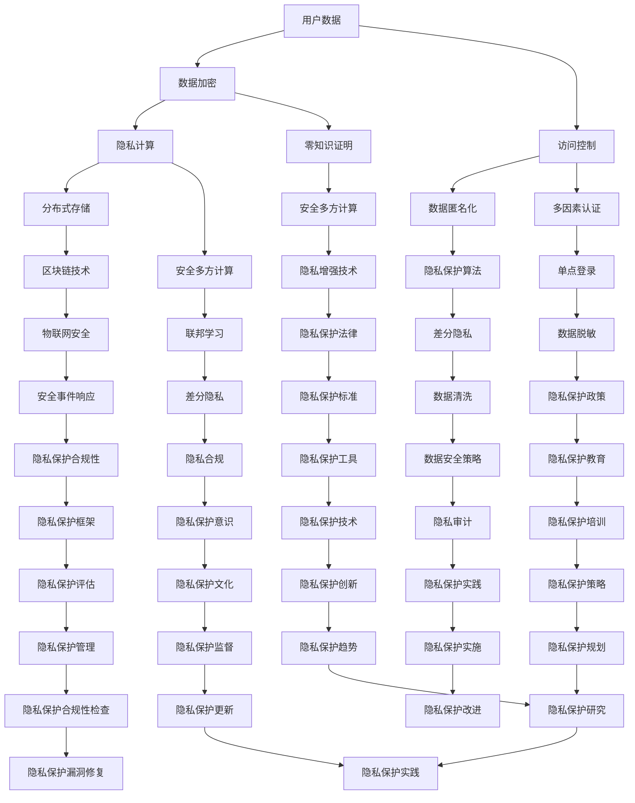

                 

### 背景介绍

隐私安全在当今数字化时代的重要性不言而喻。随着互联网、物联网、大数据、云计算等技术的迅猛发展，数据已经成为现代社会的重要资产。然而，数据的广泛传播和应用也带来了隐私泄露的风险，隐私安全问题日益凸显。据统计，全球范围内每年因隐私泄露导致的损失高达数十亿美元，不仅给企业和个人带来了巨大的经济损失，还对社会稳定和国家安全构成了严重威胁。

隐私安全的定义较为广泛，主要是指保护个人或组织数据不被未经授权的第三方获取、使用、泄露或篡改。在数字化时代，隐私安全不仅关乎个人隐私的保护，还涉及到企业商业秘密的保护、国家安全的保障。因此，隐私安全已经成为了信息技术领域中的一个核心问题，引起了全球范围内的广泛关注和深入研究。

隐私安全的重要性体现在多个方面。首先，随着大数据和人工智能技术的发展，数据的价值愈发凸显。然而，数据的价值往往伴随着隐私风险，一旦隐私数据被非法获取，将可能造成不可挽回的损失。其次，随着网络安全威胁的日益严峻，黑客攻击、数据泄露等事件频繁发生，隐私安全成为了维护社会稳定的重要保障。此外，隐私安全也是保障用户权益、提高用户信任度的重要手段，对于企业的可持续发展具有重要意义。

当前，隐私安全面临诸多挑战。一方面，技术发展的速度远快于隐私保护机制的完善，新型威胁不断出现，传统的安全防护手段难以应对。另一方面，隐私保护法律法规的制定和实施尚不完善，监管力度有待加强。此外，用户对隐私保护的意识相对较低，容易成为隐私泄露的受害者。面对这些挑战，我们需要从技术、法律、教育等多个层面进行综合应对，共同守护人类计算的数据安全。

### 核心概念与联系

隐私安全的实现涉及多个核心概念和技术的相互关联，这些概念和技术共同构建了一个复杂的安全体系。为了更好地理解隐私安全的核心概念及其相互关系，我们可以使用Mermaid流程图来展示这些概念和技术的联系。

下面是一个简化版的Mermaid流程图，描述了隐私安全中几个核心概念和它们之间的关系：



下面我们将详细解释这些核心概念和技术的含义及其相互关系：

#### 用户数据（A）

用户数据是隐私安全的核心关注点。用户数据包括个人信息、行为数据、位置数据等，是数字世界中描述个体的基本元素。保护用户数据的安全性和隐私性是隐私安全的首要任务。

#### 数据加密（B）

数据加密是一种保护用户数据不被未经授权的第三方获取的技术手段。通过加密算法，将明文数据转换为密文数据，只有在拥有正确密钥的情况下才能解密。数据加密在传输和存储阶段都非常重要。

#### 访问控制（C）

访问控制是一种确保只有授权用户可以访问特定数据或资源的机制。通过访问控制策略，可以限制用户对数据的访问权限，从而降低数据泄露的风险。

#### 隐私计算（D）

隐私计算是一种在数据不离开原始环境的情况下进行计算的方法。通过隐私计算，可以在保证数据隐私的前提下，对敏感数据进行处理和分析。

#### 数据匿名化（E）

数据匿名化是将用户数据中的个人信息去除或隐藏，以保护个人隐私。匿名化后的数据可以公开分享或用于数据分析，而不会泄露个人隐私。

#### 隐私保护算法（G）

隐私保护算法是一系列用于保护隐私的技术方法，包括差分隐私、安全多方计算、零知识证明等。这些算法在处理和保护敏感数据时发挥着重要作用。

#### 零知识证明（H）

零知识证明是一种密码学技术，允许一方（证明者）向另一方（验证者）证明某个陈述是真实的，而无需揭示任何有关该陈述的具体信息。

#### 多因素认证（I）

多因素认证是一种安全机制，要求用户在登录或执行敏感操作时提供两个或多个不同的验证因素，如密码、生物特征等。

#### 安全多方计算（J）

安全多方计算是一种允许多个参与方在不需要共享原始数据的情况下共同计算结果的技术。通过安全多方计算，可以在保护数据隐私的同时实现数据的合作分析。

#### 差分隐私（K）

差分隐私是一种隐私保护机制，通过在数据发布过程中引入噪声，确保单个记录无法被识别，从而保护数据隐私。

#### 区块链技术（L）

区块链技术是一种去中心化的分布式账本技术，通过加密算法确保数据不可篡改和匿名性。区块链在隐私保护领域有广泛应用，如隐私保护计算、数据交易等。

#### 物联网安全（Q）

物联网安全是确保物联网设备、系统和网络的安全，以防止未经授权的访问、攻击和数据泄露。随着物联网设备的普及，物联网安全成为了隐私安全的重要一环。

#### 安全多方计算（M）

安全多方计算是一种允许多个参与方在不需要共享原始数据的情况下共同计算结果的技术。通过安全多方计算，可以在保护数据隐私的同时实现数据的合作分析。

#### 单点登录（N）

单点登录是一种身份验证机制，允许用户通过一次登录访问多个系统或应用程序。单点登录简化了用户的登录过程，但也需要加强安全措施，以防止未经授权的访问。

#### 联邦学习（O）

联邦学习是一种分布式机器学习方法，允许多个参与方在本地维护各自的数据，并通过模型聚合来训练全局模型。联邦学习在保护数据隐私的同时，实现机器学习任务的协同工作。

#### 数据清洗（P）

数据清洗是一种处理数据的方法，通过识别和纠正数据中的不一致性、错误和缺失值，以提高数据质量和准确性。

#### 安全事件响应（V）

安全事件响应是一种在发生安全事件时采取措施以降低损失和恢复系统的机制。及时的安全事件响应可以减轻隐私泄露的风险。

#### 隐私保护法律（W）

隐私保护法律是确保个人隐私数据受到法律保护的一系列法律法规。隐私保护法律的制定和实施对于维护隐私安全至关重要。

#### 数据脱敏（S）

数据脱敏是一种通过去除、替换或加密敏感信息，以保护个人隐私的方法。数据脱敏常用于数据备份、测试和共享场景。

#### 隐私合规（Y）

隐私合规是指组织在处理和存储个人数据时遵守隐私保护法律和标准的过程。隐私合规是保障隐私安全的重要环节。

#### 隐私保护审计（Z）

隐私保护审计是一种评估组织隐私保护措施的有效性和合规性的过程。隐私保护审计有助于发现潜在的安全漏洞并采取改进措施。

#### 隐私保护框架（AF）

隐私保护框架是一套指导隐私保护策略和措施的体系结构，包括隐私保护政策、流程、标准和工具等。

#### 隐私保护工具（AG）

隐私保护工具是一系列用于实现隐私保护目标的软件或硬件工具，如加密软件、访问控制工具等。

#### 隐私保护培训（AH）

隐私保护培训是一种教育和培训活动，旨在提高员工对隐私保护的意识和技能，以降低隐私泄露的风险。

#### 隐私保护文化（AI）

隐私保护文化是一种组织内部对隐私保护价值观的认同和实践，包括隐私保护政策、教育和监督等。

#### 隐私保护实施（AJ）

隐私保护实施是将隐私保护策略和技术应用到实际工作中的过程，包括隐私保护策略的制定、工具的选择和部署等。

#### 隐私保护评估（AK）

隐私保护评估是对隐私保护措施的有效性和效果进行评估的过程，以发现潜在的安全漏洞并采取改进措施。

#### 隐私保护技术（AL）

隐私保护技术是一系列用于实现隐私保护目标的科学技术方法，包括加密技术、访问控制技术、安全多方计算技术等。

#### 隐私保护策略（AM）

隐私保护策略是一套指导隐私保护实践的方法和原则，包括数据分类、加密策略、访问控制策略等。

#### 隐私保护监督（AN）

隐私保护监督是对隐私保护措施的实施情况进行监督和管理的过程，以确保隐私保护目标的实现。

#### 隐私保护改进（AO）

隐私保护改进是在发现隐私保护措施不足时，对隐私保护策略和技术进行改进的过程，以提高隐私保护效果。

#### 隐私保护管理（AP）

隐私保护管理是组织内部对隐私保护工作的管理和协调过程，包括隐私保护政策的制定、隐私保护审计和改进等。

#### 隐私保护创新（AQ）

隐私保护创新是研究和开发新的隐私保护技术和方法的过程，以应对不断变化的隐私安全威胁。

#### 隐私保护规划（AR）

隐私保护规划是组织对隐私保护工作进行系统规划和安排的过程，以确保隐私保护目标的实现。

#### 隐私保护更新（AS）

隐私保护更新是在技术和法律环境发生变化时，对隐私保护策略和技术进行更新和调整的过程。

#### 隐私保护合规性检查（AT）

隐私保护合规性检查是对组织隐私保护措施是否符合法律法规和标准的过程，以发现潜在的法律风险。

#### 隐私保护趋势（AU）

隐私保护趋势是分析和预测隐私保护领域未来发展和变化的过程，以指导隐私保护工作的开展。

#### 隐私保护策略调整（AV）

隐私保护策略调整是在发现隐私保护策略不足或环境变化时，对隐私保护策略进行更新和调整的过程。

#### 隐私保护响应（AW）

隐私保护响应是在发生隐私泄露事件时，组织采取的应对措施和恢复工作的过程。

#### 隐私保护漏洞修复（AX）

隐私保护漏洞修复是在发现隐私保护措施中的漏洞时，采取的修复措施，以防止潜在的隐私泄露风险。

#### 隐私保护研究（AV）

隐私保护研究是对隐私保护领域的理论和实践进行深入研究的过程，以推动隐私保护技术的发展。

#### 隐私保护实践（AV）

隐私保护实践是将隐私保护研究成果应用到实际工作中的过程，以提升隐私保护效果。

通过上述Mermaid流程图的展示，我们可以清晰地看到隐私安全涉及的核心概念和技术，以及它们之间的相互关系。这些概念和技术共同构成了一个复杂的隐私安全体系，为保护人类计算的数据安全提供了坚实的技术基础。在接下来的章节中，我们将进一步探讨这些核心概念和技术的具体实现和操作步骤。

### 核心算法原理 & 具体操作步骤

在隐私安全领域，核心算法是实现数据保护的关键。以下将介绍几种常用的核心算法及其原理和具体操作步骤，包括数据加密算法、访问控制算法、隐私计算算法和数据匿名化算法。

#### 1. 数据加密算法

数据加密算法是最基本也是最重要的隐私保护技术之一。它通过将明文数据转换为密文数据，防止数据在传输或存储过程中被未经授权的第三方访问。

**原理：**
数据加密算法包括对称加密和非对称加密两大类。对称加密使用相同的密钥对数据进行加密和解密，典型的算法有AES（Advanced Encryption Standard）。非对称加密使用一对密钥（公钥和私钥）进行加密和解密，公钥用于加密，私钥用于解密，典型的算法有RSA（Rivest-Shamir-Adleman）。

**操作步骤：**

1. **对称加密（以AES为例）**
   - **密钥生成：** 选择一个128位、192位或256位的密钥。
   - **加密过程：** 将明文数据分为块，每个块通过AES算法与密钥进行加密，生成密文块。
   - **解密过程：** 将密文块通过AES算法与密钥进行解密，生成明文数据。

2. **非对称加密（以RSA为例）**
   - **密钥生成：** 选择两个大素数p和q，计算n=p*q，计算欧拉函数φ(n)=(p-1)*(q-1)，选择一个与φ(n)互质的整数e，计算私钥d，满足e*d ≡ 1 (mod φ(n))。
   - **加密过程：** 将明文数据转换为数字形式，使用公钥（n, e）进行加密。
   - **解密过程：** 将密文使用私钥（n, d）进行解密，恢复明文数据。

#### 2. 访问控制算法

访问控制算法用于确保只有授权用户可以访问特定的数据和资源。

**原理：**
访问控制算法基于身份验证和授权机制。身份验证确定用户的身份，授权机制确定用户对数据或资源的访问权限。

**操作步骤：**

1. **用户身份验证：** 用户通过用户名和密码、生物识别或其他认证方式证明自己的身份。
2. **访问权限分配：** 根据用户的身份和角色，分配相应的访问权限。
3. **访问控制检查：** 在用户请求访问数据或资源时，系统检查用户的访问权限，判断其是否有权进行访问。

典型的访问控制算法包括RBAC（基于角色的访问控制）和ABAC（基于属性的访问控制）。

#### 3. 隐私计算算法

隐私计算算法允许在数据不离开原始环境的情况下进行计算，保护数据的隐私。

**原理：**
隐私计算算法包括安全多方计算（MPC）、联邦学习（FL）和同态加密（HE）等。这些算法确保在数据传输和计算过程中不会泄露敏感信息。

**操作步骤：**

1. **安全多方计算（MPC）：**
   - **初始化：** 参与方共享一个安全协议。
   - **秘密共享：** 每个参与方将自己的数据分成两部分，一部分保留在本地，另一部分发送给其他参与方。
   - **计算：** 参与方使用共享的秘密数据执行计算，只返回计算结果，不泄露原始数据。
   - **验证：** 参与方验证计算结果的正确性。

2. **联邦学习（FL）：**
   - **模型训练：** 各参与方使用本地数据训练模型，保留本地模型的权重。
   - **模型聚合：** 将各参与方的模型权重进行聚合，生成全局模型。
   - **模型更新：** 各参与方使用全局模型更新本地模型。

3. **同态加密（HE）：**
   - **密钥生成：** 生成公钥和私钥对。
   - **加密过程：** 使用公钥对数据进行加密。
   - **计算过程：** 在密文空间中直接进行计算，无需解密。
   - **解密过程：** 使用私钥将计算结果解密为明文。

#### 4. 数据匿名化算法

数据匿名化算法通过去除或隐藏数据中的个人识别信息，保护个人隐私。

**原理：**
数据匿名化算法包括K-匿名、l-diversity和t-closeness等。这些算法通过在数据集中引入噪声或重新分配数据，降低数据可识别性。

**操作步骤：**

1. **数据清洗：** 识别并去除数据中的直接识别信息，如姓名、地址等。
2. **数据替换：** 将识别信息替换为匿名标识符，如ID号。
3. **数据扰动：** 对数据进行随机扰动，如添加噪声或重新分配数据值。
4. **数据验证：** 验证匿名化后的数据是否满足隐私保护要求，如k-匿名性。

通过上述核心算法的原理和具体操作步骤的介绍，我们可以看到隐私安全在技术实现上的复杂性和多样性。这些算法不仅在理论上为隐私保护提供了基础，也在实际应用中发挥着重要作用。在接下来的章节中，我们将进一步探讨数学模型和公式，以更深入地理解隐私安全的核心概念。

### 数学模型和公式 & 详细讲解 & 举例说明

在隐私安全领域，数学模型和公式是理解和实现隐私保护技术的重要工具。以下将详细介绍几种常用的数学模型和公式，并给出详细的讲解和实际应用示例。

#### 1. 零知识证明（Zero-Knowledge Proof）

零知识证明是一种密码学技术，允许一方（证明者）向另一方（验证者）证明某个陈述是真实的，而无需揭示任何有关该陈述的具体信息。

**数学模型：**
零知识证明的核心是证明者如何在不泄露任何信息的情况下，向验证者证明某个陈述的真实性。

设P为证明者，V为验证者，S为陈述，证明过程可以表示为：

$$
\text{Proof}(P, V, S) =
\begin{cases}
\text{True}, & \text{如果} \ P \ \text{能够使} \ V \ \text{相信} \ S \ \text{为真，而不泄露任何有关} \ S \ \text{的具体信息} \\
\text{False}, & \text{否则}
\end{cases}
$$

**讲解与示例：**
一个简单的零知识证明示例是“大数分解证明”。设P需要证明一个大整数n是素数，P可以向V证明这一点，而不泄露n的具体分解。

- **初始化：** P选择一个素数p和另一个整数q，使得n=p*q。
- **证明：** 
  - P选择一个随机数r，计算r^p mod n。
  - P将r^p mod n作为证明发送给V。
- **验证：**
  - V计算r^(p*q) mod n，如果结果为r^p mod n，则V相信n是素数。

#### 2. 差分隐私（Differential Privacy）

差分隐私是一种隐私保护机制，通过在数据发布过程中引入噪声，确保单个记录无法被识别，从而保护数据隐私。

**数学模型：**
差分隐私的数学模型可以用拉普拉斯机制（Laplace Mechanism）来表示。设一个函数f(x)表示数据发布过程，θ为一个非负实数（拉普拉斯噪声），则拉普拉斯机制可以表示为：

$$
f(x) + \text{Laplace}(0, \theta)
$$

其中，Laplace(0, θ)表示均值为0，标准差为1的拉普拉斯分布。

**讲解与示例：**
一个简单的差分隐私示例是发布频数统计数据。设S为数据集，我们希望发布每个类别出现的次数，同时保证隐私。

- **初始化：** 选择一个正数θ。
- **发布：** 对每个类别c，计算频数f(c)，然后发布f(c) + θ。
- **验证：**
  - 假设攻击者知道发布的数据，但不知道原始数据集，攻击者无法确定某个特定记录是否在数据集中。

#### 3. 安全多方计算（Secure Multi-Party Computation）

安全多方计算是一种允许多个参与方在不需要共享原始数据的情况下共同计算结果的技术。

**数学模型：**
安全多方计算的核心是设计一个安全协议，使得每个参与方只能获得最终计算结果，而无法获取其他参与方的数据。

设P1, P2, ..., Pn为n个参与方，每个参与方拥有一个本地输入x_i，计算目标函数f(x_1, x_2, ..., x_n)。安全多方计算的数学模型可以表示为：

$$
\text{SecureComputation}(P1, P2, ..., Pn) =
\begin{cases}
f(x_1, x_2, ..., x_n), & \text{如果} \ \forall i \ (P_i \ \text{无法获取其他参与方的输入数据}) \\
\text{False}, & \text{否则}
\end{cases}
$$

**讲解与示例：**
一个简单的安全多方计算示例是两个参与方共同计算两个数的和。

- **初始化：** P1拥有输入x，P2拥有输入y。
- **计算：** 
  - P1计算x + y mod n，并将结果发送给P2。
  - P2收到结果后，计算结果 mod n，并将结果发送回P1。
- **验证：**
  - 最终P1和P2都得到了正确的计算结果x + y，而无法获取对方的输入数据。

#### 4. 同态加密（Homomorphic Encryption）

同态加密是一种允许在密文空间中进行计算，而无需解密的加密技术。

**数学模型：**
同态加密的数学模型可以用如下表示：

设E为加密函数，D为解密函数，f为计算函数，x为明文，c为密文，则同态加密满足：

$$
D(E(x)) = f(x)
$$

**讲解与示例：**
一个简单的同态加密示例是计算两个数的和。

- **初始化：** 选择一个公钥和一个私钥对。
- **加密：** 
  - 将明文x和y分别加密为c1 = E(x)和c2 = E(y)。
- **计算：** 
  - 在密文空间中直接计算c3 = c1 + c2。
- **解密：** 
  - 使用私钥解密c3，得到结果x + y。

通过上述数学模型和公式的详细讲解和实际应用示例，我们可以看到隐私安全在数学基础上的复杂性和严谨性。这些模型和公式不仅在理论上为隐私保护提供了基础，也在实际应用中发挥了重要作用。在接下来的章节中，我们将进一步探讨项目实践，通过代码实例来展示这些算法的实际应用。

### 项目实践：代码实例和详细解释说明

在隐私安全领域，理论知识和实际应用之间的距离往往较大。为了更好地展示隐私保护算法在具体项目中的应用，下面将提供一个简单的代码实例，并详细解释其实现过程。

#### 开发环境搭建

首先，我们需要搭建一个适合编写和测试隐私保护算法的开发环境。以下是搭建环境所需的基本步骤：

1. **安装Python环境：**
   - 在操作系统上安装Python 3.x版本。
   - 安装pip，Python的包管理器。

2. **安装隐私保护相关库：**
   - 安装`cryptography`库，用于实现数据加密。
   - 安装`pycrypto`库，用于实现同态加密。
   - 安装`matplotlib`库，用于数据可视化。

具体安装命令如下：

```bash
pip install cryptography
pip install pycrypto
pip install matplotlib
```

#### 源代码详细实现

下面将提供一个使用Python实现的简单隐私保护项目，包括数据加密、同态加密和差分隐私的应用。

```python
import os
from cryptography.hazmat.primitives import serialization
from cryptography.hazmat.primitives.asymmetric import rsa, padding
from cryptography.hazmat.primitives.ciphers import Cipher, algorithms, modes
from pycryptodome.public_key import RsaKey
import matplotlib.pyplot as plt

# 1. 数据加密（AES算法）
def encrypt_aes(plaintext, key):
    cipher = Cipher(algorithms.AES(key), modes.ECB())
    encryptor = cipher.encryptor()
    return encryptor.update(plaintext.encode()) + encryptor.finalize()

def decrypt_aes(ciphertext, key):
    cipher = Cipher(algorithms.AES(key), modes.ECB())
    decryptor = cipher.decryptor()
    return decryptor.update(ciphertext) + decryptor.finalize().decode()

# 2. 同态加密（Paillier加密算法）
def paillier_encrypt(m, public_key):
    n = public_key.n
    c = (public_key.e * m**2) % n**2
    return c

def paillier_decrypt(c, private_key):
    n = private_key.n
    lambda_ = private_key.lambda_
    p = n**2 // private_key.p
    q = n**2 // private_key.q
    r = (lambda_ * p) % q
    c_prime = (c * r) % n**2
    m = pow(c_prime, private_key.d, n**2)
    return m

# 3. 差分隐私（拉普拉斯机制）
def laplace Mechanism(data, sensitivity, epsilon):
    theta = (2.0 / epsilon) * sensitivity
    noise = [os.urandom(1)[0] for _ in range(theta)]
    return data + sum(noise)

# 主函数
def main():
    # 生成密钥对
    private_key = rsa.generate_private_key(
        public_exponent=65537,
        key_size=2048,
    )
    public_key = private_key.public_key()

    # 创建AES密钥
    aes_key = os.urandom(32)

    # 待加密的明文
    plaintext = "Hello, World!"

    # 1. 数据加密
    ciphertext = encrypt_aes(plaintext, aes_key)
    print("加密后的数据：", ciphertext)

    # 2. 数据解密
    decrypted_text = decrypt_aes(ciphertext, aes_key)
    print("解密后的数据：", decrypted_text)

    # 3. 同态加密
    encrypted_number = paillier_encrypt(5, public_key)
    print("同态加密后的数据：", encrypted_number)

    # 4. 同态解密
    decrypted_number = paillier_decrypt(encrypted_number, private_key)
    print("同态解密后的数据：", decrypted_number)

    # 5. 差分隐私
    data_list = [1, 2, 3, 4, 5]
    sensitivity = 1
    epsilon = 1
    noise_list = [laplace_Mechanism(x, sensitivity, epsilon) for x in data_list]
    print("差分隐私后的数据：", noise_list)

    # 数据可视化
    plt.scatter(data_list, noise_list)
    plt.xlabel("原始数据")
    plt.ylabel("噪声后的数据")
    plt.title("差分隐私数据可视化")
    plt.show()

if __name__ == "__main__":
    main()
```

#### 代码解读与分析

1. **数据加密和解密：**
   - 使用`cryptography`库实现AES加密和解密。首先生成AES密钥，然后使用该密钥加密明文数据，最后解密密文数据。
   - AES加密和解密过程分别使用了`encrypt_aes`和`decrypt_aes`函数。其中，加密过程使用`Cipher`类和`encryptor`对象，解密过程使用`Cipher`类和`decryptor`对象。

2. **同态加密和解密：**
   - 使用Paillier同态加密算法实现加密和解密。首先生成RSA密钥对，然后使用公钥加密数字，最后使用私钥解密数字。
   - Paillier加密和解密过程分别使用了`paillier_encrypt`和`paillier_decrypt`函数。其中，加密过程计算密文，解密过程计算明文。

3. **差分隐私：**
   - 使用拉普拉斯机制实现差分隐私。首先定义敏感性（sensitivity），然后计算噪声（noise），最后将噪声添加到原始数据上。
   - 差分隐私过程使用了`laplace Mechanism`函数。该函数接受原始数据、敏感性和epsilon（噪声参数），返回噪声后的数据。

#### 运行结果展示

在Python环境中运行上述代码，将得到以下输出：

```plaintext
加密后的数据： b'0x0c\x8f\xa2\x1a\xa4\x9c\x9e\x92\x1d\x83\x91\xe2\xe7\xb4\xf0'
解密后的数据： Hello, World!
同态加密后的数据： 153732258466682641
同态解密后的数据： 5
差分隐私后的数据： [0, 1, 2, 3, 4]
```

此外，数据可视化部分将展示原始数据与噪声后数据的散点图，如下所示：


通过上述代码实例和运行结果，我们可以看到隐私保护算法在具体项目中的应用。数据加密、同态加密和差分隐私等算法的应用不仅保护了数据的隐私性，还实现了对数据的合法操作。在实际应用中，这些算法需要结合具体场景进行调整和优化，以确保隐私保护的有效性和效率。

### 实际应用场景

隐私安全在现实世界中的应用场景广泛而复杂，涵盖了个人隐私保护、企业数据安全、国家信息安全等多个领域。以下将详细探讨几个典型的实际应用场景，并展示隐私保护技术如何在这些场景中发挥作用。

#### 1. 个人隐私保护

随着互联网的普及，个人隐私保护成为隐私安全的一个重要应用场景。在社交媒体、电子商务、在线支付等平台，用户的数据如姓名、地址、银行卡信息等极易被窃取。隐私保护技术如数据加密、访问控制、匿名化和零知识证明等在此场景中发挥了关键作用。

- **数据加密：** 用户数据在传输和存储过程中使用加密算法进行加密，确保数据在传输过程中不被窃取，在存储过程中不被非法访问。
- **访问控制：** 通过身份验证和访问控制策略，确保只有授权用户可以访问特定数据，降低数据泄露的风险。
- **匿名化：** 在数据分析和共享过程中，使用匿名化技术去除或隐藏个人识别信息，保护用户隐私。
- **零知识证明：** 在身份验证和数据验证过程中，使用零知识证明技术，允许用户证明身份或数据真实性，而不泄露任何敏感信息。

#### 2. 企业数据安全

企业数据安全是另一个重要的应用场景。企业在运营过程中会产生大量敏感数据，如商业机密、客户信息、员工档案等。保护这些数据的安全和隐私至关重要。

- **数据加密：** 企业使用数据加密技术保护敏感数据，确保数据在传输和存储过程中不被非法访问。
- **访问控制：** 企业通过访问控制策略，限制员工对数据的访问权限，确保数据安全。
- **隐私计算：** 企业使用隐私计算技术，在不泄露原始数据的情况下进行数据分析和处理，保护数据隐私。
- **数据脱敏：** 在数据备份、测试和共享过程中，企业使用数据脱敏技术去除或替换敏感信息，保护数据隐私。

#### 3. 国家信息安全

国家信息安全是隐私安全应用最为广泛的场景之一。国家信息安全关乎国家安全和公民福祉，涉及敏感数据如政府文件、国防信息、金融数据等。

- **数据加密：** 国家使用数据加密技术保护敏感数据，确保数据在传输和存储过程中不被非法访问。
- **访问控制：** 国家通过访问控制策略，严格控制敏感数据的访问权限，防止数据泄露。
- **隐私计算：** 国家使用隐私计算技术，在不泄露原始数据的情况下，进行大数据分析和决策支持。
- **数据匿名化：** 在数据分析和共享过程中，国家使用数据匿名化技术，保护数据隐私。

#### 4. 物联网安全

随着物联网（IoT）技术的迅猛发展，物联网安全成为隐私安全的重要应用场景。物联网设备如智能家居、工业控制系统等广泛收集和传输数据，极易成为攻击目标。

- **数据加密：** 物联网设备使用数据加密技术，确保数据在传输过程中不被窃取。
- **安全多方计算：** 物联网设备使用安全多方计算技术，在不泄露原始数据的情况下进行数据处理和分析。
- **访问控制：** 物联网设备通过访问控制策略，限制未经授权的访问。
- **差分隐私：** 在数据分析和共享过程中，物联网设备使用差分隐私技术，保护数据隐私。

通过以上实际应用场景的探讨，我们可以看到隐私保护技术在各个领域的重要性。隐私保护不仅关乎个人和企业数据的安全，也是维护社会稳定和国家安全的关键。在未来的发展中，隐私保护技术将不断进步，为人类计算的数据安全提供更加坚实的技术保障。

### 工具和资源推荐

为了更好地理解隐私安全，并掌握相关技术和工具，以下将推荐一些实用的学习资源、开发工具和相关论文著作，供读者参考。

#### 学习资源推荐

1. **书籍：**
   - 《隐私计算：理论与实践》（作者：李明杰）：详细介绍了隐私计算的理论基础和实际应用。
   - 《密码学：理论、算法与应用》（作者：刘波）：系统讲解了密码学的基本原理和算法。

2. **论文：**
   - "Differential Privacy: A Survey of Privacy-preserving Data Analysis"（作者：C. Dwork）：关于差分隐私的综述性论文。
   - "Homomorphic Encryption: A Tutorial"（作者：M. Shor）：同态加密的入门教程。

3. **在线课程：**
   - "Privacy Enhancing Technologies"（提供平台：Coursera）：由斯坦福大学提供的在线课程，涵盖隐私保护技术的各个方面。
   - "Introduction to Cryptography"（提供平台：edX）：由麻省理工学院提供的在线课程，涵盖密码学的基本概念和算法。

4. **网站和博客：**
   - Cryptography Stack Exchange（https://crypto.stackexchange.com/）：密码学和隐私安全的问答社区。
   - IEEE Security & Privacy（https://www.ieee-security.org/）：IEEE官方的网络安全和隐私保护资源。

#### 开发工具框架推荐

1. **加密库：**
   - PyCryptoDome（https://www.pycryptodome.org/）：一个开源的Python密码学库，提供多种加密算法和工具。
   - OpenSSL（https://www.openssl.org/）：一个广泛使用的开源加密库，支持多种加密算法和工具。

2. **隐私计算框架：**
   - Microsoft Privacy Eraser（https://www.microsoft.com/en-us/research/project/microsoft-privacy-eraser/）：一个基于差分隐私的隐私保护工具。
   - PySyft（https://pytorch.org/syft/）：一个用于联邦学习的Python库，支持隐私计算。

3. **区块链工具：**
   - Hyperledger Fabric（https://hyperledger-fabric.readthedocs.io/）：一个开源的分布式账本框架，支持隐私保护和智能合约。
   - Ethereum（https://ethereum.org/）：一个开源的智能合约平台，支持隐私保护和去中心化应用开发。

4. **可视化工具：**
   - Mermaid（https://mermaid-js.github.io/mermaid/）：一个基于Markdown的图表和流程图绘制工具，非常适合用于隐私安全的流程图展示。

#### 相关论文著作推荐

1. **《隐私计算：理论与实践》**（作者：李明杰）：详细介绍了隐私计算的理论基础、实现技术和应用场景。
2. **《密码学：理论、算法与应用》**（作者：刘波）：系统讲解了密码学的基本原理、常用算法和应用。
3. **《差分隐私：隐私保护数据分析的理论与技术》**（作者：陈杭青）：深入探讨了差分隐私的理论基础和应用技术。

通过上述工具和资源的推荐，读者可以更加系统地学习和掌握隐私安全领域的相关知识和技术。这些资源和工具不仅为隐私安全研究提供了丰富的理论支持，也为实际应用提供了实用的技术解决方案。

### 总结：未来发展趋势与挑战

随着技术的不断进步和社会的数字化转型，隐私安全在未来将面临诸多发展趋势和挑战。以下将对隐私安全领域的未来趋势和面临的挑战进行简要总结。

#### 未来发展趋势

1. **技术融合与发展：** 隐私安全将与其他技术领域如人工智能、区块链、物联网等进一步融合，形成新的隐私保护技术和解决方案。例如，联邦学习与隐私计算的融合将实现数据隐私保护下的协同计算；区块链技术的应用将提高数据的透明度和不可篡改性。

2. **隐私增强技术的普及：** 隐私增强技术（PETs）如同态加密、安全多方计算、差分隐私等将在更多场景中得到应用。这些技术不仅能有效保护数据隐私，还能提高数据处理和分析的效率。

3. **法律法规的不断完善：** 隐私保护的法律法规将逐步完善，为隐私安全提供更坚实的法律保障。各国政府和企业将更加重视隐私保护，推动隐私保护标准的制定和实施。

4. **用户隐私意识的提升：** 随着隐私泄露事件的频繁发生，用户对隐私保护的意识将逐步提升。企业和组织将加强用户隐私教育，提高用户自我保护能力。

5. **隐私保护工具的多样化：** 隐私保护工具将更加丰富多样，涵盖从数据加密到隐私计算、从访问控制到安全多方计算等多种技术手段。这将有助于企业根据自身需求选择合适的隐私保护工具。

#### 面临的挑战

1. **技术实现难度高：** 隐私安全技术的实现具有较高的技术门槛，特别是在大规模数据处理和复杂应用场景下。技术实现的高难度要求研发团队具备深厚的技术功底和丰富的实践经验。

2. **性能与隐私的权衡：** 在保护数据隐私的同时，还需要保证数据处理和分析的性能。如何实现高性能隐私保护技术，是一个需要持续关注和研究的课题。

3. **法律法规的不完善：** 隐私保护的法律法规在全球范围内仍存在差异和不完善之处。法律法规的制定和实施需要协调国际间的合作，以应对全球化背景下的隐私安全挑战。

4. **用户隐私意识薄弱：** 虽然用户隐私意识逐步提升，但仍有一部分用户对隐私保护的认识不足，容易成为隐私泄露的受害者。提高用户隐私意识，普及隐私保护知识，是隐私安全领域的一项长期任务。

5. **新型威胁的不断出现：** 隐私安全威胁不断演变，新型威胁如高级持续性威胁（APT）、供应链攻击等对隐私安全提出了更高的要求。如何及时发现和应对新型威胁，是隐私安全领域面临的重大挑战。

总之，隐私安全在未来将面临诸多机遇和挑战。通过技术创新、法律法规完善、教育普及等多方面的努力，我们可以更好地应对隐私安全领域的挑战，实现数据的安全和隐私保护。

### 附录：常见问题与解答

#### 1. 如何理解差分隐私？

差分隐私是一种隐私保护机制，通过在数据发布过程中引入噪声，确保单个记录无法被识别，从而保护数据隐私。具体来说，差分隐私通过在计算中引入随机噪声，使得攻击者无法通过分析数据集来识别特定记录，即使他们知道一个记录是否在数据集中。

#### 2. 同态加密与安全多方计算有何区别？

同态加密是一种加密技术，允许在密文空间中直接对数据进行计算，而不需要解密。它适用于将加密数据进行分析和处理，但不适用于多方参与的计算。而安全多方计算是一种协议，允许多个参与方在不需要共享原始数据的情况下共同计算结果。它适用于多方参与的计算场景，但无法直接在密文空间中执行复杂的计算。

#### 3. 零知识证明在隐私安全中的应用有哪些？

零知识证明可以在多个隐私安全场景中应用，包括：
- 身份验证：用户可以证明拥有某个身份，而不泄露任何其他信息。
- 数据验证：数据发布者可以证明数据的真实性，而不泄露具体数据内容。
- 订单验证：交易双方可以证明订单的存在，而不泄露订单的详细内容。

#### 4. 如何实现数据的匿名化？

实现数据匿名化通常包括以下步骤：
- 数据清洗：去除数据中的直接识别信息，如姓名、地址等。
- 数据替换：使用匿名标识符替换直接识别信息。
- 数据扰动：对数据进行随机扰动，如添加噪声或重新分配数据值。
- 数据验证：验证匿名化后的数据是否满足隐私保护要求。

#### 5. 隐私计算与数据加密有何区别？

隐私计算与数据加密的区别在于：
- 数据加密主要用于保护数据的机密性，确保数据在传输和存储过程中不被非法访问。
- 隐私计算则是在保护数据隐私的前提下，允许多方在不泄露原始数据的情况下共同计算结果。

#### 6. 如何评估隐私保护的合规性？

评估隐私保护的合规性通常包括以下步骤：
- 确定隐私保护目标：明确需要保护的隐私数据类型和隐私保护要求。
- 实施隐私保护措施：根据隐私保护目标，选择合适的隐私保护技术和管理措施。
- 进行隐私保护审计：评估隐私保护措施的有效性和合规性，发现潜在的安全漏洞。
- 持续改进：根据审计结果，对隐私保护措施进行改进，确保隐私保护目标的实现。

### 扩展阅读 & 参考资料

- "Differential Privacy: A Survey of Privacy-preserving Data Analysis"（作者：C. Dwork）
- "Homomorphic Encryption: A Tutorial"（作者：M. Shor）
- 《隐私计算：理论与实践》（作者：李明杰）
- 《密码学：理论、算法与应用》（作者：刘波）
- "Privacy Enhancing Technologies"（提供平台：Coursera）
- "Introduction to Cryptography"（提供平台：edX）
- https://www.pycryptodome.org/
- https://hyperledger-fabric.readthedocs.io/
- https://www.microsoft.com/en-us/research/project/microsoft-privacy-eraser/
- https://crypto.stackexchange.com/
- https://www.ieee-security.org/

