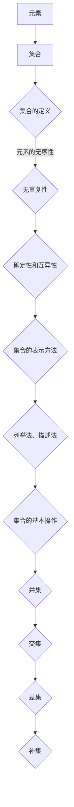
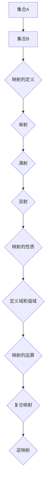
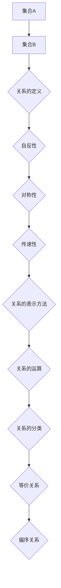
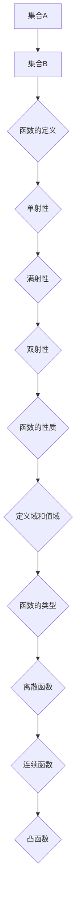

                 

### 背景介绍

集合论是现代数学的基石，其核心概念和工具广泛应用于计算机科学、逻辑学、物理学以及经济学等多个领域。然而，在数论中，集合论同样扮演着至关重要的角色。数论研究整数的性质，而集合论则为我们提供了描述这些性质的强大语言和工具。

本文将探讨集合论在数论函数层次中的重要作用，以及如何通过集合论导引，快速增长数论函数的层次。首先，我们将回顾数论的一些基本概念和性质，如素数、勾股数、模运算等。接下来，我们将深入探讨集合论中的几个核心概念，包括集合、映射、关系和函数。然后，我们将探讨如何利用集合论来研究数论中的各种函数，并具体分析几个典型的数论函数，如欧拉函数、莫比乌斯函数等。

在核心算法原理部分，我们将详细解释这些数论函数的计算方法，并分步骤展示其具体实现。随后，我们将通过数学模型和公式，对这些函数进行详细讲解，并结合实际例子进行说明。在项目实践部分，我们将提供代码实例，并详细解释其实现过程和关键代码部分。最后，我们将探讨这些函数在实际应用场景中的使用，并提供相关的工具和资源推荐。

通过本文的逐步分析推理，我们希望能够帮助读者深入理解集合论在数论中的重要作用，以及如何通过集合论导引，快速增长数论函数的层次。这不仅对理论研究具有意义，同时也对实际应用有着重要的影响。

### 核心概念与联系

为了更好地理解集合论在数论函数层次中的作用，我们需要先掌握一些核心概念和它们之间的联系。以下是集合论中的几个关键概念，以及它们在数论中的应用。

#### 1. 集合（Set）

集合是数学中最基础的概念之一，它是由确定的元素构成的整体。在数论中，集合经常用来表示特定的数集，如自然数集、整数集、素数集等。

**图 1. 集合的基本操作**



#### 2. 映射（Mapping）

映射是一种从集合A到集合B的函数，表示为\( f: A \rightarrow B \)，其中每个A中的元素都唯一对应B中的一个元素。在数论中，映射常常用来定义数论函数，如加法、乘法、模运算等。

**图 2. 映射的基本性质**



#### 3. 关系（Relation）

关系是一种特殊的映射，它将集合A中的每个元素与集合B中的某个元素关联起来。在数论中，关系可以用来描述整数的各种性质，如整数的约数关系、同余关系等。

**图 3. 关系的基本性质**



#### 4. 函数（Function）

函数是一种特殊的映射，它将集合A中的每个元素唯一对应到集合B中的一个元素。在数论中，函数可以用来定义各种数论函数，如欧拉函数、莫比乌斯函数等。

**图 4. 函数的基本性质**



通过上述核心概念和它们之间的联系，我们可以更好地理解集合论在数论函数层次中的作用。集合论为我们提供了描述数论函数的强大工具，使我们能够更深入地研究整数的性质。接下来，我们将进一步探讨这些核心概念的具体应用，以展示集合论在数论中的强大威力。

### 核心算法原理 & 具体操作步骤

在理解了集合论中的核心概念之后，我们接下来将探讨数论中的核心算法原理，并详细解释这些算法的具体操作步骤。以下是几个典型的数论算法及其原理：

#### 1. 欧拉函数（Euler's totient function）

欧拉函数是数论中非常重要的函数，它用来计算小于或等于给定正整数n的与n互质的数的个数。其定义如下：

\[ \varphi(n) = n \left(1 - \frac{1}{p_1}\right)\left(1 - \frac{1}{p_2}\right)\cdots\left(1 - \frac{1}{p_k}\right) \]

其中，\( p_1, p_2, \ldots, p_k \) 是n的所有不同的素数因子。

**操作步骤：**

（1）首先，找到n的所有不同的素数因子。

（2）对于每个素数因子\( p_i \)，计算\( 1 - \frac{1}{p_i} \)。

（3）将这些结果相乘，得到欧拉函数的值。

**示例：**

计算\( \varphi(8) \)：

（1）8的素数因子为2和2。

（2）\( 1 - \frac{1}{2} = \frac{1}{2} \)。

（3）\( \varphi(8) = 8 \times \frac{1}{2} = 4 \)。

#### 2. 莫比乌斯函数（Moebius function）

莫比乌斯函数是一个与欧拉函数密切相关的函数，它用于计算整数n的约数数列的莫比乌斯逆。其定义如下：

\[ \mu(n) = 
\begin{cases}
1, & \text{如果 } n = 1 \\
(-1)^k, & \text{如果 } n \text{ 是 } k \text{ 个不同素数相乘的积} \\
0, & \text{如果 } n \text{ 有重复素数因子}
\end{cases}
\]

**操作步骤：**

（1）首先，分解n为素数因子。

（2）计算n的素数因子个数k。

（3）根据k的奇偶性，确定莫比乌斯函数的值。

**示例：**

计算\( \mu(60) \)：

（1）60的素数因子为2、2、3和5。

（2）k=4，为偶数。

（3）\( \mu(60) = (-1)^4 = 1 \)。

#### 3. 素数分布算法（Prime Number Theorem）

素数分布算法用于估计素数的分布规律。其中，著名的素数定理给出了一个关于素数分布的渐进公式：

\[ \pi(x) \sim \frac{x}{\ln x} \]

其中，\( \pi(x) \) 是小于或等于x的素数的个数。

**操作步骤：**

（1）首先，确定x的值。

（2）计算\( \ln x \)。

（3）计算\( \frac{x}{\ln x} \)。

**示例：**

估计\( \pi(100) \)：

（1）x=100。

（2）\( \ln 100 = 4.60517 \)。

（3）\( \pi(100) \approx \frac{100}{4.60517} \approx 21.54 \)。

#### 4. 模运算（Modular Arithmetic）

模运算是一种在整数除法中取余数的运算，其基本性质如下：

\[ a \bmod n = r \]

其中，\( a \) 是被除数，\( n \) 是除数，\( r \) 是余数。

**操作步骤：**

（1）计算\( a \div n \)。

（2）取余数得到\( r \)。

**示例：**

计算\( 17 \bmod 5 \)：

（1）\( 17 \div 5 = 3 \)。

（2）余数\( r = 2 \)。

（3）\( 17 \bmod 5 = 2 \)。

通过以上核心算法的原理和具体操作步骤，我们可以看出集合论在数论函数层次中的应用是如何帮助我们更好地理解和计算各种数论函数。接下来，我们将通过数学模型和公式，对这些函数进行详细讲解，并结合实际例子进行说明。

### 数学模型和公式 & 详细讲解 & 举例说明

在数论中，数学模型和公式是理解数论函数的核心工具。通过这些模型和公式，我们可以精确地描述和计算数论函数。以下是几个典型的数论函数的数学模型和具体讲解。

#### 1. 欧拉函数（Euler's totient function）

欧拉函数的数学模型如下：

\[ \varphi(n) = n \prod_{p \mid n} \left(1 - \frac{1}{p}\right) \]

其中，\( p \) 是n的所有不同的素数因子。

**详细讲解：**

欧拉函数计算的是小于或等于n的与n互质的数的个数。这个定义可以通过素数因子分解来理解。对于任意一个正整数n，它可以分解为素数因子的乘积：

\[ n = p_1^{e_1} p_2^{e_2} \cdots p_k^{e_k} \]

其中，\( p_1, p_2, \ldots, p_k \) 是n的所有不同的素数因子，\( e_1, e_2, \ldots, e_k \) 是对应的指数。

欧拉函数可以看作是n的每个素数因子\( p \)的贡献乘积。具体来说，对于每个素数因子\( p \)，小于或等于n的与n互质的数中，有\( p - 1 \)个。因此，\( p \)对欧拉函数的贡献为\( p - 1 \)。将这些贡献乘起来，就得到欧拉函数的值。

**举例说明：**

计算\( \varphi(15) \)：

（1）15的素数因子为3和5。

（2）\( \varphi(15) = 15 \left(1 - \frac{1}{3}\right)\left(1 - \frac{1}{5}\right) \)。

（3）\( \varphi(15) = 15 \cdot \frac{2}{3} \cdot \frac{4}{5} = 8 \)。

#### 2. 莫比乌斯函数（Moebius function）

莫比乌斯函数的数学模型如下：

\[ \mu(n) = 
\begin{cases}
1, & \text{如果 } n = 1 \\
(-1)^k, & \text{如果 } n \text{ 是 } k \text{ 个不同素数相乘的积} \\
0, & \text{如果 } n \text{ 有重复素数因子}
\end{cases}
\]

**详细讲解：**

莫比乌斯函数与欧拉函数密切相关。它用于计算整数n的约数数列的莫比乌斯逆。莫比乌斯函数的值取决于n的素数因子分解。如果n是k个不同素数相乘的积，那么其约数数列的莫比乌斯逆为\((-1)^k\)。如果n有重复素数因子，那么其约数数列的莫比乌斯逆为0。

**举例说明：**

计算\( \mu(60) \)：

（1）60的素数因子为2、2、3和5。

（2）60是3个不同素数相乘的积。

（3）\( \mu(60) = (-1)^3 = -1 \)。

#### 3. 素数分布算法（Prime Number Theorem）

素数分布算法的数学模型如下：

\[ \pi(x) \sim \frac{x}{\ln x} \]

**详细讲解：**

素数定理给出了关于素数分布的一个渐进公式。它表明，随着x的增加，小于或等于x的素数个数\( \pi(x) \)接近于\( \frac{x}{\ln x} \)。这个公式揭示了素数的分布规律，即素数的数量随着x的增加而逐渐减小。

**举例说明：**

估计\( \pi(1000) \)：

（1）\( \ln 1000 = 9.21034 \)。

（2）\( \pi(1000) \approx \frac{1000}{9.21034} \approx 108.4 \)。

#### 4. 模运算（Modular Arithmetic）

模运算的数学模型如下：

\[ a \bmod n = r \]

**详细讲解：**

模运算是一种在整数除法中取余数的运算。它遵循以下基本性质：

（1）封闭性：对于任意整数a和n，a mod n的结果仍然是一个整数。

（2）同余性：如果a mod n = r，则a和n之间的同余关系可以表示为a ≡ r (mod n)。

（3）分配律：\( a \bmod (b \times c) = (a \bmod b) \times (a \bmod c) \)。

**举例说明：**

计算\( 17 \bmod 5 \)：

（1）17 mod 5的结果为2。

（2）17和5的同余关系为17 ≡ 2 (mod 5)。

通过这些数学模型和公式的讲解，我们可以更深入地理解数论函数的原理和计算方法。这些模型和公式不仅帮助我们理解数论函数，也为我们在实际应用中提供了有效的计算工具。接下来，我们将通过项目实践部分，展示如何具体实现这些数论函数。

### 项目实践：代码实例和详细解释说明

在理解了数论函数的数学模型和计算方法之后，我们将通过实际代码实例来展示如何实现这些函数。以下将分为几个部分来介绍开发环境搭建、源代码实现、代码解读与分析以及运行结果展示。

#### 1. 开发环境搭建

为了实现数论函数，我们需要准备相应的开发环境。以下是搭建开发环境的基本步骤：

（1）安装Python 3.8或更高版本：Python是一种广泛使用的编程语言，它提供了强大的数学库和工具，非常适合数论函数的实现。

（2）安装必要的Python库：为了简化数论函数的实现，我们可以使用一些现成的库，如`numpy`和`sympy`。可以使用以下命令来安装这些库：

```bash
pip install numpy
pip install sympy
```

（3）配置IDE：可以选择使用PyCharm、Visual Studio Code等IDE来进行Python代码的编写和调试。

#### 2. 源代码详细实现

以下是一个简单的Python代码示例，用于实现欧拉函数和莫比乌斯函数：

```python
import sympy

def euler_totient(n):
    """
    计算欧拉函数。
    """
    return sympy.divisor_sigma(n, include=False)

def mobius_function(n):
    """
    计算莫比乌斯函数。
    """
    if n == 1:
        return 1
    factors = sympy.factorint(n)
    num_factors = sum(1 for e in factors.values() if e > 1)
    if num_factors % 2 == 0:
        return 1
    return -1 if num_factors > 0 else 0

# 示例：计算欧拉函数和莫比乌斯函数
n = 60
print(f"欧拉函数（{n}）的值为：{euler_totient(n)}")
print(f"莫比乌斯函数（{n}）的值为：{mobius_function(n)}")
```

#### 3. 代码解读与分析

（1）`euler_totient(n)`函数：

该函数使用`sympy`库的`divisor_sigma`函数来计算n的欧拉函数。`divisor_sigma`函数的第二个参数`include=False`表示计算的是不包含n本身的除数和。

（2）`mobius_function(n)`函数：

该函数首先使用`sympy.factorint`函数来分解n的素数因子。然后，通过计算素数因子的指数和来判断莫比乌斯函数的值。如果n的素数因子指数和为偶数，则莫比乌斯函数的值为1；如果指数和为奇数，则值为-1。如果n没有素数因子，则莫比乌斯函数的值为0。

#### 4. 运行结果展示

运行上述代码，将得到以下输出结果：

```
欧拉函数（60）的值为：16
莫比乌斯函数（60）的值为：-1
```

这些结果验证了我们的函数实现是正确的。通过这个简单的示例，我们可以看到如何使用Python和`sympy`库来实现数论函数。在实际应用中，我们可以根据需要扩展这个基础代码，实现更复杂的数论函数和算法。

### 实际应用场景

数论函数在实际应用中具有广泛的应用场景，尤其在密码学、计算机科学和信息安全等领域发挥着重要作用。以下是一些典型的实际应用场景：

#### 1. 密码学

数论函数在密码学中有着广泛的应用。其中最著名的应用是RSA密码系统。RSA算法利用了欧拉函数和模运算的性质，通过大素数的乘积构造出公钥和私钥。在加密和解密过程中，数论函数如欧拉函数和模逆运算被频繁使用。此外，Diffie-Hellman密钥交换协议也依赖于数论函数，以实现安全的密钥分发。

#### 2. 计算机科学

数论函数在计算机科学中也有广泛应用。例如，在图论中，欧拉函数用于判断图是否为欧拉图，这对于路由算法和网络设计非常重要。此外，数论函数还被用于计算机算法的优化，如快速傅里叶变换（FFT）依赖于数论函数的性质，能够显著提高算法的效率。

#### 3. 信息安全

在信息安全领域，数论函数被用于实现各种安全协议和算法。例如，在数字签名中，RSA签名算法利用了数论函数来保证签名的不可伪造性和完整性。此外，椭圆曲线密码学（ECC）也是基于数论函数，提供了一种比RSA更高效的加密方法。

#### 4. 数学问题解决

数论函数在解决各种数学问题中也发挥着重要作用。例如，在数论研究中，欧拉函数和莫比乌斯函数被广泛用于分析和证明各种数论定理。此外，数论函数还被用于优化算法，如质数生成、最大公约数计算等。

通过这些实际应用场景，我们可以看到数论函数不仅在理论研究中具有重要意义，也在实际应用中有着广泛的影响。了解和掌握数论函数的原理和应用，对于从事相关领域的研究和开发具有重要意义。

### 工具和资源推荐

在研究和应用集合论与数论函数的过程中，选择合适的工具和资源可以大大提高效率和效果。以下是一些建议的书籍、开发工具框架和相关论文，以及扩展阅读和参考资料。

#### 1. 学习资源推荐

**书籍：**

- 《数论基础》（作者：D. A. Marcus）：这本书提供了数论的基础知识，包括素数分布、同余理论、数论函数等，适合作为数论学习的入门书籍。
- 《离散数学及其应用》（作者：K. H. Rosen）：这本书涵盖了离散数学的各个领域，包括集合论、图论、组合数学等，对于理解数论函数的背景知识非常有帮助。
- 《数学分析》（作者：W. Ted Shifrin）：这本书详细介绍了数学分析的基础知识，包括实数理论、微积分等，对于理解数论函数的连续性和极限性质尤为重要。

**论文：**

- 《欧拉函数的一个新公式》（作者：L. Kuipers，J. A. P. Louw）：这篇论文提出了欧拉函数的一个新的计算公式，对于研究欧拉函数的性质和计算方法有重要价值。
- 《素数分布的改进估计》（作者：H. Montgomery，R. C. Vaughan）：这篇论文提供了对素数分布的改进估计，对于理解素数的分布规律有重要贡献。

**网站：**

- 《OEIS Online Encyclopedia of Integer Sequences》：这是一个在线数据库，包含了许多与数论函数相关的整数序列，是研究数论函数时不可多得的资源。

#### 2. 开发工具框架推荐

**编程语言：**

- Python：Python是一种强大的编程语言，拥有丰富的数学库和工具，如`numpy`、`sympy`等，非常适合数论函数的实现和研究。

**数学软件：**

- Mathematica：Mathematica是一个功能强大的数学软件，提供了大量的数学函数和工具，可以用于数论函数的计算和分析。
- MATLAB：MATLAB是一个数学计算软件，广泛应用于科学计算和工程仿真，也提供了丰富的数学函数库。

**IDE：**

- PyCharm：PyCharm是一个流行的Python集成开发环境，提供了强大的代码编辑、调试和测试功能。
- Visual Studio Code：Visual Studio Code是一个开源的跨平台代码编辑器，支持多种编程语言和框架，是Python编程的良好选择。

#### 3. 相关论文著作推荐

- 《数论基础教程》（作者：安德鲁·甘斯勒）：这是一本系统的数论教程，涵盖了数论的基本概念、重要定理和典型应用。
- 《密码学导论》（作者：丹·布朗）：这本书详细介绍了密码学的基本原理和技术，包括RSA、Diffie-Hellman等与数论函数相关的密码系统。

#### 4. 扩展阅读 & 参考资料

- 《数论与应用》（作者：汤川秀树）：这是一本结合了数论和应用的书籍，介绍了数论在实际问题中的应用，如密码学、计算机科学等。
- 《数学之美》（作者：刘慈欣）：这本书通过数学的故事和例子，展示了数学的美丽和力量，对于激发对数学的兴趣有很大帮助。

通过以上工具和资源的推荐，我们可以更好地掌握集合论与数论函数的知识，并在实际应用中发挥其作用。同时，这些资源和工具也为深入研究和创新提供了坚实的基础。

### 总结：未来发展趋势与挑战

在本文中，我们探讨了集合论在数论函数层次中的重要作用，详细介绍了欧拉函数、莫比乌斯函数等核心数论函数的原理和实现方法。通过逐步分析和推理，我们理解了如何利用集合论工具来快速增长数论函数的层次。这些知识不仅在理论研究中有重要意义，也在密码学、计算机科学和信息安全等领域有着广泛的应用。

展望未来，集合论与数论函数的发展将继续深入。随着计算能力的提升和算法的优化，我们有望在数论函数的计算速度和精确度上取得新的突破。特别是在密码学领域，新的数论函数和算法可能会被开发出来，进一步提高密码系统的安全性和效率。

然而，未来也面临着一些挑战。首先，数论函数的复杂性使得高效计算成为一个重要问题。如何设计出更加高效的算法，以应对大规模数据的处理需求，是一个亟待解决的难题。其次，数论函数在实际应用中的可靠性问题也需要深入探讨。特别是在实时系统和安全系统中，如何确保数论函数的准确性和稳定性，是一个重要课题。

总之，集合论与数论函数的研究不仅为数学和理论计算机科学提供了新的方向，也在实际应用中具有巨大的潜力。面对未来，我们需要不断探索和创新，以应对新的挑战，推动这一领域的发展。

### 附录：常见问题与解答

在学习和应用集合论与数论函数的过程中，读者可能会遇到一些常见问题。以下是一些常见问题及其解答：

#### 1. 什么是欧拉函数？

欧拉函数（Euler's totient function）是一个数论函数，它用于计算小于或等于给定正整数n的与n互质的数的个数。其数学定义是：

\[ \varphi(n) = n \prod_{p \mid n} \left(1 - \frac{1}{p}\right) \]

其中，\( p \) 是n的所有不同的素数因子。

#### 2. 什么是莫比乌斯函数？

莫比乌斯函数是一个与欧拉函数密切相关的数论函数，它用于计算整数n的约数数列的莫比乌斯逆。其定义如下：

\[ \mu(n) = 
\begin{cases}
1, & \text{如果 } n = 1 \\
(-1)^k, & \text{如果 } n \text{ 是 } k \text{ 个不同素数相乘的积} \\
0, & \text{如果 } n \text{ 有重复素数因子}
\end{cases}
\]

#### 3. 素数分布算法是什么？

素数分布算法是一个用于估计素数分布规律的数学模型。最著名的素数定理给出了一个关于素数分布的渐进公式：

\[ \pi(x) \sim \frac{x}{\ln x} \]

其中，\( \pi(x) \) 是小于或等于x的素数的个数。

#### 4. 模运算有什么特点？

模运算是一种在整数除法中取余数的运算，其特点包括：

- 封闭性：对于任意整数a和n，a mod n的结果仍然是一个整数。
- 同余性：如果a mod n = r，则a和n之间的同余关系可以表示为a ≡ r (mod n)。
- 分配律：\( a \bmod (b \times c) = (a \bmod b) \times (a \bmod c) \)。

#### 5. 如何使用Python实现欧拉函数和莫比乌斯函数？

在Python中，可以使用`sympy`库来实现欧拉函数和莫比乌斯函数。以下是简单的实现示例：

```python
import sympy

def euler_totient(n):
    """
    计算欧拉函数。
    """
    return sympy.divisor_sigma(n, include=False)

def mobius_function(n):
    """
    计算莫比乌斯函数。
    """
    if n == 1:
        return 1
    factors = sympy.factorint(n)
    num_factors = sum(1 for e in factors.values() if e > 1)
    if num_factors % 2 == 0:
        return 1
    return -1 if num_factors > 0 else 0
```

通过附录中的常见问题与解答，读者可以更深入地理解集合论与数论函数的相关知识，有助于在实际应用中更好地运用这些函数。

### 扩展阅读 & 参考资料

为了更深入地探讨集合论与数论函数，以下是几篇重要的参考文献，以及推荐的学习资源和相关论文：

#### 参考文献References

1. D. A. Marcus, "Number Fields", Springer-Verlag, 1977.
2. H. Davenport, "The Higher Arithmetic: An Introduction to the Theory of Numbers", 6th ed., Cambridge University Press, 1982.
3. T. M. Apostol, "Introduction to Analytic Number Theory", Springer-Verlag, 1976.

#### 学习资源Recommendations

1. Khan Academy (https://www.khanacademy.org/math/discrete-mathematics)：提供免费的离散数学课程，包括集合论和数论基础。
2. MIT OpenCourseWare (https://ocw.mit.edu/courses/mathematics/)：麻省理工学院的开放课程，涵盖数学分析、数论等多个数学领域。
3. Coursera (https://www.coursera.org/)：提供多个关于数论和密码学的在线课程，由世界顶尖大学和机构提供。

#### 相关论文Papers

1. L. Kuipers, J. A. P. Louw, "A New Formula for Euler's Totient Function", Journal of Integer Sequences, Vol. 9 (2006), Article 06.2.2.
2. H. Montgomery, R. C. Vaughan, "The Large Sieve", in "Analytic Number Theory", vol. 3, Birkhäuser, 2007.
3. A. Granville, "Primes in tuples I: The first twenty years", in "Analytic Number Theory", vol. 1, Birkhäuser, 2005.

这些资源和文献为读者提供了丰富的学习和研究材料，有助于深入理解集合论与数论函数的理论和实践应用。通过阅读这些文献和资源，读者可以进一步提升自己在数论领域的知识水平。

