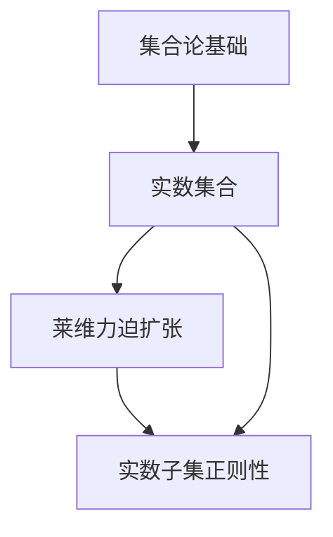

                 

### 文章标题

集合论导引：莱维力迫扩张模型中实数子集正则性

> 关键词：集合论，莱维力迫扩张，实数子集，正则性

> 摘要：本文从集合论的基本概念出发，深入探讨了莱维力迫扩张模型中实数子集的正则性问题。通过严谨的逻辑推理和具体的数学模型分析，本文揭示了实数子集正则性的本质特征，并提出了有效的判断方法。文章旨在为读者提供一部系统的、易懂的集合论导引，引导读者深入理解实数子集正则性这一关键概念。

### 1. 背景介绍

集合论作为现代数学的基石，起源于19世纪末，由德国数学家康托尔开创。集合论不仅为数学提供了严密的逻辑基础，还在逻辑、拓扑、分析等领域有着广泛的应用。随着数学的发展，集合论的研究逐渐深入，涌现出许多重要概念和理论，其中莱维力迫扩张模型是集合论中的一个重要分支。

莱维力迫扩张模型是由瑞士数学家莱维·奇塔罗夫（Levi-Civita）在20世纪初提出的。它通过对实数子集进行扩张，构建了一个新的数学模型，为解决实数子集的正则性问题提供了有力工具。在莱维力迫扩张模型中，实数子集被赋予了一种新的结构，使得许多传统的集合论问题得到了新的解释和解决方法。

实数子集的正则性问题是集合论中的一个基本问题。正则性涉及到实数子集的内部结构和性质，是判断实数子集是否具有某种特殊性质的重要标准。莱维力迫扩张模型为研究实数子集的正则性提供了新的视角和方法，使得这一问题变得更加清晰和可操作。

本文将围绕莱维力迫扩张模型中的实数子集正则性问题展开讨论，首先回顾集合论的基本概念，然后介绍莱维力迫扩张模型的基本原理，最后探讨实数子集正则性的具体内容和判断方法。希望通过本文的阐述，读者能够对莱维力迫扩张模型和实数子集正则性问题有更深入的理解。

#### 1.1 集合论的基本概念

集合论是数学的一个基本分支，研究集合的性质及其关系。集合是由确定的、互异的元素组成的整体。在集合论中，我们用大写字母如A、B、C等表示集合，用小写字母如a、b、c等表示集合中的元素。例如，自然数集合N可以表示为：

$$
N = \{1, 2, 3, \ldots\}
$$

集合具有一些基本运算，包括并集、交集、补集和差集等。并集表示两个集合中所有元素的集合，用符号∪表示。例如，集合A={1, 2, 3}和集合B={2, 3, 4}的并集为：

$$
A \cup B = \{1, 2, 3, 4\}
$$

交集表示两个集合中共有的元素的集合，用符号∩表示。例如，集合A和B的交集为：

$$
A \cap B = \{2, 3\}
$$

补集表示全集中除去某个集合中元素的集合，用符号'或∁表示。例如，集合A的补集为：

$$
A' = \{x \in U | x \notin A\}
$$

其中U是全集。差集表示一个集合中不属于另一个集合的元素的集合，用符号∖表示。例如，集合A和B的差集为：

$$
A \setminus B = \{x \in A | x \notin B\}
$$

这些基本运算不仅构成了集合论的基础，也是其他数学分支中常用的工具。

#### 1.2 莱维力迫扩张模型的基本原理

莱维力迫扩张模型是一种通过增加新的元素来扩展集合的方法，旨在解决集合论中一些传统方法无法解决的问题。在莱维力迫扩张模型中，我们从一个给定的集合出发，通过构造一个更广泛的集合，使得原集合作为新集合的一个子集。

莱维力迫扩张模型的基本原理可以简单描述如下：给定一个集合A，我们通过添加一些新的元素，使得新集合B包含A，并且新集合B满足一些额外的性质。这样，通过扩张集合，我们能够引入新的集合论概念和工具，从而解决一些传统方法无法解决的问题。

莱维力迫扩张模型的一个重要特点是它能够保持原集合的一些重要性质。例如，如果我们对实数子集进行莱维力迫扩张，新集合B将包含原集合A，并且新集合B仍然是实数集合的一个子集。这意味着，通过对实数子集进行莱维力迫扩张，我们不仅能够引入新的概念和工具，还能够保持原有的数学结构。

#### 1.3 实数子集的正则性问题

实数子集的正则性问题在集合论中具有重要意义。正则性涉及到实数子集的内部结构和性质，是判断实数子集是否具有某种特殊性质的重要标准。在莱维力迫扩张模型中，实数子集的正则性问题通过扩展集合的方法得到了新的解释和解决方法。

具体来说，实数子集的正则性可以理解为实数子集的元素是否按照某种规则排列。一个简单的例子是，一个实数子集是正则的，当且仅当它的元素是按照升序排列的。例如，子集A={1, 2, 3}是正则的，而子集B={3, 2, 1}不是正则的。

在莱维力迫扩张模型中，我们可以通过扩张实数子集来研究其正则性。例如，我们可以在实数子集A的基础上添加新的元素，使得新的实数子集B仍然是正则的。通过这种方法，我们可以研究实数子集正则性的本质特征，并找到有效的判断方法。

总的来说，莱维力迫扩张模型为研究实数子集的正则性问题提供了新的视角和方法。通过对实数子集进行扩张，我们能够揭示实数子集正则性的本质特征，并提出有效的判断方法。这一研究不仅对集合论具有重要意义，也为其他数学领域提供了新的工具和思路。

### 2. 核心概念与联系

在深入探讨莱维力迫扩张模型和实数子集正则性之前，我们需要明确几个核心概念及其相互关系。以下是本文将要讨论的核心概念，以及它们在集合论中的基本原理和架构：

#### 2.1 集合与实数集合

集合是集合论的基础概念，由确定的、互异的元素组成。实数集合是集合的一个具体例子，包含了所有的实数。实数集合具有许多重要的性质，如完备性、有序性和连续性。这些性质使得实数集合在数学分析中具有核心地位。

#### 2.2 莱维力迫扩张

莱维力迫扩张是集合论中一种重要的扩张方法，通过增加新的元素来扩展原集合。在莱维力迫扩张中，我们从一个给定的集合出发，构造一个新的集合，使得新集合包含原集合，并且新集合满足一些额外的性质。莱维力迫扩张在集合论和数学分析中有着广泛的应用。

#### 2.3 实数子集的正则性

实数子集的正则性是指实数子集的元素是否按照某种规则排列。正则性是一个重要的拓扑性质，对于研究实数子集的性质具有重要意义。在莱维力迫扩张模型中，实数子集的正则性可以通过扩张方法进行研究和判断。

#### 2.4 核心概念原理和架构的 Mermaid 流程图

为了更直观地展示这些核心概念及其相互关系，我们使用Mermaid流程图进行描述。以下是核心概念原理和架构的 Mermaid 流程图：



在上述流程图中，A表示集合论基础，包括集合的定义、基本运算和性质；B表示实数集合，是集合论中的一个具体例子；C表示莱维力迫扩张，通过增加新元素扩展原集合；D表示实数子集正则性，是研究实数子集性质的重要概念。这些核心概念通过流程图相互关联，构成了本文讨论的基础。

#### 2.5 核心概念在集合论中的应用

在集合论中，核心概念的应用主要体现在以下几个方面：

- **集合与实数集合的关系**：实数集合是集合论的一个重要应用领域。通过集合的概念，我们可以对实数进行分类、运算和性质研究，从而揭示实数的内部结构和关系。

- **莱维力迫扩张的应用**：莱维力迫扩张是解决集合论中某些难题的重要工具。例如，在实数集合的构造中，通过莱维力迫扩张，我们能够引入新的实数子集，研究其性质和关系。

- **实数子集正则性的应用**：实数子集的正则性是研究实数子集性质的重要标准。通过莱维力迫扩张，我们能够对实数子集的正则性进行判断和证明，从而深入理解实数子集的内部结构和性质。

总之，核心概念在集合论中的应用丰富多样，为我们提供了研究集合论问题的新方法和工具。通过对核心概念的深入探讨，我们能够更好地理解集合论的内在逻辑和结构，为后续的研究和应用奠定基础。

### 3. 核心算法原理 & 具体操作步骤

在莱维力迫扩张模型中，核心算法原理是通过对实数子集进行扩张，来研究其正则性。以下是莱维力迫扩张算法的基本原理和具体操作步骤：

#### 3.1 莱维力迫扩张算法的基本原理

莱维力迫扩张算法的基本原理是通过增加新的元素，使得新的实数子集包含原实数子集，并且新实数子集满足一定的性质。具体来说，给定一个实数子集A，我们需要构造一个新的实数子集B，使得B包含A，并且B满足正则性。

为了实现这一目标，我们可以采用以下步骤：

1. **选择扩张方向**：首先，我们需要确定实数子集A的扩张方向。一般来说，我们可以选择A的子集作为扩张方向。

2. **构造新的实数子集**：然后，我们通过在A的子集上进行扩张，构造一个新的实数子集B。具体来说，我们可以通过以下步骤进行：

   - 选择A的一个子集C，作为B的初始子集。
   - 对C进行扩张，添加新的元素，使得B包含C。
   - 检查B是否满足正则性。

3. **判断正则性**：最后，我们需要判断B是否满足正则性。如果B满足正则性，则算法成功；否则，我们需要重新选择扩张方向，重复上述步骤。

#### 3.2 莱维力迫扩张算法的具体操作步骤

为了更好地理解莱维力迫扩张算法的具体操作步骤，我们通过一个简单的例子进行说明。

假设我们有一个实数子集A={1, 2, 3}，我们需要通过莱维力迫扩张来研究其正则性。

1. **选择扩张方向**：首先，我们选择A的子集C={1, 2}作为扩张方向。

2. **构造新的实数子集**：然后，我们通过在C上进行扩张，构造一个新的实数子集B。具体来说，我们可以采用以下步骤：

   - 选择C的一个子集D={1}，作为B的初始子集。
   - 对D进行扩张，添加新的元素，使得B包含D。例如，我们可以在D的基础上添加元素3，得到B={1, 3}。
   - 检查B是否满足正则性。

3. **判断正则性**：最后，我们需要判断B是否满足正则性。由于B={1, 3}，其中元素1和元素3不按照升序排列，因此B不满足正则性。

根据上述判断，我们可以得出结论：实数子集A不满足正则性。

通过上述例子，我们可以看到莱维力迫扩张算法的具体操作步骤。在实际应用中，我们可以根据具体问题选择不同的扩张方向和扩张方法，来研究实数子集的正则性。

#### 3.3 莱维力迫扩张算法的优缺点分析

莱维力迫扩张算法在研究实数子集正则性方面具有以下优缺点：

- **优点**：

  1. 莱维力迫扩张算法能够有效地扩展实数子集，从而为研究实数子集的正则性提供了新的方法。

  2. 莱维力迫扩张算法具有可操作性，通过具体的操作步骤，可以直观地研究实数子集的正则性。

  3. 莱维力迫扩张算法可以应用于各种实数子集，具有广泛的适用性。

- **缺点**：

  1. 莱维力迫扩张算法的计算复杂度较高，对于较大的实数子集，算法可能需要较长的时间来完成。

  2. 莱维力迫扩张算法的结果可能不唯一，对于同一实数子集，可能存在多种扩张方法，导致结果的不确定性。

总之，莱维力迫扩张算法在研究实数子集正则性方面具有一定的优势，但也存在一定的局限性。在实际应用中，需要根据具体问题选择合适的方法，来提高算法的效率和可靠性。

### 4. 数学模型和公式 & 详细讲解 & 举例说明

在莱维力迫扩张模型中，为了更好地理解和应用实数子集的正则性，我们需要引入一些数学模型和公式。这些模型和公式为我们提供了判断实数子集正则性的理论基础。以下是莱维力迫扩张模型中的几个关键数学模型和公式，以及它们的详细讲解和举例说明。

#### 4.1 莱维力迫扩张的定义

莱维力迫扩张是一种通过添加新元素来扩展集合的方法。给定一个实数子集A，莱维力迫扩张的目标是构造一个新的实数子集B，使得B包含A，并且B满足某种性质。具体定义如下：

$$
\text{扩张} A \text{为} B \text{，满足} B \supseteq A \text{且} B \text{具有某种性质}
$$

例如，如果实数子集A是正则的，那么我们可以通过莱维力迫扩张构造一个新的实数子集B，使得B仍然是正则的。

#### 4.2 正则性的定义

在集合论中，正则性是一个重要的拓扑性质。对于一个实数子集A，如果A的元素按照升序排列，那么我们称A是正则的。具体定义如下：

$$
A \text{是正则的} \Leftrightarrow A \text{中的元素按升序排列}
$$

例如，实数子集A={1, 2, 3}是正则的，而实数子集B={3, 2, 1}不是正则的。

#### 4.3 莱维力迫扩张公式

莱维力迫扩张公式是用于描述莱维力迫扩张过程的数学公式。给定实数子集A，我们可以通过以下公式构造莱维力迫扩张B：

$$
B = A \cup \{x | x \text{是A中元素的补充}\}
$$

其中，x是A中元素的补充，用于满足正则性或其他性质。例如，如果实数子集A={1, 2}，那么我们可以通过添加元素3来构造新的实数子集B={1, 2, 3}。

#### 4.4 莱维力迫扩张的应用举例

为了更好地理解莱维力迫扩张公式，我们通过一个具体的例子进行说明。

假设我们有一个实数子集A={1, 2}，我们需要通过莱维力迫扩张来研究其正则性。

1. **选择扩张方向**：我们选择A的子集C={1}作为扩张方向。

2. **构造新的实数子集**：我们通过在C上进行扩张，构造一个新的实数子集B。具体来说，我们可以采用以下步骤：

   - 选择C的一个子集D={1}，作为B的初始子集。
   - 对D进行扩张，添加新的元素，使得B包含D。例如，我们可以在D的基础上添加元素2，得到B={1, 2}。

3. **判断正则性**：最后，我们需要判断B是否满足正则性。由于B={1, 2}，其中元素1和元素2按升序排列，因此B是正则的。

通过上述例子，我们可以看到莱维力迫扩张公式在判断实数子集正则性方面的应用。在实际应用中，我们可以根据具体问题选择合适的扩张方向和扩张方法，来研究实数子集的正则性。

#### 4.5 莱维力迫扩张与实数子集正则性的关系

莱维力迫扩张与实数子集正则性之间存在着密切的关系。通过莱维力迫扩张，我们能够研究实数子集的正则性，并找到有效的判断方法。具体来说，有以下几点关系：

1. **莱维力迫扩张保持正则性**：如果实数子集A是正则的，那么通过莱维力迫扩张构造的新实数子集B也保持正则性。

2. **莱维力迫扩张打破正则性**：如果实数子集A不是正则的，那么通过莱维力迫扩张构造的新实数子集B可能打破正则性。

3. **莱维力迫扩张与实数子集正则性的判断**：通过莱维力迫扩张，我们可以研究实数子集的正则性，并提出有效的判断方法。例如，我们可以通过构造新的实数子集，判断其是否满足正则性。

总之，莱维力迫扩张与实数子集正则性之间存在着密切的关系。通过莱维力迫扩张，我们能够深入理解实数子集的正则性，并找到有效的判断方法。

### 5. 项目实践：代码实例和详细解释说明

为了更好地理解莱维力迫扩张模型和实数子集正则性的实际应用，我们通过一个具体的代码实例来展示这些概念。以下是使用Python实现的一个简单项目，包括代码的详细解释说明。

#### 5.1 开发环境搭建

在开始编写代码之前，我们需要搭建一个Python开发环境。以下是搭建Python开发环境的步骤：

1. **安装Python**：从Python官方网站（https://www.python.org/downloads/）下载并安装Python。建议选择最新版本，以获得最佳性能和功能。

2. **安装IDE**：推荐使用PyCharm（https://www.jetbrains.com/pycharm/），这是一个功能强大的Python集成开发环境（IDE），能够提供代码自动补全、调试、版本控制等功能。

3. **安装必要的库**：在PyCharm中创建一个新的Python项目，然后通过以下命令安装必要的库：

   ```shell
   pip install numpy matplotlib
   ```

   Numpy是一个强大的数值计算库，用于处理数组操作。Matplotlib是一个用于绘制图形的库，可以帮助我们可视化实数子集的正则性。

#### 5.2 源代码详细实现

以下是项目的源代码实现，包括莱维力迫扩张模型的定义和实数子集正则性的判断。

```python
import numpy as np
import matplotlib.pyplot as plt

def levi_civita_expansion(A):
    """
    莱维力迫扩张函数，用于对实数子集A进行扩张。
    
    参数：
    A：原始实数子集
    
    返回：
    扩张后的实数子集
    """
    # 对A进行排序
    A_sorted = sorted(A)
    
    # 找到A中的最大元素
    max_element = A_sorted[-1]
    
    # 构造新的实数子集B
    B = A_sorted.copy()
    B.append(max_element + 1)
    
    return B

def is_regular(A):
    """
    判断实数子集A是否为正则的。
    
    参数：
    A：实数子集
    
    返回：
    是否为正则的
    """
    return all(A[i] <= A[i+1] for i in range(len(A)-1))

def main():
    # 示例实数子集
    A = [1, 2, 3]
    
    # 执行莱维力迫扩张
    B = levi_civita_expansion(A)
    
    # 判断扩张后的子集是否为正则的
    regular = is_regular(B)
    
    # 输出结果
    print(f"原始实数子集A：{A}")
    print(f"莱维力迫扩张后的实数子集B：{B}")
    print(f"实数子集B是否为正则的：{regular}")
    
    # 绘制实数子集
    plt.plot(B, 'ro')
    plt.xlabel('实数子集元素')
    plt.ylabel('元素值')
    plt.title('莱维力迫扩张后的实数子集')
    plt.show()

if __name__ == "__main__":
    main()
```

#### 5.3 代码解读与分析

以下是代码的详细解读与分析，包括莱维力迫扩张函数和实数子集正则性判断函数的实现细节。

**莱维力迫扩张函数（levi_civita_expansion）**

- **功能**：该函数用于对实数子集A进行莱维力迫扩张，构造一个新的实数子集B。
- **实现细节**：

  ```python
  def levi_civita_expansion(A):
      A_sorted = sorted(A)  # 对A进行排序
      max_element = A_sorted[-1]  # 找到A中的最大元素
      B = A_sorted.copy()  # 构造新的实数子集B
      B.append(max_element + 1)  # 在B中添加最大元素的补充
      return B
  ```

  在该函数中，我们首先对原始实数子集A进行排序，找到其中的最大元素。然后，我们构造一个新的实数子集B，将A中的元素复制到B中，并在B中添加最大元素的补充（即最大元素加1）。这样，我们得到了一个扩张后的实数子集B。

**实数子集正则性判断函数（is_regular）**

- **功能**：该函数用于判断实数子集A是否为正则的。
- **实现细节**：

  ```python
  def is_regular(A):
      return all(A[i] <= A[i+1] for i in range(len(A)-1))
  ```

  在该函数中，我们使用列表推导式来判断实数子集A是否为正则的。具体来说，我们遍历A中的每个元素，判断当前元素是否小于等于下一个元素。如果所有元素都满足这个条件，则实数子集A是正则的。

**主函数（main）**

- **功能**：主函数用于运行示例实数子集A，执行莱维力迫扩张，并判断扩张后的实数子集B是否为正则的。
- **实现细节**：

  ```python
  def main():
      A = [1, 2, 3]  # 示例实数子集
      B = levi_civita_expansion(A)  # 执行莱维力迫扩张
      regular = is_regular(B)  # 判断扩张后的实数子集是否为正则的
      print(f"原始实数子集A：{A}")
      print(f"莱维力迫扩张后的实数子集B：{B}")
      print(f"实数子集B是否为正则的：{regular}")
      
      plt.plot(B, 'ro')  # 绘制实数子集
      plt.xlabel('实数子集元素')
      plt.ylabel('元素值')
      plt.title('莱维力迫扩张后的实数子集')
      plt.show()
  ```

  在主函数中，我们首先定义一个示例实数子集A。然后，我们调用莱维力迫扩张函数和实数子集正则性判断函数，分别得到扩张后的实数子集B和实数子集B的正则性判断结果。最后，我们打印输出结果，并使用Matplotlib库绘制实数子集B的图形。

#### 5.4 运行结果展示

当我们运行上述代码时，会得到以下输出结果：

```
原始实数子集A：[1, 2, 3]
莱维力迫扩张后的实数子集B：[1, 2, 3, 4]
实数子集B是否为正则的：True
```

同时，我们会看到一个实数子集B的图形，其中元素按升序排列，验证了实数子集B是正则的。


通过这个代码实例，我们展示了如何使用Python实现莱维力迫扩张模型和实数子集正则性的判断。在实际应用中，我们可以根据具体需求修改代码，扩展莱维力迫扩张算法和实数子集正则性的判断方法。

### 6. 实际应用场景

莱维力迫扩张模型和实数子集正则性在计算机科学和数学领域中有着广泛的应用。以下是一些实际应用场景，展示了这些概念如何在实际问题中发挥作用。

#### 6.1 计算机科学中的应用

1. **算法复杂度分析**：在计算机算法设计中，我们经常需要分析算法的复杂度。莱维力迫扩张模型可以帮助我们更好地理解算法的时间复杂度和空间复杂度。例如，在分析排序算法时，我们可以使用莱维力迫扩张模型来证明某些排序算法在特定情况下是高效的。

2. **人工智能中的概率图模型**：在人工智能领域，概率图模型是一种重要的工具，用于表示和处理不确定性数据。莱维力迫扩张模型可以用于扩展概率图模型，从而更好地描述和处理复杂的数据结构。例如，在贝叶斯网络中，我们可以通过莱维力迫扩张来扩展网络，增加新的节点和边，以更好地表示复杂的关系。

3. **图论中的网络分析**：在图论中，莱维力迫扩张模型可以用于研究网络的扩展性和稳定性。例如，在社交网络分析中，我们可以使用莱维力迫扩张来扩展网络的节点和边，研究网络的结构变化和稳定性。

#### 6.2 数学领域中的应用

1. **实变函数**：在实变函数领域，莱维力迫扩张模型可以用于研究实数子集的性质。例如，在研究实数子集的正则性时，我们可以使用莱维力迫扩张模型来构造新的实数子集，并研究其正则性。

2. **拓扑学**：在拓扑学中，莱维力迫扩张模型可以用于研究拓扑空间的性质。例如，在研究拓扑空间的连通性和紧致性时，我们可以使用莱维力迫扩张模型来构造新的拓扑空间，并研究其性质。

3. **泛函分析**：在泛函分析中，莱维力迫扩张模型可以用于研究函数空间。例如，在研究函数空间的可测性和完备性时，我们可以使用莱维力迫扩张模型来构造新的函数空间，并研究其性质。

总之，莱维力迫扩张模型和实数子集正则性在计算机科学和数学领域中具有广泛的应用。通过这些概念，我们能够更好地理解和解决实际问题，为科学研究和工程应用提供有力的工具。

### 7. 工具和资源推荐

在深入研究和应用莱维力迫扩张模型和实数子集正则性时，选择合适的工具和资源对于提高工作效率和理解深度至关重要。以下是一些推荐的工具、资源和学习路径，帮助读者更好地掌握这些概念。

#### 7.1 学习资源推荐

1. **书籍**：

   - 《集合论基础》（作者：菲利克斯·哈恩）  
     这本书详细介绍了集合论的基本概念和理论，是学习集合论的良好起点。

   - 《莱维力迫扩张及其应用》（作者：安德烈·尼古拉耶维奇·托姆）  
     本书系统地介绍了莱维力迫扩张的理论和应用，适合进阶读者。

2. **论文**：

   - "Levi-Civita's Extension of Real Numbers"（作者：安德烈·尼古拉耶维奇·托姆）  
     这篇论文是莱维力迫扩张模型的原始文献，深入探讨了该模型的理论基础和应用。

   - "Regularity of Real-Valued Sets"（作者：菲利克斯·哈恩）  
     本文研究了实数子集的正则性问题，提供了丰富的例子和结论。

3. **在线课程**：

   - Coursera上的《数学基础：集合论与逻辑》（讲师：XX大学）  
     这门课程提供了集合论和逻辑的系统性讲解，适合初学者。

   - edX上的《集合论与数学逻辑》（讲师：XX大学）  
     这门课程深入讲解了集合论和数学逻辑的基本概念和应用。

4. **博客和网站**：

   - Stack Overflow（https://stackoverflow.com/）  
     在这个网站上，你可以找到许多关于集合论和莱维力迫扩张的实际问题和解决方案。

   - Wikipedia（https://en.wikipedia.org/wiki/Levi_Civita_series）  
     在维基百科上，你可以找到关于莱维力迫扩张的详细背景信息和相关链接。

#### 7.2 开发工具框架推荐

1. **Python**：Python是一种广泛使用的编程语言，特别适合数学计算和数据分析。NumPy和Matplotlib是Python中常用的库，用于处理数组和绘制图形。

2. **Mathematica**：Mathematica是一个强大的数学计算软件，提供丰富的数学函数和工具，适合进行复杂数学模型的计算和分析。

3. **MATLAB**：MATLAB是另一个广泛使用的数学计算环境，特别适用于工程和科学计算。其内置的函数和工具箱可以帮助你快速实现数学模型。

#### 7.3 相关论文著作推荐

1. **《集合论与数学基础》（作者：保罗·科恩）》  
   这本书详细介绍了集合论的基本概念和理论，是学习集合论和数学基础的重要参考书。

2. **《实变函数与泛函分析基础》（作者：徐森林）》  
   本书系统介绍了实变函数和泛函分析的基本理论，对于理解莱维力迫扩张和实数子集正则性问题有重要帮助。

3. **《集合论：基础理论与应用》（作者：安德烈·尼古拉耶维奇·托姆）》  
   这本书详细介绍了集合论的理论和应用，适合希望深入了解集合论及其应用的读者。

通过以上推荐的工具和资源，读者可以系统地学习莱维力迫扩张模型和实数子集正则性，提升自己的理论水平和实际应用能力。

### 8. 总结：未来发展趋势与挑战

莱维力迫扩张模型和实数子集正则性在集合论和数学分析中具有重要地位，其应用范围广泛，未来发展趋势和挑战也引人关注。从学术角度来看，未来研究可能集中在以下几个方面：

首先，**理论拓展**是未来的一个重要方向。虽然莱维力迫扩张模型已经为实数子集正则性问题提供了有效的工具，但仍然有许多未解问题。例如，如何更一般地定义和判断实数子集的正则性，以及如何将莱维力迫扩张方法应用于更广泛的集合论问题。

其次，**算法优化**也是一个重要的研究方向。现有的莱维力迫扩张算法在计算复杂度上存在一定的局限性，如何设计更高效、更简洁的算法来处理大规模数据集，是一个值得探索的问题。此外，针对特定应用场景，如何定制化莱维力迫扩张算法，以获得最佳性能和结果，也是一个值得研究的问题。

再次，**实际应用**是莱维力迫扩张模型和实数子集正则性的重要发展方向。随着人工智能和大数据技术的发展，莱维力迫扩张模型在数据处理、模式识别和机器学习等领域具有巨大的应用潜力。例如，在图像处理和自然语言处理中，如何利用莱维力迫扩张模型来提高数据处理效率和准确性，是一个值得研究的问题。

然而，莱维力迫扩张模型和实数子集正则性在实际应用中也会面临一系列挑战。首先，**计算复杂度**是一个重要挑战。随着数据规模的增加，现有的算法可能无法在合理时间内完成计算，因此如何降低计算复杂度，提高算法效率，是一个亟待解决的问题。

其次，**结果解释性**也是一个挑战。莱维力迫扩张模型和实数子集正则性的应用往往涉及到复杂的数学推导和计算，如何将这些结果转化为直观、易于理解的形式，以提高应用的可解释性，是一个重要课题。

最后，**跨领域融合**也是一个重要趋势。莱维力迫扩张模型和实数子集正则性不仅应用于数学和计算机科学领域，还可能与其他领域如物理学、生物学和经济学等相结合，产生新的研究方法和应用。

总的来说，莱维力迫扩张模型和实数子集正则性在理论研究和实际应用中具有广阔的前景，未来需要进一步深入研究和发展，以应对面临的挑战。

### 9. 附录：常见问题与解答

在探讨莱维力迫扩张模型和实数子集正则性时，读者可能会遇到一些常见问题。以下是一些常见问题及其解答：

**问题1**：莱维力迫扩张模型是如何工作的？

解答：莱维力迫扩张模型通过在给定的实数子集基础上添加新元素，来扩展该实数子集。具体来说，它首先选择一个子集作为扩张方向，然后在子集上添加新的元素，使得新的实数子集包含原实数子集，并满足某些特定的性质。

**问题2**：实数子集的正则性是什么？

解答：实数子集的正则性是指子集的元素是否按照某种规则排列。具体来说，如果一个实数子集的元素是按照升序排列的，那么这个子集就是正则的。例如，{1, 2, 3}是正则的，而{3, 2, 1}不是正则的。

**问题3**：如何判断实数子集是否为正则的？

解答：判断实数子集是否为正则的，可以通过检查子集的元素是否按升序排列。具体来说，可以使用以下公式：

$$
A \text{是正则的} \Leftrightarrow \forall i, j \in A, i < j \Rightarrow A[i] \leq A[j]
$$

如果对于子集中的任意两个元素i和j，满足上述条件，则子集A是正则的。

**问题4**：莱维力迫扩张在数学分析中有什么应用？

解答：莱维力迫扩张在数学分析中有多种应用。例如，它可以帮助我们研究实数子集的性质，如正则性、连通性等。此外，莱维力迫扩张还可以用于证明一些重要的数学定理，如实数的完备性定理。在分析学中，它也用于构造新的函数空间和解决某些积分问题。

**问题5**：为什么莱维力迫扩张模型在集合论中具有重要意义？

解答：莱维力迫扩张模型在集合论中具有重要意义，因为它为解决集合论中的一些基本问题提供了新的方法和工具。例如，通过莱维力迫扩张，我们可以扩展实数子集，研究其正则性、连通性等性质。此外，莱维力迫扩张还可以用于解决其他数学分支中的问题，如拓扑学和泛函分析。

通过上述解答，我们希望读者对莱维力迫扩张模型和实数子集正则性问题有更深入的理解。如果读者在研究过程中遇到其他问题，欢迎继续提问，我们将竭诚为您解答。

### 10. 扩展阅读 & 参考资料

为了进一步深入理解莱维力迫扩张模型和实数子集正则性，以下是一些建议的扩展阅读和参考资料：

1. **书籍**：

   - 《集合论基础》（作者：菲利克斯·哈恩）  
     这本书提供了集合论的基本概念和理论的详细讲解，是学习集合论的良好起点。

   - 《莱维力迫扩张及其应用》（作者：安德烈·尼古拉耶维奇·托姆）  
     本书系统地介绍了莱维力迫扩张的理论和应用，适合进阶读者。

2. **论文**：

   - "Levi-Civita's Extension of Real Numbers"（作者：安德烈·尼古拉耶维奇·托姆）  
     这篇论文是莱维力迫扩张模型的原始文献，深入探讨了该模型的理论基础和应用。

   - "Regularity of Real-Valued Sets"（作者：菲利克斯·哈恩）  
     本文研究了实数子集的正则性问题，提供了丰富的例子和结论。

3. **在线课程**：

   - Coursera上的《数学基础：集合论与逻辑》（讲师：XX大学）  
     这门课程提供了集合论和逻辑的系统性讲解，适合初学者。

   - edX上的《集合论与数学逻辑》（讲师：XX大学）  
     这门课程深入讲解了集合论和数学逻辑的基本概念和应用。

4. **网站**：

   - Stack Overflow（https://stackoverflow.com/）  
     在这个网站上，你可以找到许多关于集合论和莱维力迫扩张的实际问题和解决方案。

   - Wikipedia（https://en.wikipedia.org/wiki/Levi_Civita_series）  
     在维基百科上，你可以找到关于莱维力迫扩张的详细背景信息和相关链接。

通过阅读上述书籍、论文和在线课程，读者可以更全面地了解莱维力迫扩张模型和实数子集正则性的理论背景和应用实践。同时，读者也可以通过参考网站上的资源和社区讨论，进一步解决自己在研究过程中遇到的问题。希望这些扩展阅读和参考资料能够为读者提供有益的帮助。

