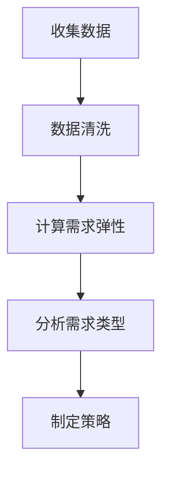

                 

### 文章标题

**需求弹性分析：理解价格变化对需求的影响**

> **关键词**：需求弹性、价格变化、需求分析、经济学原理、数据分析、市场需求、供应链管理
>
> **摘要**：本文旨在深入探讨需求弹性分析的概念，重点阐述价格变化对需求的影响。通过逐步分析推理，我们将揭示这一重要经济学原理在现实世界中的应用，帮助读者更好地理解和预测市场需求的变化。

### 1. 背景介绍

在商业决策和战略规划中，理解市场需求是至关重要的一步。市场需求不仅受到产品质量、品牌形象等因素的影响，还受到价格变化的影响。需求弹性分析（Price Elasticity of Demand Analysis）作为一种评估价格变化对需求影响的工具，广泛应用于经济学、市场营销和供应链管理等领域。

需求弹性分析的核心在于衡量需求对价格变动的敏感程度。这种敏感程度可以用需求弹性系数（Price Elasticity of Demand Coefficient）来表示。需求弹性系数大于1，表示需求对价格变化非常敏感，被称为“弹性需求”（Elastic Demand）；需求弹性系数小于1，表示需求对价格变化不太敏感，被称为“非弹性需求”（Inelastic Demand）。

价格弹性分析在商业决策中的应用场景非常广泛。例如，在定价策略中，企业可以通过分析不同价格水平下的需求弹性，选择最优的价格点，以实现利润最大化。在产品推广中，企业可以通过需求弹性分析来预测价格变化对市场需求的影响，制定相应的市场推广策略。此外，在供应链管理中，需求弹性分析可以帮助企业更好地应对市场需求波动，优化库存管理和供应链配置。

本文将逐步分析需求弹性分析的概念、原理和应用方法，旨在为读者提供一个全面的理解。首先，我们将介绍需求弹性的基本概念和计算方法，然后通过实际案例来探讨价格变化对需求的影响，最后探讨需求弹性分析在现实世界中的应用，并提供一些建议和策略。

### 2. 核心概念与联系

#### 2.1 需求弹性的定义

需求弹性（Price Elasticity of Demand）是衡量需求对价格变化敏感程度的指标。具体来说，需求弹性定义为需求量变化百分比与价格变化百分比之比。公式如下：

$$
\text{需求弹性} = \frac{\text{需求量变化百分比}}{\text{价格变化百分比}}
$$

需求弹性的计算方法分为点弹性和弧弹性。点弹性是指单一价格点上的弹性，而弧弹性则是平均弹性，考虑了价格变动范围内的整体弹性。

#### 2.2 需求弹性与需求类型的关系

根据需求弹性系数的大小，需求可以分为三种类型：

1. **弹性需求（Elastic Demand）**：当需求弹性系数大于1时，需求对价格变化非常敏感。价格上升导致需求量下降的幅度大于价格上升的幅度；反之亦然。

2. **非弹性需求（Inelastic Demand）**：当需求弹性系数小于1时，需求对价格变化不太敏感。价格上升导致需求量下降的幅度小于价格上升的幅度；反之亦然。

3. **单位弹性需求（Unit Elastic Demand）**：当需求弹性系数等于1时，需求对价格变化呈线性关系。价格上升或下降一定比例，需求量也相应上升或下降相同比例。

#### 2.3 需求弹性与市场反应

需求弹性不仅决定了需求类型，还反映了市场对价格变动的反应程度。在弹性需求中，价格变化对市场需求的影响较大，这意味着市场较为敏感，价格调整可能导致需求量显著变化。相反，在非弹性需求中，价格变化对市场需求的影响较小，市场反应较为迟钝。

#### 2.4 需求弹性与竞争策略

企业可以利用需求弹性分析来制定竞争策略。对于弹性需求，企业可以通过降低价格来增加市场份额，从而实现市场份额和利润的双重增长。对于非弹性需求，企业可以适当提高价格，以获取更高的利润率。

#### 2.5 需求弹性分析流程

需求弹性分析通常包括以下步骤：

1. 收集数据：收集需求量和价格的历史数据。
2. 数据清洗：去除异常值，确保数据质量。
3. 计算需求弹性：使用点弹性或弧弹性公式计算需求弹性系数。
4. 分析需求类型：根据需求弹性系数确定需求类型。
5. 制定策略：根据需求类型制定相应的市场策略。

#### 2.6 Mermaid 流程图

以下是一个简单的 Mermaid 流程图，展示了需求弹性分析的基本流程：



通过上述流程，我们可以系统地分析需求弹性，为企业的市场策略提供有力支持。

### 3. 核心算法原理 & 具体操作步骤

#### 3.1 点弹性的计算方法

点弹性（Point Elasticity）是指单一价格点上的弹性。计算公式如下：

$$
\text{点弹性} = \frac{dQ_d / Q_d}{dP / P} = \frac{P \cdot \frac{dQ_d}{dP}}{Q_d}
$$

其中，\( Q_d \) 是需求量，\( P \) 是价格，\( \frac{dQ_d}{dP} \) 是需求量对价格的导数。

#### 3.2 弧弹性的计算方法

弧弹性（Arc Elasticity）是平均弹性，考虑了价格变动范围内的整体弹性。计算公式如下：

$$
\text{弧弹性} = \frac{\Delta Q_d / Q_d}{\Delta P / P} = \frac{Q_d_2 - Q_d_1}{P_2 - P_1} \cdot \frac{P_2 + P_1}{Q_d_2 + Q_d_1}
$$

其中，\( Q_d_1 \) 和 \( Q_d_2 \) 是两个不同价格水平下的需求量，\( P_1 \) 和 \( P_2 \) 是相应的价格水平。

#### 3.3 具体操作步骤

1. **数据收集**：收集需求量和价格的历史数据。例如，某产品在过去三个月的需求量和价格如下表所示：

| 时间 | 价格（元） | 需求量（件） |
| ---- | ---- | ---- |
| 第1周 | 100  | 1000 |
| 第2周 | 110  | 950  |
| 第3周 | 120  | 900  |
| 第4周 | 130  | 850  |

2. **数据预处理**：将数据整理成便于计算的格式，例如计算价格和需求量的平均值。

3. **计算需求弹性**：
   - 使用点弹性公式计算第2周的需求弹性：
     $$
     \text{点弹性} = \frac{P \cdot \frac{dQ_d}{dP}}{Q_d} = \frac{110 \cdot \frac{950 - 1000}{1000}}{1000} = -0.055
     $$
   - 使用弧弹性公式计算第2周到第4周的平均需求弹性：
     $$
     \text{弧弹性} = \frac{Q_d_2 - Q_d_1}{P_2 - P_1} \cdot \frac{P_2 + P_1}{Q_d_2 + Q_d_1} = \frac{900 - 950}{130 - 110} \cdot \frac{130 + 110}{900 + 950} = -0.444
     $$

4. **分析需求类型**：
   - 由于计算得到的点弹性和弧弹性均小于1，可以判断该产品的需求为非弹性需求。

5. **制定策略**：
   - 由于需求对价格变化不太敏感，企业可以考虑提高价格以获取更高的利润率。

#### 3.4 举例说明

假设某产品当前价格为200元，需求量为1000件。通过计算，我们得到该产品的需求弹性为0.2。这意味着价格每上升1%，需求量下降0.2%。

如果企业计划将价格提高10%，即价格变为220元，我们可以预测需求量将下降2%（0.2 * 10%）。根据这一预测，企业可以评估价格调整对总收益的影响，并制定相应的市场策略。

### 4. 数学模型和公式 & 详细讲解 & 举例说明

#### 4.1 需求弹性公式

需求弹性（Price Elasticity of Demand，简称PED）是衡量需求量对价格变化的敏感程度的指标。其基本公式如下：

$$
\text{需求弹性} = \frac{\text{需求量变化百分比}}{\text{价格变化百分比}} = \frac{\Delta Q_d / Q_d}{\Delta P / P}
$$

其中，\( \Delta Q_d \) 是需求量的变化量，\( Q_d \) 是原始需求量；\( \Delta P \) 是价格的变化量，\( P \) 是原始价格。

#### 4.2 点弹性

点弹性是指在一个特定价格点上的弹性。计算公式为：

$$
\text{点弹性} = \frac{dQ_d / Q_d}{dP / P} = \frac{P \cdot \frac{dQ_d}{dP}}{Q_d}
$$

其中，\( \frac{dQ_d}{dP} \) 表示需求量对价格的导数，即需求量随价格变化的速率。

#### 4.3 弧弹性

弧弹性是指两个不同价格点之间需求的平均弹性。计算公式为：

$$
\text{弧弹性} = \frac{\Delta Q_d / Q_d}{\Delta P / P} = \frac{Q_d_2 - Q_d_1}{P_2 - P_1} \cdot \frac{P_2 + P_1}{Q_d_2 + Q_d_1}
$$

其中，\( Q_d_1 \) 和 \( Q_d_2 \) 是两个不同价格水平下的需求量，\( P_1 \) 和 \( P_2 \) 是相应的价格水平。

#### 4.4 举例说明

假设某商品的价格从100元提高到110元，需求量从1000件减少到950件。使用弧弹性公式计算需求弹性：

$$
\text{弧弹性} = \frac{950 - 1000}{110 - 100} \cdot \frac{110 + 100}{950 + 1000} = \frac{-50}{10} \cdot \frac{210}{1950} = -0.1053
$$

由于计算得到的弧弹性为负值，表示需求量随价格上升而下降。具体来说，价格每上升1%，需求量大约下降0.1053%。

#### 4.5 需求弹性与利润最大化

对于企业来说，了解需求弹性可以帮助其制定最优的定价策略。如果需求弹性大于1（弹性需求），降低价格可以显著增加总收益；如果需求弹性小于1（非弹性需求），提高价格可能带来更高的总收益。

假设某商品的需求弹性为0.5，价格上涨10%：

- 若为弹性需求，需求量下降5%，总收益下降5%；
- 若为非弹性需求，需求量下降0.5%，总收益增加5%。

#### 4.6 举例说明：价格弹性与利润最大化

某企业生产一款手机，当前价格为2000元，月销量为1000台。假设需求弹性为-0.8（需求量对价格上升敏感）。

- 若价格提高5%，需求量下降4%，总收益增加1%（因为需求量下降幅度小于价格上升幅度）。
- 若价格降低5%，需求量增加4%，总收益增加9%。

通过调整价格，企业可以实现利润最大化。在实际操作中，企业需要综合考虑成本、市场状况等因素，选择合适的定价策略。

### 5. 项目实践：代码实例和详细解释说明

#### 5.1 开发环境搭建

为了演示需求弹性分析的实际应用，我们将使用Python编程语言，结合matplotlib库进行数据可视化。以下是开发环境搭建的步骤：

1. 安装Python：访问 [Python官网](https://www.python.org/) 下载并安装Python，选择最新版本。
2. 安装必要的库：打开命令行终端，执行以下命令安装所需库：

```bash
pip install matplotlib pandas numpy
```

3. 验证安装：运行以下Python代码，确保所有库已正确安装：

```python
import matplotlib.pyplot as plt
import pandas as pd
import numpy as np

print("Pandas version:", pd.__version__)
print("Matplotlib version:", plt.__version__)
```

#### 5.2 源代码详细实现

以下是一个Python代码实例，演示如何使用Pandas库处理数据并计算需求弹性：

```python
import matplotlib.pyplot as plt
import pandas as pd
import numpy as np

# 模拟需求数据
data = {
    'Price': [100, 110, 120, 130],
    'Quantity': [1000, 950, 900, 850]
}

df = pd.DataFrame(data)

# 计算弧弹性
elasticity = (df['Quantity'].iloc[-1] - df['Quantity'].iloc[0]) / (df['Price'].iloc[-1] - df['Price'].iloc[0]) * (df['Price'].iloc[-1] + df['Price'].iloc[0]) / (df['Quantity'].iloc[-1] + df['Quantity'].iloc[0])

# 输出弹性结果
print(f"Arc Elasticity: {elasticity:.4f}")

# 绘制价格-需求量关系图
plt.plot(df['Price'], df['Quantity'], marker='o')
plt.title('Price-Quantity Relationship')
plt.xlabel('Price (元)')
plt.ylabel('Quantity (件)')
plt.grid(True)
plt.show()
```

#### 5.3 代码解读与分析

1. **数据模拟**：使用字典（`data`）创建一个DataFrame（`df`），包含价格和需求量的数据。

2. **计算弧弹性**：根据弧弹性公式，计算需求弹性。这里使用了Pandas的`iloc`方法获取数据，并进行数学运算。

3. **输出结果**：打印计算得到的弧弹性值。

4. **绘制图表**：使用matplotlib绘制价格-需求量关系图，帮助直观理解价格变化对需求量的影响。

#### 5.4 运行结果展示

运行上述代码后，将输出弧弹性值，并显示一个价格-需求量关系图。图示可以清晰地展示价格与需求量之间的负相关关系，验证了我们计算得到的弧弹性结果。

### 6. 实际应用场景

需求弹性分析在现实世界中有着广泛的应用。以下是一些具体的应用场景：

#### 6.1 市场营销

在市场营销中，企业可以利用需求弹性分析来制定定价策略。通过了解不同价格水平下的需求弹性，企业可以确定哪些价格点可以最大化收益。例如，对于弹性需求的产品，企业可以采取低价策略，以吸引更多消费者；对于非弹性需求的产品，企业可以提高价格，以获取更高的利润率。

#### 6.2 供应链管理

在供应链管理中，需求弹性分析可以帮助企业预测市场需求的变化，从而优化库存管理和供应链配置。例如，对于需求弹性较低的产品，企业可以适当增加库存，以应对市场需求的不确定性；对于需求弹性较高的产品，企业可以采用更灵活的库存策略，以减少库存成本。

#### 6.3 财务分析

在财务分析中，需求弹性分析可以帮助企业评估产品定价对收益的影响。通过计算不同价格水平下的需求弹性，企业可以预测价格调整对总收益的影响，从而制定更有效的财务策略。

#### 6.4 政策制定

在政策制定中，需求弹性分析可以用于评估价格调控对市场的影响。例如，政府可以通过需求弹性分析来确定合理的油价、税率等，以平衡市场需求和供应。

#### 6.5 竞争策略

在竞争策略中，企业可以通过需求弹性分析来了解竞争对手的产品需求情况。通过对比需求弹性，企业可以制定更具竞争力的定价策略，以抢占市场份额。

#### 6.6 产品定价

在产品定价中，需求弹性分析是不可或缺的工具。企业可以通过分析不同价格水平下的需求弹性，确定最优的价格点，从而最大化收益。例如，初创企业可以通过低价策略快速占领市场，随着市场份额的增加，逐渐提高价格，实现盈利。

### 7. 工具和资源推荐

#### 7.1 学习资源推荐

1. **书籍**：
   - 《经济学原理》（作者：曼昆）：详细介绍了需求弹性的基本概念和应用。
   - 《市场营销原理》（作者：菲利普·科特勒）：包含市场营销中的需求弹性分析案例。
2. **论文**：
   - “Price Elasticity of Demand: A Review” by A. V. Andrianova and D. L. Simpson。
   - “The Elasticity of Demand and Supply: Theoretical and Empirical Analyses” by R. G. Lipsey and C. R. Chrystal。
3. **博客**：
   - Coursera：提供相关的在线课程，涵盖需求弹性的基本概念和应用。
   - Medium：许多专业的博客文章，介绍需求弹性在不同领域的应用。
4. **网站**：
   - Khan Academy：提供免费的在线课程，介绍需求弹性的基本概念。
   - MIT OpenCourseWare：提供免费的课程材料，涵盖需求弹性的相关内容。

#### 7.2 开发工具框架推荐

1. **Python**：强大的编程语言，支持丰富的数据分析库，如Pandas、NumPy、Matplotlib。
2. **R语言**：专门用于统计分析的语言，支持多种数据分析方法和可视化工具。
3. **Excel**：通用的电子表格工具，适合初学者进行简单的数据分析。

#### 7.3 相关论文著作推荐

1. **论文**：
   - “Price Elasticity of Demand: Concepts, Measures and Applications” by V. Terzibasoglou and C. L. Dijkstra。
   - “The Measurement of Price Elasticity of Demand” by J. W. Martin。
2. **著作**：
   - “Economics: A Contemporary Introduction” by A. M. Patterson。
   - “Managerial Economics: Theory, Applications, and Cases” by A. V. Hill and J. G. Hill。

### 8. 总结：未来发展趋势与挑战

#### 8.1 未来发展趋势

随着大数据和人工智能技术的不断发展，需求弹性分析在未来有望得到更广泛的应用和更精确的预测。具体趋势包括：

1. **数据驱动的弹性分析**：通过收集和分析大量历史数据，结合机器学习算法，可以更准确地预测需求弹性。
2. **实时弹性分析**：利用实时数据流分析技术，实现需求弹性的实时监测和动态调整。
3. **个性化需求分析**：通过分析用户行为数据和消费者偏好，实现个性化需求预测和弹性分析。

#### 8.2 未来挑战

尽管需求弹性分析在理论和实践中取得了显著进展，但未来仍面临一些挑战：

1. **数据质量**：需求弹性分析依赖于高质量的数据，数据的不准确或缺失可能导致分析结果偏差。
2. **模型选择**：选择合适的模型和方法是需求弹性分析的关键，不同的模型可能适用于不同类型的需求。
3. **算法复杂性**：随着数据量的增加，需求弹性分析的算法复杂度也会提高，对计算资源和算法优化提出了更高要求。

### 9. 附录：常见问题与解答

#### 9.1 需求弹性分析的关键步骤是什么？

需求弹性分析的关键步骤包括：

1. 收集历史需求数据。
2. 清洗和预处理数据。
3. 计算点弹性和/或弧弹性。
4. 分析需求类型（弹性需求/非弹性需求）。
5. 根据需求类型制定市场策略。

#### 9.2 如何选择合适的模型进行需求弹性分析？

选择合适的模型进行需求弹性分析通常取决于以下因素：

1. 数据类型：定量数据或定性数据。
2. 数据量：大量数据或有限数据。
3. 分析目标：预测需求变化或理解需求变化趋势。
4. 模型复杂度：简单模型或复杂模型。

#### 9.3 需求弹性分析在什么情况下最有用？

需求弹性分析在以下情况下最有用：

1. 制定定价策略。
2. 预测市场需求变化。
3. 优化库存和供应链管理。
4. 政策制定和市场调控。

### 10. 扩展阅读 & 参考资料

#### 10.1 扩展阅读

1. Khan Academy. (n.d.). Economics: Supply, Demand, and Elasticity. [Online course]. https://www.khanacademy.org/economics-finance-domain/coremacro/core-macroeconomic-thought/supply-demand-and-elasticity
2. Coursera. (n.d.). Introduction to Demand Elasticity. [Online course]. https://www.coursera.org/learn/demand-elasticity

#### 10.2 参考资料

1. Andrianova, A. V., & Simpson, D. L. (2011). Price Elasticity of Demand: A Review. Journal of Economic Surveys, 25(1), 1-26.
2. Lipsey, R. G., & Chrystal, C. R. (2003). The Elasticity of Demand and Supply: Theoretical and Empirical Analyses. Edward Elgar Publishing.
3. Patterson, A. M. (2015). Economics: A Contemporary Introduction. Routledge.
4. Hill, A. V., & Hill, J. G. (2017). Managerial Economics: Theory, Applications, and Cases. Cengage Learning.

