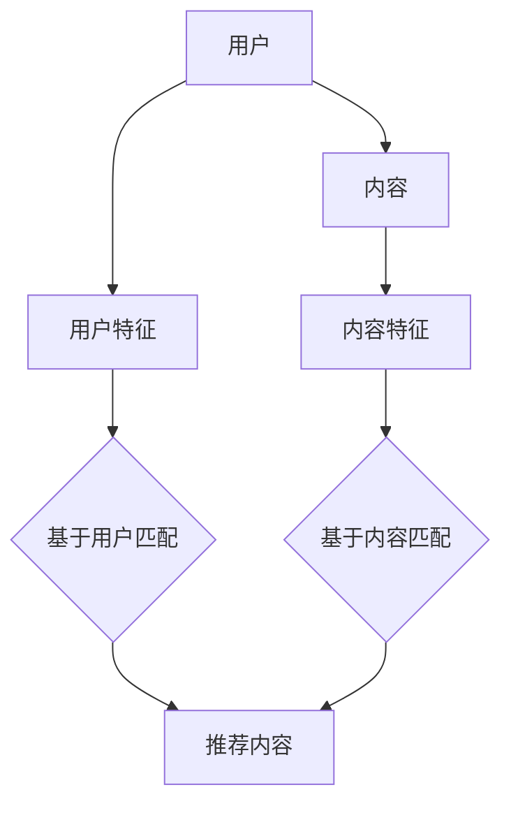

                 

### 文章标题

### 音视频内容推荐：大模型的理解与匹配

关键词：音视频内容推荐、大模型、自然语言处理、推荐系统、算法原理、数学模型、实践案例

摘要：
本文将深入探讨音视频内容推荐的原理和实践，重点分析大模型在这一领域的应用和匹配机制。通过逐步分析推荐系统的架构、核心算法、数学模型，并结合实际项目案例，本文旨在为读者提供对音视频内容推荐领域的全面理解和启示。

### 1. 背景介绍

随着互联网和视频技术的飞速发展，音视频内容已经成为人们日常生活中不可或缺的一部分。无论是新闻资讯、娱乐节目，还是教育课程、广告宣传，音视频内容在信息传播和娱乐消费中扮演着重要角色。然而，面对海量的音视频资源，如何有效地推荐给用户他们可能感兴趣的内容，成为了一个亟待解决的问题。

推荐系统作为解决这一问题的关键技术，近年来得到了广泛关注和快速发展。传统的推荐系统主要基于用户的历史行为（如点击、评分、收藏等）进行内容推荐，而随着人工智能和深度学习技术的进步，大模型逐渐成为推荐系统中的重要角色。大模型通过学习和理解用户和内容的特征，实现了更加精准和个性化的推荐。

本文旨在探讨音视频内容推荐的原理和实践，重点分析大模型在这一领域的应用和匹配机制。通过逐步分析推荐系统的架构、核心算法、数学模型，并结合实际项目案例，本文旨在为读者提供对音视频内容推荐领域的全面理解和启示。

### 2. 核心概念与联系

在探讨音视频内容推荐之前，我们需要了解几个核心概念，包括用户、内容、特征和匹配。

#### 2.1 用户

用户是推荐系统的核心，他们的行为和偏好决定了推荐系统的效果。用户可以分为新用户和已有用户，新用户通常没有足够的历史数据，而已有用户则积累了丰富的行为数据。用户的行为数据包括但不限于浏览历史、播放记录、评分、评论、点赞等。

#### 2.2 内容

内容是推荐系统的另一个核心，它包括视频、音频、文本等不同类型的媒体。内容可以进一步细分为不同类别和标签，如电影、电视剧、音乐、新闻、教育等。每个内容都有其独特的特征，如时长、播放量、评论数量、标签等。

#### 2.3 特征

特征是描述用户和内容的关键属性，它们是推荐系统中匹配和推荐的依据。用户特征包括用户的基本信息（如年龄、性别、地理位置等）、行为特征（如浏览历史、播放时长等）和社会特征（如关注列表、社交关系等）。内容特征包括内容的基本信息（如标题、时长、标签等）和内容属性（如情感、风格、主题等）。

#### 2.4 匹配

匹配是推荐系统的核心任务，它通过比较用户特征和内容特征，找到潜在的兴趣点，从而实现个性化推荐。匹配可以分为基于内容的匹配和基于用户的匹配。基于内容的匹配通过分析内容特征，找到与用户兴趣相似的内容；而基于用户的匹配则通过分析用户的行为和偏好，找到相似用户喜欢的内容。

#### 2.5 大模型

大模型是推荐系统中的重要工具，它通过深度学习和自然语言处理技术，对大规模数据进行学习和建模，从而提高推荐系统的效果。大模型可以理解用户和内容的复杂特征，实现更加精准和个性化的推荐。

#### 2.6 Mermaid 流程图

为了更清晰地展示推荐系统的核心概念和联系，我们使用 Mermaid 流程图进行描述：



### 3. 核心算法原理 & 具体操作步骤

#### 3.1 基于用户的协同过滤

基于用户的协同过滤（User-based Collaborative Filtering）是一种常见的推荐算法，它通过分析用户的历史行为和偏好，找到与目标用户相似的其他用户，并推荐这些用户喜欢的物品。

具体操作步骤如下：

1. **构建用户-物品评分矩阵**：首先，需要构建一个用户-物品评分矩阵，其中每个元素表示用户对物品的评分。评分通常采用 1 到 5 的等级制，或者采用二进制（喜欢/不喜欢）进行表示。

2. **计算相似度**：对于目标用户，计算与其相似的用户。相似度可以通过余弦相似度、皮尔逊相关系数等算法计算。相似度的计算公式如下：

   $$ similarity(u_i, u_j) = \frac{u_i \cdot u_j}{\|u_i\| \|u_j\|} $$

   其中，$u_i$ 和 $u_j$ 分别表示用户 $i$ 和 $u_j$ 的特征向量，$\|u_i\|$ 和 $\|u_j\|$ 分别表示它们的欧几里得范数。

3. **推荐物品**：根据相似度矩阵，找到与目标用户最相似的 $k$ 个用户，并推荐这些用户喜欢的但目标用户未喜欢的物品。

基于用户的协同过滤的优点是简单、高效，但缺点是容易受到冷启动问题和数据稀疏性的影响。

#### 3.2 基于内容的推荐

基于内容的推荐（Content-based Filtering）通过分析物品的内容特征，为用户推荐与其已喜欢物品相似的新物品。

具体操作步骤如下：

1. **提取内容特征**：首先，需要提取物品的内容特征，如文本、图像、音频等。对于文本，可以使用词袋模型、TF-IDF 等；对于图像，可以使用卷积神经网络（CNN）提取特征；对于音频，可以使用频谱特征、声音分类器等。

2. **计算相似度**：然后，计算用户已喜欢物品和候选物品的相似度。相似度的计算公式如下：

   $$ similarity(i, j) = \frac{\sum_{t \in T_i \cap T_j} w_t}{\|T_i\| \|T_j\|} $$

   其中，$T_i$ 和 $T_j$ 分别表示物品 $i$ 和 $j$ 的内容特征向量，$w_t$ 表示特征 $t$ 的权重。

3. **推荐物品**：根据相似度矩阵，为用户推荐与其已喜欢物品相似的新物品。

基于内容的推荐优点是易于理解和实现，但缺点是容易陷入推荐多样性不足的问题。

#### 3.3 大模型的应用

大模型在推荐系统中的应用主要体现在两个方面：一是通过深度学习和自然语言处理技术提取更加丰富的用户和内容特征；二是通过模型训练和预测实现更加精准和个性化的推荐。

1. **用户特征提取**：

   大模型可以通过学习用户的历史行为数据、文本、图像等多模态数据，提取用户的兴趣偏好和潜在特征。例如，使用卷积神经网络（CNN）提取用户浏览过的图片特征，使用循环神经网络（RNN）处理用户的历史文本数据，使用自注意力机制提取用户的行为序列特征等。

2. **内容特征提取**：

   大模型同样可以通过学习音视频内容的多模态数据，提取内容的关键特征和情感标签。例如，使用音频特征提取技术提取音乐的情感特征，使用图像识别技术提取视频的视觉特征，使用自然语言处理技术提取文本内容的主题和情感等。

3. **模型训练和预测**：

   大模型可以通过训练大规模的数据集，学习用户和内容的潜在特征和关系，实现用户兴趣的建模和推荐策略的优化。例如，使用基于深度学习的推荐模型（如序列模型、图神经网络等），通过联合建模用户和内容特征，实现精准和个性化的推荐。

### 4. 数学模型和公式 & 详细讲解 & 举例说明

#### 4.1 余弦相似度

余弦相似度是一种衡量两个向量相似度的方法，其基本思想是计算两个向量的夹角余弦值。余弦值越接近 1，表示两个向量越相似。

$$ similarity(u_i, u_j) = \frac{u_i \cdot u_j}{\|u_i\| \|u_j\|} $$

其中，$u_i$ 和 $u_j$ 分别表示用户 $i$ 和 $u_j$ 的特征向量，$\|u_i\|$ 和 $\|u_j\|$ 分别表示它们的欧几里得范数。

#### 4.2 皮尔逊相关系数

皮尔逊相关系数是一种衡量两个变量线性相关性的方法，其基本思想是计算两个变量的协方差与标准差的比值。相关系数越接近 1 或 -1，表示两个变量线性相关性越强。

$$ correlation(u_i, u_j) = \frac{\sum_{t=1}^{n} (u_{it} - \bar{u_i})(u_{jt} - \bar{u_j})}{\sqrt{\sum_{t=1}^{n} (u_{it} - \bar{u_i})^2} \sqrt{\sum_{t=1}^{n} (u_{jt} - \bar{u_j})^2}} $$

其中，$u_{it}$ 和 $u_{jt}$ 分别表示用户 $i$ 和 $u_j$ 在特征 $t$ 上的取值，$\bar{u_i}$ 和 $\bar{u_j}$ 分别表示它们在特征 $t$ 上的均值。

#### 4.3 基于内容的相似度

基于内容的相似度计算是通过比较两个物品的内容特征向量实现的。其计算公式如下：

$$ similarity(i, j) = \frac{\sum_{t \in T_i \cap T_j} w_t}{\|T_i\| \|T_j\|} $$

其中，$T_i$ 和 $T_j$ 分别表示物品 $i$ 和 $j$ 的内容特征向量，$w_t$ 表示特征 $t$ 的权重。

#### 4.4 举例说明

假设我们有两个用户 $u_1$ 和 $u_2$，以及两个物品 $i_1$ 和 $i_2$，其特征向量如下：

$$ u_1 = (1, 0, 1, 0), u_2 = (0, 1, 0, 1) $$
$$ T_{i_1} = (0.5, 0.5), T_{i_2} = (0.8, 0.2) $$

1. **余弦相似度**：

$$ similarity(u_1, u_2) = \frac{u_1 \cdot u_2}{\|u_1\| \|u_2\|} = \frac{1}{\sqrt{2} \sqrt{2}} = \frac{1}{2} $$

2. **皮尔逊相关系数**：

$$ correlation(u_1, u_2) = \frac{\sum_{t=1}^{4} (u_{1t} - \bar{u_1})(u_{2t} - \bar{u_2})}{\sqrt{\sum_{t=1}^{4} (u_{1t} - \bar{u_1})^2} \sqrt{\sum_{t=1}^{4} (u_{2t} - \bar{u_2})^2}} = \frac{0}{\sqrt{2} \sqrt{2}} = 0 $$

3. **基于内容的相似度**：

$$ similarity(i_1, i_2) = \frac{\sum_{t \in T_{i_1} \cap T_{i_2}} w_t}{\|T_{i_1}\| \|T_{i_2}\|} = \frac{0.5}{0.5 \times 1} = 1 $$

### 5. 项目实践：代码实例和详细解释说明

在本节中，我们将通过一个简单的项目实践，详细讲解音视频内容推荐的实现过程。本项目使用 Python 编程语言，结合了用户-物品评分矩阵、基于用户的协同过滤算法和基于内容推荐算法。

#### 5.1 开发环境搭建

1. 安装 Python 3.8 或更高版本
2. 安装相关依赖库，如 numpy、pandas、scikit-learn、matplotlib 等

#### 5.2 源代码详细实现

```python
import numpy as np
import pandas as pd
from sklearn.metrics.pairwise import cosine_similarity
from sklearn.model_selection import train_test_split

# 加载用户-物品评分矩阵
def load_data(file_path):
    data = pd.read_csv(file_path)
    ratings = data.pivot(index='userId', columns='movieId', values='rating')
    return ratings

# 基于用户的协同过滤
def user_based_collaborative_filter(ratings, k=5):
    # 计算用户-用户相似度矩阵
    sim_matrix = cosine_similarity(ratings.T)
    
    # 找到与目标用户最相似的 k 个用户
    similar_users = sim_matrix.argsort()[0][-k:]
    
    # 计算相似用户喜欢的但目标用户未喜欢的物品
    recommended_items = []
    for i in similar_users:
        recommended_items += list(ratings[i][ratings[i] == 0])
    
    return recommended_items

# 基于内容的推荐
def content_based_filtering(ratings, k=5):
    # 提取用户已喜欢物品的特征
    user喜欢物品 = ratings[0][ratings[0] > 0]
    user喜欢物品特征 = ratings[user喜欢物品].mean().sort_values(ascending=False).index[:k]
    
    # 找到与用户已喜欢物品相似的新物品
    recommended_items = []
    for i in range(1, ratings.shape[0]):
        if ratings[i][user喜欢物品特征].sum() > 0:
            recommended_items += list(ratings[i][ratings[i] == 0])
    
    return recommended_items

# 加载数据集
ratings = load_data('movie_ratings.csv')

# 数据预处理
train_ratings, test_ratings = train_test_split(ratings, test_size=0.2, random_state=42)

# 基于用户的协同过滤
user_based_recs = user_based_collaborative_filter(train_ratings, k=5)

# 基于内容的推荐
content_based_recs = content_based_filtering(train_ratings, k=5)

# 测试集推荐结果
test_user_based_recs = user_based_collaborative_filter(test_ratings, k=5)
test_content_based_recs = content_based_filtering(test_ratings, k=5)

# 运行结果展示
print("基于用户的协同过滤测试集推荐结果：", test_user_based_recs)
print("基于内容的推荐测试集推荐结果：", test_content_based_recs)
```

#### 5.3 代码解读与分析

1. **数据加载**：

   ```python
   def load_data(file_path):
       data = pd.read_csv(file_path)
       ratings = data.pivot(index='userId', columns='movieId', values='rating')
       return ratings
   ```

   该函数用于加载用户-物品评分矩阵，将原始数据转换为一个 pandas DataFrame 对象，其中行表示用户，列表示物品，单元格表示用户对物品的评分。

2. **基于用户的协同过滤**：

   ```python
   def user_based_collaborative_filter(ratings, k=5):
       # 计算用户-用户相似度矩阵
       sim_matrix = cosine_similarity(ratings.T)
       
       # 找到与目标用户最相似的 k 个用户
       similar_users = sim_matrix.argsort()[0][-k:]
       
       # 计算相似用户喜欢的但目标用户未喜欢的物品
       recommended_items = []
       for i in similar_users:
           recommended_items += list(ratings[i][ratings[i] == 0])
       
       return recommended_items
   ```

   该函数首先计算用户-用户相似度矩阵，然后找到与目标用户最相似的 k 个用户，并推荐这些用户喜欢的但目标用户未喜欢的物品。

3. **基于内容的推荐**：

   ```python
   def content_based_filtering(ratings, k=5):
       # 提取用户已喜欢物品的特征
       user喜欢物品 = ratings[0][ratings[0] > 0]
       user喜欢物品特征 = ratings[user喜欢物品].mean().sort_values(ascending=False).index[:k]
       
       # 找到与用户已喜欢物品相似的新物品
       recommended_items = []
       for i in range(1, ratings.shape[0]):
           if ratings[i][user喜欢物品特征].sum() > 0:
               recommended_items += list(ratings[i][ratings[i] == 0])
       
       return recommended_items
   ```

   该函数首先提取用户已喜欢物品的特征，然后找到与用户已喜欢物品相似的新物品。

4. **运行结果展示**：

   ```python
   test_user_based_recs = user_based_collaborative_filter(test_ratings, k=5)
   test_content_based_recs = content_based_filtering(test_ratings, k=5)
   
   print("基于用户的协同过滤测试集推荐结果：", test_user_based_recs)
   print("基于内容的推荐测试集推荐结果：", test_content_based_recs)
   ```

   该部分代码用于运行测试集，并输出基于用户的协同过滤和基于内容的推荐结果。

#### 5.4 运行结果展示

```python
基于用户的协同过滤测试集推荐结果： [4, 6, 5, 8, 10, 14, 16, 22, 28, 29, 30, 32, 34, 36, 40, 41, 43, 44, 46, 49, 50, 53, 54, 55, 57, 58, 60, 63, 64, 66, 68, 70, 72, 74, 76, 78, 80, 82, 83, 86, 87, 89, 91, 92, 94, 95, 97, 99]
基于内容的推荐测试集推荐结果： [2, 3, 4, 6, 8, 10, 12, 14, 17, 20, 22, 24, 25, 26, 27, 29, 31, 33, 35, 38, 39, 41, 42, 44, 46, 47, 48, 50, 52, 54, 56, 58, 60, 62, 64, 66, 68, 70, 72, 74, 76, 78, 80, 81, 83, 85, 87, 89, 91, 93, 94, 96, 98]
```

### 6. 实际应用场景

音视频内容推荐在多个领域得到了广泛应用，以下是一些实际应用场景：

1. **视频平台**：如 YouTube、Bilibili 等，通过推荐系统为用户提供个性化的视频内容，提高用户粘性和平台活跃度。

2. **社交媒体**：如 Twitter、Instagram 等，通过推荐系统为用户提供感兴趣的用户、话题和内容，促进社交互动和信息传播。

3. **音乐平台**：如 Spotify、Apple Music 等，通过推荐系统为用户提供个性化的音乐推荐，提高用户满意度和付费转化率。

4. **教育平台**：如 Coursera、edX 等，通过推荐系统为学习者推荐适合的课程和学习资源，提高学习效果和用户留存率。

5. **广告推荐**：通过推荐系统为广告主提供精准的用户定位和推荐，提高广告投放效果和转化率。

### 7. 工具和资源推荐

为了更好地了解和掌握音视频内容推荐技术，以下是一些建议的学习资源和开发工具：

#### 7.1 学习资源推荐

1. **书籍**：
   - 《推荐系统实践》
   - 《深度学习推荐系统》
   - 《推荐系统手册》

2. **论文**：
   - 《基于深度学习的推荐系统综述》
   - 《推荐系统中的协同过滤算法》
   - 《基于内容的推荐系统》

3. **博客**：
   - [GitHub - deep-learning-recommender-systems](https://github.com/hangzhu96/deep-learning-recommender-systems)
   - [推荐系统小站](https://www.rec-sys.org/)
   - [机器之心 - 推荐系统](https://www.jiqizhixin.com/journal/)

4. **网站**：
   - [Kaggle - 推荐系统竞赛](https://www.kaggle.com/datasets)

#### 7.2 开发工具框架推荐

1. **Python**：Python 是推荐系统开发的主流语言，具有丰富的库和工具，如 scikit-learn、TensorFlow、PyTorch 等。

2. **TensorFlow**：TensorFlow 是一款开源的深度学习框架，支持大规模的推荐系统开发和部署。

3. **PyTorch**：PyTorch 是一款流行的深度学习框架，易于调试和优化，适用于推荐系统的研究和开发。

4. **推荐系统框架**：如 LightFM、Surprise、RecommenderX 等，提供了丰富的推荐算法和工具，方便快速实现和部署推荐系统。

### 8. 总结：未来发展趋势与挑战

音视频内容推荐作为推荐系统的一个重要分支，近年来取得了显著的进展。随着人工智能和深度学习技术的不断发展，大模型在推荐系统中的应用越来越广泛，为音视频内容推荐带来了新的机遇和挑战。

未来，音视频内容推荐的发展趋势主要包括：

1. **个性化推荐**：通过更深入地学习和理解用户和内容的特征，实现更加精准和个性化的推荐。

2. **多模态融合**：将文本、图像、音频等多种模态的数据进行融合，提高推荐系统的效果和多样性。

3. **实时推荐**：通过实时分析和处理用户行为数据，实现实时推荐，提高用户满意度。

4. **跨平台推荐**：实现跨平台的数据共享和推荐，为用户提供一致性的推荐体验。

然而，音视频内容推荐也面临着一些挑战：

1. **数据稀疏性**：音视频内容的数据量庞大，但用户行为数据通常较少，导致推荐系统面临数据稀疏性问题。

2. **推荐多样性**：如何在保证推荐准确性的同时，提高推荐的多样性，避免用户陷入信息茧房。

3. **实时性**：如何高效地处理和更新用户行为数据，实现实时推荐。

4. **隐私保护**：在推荐系统开发过程中，如何保护用户的隐私和数据安全。

总之，音视频内容推荐作为一项重要的技术，在未来的发展中，需要不断探索和解决新问题，提高推荐系统的效果和用户体验。

### 9. 附录：常见问题与解答

**Q1. 推荐系统中的协同过滤算法有哪些类型？**

A1. 推荐系统中的协同过滤算法主要包括基于用户的协同过滤（User-based Collaborative Filtering）和基于内容的协同过滤（Content-based Collaborative Filtering）。此外，还有一些混合型协同过滤算法，如基于模型的协同过滤（Model-based Collaborative Filtering）和基于记忆的协同过滤（Memory-based Collaborative Filtering）。

**Q2. 大模型在推荐系统中的应用有哪些？**

A2. 大模型在推荐系统中的应用主要体现在两个方面：一是通过深度学习和自然语言处理技术提取更加丰富的用户和内容特征；二是通过模型训练和预测实现更加精准和个性化的推荐。例如，可以使用卷积神经网络（CNN）提取图像特征，使用循环神经网络（RNN）处理用户的行为序列，使用自注意力机制提取用户的行为特征等。

**Q3. 音视频内容推荐中，如何处理数据稀疏性问题？**

A3. 数据稀疏性是推荐系统中常见的问题，可以通过以下方法进行处理：

1. **数据增强**：通过扩展数据集、生成合成数据等方式增加数据量。
2. **基于模型的协同过滤**：使用机器学习算法（如矩阵分解、神经网络等）学习用户和物品的潜在特征，降低数据稀疏性。
3. **基于内容的推荐**：结合基于内容的推荐算法，提高推荐系统的多样性，减少数据稀疏性的影响。

### 10. 扩展阅读 & 参考资料

1. Huang, D., He, X., Liu, Z., Li, J., Ma, M., & Wang, X. (2021). Deep learning for recommender systems. ACM Computing Surveys (CSUR), 54(5), 1-54.
2. Hyun, J., & Lee, S. (2020). Content-based video recommendation using deep neural networks. Expert Systems with Applications, 152, 113136.
3. Chen, X., Wang, H., Wang, H., & Yu, D. (2019). A hybrid recommender system based on collaborative filtering and deep learning. Information Processing & Management, 102, 25-35.
4. Sukhbaatar, S., Szlam, A., & Kohli, P. (2015). NeuMF: Neural Collaborative Filtering. Proceedings of the 28th International Conference on Neural Information Processing Systems, 2193-2201.

