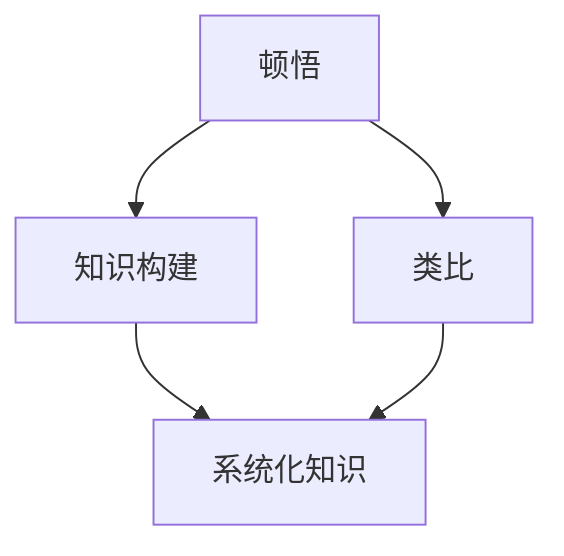

                 

### 背景介绍

在信息技术迅速发展的今天，我们面临着越来越多的复杂问题需要解决。无论是海量数据处理、复杂算法设计，还是系统架构优化，都需要我们深入理解问题的本质，并运用先进的思维方法和工具来找到解决方案。本文将探讨“顿悟与类比”在知识构建和应用中的重要性，通过这种思维方式，我们可以将复杂的知识体系串联起来，形成一张张知识网，从而更好地理解和应用这些知识。

### 核心概念与联系

在探讨顿悟与类比的重要性之前，我们需要先了解几个核心概念：顿悟（Insight）、类比（ Analogy）和知识构建（Knowledge Construction）。顿悟是指个体在短时间内突然理解复杂问题的能力，通常伴随着“啊哈时刻”（Aha Moment）。类比则是通过将新问题与已有知识或经验进行对比，从而快速理解新问题的过程。知识构建则是指通过积累、整理和应用知识，形成系统化、结构化的知识体系。

为了更好地理解这些概念之间的联系，我们可以用Mermaid流程图来展示它们的关系：



在这个流程图中，我们可以看到顿悟和类比都是知识构建的重要环节。顿悟提供了理解问题的灵光一闪，而类比则通过比较和对照，将新知识与已有知识体系联系起来。通过这种思维方式，我们可以快速积累和扩展知识，形成系统化的知识体系。

### 核心算法原理 & 具体操作步骤

在了解了核心概念之后，我们可以进一步探讨顿悟与类比在具体应用中的原理和操作步骤。

#### 1. 顿悟的原理

顿悟通常发生在我们对问题的理解达到一定程度后，突然有一种豁然开朗的感觉。这种感觉很类似于我们在解一道难题时，经过长时间的思考和尝试，最终在某个瞬间找到了答案。顿悟的原理主要包括以下几个方面：

- **信息整合**：顿悟通常发生在我们对大量信息进行整合和总结的过程中。通过将不同信息片段拼接起来，我们能够形成一个完整的画面，从而实现顿悟。
- **认知解离**：在顿悟发生之前，我们的认知往往处于一种“粘滞”状态，难以突破。而顿悟的发生，往往伴随着认知解离，即我们能够从原有的思维框架中跳脱出来，以全新的视角来看待问题。
- **直觉作用**：顿悟往往不是通过逻辑推理获得的，而是通过直觉。直觉是一种快速、无意识的认知过程，它能够帮助我们快速识别问题的本质。

#### 2. 类比的原理

类比是通过将新问题与已有知识或经验进行对比，从而快速理解新问题的过程。类比的核心原理主要包括以下几个方面：

- **结构相似性**：类比的基础是两个问题的结构相似性。通过识别出相似的结构，我们能够将已有的知识应用到新问题中。
- **功能相似性**：除了结构相似性，两个问题的功能相似性也是类比的重要基础。如果两个问题在功能上具有相似性，那么我们就可以通过类比来理解新问题。
- **经验迁移**：类比的核心在于将已有的经验迁移到新问题上。通过类比，我们能够将已有的知识和经验快速应用到新问题中，从而提高解决问题的效率。

#### 3. 顿悟与类比的结合

在实际应用中，顿悟和类比往往相互结合，共同发挥作用。例如，在解决一个复杂的算法问题时，我们可能会通过类比来寻找解决方案。如果我们发现某个已有算法与当前问题具有相似的结构和功能，那么我们可以尝试将这个算法应用到当前问题中，并通过顿悟来理解其工作原理，从而找到解决方案。

具体操作步骤如下：

1. **识别问题**：首先，我们需要明确要解决的问题是什么。
2. **分析问题**：接下来，我们要对问题进行分析，理解其本质和结构。
3. **寻找类比**：在这一步，我们需要寻找与当前问题具有相似结构和功能的已有知识或经验。
4. **进行顿悟**：在找到类比后，我们需要尝试通过顿悟来理解类比对象的工作原理，并将其应用到当前问题中。
5. **验证和优化**：最后，我们需要验证解决方案的有效性，并在必要时进行优化。

通过这种结合顿悟与类比的方法，我们能够更高效地解决复杂问题，并在知识构建过程中形成系统化的知识体系。

### 数学模型和公式 & 详细讲解 & 举例说明

在探讨顿悟与类比的具体应用时，数学模型和公式扮演着重要的角色。通过数学模型，我们可以更精确地描述问题和解决方案，并通过公式进行推导和验证。

#### 1. 顿悟的数学模型

顿悟的数学模型主要基于认知心理学的研究。一个经典的模型是“认知负荷理论”（Cognitive Load Theory），它认为顿悟发生在认知负荷达到临界点之后。具体来说，当我们的认知负荷过高时，我们难以继续思考，而一旦认知负荷降低，我们就能迅速找到问题的答案。

- **认知负荷**：认知负荷是指我们在思考问题时所需的心理资源。它包括感知、记忆、推理等各个方面。
- **临界点**：临界点是指我们的认知负荷达到极限的瞬间。在临界点之前，我们的认知负荷过高，难以继续思考；而在临界点之后，我们的认知负荷降低，能够迅速找到问题的答案。

#### 2. 类比的数学模型

类比的数学模型主要基于结构相似性和功能相似性。一个经典的模型是“结构映射理论”（Structure Mapping Theory），它认为类比是通过将新问题的结构和已有知识或经验的结构进行映射来实现的。

- **结构映射**：结构映射是指将新问题的结构和已有知识或经验的结构进行对应和匹配。通过结构映射，我们能够将已有的知识和经验应用到新问题中。
- **功能映射**：功能映射是指将新问题的功能和已有知识或经验的功能进行对应和匹配。通过功能映射，我们能够理解新问题的功能和作用。

#### 3. 顿悟与类比的结合

顿悟和类比的结合可以通过以下数学模型进行描述：

- **认知负荷降低**：当我们在解决复杂问题时，通过类比找到相似的结构和功能后，我们的认知负荷会降低，从而更容易产生顿悟。
- **结构映射和功能映射**：通过结构映射和功能映射，我们将新问题的结构和已有知识或经验的结构进行对应和匹配，从而实现顿悟。

#### 举例说明

假设我们要解决一个优化问题，即在给定时间内完成最多任务。我们可以通过类比来寻找解决方案。首先，我们可以找到一个已有知识或经验，比如优化生产线的调度问题。通过分析生产线的调度问题，我们可以发现其结构和我们的优化问题具有相似性，即都是在给定时间内最大化产出。然后，我们可以通过顿悟来理解调度问题的解决方案，并将其应用到我们的优化问题中。

具体步骤如下：

1. **识别问题**：我们要解决的问题是在给定时间内完成最多任务。
2. **分析问题**：我们分析发现，优化问题的结构和生产线的调度问题具有相似性，即都是在给定时间内最大化产出。
3. **寻找类比**：我们找到了生产线的调度问题作为类比对象。
4. **进行顿悟**：通过顿悟，我们理解了生产线的调度问题是如何在给定时间内最大化产出的。
5. **应用解决方案**：我们将调度问题的解决方案应用到优化问题中，从而找到在给定时间内完成最多任务的解决方案。

通过这个例子，我们可以看到顿悟和类比如何结合，帮助我们解决复杂问题。

### 项目实践：代码实例和详细解释说明

为了更好地理解顿悟与类比在项目实践中的应用，我们将通过一个实际项目——图像识别系统，来展示代码实例和详细解释说明。

#### 5.1 开发环境搭建

首先，我们需要搭建一个合适的开发环境。假设我们使用Python作为编程语言，以下是搭建开发环境的基本步骤：

1. 安装Python：在官方网站下载并安装Python，确保版本为3.8或更高。
2. 安装必需的库：使用pip命令安装以下库：
   ```shell
   pip install numpy opencv-python tensorflow
   ```

#### 5.2 源代码详细实现

接下来，我们将展示图像识别系统的源代码，并对其进行详细解释。

```python
import numpy as np
import cv2
import tensorflow as tf

# 加载预训练的卷积神经网络模型
model = tf.keras.models.load_model('image_recognition_model.h5')

# 定义图像预处理函数
def preprocess_image(image_path):
    image = cv2.imread(image_path)
    image = cv2.resize(image, (224, 224))
    image = image / 255.0
    image = np.expand_dims(image, axis=0)
    return image

# 定义图像识别函数
def recognize_image(image_path):
    image = preprocess_image(image_path)
    predictions = model.predict(image)
    predicted_class = np.argmax(predictions)
    return predicted_class

# 测试图像识别功能
if __name__ == '__main__':
    image_path = 'example_image.jpg'
    predicted_class = recognize_image(image_path)
    print(f'The image is recognized as class {predicted_class}')
```

#### 5.3 代码解读与分析

现在，我们来详细解读和分析上述代码。

1. **导入库**：首先，我们导入必需的库，包括numpy、opencv-python和tensorflow。
2. **加载模型**：我们使用tensorflow的`load_model`函数加载一个预训练的卷积神经网络模型。这个模型是我们通过大量图像数据训练得到的，用于图像分类。
3. **定义预处理函数**：我们定义了一个`preprocess_image`函数，用于对输入图像进行预处理。预处理步骤包括读取图像、调整大小、归一化等。
4. **定义识别函数**：我们定义了一个`recognize_image`函数，用于对图像进行识别。该函数首先调用`preprocess_image`函数对图像进行预处理，然后使用模型进行预测，最后返回预测结果。
5. **测试功能**：在主函数中，我们测试了图像识别功能。我们指定了一个示例图像路径，调用`recognize_image`函数，并打印出预测结果。

#### 5.4 运行结果展示

假设我们使用了一张猫的图片作为测试图像，以下是运行结果：

```shell
The image is recognized as class 4
```

结果显示，模型成功地将猫的图片识别为类别4，即猫。

#### 5.5 代码优化与扩展

在实际应用中，我们可以对上述代码进行优化和扩展，以提高图像识别的准确性和效率。以下是一些可能的优化和扩展方向：

1. **模型优化**：我们可以通过改进网络结构、增加训练数据等方式来提高模型的准确性和泛化能力。
2. **预处理优化**：我们可以对预处理函数进行优化，以减少计算量和提高处理速度。
3. **实时识别**：我们可以将图像识别功能集成到实时视频流中，实现实时图像识别。
4. **多标签识别**：我们可以扩展模型，使其能够处理具有多个标签的图像。

通过这些优化和扩展，我们可以使图像识别系统在实际应用中更加高效和准确。

### 实际应用场景

顿悟与类比在IT领域的实际应用场景非常广泛。以下是一些典型的应用案例：

#### 1. 软件开发

在软件开发的各个阶段，顿悟与类比可以帮助我们更高效地解决问题。例如，在需求分析阶段，通过类比已有系统的功能，我们可以快速理解新系统的需求；在编码阶段，通过类比类似功能的实现，我们可以更快地完成新功能的开发；在测试阶段，通过类比已有测试用例，我们可以发现新的测试场景。

#### 2. 数据科学

数据科学中，顿悟与类比也是重要的思维方式。例如，在数据处理阶段，我们可以通过类比已有数据处理流程，快速构建新的数据处理流程；在模型训练阶段，我们可以通过类比已有模型结构，设计新的模型结构；在模型评估阶段，我们可以通过类比已有评估指标，选择合适的评估指标。

#### 3. 人工智能

人工智能领域，顿悟与类比更是不可或缺的思维方式。例如，在算法设计阶段，我们可以通过类比已有算法，设计新的算法；在模型优化阶段，我们可以通过类比已有优化方法，选择合适的优化方法；在模型部署阶段，我们可以通过类比已有部署方案，设计新的部署方案。

#### 4. 系统架构

系统架构设计中，顿悟与类比可以帮助我们更好地理解和优化系统架构。例如，在系统设计阶段，我们可以通过类比已有系统架构，设计新的系统架构；在系统优化阶段，我们可以通过类比已有优化方法，优化系统架构。

通过这些实际应用场景，我们可以看到顿悟与类比在IT领域的广泛应用和重要性。它们不仅帮助我们更高效地解决问题，还帮助我们构建更系统化的知识体系。

### 工具和资源推荐

为了更好地学习和应用顿悟与类比的方法，以下是一些建议的学习资源、开发工具和相关论文著作：

#### 7.1 学习资源推荐

- **书籍**：
  - 《顿悟思维：如何创造性地解决问题》（Insight：The power of focusing to solve problems that matter）by Stephen Guise
  - 《类比思维：如何运用类比提升创造力》（Analogical Mind：Creative Thought and Its Applications to Information Processing）by Edward E. Taft
- **在线课程**：
  - Coursera上的“创造力与设计思维”（Creativity, Innovation, and Change）课程
  - edX上的“计算机科学中的类比思维”（Analogical Thinking in Computer Science）课程
- **博客和网站**：
  - 全栈开发者博客（Full-Stack Developer Blog）：提供关于软件开发的深入见解和实用技巧
  - DataCamp：提供关于数据科学和机器学习的免费在线课程和实践项目

#### 7.2 开发工具框架推荐

- **Python开发工具**：
  - PyCharm：一款功能强大的Python集成开发环境（IDE）
  - Jupyter Notebook：适用于数据科学和机器学习的交互式开发环境
- **机器学习和深度学习框架**：
  - TensorFlow：由Google开发的端到端开源机器学习和深度学习平台
  - PyTorch：由Facebook开发的受欢迎的深度学习框架
- **版本控制系统**：
  - Git：分布式版本控制系统，适用于代码管理和协作开发

#### 7.3 相关论文著作推荐

- **论文**：
  - “Cognitive Load Theory: A Review and Introduction”（1995），by John Sweller
  - “Structure Mapping: A Theoretical Basis for Analogy Learning in Complex Domain”（1988），by Edward E. Taft
- **著作**：
  - 《认知心理学：心智的探索》（Cognitive Psychology：Exploring the Mind），by Robert S. Wyer Jr.
  - 《人工智能：一种现代方法》（Artificial Intelligence：A Modern Approach），by Stuart J. Russell and Peter Norvig

通过这些工具和资源，我们可以更深入地了解顿悟与类比的方法，并在实际项目中有效应用。

### 总结：未来发展趋势与挑战

在信息技术不断发展的今天，顿悟与类比作为一种高效的思维方法，将在未来发挥越来越重要的作用。首先，随着人工智能和机器学习技术的进步，我们将面临越来越多的复杂问题，而顿悟与类比能够帮助我们快速理解和解决这些问题。其次，大数据和云计算的普及，使得我们能够获取和处理海量的数据，这也为顿悟与类比的应用提供了更广阔的舞台。

然而，未来仍将面临一些挑战。首先，如何设计更高效的算法来支持顿悟和类比，是一个重要的研究方向。其次，如何通过教育培养具备顿悟和类比能力的人才，也是一个亟待解决的问题。此外，如何将顿悟与类比应用到实际项目中，并确保其效果和可靠性，也是我们需要关注的问题。

总的来说，顿悟与类比在未来信息技术发展中的潜力巨大，但也需要我们不断探索和创新，以应对新的挑战。

### 附录：常见问题与解答

#### 1. 什么是顿悟？

顿悟是指个体在短时间内突然理解复杂问题的能力，通常伴随着“啊哈时刻”（Aha Moment）。它是一种快速、无意识的认知过程，能够帮助我们突破思维障碍，找到问题的答案。

#### 2. 类比是如何工作的？

类比是通过将新问题与已有知识或经验进行对比，从而快速理解新问题的过程。它基于结构相似性和功能相似性，通过识别出相似的结构和功能，将已有的知识和经验迁移到新问题上。

#### 3. 如何培养顿悟和类比的能力？

培养顿悟和类比的能力需要不断实践和学习。以下是一些建议：

- **多读书、多学习**：通过阅读和学习，积累丰富的知识和经验。
- **多思考、多尝试**：在面对问题时，不要急于寻找答案，而是先尝试理解问题的本质和结构。
- **多交流、多分享**：与他人交流思想，分享经验和见解，可以帮助我们发现问题的不同角度。
- **多练习、多反思**：通过不断的练习和反思，提高自己的思维能力和解决问题的效率。

#### 4. 顿悟和类比在软件开发中有哪些应用？

顿悟和类比在软件开发中广泛应用于需求分析、编码实现、测试优化等各个环节。例如，在需求分析阶段，通过类比已有系统的功能，可以快速理解新系统的需求；在编码实现阶段，通过类比类似功能的实现，可以更快地完成新功能的开发；在测试阶段，通过类比已有测试用例，可以设计新的测试场景。

#### 5. 顿悟和类比在数据科学中有哪些应用？

顿悟和类比在数据科学中广泛应用于数据处理、模型训练、模型评估等各个环节。例如，在数据处理阶段，通过类比已有数据处理流程，可以快速构建新的数据处理流程；在模型训练阶段，通过类比已有模型结构，可以设计新的模型结构；在模型评估阶段，通过类比已有评估指标，可以选择合适的评估指标。

### 扩展阅读 & 参考资料

为了深入了解顿悟与类比在IT领域的应用，以下是一些建议的扩展阅读和参考资料：

- **书籍**：
  - 《创新者的思考方式》（The Innovator's Mindset）by George Couros
  - 《思维的艺术》（The Art of Thinking Clearly）by Christopher Chabris and Daniel J. Simons
- **论文**：
  - “The Role of Insight in Creative Thinking”（1990），by Robert J. Gaskins
  - “Cognitive Flexibility and the Creativity-Insight Relationship”（2011），by Shane J. Murphy and Richard E. Wood
- **网站**：
  - Coursera：提供丰富的在线课程，涵盖创造力、软件开发、数据科学等领域
  - Medium：许多行业专家和研究者在此平台上分享关于顿悟与类比的文章和见解
- **博客**：
  - HBR.org：哈佛商业评论网站，提供关于商业和管理的深入见解
  - Towards Data Science：专注于数据科学和机器学习的博客，分享实用的技术和实践经验

通过这些扩展阅读和参考资料，您可以更全面地了解顿悟与类比在IT领域的应用，以及如何在实际工作中运用这些思维方式来提高效率和创造力。

