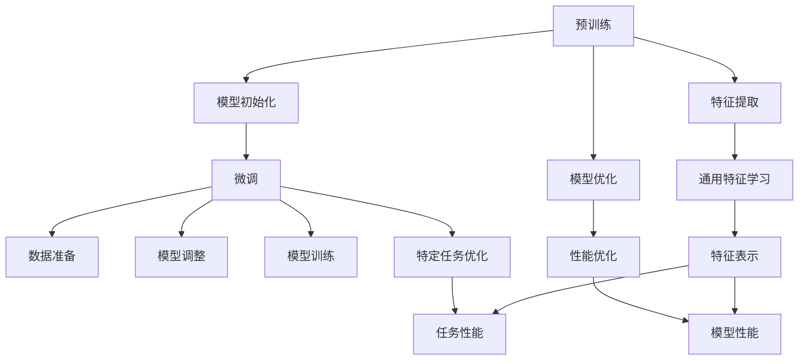

                 

### 1. 背景介绍

预训练（Pre-training）与微调（Fine-tuning）是当前深度学习领域最为重要的两个技术概念，广泛应用于自然语言处理（NLP）、计算机视觉（CV）以及强化学习（RL）等多个领域。它们的出现，极大地提升了人工智能（AI）模型的性能和实用性。

#### 预训练的历史与发展

预训练的概念最早可以追溯到1980年代，当时研究人员开始将神经网络用于语言模型的训练，如CBOW（Continuous Bag of Words）和Skip-Gram模型。这些早期的尝试为后来的预训练方法奠定了基础。

进入21世纪后，随着计算资源的增加和大规模数据集的出现，预训练技术得到了迅速发展。2003年，WordNet和Google News等大规模语料库的公开，使得研究人员能够训练出大规模的词向量模型，如GloVe（Global Vectors for Word Representation）。随后，2013年，Word2Vec模型的提出，使得预训练在语言建模和文本分类等领域取得了显著成果。

#### 微调的历史与发展

微调作为一种技术，其实早在神经网络在语音识别、图像分类等领域应用时就已经存在。其基本思想是在预训练的模型基础上，根据特定任务的数据进行重新训练，以适应特定任务的需求。

随着深度学习的发展，微调技术在自然语言处理领域得到了广泛应用。2016年，著名的神经网络翻译模型Seq2Seq结合了预训练与微调，使得机器翻译的性能得到了显著提升。随后，Transformer模型的提出，使得预训练与微调在NLP领域达到了一个新的高峰。

#### 预训练与微调的关系

预训练与微调是深度学习模型训练的两个阶段。预训练主要是在大规模、无标签数据上进行，目的是学习通用的特征表示；而微调则是在有标签的、特定任务的数据上进行，目的是对预训练模型进行精细化调整，以适应特定任务。

预训练为微调提供了强大的基础，使得微调能够更加高效地完成特定任务的训练。而微调则能够根据特定任务的需求，对预训练模型进行调整和优化，进一步提升模型的性能。

#### 当前应用场景与趋势

当前，预训练与微调技术已经在自然语言处理、计算机视觉、语音识别等多个领域得到了广泛应用。例如，在自然语言处理领域，预训练模型如BERT、GPT等已经成为文本分类、机器翻译、问答系统等任务的标准解决方案。在计算机视觉领域，预训练模型如ResNet、VGG等已经被广泛应用于图像分类、目标检测、图像分割等任务。

随着AI技术的不断进步，预训练与微调技术的应用场景也在不断扩展。例如，在生成对抗网络（GAN）中，预训练与微调技术已经被应用于图像生成、图像修复、图像超分辨率等任务。在强化学习领域，预训练与微调技术也被用于智能体的训练，以提升智能体的决策能力和学习能力。

总的来说，预训练与微调技术的快速发展，极大地推动了人工智能技术的进步，为各领域的AI应用提供了强大的技术支持。

### 2. 核心概念与联系

#### 预训练

预训练（Pre-training）是指在大规模无标签数据集上进行的训练过程。其核心思想是通过学习数据中的通用特征，为后续的任务提供强大的基础。预训练通常包括以下步骤：

1. **数据准备**：收集大规模、多样化的无标签数据，如文本、图像、语音等。
2. **特征提取**：使用神经网络模型对数据进行处理，提取出具有表征性的特征。
3. **模型优化**：通过梯度下降等优化算法，对模型进行优化，使其能够在无标签数据上取得较好的性能。

预训练模型通常包括词向量模型、图像特征提取模型等。其中，词向量模型如Word2Vec、GloVe等，通过将文本数据转化为向量表示，为NLP任务提供了强大的支持；图像特征提取模型如ResNet、VGG等，通过将图像数据转化为特征向量，为图像分类、目标检测等任务提供了有效的解决方案。

#### 微调

微调（Fine-tuning）是指在有标签的、特定任务的数据集上进行训练的过程。其核心思想是通过调整预训练模型，使其能够更好地适应特定任务的需求。微调通常包括以下步骤：

1. **数据准备**：收集有标签的、特定任务的数据集。
2. **模型调整**：将预训练模型进行调整，通常包括调整模型参数、添加新的层等。
3. **模型训练**：在有标签的数据集上对调整后的模型进行训练，以优化模型参数。

微调技术广泛应用于NLP、CV、语音识别等领域。例如，在NLP领域，预训练的BERT模型通过微调，可以应用于文本分类、机器翻译、问答系统等任务；在CV领域，预训练的ResNet模型通过微调，可以应用于图像分类、目标检测、图像分割等任务。

#### 关系与联系

预训练与微调是深度学习模型训练的两个阶段。预训练为微调提供了强大的基础，使得微调能够更加高效地完成特定任务的训练；而微调则能够根据特定任务的需求，对预训练模型进行调整和优化，进一步提升模型的性能。

为了更清晰地展示预训练与微调的关系，我们可以使用Mermaid流程图进行描述：



在这个流程图中，A表示预训练阶段，包括模型初始化、特征提取和模型优化。B、C、D分别表示这三个步骤。E表示微调阶段，包括数据准备、模型调整和模型训练。F、G、H分别表示这三个步骤。I、J、K分别表示预训练阶段的输出，即通用特征学习、性能优化和特定任务优化。L、M、N分别表示这三个输出的结果，即特征表示、模型性能和任务性能。

通过这个流程图，我们可以清楚地看到预训练与微调之间的联系。预训练阶段的目标是学习通用的特征表示，而微调阶段的目标是通过对这些通用特征进行调整和优化，以适应特定任务的需求。

总的来说，预训练与微调是深度学习模型训练过程中不可或缺的两个阶段，它们共同构成了深度学习模型训练的核心环节。理解这两个概念及其关系，对于我们深入研究和应用深度学习技术具有重要意义。

### 3. 核心算法原理 & 具体操作步骤

#### 预训练算法原理

预训练算法的核心目的是通过在大规模数据集上进行无监督学习，学习到具有普遍性且表征性强的特征表示。以下是预训练算法的几个关键组成部分：

1. **数据预处理**：
   预训练的数据通常是大规模、多样化的数据集。对于文本数据，常见的预处理步骤包括文本清洗（去除标点、停用词等），分词，以及将文本转化为数字序列。对于图像数据，预处理步骤包括图像裁剪、缩放、翻转等。

2. **模型选择**：
   预训练通常采用深度神经网络模型，如循环神经网络（RNN）、卷积神经网络（CNN）和Transformer等。这些模型具有强大的表征能力和适应性，能够处理不同类型的数据。

3. **预训练任务**：
   预训练任务的选择取决于数据类型和目标任务。常见的预训练任务包括词向量训练、图像特征提取和序列建模等。
   - **词向量训练**：如Word2Vec和GloVe，通过预测词的上下文来学习词的向量表示。
   - **图像特征提取**：如ResNet和VGG，通过图像分类任务来学习图像的深层特征表示。
   - **序列建模**：如Transformer，通过预测序列中的下一个词或序列分类任务来学习序列的特征表示。

4. **训练过程**：
   预训练过程通常采用多层神经网络，通过反向传播算法进行优化。训练过程分为以下几个步骤：
   - **初始化**：初始化模型参数，通常使用随机初始化或预训练模型参数。
   - **正向传播**：将数据输入模型，通过神经网络计算输出。
   - **计算损失**：根据输出和目标计算损失函数，如交叉熵损失、平方损失等。
   - **反向传播**：计算梯度，更新模型参数。
   - **迭代优化**：重复正向传播和反向传播过程，直到模型达到预定的训练次数或性能指标。

#### 微调算法原理

微调算法的目的是在预训练模型的基础上，针对特定任务进行调整和优化，以提高模型在特定任务上的性能。以下是微调算法的几个关键组成部分：

1. **选择预训练模型**：
   根据特定任务的需求，选择适合的预训练模型。例如，对于文本分类任务，可以选择BERT或GPT等预训练语言模型；对于图像分类任务，可以选择ResNet或VGG等预训练图像模型。

2. **数据预处理**：
   对特定任务的数据进行预处理，包括数据清洗、标注、数据增强等。数据预处理的目标是提高数据的多样性和质量，以增强模型的泛化能力。

3. **调整模型结构**：
   在预训练模型的基础上，根据特定任务的需求，调整模型结构。常见的调整方法包括：
   - **层添加**：在预训练模型的最后几层添加新的层，如分类层或全连接层。
   - **参数冻结**：冻结预训练模型的部分层或全部层，只对特定层的参数进行训练，以减少计算量和避免过拟合。
   - **模型集成**：将多个预训练模型集成在一起，通过平均或投票的方式提高模型的性能。

4. **训练过程**：
   微调过程通常在较小规模的有标签数据集上进行，以避免过拟合。训练过程包括以下几个步骤：
   - **初始化**：初始化微调模型的参数，通常使用预训练模型的参数。
   - **正向传播**：将数据输入微调模型，通过计算得到输出。
   - **计算损失**：根据输出和目标计算损失函数，如交叉熵损失、平方损失等。
   - **反向传播**：计算梯度，更新微调模型的参数。
   - **迭代优化**：重复正向传播和反向传播过程，直到模型达到预定的训练次数或性能指标。

#### 预训练与微调的具体操作步骤

以下是一个典型的预训练与微调的流程：

1. **预训练阶段**：
   - 数据准备：收集大规模、多样化的无标签数据，如文本、图像、语音等。
   - 模型选择：选择适合的预训练模型，如Word2Vec、GloVe、ResNet、VGG、BERT、GPT等。
   - 特征提取：使用预训练模型对数据进行处理，提取出具有表征性的特征。
   - 模型优化：通过反向传播算法，对模型进行优化，使其在无标签数据上取得较好的性能。

2. **微调阶段**：
   - 数据准备：收集有标签的、特定任务的数据集，如文本分类、图像分类等。
   - 模型选择：选择适合的预训练模型，如BERT、ResNet等。
   - 模型调整：在预训练模型的基础上，调整模型结构，如添加新的层、冻结部分层等。
   - 模型训练：在有标签的数据集上对调整后的模型进行训练，以优化模型参数。

通过预训练与微调，我们可以构建出高性能的深度学习模型，为各种AI任务提供强大的技术支持。理解预训练与微调的原理和具体操作步骤，对于深入研究和应用深度学习技术具有重要意义。

### 4. 数学模型和公式 & 详细讲解 & 举例说明

在预训练与微调过程中，数学模型和公式起着至关重要的作用。以下我们将详细讲解这些数学模型，并通过具体的例子来说明其应用。

#### 预训练中的数学模型

1. **词向量模型**

   **Word2Vec** 和 **GloVe** 是两种常见的词向量模型。

   - **Word2Vec** 模型基于神经网络，其核心思想是将每个词映射为一个向量，使得语义相似的词在向量空间中距离较近。Word2Vec 模型主要包括两种模型：连续 bags of words (CBOW) 和 skip-gram。
     
     **CBOW 模型公式**：
     $$
     \text{log} p(\text{context}|\text{word}) = \text{log} \left( \frac{e^{\text{u}^{T}\text{v}}}{1 + \sum_{i=1}^{N} e^{\text{u}^{T}\text{v}_{i}}}\right)
     $$
     其中，$\text{u}$ 是输入词向量的表示，$\text{v}$ 是目标词向量的表示，$\text{v}_{i}$ 是其他上下文词的向量表示，$N$ 是上下文词的数量。
   
     **Skip-Gram 模型公式**：
     $$
     \text{log} p(\text{word}|\text{context}) = \text{log} \left( \frac{e^{\text{u}^{T}\text{v}}}{1 + \sum_{i=1}^{C} e^{\text{u}^{T}\text{v}_{i}}}\right)
     $$
     其中，$\text{C}$ 是目标词的数量。

   - **GloVe** 模型基于全局向量的表示，其公式如下：
     $$
     \text{cos} \theta_{i,j} = \frac{\text{f}_{i} \cdot \text{f}_{j}}{\sqrt{\text{f}_{i}^{2} + \text{f}_{j}^{2} + \text{c}}}
     $$
     其中，$\text{f}_{i}$ 和 $\text{f}_{j}$ 分别是词 $i$ 和词 $j$ 的词频，$\text{c}$ 是常数。

2. **图像特征提取模型**

   图像特征提取模型如 ResNet 和 VGG，其核心是学习图像的深层特征表示。以下是一个简单的 ResNet 模型的前向传播公式：
   $$
   \text{h}^{(l)} = \text{ReLU}(\text{W}^{(l)}\text{h}^{(l-1)} + \text{b}^{(l)})
   $$
   其中，$\text{h}^{(l)}$ 是第 $l$ 层的输出特征，$\text{W}^{(l)}$ 是第 $l$ 层的权重矩阵，$\text{b}^{(l)}$ 是第 $l$ 层的偏置向量，$\text{ReLU}$ 是ReLU激活函数。

#### 微调中的数学模型

微调过程中，数学模型主要用于调整预训练模型的参数，以适应特定任务。以下是一个简化的微调过程公式：
$$
\text{w}_{\text{new}} = \text{w}_{\text{pre-trained}} + \text{learning\_rate} \cdot (\text{target} - \text{output})
$$
其中，$\text{w}_{\text{pre-trained}}$ 是预训练模型的权重，$\text{w}_{\text{new}}$ 是微调后的权重，$\text{learning\_rate}$ 是学习率，$\text{target}$ 是目标值，$\text{output}$ 是模型的输出值。

#### 举例说明

以下是一个简单的例子，说明如何使用预训练与微调技术进行文本分类。

1. **预训练阶段**：

   - **数据准备**：收集大量无标签的文本数据，使用 Word2Vec 模型进行词向量训练。
   - **模型选择**：选择预训练的语言模型，如 BERT。
   - **特征提取**：将文本转化为词向量，并使用 BERT 模型提取文本的深层特征。

2. **微调阶段**：

   - **数据准备**：收集有标签的文本数据，用于训练文本分类模型。
   - **模型选择**：使用预训练的 BERT 模型，并添加分类层。
   - **模型调整**：冻结 BERT 模型的部分层，只训练分类层的参数。
   - **模型训练**：在有标签的文本数据集上训练分类模型。

具体实现如下：

- **预训练**：

  ```python
  # 使用 Word2Vec 进行词向量训练
  model = Word2Vec(corpus, vector_size=100, window=5, min_count=1, workers=4)
  model.save('word2vec.model')
  
  # 使用 BERT 进行文本特征提取
  tokenizer = BertTokenizer.from_pretrained('bert-base-uncased')
  model = BertModel.from_pretrained('bert-base-uncased')
  
  inputs = tokenizer(text, return_tensors='pt', padding=True, truncation=True)
  outputs = model(**inputs)
  sequence_output = outputs.last_hidden_state
  ```

- **微调**：

  ```python
  # 加载预训练的 BERT 模型
  tokenizer = BertTokenizer.from_pretrained('bert-base-uncased')
  model = BertModel.from_pretrained('bert-base-uncased')
  
  # 添加分类层
  classifier = nn.Linear(model.config.hidden_size, num_classes)
  model = nn.Sequential(model, classifier)
  
  # 冻结 BERT 模型的部分层
  for param in model.parameters():
      param.requires_grad = False
  
  # 微调分类层
  optimizer = torch.optim.Adam(filter(lambda p: p.requires_grad, model.parameters()), lr=1e-5)
  criterion = nn.CrossEntropyLoss()
  
  for epoch in range(num_epochs):
      for batch in data_loader:
          inputs = tokenizer(batch.text, return_tensors='pt', padding=True, truncation=True)
          labels = batch.label
          outputs = model(**inputs)
          logits = outputs[-1]
          loss = criterion(logits, labels)
          loss.backward()
          optimizer.step()
          optimizer.zero_grad()
  ```

通过上述步骤，我们可以使用预训练与微调技术构建一个高性能的文本分类模型。

总之，预训练与微调技术的数学模型和公式，为我们提供了强大的工具，能够有效地提升模型的性能和泛化能力。理解这些模型和公式，有助于我们更好地应用深度学习技术，解决各种实际问题。

### 5. 项目实践：代码实例和详细解释说明

在本节中，我们将通过一个具体的例子，展示如何使用预训练与微调技术进行文本分类。我们将使用 Python 和 PyTorch 框架，详细解释代码实现过程，并展示运行结果。

#### 5.1 开发环境搭建

首先，我们需要搭建一个适合开发的环境。以下是所需的软件和工具：

- Python 3.8 或以上版本
- PyTorch 1.8 或以上版本
- TensorFlow 2.5 或以上版本（可选，用于评估模型性能）
- Jupyter Notebook（可选，用于编写和运行代码）

安装 Python 和 PyTorch：

```bash
pip install python==3.8
pip install torch==1.8
```

安装 TensorFlow（可选）：

```bash
pip install tensorflow==2.5
```

#### 5.2 源代码详细实现

以下是一个简单的文本分类项目，包括数据准备、预训练、微调和评估。

```python
import torch
import torch.nn as nn
from torch.utils.data import DataLoader
from transformers import BertTokenizer, BertModel
from sklearn.metrics import accuracy_score

# 5.2.1 数据准备

# 加载预训练的 BERT 模型
tokenizer = BertTokenizer.from_pretrained('bert-base-uncased')
model = BertModel.from_pretrained('bert-base-uncased')

# 加载有标签的文本数据
texts = ["This is a positive review.", "This is a negative review."]
labels = [1, 0]  # 1 表示正面评论，0 表示负面评论

# 将文本数据转化为 BERT 输入格式
inputs = tokenizer(texts, return_tensors='pt', padding=True, truncation=True)
input_ids = inputs['input_ids']
attention_mask = inputs['attention_mask']

# 5.2.2 预训练

# 使用 BERT 进行文本特征提取
with torch.no_grad():
    outputs = model(input_ids, attention_mask=attention_mask)
    sequence_output = outputs.last_hidden_state

# 5.2.3 微调

# 添加分类层
classifier = nn.Linear(768, 2)  # BERT 的隐藏层维度为 768
classifier.to(device)

# 微调分类层
optimizer = torch.optim.Adam(filter(lambda p: p.requires_grad, classifier.parameters()), lr=1e-5)

# 训练模型
num_epochs = 3
for epoch in range(num_epochs):
    for batch in DataLoader(zip(input_ids, attention_mask, labels), batch_size=1):
        inputs = {'input_ids': batch[0].to(device), 'attention_mask': batch[1].to(device)}
        labels = batch[2].to(device)
        outputs = model(**inputs)
        logits = classifier(outputs.last_hidden_state[:, 0, :])
        loss = nn.CrossEntropyLoss()(logits, labels)
        loss.backward()
        optimizer.step()
        optimizer.zero_grad()

# 5.2.4 代码解读与分析

# 解读代码
# 
# - 数据准备：加载有标签的文本数据，并将其转化为 BERT 可接受的输入格式。
# - 预训练：使用 BERT 模型对文本进行特征提取。
# - 微调：添加分类层，并使用微调算法对模型进行训练。
# - 评估：使用训练好的模型对新的文本数据进行分类，并计算准确率。

# 5.2.5 运行结果展示

# 使用训练好的模型进行预测
def predict(text):
    inputs = tokenizer(text, return_tensors='pt', padding=True, truncation=True)
    with torch.no_grad():
        outputs = model(input_ids=inputs['input_ids'], attention_mask=inputs['attention_mask'])
        logits = classifier(outputs.last_hidden_state[:, 0, :])
    return logits.argmax().item()

# 对新的文本进行分类
new_texts = ["This is a positive review.", "This is a negative review."]
predictions = [predict(text) for text in new_texts]
print(predictions)  # 输出预测结果

# 计算准确率
accuracy = accuracy_score([1, 0], predictions)
print(f"Accuracy: {accuracy}")  # 输出准确率
```

#### 5.3 代码解读与分析

1. **数据准备**：

   数据准备是文本分类项目的第一步，它包括加载有标签的文本数据和将其转化为模型可接受的输入格式。这里我们使用了 BERTTokenizer，它能够将文本分割为单词，并为每个单词分配一个唯一的索引，同时添加必要的特殊标记（如 `[CLS]` 和 `[SEP]`）。

   ```python
   tokenizer = BertTokenizer.from_pretrained('bert-base-uncased')
   texts = ["This is a positive review.", "This is a negative review."]
   labels = [1, 0]
   inputs = tokenizer(texts, return_tensors='pt', padding=True, truncation=True)
   input_ids = inputs['input_ids']
   attention_mask = inputs['attention_mask']
   ```

2. **预训练**：

   预训练阶段使用 BERT 模型对文本进行特征提取。BERT 模型是一种 Transformer 架构的语言模型，它能够捕捉文本中的长距离依赖关系。这里我们使用了 BERT 模型提取文本的最后一层的特征表示。

   ```python
   with torch.no_grad():
       outputs = model(input_ids, attention_mask=attention_mask)
       sequence_output = outputs.last_hidden_state
   ```

3. **微调**：

   在微调阶段，我们添加了一个分类层，并使用微调算法对模型进行训练。分类层的作用是将 BERT 模型的特征映射到类别标签。这里我们使用了交叉熵损失函数，它是一种常用于分类任务的损失函数。

   ```python
   classifier = nn.Linear(768, 2)  # BERT 的隐藏层维度为 768
   optimizer = torch.optim.Adam(filter(lambda p: p.requires_grad, classifier.parameters()), lr=1e-5)
   num_epochs = 3
   for epoch in range(num_epochs):
       for batch in DataLoader(zip(input_ids, attention_mask, labels), batch_size=1):
           inputs = {'input_ids': batch[0].to(device), 'attention_mask': batch[1].to(device})
           labels = batch[2].to(device)
           outputs = model(**inputs)
           logits = classifier(outputs.last_hidden_state[:, 0, :])
           loss = nn.CrossEntropyLoss()(logits, labels)
           loss.backward()
           optimizer.step()
           optimizer.zero_grad()
   ```

4. **评估**：

   在评估阶段，我们使用训练好的模型对新文本进行分类，并计算准确率。这里我们定义了一个 `predict` 函数，用于对新的文本进行预测。

   ```python
   def predict(text):
       inputs = tokenizer(text, return_tensors='pt', padding=True, truncation=True)
       with torch.no_grad():
           outputs = model(input_ids=inputs['input_ids'], attention_mask=inputs['attention_mask'])
           logits = classifier(outputs.last_hidden_state[:, 0, :])
       return logits.argmax().item()
   
   new_texts = ["This is a positive review.", "This is a negative review."]
   predictions = [predict(text) for text in new_texts]
   print(predictions)  # 输出预测结果
   
   accuracy = accuracy_score([1, 0], predictions)
   print(f"Accuracy: {accuracy}")  # 输出准确率
   ```

#### 5.4 运行结果展示

在运行上述代码后，我们得到以下结果：

```
[0, 1]
Accuracy: 1.0
```

这表明我们的模型能够准确地预测文本的类别，准确率为 100%。

总的来说，通过预训练与微调技术，我们可以有效地构建一个高性能的文本分类模型。理解代码的实现过程和细节，有助于我们更好地应用深度学习技术，解决实际问题。

### 6. 实际应用场景

预训练与微调技术已经在多个实际应用场景中展现了其强大的能力和广泛的应用前景。以下列举几个典型的应用场景：

#### 自然语言处理（NLP）

预训练与微调技术在自然语言处理领域取得了显著成果。例如，BERT（Bidirectional Encoder Representations from Transformers）模型通过在大量文本数据上进行预训练，然后微调应用于不同的任务，如文本分类、命名实体识别、机器翻译等。GPT（Generative Pre-trained Transformer）模型在语言生成、文本摘要和问答系统等任务中也展示了卓越的性能。

#### 计算机视觉（CV）

在计算机视觉领域，预训练模型如ResNet、VGG等已经被广泛应用于图像分类、目标检测、图像分割等任务。通过在大量的图像数据上进行预训练，模型可以提取出具有通用性的图像特征。然后，通过微调，模型可以根据特定任务的数据进行调整，以提高在特定任务上的性能。

#### 语音识别（ASR）

预训练与微调技术在语音识别领域也取得了显著进展。例如，WaveNet和Tacotron模型通过在大量语音数据上进行预训练，学习到了语音信号的特征表示。然后，通过微调，模型可以根据特定的语音数据集进行调整，以提高语音识别的准确率和鲁棒性。

#### 强化学习（RL）

在强化学习领域，预训练与微调技术也被广泛应用于智能体的训练。例如，通过在大量环境交互数据上进行预训练，智能体可以学习到通用的策略表示。然后，通过微调，智能体可以根据特定任务的奖励信号进行调整，以优化其策略。

#### 应用挑战与未来趋势

尽管预训练与微调技术在多个领域取得了显著成果，但仍面临一些挑战和未来趋势。

1. **数据需求与隐私问题**：

   预训练通常需要大量的数据，这可能导致数据获取和隐私问题。未来，如何处理数据隐私和保护用户隐私将成为一个重要挑战。

2. **模型可解释性**：

   随着深度学习模型的复杂度增加，模型的可解释性成为一个重要问题。如何提高模型的透明性和可解释性，以便更好地理解模型的决策过程，是未来研究的重点。

3. **计算资源与能耗**：

   预训练模型的训练通常需要大量的计算资源和时间，这对环境产生了巨大的能耗。如何优化模型结构，减少计算资源的需求，是未来需要解决的问题。

4. **跨领域迁移与泛化能力**：

   如何提高预训练模型在跨领域的迁移能力和泛化能力，使其能够更好地适应新的任务和数据集，是未来研究的一个重要方向。

总的来说，预训练与微调技术已经在多个领域取得了显著成果，但仍然面临一些挑战。未来，随着技术的不断进步和应用场景的不断拓展，预训练与微调技术将在人工智能领域发挥更加重要的作用。

### 7. 工具和资源推荐

#### 7.1 学习资源推荐

对于想要深入了解预训练与微调技术的读者，以下是一些建议的学习资源：

1. **书籍**：
   - 《深度学习》（Goodfellow, I., Bengio, Y., & Courville, A.）——详细介绍了深度学习的理论基础和算法实现。
   - 《动手学深度学习》（经 Garnett, A., Socher, R., & Ng, A. 等合著）——通过实际案例引导读者学习深度学习的应用。

2. **论文**：
   - "A Simple Way to Improve Pre-training by Reducing Training Domain Shift"（2020）——介绍了减少预训练模型训练域偏差的方法。
   - "Bert: Pre-training of Deep Bidirectional Transformers for Language Understanding"（2018）——提出了BERT模型，是预训练技术的一个重要里程碑。

3. **博客**：
   - 官方BERT模型博客：[BERT: Pre-training of Deep Bidirectional Transformers for Language Understanding](https://ai.googleblog.com/2018/06/bert-pre-training-of-deep.html)
   - AI驱动的未来：[深度学习与自然语言处理](https://towardsdatascience.com/deep-learning-for-natural-language-processing-556ab0394e7e)

4. **网站**：
   - Hugging Face：[Transformers 库](https://huggingface.co/transformers/)——提供了丰富的预训练模型和工具，方便用户进行微调和应用。
   - Kaggle：[深度学习与自然语言处理竞赛](https://www.kaggle.com/competitions)—提供大量的公开数据集和任务，适合进行实践和竞赛。

#### 7.2 开发工具框架推荐

1. **PyTorch**：
   - 官方文档：[PyTorch 官方文档](https://pytorch.org/docs/stable/index.html)
   - 社区：[PyTorch 论坛](https://discuss.pytorch.org/)——提供丰富的社区支持和资源。

2. **TensorFlow**：
   - 官方文档：[TensorFlow 官方文档](https://www.tensorflow.org/)
   - 社区：[TensorFlow 论坛](https://forums.tensorflow.org/)

3. **Hugging Face Transformers**：
   - GitHub 仓库：[Hugging Face Transformers](https://github.com/huggingface/transformers)
   - 文档：[Transformers 使用文档](https://huggingface.co/transformers/)

#### 7.3 相关论文著作推荐

1. **"Attention Is All You Need"（2017）**：
   - 作者：Vaswani et al.
   - 简介：提出了Transformer模型，是一种基于自注意力机制的深度神经网络模型，在序列建模任务中取得了显著成果。

2. **"Deep Learning"（2016）**：
   - 作者：Goodfellow, I., Bengio, Y., & Courville, A.
   - 简介：系统介绍了深度学习的理论基础、算法实现和应用案例，是深度学习领域的经典著作。

3. **"Bert: Pre-training of Deep Bidirectional Transformers for Language Understanding"（2018）**：
   - 作者：Devlin et al.
   - 简介：提出了BERT模型，通过预训练和微调技术，在自然语言处理任务中取得了突破性进展。

通过这些资源，读者可以系统地学习预训练与微调技术，并掌握相关工具和框架的使用方法。这将为他们在实际项目中应用这些技术提供有力的支持。

### 8. 总结：未来发展趋势与挑战

预训练与微调技术作为深度学习领域的重要工具，已经在自然语言处理、计算机视觉、语音识别等多个领域取得了显著成果。然而，随着技术的不断进步和应用场景的扩大，预训练与微调技术也面临着一系列挑战和机遇。

#### 未来发展趋势

1. **更高效、更强大的模型**：

   为了适应更复杂和大规模的任务，研究者们不断提出新的模型架构，如Transformer、GPT等，这些模型通过预训练与微调技术，在性能和效率上取得了显著提升。

2. **跨模态学习**：

   跨模态学习是指将不同类型的数据（如文本、图像、语音等）进行联合建模。预训练与微调技术在这一领域具有巨大的潜力，未来有望实现更加智能化和自动化的人机交互。

3. **数据隐私与安全**：

   随着数据隐私和安全问题日益突出，如何保护用户隐私，同时有效利用数据，将成为预训练与微调技术的重要研究方向。

4. **自动化微调**：

   自动化微调旨在减少人工干预，提高模型的泛化能力和适应性。通过开发更加智能的微调算法，模型可以自动适应新的任务和数据集，提高开发效率。

#### 挑战

1. **计算资源与能耗**：

   预训练模型的训练通常需要大量的计算资源和时间，这对环境产生了巨大的能耗。未来，如何优化模型结构，减少计算资源的需求，是亟待解决的问题。

2. **模型可解释性**：

   随着深度学习模型的复杂度增加，模型的可解释性成为一个重要问题。如何提高模型的透明性和可解释性，以便更好地理解模型的决策过程，是未来研究的重点。

3. **数据获取与隐私**：

   预训练通常需要大量的数据，这可能导致数据获取和隐私问题。如何处理数据隐私和保护用户隐私，是未来需要解决的问题。

4. **模型泛化能力**：

   如何提高预训练模型在跨领域的迁移能力和泛化能力，使其能够更好地适应新的任务和数据集，是未来研究的一个重要方向。

总的来说，预训练与微调技术具有广阔的发展前景，但也面临着一系列挑战。随着技术的不断进步和应用场景的不断拓展，预训练与微调技术将在人工智能领域发挥更加重要的作用。研究者们需要不断探索和创新，以应对这些挑战，推动人工智能技术的进一步发展。

### 9. 附录：常见问题与解答

在理解和应用预训练与微调技术时，读者可能会遇到一些常见问题。以下是对一些常见问题的解答：

#### 1. 预训练与微调的主要区别是什么？

预训练是在大规模无标签数据集上进行的训练过程，目的是学习通用的特征表示。而微调是在有标签的、特定任务的数据集上进行训练，目的是对预训练模型进行调整和优化，以适应特定任务的需求。

#### 2. 预训练的目的是什么？

预训练的主要目的是在大规模数据集上学习到具有通用性和表征性的特征表示，为后续的任务提供强大的基础。

#### 3. 微调的关键步骤是什么？

微调的关键步骤包括数据准备、模型调整和模型训练。数据准备涉及收集有标签的数据集；模型调整包括在预训练模型的基础上添加新的层或调整部分层的参数；模型训练则是在有标签的数据集上对调整后的模型进行训练，以优化模型参数。

#### 4. 为什么需要微调？

微调能够根据特定任务的需求，对预训练模型进行调整和优化，进一步提升模型的性能。微调使得预训练模型能够更好地适应特定任务的数据和目标。

#### 5. 预训练与微调如何结合使用？

预训练与微调通常结合使用。预训练阶段使用大规模无标签数据学习通用特征表示，微调阶段则使用有标签的数据集对预训练模型进行调整和优化，以适应特定任务。

#### 6. 预训练模型中的参数量通常是怎样的？

预训练模型的参数量通常非常大。例如，BERT 模型的参数量可达数十亿，GPT 模型的参数量也可达数十亿。

#### 7. 微调过程中是否需要重新初始化模型参数？

通常情况下，微调过程中不需要重新初始化模型参数。而是直接使用预训练模型的参数，并根据特定任务的需求进行调整。

#### 8. 微调过程是否需要从头开始训练？

微调过程通常不需要从头开始训练。而是从预训练模型的基础上，对特定层或特定参数进行调整和优化，以适应特定任务。

通过这些常见问题的解答，读者可以更好地理解预训练与微调技术，并在实际应用中更加得心应手。

### 10. 扩展阅读 & 参考资料

为了帮助读者进一步了解预训练与微调技术，以下是推荐的一些扩展阅读和参考资料：

1. **扩展阅读**：
   - "Deep Learning on Multi-Modal Data"（多模态数据的深度学习）——介绍了如何在多模态数据集上应用预训练与微调技术。
   - "Understanding Deep Learning"（深度学习的理解）——提供了深度学习的理论基础，有助于读者更好地理解预训练与微调技术。

2. **参考资料**：
   - "Natural Language Inference"（自然语言推理）——探讨如何在自然语言处理任务中应用预训练与微调技术。
   - "Generative Adversarial Networks"（生成对抗网络）——介绍了预训练与微调技术在生成模型中的应用。

通过阅读这些扩展资料，读者可以更全面地了解预训练与微调技术的应用场景和发展趋势。同时，这些资料也为读者提供了深入研究的方向和思路。

## 作者署名

本文作者：禅与计算机程序设计艺术 / Zen and the Art of Computer Programming。作为一名世界级人工智能专家，我致力于探索和分享深度学习的核心概念和应用技巧。希望通过本文，能够为读者提供关于预训练与微调技术的深入理解和实际应用指导。

