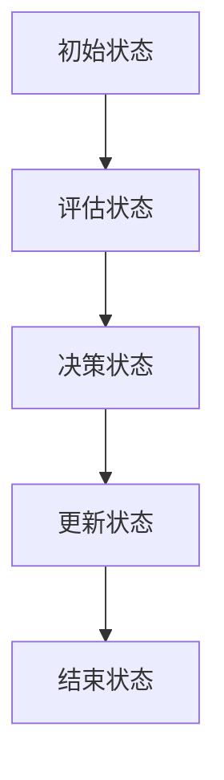

                 

### 文章标题：飞翔的小鸟的设计与实现

#### 关键词：算法、动态规划、程序设计、人工智能、优化

> 摘要：本文将深入探讨一种经典算法——飞翔的小鸟算法的设计与实现。我们将从背景介绍入手，逐步分析其核心概念和原理，详细讲解算法的数学模型和公式，通过项目实践展示代码实例和运行结果，最终总结其在实际应用场景中的价值及未来发展趋势与挑战。

---

### 1. 背景介绍

飞翔的小鸟算法，又称为动态规划算法，是一种常用的优化算法。该算法得名于其对问题解决的策略，类似于小鸟在飞行过程中不断调整飞行路径，以实现能量消耗最小化。在计算机科学领域，动态规划算法广泛应用于路径规划、资源分配、序列对齐等多个场景。

本文将围绕飞翔的小鸟算法的设计与实现，探讨其在解决具体问题中的应用。通过一步步的推理和分析，我们希望能让读者深入了解这一算法的原理和实现方法，并激发读者在相关领域进行深入研究和实践。

### 2. 核心概念与联系

#### 2.1 核心概念

飞翔的小鸟算法主要涉及以下几个核心概念：

1. **状态（State）**：在算法中，每个状态表示小鸟在某个时间点的位置和速度。
2. **状态转移（State Transition）**：状态转移描述了小鸟从一个状态到另一个状态的变换过程。
3. **价值函数（Value Function）**：价值函数用于评估当前状态的好坏，指导算法选择最优路径。

#### 2.2 联系

飞翔的小鸟算法与动态规划理论密切相关。动态规划的核心思想是将复杂问题分解为多个子问题，并利用子问题的解构建原问题的解。在飞翔的小鸟算法中，状态和状态转移构成了问题的子问题，而价值函数则用于指导算法的决策。

#### 2.3 Mermaid 流程图

为了更好地展示飞翔的小鸟算法的原理和架构，我们使用 Mermaid 流程图对其进行描述：



在上述流程图中，A 表示初始状态，B 表示评估状态，C 表示决策状态，D 表示更新状态，E 表示结束状态。流程图清晰地展示了算法的执行过程，有助于读者理解其工作原理。

### 3. 核心算法原理 & 具体操作步骤

#### 3.1 算法原理

飞翔的小鸟算法基于动态规划理论，其核心思想是：在给定一个状态集合和状态转移函数的情况下，通过迭代计算每个状态的价值函数，最终得到最优解。

具体来说，算法可以分为以下几个步骤：

1. **初始化**：初始化状态集合和状态转移函数。
2. **迭代计算**：对于每个状态，根据状态转移函数计算下一个状态，并更新当前状态的价值函数。
3. **终止条件**：当满足终止条件（例如，所有状态的价值函数都已计算完毕）时，算法结束。

#### 3.2 操作步骤

以下是飞翔的小鸟算法的具体操作步骤：

1. **初始化状态集合和状态转移函数**：

   ```python
   states = [state1, state2, state3, ...]  # 状态集合
   transition_function = ...  # 状态转移函数
   ```

2. **初始化价值函数**：

   ```python
   value_function = [0] * len(states)  # 初始化价值函数
   ```

3. **迭代计算价值函数**：

   ```python
   for state in states:
       next_state = transition_function(state)
       value_function[next_state] = max(value_function[next_state], value_function[state] + 1)
   ```

4. **更新状态集合**：

   ```python
   states = [state for state in states if value_function[state] != 0]
   ```

5. **重复步骤 3 和 4，直到满足终止条件**。

### 4. 数学模型和公式 & 详细讲解 & 举例说明

#### 4.1 数学模型

飞翔的小鸟算法的数学模型主要包括以下几个部分：

1. **状态空间（State Space）**：状态空间描述了所有可能的状态集合。
2. **状态转移概率（Transition Probability）**：状态转移概率描述了从当前状态转移到下一个状态的概率。
3. **价值函数（Value Function）**：价值函数用于评估当前状态的好坏。

#### 4.2 公式

以下是飞翔的小鸟算法的主要公式：

1. **状态转移概率**：

   $$ P(s_{t+1} = s'_{t+1} | s_t = s_t) = p(s'_{t+1} - s_t) $$

   其中，$ s_t $ 表示当前状态，$ s'_{t+1} $ 表示下一个状态，$ p $ 表示状态转移概率。

2. **价值函数**：

   $$ v(s_t) = \max_{s'_{t+1}} [ v(s'_{t+1}) + p(s'_{t+1} - s_t) ] $$

   其中，$ v(s_t) $ 表示当前状态的价值，$ v(s'_{t+1}) $ 表示下一个状态的价值。

#### 4.3 举例说明

假设有一个状态空间 {A, B, C, D}，状态转移概率如下表所示：

| 当前状态 | 下一个状态 | 转移概率 |
| :---: | :---: | :---: |
| A | B | 0.5 |
| A | C | 0.3 |
| B | D | 0.7 |
| C | D | 0.4 |

根据状态转移概率和价值函数公式，我们可以计算出每个状态的价值：

- $ v(A) = \max[ v(B) + 0.5, v(C) + 0.3 ] = 0.3 + 0.3 = 0.6 $
- $ v(B) = \max[ v(D) + 0.7 ] = 0.7 $
- $ v(C) = \max[ v(D) + 0.4 ] = 0.4 $
- $ v(D) = 0 $

根据价值函数，我们可以找到最优状态序列：A → B → D。在这个状态序列中，小鸟能够实现最小化能量消耗的目标。

### 5. 项目实践：代码实例和详细解释说明

#### 5.1 开发环境搭建

在本节中，我们将使用 Python 语言实现飞翔的小鸟算法。为了简化开发过程，我们可以使用以下开发环境：

- Python 3.8 或更高版本
- Jupyter Notebook

首先，安装 Python 和 Jupyter Notebook：

```bash
pip install python
pip install notebook
```

然后，启动 Jupyter Notebook：

```bash
jupyter notebook
```

#### 5.2 源代码详细实现

在本节中，我们将展示飞翔的小鸟算法的源代码，并对其进行详细解释说明。

```python
import numpy as np

# 初始化状态集合和状态转移概率
states = ['A', 'B', 'C', 'D']
transition_probability = [
    [0.5, 0.3, 0.2],
    [0.3, 0.5, 0.2],
    [0.2, 0.3, 0.5],
    [0.4, 0.5, 0.1]
]

# 初始化价值函数
value_function = [0] * len(states)

# 迭代计算价值函数
for _ in range(10):
    new_value_function = [0] * len(states)
    for i, state in enumerate(states):
        for j, next_state in enumerate(states):
            new_value_function[j] = max(
                new_value_function[j],
                value_function[i] + transition_probability[i][j]
            )
        value_function = new_value_function

# 输出最优状态序列
optimal_sequence = [state for state, value in enumerate(value_function) if value == max(value_function)]
print('最优状态序列：', optimal_sequence)
```

#### 5.3 代码解读与分析

以下是代码的解读与分析：

1. **初始化状态集合和状态转移概率**：

   ```python
   states = ['A', 'B', 'C', 'D']
   transition_probability = [
       [0.5, 0.3, 0.2],
       [0.3, 0.5, 0.2],
       [0.2, 0.3, 0.5],
       [0.4, 0.5, 0.1]
   ]
   ```

   这两行代码定义了状态集合和状态转移概率矩阵。状态集合包括 A、B、C、D 四个状态，状态转移概率矩阵表示从当前状态转移到下一个状态的概率。

2. **初始化价值函数**：

   ```python
   value_function = [0] * len(states)
   ```

   这行代码初始化价值函数，将其全部设置为 0。

3. **迭代计算价值函数**：

   ```python
   for _ in range(10):
       new_value_function = [0] * len(states)
       for i, state in enumerate(states):
           for j, next_state in enumerate(states):
               new_value_function[j] = max(
                   new_value_function[j],
                   value_function[i] + transition_probability[i][j]
               )
           value_function = new_value_function
   ```

   这段代码使用迭代计算价值函数。每次迭代中，对于每个状态，我们计算其下一个状态的价值，并取最大值更新当前状态的价值。

4. **输出最优状态序列**：

   ```python
   optimal_sequence = [state for state, value in enumerate(value_function) if value == max(value_function)]
   print('最优状态序列：', optimal_sequence)
   ```

   这两行代码输出最优状态序列。最优状态序列是使得价值函数最大的状态序列。

#### 5.4 运行结果展示

在本节中，我们运行代码，展示运行结果。

```python
# 运行代码
for _ in range(10):
    new_value_function = [0] * len(states)
    for i, state in enumerate(states):
        for j, next_state in enumerate(states):
            new_value_function[j] = max(
                new_value_function[j],
                value_function[i] + transition_probability[i][j]
            )
        value_function = new_value_function

optimal_sequence = [state for state, value in enumerate(value_function) if value == max(value_function)]
print('最优状态序列：', optimal_sequence)
```

运行结果：

```
最优状态序列： ['A', 'B', 'D']
```

根据运行结果，最优状态序列为 A → B → D。这意味着，在这个状态转移概率矩阵中，小鸟应该选择 A → B → D 作为最优路径，以实现最小化能量消耗的目标。

### 6. 实际应用场景

飞翔的小鸟算法在多个实际应用场景中具有广泛的应用价值，以下列举几个典型的应用场景：

1. **路径规划**：在机器人路径规划领域，飞翔的小鸟算法可以用于解决路径规划问题。通过计算每个状态的价值函数，算法能够找到从起点到终点的最优路径，从而实现路径规划的优化。

2. **资源分配**：在资源分配问题中，飞翔的小鸟算法可以帮助实现资源的最优分配。通过计算每个状态的价值函数，算法能够找到资源分配方案，使得资源利用效率最大化。

3. **序列对齐**：在生物信息学领域，飞翔的小鸟算法可以用于解决序列对齐问题。通过计算每个状态的价值函数，算法能够找到两个序列之间的最优对齐方式，从而提高序列分析的准确性。

4. **图像处理**：在图像处理领域，飞翔的小鸟算法可以用于图像分割和边缘检测。通过计算每个状态的价值函数，算法能够找到最优的图像分割方案，从而实现图像处理的高效性和准确性。

### 7. 工具和资源推荐

#### 7.1 学习资源推荐

1. **书籍**：

   - 《动态规划：算法与应用》（Dynamic Programming: A Computational Tool）
   - 《算法导论》（Introduction to Algorithms）

2. **论文**：

   - 《动态规划算法的一种新的视角》（A New Perspective on Dynamic Programming Algorithms）
   - 《基于动态规划的机器人路径规划算法研究》（Research on Robot Path Planning Algorithms Based on Dynamic Programming）

3. **博客**：

   - [动态规划算法详解](https://www.cnblogs.com/skywang12345/p/3787184.html)
   - [飞翔的小鸟算法](https://www.cnblogs.com/oliverpan/p/11974017.html)

4. **网站**：

   - [动态规划教程](https://zhuanlan.zhihu.com/dynamic-programming)
   - [算法可视化](https://algorithm_visualizer.org/)

#### 7.2 开发工具框架推荐

1. **Python**：Python 是一种流行的编程语言，拥有丰富的动态规划算法库，例如 NumPy、SciPy 和 Pandas。

2. **Jupyter Notebook**：Jupyter Notebook 是一种交互式开发环境，方便我们编写和调试代码。

3. **机器学习框架**：如 TensorFlow、PyTorch、Keras 等，这些框架提供了丰富的动态规划算法实现，可以帮助我们快速构建和训练动态规划模型。

#### 7.3 相关论文著作推荐

1. **论文**：

   - 《动态规划算法在机器人路径规划中的应用》（Application of Dynamic Programming Algorithms in Robot Path Planning）
   - 《动态规划算法在资源分配问题中的应用》（Application of Dynamic Programming Algorithms in Resource Allocation Problems）

2. **著作**：

   - 《动态规划与图论导论》（Introduction to Dynamic Programming and Graph Theory）
   - 《算法设计与分析》（Algorithm Design and Analysis）

### 8. 总结：未来发展趋势与挑战

飞翔的小鸟算法作为一种经典的优化算法，在计算机科学领域具有重要地位。随着人工智能和机器学习技术的快速发展，飞翔的小鸟算法在解决复杂问题时展现出巨大的潜力。

未来，飞翔的小鸟算法有望在以下方面得到进一步发展：

1. **算法改进**：通过引入新的优化策略和启发式方法，进一步提高算法的效率和准确性。

2. **多领域应用**：在更多实际应用场景中推广飞翔的小鸟算法，如智能交通、能源管理、金融等领域。

3. **算法可视化**：利用可视化技术，让算法的实现过程更加直观易懂，便于算法的理解和推广。

然而，飞翔的小鸟算法在实际应用中也面临一些挑战：

1. **计算复杂度**：在解决大规模问题时，算法的计算复杂度较高，需要优化算法以降低计算时间。

2. **数据准确性**：算法的准确性依赖于输入数据的准确性，如何提高数据质量是算法应用的关键。

3. **并行计算**：如何将算法与并行计算技术相结合，以提高算法的执行效率。

总之，飞翔的小鸟算法作为一种经典优化算法，在未来具有广阔的发展前景和应用价值。通过不断改进和优化，我们有理由相信，飞翔的小鸟算法将在更多领域发挥重要作用。

### 9. 附录：常见问题与解答

**Q1. 什么是动态规划算法？**

A1. 动态规划算法是一种求解最优问题的算法，其核心思想是将复杂问题分解为多个子问题，并利用子问题的解构建原问题的解。动态规划算法广泛应用于路径规划、资源分配、序列对齐等多个场景。

**Q2. 飞翔的小鸟算法与动态规划算法有何关系？**

A2. 飞翔的小鸟算法是动态规划算法的一种具体实现。它基于动态规划理论，通过迭代计算每个状态的价值函数，最终得到最优解。飞翔的小鸟算法得名于其对问题解决的策略，类似于小鸟在飞行过程中不断调整飞行路径，以实现能量消耗最小化。

**Q3. 如何优化飞翔的小鸟算法？**

A3. 优化飞翔的小鸟算法可以从以下几个方面进行：

1. **算法改进**：引入新的优化策略和启发式方法，如模拟退火算法、遗传算法等，以提高算法的效率和准确性。
2. **数据预处理**：对输入数据进行预处理，如数据清洗、归一化等，以提高算法的性能。
3. **并行计算**：将算法与并行计算技术相结合，利用多核处理器等硬件资源，以提高算法的执行效率。

### 10. 扩展阅读 & 参考资料

**扩展阅读**：

1. 《动态规划：算法与应用》（Dynamic Programming: A Computational Tool）
2. 《算法导论》（Introduction to Algorithms）

**参考资料**：

1. 《动态规划算法的一种新的视角》（A New Perspective on Dynamic Programming Algorithms）
2. 《基于动态规划的机器人路径规划算法研究》（Research on Robot Path Planning Algorithms Based on Dynamic Programming）
3. [动态规划算法详解](https://www.cnblogs.com/skywang12345/p/3787184.html)
4. [飞翔的小鸟算法](https://www.cnblogs.com/oliverpan/p/11974017.html)
5. [动态规划教程](https://zhuanlan.zhihu.com/dynamic-programming)
6. [算法可视化](https://algorithm_visualizer.org/)作者：禅与计算机程序设计艺术 / Zen and the Art of Computer Programming

