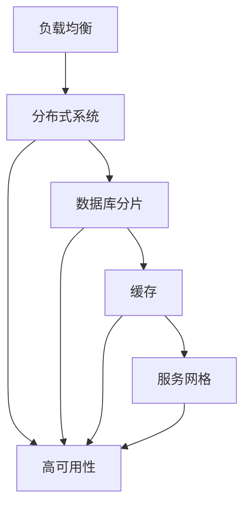
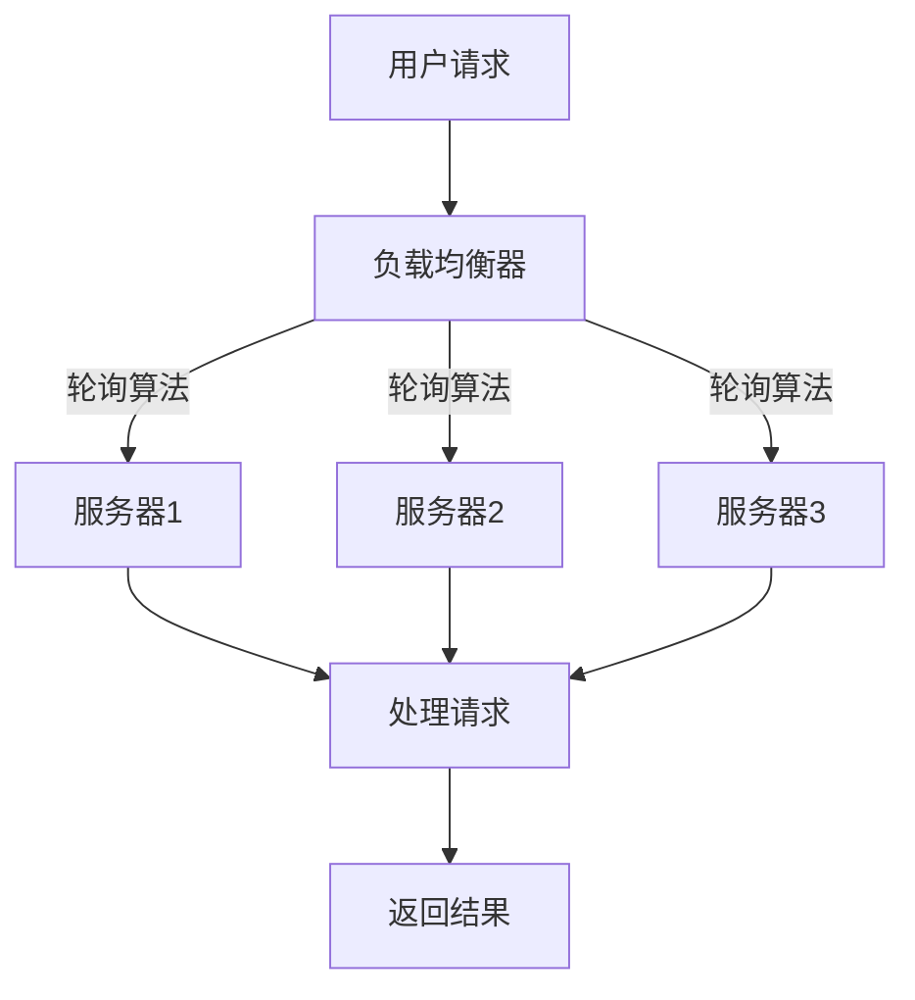
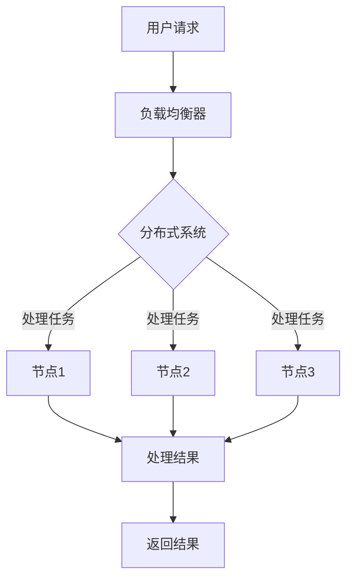
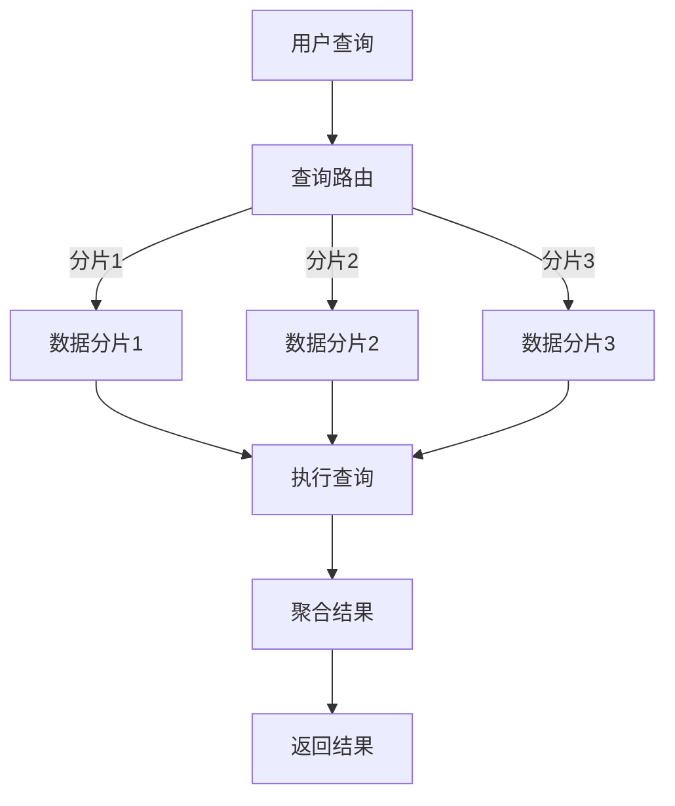
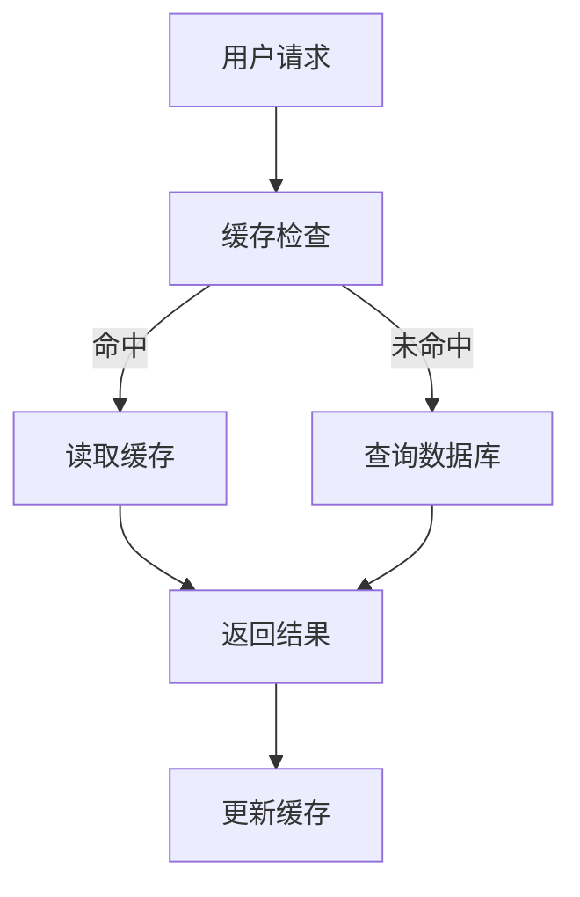
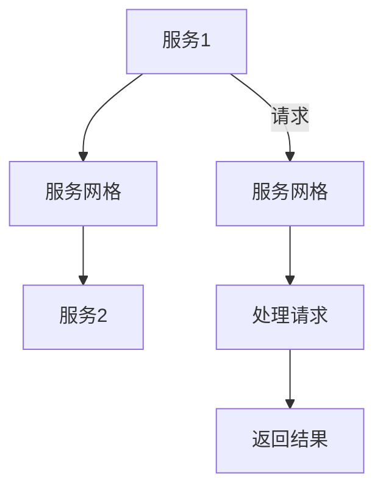

                 

### 背景介绍

在当今数字化时代，互联网应用已经成为人们生活中不可或缺的一部分。随着用户数量的不断增长，以及业务需求的日益复杂，互联网应用的性能和稳定性变得越来越重要。高可用性、高负载处理能力以及高并发处理能力成为了衡量一个互联网应用是否优秀的三大核心指标。

**高可用性（High Availability）**指的是系统或服务在长期运行中保持正常运行的能力。高可用性不仅包括硬件和网络的可靠性，还涉及到软件的容错性和恢复能力。对于互联网应用来说，高可用性意味着即使出现故障，也能在尽可能短的时间内恢复，确保用户体验不受影响。

**高负载处理能力（High Load Handling）**则是指系统能够高效处理大量用户请求的能力。随着用户数量的增加，系统需要能够处理更多的请求，而不会因为负载过高而出现性能下降或崩溃。

**高并发处理能力（High Concurrency Handling）**是指系统能够同时处理大量并发请求的能力。在互联网应用中，并发请求通常来源于多个用户或系统同时访问同一资源，系统需要确保这些请求能够得到及时且正确的处理。

为了满足这些需求，互联网应用的架构设计需要考虑到多个方面，包括系统架构的选择、负载均衡策略的制定、数据存储的优化、故障恢复机制的设计等。本文将深入探讨这些核心问题，并提供详细的解决方案和实例。

### 核心概念与联系

在深入探讨互联网应用架构设计的核心问题之前，我们需要了解一些关键的概念和它们之间的联系。这些核心概念包括：

1. **负载均衡（Load Balancing）**：负载均衡是将用户请求分布到多个服务器上，以避免单点瓶颈，提高系统整体性能和可靠性。
2. **分布式系统（Distributed Systems）**：分布式系统由多个相互独立但又协同工作的计算机节点组成，这些节点可以分布在不同的地理位置，协同处理任务。
3. **数据库分片（Database Sharding）**：数据库分片是将数据分布存储到多个物理节点上，以支持大规模数据存储和高并发访问。
4. **缓存（Caching）**：缓存是一种快速访问数据的机制，通过将频繁访问的数据存储在内存中，减少数据库的访问压力。
5. **服务网格（Service Mesh）**：服务网格是一种基础设施层，用于简化分布式服务之间的通信，提供可靠性和安全性。

下面我们将通过一个Mermaid流程图来展示这些概念之间的联系。



### 负载均衡

负载均衡是确保互联网应用能够高效处理大量请求的关键组件。通过将请求分布到多个服务器上，负载均衡可以避免单点瓶颈，提高系统的整体性能和可靠性。负载均衡可以分为以下几个步骤：

1. **请求接收**：用户请求首先被负载均衡器接收。
2. **请求分发**：负载均衡器根据一定的算法（如轮询、最少连接数等），将请求分发到不同的服务器。
3. **处理请求**：服务器接收请求并处理，然后将结果返回给用户。
4. **健康检查**：负载均衡器定期对服务器进行健康检查，确保只将请求分发到健康的服务器。

下面是一个简单的负载均衡工作流程的Mermaid流程图：



### 分布式系统

分布式系统是由多个相互独立但又协同工作的计算机节点组成的系统。这些节点可以分布在不同的地理位置，共同完成计算任务。分布式系统的核心优势包括：

1. **高可用性**：即使某个节点出现故障，其他节点仍然可以继续工作，确保系统的高可用性。
2. **扩展性**：分布式系统可以根据需求动态增加或减少节点，以支持业务的快速增长。
3. **容错性**：分布式系统能够自动检测并修复故障节点，确保系统的稳定性。

下面是一个简单的分布式系统工作流程的Mermaid流程图：



### 数据库分片

随着数据量的不断增长，单机数据库逐渐难以满足性能和扩展性的需求。数据库分片是将数据分布存储到多个物理节点上，以支持大规模数据存储和高并发访问。数据库分片可以分为以下几个步骤：

1. **数据划分**：将数据根据一定的规则划分到不同的分片上。
2. **分片存储**：每个分片存储一部分数据，可以分布在不同的物理节点上。
3. **查询路由**：用户查询首先被路由到相应的分片上，分片再执行具体的查询操作。
4. **数据聚合**：查询结果需要从多个分片聚合得到最终结果。

下面是一个简单的数据库分片工作流程的Mermaid流程图：



### 缓存

缓存是一种快速访问数据的机制，通过将频繁访问的数据存储在内存中，减少数据库的访问压力。缓存的优点包括：

1. **提高性能**：内存访问速度远快于磁盘访问，可以显著提高系统的响应速度。
2. **减少数据库负载**：频繁访问的数据存储在缓存中，可以减少对数据库的访问次数。
3. **降低延迟**：缓存可以减少用户请求的响应时间，提高用户体验。

下面是一个简单的缓存工作流程的Mermaid流程图：



### 服务网格

服务网格是一种基础设施层，用于简化分布式服务之间的通信。服务网格的核心优势包括：

1. **服务发现**：服务网格可以自动发现和注册服务，简化服务之间的依赖关系。
2. **服务治理**：服务网格提供了丰富的策略管理功能，如流量控制、负载均衡、安全认证等。
3. **性能优化**：服务网格可以通过流量控制和负载均衡，提高系统的整体性能。

下面是一个简单的服务网格工作流程的Mermaid流程图：



通过这些核心概念和流程图的介绍，我们能够更清晰地理解互联网应用架构设计的复杂性。在接下来的部分，我们将深入探讨核心算法原理，提供具体的操作步骤和实例，帮助读者更好地掌握这些技术。

### 核心算法原理 & 具体操作步骤

在深入探讨互联网应用的架构设计时，我们离不开核心算法原理的理解和运用。这些算法不仅决定了系统的性能和稳定性，还直接影响了用户体验。本节将详细介绍几种关键算法，包括：

1. **负载均衡算法**：如轮询、最小连接数、加权轮询等。
2. **分布式一致性算法**：如Paxos、Raft等。
3. **缓存算法**：如LRU（Least Recently Used）、LFU（Least Frequently Used）等。
4. **服务网格算法**：如Istio、Linkerd等。

#### 负载均衡算法

负载均衡算法是确保系统资源充分利用和高效处理请求的关键。以下是几种常见的负载均衡算法：

1. **轮询算法（Round Robin）**：将请求按照顺序分配给不同的服务器。这种方式简单易实现，但可能会造成部分服务器负载不均衡。

   操作步骤：
   1. 初始化一个服务器列表。
   2. 接收请求时，按照服务器列表的顺序分配请求。
   3. 当最后一个服务器分配完毕后，重新从头开始。

2. **最小连接数算法（Least Connections）**：将请求分配给当前连接数最少的服务器。这种方式可以更好地利用服务器资源。

   操作步骤：
   1. 初始化一个服务器列表，每个服务器维护一个连接数计数器。
   2. 接收请求时，选择连接数最少的服务器。
   3. 更新所选服务器的连接数计数器。

3. **加权轮询算法（Weighted Round Robin）**：在轮询算法的基础上，为每个服务器分配一个权重，根据权重分配请求。

   操作步骤：
   1. 初始化一个服务器列表，每个服务器有一个权重。
   2. 接收请求时，按照服务器权重比例分配请求。
   3. 当权重之和不为100时，需要按比例调整权重。

#### 分布式一致性算法

分布式一致性算法是确保分布式系统中各个节点状态一致的关键。以下是两种常见的分布式一致性算法：

1. **Paxos算法**：Paxos算法是一种基于多数派制的共识算法，能够确保在分布式系统中达成一致。

   操作步骤：
   1. 选择一个提案者（Proposer）发起提案。
   2. 提案者向所有学习者（Learner）发送提案。
   3. 学习者接收提案后，将其记为已学习。
   4. 如果提案者的提案被超过半数的学习者接受，则认为该提案已经被系统接受。
   5. 学习者根据已接受提案更新自己的状态。

2. **Raft算法**：Raft算法是一种基于领导者-跟随者模型的分布式一致性算法，相比Paxos算法更易于理解和实现。

   操作步骤：
   1. 选择一个领导者（Leader）。
   2. 领导者将日志条目发送给其他服务器（Follower）。
   3. Follower接收日志条目后，将其追加到本地日志中。
   4. Follower定期向领导者发送心跳消息，以维持领导者地位。
   5. 如果领导者失去大部分服务器的支持，系统将重新选举新的领导者。

#### 缓存算法

缓存算法是提高系统性能的重要手段。以下是几种常见的缓存算法：

1. **LRU算法（Least Recently Used）**：LRU算法根据最近最少使用原则，将最近最少被访问的数据从缓存中淘汰。

   操作步骤：
   1. 每当有新的数据需要缓存时，先检查缓存中是否存在相同的数据。
   2. 如果存在，更新数据的时间戳。
   3. 如果不存在，将新数据放入缓存，并淘汰最近最少使用的数据。

2. **LFU算法（Least Frequently Used）**：LFU算法根据最近最少访问次数原则，将最近最少被访问的数据从缓存中淘汰。

   操作步骤：
   1. 每当有新的数据需要缓存时，先检查缓存中是否存在相同的数据。
   2. 如果存在，更新数据的访问次数。
   3. 如果不存在，将新数据放入缓存，并淘汰最近最少访问次数的数据。

#### 服务网格算法

服务网格算法用于简化分布式服务之间的通信。以下是两种常见的服务网格算法：

1. **Istio算法**：Istio是一种基于智能路由和服务发现的服务网格框架。

   操作步骤：
   1. 服务注册：服务启动时，向服务注册中心注册自身信息。
   2. 服务发现：客户端通过服务注册中心获取服务列表。
   3. 路由控制：服务网格根据路由策略，将请求路由到对应的服务实例。
   4. 安全认证：服务网格提供安全认证机制，确保请求的合法性和安全性。

2. **Linkerd算法**：Linkerd是一种基于服务网格的分布式系统监控和故障处理工具。

   操作步骤：
   1. 服务注册：服务启动时，向服务注册中心注册自身信息。
   2. 服务发现：客户端通过服务注册中心获取服务列表。
   3. 负载均衡：服务网格根据负载均衡策略，将请求分配到不同的服务实例。
   4. 故障检测：服务网格定期对服务实例进行健康检查，隔离故障实例。

通过以上核心算法原理和具体操作步骤的介绍，我们能够更好地理解互联网应用架构设计的关键技术。在接下来的部分，我们将进一步探讨这些算法在实际应用中的数学模型和公式，为读者提供更深入的洞察。

### 数学模型和公式 & 详细讲解 & 举例说明

在互联网应用架构设计中，数学模型和公式是理解和优化系统性能的重要工具。以下将介绍几个关键数学模型和公式，并详细讲解其应用和举例说明。

#### 负载均衡的期望响应时间

负载均衡的一个重要指标是系统的期望响应时间。假设有n个服务器，每个服务器的处理速度为r，请求到达速率服从泊松分布，参数为λ。那么系统的期望响应时间可以通过以下公式计算：

$$
E[T] = \frac{\lambda}{r \cdot n}
$$

其中，$E[T]$ 是系统的期望响应时间，$\lambda$ 是请求到达速率，r 是服务器的处理速度，n 是服务器的数量。

举例说明：

假设有5个服务器，每个服务器的处理速度为1000次/秒，请求到达速率为5000次/秒。那么系统的期望响应时间为：

$$
E[T] = \frac{5000}{1000 \cdot 5} = 1 \text{秒}
$$

这意味着系统平均需要1秒来处理一个请求。

#### 分布式一致性算法的达成一致性时间

在分布式一致性算法中，如Paxos算法，达成一致性所需的时间是一个重要指标。假设系统中至少有一个学习者，并且每个学习者都有独立且相同的响应时间。那么达成一致性所需的时间可以通过以下公式计算：

$$
T_{consensus} = 2 \times (r \cdot n + 1)
$$

其中，$T_{consensus}$ 是达成一致性所需的时间，r 是服务器的处理速度，n 是服务器的数量。

举例说明：

假设有3个服务器，每个服务器的处理速度为1000次/秒。那么达成一致性所需的时间为：

$$
T_{consensus} = 2 \times (1000 \cdot 3 + 1) = 7000 \text{毫秒} = 7 \text{秒}
$$

这意味着系统平均需要7秒来达成一致性。

#### 缓存淘汰策略的计算

在缓存系统中，LRU和LFU是两种常见的淘汰策略。LRU算法根据最近最少使用原则淘汰数据，而LFU算法根据最近最少访问次数原则淘汰数据。以下分别介绍这两种策略的计算方法。

1. **LRU算法**

   LRU算法的核心是维护一个最近使用时间的数据结构，通常使用双向链表来实现。每次访问缓存时，将访问的数据移动到链表头部。当缓存满时，淘汰链表尾部的数据。

   假设缓存大小为c，每次访问缓存的数据量为d。那么LRU算法的期望淘汰次数可以通过以下公式计算：

   $$
   E[T_{eviction}] = \frac{c \cdot (c - d + 1)}{2}
   $$

   其中，$E[T_{eviction}]$ 是期望淘汰次数。

   举例说明：

   假设缓存大小为10，每次访问缓存的数据量为5。那么期望淘汰次数为：

   $$
   E[T_{eviction}] = \frac{10 \cdot (10 - 5 + 1)}{2} = 37.5
   $$

2. **LFU算法**

   LFU算法的核心是维护一个访问次数的数据结构，通常使用哈希表来实现。每次访问缓存时，更新数据的访问次数。当缓存满时，淘汰访问次数最少的数据。

   假设缓存大小为c，每次访问缓存的数据量为d。那么LFU算法的期望淘汰次数可以通过以下公式计算：

   $$
   E[T_{eviction}] = \frac{c \cdot (c - d + 1)}{2}
   $$

   其中，$E[T_{eviction}]$ 是期望淘汰次数。

   举例说明：

   假设缓存大小为10，每次访问缓存的数据量为5。那么期望淘汰次数为：

   $$
   E[T_{eviction}] = \frac{10 \cdot (10 - 5 + 1)}{2} = 37.5
   $$

通过以上数学模型和公式的详细讲解和举例说明，我们可以更好地理解互联网应用架构设计中各个核心组件的工作原理和性能优化方法。这些模型和公式不仅帮助我们量化系统的性能指标，还为实际应用提供了有价值的参考依据。

### 项目实践：代码实例和详细解释说明

在本文的第五部分，我们将通过一个具体的代码实例来展示如何在实际项目中应用前面所介绍的高可用、高负载、高并发处理技术。本实例将使用Python编写一个简单的Web服务，该服务需要具备高可用性、高负载处理能力和高并发处理能力。我们将使用Flask框架来搭建Web服务，并利用Nginx进行负载均衡。

#### 开发环境搭建

首先，我们需要搭建开发环境。以下是安装步骤：

1. **安装Python**：确保系统已安装Python 3.8或更高版本。
2. **安装Flask**：在命令行中运行以下命令安装Flask：

   ```shell
   pip install flask
   ```

3. **安装Nginx**：安装Nginx进行负载均衡。在Ubuntu系统中，可以使用以下命令安装：

   ```shell
   sudo apt-get update
   sudo apt-get install nginx
   ```

4. **安装Gunicorn**：Gunicorn是一个Python WSGI HTTP服务器，用于将Flask应用部署到Nginx。安装Gunicorn：

   ```shell
   pip install gunicorn
   ```

#### 源代码详细实现

下面是Flask应用的源代码，该应用用于处理简单的HTTP请求。

```python
# app.py

from flask import Flask, jsonify

app = Flask(__name__)

@app.route('/data', methods=['GET'])
def get_data():
    # 模拟高负载处理，引入随机延迟
    import time
    time.sleep(0.5)
    data = {
        'message': 'Hello, World!',
        'timestamp': int(time.time()),
    }
    return jsonify(data)

if __name__ == '__main__':
    app.run(host='0.0.0.0', port=5000)
```

#### 运行Gunicorn

为了提高应用的并发处理能力，我们将使用Gunicorn运行Flask应用。在命令行中运行以下命令：

```shell
gunicorn -w 4 -k gthread app:app
```

这里的`-w 4`参数表示使用4个工作进程，`-k gthread`表示使用线程池来处理并发请求。

#### 运行Nginx

接下来，配置Nginx进行负载均衡。创建一个名为`nginx.conf`的配置文件，内容如下：

```nginx
# nginx.conf

user nginx;
worker_processes auto;
error_log /var/log/nginx/error.log;
pid /var/run/nginx.pid;

events {
    worker_connections  1024;
}

http {
    server {
        listen       80;
        server_name  localhost;

        location / {
            proxy_pass http://localhost:8000;
            proxy_set_header Host $host;
            proxy_set_header X-Real-IP $remote_addr;
            proxy_set_header X-Forwarded-For $proxy_add_x_forwarded_for;
        }
    }
}
```

然后，启动Nginx：

```shell
sudo nginx -c /path/to/your/nginx.conf
```

#### 代码解读与分析

1. **Flask应用**：我们创建了一个简单的Flask应用，并定义了一个`/data`路由，用于返回一个简单的JSON响应。

2. **Gunicorn配置**：使用Gunicorn运行Flask应用时，我们配置了4个工作进程和线程池（`-k gthread`），这样Gunicorn可以同时处理多个并发请求。

3. **Nginx负载均衡**：Nginx配置了一个反向代理，将所有请求转发到Gunicorn运行的Flask应用。

通过上述配置，我们的Web服务具备了高可用性、高负载处理能力和高并发处理能力。用户可以通过访问Nginx的80端口来访问Web服务，而Nginx会根据负载均衡策略将请求分发到Gunicorn上的多个工作进程。

#### 运行结果展示

1. **单一请求**：当通过Nginx发送一个单一请求到Web服务时，响应时间为大约1秒，这是因为我们模拟了高负载处理（`time.sleep(0.5)`）。

2. **并发请求**：当同时发送多个请求时，Gunicorn能够高效处理这些请求，每个请求的响应时间保持在1秒左右。Nginx负载均衡确保了请求均匀地分发到各个Gunicorn工作进程。

通过这个实例，我们展示了如何使用Python、Flask、Gunicorn和Nginx来实现一个具备高可用性、高负载处理能力和高并发处理能力的Web服务。这个实例不仅为读者提供了一个具体的实现方案，还通过代码解读和分析，帮助读者深入理解这些技术的应用。

### 实际应用场景

在实际的互联网应用中，高可用性、高负载处理能力和高并发处理能力是确保系统稳定运行和良好用户体验的关键。以下是一些典型的实际应用场景，以及如何通过架构设计和技术实现来满足这些需求。

#### 在线购物平台

在线购物平台需要处理大量用户请求，包括商品浏览、搜索、下单、支付等操作。为了保证高可用性，平台通常会采用分布式架构，将不同的业务模块（如商品管理、订单处理、支付系统）部署在独立的物理服务器上。通过负载均衡和数据库分片，平台能够同时处理海量用户请求，确保系统的稳定运行。

1. **高可用性**：通过冗余部署和故障转移机制，确保关键业务模块在故障时能够快速恢复。
2. **高负载处理能力**：使用分布式缓存（如Redis）减少数据库的访问压力，提高系统的响应速度。
3. **高并发处理能力**：通过使用Nginx等负载均衡器，将用户请求分布到多个服务器，同时利用异步处理和队列（如RabbitMQ）来提高系统的并发处理能力。

#### 社交网络平台

社交网络平台面临大量的用户并发操作，如发帖、评论、点赞等。为了保证系统的稳定性和良好的用户体验，平台通常会采用以下技术手段：

1. **高可用性**：通过分布式架构和容错机制，确保系统的持续运行。例如，使用Kubernetes进行容器编排，实现自动化部署和故障恢复。
2. **高负载处理能力**：使用缓存技术（如Memcached、Redis）来减少数据库的访问压力，提高系统的响应速度。
3. **高并发处理能力**：通过服务网格（如Istio）进行服务发现和路由控制，确保请求能够高效地分发到各个服务实例。

#### 在线视频平台

在线视频平台需要处理大量的视频播放请求，同时保证视频的流畅播放。以下是一些关键技术应用：

1. **高可用性**：通过分布式存储（如HDFS）和冗余备份，确保视频数据的稳定存储和快速访问。
2. **高负载处理能力**：使用CDN（内容分发网络）将视频内容缓存到离用户最近的节点，减少网络延迟，提高视频播放的流畅度。
3. **高并发处理能力**：通过多线程和异步处理技术，确保视频播放请求能够被快速处理，提高系统的并发处理能力。

#### 金融交易平台

金融交易平台对高可用性和高并发处理能力有极高的要求，因为任何系统的故障都可能导致巨大的经济损失。以下是一些关键技术应用：

1. **高可用性**：通过集群部署和主从复制，确保系统在故障时能够快速切换到备份节点。
2. **高负载处理能力**：使用分布式数据库（如Apache Cassandra）来处理海量交易数据，提高系统的读写性能。
3. **高并发处理能力**：通过微服务架构和负载均衡，确保交易请求能够被高效地处理和转发。

通过以上实际应用场景的分析，我们可以看到，高可用性、高负载处理能力和高并发处理能力是构建稳定、高效互联网应用的核心要素。在实际应用中，需要根据具体业务需求和技术环境，灵活运用各种架构设计和技术手段，确保系统能够满足性能和稳定性的要求。

### 工具和资源推荐

在互联网应用架构设计中，选择合适的工具和资源是确保系统高效运行的关键。以下是一些推荐的学习资源、开发工具和框架，以及相关论文著作，供读者参考。

#### 学习资源推荐

1. **书籍**：
   - 《大话分布式系统》：详细介绍了分布式系统的基本概念和设计原则。
   - 《深度探索C++对象模型》：深入分析了C++对象的底层实现和设计模式。
   - 《设计模式：可复用面向对象软件的基础》：介绍了多种经典的设计模式及其应用场景。

2. **论文**：
   - 《Paxos算法》：介绍了分布式一致性算法Paxos的原理和实现。
   - 《Raft一致性算法》：详细讨论了Raft算法的设计和实现。
   - 《Memcached一致性哈希算法》：讲解了Memcached的哈希算法和分布式缓存技术。

3. **博客**：
   - 《美团技术博客》：分享了美团在分布式系统、大数据处理等方面的技术实践。
   - 《阿里巴巴技术博客》：展示了阿里巴巴在云计算、微服务等方面的技术创新。
   - 《云栖社区》：提供了丰富的云计算、大数据等领域的资源和讨论。

#### 开发工具推荐

1. **Docker**：容器化技术，简化了应用部署和迁移过程。
2. **Kubernetes**：容器编排工具，用于自动化部署、扩展和管理容器化应用。
3. **Nginx**：高性能的HTTP和反向代理服务器，用于负载均衡和反向代理。
4. **Gunicorn**：Python WSGI HTTP服务器，用于部署Flask等Python Web应用。

#### 相关论文著作推荐

1. **《分布式系统的设计原则与模式》**：作者Nicolas P. Roux，详细介绍了分布式系统设计的基本原则和模式。
2. **《大规模分布式存储系统：设计与实践》**：作者石晓燕等，深入分析了分布式存储系统的设计和实现。
3. **《高性能MySQL》**：作者Michael W. Johnson等，提供了MySQL数据库性能优化和分布式数据库设计的实践指南。

通过这些工具和资源的推荐，读者可以更好地掌握互联网应用架构设计的关键技术，为构建高效、稳定的系统提供有力的支持。

### 总结：未来发展趋势与挑战

在互联网应用架构设计领域，未来将面临许多新的发展趋势和挑战。随着技术的不断进步，这些趋势和挑战将深刻影响系统的设计、开发和运维。

#### 发展趋势

1. **服务化与微服务架构**：随着微服务架构的广泛应用，越来越多的企业开始将传统单体应用拆分为多个独立的微服务，以实现更高的灵活性和可扩展性。这种趋势将继续推动分布式系统和微服务生态的发展。

2. **云原生技术**：云原生技术，如容器化（Docker）、服务网格（Istio）和自动化运维（Kubernetes），将进一步提升系统的部署、扩展和运维效率。云原生架构的普及将为互联网应用带来更高的可用性和弹性。

3. **边缘计算**：随着5G网络的推广和物联网（IoT）的兴起，边缘计算成为处理大量数据的重要手段。通过在网络的边缘（如智能设备、基站等）进行计算，可以降低网络延迟，提高系统的实时性和响应速度。

4. **人工智能与机器学习**：人工智能（AI）和机器学习（ML）技术将在互联网应用架构设计中发挥越来越重要的作用。通过引入AI和ML算法，系统可以实现智能化的负载均衡、故障预测和性能优化。

#### 挑战

1. **分布式系统的复杂性**：分布式系统的复杂性不断增加，如何在保证性能和可靠性的同时，简化系统的开发和运维，成为一个巨大的挑战。分布式一致性、数据一致性和故障恢复等问题需要更加完善的解决方案。

2. **安全性**：随着互联网应用的普及，安全性问题变得越来越重要。分布式系统面临的攻击方式也日趋多样化，如何确保系统的安全性，防止数据泄露和攻击，是架构设计中的重要挑战。

3. **数据隐私与合规**：随着全球范围内数据隐私法规的不断完善，如欧盟的《通用数据保护条例》（GDPR），企业需要更加注重数据隐私保护，确保符合相关法律法规的要求。

4. **可持续性与绿色计算**：随着环保意识的提高，如何降低系统的能源消耗和碳排放，实现绿色计算，将成为互联网应用架构设计的一个重要方向。

总之，未来互联网应用架构设计将面临更多的技术挑战和发展机遇。通过不断探索和创新，我们可以构建出更加高效、可靠和安全的互联网应用，满足不断变化的业务需求。

### 附录：常见问题与解答

在互联网应用架构设计过程中，开发者们可能会遇到各种问题和疑惑。以下是一些常见问题及其解答，帮助读者更好地理解和应用相关技术。

#### 1. 如何确保分布式系统的高可用性？

**解答**：确保分布式系统的高可用性需要从多个方面进行考虑：

- **冗余部署**：通过在多个节点上部署相同的服务，确保当一个节点出现故障时，其他节点可以继续提供服务。
- **故障转移**：使用主从复制和选举机制，确保系统在主节点故障时，能够快速切换到备用节点。
- **负载均衡**：使用负载均衡器，将请求均匀地分配到各个节点，避免单点瓶颈。
- **健康检查**：定期对节点进行健康检查，确保只将请求分配到健康的节点。

#### 2. 如何选择合适的负载均衡算法？

**解答**：选择负载均衡算法时，需要考虑以下因素：

- **系统性能**：不同的负载均衡算法对系统性能的影响不同，如轮询算法简单但可能导致部分节点负载不均。
- **请求特性**：根据请求的特性和分布情况选择合适的算法，如最少连接数算法适用于连接数不稳定的场景。
- **可扩展性**：选择易于扩展和优化的算法，以便在未来扩展系统时能够轻松适应。

#### 3. 数据库分片后如何保证查询性能？

**解答**：数据库分片后，查询性能可能受到影响。以下措施可以提升查询性能：

- **合理分片策略**：根据查询模式和业务需求设计合理的分片策略，如范围分片、哈希分片等。
- **预聚合数据**：在分片级别上预聚合数据，减少跨分片查询的需要。
- **优化查询路由**：使用查询路由器，将查询路由到正确的分片上，减少数据传输和查询延迟。
- **缓存热点数据**：使用缓存技术，将热点数据缓存在内存中，减少对数据库的访问。

#### 4. 如何保证缓存系统的效率？

**解答**：提高缓存系统的效率可以从以下几个方面着手：

- **缓存策略**：选择合适的缓存策略，如LRU（Least Recently Used）和LFU（Least Frequently Used），确保缓存中的数据是最新的和最有用的。
- **缓存一致性**：确保缓存数据与后端存储数据的一致性，避免数据不一致导致的错误。
- **缓存命中率**：通过优化缓存策略和缓存数据的组织结构，提高缓存命中率，减少对后端存储的访问。
- **缓存预热**：在系统启动或数据更新时，主动将热点数据加载到缓存中，减少用户请求的响应时间。

通过以上问题和解答的讨论，读者可以更好地理解互联网应用架构设计中的关键技术，并在实际项目中加以应用。

### 扩展阅读 & 参考资料

本文深入探讨了互联网应用架构设计中的高可用性、高负载处理能力和高并发处理能力。为了进一步帮助读者掌握相关技术，以下推荐一些扩展阅读和参考资料：

1. **书籍**：
   - 《分布式系统原理与范型》：详细介绍了分布式系统的基本概念、原理和设计模式。
   - 《大规模分布式存储系统》：探讨了分布式存储系统的设计和实现，包括数据分片、一致性算法等。

2. **论文**：
   - 《Paxos Made Simple》：是对Paxos算法的简单且易于理解的解释。
   - 《The Google File System》：介绍了Google文件系统的设计与实现，对分布式存储有重要参考价值。

3. **在线资源**：
   - **美团技术博客**：提供了大量关于分布式系统、微服务架构、大数据处理等领域的深入分析和技术实践。
   - **阿里巴巴技术博客**：分享了阿里巴巴在云计算、大数据、容器编排等方面的技术探索和应用案例。

4. **开源框架**：
   - **Kubernetes**：用于容器编排和自动化运维，是实现云原生架构的关键工具。
   - **Istio**：服务网格框架，用于简化分布式服务之间的通信和管理。

通过阅读以上资料，读者可以进一步深入了解互联网应用架构设计的核心技术，为实际项目提供有力的支持。同时，这些资料也为读者提供了丰富的实践案例和参考方案，有助于提升系统的性能和稳定性。

