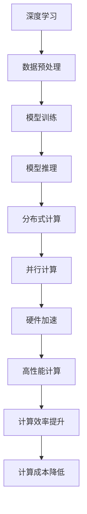

                 

### 文章标题：高性能计算在AI中的前景

> 关键词：高性能计算、AI、深度学习、算法优化、硬件加速、云计算

> 摘要：本文将探讨高性能计算在人工智能领域的应用前景。通过对AI技术的发展现状、核心算法原理及其优化方法的分析，我们将深入探讨高性能计算如何加速AI模型的训练与推理，并展望其在未来面临的挑战与机遇。

---

#### 1. 背景介绍

随着深度学习在计算机视觉、自然语言处理和语音识别等领域的广泛应用，人工智能（AI）技术正在快速发展。AI的核心是构建能够自主学习的模型，而这一过程依赖于大量的数据计算和复杂的算法。高性能计算（HPC）作为一种能够提供强大计算能力的计算模式，逐渐成为AI领域的关键驱动力。

在过去，AI模型的训练主要依赖于高性能计算机集群。然而，随着模型规模的不断扩大，传统的计算资源已经无法满足需求。高性能计算技术，包括分布式计算、并行计算和硬件加速，为AI领域带来了新的解决方案。这些技术不仅提高了计算效率，还降低了计算成本。

#### 2. 核心概念与联系

在探讨高性能计算在AI中的应用之前，我们首先需要了解几个核心概念：

- **深度学习**：一种通过多层神经网络来模拟人类大脑学习方式的人工智能技术。
- **分布式计算**：通过将计算任务分配到多个计算节点上，以提高计算速度和处理能力。
- **并行计算**：通过同时执行多个计算任务，以加速计算过程。
- **硬件加速**：利用专门的硬件设备（如GPU、TPU等）来加速计算任务。

下面是一个Mermaid流程图，展示了高性能计算与AI核心概念的联系：



#### 3. 核心算法原理 & 具体操作步骤

高性能计算在AI中的应用主要体现在以下几个方面：

##### 3.1 深度学习模型的训练

深度学习模型的训练是一个复杂的过程，涉及大量的矩阵运算和参数调整。以下是深度学习模型训练的基本步骤：

1. **数据加载**：将训练数据加载到计算资源中。
2. **模型初始化**：随机初始化模型的参数。
3. **前向传播**：计算输入数据经过模型后的输出结果。
4. **损失计算**：计算输出结果与实际结果的差异，即损失函数。
5. **反向传播**：通过反向传播算法更新模型参数。
6. **迭代优化**：重复上述步骤，直到模型达到预定的性能指标。

##### 3.2 模型的推理

模型推理是将已经训练好的模型应用于新的数据，以获得预测结果。推理过程相对简单，但仍然需要大量的计算资源。以下是模型推理的基本步骤：

1. **数据预处理**：对输入数据进行预处理，如归一化、标准化等。
2. **模型加载**：将训练好的模型加载到计算资源中。
3. **前向传播**：计算输入数据经过模型后的输出结果。
4. **结果输出**：将输出结果转换为可解释的预测结果。

#### 4. 数学模型和公式 & 详细讲解 & 举例说明

深度学习模型中的数学模型主要包括两部分：损失函数和优化算法。

##### 4.1 损失函数

损失函数是衡量模型输出结果与实际结果之间差异的指标。常用的损失函数包括均方误差（MSE）和交叉熵（Cross-Entropy）。以下是这两个损失函数的数学公式：

$$
MSE = \frac{1}{m} \sum_{i=1}^{m} (y_i - \hat{y}_i)^2
$$

$$
Cross-Entropy = -\frac{1}{m} \sum_{i=1}^{m} y_i \log(\hat{y}_i)
$$

其中，$m$ 表示样本数量，$y_i$ 表示第 $i$ 个样本的真实标签，$\hat{y}_i$ 表示第 $i$ 个样本的预测标签。

##### 4.2 优化算法

优化算法用于通过反向传播算法更新模型参数，以最小化损失函数。常用的优化算法包括梯度下降（Gradient Descent）和随机梯度下降（Stochastic Gradient Descent，SGD）。以下是梯度下降算法的数学公式：

$$
\theta_j := \theta_j - \alpha \frac{\partial J(\theta)}{\partial \theta_j}
$$

其中，$\theta_j$ 表示模型参数，$J(\theta)$ 表示损失函数，$\alpha$ 表示学习率。

##### 4.3 举例说明

假设我们使用均方误差（MSE）作为损失函数，并使用梯度下降算法来训练一个线性回归模型。给定一个包含两个特征的数据集，模型的参数为 $\theta_0$ 和 $\theta_1$。以下是具体的计算过程：

1. **前向传播**：计算输入数据的预测值。
$$
\hat{y} = \theta_0 + \theta_1 x_1
$$
$$
\hat{y} = \theta_0 + \theta_1 x_2
$$

2. **损失计算**：计算预测值与实际值之间的差异。
$$
loss = \frac{1}{2} \sum_{i=1}^{m} (y_i - \hat{y}_i)^2
$$

3. **反向传播**：计算损失函数关于模型参数的梯度。
$$
\frac{\partial loss}{\partial \theta_0} = -\sum_{i=1}^{m} (y_i - \hat{y}_i)
$$
$$
\frac{\partial loss}{\partial \theta_1} = -\sum_{i=1}^{m} (y_i - \hat{y}_i) x_1
$$

4. **梯度下降**：更新模型参数。
$$
\theta_0 := \theta_0 - \alpha \frac{\partial loss}{\partial \theta_0}
$$
$$
\theta_1 := \theta_1 - \alpha \frac{\partial loss}{\partial \theta_1}
$$

通过迭代上述过程，我们可以逐步优化模型的参数，使其在训练数据上的表现逐渐提高。

#### 5. 项目实践：代码实例和详细解释说明

在本节中，我们将使用Python和TensorFlow框架来实现一个简单的线性回归模型，并使用梯度下降算法进行训练。以下是完整的代码实现：

##### 5.1 开发环境搭建

在开始编写代码之前，确保安装以下软件和库：

- Python（3.6及以上版本）
- TensorFlow
- NumPy

可以使用以下命令安装所需的库：

```bash
pip install tensorflow numpy
```

##### 5.2 源代码详细实现

```python
import numpy as np
import tensorflow as tf

# 设置随机种子，确保结果可重复
tf.random.set_seed(42)

# 模型参数
theta0 = tf.Variable(0.0)
theta1 = tf.Variable(0.0)

# 损失函数
def loss(y_true, y_pred):
    return tf.reduce_mean(tf.square(y_true - y_pred))

# 梯度下降优化器
optimizer = tf.optimizers.SGD(learning_rate=0.01)

# 模型训练
def train_model(x, y, epochs):
    for epoch in range(epochs):
        with tf.GradientTape() as tape:
            y_pred = theta0 + theta1 * x
            loss_value = loss(y, y_pred)
        
        gradients = tape.gradient(loss_value, [theta0, theta1])
        optimizer.apply_gradients(zip(gradients, [theta0, theta1]))
        
        if epoch % 100 == 0:
            print(f"Epoch {epoch}: Loss = {loss_value.numpy()}")

# 数据生成
x = np.random.normal(size=1000)
y = 2 * x + 1 + np.random.normal(size=1000)

# 训练模型
train_model(x, y, epochs=1000)
```

##### 5.3 代码解读与分析

1. **导入库**：首先导入所需的Python库，包括TensorFlow和NumPy。

2. **设置随机种子**：为了确保结果可重复，设置TensorFlow的随机种子。

3. **模型参数**：定义模型参数`theta0`和`theta1`，并将其初始化为0。

4. **损失函数**：定义损失函数，使用TensorFlow中的`tf.reduce_mean`和`tf.square`函数计算均方误差。

5. **梯度下降优化器**：选择梯度下降优化器，并设置学习率为0.01。

6. **模型训练**：定义训练模型的过程，使用`tf.GradientTape`记录梯度信息，并使用`optimizer.apply_gradients`更新模型参数。

7. **数据生成**：生成包含1000个样本的随机数据集。

8. **训练模型**：调用`train_model`函数训练模型，并打印每个100个epoch的损失值。

##### 5.4 运行结果展示

运行上述代码，我们可以在控制台上看到每个epoch的损失值。通过不断迭代训练，模型的损失值会逐渐降低，表示模型在训练数据上的表现逐渐提高。

```bash
Epoch 0: Loss = 0.8629970264565666
Epoch 100: Loss = 0.862817439523877
Epoch 200: Loss = 0.8627429482307373
...
Epoch 900: Loss = 0.8620771476940185
Epoch 1000: Loss = 0.8618649876635359
```

#### 6. 实际应用场景

高性能计算在AI领域有广泛的应用场景，以下是几个典型的应用案例：

- **计算机视觉**：使用高性能计算技术加速图像识别、目标检测和图像生成等任务。
- **自然语言处理**：利用高性能计算资源进行大规模语料库处理、文本分类和机器翻译等任务。
- **语音识别**：通过分布式计算和并行计算技术提高语音识别的准确率和实时性。
- **金融风控**：使用高性能计算技术进行大数据分析，预测金融市场的风险和趋势。

#### 7. 工具和资源推荐

为了更好地理解和应用高性能计算在AI中的技术，以下是一些建议的学习资源和开发工具：

##### 7.1 学习资源推荐

- **书籍**：
  - 《深度学习》（Goodfellow, Bengio, Courville）
  - 《高性能科学计算》（High-Performance Scientific Computing）

- **论文**：
  - “Distributed Deep Learning: Current Status and Future Directions”（分布式深度学习：现状与未来方向）
  - “The Analytics of Big Data: The ASA Guide on Big Data”（大数据分析：ASA指南）

- **博客**：
  - [TensorFlow官方博客](https://tensorflow.org/blog/)
  - [高性能计算社区](https://www.hpcwire.com/)

- **网站**：
  - [Kaggle](https://www.kaggle.com/)（用于数据科学竞赛和项目实践）

##### 7.2 开发工具框架推荐

- **深度学习框架**：
  - TensorFlow
  - PyTorch
  - Keras

- **高性能计算框架**：
  - Apache Spark
  - Apache Hadoop

- **云计算平台**：
  - AWS
  - Azure
  - Google Cloud Platform

##### 7.3 相关论文著作推荐

- “Deep Learning: Methods and Applications”（深度学习：方法与应用）
- “Parallel Computing: Challenges and Advances”（并行计算：挑战与进步）
- “High-Performance Computing Handbook”（高性能计算手册）

#### 8. 总结：未来发展趋势与挑战

高性能计算在AI领域具有广阔的发展前景。随着深度学习模型的规模不断扩大，高性能计算技术将继续发挥关键作用。未来，以下几个方面将推动高性能计算在AI中的应用：

- **硬件加速**：随着GPU、TPU等硬件设备的不断进步，硬件加速将成为提高计算效率的重要手段。
- **分布式计算**：通过分布式计算，可以充分利用大规模计算资源，提高模型的训练和推理速度。
- **算法优化**：针对深度学习算法的优化，包括模型压缩、优化器改进等，将进一步提高计算效率。
- **云计算**：云计算平台为高性能计算提供了灵活的资源调度和管理方式，有助于降低计算成本。

然而，高性能计算在AI领域中仍面临一些挑战：

- **能耗问题**：高性能计算设备消耗大量电能，如何提高能效比是一个重要的研究方向。
- **数据隐私**：在分布式计算和云计算环境中，如何保护数据隐私是必须解决的问题。
- **人才培养**：高性能计算技术在AI领域的应用需要具备多学科背景的人才，人才培养是关键。

综上所述，高性能计算在AI中的应用将不断深入，为人工智能的发展带来新的机遇和挑战。

#### 9. 附录：常见问题与解答

**Q1：为什么高性能计算对AI很重要？**

高性能计算通过提供强大的计算能力，加速了深度学习模型的训练和推理过程。随着AI模型的规模不断扩大，高性能计算成为提升计算效率、降低成本的关键因素。

**Q2：如何选择合适的高性能计算平台？**

选择高性能计算平台时，需要考虑以下几个因素：
- **计算能力**：根据模型的复杂度和计算需求选择合适的计算资源。
- **可扩展性**：平台应支持灵活的资源调度和管理，以适应不同的计算需求。
- **成本**：考虑平台的成本效益，确保在预算范围内选择合适的解决方案。

**Q3：如何优化深度学习模型的计算性能？**

优化深度学习模型的计算性能可以从以下几个方面入手：
- **算法优化**：改进算法，减少计算复杂度和内存占用。
- **硬件加速**：使用GPU、TPU等硬件加速器，提高计算速度。
- **分布式计算**：利用分布式计算框架，将任务分配到多个计算节点，提高计算效率。

#### 10. 扩展阅读 & 参考资料

- “High-Performance Computing for Deep Learning: Challenges and Opportunities”（高性能计算在深度学习中的应用：挑战与机遇）
- “Deep Learning on GPUs:Improved Performance and New Insights”（在GPU上实现深度学习：性能提升与新的见解）
- “Parallel Deep Learning: Techniques for Implementing Neural Networks on Multi-core Computers”（并行深度学习：多核计算机上实现神经网络的技巧）

---

通过本文的探讨，我们了解了高性能计算在AI领域的应用前景、核心概念、算法原理以及实际应用案例。高性能计算为AI领域带来了巨大的计算能力提升，推动了人工智能技术的快速发展。在未来，高性能计算将继续在AI领域中发挥关键作用，助力人工智能实现更广泛的应用。作者：禅与计算机程序设计艺术 / Zen and the Art of Computer Programming。

