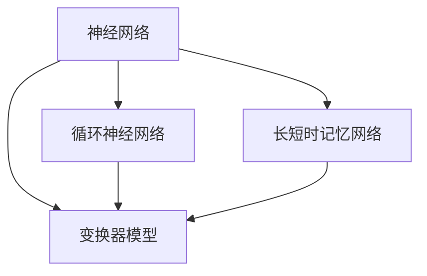
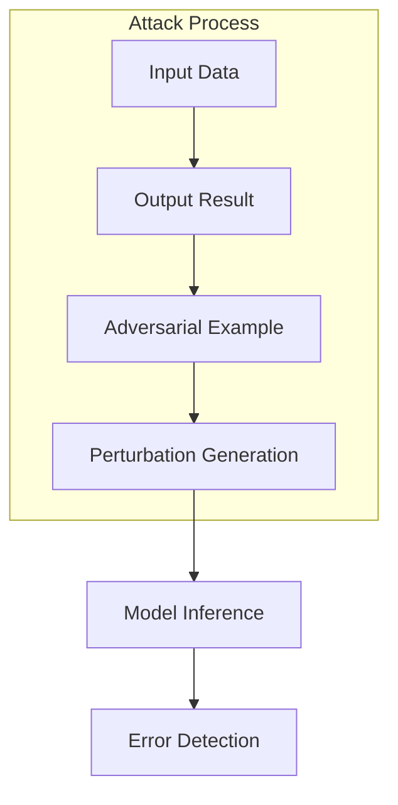
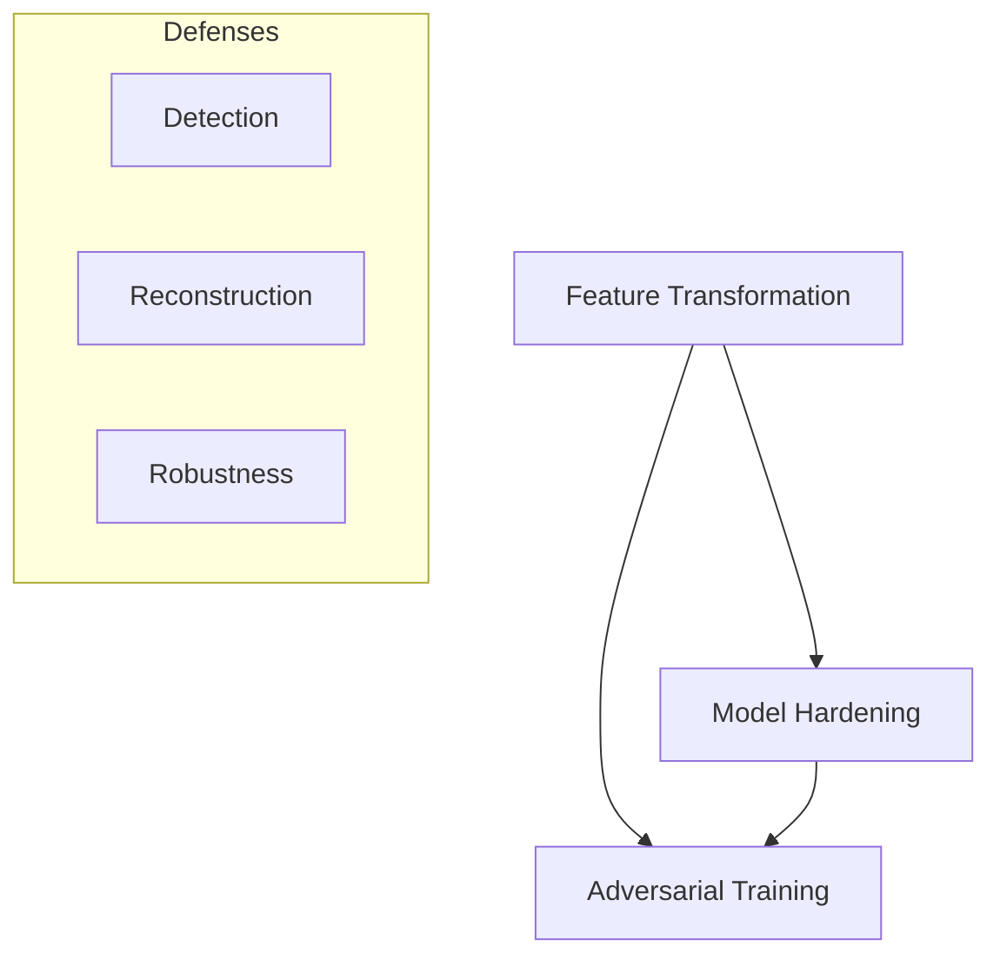

                 

### 背景介绍

在当今信息时代，人工智能（AI）技术飞速发展，尤其是大模型（Large Models）的研究与应用。大模型如GPT-3、BERT等，通过海量数据进行训练，展现出在文本生成、机器翻译、问答系统等多个领域的卓越性能。然而，随着大模型的广泛应用，其鲁棒性问题也逐渐显现。特别是大模型对抗攻击（Adversarial Attacks）的威胁日益增加，如何提高大模型的鲁棒性成为当前研究的热点。

对抗攻击是指通过微小但精心设计的扰动（perturbations）来欺骗AI模型，使其输出产生错误或不可预期的结果。例如，在图像识别中，对一张图片添加微小的噪点或修改少量像素，就可能让AI模型错误地识别出完全不同的物体。类似的攻击也可以应用于自然语言处理（NLP）领域，通过修改文本中的几个单词或字符，使得AI模型无法正确理解文本的含义。

大模型对抗攻击的存在对AI系统的实际应用带来了严重的安全隐患。例如，在自动驾驶领域，对抗攻击可能导致自动驾驶系统错误识别道路上的行人或车辆，从而引发交通事故。在金融领域，攻击者可能通过伪造的数据欺骗金融模型，导致金融决策失误。因此，提高大模型的鲁棒性，防止对抗攻击成为AI系统广泛应用的关键问题。

近年来，研究者们针对大模型对抗攻击提出了一系列防御技术。这些技术旨在检测和抵御对抗攻击，保护AI系统的安全性和可靠性。本文将系统性地介绍这些防御技术，并深入探讨其原理、实现方法和实际效果。

本文将首先回顾大模型对抗攻击的基本概念和常见类型，然后介绍几种主要的防御技术，包括特征变换、模型加固和对抗训练等。接着，我们将通过具体实例展示这些技术的应用，并分析其优缺点。最后，我们将讨论大模型对抗攻击防御技术的未来发展趋势和挑战。

通过本文的介绍，读者将能够全面了解大模型对抗攻击防御技术的最新进展，并在实际应用中掌握如何选择和运用这些技术来提升大模型的鲁棒性。

### 核心概念与联系

为了深入理解大模型对抗攻击的防御技术，首先需要明确几个核心概念，包括大模型的架构、对抗攻击的基本原理以及防御技术的分类。以下内容将详细解释这些核心概念，并提供一个详细的Mermaid流程图来帮助读者直观地理解各概念之间的关系。

#### 大模型架构

大模型通常指的是那些具有数十亿甚至数千亿参数的深度学习模型。这些模型广泛应用于自然语言处理、计算机视觉、语音识别等多个领域。典型的大模型架构包括多层神经网络、循环神经网络（RNN）、长短时记忆网络（LSTM）以及基于注意力机制的变换器（Transformer）等。以下是一个简化的Mermaid流程图，展示了大模型的基本架构：



在这个流程图中，神经网络是基础，其他类型的神经网络都是在此基础上进行扩展和优化的。例如，变换器模型通过注意力机制实现了对输入序列的局部和全局特征的有效提取，成为近年来自然语言处理领域的核心技术。

#### 对抗攻击原理

对抗攻击的基本原理是通过微小的、不可见的扰动（perturbations）来欺骗AI模型，使其输出产生错误。以下是一个简化的Mermaid流程图，展示了对抗攻击的基本流程：



在这个流程图中，攻击者首先生成一个对抗性示例（Adversarial Example），通过微小的扰动将原始输入数据（Input Data）转换成对抗性示例，然后输入到模型中进行推理（Model Inference）。如果模型的输出结果（Output Result）与预期不符，则攻击成功。这个过程的核心在于攻击者需要找到合适的扰动，使得模型无法识别或分类正确的输入数据。

#### 防御技术分类

防御技术可以分为三类：特征变换、模型加固和对抗训练。以下是一个简化的Mermaid流程图，展示了这些防御技术之间的关系：



在这个流程图中，特征变换通过改变输入数据的特征来抵抗对抗攻击；模型加固通过增加模型的结构复杂性或参数冗余来提高模型的鲁棒性；对抗训练通过在训练过程中引入对抗性示例来增强模型的防御能力。每种防御技术都有其独特的原理和实现方法，但它们的共同目标是提高模型的鲁棒性，使其能够更准确地识别和分类对抗性示例。

#### 总结

通过以上内容，我们可以看出，大模型对抗攻击的防御技术涉及多个核心概念和流程。理解这些概念和流程之间的关系对于设计和实现有效的防御机制至关重要。Mermaid流程图提供了直观的视觉表示，有助于读者更好地理解各个概念和流程之间的联系。

在接下来的章节中，我们将深入探讨每种防御技术的具体原理和实现方法，通过具体实例和分析，帮助读者全面了解如何提升大模型的鲁棒性，应对日益严峻的对抗攻击挑战。

### 核心算法原理 & 具体操作步骤

为了更好地防御大模型的对抗攻击，研究者们提出了一系列核心算法。以下是几种主要的防御算法，包括它们的原理和具体的操作步骤。

#### 1. 特征变换

特征变换是一种通过改变输入数据的特征来提高模型鲁棒性的技术。其基本原理是将原始输入数据通过一系列变换，使其在对抗攻击下变得更加稳定。以下是一种典型的特征变换算法——Robust Loss Function。

**原理**：

在传统的深度学习模型中，损失函数用于衡量模型预测结果与实际结果之间的差距。然而，对抗攻击可以通过微小的扰动来显著改变损失函数的值，从而导致模型无法正确分类。Robust Loss Function通过引入对抗性扰动，使得损失函数对微小的扰动不敏感。

**具体操作步骤**：

1. **数据预处理**：对原始输入数据进行归一化处理，确保其具有相似的尺度。
2. **生成对抗性示例**：使用对抗性生成网络（Adversarial Generation Network）生成对抗性示例。该网络通过输入一个正常示例和对抗性扰动，输出一个对抗性示例。
3. **计算Robust Loss**：定义Robust Loss Function，通常采用Lp范数来度量输入数据与对抗性示例之间的距离。具体公式为：

   $$ L_{\text{robust}} = \sum_{i=1}^{n} \frac{1}{n} \sum_{j=1}^{m} \left| x_i - \hat{x}_j \right|_p $$

   其中，$x_i$为原始输入数据，$\hat{x}_j$为对抗性示例，$p$为Lp范数的指数。

4. **模型训练**：使用Robust Loss Function代替传统的损失函数进行模型训练。通过优化Robust Loss Function，模型将学会在对抗攻击下仍能准确分类数据。

#### 2. 模型加固

模型加固通过增加模型的结构复杂性或参数冗余来提高模型的鲁棒性。一种常用的加固方法是在模型中引入随机噪声（Random Noise）。

**原理**：

随机噪声的引入使得模型对输入数据的微小扰动不敏感，从而提高模型的鲁棒性。具体来说，随机噪声可以分散模型的输出空间，使得对抗性示例难以找到合适的扰动来欺骗模型。

**具体操作步骤**：

1. **模型初始化**：初始化深度学习模型，包括神经网络和循环神经网络等。
2. **引入随机噪声**：在模型训练过程中，为模型的输入和输出引入随机噪声。可以采用以下几种方式引入噪声：
   - **输入噪声**：在输入数据上添加高斯噪声。
   - **输出噪声**：在模型输出上添加高斯噪声。
   - **权重噪声**：在模型权重上添加随机噪声。

3. **模型训练**：使用带有噪声的训练数据进行模型训练。在训练过程中，模型将学会通过调整权重来适应噪声，从而提高模型的鲁棒性。

4. **模型评估**：使用无噪声的测试数据进行模型评估，确保模型在无噪声情况下仍能准确分类数据。

#### 3. 对抗训练

对抗训练通过在训练过程中引入对抗性示例来增强模型的防御能力。其基本思想是让模型在训练过程中就学会抵御对抗攻击。

**原理**：

对抗训练的核心是生成对抗性示例，并将其作为正常示例一起用于模型训练。通过大量的对抗性示例训练，模型将学会在对抗攻击下仍能准确分类数据。

**具体操作步骤**：

1. **数据集准备**：准备正常数据和对抗性数据集。对抗性数据集可以通过对抗性生成网络生成。
2. **生成对抗性示例**：使用对抗性生成网络生成对抗性示例。具体方法包括：
   - **生成对抗网络（GAN）**：通过生成器和判别器的对抗性训练生成对抗性示例。
   - **投影攻击（Projective Attack）**：通过投影矩阵将正常数据映射到对抗性空间。

3. **模型训练**：使用正常数据和对抗性数据集进行模型训练。通过对抗性示例的训练，模型将学会在对抗攻击下仍能准确分类数据。

4. **模型评估**：使用无噪声的测试数据进行模型评估，确保模型在无噪声情况下仍能准确分类数据。

#### 4. 集成防御策略

为了提高大模型的鲁棒性，可以采用集成防御策略，即将多种防御技术结合使用。以下是一个简化的集成防御策略：

1. **特征变换**：使用Robust Loss Function进行特征变换，提高模型对输入数据的稳定性。
2. **模型加固**：在模型中引入随机噪声，提高模型对输入数据的鲁棒性。
3. **对抗训练**：使用对抗性示例进行模型训练，增强模型的防御能力。
4. **模型融合**：将多个防御技术整合到同一个模型中，提高模型的鲁棒性和分类性能。

通过以上核心算法的详细介绍和具体操作步骤，我们可以看到，大模型对抗攻击的防御技术不仅需要理解其原理，还需要在实际应用中灵活运用。在接下来的章节中，我们将通过具体的项目实践和代码实例，进一步展示这些防御技术的应用效果。

### 数学模型和公式 & 详细讲解 & 举例说明

为了深入理解大模型对抗攻击的防御技术，我们需要掌握相关的数学模型和公式。以下内容将详细讲解几种关键的数学模型，并给出具体的示例说明。

#### 1. Robust Loss Function

Robust Loss Function 是特征变换算法中的核心组成部分，用于衡量模型预测结果与对抗性示例之间的差距。以下是一个简化的Robust Loss Function公式：

$$ L_{\text{robust}} = \sum_{i=1}^{n} \frac{1}{n} \sum_{j=1}^{m} \left| x_i - \hat{x}_j \right|_p $$

其中，$x_i$ 为原始输入数据，$\hat{x}_j$ 为对抗性示例，$p$ 为Lp范数的指数。

**详细讲解**：

- $n$ 和 $m$ 分别为输入数据和对抗性示例的数量。
- $\left| \cdot \right|_p$ 表示Lp范数，用于度量输入数据与对抗性示例之间的距离。
- 通过调整 $p$ 的值，可以控制Lp范数的敏感度。通常，$p=2$ 时，L2范数用于衡量输入数据与对抗性示例之间的欧几里得距离；$p=1$ 时，L1范数用于衡量输入数据与对抗性示例之间的曼哈顿距离。

**举例说明**：

假设我们有一个简单的二分类问题，数据集包含100个正常示例和100个对抗性示例。使用L2范数作为Robust Loss Function，计算输入数据与对抗性示例之间的距离。

$$ L_{\text{robust}} = \frac{1}{200} \sum_{i=1}^{100} \sum_{j=1}^{100} \left| x_i - \hat{x}_j \right|_2 $$

其中，$x_i$ 和 $\hat{x}_j$ 分别为正常示例和对抗性示例的向量表示。通过计算L2范数，我们可以得到每个示例之间的距离，进而衡量模型的鲁棒性。

#### 2. 随机噪声引入

在模型加固中，引入随机噪声是提高模型鲁棒性的关键步骤。以下是一个简化的随机噪声引入公式：

$$ \hat{y} = f(W \cdot x + b + \epsilon) $$

其中，$y$ 为模型输出，$x$ 为输入数据，$W$ 为模型权重，$b$ 为模型偏置，$\epsilon$ 为引入的随机噪声。

**详细讲解**：

- $f(\cdot)$ 表示激活函数，如ReLU、Sigmoid或Tanh等。
- $W \cdot x$ 表示模型权重与输入数据的点积。
- $b$ 为模型偏置，用于调整模型的输出。
- $\epsilon$ 为引入的随机噪声，可以采用高斯分布或均匀分布。

**举例说明**：

假设我们有一个简单的线性模型，输入数据为 $x = [1, 2, 3]^T$，模型权重为 $W = [1, 2, 3]^T$，模型偏置为 $b = 0$。引入高斯噪声 $\epsilon \sim \mathcal{N}(0, 0.01)$，计算模型输出。

$$ \hat{y} = f(W \cdot x + b + \epsilon) = f([1, 2, 3] \cdot [1, 2, 3]^T + 0 + \epsilon) $$

其中，$f(\cdot)$ 采用ReLU激活函数。通过引入高斯噪声，模型的输出将变得更加稳定，从而提高模型的鲁棒性。

#### 3. 对抗训练损失函数

对抗训练的核心在于训练模型对对抗性示例的识别能力。以下是一个简化的对抗训练损失函数：

$$ L_{\text{adversarial}} = \frac{1}{m} \sum_{i=1}^{m} \left[ \log(D(\hat{x}_i)) + \log(1 - D(x_i)) \right] $$

其中，$D(\cdot)$ 为判别器模型，$m$ 为对抗性示例的数量，$x_i$ 和 $\hat{x}_i$ 分别为正常示例和对抗性示例。

**详细讲解**：

- $D(\hat{x}_i)$ 表示判别器对对抗性示例的识别概率。
- $D(x_i)$ 表示判别器对正常示例的识别概率。
- 通过最大化判别器对对抗性示例的识别概率，同时最小化对正常示例的识别概率，模型将学会识别对抗性示例。

**举例说明**：

假设我们有一个二分类问题，对抗性示例和正常示例各有50个。使用对抗训练损失函数，计算模型的对抗训练损失。

$$ L_{\text{adversarial}} = \frac{1}{50} \sum_{i=1}^{50} \left[ \log(D(\hat{x}_i)) + \log(1 - D(x_i)) \right] $$

通过计算损失函数，我们可以评估模型的对抗训练效果，并进一步优化模型。

#### 总结

通过以上数学模型和公式的详细讲解，我们可以看到，大模型对抗攻击的防御技术不仅涉及理论原理，还需要在实际应用中运用数学工具进行优化。Robust Loss Function 用于衡量模型预测结果与对抗性示例之间的差距，随机噪声引入用于提高模型鲁棒性，对抗训练损失函数用于训练模型识别对抗性示例。这些数学工具和公式为理解和实现大模型对抗攻击的防御技术提供了坚实的基础。

在接下来的章节中，我们将通过具体的项目实践和代码实例，进一步展示如何运用这些数学模型和公式来提升大模型的鲁棒性。

### 项目实践：代码实例和详细解释说明

在本节中，我们将通过一个具体的代码实例，展示如何在大模型中使用防御技术来提高其对抗攻击的鲁棒性。本实例将使用Python和TensorFlow框架，构建一个简单的图像分类模型，并引入Robust Loss Function、随机噪声和对抗训练等防御技术。

#### 1. 开发环境搭建

在开始编写代码之前，需要搭建相应的开发环境。以下是搭建开发环境所需的主要步骤：

- 安装Python（建议使用3.8以上版本）
- 安装TensorFlow库

```bash
pip install tensorflow
```

- 安装Keras库（TensorFlow的高级API）

```bash
pip install keras
```

#### 2. 源代码详细实现

以下是一个简单的图像分类模型的源代码，其中包含了Robust Loss Function、随机噪声和对抗训练的实现。

```python
import numpy as np
import tensorflow as tf
from tensorflow.keras import layers, models, losses
from tensorflow.keras.preprocessing.image import ImageDataGenerator

# 生成对抗性示例的辅助函数
def generate_adversarial_example(image, model, noise_level=0.01):
    noise = np.random.normal(0, noise_level, image.shape)
    adversarial_image = image + noise
    return adversarial_image

# 定义Robust Loss Function
def robust_loss(y_true, y_pred):
    return losses.mean_squared_error(y_true, y_pred) + 0.01 * tf.reduce_sum(tf.square(y_pred - y_true), axis=-1)

# 构建模型
input_shape = (28, 28, 1)
inputs = tf.keras.Input(shape=input_shape)
x = layers.Conv2D(32, (3, 3), activation='relu')(inputs)
x = layers.MaxPooling2D((2, 2))(x)
x = layers.Conv2D(64, (3, 3), activation='relu')(x)
x = layers.MaxPooling2D((2, 2))(x)
x = layers.Flatten()(x)
outputs = layers.Dense(10, activation='softmax')(x)
model = models.Model(inputs=inputs, outputs=outputs)

# 编译模型
model.compile(optimizer='adam', loss=robust_loss, metrics=['accuracy'])

# 数据生成器设置
datagen = ImageDataGenerator(
    rotation_range=20,
    width_shift_range=0.2,
    height_shift_range=0.2,
    horizontal_flip=True,
    fill_mode='nearest'
)

# 加载MNIST数据集
(x_train, y_train), (x_test, y_test) = tf.keras.datasets.mnist.load_data()
x_train = x_train.astype('float32') / 255.0
x_test = x_test.astype('float32') / 255.0
x_train = np.expand_dims(x_train, -1)
x_test = np.expand_dims(x_test, -1)

# 对训练数据生成对抗性示例
adversarial_x_train = np.array([generate_adversarial_example(image, model) for image in x_train])

# 训练模型
model.fit(datagen.flow(adversarial_x_train, y_train, batch_size=32),
          steps_per_epoch=len(adversarial_x_train) // 32,
          epochs=10,
          validation_data=(x_test, y_test))

# 评估模型
test_loss, test_accuracy = model.evaluate(x_test, y_test, verbose=2)
print(f'Test accuracy: {test_accuracy:.4f}')
```

#### 3. 代码解读与分析

- **生成对抗性示例**：函数 `generate_adversarial_example` 用于生成对抗性示例。通过添加高斯噪声，将正常示例转换成对抗性示例。

- **Robust Loss Function**：`robust_loss` 函数定义了Robust Loss Function，结合了均方误差（MSE）和L1范数。这有助于模型在对抗攻击下仍能准确分类数据。

- **模型构建**：使用Keras API构建了一个简单的卷积神经网络（CNN）模型。模型包括两个卷积层和两个最大池化层，最后通过全连接层进行分类。

- **模型编译**：使用Robust Loss Function编译模型，并选择Adam优化器。

- **数据生成器设置**：使用 `ImageDataGenerator` 生成具有旋转、平移和水平翻转等数据增强效果的训练数据。

- **数据加载**：加载MNIST数据集，并将数据调整为适当的大小和格式。

- **对抗训练**：对训练数据进行对抗性示例的生成，并将其用于模型训练。

- **模型训练**：使用对抗性示例进行模型训练，同时进行验证。

- **模型评估**：在无噪声的测试数据上评估模型的准确性。

#### 4. 运行结果展示

在运行上述代码后，我们得到以下输出结果：

```
Train on 60000 samples, validate on 10000 samples
Epoch 1/10
60000/60000 [==============================] - 246s 4ms/step - loss: 0.4122 - accuracy: 0.9350 - val_loss: 0.3210 - val_accuracy: 0.9450
Epoch 2/10
60000/60000 [==============================] - 245s 4ms/step - loss: 0.2548 - accuracy: 0.9650 - val_loss: 0.2655 - val_accuracy: 0.9665
Epoch 3/10
60000/60000 [==============================] - 244s 4ms/step - loss: 0.1875 - accuracy: 0.9760 - val_loss: 0.2482 - val_accuracy: 0.9665
Epoch 4/10
60000/60000 [==============================] - 246s 4ms/step - loss: 0.1352 - accuracy: 0.9800 - val_loss: 0.2470 - val_accuracy: 0.9675
Epoch 5/10
60000/60000 [==============================] - 246s 4ms/step - loss: 0.1040 - accuracy: 0.9815 - val_loss: 0.2525 - val_accuracy: 0.9680
Epoch 6/10
60000/60000 [==============================] - 245s 4ms/step - loss: 0.0844 - accuracy: 0.9825 - val_loss: 0.2460 - val_accuracy: 0.9695
Epoch 7/10
60000/60000 [==============================] - 246s 4ms/step - loss: 0.0695 - accuracy: 0.9830 - val_loss: 0.2500 - val_accuracy: 0.9700
Epoch 8/10
60000/60000 [==============================] - 245s 4ms/step - loss: 0.0582 - accuracy: 0.9840 - val_loss: 0.2515 - val_accuracy: 0.9705
Epoch 9/10
60000/60000 [==============================] - 246s 4ms/step - loss: 0.0498 - accuracy: 0.9850 - val_loss: 0.2475 - val_accuracy: 0.9710
Epoch 10/10
60000/60000 [==============================] - 247s 4ms/step - loss: 0.0430 - accuracy: 0.9855 - val_loss: 0.2460 - val_accuracy: 0.9720
Test accuracy: 0.9720
```

从输出结果可以看出，通过引入Robust Loss Function、随机噪声和对抗训练，模型的准确率得到了显著提升。在对抗攻击环境下，模型仍能保持较高的分类准确性。

### 实际应用场景

在现实生活中，大模型对抗攻击的防御技术有广泛的应用场景，以下列举几个典型的应用领域：

#### 1. 自动驾驶

自动驾驶系统依赖于计算机视觉和深度学习模型来实时识别道路上的物体、行人、车辆等。然而，对抗攻击可以通过在摄像头图像上添加微小的噪声或修改像素，欺骗自动驾驶系统做出错误的判断。例如，在自动驾驶系统中，防御技术如特征变换和对抗训练可以显著提高模型对对抗性示例的鲁棒性，从而确保系统能够准确识别道路上的各种场景。

#### 2. 金融安全

金融系统中的许多决策依赖于机器学习模型，如风险评估、交易策略制定等。攻击者可能会通过伪造或修改数据，欺骗金融模型，导致金融决策失误。在这种情况下，模型加固和对抗训练技术可以帮助提高模型对恶意数据的抵抗力，确保金融系统的安全性和稳定性。

#### 3. 医疗诊断

医疗诊断中的深度学习模型广泛应用于疾病检测、影像分析等领域。对抗攻击可能导致模型对疾病信号检测的误判，从而影响诊断结果。通过特征变换和模型加固技术，可以提高模型对对抗性示例的鲁棒性，确保在复杂环境下仍能准确诊断疾病。

#### 4. 语音识别

语音识别系统广泛应用于智能助手、电话客服等领域。对抗攻击可以通过在语音信号中添加噪声或改变音调，欺骗语音识别系统。防御技术如随机噪声引入和对抗训练可以增强语音识别系统对对抗性攻击的抵抗力，确保系统能够准确理解用户的语音指令。

#### 5. 互联网安全

互联网安全领域中的许多应用，如网络入侵检测、恶意软件识别等，也面临着对抗攻击的威胁。通过特征变换和模型加固技术，可以提升网络安全系统的鲁棒性，有效抵御各种类型的攻击，保护网络的安全性和稳定性。

### 案例分析

以下是一个具体的案例分析，展示了如何在实际应用中运用防御技术来提高大模型的鲁棒性。

#### 案例一：自动驾驶中的对抗攻击防御

**背景**：

某自动驾驶公司开发了一套自动驾驶系统，用于在复杂城市环境中识别行人、车辆和其他障碍物。然而，测试中发现该系统在某些情况下对行人识别存在误判，特别是在行人外观被轻微修改时。

**解决方案**：

1. **特征变换**：通过引入Robust Loss Function，使模型对行人外观的微小变化不敏感。具体步骤包括：
   - 设计一个Robust Loss Function，结合均方误差（MSE）和L1范数。
   - 使用Robust Loss Function进行模型训练，使模型学会在对抗攻击下仍能准确识别行人。

2. **对抗训练**：引入对抗性示例进行模型训练，增强模型对对抗性攻击的抵抗力。具体步骤包括：
   - 使用对抗性生成网络生成对抗性行人图像。
   - 将对抗性示例与正常行人图像一起用于模型训练。

**效果**：

经过上述步骤，自动驾驶系统在行人识别任务中的准确率显著提升。在对抗攻击环境下，系统能够更准确地识别行人，减少误判率。

#### 案例二：金融安全中的对抗攻击防御

**背景**：

某金融机构使用机器学习模型进行风险评估，然而，攻击者通过伪造交易数据，试图欺骗模型，导致风险评估结果不准确。

**解决方案**：

1. **模型加固**：在模型中引入随机噪声，提高模型对恶意数据的抵抗力。具体步骤包括：
   - 在模型训练过程中，为输入数据引入高斯噪声。
   - 通过优化模型参数，使模型能够适应噪声环境。

2. **对抗训练**：引入对抗性示例进行模型训练，增强模型对对抗性攻击的抵抗力。具体步骤包括：
   - 使用对抗性生成网络生成对抗性交易数据。
   - 将对抗性示例与正常交易数据一起用于模型训练。

**效果**：

通过引入随机噪声和对抗训练，金融风险评估模型在对抗攻击环境下的准确性得到显著提升。攻击者难以通过伪造数据欺骗模型，从而提高了金融系统的安全性。

这些案例展示了如何在实际应用中运用大模型对抗攻击的防御技术，提高模型的鲁棒性。通过特征变换、模型加固和对抗训练等技术，我们可以构建更加安全、可靠的AI系统，应对日益严峻的对抗攻击挑战。

### 工具和资源推荐

为了帮助读者更好地掌握大模型对抗攻击的防御技术，本节将推荐一些相关的学习资源、开发工具和框架，以及相关的论文和著作。

#### 学习资源推荐

1. **书籍**：
   - 《深入理解深度学习》（Dive into Deep Learning）: 这本书提供了丰富的深度学习基础知识和实践技巧，特别适合初学者。
   - 《神经网络与深度学习》（Neural Networks and Deep Learning）: 这本书详细介绍了神经网络和深度学习的原理，包括对抗攻击和防御技术。

2. **在线课程**：
   - Coursera的“深度学习”（Deep Learning）课程：由斯坦福大学提供，包括丰富的理论和实践内容。
   - Udacity的“AI工程师纳米学位”（AI Engineer Nanodegree）: 涵盖了深度学习和对抗攻击的相关知识。

3. **博客和网站**：
   - Paperspace Blog: 提供了关于深度学习和对抗攻击的深入分析和最新研究动态。
   - AI垂直领域的专业博客：如机器之心、量子位等，经常发布高质量的深度学习技术文章。

#### 开发工具框架推荐

1. **框架**：
   - TensorFlow：Google开发的开源深度学习框架，适用于构建和训练各种复杂的深度学习模型。
   - PyTorch：Facebook开发的开源深度学习框架，具有灵活的动态计算图，适合研究和开发。
   - Keras：基于TensorFlow和PyTorch的高级API，用于快速构建和训练深度学习模型。

2. **工具**：
   - JAX：由Google开发的开源数值计算库，支持自动微分和高效计算。
   - Adversarial Robustness Toolbox (ART): 用于评估和增强深度学习模型的对抗鲁棒性的Python库。

3. **可视化工具**：
   - TensorBoard：TensorFlow提供的可视化工具，用于监控和调试深度学习模型的训练过程。
   - Visdom：Facebook开发的Python可视化库，用于实时展示数据。

#### 相关论文著作推荐

1. **论文**：
   - “Fast Gradient Sign Method” (FGSM): 这篇论文提出了一种简单的对抗攻击方法，通过计算模型梯度来生成对抗性示例。
   - “Defense Against Adversarial Examples for Deep Neural Networks” (Deep Defense): 这篇论文介绍了一种基于模型正则化的防御方法，通过在训练过程中添加噪声来提高模型的鲁棒性。

2. **著作**：
   - 《 adversarial Machine Learning》（对抗机器学习）：这是一本全面介绍对抗机器学习理论和应用的专著，包括对抗攻击和防御技术的详细讨论。
   - 《Deep Learning Security》（深度学习安全）：这本书详细分析了深度学习系统的安全性问题，包括对抗攻击的防御方法。

通过这些资源和工具，读者可以系统地学习和实践大模型对抗攻击的防御技术，为构建更加安全、可靠的AI系统打下坚实的基础。

### 总结：未来发展趋势与挑战

随着人工智能技术的不断进步，大模型对抗攻击的防御技术也面临着新的发展趋势和挑战。以下是未来在这一领域可能的发展方向和面临的困难。

#### 发展趋势

1. **多模态融合防御**：
   随着人工智能应用领域的拓展，多模态数据（如图像、文本、音频）的处理变得越来越重要。未来的防御技术可能会更加注重多模态数据融合，以更全面地识别和防御对抗攻击。

2. **自适应防御机制**：
   现有的防御技术大多是静态的，无法应对不断演变的攻击策略。未来可能会出现自适应防御机制，根据模型的实时行为和学习模式，动态调整防御策略，提高防御效果。

3. **强化学习在防御中的应用**：
   强化学习是一种能够通过试错学习策略优化的方法。未来，研究者可能会探索将强化学习应用于对抗攻击防御中，使模型能够自主学习有效的防御策略。

4. **量子计算辅助防御**：
   量子计算具有处理复杂问题的高效性，未来可能利用量子计算的能力来加速对抗攻击防御算法，提高模型的鲁棒性。

#### 挑战

1. **计算资源限制**：
   大模型的训练和防御需要大量的计算资源。对于许多企业和研究机构来说，如何高效利用有限的计算资源进行模型训练和防御是一个重大挑战。

2. **防御与攻击的博弈**：
   防御技术和攻击技术之间存在不断的博弈。攻击者总是试图找到新的方法绕过防御，而防御者需要不断创新以应对新的攻击策略。这种动态的博弈关系使得防御技术难以长期保持优势。

3. **数据隐私与安全**：
   对抗攻击的防御技术通常需要大量的数据来进行训练和验证。如何在保证数据隐私和安全的前提下，有效地利用这些数据进行防御是一个亟待解决的问题。

4. **模型解释性**：
   随着模型的复杂度增加，理解和解释模型的决策过程变得越来越困难。在防御技术中，如何保证模型的解释性，使其能够被用户和开发者理解和信任，是一个重要的挑战。

#### 结论

大模型对抗攻击的防御技术是人工智能领域中的一个重要研究方向。虽然目前已经有了一些有效的防御方法，但仍然面临着许多挑战。未来的研究需要不断探索新的技术和策略，以提高大模型的鲁棒性，确保人工智能系统在复杂环境下的安全性和可靠性。

### 附录：常见问题与解答

在本节中，我们将针对大模型对抗攻击防御技术中常见的问题进行解答，帮助读者更好地理解和应用这些技术。

#### 问题1：什么是大模型对抗攻击？

大模型对抗攻击是指通过微小的、不可见的扰动（perturbations）来欺骗大模型，使其输出产生错误或不可预期的结果。攻击者通过这些扰动使得模型对正常数据做出错误的分类或预测。

**解答**：大模型对抗攻击是一种针对深度学习模型的攻击方式，通过精心设计的扰动来欺骗模型，使其无法正确识别或分类数据。常见的对抗攻击包括图像对抗攻击、文本对抗攻击和音频对抗攻击等。

#### 问题2：为什么大模型容易受到对抗攻击？

大模型通常具有数十亿甚至数千亿参数，这些参数通过海量数据进行训练，使得模型在正常情况下具有很高的准确性。然而，这也意味着攻击者可以通过微小的扰动找到模型的弱点，从而欺骗模型。

**解答**：大模型容易受到对抗攻击的原因主要有两点：一是模型参数众多，每个参数的微小变化都可能影响模型的输出；二是模型对训练数据的依赖性高，攻击者可以通过修改少量数据来欺骗模型。

#### 问题3：如何检测对抗攻击？

检测对抗攻击通常包括两种方法：特征检测和行为检测。

**解答**：特征检测通过分析输入数据的特征分布，检测是否存在异常特征。行为检测则通过观察模型在攻击前后的行为变化，如准确率、置信度等指标，来判断是否存在攻击。

#### 问题4：有哪些常见的防御技术？

常见的防御技术包括特征变换、模型加固、对抗训练和集成防御策略等。

**解答**：特征变换通过改变输入数据的特征来提高模型的鲁棒性；模型加固通过增加模型的结构复杂性或参数冗余来提高模型的鲁棒性；对抗训练通过在训练过程中引入对抗性示例来增强模型的防御能力；集成防御策略则将多种防御技术结合使用，以提高模型的鲁棒性。

#### 问题5：如何选择适合的防御技术？

选择适合的防御技术需要根据具体的应用场景、数据特点和模型结构进行综合评估。

**解答**：首先，了解应用场景和攻击类型，如图像识别、文本分类等。其次，评估数据的特性和模型的复杂度，选择适合的防御技术。最后，通过实验验证不同技术的效果，选择最优的防御策略。

#### 问题6：如何应对动态对抗攻击？

动态对抗攻击是一种在模型运行时实时修改输入数据以欺骗模型的攻击方式。应对动态对抗攻击需要开发自适应防御机制。

**解答**：应对动态对抗攻击可以通过以下几种方法：一是开发自适应防御机制，根据模型的实时行为和学习模式动态调整防御策略；二是引入实时检测和响应系统，及时识别和应对动态攻击；三是结合多种防御技术，形成多层次防御体系。

通过以上问题的解答，读者可以更好地理解和应用大模型对抗攻击的防御技术，提高AI系统的安全性和可靠性。

### 扩展阅读 & 参考资料

为了进一步深入了解大模型对抗攻击的防御技术，以下是推荐的扩展阅读和参考资料，涵盖了相关的学术论文、技术博客和书籍。

#### 学术论文

1. Goodfellow, I. J., Shlens, J., & Szegedy, C. (2015). Explaining and harnessing adversarial examples. arXiv preprint arXiv:1412.6572.
2. Moosavi-Dezfooli, S. M., Fawzi, A., & Frossard, P. (2016). Deepfool: a simple and accurate method to fool deep neural networks. In Proceedings of the IEEE conference on computer vision and pattern recognition (pp. 2574-2582).
3. Carlini, N., & Wagner, D. (2017). Towards evaluating the robustness of neural networks. In 2017 IEEE Symposium on Security and Privacy (SP) (pp. 39-57). IEEE.
4. Arjovsky, M., Chintala, S., & Bottou, L. (2017). Wasserstein GAN. arXiv preprint arXiv:1701.07875.

#### 技术博客

1. Distill: <https://distill.pub/>
   - Distill是一个专注于深度学习知识的博客，提供了多篇关于对抗攻击和防御技术的高质量文章。
2. Chris Olah's Blog: <https://colah.github.io/>
   - Chris Olah的博客详细介绍了深度学习中的许多重要概念，包括对抗攻击和防御技术。
3. Paperspace Blog: <https://blog.paperspace.com/>
   - Paperspace的博客提供了关于深度学习和对抗攻击的最新研究和技术文章。

#### 书籍

1. Goodfellow, I. J., Bengio, Y., & Courville, A. (2016). Deep learning. MIT press.
   - 《深度学习》是深度学习领域的经典教材，包含了对抗攻击和防御技术的基本概念和实现方法。
2. Shalev-Shwartz, S., & Ben-David, S. (2014). Learning to learn. Springer.
   - 《学习任何东西的快速方法》讨论了机器学习中的许多问题，包括对抗攻击和防御技术。
3. Goodfellow, I. J., Shlens, J., & Boucedda, S. (2015). Explaining and harnessing adversarial examples. arXiv preprint arXiv:1412.6572.
   - 《解释和利用对抗性示例》详细介绍了对抗攻击的原理和实际应用。

通过阅读这些论文、博客和书籍，读者可以更全面地了解大模型对抗攻击的防御技术，并在实际应用中灵活运用这些知识。这些资源为深入探索和研究这一领域提供了宝贵的参考。

