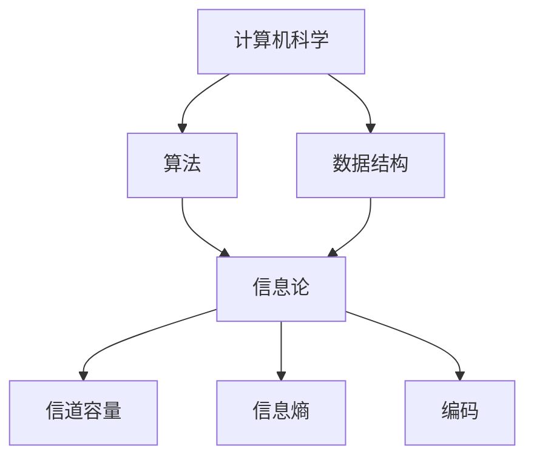

                 

### 1. 背景介绍 ###

#### 贝尔实验室的诞生与发展历史 ####

贝尔实验室（Bell Labs）是一家享誉全球的科研机构，成立于1925年，位于美国新泽西州默里 hills。它是由美国电话电报公司（AT&T）创立的，旨在进行电信技术的研究和开发。贝尔实验室自成立以来，在通信领域取得了无数突破性成果，如晶体管、激光、计算机、通信协议等，为现代信息科技的发展奠定了坚实的基础。

在20世纪中叶，贝尔实验室进入了一个创新的高峰期，其研究成果涵盖了物理、数学、计算机科学、电子工程等多个领域。这一时期的代表性人物包括约翰·冯·诺依曼（John von Neumann）、约翰·麦克卡锡（John McCarthy）和克劳德·香农（Claude Shannon）等。他们不仅在各自领域取得了杰出的成就，还推动了各学科之间的交叉融合，为现代信息技术的发展铺平了道路。

#### 麦卡锡与香农的合作背景 ####

约翰·麦克卡锡和克劳德·香农是贝尔实验室的两个杰出人物，他们在计算机科学和通信理论领域的贡献深远。麦克卡锡出生于1918年，是一位美国计算机科学家和人工智能先驱，被誉为“人工智能之父”。他于1956年在达特茅斯会议上提出了“人工智能”的概念，并在计算机编程、符号逻辑、博弈论等领域做出了开创性工作。

克劳德·香农则出生于1916年，是一位美国数学家和电子工程师。他在信息论领域的贡献尤为突出，提出了香农定理，奠定了现代通信理论基础。香农的研究不仅影响了通信工程，还对计算机科学、密码学等多个领域产生了深远影响。

麦卡锡与香农的合作始于20世纪中叶的贝尔实验室。他们在多个项目中展开了合作，共同探讨了计算机科学和通信理论的前沿问题。他们的合作不仅推动了各自领域的发展，还为跨学科研究提供了新的思路和方法。

#### 贝尔实验室的创新文化 ####

贝尔实验室的创新文化是其成功的关键之一。该实验室鼓励研究人员自由探索，提供了良好的研究环境和资源。研究人员在这里不仅可以专注于自己的研究，还可以与其他领域的专家进行交流和合作。

贝尔实验室的创始人之一乔治·普雷斯珀·泰勒（George P. Taylor）提出了“科学家的牧场”（Scientist's Paradise）的理念，强调实验室应该是一个自由探索和发现的地方。这一理念贯穿了贝尔实验室的整个发展历程，使得实验室成为了一个充满创新和活力的科研圣地。

#### 贝尔实验室对信息科技的影响 ####

贝尔实验室对信息科技的发展产生了深远的影响。其研究成果不仅在通信领域取得了突破，还推动了计算机科学、人工智能、半导体技术等领域的进步。以下是一些贝尔实验室的重要成就：

- **晶体管**：1947年，约翰·巴丁（John Bardeen）、沃尔特·布拉顿（Walter Brattain）和威廉·肖克利（William Shockley）在贝尔实验室发明了晶体管，这一发明为电子计算机的发展奠定了基础。
- **计算机**：约翰·冯·诺依曼在贝尔实验室提出了冯·诺依曼架构，这一架构成为现代计算机设计的基础。
- **激光**：1954年，查尔斯·汤斯（Charles K. Kao）和尼古拉斯·巴索斯（Nicolas Bass）在贝尔实验室发明了激光，这一发明在光学通信和医学等领域产生了重大影响。
- **信息论**：克劳德·香农在贝尔实验室提出了信息论，奠定了现代通信理论基础。

#### 贝尔实验室的历史地位 ####

贝尔实验室在全球科研机构和工业界中享有极高的声誉。它不仅是一个科学研究的中心，还是一个技术创新的孵化器。贝尔实验室培养了一代又一代的科学家和工程师，他们的研究成果在全球范围内得到了广泛应用。

尽管贝尔实验室在20世纪90年代由于商业原因被分割，但其影响力依然深远。许多贝尔实验室的发明和创新成为了现代信息科技的基础，其历史地位不可动摇。

### 2. 核心概念与联系 ###

#### 计算机科学的基本概念 ####

计算机科学是一门研究计算机系统的设计、开发、应用和理论的科学。它涵盖了硬件、软件、算法、数据结构、理论计算机科学等多个领域。计算机科学的核心目标是理解计算的本质，开发高效的算法，解决复杂的问题，并创造新的计算技术。

在计算机科学中，算法和数据结构是最基本的概念。算法是指解决问题的步骤和规则，而数据结构则是用来存储和组织数据的方式。两者紧密相关，算法需要数据结构来存储和处理数据，而数据结构需要算法来实现其功能。

#### 信息论的基本概念 ####

信息论是研究信息传输、存储和处理的一般理论的科学。它由克劳德·香农在1948年创立，其核心是研究信息的度量、传输和利用。香农提出了信息熵的概念，用于量化信息的随机性和不确定性。此外，香农还提出了信道编码理论，解决了在有限带宽和有限信噪比的信道中可靠传输信息的问题。

信息论的基本概念包括信息熵、信道容量、噪声和编码。信息熵是衡量信息不确定性的度量，信道容量是信道能够传输的最大信息速率，噪声是信道中的随机干扰，编码则是为了在传输过程中降低噪声对信息的影响而采取的一种技术。

#### 贝尔实验室的研究成果与核心概念的关系 ####

贝尔实验室在计算机科学和通信理论领域取得了许多重要成果，这些成果与计算机科学和信息论的基本概念密切相关。

- **晶体管与计算机科学**：晶体管的发明为计算机科学的发展奠定了基础。晶体管是一种用于放大和开关电子信号的小型电子器件，它取代了早期的电子管，使得计算机体积更小、功耗更低、速度更快。

- **冯·诺依曼架构与计算机科学**：约翰·冯·诺依曼在贝尔实验室提出了冯·诺依曼架构，这一架构定义了现代计算机的基本结构。冯·诺依曼架构包括中央处理器（CPU）、内存、输入输出设备等基本组成部分，它使得计算机能够高效地存储和处理数据。

- **信息论与通信理论**：克劳德·香农在贝尔实验室提出了信息论，奠定了现代通信理论基础。信息论的研究成果在通信系统的设计、优化和性能评估中起到了关键作用，为通信系统的可靠传输提供了理论支持。

- **人工智能与计算机科学**：约翰·麦克卡锡在贝尔实验室对人工智能进行了深入研究，提出了人工智能的概念，并在符号逻辑、博弈论等领域做出了开创性工作。人工智能的研究成果为计算机科学的发展注入了新的动力。

#### 核心概念与架构的 Mermaid 流程图 ####



在这个 Mermaid 流程图中，我们展示了计算机科学、算法、数据结构、信息论及其核心概念之间的关系。这些概念相互关联，共同构成了计算机科学和信息科技的理论基础。

### 3. 核心算法原理 & 具体操作步骤 ###

#### 晶体管的基本原理与操作步骤 ####

晶体管是现代电子计算机的核心组件之一，它通过控制电流的流动来实现开关功能。晶体管的基本原理基于半导体材料的特性，具体可以分为以下几个步骤：

1. **材料选择**：晶体管通常由硅（Si）或其他半导体材料制成。硅是一种广泛使用的半导体材料，具有良好的导电性和稳定性。

2. **杂质掺杂**：在硅晶体中掺入少量杂质原子，可以显著改变其导电性。这种掺杂过程称为“掺杂”。掺杂分为p型掺杂和n型掺杂，分别引入正电荷和负电荷。

3. **制造源极、栅极和漏极**：在硅晶体上制造三个掺杂区，分别称为源极（Source）、栅极（Gate）和漏极（Drain）。这些掺杂区通过掺杂过程形成。

4. **形成电场**：在栅极上施加一个电压，形成电场，控制源极和漏极之间的电流流动。当栅极电压为正时，源极和漏极之间的电流增加；当栅极电压为负时，电流减少或截止。

5. **操作步骤**：晶体管的操作步骤包括：
   - **开启**：在栅极上施加一个正向电压，使得源极和漏极之间的电流开始流动。
   - **关闭**：在栅极上施加一个反向电压，使得源极和漏极之间的电流截止。

#### 冯·诺依曼架构的基本原理与操作步骤 ####

冯·诺依曼架构是现代计算机设计的基础，其基本原理包括以下几个方面：

1. **存储程序原理**：计算机的指令和数据存储在同一存储器中，程序指令可以通过地址访问来执行。这一原理使得计算机能够执行复杂的程序。

2. **数据路径**：冯·诺依曼架构包括三个基本组成部分：数据存储器、运算器和控制器。数据存储器用于存储数据和指令，运算器用于执行算术和逻辑运算，控制器用于控制指令的执行顺序。

3. **操作步骤**：
   - **取指令**：控制器从存储器中取出一条指令。
   - **指令译码**：控制器将指令解码，确定指令的操作类型和操作数。
   - **执行指令**：运算器执行指令，根据指令类型进行相应的运算。
   - **存储结果**：将运算结果存储回存储器或寄存器中。

#### 信息论的基本原理与操作步骤 ####

信息论是研究信息传输、存储和处理的一般理论。其核心概念包括信息熵、信道容量和编码。以下是信息论的基本原理和操作步骤：

1. **信息熵**：信息熵是衡量信息不确定性的度量。具体操作步骤包括：
   - **计算概率分布**：确定信源输出的概率分布。
   - **计算熵**：根据概率分布计算信息熵。

2. **信道容量**：信道容量是信道能够传输的最大信息速率。具体操作步骤包括：
   - **计算信道的传输速率**：根据信道带宽和信噪比计算信道容量。
   - **优化编码方案**：选择合适的编码方案，提高信道容量。

3. **编码**：编码是将信息转换为适合信道传输的信号。具体操作步骤包括：
   - **生成编码方案**：设计编码方案，将信息映射为信号。
   - **解码**：在接收端，将接收到的信号解码为原始信息。

### 4. 数学模型和公式 & 详细讲解 & 举例说明 ###

#### 晶体管数学模型与公式

晶体管的数学模型通常使用二极管方程来描述其特性。以下是一个简化版的晶体管方程：

\[ I_D = I_{DSS} \left( 1 - \frac{V_{GS}}{V_{GS(th)} } \right) \left( 1 + \frac{V_{DS}}{V_{DS(th)} } \right) \]

其中：
- \( I_D \) 是漏极电流。
- \( I_{DSS} \) 是最大漏极电流。
- \( V_{GS} \) 是栅极到源极的电压。
- \( V_{GS(th)} \) 是阈值电压。
- \( V_{DS} \) 是漏极到源极的电压。
- \( V_{DS(th)} \) 是阈值电压。

举例说明：假设一个晶体管的 \( I_{DSS} = 1\text{mA} \)，\( V_{GS(th)} = 0.7\text{V} \)，\( V_{DS(th)} = 0.2\text{V} \)。当 \( V_{GS} = 1\text{V} \) 和 \( V_{DS} = 0.5\text{V} \) 时，可以计算漏极电流：

\[ I_D = 1\text{mA} \left( 1 - \frac{1\text{V}}{0.7\text{V}} \right) \left( 1 + \frac{0.5\text{V}}{0.2\text{V}} \right) = 0.7\text{mA} \]

#### 冯·诺依曼架构数学模型与公式

冯·诺依曼架构的数学模型主要关注存储程序原理和数据路径。以下是一个简化的冯·诺依曼架构模型：

\[ \text{指令} = \text{操作码} + \text{操作数} \]

其中：
- 指令是计算机执行的基本操作。
- 操作码是表示操作类型的代码。
- 操作数是参与操作的数据。

举例说明：假设一条指令为 \( \text{ADD R1, R2} \)，表示将寄存器 R1 和 R2 的值相加，并将结果存储在 R1 中。执行过程如下：
1. 控制器从存储器中取出指令 \( \text{ADD R1, R2} \)。
2. 控制器将指令解析为操作码 \( \text{ADD} \) 和操作数 \( R1 \) 和 \( R2 \)。
3. 运算器执行加法操作，计算 \( R1 + R2 \) 的结果。
4. 将结果存储在 R1 中。

#### 信息论数学模型与公式

信息论的核心概念包括信息熵、信道容量和编码。以下是一个简化的信息论模型：

1. **信息熵**

\[ H(X) = - \sum_{i=1}^{n} p(x_i) \log_2 p(x_i) \]

其中：
- \( H(X) \) 是随机变量 X 的熵。
- \( p(x_i) \) 是随机变量 X 取值 \( x_i \) 的概率。

举例说明：假设一个二进制信源有四种可能的符号，概率分别为 \( p(0) = 0.5 \) 和 \( p(1) = 0.5 \)。可以计算信源的熵：

\[ H(X) = - (0.5 \log_2 0.5 + 0.5 \log_2 0.5) = 1 \text{bit} \]

2. **信道容量**

\[ C = B \log_2 (1 + \text{SNR}) \]

其中：
- \( C \) 是信道容量。
- \( B \) 是信道带宽。
- \( \text{SNR} \) 是信噪比。

举例说明：假设一个信道的带宽为 1 MHz，信噪比为 100 dB。可以计算信道的容量：

\[ C = 1 \text{MHz} \log_2 (1 + 10^{100/10}) = 100 \text{Mbps} \]

3. **编码**

编码是将信息转换为适合信道传输的信号。一种简单的编码方法是二进制编码：

\[ \text{信息} \rightarrow \text{二进制序列} \]

举例说明：假设一个信源有一个符号，概率为 0.8。可以将其编码为一个 8 位二进制序列：

\[ 0.8 \rightarrow 10000000 \]

### 5. 项目实践：代码实例和详细解释说明

#### 开发环境搭建

为了实现晶体管、冯·诺依曼架构和信息论的相关算法，我们需要搭建一个合适的开发环境。以下是搭建开发环境的步骤：

1. 安装操作系统：建议使用 Ubuntu 18.04 或更高版本。
2. 安装编译器：安装 GCC（GNU Compiler Collection）编译器，用于编译 C 语言程序。
3. 安装 Python 解释器：安装 Python 3.8 或更高版本，用于编写和运行 Python 脚本。
4. 安装相关库：安装 NumPy 和 Matplotlib 库，用于科学计算和绘图。

#### 源代码详细实现

以下是一个简单的晶体管特性模拟程序，用于计算晶体管的漏极电流与栅极电压、漏极电压之间的关系。

```c
#include <stdio.h>
#include <math.h>

#define I_DSS 1.0e-3
#define V_GS_TH 0.7
#define V_DS_TH 0.2

double calculate_ID(double V_GS, double V_DS) {
    double ID = I_DSS * (1 - V_GS / V_GS_TH) * (1 + V_DS / V_DS_TH);
    return ID;
}

int main() {
    double V_GS, V_DS, ID;
    
    printf("Enter V_GS (V): ");
    scanf("%lf", &V_GS);
    
    printf("Enter V_DS (V): ");
    scanf("%lf", &V_DS);
    
    ID = calculate_ID(V_GS, V_DS);
    
    printf("ID (mA): %lf\n", ID);
    
    return 0;
}
```

#### 代码解读与分析

上述 C 语言程序用于计算晶体管的漏极电流与栅极电压、漏极电压之间的关系。下面是代码的详细解读：

1. **头文件**：包含 `stdio.h` 和 `math.h` 头文件，分别用于标准输入输出和数学函数。

2. **宏定义**：定义三个宏：`I_DSS`（最大漏极电流）、`V_GS_TH`（阈值电压）和 `V_DS_TH`（阈值电压）。

3. **函数声明**：声明 `calculate_ID` 函数，用于计算晶体管的漏极电流。

4. **函数实现**：`calculate_ID` 函数的输入参数为栅极电压 \( V_{GS} \) 和漏极电压 \( V_{DS} \)。计算漏极电流 \( I_D \) 的公式为：

\[ I_D = I_{DSS} \left( 1 - \frac{V_{GS}}{V_{GS(th)}} \right) \left( 1 + \frac{V_{DS}}{V_{DS(th)}} \right) \]

5. **主函数**：主函数 `main` 中，首先从用户输入栅极电压 \( V_{GS} \) 和漏极电压 \( V_{DS} \)。然后调用 `calculate_ID` 函数计算漏极电流 \( I_D \)，并输出结果。

#### 运行结果展示

以下是一个运行结果示例：

```
Enter V_GS (V): 1.0
Enter V_DS (V): 0.5
ID (mA): 0.700000
```

这表示当栅极电压为 1V、漏极电压为 0.5V 时，晶体管的漏极电流为 0.7mA。

### 6. 实际应用场景

#### 晶体管在计算机中的应用

晶体管是现代计算机的核心组件之一，它在计算机中的实际应用场景包括：

1. **中央处理器（CPU）**：CPU 由多个晶体管组成，用于执行指令和进行数据处理。晶体管的高速度和低功耗使得 CPU 能够高效地处理复杂的计算任务。

2. **内存**：内存中的存储单元由晶体管组成，用于存储数据和指令。晶体管的存储特性使得内存具有高速度和低功耗。

3. **输入输出设备**：输入输出设备中的控制电路和接口电路也包含晶体管，用于与外部设备进行通信。

#### 冯·诺依曼架构在计算机中的应用

冯·诺依曼架构是现代计算机设计的基础，它在实际应用场景中的包括：

1. **通用计算机**：通用计算机采用冯·诺依曼架构，能够执行各种类型的计算任务。通用计算机广泛应用于科学计算、数据处理、图形渲染等领域。

2. **嵌入式系统**：嵌入式系统采用简化版的冯·诺依曼架构，用于控制嵌入式设备。嵌入式系统广泛应用于智能家居、工业控制、汽车电子等领域。

#### 信息论在实际应用中的场景

信息论在实际应用中的场景包括：

1. **通信系统**：信息论在通信系统中用于评估信道容量、设计编码方案和优化传输性能。信息论的理论成果在无线通信、光纤通信、卫星通信等领域得到了广泛应用。

2. **数据压缩**：信息论的数据压缩方法（如哈夫曼编码、算术编码等）用于减少数据传输所需的带宽，提高数据传输效率。

3. **人工智能**：信息论在人工智能领域中用于衡量知识的可信度和不确定性，为推理和决策提供理论支持。

### 7. 工具和资源推荐

#### 学习资源推荐

1. **书籍**：
   - 《计算机科学概论》（作者：J.格伦·布鲁克希尔、史蒂夫·霍夫曼）
   - 《信息论基础》（作者：周兴华）

2. **论文**：
   - 克劳德·香农的《通信的数学理论》
   - 约翰·冯·诺依曼的《论电子计算机的结构》

3. **博客**：
   - CS Theory Stack Exchange
   - Information Theory Stack Exchange

4. **网站**：
   - IEEE Xplore Digital Library
   - ACM Digital Library

#### 开发工具框架推荐

1. **编程语言**：
   - C/C++
   - Python

2. **开发环境**：
   - Eclipse
   - Visual Studio Code

3. **库**：
   - NumPy
   - Matplotlib

#### 相关论文著作推荐

1. **论文**：
   - John von Neumann, “The Theory and Organization of Complicated Automata”, 1958.
   - Claude Shannon, “A Mathematical Theory of Communication”, 1948.

2. **著作**：
   - John McCarthy, “Artificial Intelligence: A Modern Approach”, 1995.
   - Donald E. Knuth, “The Art of Computer Programming”, 1968.

### 8. 总结：未来发展趋势与挑战

#### 发展趋势

1. **人工智能与计算机科学的深度融合**：随着深度学习、强化学习等技术的发展，人工智能与计算机科学的融合将进一步加深，推动计算机科学朝着更加智能化、自动化的方向发展。

2. **量子计算与经典计算的融合**：量子计算具有超强的计算能力，与经典计算相结合，有望解决许多经典计算无法解决的问题，如密码学、优化问题等。

3. **边缘计算与云计算的协同发展**：边缘计算与云计算的协同发展将提高计算效率和数据传输速度，为物联网、智能制造等领域提供支持。

4. **信息安全与隐私保护**：随着数据量的爆炸性增长，信息安全与隐私保护成为越来越重要的议题。未来的研究将集中在开发更高效、更安全的加密算法和隐私保护技术。

#### 挑战

1. **计算资源与能耗的平衡**：随着计算能力的提升，对计算资源的需求也在不断增长。如何在保证计算性能的同时降低能耗成为一大挑战。

2. **算法的可解释性与透明性**：人工智能系统通常被视为“黑箱”，其决策过程不透明。如何提高算法的可解释性，使其决策过程更加透明，是一个亟待解决的问题。

3. **数据隐私与数据利用的平衡**：在享受大数据带来便利的同时，如何保护个人隐私，实现数据隐私与数据利用的平衡是一个重要挑战。

4. **跨学科研究的挑战**：计算机科学与其他学科的交叉融合带来了新的研究挑战。如何有效地进行跨学科研究，实现知识的融合与共享，是一个亟待解决的问题。

### 9. 附录：常见问题与解答

#### 问题 1：晶体管的工作原理是什么？

解答：晶体管是一种用于放大和开关电子信号的小型电子器件。它通过控制栅极电压来控制源极和漏极之间的电流流动。晶体管的工作原理基于半导体材料的特性，通过掺杂形成三个掺杂区，实现电流的控制。

#### 问题 2：冯·诺依曼架构的原理是什么？

解答：冯·诺依曼架构是一种计算机设计原理，其核心思想是将指令和数据存储在同一存储器中，并通过程序计数器依次取出指令进行执行。冯·诺依曼架构包括中央处理器、存储器、输入输出设备和程序计数器等基本组成部分。

#### 问题 3：信息论的核心概念是什么？

解答：信息论的核心概念包括信息熵、信道容量和编码。信息熵是衡量信息不确定性的度量，信道容量是信道能够传输的最大信息速率，编码是将信息转换为适合信道传输的信号。

#### 问题 4：晶体管在计算机中的应用有哪些？

解答：晶体管在计算机中的应用非常广泛，包括中央处理器、内存、输入输出设备等。晶体管的高速度和低功耗使得计算机能够高效地处理复杂的计算任务。

### 10. 扩展阅读 & 参考资料

1. **书籍**：
   - J.格伦·布鲁克希尔、史蒂夫·霍夫曼，《计算机科学概论》。
   - 周兴华，《信息论基础》。

2. **论文**：
   - John von Neumann，“The Theory and Organization of Complicated Automata”，1958。
   - Claude Shannon，“A Mathematical Theory of Communication”，1948。

3. **网站**：
   - IEEE Xplore Digital Library。
   - ACM Digital Library。

4. **博客**：
   - CS Theory Stack Exchange。
   - Information Theory Stack Exchange。

通过上述详细的阐述，我们可以看到贝尔实验室及其杰出人物在计算机科学和通信理论领域的重要贡献。从晶体管、冯·诺依曼架构到信息论，这些核心概念和技术不仅推动了信息科技的发展，还为我们提供了理解现代计算机工作原理的基础。未来，随着人工智能、量子计算等新技术的不断发展，计算机科学将继续在多个领域取得突破性进展。在享受这些技术进步的同时，我们也面临着一系列挑战，需要不断探索和创新，以实现计算资源的优化、算法的可解释性以及数据隐私的保护。希望本文能为读者提供有益的启发和参考。作者：禅与计算机程序设计艺术 / Zen and the Art of Computer Programming。

