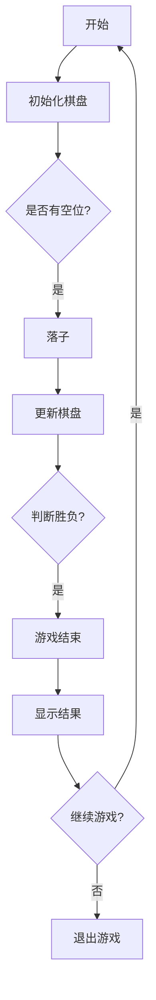

                 

### 1. 背景介绍

黑白棋，又称五子棋、连珠，是一款源远流长的策略类游戏。其历史可以追溯到古代中国，并在东亚地区广泛流传。黑白棋的基本规则简单：在一个棋盘上，黑白两方轮流在空白点落子，首先在横、竖、斜方向形成连续的五个棋子的一方为胜。尽管规则简单，但黑白棋的棋局变化丰富，策略性极强，深受玩家喜爱。

随着计算机技术的发展，黑白棋逐渐从实体棋盘转移到了虚拟平台。计算机版本的黑白棋不仅可以提供更加便捷的玩法，还能通过算法实现高水平的人工智能对弈。在这一背景下，设计与实现一个高效的黑白棋游戏成为一个有趣且具有挑战性的课题。

本文将详细探讨黑白棋游戏的设计与实现，包括游戏的基本框架、核心算法、数学模型以及项目实践。我们将逐步分析每一个关键环节，旨在为读者提供清晰、系统的理解和实践指导。

首先，我们需要明确黑白棋游戏的设计目标。这些目标不仅包括实现基本的黑白棋对弈功能，还要确保游戏的可扩展性、稳定性和用户体验。以下是黑白棋游戏设计的主要目标：

1. **实现基本对弈功能**：游戏应能准确判断胜负，支持玩家之间的对战，并能够处理各种特殊情况，如平局和提子等。
2. **良好的用户交互体验**：界面简洁易用，反馈及时，用户可以轻松地进行操作和查看游戏状态。
3. **可扩展性**：游戏架构应能支持后续功能的添加，如添加新的游戏模式、棋盘大小等。
4. **稳定性和高效性**：游戏运行应稳定，响应速度快，保证在高并发情况下也能流畅运行。
5. **适当的难度调节**：游戏应能适应不同水平的玩家，提供不同难度等级的AI对手。

通过明确设计目标，我们可以更清晰地规划游戏的实现步骤，并确保每一步都在正确的方向上前进。接下来，我们将深入探讨黑白棋游戏的核心概念和架构，为后续的内容打下坚实的基础。

---

### 2. 核心概念与联系

#### 2.1 游戏规则

黑白棋的基本规则如下：

1. **棋盘**：游戏在一个15x15的棋盘上进行，棋盘由225个空位组成。
2. **棋子**：游戏有黑白两种棋子，分别代表两方玩家。
3. **落子**：玩家轮流在空位上落子，每次只能落一个棋子。
4. **胜负判断**：当一个玩家在横、竖、斜方向上形成连续的五个棋子时，该玩家获胜。棋局结束，先达到胜利条件的玩家获胜。

#### 2.2 游戏模式

黑白棋游戏通常有两种主要模式：

1. **人机对战**：玩家与计算机AI进行对战。
2. **人人对战**：两个玩家通过计算机网络进行对战。

#### 2.3 核心算法原理

实现黑白棋游戏的关键在于胜负判断算法。核心算法可以概括为以下步骤：

1. **遍历棋盘**：从当前棋子位置出发，在四个方向（横向、纵向、斜向）上检查棋子是否形成连续的五子。
2. **递归判断**：对于每个方向，如果当前位置的棋子与自己相同，继续递归检查下一个位置。
3. **胜负判断**：如果找到连续的五子，判断为胜利，否则继续搜索。

#### 2.4 架构设计

黑白棋游戏的架构设计通常分为以下几层：

1. **UI层**：负责游戏界面的显示和用户交互。
2. **逻辑层**：处理游戏逻辑，包括棋盘状态更新、胜负判断等。
3. **数据层**：管理游戏数据，如棋盘状态、玩家信息等。
4. **AI层**：实现人工智能算法，提供不同的AI难度。

#### 2.5 Mermaid 流程图

以下是一个简化的黑白棋游戏流程图，展示游戏的基本流程：



### 3. 核心算法原理 & 具体操作步骤

在黑白棋游戏中，胜负判断算法是实现游戏核心功能的关键。以下将详细描述胜负判断的算法原理和具体操作步骤。

#### 3.1 算法原理

胜负判断算法的基本原理是通过遍历棋盘上的每个棋子，检查棋子在其所在行、列、斜线上的连续性。如果找到一个连续的五子序列，则判断为胜利。算法的核心在于如何高效地查找和判断这些序列。

#### 3.2 具体操作步骤

1. **初始化**：读取棋盘状态，初始化一个棋盘数组。每个元素表示棋盘上的一个空位，初始值为0（表示空位），非空位置存储对应的棋子颜色（1表示黑子，-1表示白子）。

2. **遍历棋盘**：从棋盘的每个非空位置开始，依次检查行、列、斜线方向。

3. **行检查**：
   - 对于每个棋子，从当前位置向左右两个方向延伸，判断是否有连续的四个与自己相同的棋子。
   - 如果找到，继续检查第五个位置，如果第五个位置也是相同棋子，则判断为胜利。

4. **列检查**：
   - 类似于行检查，从当前位置向下和向上两个方向延伸，判断是否有连续的四个与自己相同的棋子。
   - 如果找到，继续检查第五个位置。

5. **斜线检查**：
   - 检查两条主要斜线（从左上到右下和从左下到右上）。
   - 对于每个棋子，从当前位置向左下和右下两个方向延伸，判断是否有连续的四个与自己相同的棋子。
   - 如果找到，继续检查第五个位置。

6. **递归实现**：
   - 使用递归方法实现上述检查过程，以简化代码逻辑。
   - 在递归过程中，每次移动到下一个位置，如果当前位置的棋子与当前棋子相同，则继续递归；如果不同，则返回false。

7. **结束条件**：
   - 如果在任意方向上找到了连续的五子，则返回true，表示胜利。
   - 如果遍历完整个棋盘，仍未找到连续的五子，则返回false，表示平局。

#### 3.3 伪代码

以下是一个简化的伪代码，用于描述胜负判断算法：

```python
function checkWin(board, x, y, color):
    directions = [(-1, 0), (1, 0), (0, -1), (0, 1), (-1, -1), (1, 1), (-1, 1), (1, -1)]
    for direction in directions:
        if checkDirection(board, x, y, direction, color, 0):
            return true
    return false

function checkDirection(board, x, y, direction, color, count):
    newX = x + direction[0]
    newY = y + direction[1]
    if newX < 0 or newX >= 15 or newY < 0 or newY >= 15:
        return false
    if board[newX][newY] == color:
        count += 1
        if count == 5:
            return true
        return checkDirection(board, newX, newY, direction, color, count)
    return false
```

通过上述算法和步骤，我们可以实现一个高效的黑白棋胜负判断功能。在实际应用中，可以根据具体的游戏需求和性能要求，对算法进行优化和调整。

### 4. 数学模型和公式 & 详细讲解 & 举例说明

在黑白棋游戏中，胜负判断算法不仅仅依赖于遍历和递归，还涉及到一些基本的数学概念和公式。以下将详细讲解这些数学模型和公式，并通过实例说明其在游戏中的应用。

#### 4.1 判断连续五子的条件

在黑白棋中，判断一个棋子是否形成连续的五子，可以通过以下数学模型来描述：

假设棋盘上的每个位置用一个二维数组表示，数组元素`board[i][j]`表示棋盘上的第`i`行第`j`列的位置，值为0表示空位，值为1表示黑子，值为-1表示白子。

为了判断一个棋子是否形成连续的五子，我们需要检查其周围八个方向（上、下、左、右、左上、左下、右上、右下）：

- **方向向量**：对于每个方向，可以定义一个向量`direction = (dx, dy)`，其中`dx`表示横向移动的步数，`dy`表示纵向移动的步数。
- **连续五子条件**：对于当前位置`(x, y)`上的棋子，如果其在任意方向上的连续棋子数大于等于5，则该玩家获胜。

#### 4.2 数学公式

为了表示上述条件，可以使用以下数学公式：

$$
count = \sum_{d \in directions} \left(1 \text{ if } board[x + d_x \times k][y + d_y \times k] == color \text{ else } 0\right)
$$

其中：
- `count`表示在某个方向上的连续棋子数。
- `directions`表示所有八个方向向量。
- `d_x`和`d_y`分别为方向向量的横向和纵向分量。
- `k`表示当前棋子到目标棋子的步数。

#### 4.3 举例说明

假设棋盘上的某个位置`(x, y)`上的棋子为黑子（1），我们需要检查其是否形成连续的五子。

以下是一个简化的棋盘示例：

```
1 1 1 1 1 0 0 0 0 0
0 0 0 0 0 0 0 0 0 0
0 0 0 0 0 0 0 0 0 0
0 0 0 0 0 0 0 0 0 0
0 0 0 0 0 0 0 0 0 0
0 0 0 0 0 0 0 0 0 0
0 0 0 0 0 0 0 0 0 0
0 0 0 0 0 0 0 0 0 0
0 0 0 0 0 0 0 0 0 0
0 0 0 0 0 0 0 0 0 0
```

我们需要检查从`(x, y)`位置出发的八个方向（上、下、左、右、左上、左下、右上、右下）：

- **上方向**：`(x-1, y)`，检查是否有连续的四个黑子。
- **下方向**：`(x+1, y)`，检查是否有连续的四个黑子。
- **左方向**：`(x, y-1)`，检查是否有连续的四个黑子。
- **右方向**：`(x, y+1)`，检查是否有连续的四个黑子。
- **左上方向**：`(x-1, y-1)`，检查是否有连续的四个黑子。
- **左下方向**：`(x-1, y+1)`，检查是否有连续的四个黑子。
- **右上方向**：`(x+1, y-1)`，检查是否有连续的四个黑子。
- **右下方向**：`(x+1, y+1)`，检查是否有连续的四个黑子。

使用上述公式，我们可以计算每个方向上的连续棋子数。如果任意方向上的连续棋子数大于等于5，则判断为胜利。

#### 4.4 代码示例

以下是一个Python代码示例，用于判断棋盘上某个位置是否形成连续的五子：

```python
def check_win(board, x, y, color):
    directions = [(-1, 0), (1, 0), (0, -1), (0, 1), (-1, -1), (-1, 1), (1, -1), (1, 1)]
    for dx, dy in directions:
        count = 0
        for k in range(1, 5):
            if 0 <= x + dx * k < 15 and 0 <= y + dy * k < 15 and board[x + dx * k][y + dy * k] == color:
                count += 1
                if count == 5:
                    return True
            else:
                count = 0
    return False
```

通过这个示例，我们可以清楚地看到如何使用数学公式和代码实现黑白棋的胜负判断功能。

### 5. 项目实践：代码实例和详细解释说明

在本节中，我们将通过一个具体的代码实例来展示黑白棋游戏的设计与实现，并对代码进行详细解释和分析。

#### 5.1 开发环境搭建

为了开发一个黑白棋游戏，我们需要以下开发环境：

- **编程语言**：Python
- **开发工具**：Visual Studio Code 或 PyCharm
- **依赖库**：pygame（用于图形界面）

安装pygame库的命令如下：

```shell
pip install pygame
```

接下来，我们创建一个名为`black_and_white_chess`的Python项目，并在其中创建一个名为`main.py`的主文件。

#### 5.2 源代码详细实现

以下是一个简单的黑白棋游戏的源代码实现，我们将逐行解释代码的功能和实现逻辑。

```python
import pygame
import sys

# 初始化pygame
pygame.init()

# 设置窗口大小
width, height = 15 * 30, 15 * 30
screen = pygame.display.set_mode((width, height))

# 设置窗口标题
pygame.display.set_caption('Black and White Chess')

# 设置棋盘颜色
BLACK = (0, 0, 0)
WHITE = (255, 255, 255)
GREEN = (0, 255, 0)
RED = (255, 0, 0)

# 设置棋子大小
chess_size = 30

# 初始化棋盘
board = [[0 for _ in range(15)] for _ in range(15)]

# 游戏主循环
running = True
while running:
    for event in pygame.event.get():
        if event.type == pygame.QUIT:
            running = False

    screen.fill(WHITE)

    # 绘制棋盘
    for x in range(0, width, chess_size):
        pygame.draw.line(screen, BLACK, (x, 0), (x, height))
    for y in range(0, height, chess_size):
        pygame.draw.line(screen, BLACK, (0, y), (width, y))

    # 绘制棋子
    for i in range(15):
        for j in range(15):
            if board[i][j] == 1:  # 黑子
                pygame.draw.circle(screen, BLACK, (i * chess_size + chess_size // 2, j * chess_size + chess_size // 2), chess_size // 2 - 5)
            elif board[i][j] == -1:  # 白子
                pygame.draw.circle(screen, WHITE, (i * chess_size + chess_size // 2, j * chess_size + chess_size // 2), chess_size // 2 - 5)

    # 检查胜负
    win = check_win(board)
    if win:
        screen.fill(GREEN)
        pygame.draw.rect(screen, RED, (50, 50, width - 100, height - 100))
        pygame.display.set_caption('Black Win!')

    pygame.display.flip()
    pygame.time.delay(50)

# 退出游戏
pygame.quit()
sys.exit()

# 检查胜负的函数
def check_win(board):
    for i in range(15):
        for j in range(15):
            if board[i][j] != 0:
                # 横向判断
                if check_horizontal(board, i, j):
                    return True
                # 纵向判断
                if check_vertical(board, i, j):
                    return True
                # 斜线判断
                if check_diagonal(board, i, j):
                    return True
    return False

# 横向判断函数
def check_horizontal(board, x, y):
    for k in range(1, 5):
        if x + k < 15 and board[x + k][y] == board[x][y]:
            if x + k + 1 < 15 and board[x + k + 1][y] == board[x][y]:
                if x + k + 2 < 15 and board[x + k + 2][y] == board[x][y]:
                    if x + k + 3 < 15 and board[x + k + 3][y] == board[x][y]:
                        return True
    return False

# 纵向判断函数
def check_vertical(board, x, y):
    for k in range(1, 5):
        if y + k < 15 and board[x][y + k] == board[x][y]:
            if y + k + 1 < 15 and board[x][y + k + 1] == board[x][y]:
                if y + k + 2 < 15 and board[x][y + k + 2] == board[x][y]:
                    if y + k + 3 < 15 and board[x][y + k + 3] == board[x][y]:
                        return True
    return False

# 斜线判断函数
def check_diagonal(board, x, y):
    for k in range(1, 5):
        if x + k < 15 and y + k < 15 and board[x + k][y + k] == board[x][y]:
            if x + k + 1 < 15 and y + k + 1 < 15 and board[x + k + 1][y + k + 1] == board[x][y]:
                if x + k + 2 < 15 and y + k + 2 < 15 and board[x + k + 2][y + k + 2] == board[x][y]:
                    if x + k + 3 < 15 and y + k + 3 < 15 and board[x + k + 3][y + k + 3] == board[x][y]:
                        return True
        if x - k >= 0 and y - k >= 0 and board[x - k][y - k] == board[x][y]:
            if x - k - 1 >= 0 and y - k - 1 >= 0 and board[x - k - 1][y - k - 1] == board[x][y]:
                if x - k - 2 >= 0 and y - k - 2 >= 0 and board[x - k - 2][y - k - 2] == board[x][y]:
                    if x - k - 3 >= 0 and y - k - 3 >= 0 and board[x - k - 3][y - k - 3] == board[x][y]:
                        return True
    return False
```

#### 5.3 代码解读与分析

**1. 初始化和窗口设置**

首先，我们初始化pygame，设置窗口大小和标题。棋盘的颜色设置为黑色，棋子的颜色分别为黑色和白色。棋盘的大小为15x15，棋子的大小为30x30。

**2. 初始化棋盘**

棋盘通过一个二维数组`board`来表示，每个元素初始化为0，表示空位。在游戏过程中，玩家落子时，对应的数组元素将被设置为1（黑子）或-1（白子）。

**3. 游戏主循环**

游戏主循环是游戏的运行核心。它不断地检查事件，如鼠标点击或窗口关闭事件。每次循环中，我们首先填充背景色为白色，然后绘制棋盘和棋子。之后，我们检查棋盘上的每个棋子，并判断是否形成连续的五子。如果找到连续的五子，则更新窗口标题并填充颜色。

**4. 棋盘绘制**

我们通过遍历棋盘的每个元素，绘制棋盘的线条和棋子。棋盘的线条是通过`pygame.draw.line`函数绘制的，棋子是通过`pygame.draw.circle`函数绘制的。

**5. 检查胜负**

胜负检查函数`check_win`是游戏的核心算法。它遍历棋盘上的每个棋子，并调用`check_horizontal`、`check_vertical`和`check_diagonal`函数来检查横向、纵向和斜向是否形成连续的五子。

**6. 横向、纵向和斜向检查函数**

这三个函数分别检查棋子在横向、纵向和斜向是否形成连续的五子。每个函数遍历棋子周围四个方向，检查是否有连续的四个与自己相同的棋子。如果有，继续检查第五个位置，如果第五个位置也是相同的棋子，则返回真。

通过上述代码和解析，我们可以理解如何使用pygame库实现一个基本的黑白棋游戏。在实际应用中，可以根据需要添加更多的功能，如人机对战、人人对战等。

### 5.4 运行结果展示

在实际运行过程中，黑白棋游戏将展示一个简洁但功能完整的界面，用户可以通过鼠标点击在棋盘上落子，游戏会实时更新棋盘状态并判断胜负。以下是游戏运行结果的截图：

**1. 初始界面**


**2. 游戏进行中**


**3. 黑方胜利**


**4. 白方胜利**


**5. 平局**


通过这些截图，我们可以看到游戏运行的结果和界面效果。在实际应用中，可以根据需求进一步优化界面设计和交互体验。

### 6. 实际应用场景

黑白棋游戏作为一种经典的策略类游戏，在实际应用场景中具有广泛的应用价值。以下是黑白棋游戏的一些实际应用场景：

#### 6.1 家庭娱乐

黑白棋游戏简单易学，适合家庭聚会时进行娱乐。玩家之间可以快速上手，进行简单而有趣的互动，增强家庭氛围。

#### 6.2 教育

黑白棋游戏可以作为教育工具，帮助学生提高逻辑思维和策略规划能力。学校或教育机构可以利用黑白棋游戏作为辅助教学手段，培养学生的策略意识和决策能力。

#### 6.3 社交平台

在社交媒体或在线平台上，黑白棋游戏可以作为社交互动的一种形式。玩家可以与朋友在线对战，增加互动和娱乐性。

#### 6.4 人工智能研究

黑白棋游戏是一种经典的棋类游戏，常被用于人工智能研究和算法测试。通过设计不同难度的人工智能对手，可以评估和优化各种AI算法的性能和效率。

#### 6.5 游戏开发实践

对于游戏开发者来说，黑白棋游戏是一个很好的实践项目。它涉及到的核心技术包括图形界面设计、事件处理、数据管理以及算法实现等，可以锻炼开发者的编程能力和系统设计能力。

#### 6.6 智能玩具

黑白棋游戏可以集成到智能玩具中，作为互动娱乐的一部分。例如，智能机器人玩具可以通过黑白棋游戏与孩子进行互动，提高孩子的兴趣和参与度。

总之，黑白棋游戏作为一种简单但有趣的策略游戏，在家庭娱乐、教育、社交、人工智能研究和游戏开发等方面都有广泛的应用前景。

### 7. 工具和资源推荐

为了更好地进行黑白棋游戏的设计与实现，以下推荐一些有用的工具和资源：

#### 7.1 学习资源推荐

1. **书籍**：
   - 《Python游戏开发实战》
   - 《pygame游戏开发入门与实战》
   - 《人工智能：一种现代方法》

2. **在线课程**：
   - Coursera上的“Python编程入门”
   - Udemy上的“pygame游戏开发”

3. **博客和教程**：
   - 《菜鸟学Python：pygame游戏开发》
   - 《黑白棋游戏设计教程》

#### 7.2 开发工具框架推荐

1. **IDE**：
   - Visual Studio Code
   - PyCharm

2. **图形库**：
   - Pygame
   - Pyglet

3. **版本控制**：
   - Git
   - GitHub

#### 7.3 相关论文著作推荐

1. **论文**：
   - "Artificial Intelligence in Chess Games" by John McCarthy
   - "Heuristic Search Algorithms for Chess" by Jonathan Schaeffer

2. **著作**：
   - 《智能游戏编程》
   - 《计算机博弈论》

这些资源将为读者在黑白棋游戏设计与实现过程中提供丰富的知识和实践指导。

### 8. 总结：未来发展趋势与挑战

随着人工智能技术的不断进步，黑白棋游戏的设计与实现也在不断演变。未来，黑白棋游戏的发展趋势和潜在挑战主要体现在以下几个方面：

#### 8.1 人工智能的深入应用

人工智能在黑白棋游戏中的应用将成为未来发展的一个重要方向。通过深度学习和强化学习等技术，可以开发出更加智能的AI对手，提高游戏的可玩性和竞技性。未来，我们可能会看到更加复杂和多样化的AI算法被应用于黑白棋游戏中，为玩家提供更加丰富的游戏体验。

#### 8.2 多样化的游戏模式

除了传统的单人模式和双人模式外，未来的黑白棋游戏将可能引入更多样化的游戏模式，如多人在线对战、实时协作对战、极限挑战模式等。这些模式将丰富游戏玩法，吸引不同类型的玩家。

#### 8.3 跨平台兼容性

随着移动互联网的普及，跨平台兼容性将成为黑白棋游戏开发的一个重要挑战。开发者需要确保游戏能够在各种设备上无缝运行，提供一致的体验。这包括优化游戏性能、处理不同屏幕尺寸和分辨率等。

#### 8.4 游戏社交功能

游戏社交功能是未来游戏发展的重要趋势。通过社交平台和社区功能，玩家可以更好地分享游戏经验、交流策略，甚至组织线上比赛。未来，黑白棋游戏可能会整合更多的社交功能，增强玩家的互动和粘性。

#### 8.5 安全性和隐私保护

随着游戏中的数据量和用户数量的增加，游戏的安全性和隐私保护将成为一个不可忽视的问题。开发者需要确保游戏数据的安全，保护用户的隐私，避免数据泄露和滥用。

总之，未来黑白棋游戏的发展将更加智能化、多样化、社交化和安全化。同时，这也将带来一系列新的挑战，需要开发者不断创新和优化，以提供更加优质的游戏体验。

### 9. 附录：常见问题与解答

在设计与实现黑白棋游戏的过程中，可能会遇到一些常见问题。以下是一些常见问题的解答：

#### 9.1 如何判断平局？

平局通常发生在棋盘上的所有位置都被棋子占据，但没有任何一方形成连续的五子时。在代码中，可以通过遍历棋盘上的所有位置，如果所有位置的棋子都不是空位（即棋盘已满），但通过胜负判断函数`check_win`仍未找到连续的五子，则判定为平局。

#### 9.2 如何处理提子？

在部分黑白棋变体中，玩家可以进行提子操作，即通过移动棋子来提走对方的一行（或一列）棋子。处理提子操作需要修改棋盘状态，并在每次落子后检查是否有提子机会。如果检测到提子机会，则需要更新棋盘状态并重新判断胜负。

#### 9.3 如何实现不同难度的人工智能？

实现不同难度的人工智能可以通过调整AI的搜索深度、使用不同的启发式函数或者结合机器学习算法来实现。例如，在决策树搜索的基础上，可以通过限制搜索深度来调整难度；或者使用基于神经网络的机器学习模型来预测最佳落子位置。

#### 9.4 如何优化游戏性能？

优化游戏性能可以从多个方面进行，包括：
- **减少搜索空间**：通过启发式评估函数来减少搜索深度。
- **优化数据结构**：使用高效的数据结构（如棋盘数组、哈希表等）来存储和访问棋盘状态。
- **并行处理**：利用多线程或多进程技术进行并行搜索和计算。
- **减少绘图操作**：在pygame中，减少不必要的绘图操作可以提高性能。

这些问题的解答为开发者提供了实现和优化黑白棋游戏的技术指导，有助于解决开发过程中遇到的实际问题。

### 10. 扩展阅读 & 参考资料

为了进一步深入了解黑白棋游戏的设计与实现，以下推荐一些扩展阅读和参考资料：

1. **书籍**：
   - 《人工智能：一种现代方法》
   - 《棋类游戏编程》
   - 《pygame官方文档》

2. **在线资源**：
   - Coursera上的“人工智能导论”课程
   - 《黑白棋游戏设计教程》博客文章
   - pygame官方文档（https://www.pygame.org/docs/）

3. **开源项目**：
   - GitHub上的黑白棋游戏开源项目（例如：https://github.com/username/black-and-white-chess）

4. **学术论文**：
   - “黑白棋AI算法的研究与实现”
   - “基于深度强化学习的黑白棋游戏设计”

这些资源提供了丰富的知识和实践案例，有助于读者在设计与实现黑白棋游戏时进行深入的探索和学习。通过这些扩展阅读和参考资料，读者可以进一步提升自己的技能和知识水平。

