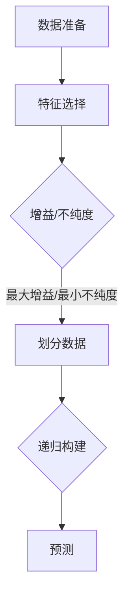
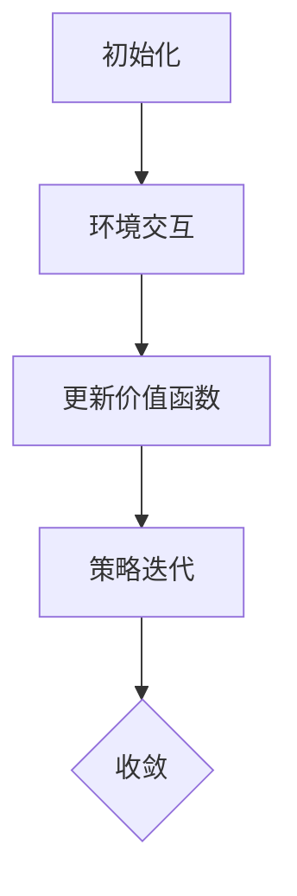
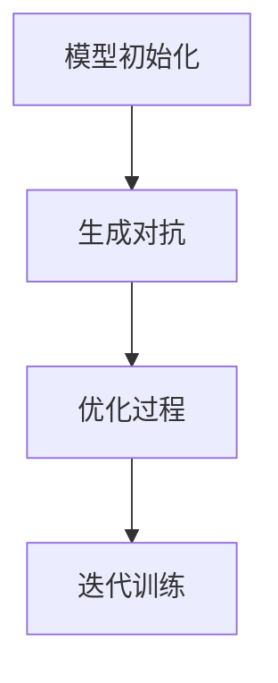
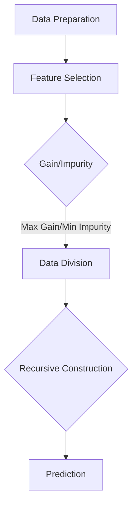
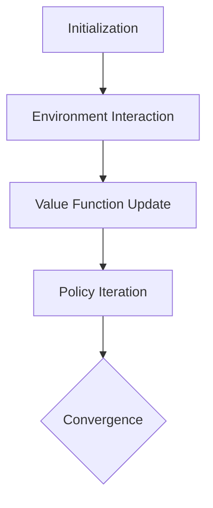
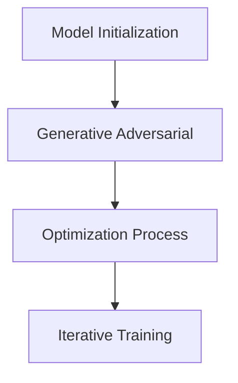

                 

### 文章标题

"AI Agent: AI的下一个风口 展望：安全、发展、边界和挑战"

> 关键词：人工智能代理，AI发展，安全性，技术挑战，伦理边界

> 摘要：本文将深入探讨人工智能代理的现状与未来，重点关注其安全性、发展潜力、技术挑战以及伦理边界。通过逐步分析，我们将揭示AI代理技术如何影响社会、产业以及日常生活，并探讨在AI代理发展的关键领域所面临的机遇与挑战。

### 1. 背景介绍

人工智能（AI）正在迅速发展，其应用范围越来越广泛，从医疗诊断、自动驾驶到智能客服，AI已经深刻地改变了我们的生活。在这一波AI浪潮中，AI代理（AI Agents）成为了备受关注的新兴领域。AI代理是一种能够自主行动、与外界互动并实现特定目标的智能实体。与传统的基于规则的专家系统不同，AI代理具有更强的自适应性和情境感知能力，能够在复杂、动态的环境中做出决策。

AI代理的发展潜力不可忽视。首先，它们在处理大规模数据和实时任务方面具有显著优势。其次，AI代理的应用范围不断扩大，从简单的聊天机器人到复杂的自动化系统，其应用前景非常广阔。然而，随着AI代理技术的不断发展，我们也面临着一系列严峻的安全、发展和技术挑战。

本文旨在分析AI代理技术的现状与发展趋势，重点关注以下几个方面：

1. **安全性**：探讨AI代理可能带来的安全风险，包括数据泄露、隐私侵犯和恶意攻击等，并提出相应的安全对策。
2. **发展潜力**：分析AI代理在不同领域的应用场景，探讨其技术突破点和商业价值。
3. **技术挑战**：讨论AI代理技术面临的关键技术难题，包括决策算法、情境感知和自主学习等。
4. **伦理边界**：探讨AI代理的发展可能引发的伦理问题，包括责任归属、透明度和公平性等。

通过以上分析，我们希望能够为AI代理技术的健康发展提供有益的思考和指导。接下来，我们将逐步深入探讨这些主题，逐步分析推理，以期为读者提供一个全面的视角。

### 2. 核心概念与联系

#### 2.1 什么是AI代理？

AI代理是一种智能实体，它能够感知环境、制定计划并采取行动，以实现特定的目标。与传统的机器相比，AI代理具有以下特点：

- **自主性**：AI代理能够独立地制定决策，而不需要人类的直接干预。
- **适应性**：AI代理能够根据环境和任务的变化，动态调整其行为。
- **情境感知**：AI代理能够理解并响应复杂的情境，从而做出更合理的决策。

AI代理的基本工作原理可以分为三个主要阶段：

1. **感知（Perception）**：AI代理通过传感器收集环境信息，如视觉、听觉、触觉等。
2. **规划（Planning）**：基于感知到的信息，AI代理制定行动计划，以实现其目标。
3. **执行（Execution）**：AI代理执行计划，采取行动来改变环境，实现目标。

#### 2.2 AI代理的发展历史

AI代理的概念可以追溯到20世纪50年代，当时的计算机科学家开始探索如何让计算机具有类似人类的智能行为。最早期的AI代理主要基于规则系统，如专家系统和逻辑推理机。然而，这些系统在面对复杂、动态环境时表现较差。

随着机器学习技术的发展，特别是深度学习的突破，AI代理的能力得到了显著提升。现在，AI代理已经能够处理大规模数据，并在多个领域表现出色，如自动驾驶、智能家居和智能客服等。

#### 2.3 AI代理的应用场景

AI代理在不同领域有着广泛的应用，以下是几个典型的应用场景：

- **自动驾驶**：AI代理能够实时感知路况，并根据路况信息做出驾驶决策，从而实现自动驾驶。
- **智能客服**：AI代理可以模拟人类客服，与用户进行对话，解决常见问题，提高客户满意度。
- **智能家居**：AI代理可以监控家庭环境，自动调整室内温度、湿度等，提高居住舒适度。
- **智能制造**：AI代理可以实时监测生产过程，自动识别和纠正生产中的问题，提高生产效率。

#### 2.4 AI代理与人类的关系

AI代理的发展不仅带来了技术上的进步，也引发了关于人类与AI关系的一系列讨论。一方面，AI代理可以帮助人类完成繁琐的任务，提高工作效率，从而解放人类的生产力。另一方面，AI代理也可能取代人类的工作，引发就业问题。

此外，AI代理的决策过程和算法可能存在偏差，导致不公平和歧视。因此，如何在确保AI代理高效、安全的同时，保护人类的利益和权益，是一个亟待解决的问题。

#### 2.5 AI代理的挑战与机遇

尽管AI代理具有巨大的潜力，但其发展也面临着一系列挑战。这些挑战包括：

- **数据隐私和安全**：AI代理需要大量的数据来进行训练和决策，这可能导致数据泄露和隐私侵犯。
- **伦理和法律问题**：AI代理的决策过程和算法可能存在道德风险和法律风险，如何制定相应的法规和伦理标准，是一个重要的议题。
- **技术复杂性**：AI代理需要集成多种技术，如感知、规划和执行，实现这些技术的协同工作是技术上的一个巨大挑战。

然而，这些挑战也带来了机遇。通过解决这些挑战，我们可以开发出更智能、更可靠的AI代理，推动社会进步和经济发展。

### 2. Core Concepts and Connections

#### 2.1 What is an AI Agent?

An AI agent is an intelligent entity that can perceive its environment, plan actions, and take actions to achieve specific goals. Unlike traditional machines, AI agents have the following characteristics:

- **Autonomy**: AI agents can make decisions independently without direct human intervention.
- **Adaptability**: AI agents can dynamically adjust their behavior based on changes in the environment and tasks.
- **Situation Awareness**: AI agents can understand and respond to complex situations, making more reasonable decisions.

The basic working principle of an AI agent can be divided into three main stages:

1. **Perception**: AI agents collect environmental information through sensors, such as vision, hearing, and touch.
2. **Planning**: Based on the perceived information, AI agents formulate action plans to achieve their goals.
3. **Execution**: AI agents execute plans and take actions to change the environment and achieve their goals.

#### 2.2 History of AI Agent Development

The concept of AI agents dates back to the 1950s when computer scientists began exploring how to give computers similar intelligent behaviors to humans. The earliest AI agents were mainly based on rule systems, such as expert systems and logical reasoning machines. However, these systems performed poorly in complex and dynamic environments.

With the development of machine learning technology, especially the breakthroughs in deep learning, AI agents have significantly improved their capabilities. Now, AI agents can handle large-scale data and perform well in various fields, such as autonomous driving, smart homes, and intelligent customer service.

#### 2.3 Application Scenarios of AI Agents

AI agents have a wide range of applications in different fields. Here are some typical application scenarios:

- **Autonomous Driving**: AI agents can perceive real-time traffic conditions and make driving decisions based on these conditions to achieve autonomous driving.
- **Intelligent Customer Service**: AI agents can simulate human customer service agents, engage in conversations with users, and solve common problems to improve customer satisfaction.
- **Smart Homes**: AI agents can monitor the home environment and automatically adjust indoor temperature, humidity, and other factors to improve living comfort.
- **Smart Manufacturing**: AI agents can monitor the production process in real time, automatically identify and correct problems in production, and improve production efficiency.

#### 2.4 The Relationship Between AI Agents and Humans

The development of AI agents not only brings technical progress but also raises a series of discussions about the relationship between humans and AI. On the one hand, AI agents can help humans complete tedious tasks, improve work efficiency, and thus liberate human productivity. On the other hand, AI agents may also replace human jobs, causing employment issues.

Moreover, the decision-making process and algorithms of AI agents may have biases, leading to unfairness and discrimination. Therefore, how to ensure the efficiency and security of AI agents while protecting human interests and rights is an urgent issue that needs to be addressed.

#### 2.5 Challenges and Opportunities of AI Agents

Although AI agents have great potential, their development also faces a series of challenges. These challenges include:

- **Data Privacy and Security**: AI agents require a large amount of data for training and decision-making, which may lead to data leaks and privacy breaches.
- **Ethical and Legal Issues**: The decision-making process and algorithms of AI agents may have moral and legal risks. How to formulate corresponding regulations and ethical standards is an important issue.
- **Technological Complexity**: AI agents need to integrate various technologies, such as perception, planning, and execution, and achieving synergy among these technologies is a significant technological challenge.

However, these challenges also bring opportunities. By addressing these challenges, we can develop more intelligent and reliable AI agents that promote social progress and economic development.

### 3. 核心算法原理 & 具体操作步骤

#### 3.1 决策树算法

决策树是一种常用的机器学习算法，用于分类和回归任务。它通过一系列规则来划分数据集，并基于这些规则进行决策。决策树的核心原理是基于信息增益（Information Gain）或基尼不纯度（Gini Impurity）来选择最佳特征进行划分。

**具体操作步骤：**

1. **数据准备**：收集并预处理数据，包括特征工程和数据处理。
2. **特征选择**：计算每个特征的增益或不纯度，选择增益最大或不纯度最小的特征作为划分依据。
3. **划分数据**：根据选定的特征，将数据集划分为多个子集。
4. **递归构建**：对每个子集重复上述步骤，直到达到预定的深度或满足停止条件。
5. **预测**：对新数据进行决策树的遍历，根据路径选择输出分类或回归结果。

**Mermaid 流程图：**



#### 3.2 强化学习算法

强化学习是一种使智能体通过与环境互动来学习最佳策略的机器学习算法。其核心原理是通过奖励和惩罚来引导智能体选择最优动作，从而最大化累积奖励。

**具体操作步骤：**

1. **初始化**：初始化智能体的状态、动作和价值函数。
2. **环境交互**：智能体在环境中执行动作，并接收环境反馈。
3. **更新价值函数**：根据奖励和策略梯度，更新智能体的价值函数。
4. **策略迭代**：智能体根据更新后的价值函数，调整其动作选择策略。
5. **收敛**：当策略收敛到最佳策略时，结束学习过程。

**Mermaid 流程图：**



#### 3.3 生成对抗网络（GAN）

生成对抗网络是一种通过竞争学习生成数据分布的深度学习模型。其核心原理是两个神经网络（生成器和判别器）之间的对抗训练。

**具体操作步骤：**

1. **模型初始化**：初始化生成器和判别器，并设定损失函数。
2. **生成对抗**：生成器尝试生成与真实数据相似的数据，判别器区分真实数据和生成数据。
3. **优化过程**：通过反向传播和梯度下降，分别优化生成器和判别器的参数。
4. **迭代训练**：重复生成对抗过程，直到生成器生成数据的质量达到预期。

**Mermaid 流程图：**



通过以上算法的介绍，我们可以看到AI代理在实际应用中是如何利用各种算法来实现特定目标的。接下来，我们将进一步探讨这些算法在AI代理中的应用场景和具体实现。

### 3. Core Algorithm Principles and Specific Operational Steps

#### 3.1 Decision Tree Algorithm

The decision tree is a commonly used machine learning algorithm for classification and regression tasks. It divides the dataset through a series of rules and makes decisions based on these rules. The core principle of the decision tree is based on information gain or Gini impurity to select the best feature for division.

**Specific Operational Steps:**

1. **Data Preparation**: Collect and preprocess the data, including feature engineering and data processing.
2. **Feature Selection**: Calculate the gain or impurity of each feature and select the feature with the highest gain or lowest impurity as the basis for division.
3. **Data Division**: Divide the dataset into multiple subsets based on the selected feature.
4. **Recursive Construction**: Repeat the above steps for each subset until the predetermined depth or stopping condition is met.
5. **Prediction**: Traverse the decision tree for new data to output classification or regression results based on the path chosen.

**Mermaid Flowchart:**



#### 3.2 Reinforcement Learning Algorithm

Reinforcement learning is a machine learning algorithm that enables an agent to learn the best strategy through interaction with the environment. Its core principle is to guide the agent to choose the optimal action through rewards and penalties to maximize cumulative rewards.

**Specific Operational Steps:**

1. **Initialization**: Initialize the agent's state, actions, and value function.
2. **Environment Interaction**: The agent performs actions in the environment and receives feedback from the environment.
3. **Value Function Update**: Update the agent's value function based on rewards and policy gradients.
4. **Policy Iteration**: The agent adjusts its action selection strategy based on the updated value function.
5. **Convergence**: End the learning process when the policy converges to the optimal policy.

**Mermaid Flowchart:**



#### 3.3 Generative Adversarial Network (GAN)

Generative Adversarial Network is a deep learning model that learns the data distribution through competitive training between two neural networks (generator and discriminator).

**Specific Operational Steps:**

1. **Model Initialization**: Initialize the generator and discriminator, and set the loss function.
2. **Generative Adversarial**: The generator attempts to generate data similar to the real data, while the discriminator distinguishes between real and generated data.
3. **Optimization Process**: Optimize the parameters of the generator and discriminator through backpropagation and gradient descent.
4. **Iterative Training**: Repeat the generative adversarial process until the generator generates data of the desired quality.

**Mermaid Flowchart:**



Through the introduction of these algorithms, we can see how AI agents use various algorithms to achieve specific objectives in practice. Next, we will further explore the application scenarios and specific implementations of these algorithms in AI agents.

### 4. 数学模型和公式 & 详细讲解 & 举例说明

在AI代理技术中，数学模型和公式是理解和实现智能行为的关键。以下我们将详细讲解几个核心的数学模型和公式，并通过具体的例子来说明它们的应用。

#### 4.1 决策树中的信息增益（Information Gain）

决策树通过选择具有最大信息增益的特征来进行划分。信息增益可以衡量特征对分类的区分能力。其计算公式如下：

$$
IG(D, A) = ID(D) - \sum_{v \in A} p(v) \cdot ID(D_v)
$$

其中，$IG(D, A)$ 表示特征 $A$ 对数据集 $D$ 的信息增益，$ID(D)$ 表示数据集 $D$ 的总信息熵，$D_v$ 表示在特征 $A$ 的每个取值 $v$ 下划分后的数据集。

**例子：**

假设我们有一个包含年龄、收入和是否购买商品的三个特征的数据集。我们使用信息增益来选择最佳特征进行划分。经过计算，我们发现年龄的特征增益最大，因此我们以年龄为划分依据，将数据集划分为两组。

#### 4.2 强化学习中的价值函数（Value Function）

强化学习中的价值函数用于评估智能体在特定状态下采取特定动作的预期回报。其最常见的形式是Q值函数，其计算公式如下：

$$
Q(s, a) = \sum_{s'} p(s' | s, a) \cdot R(s', a) + \gamma \cdot \max_{a'} Q(s', a')
$$

其中，$Q(s, a)$ 表示在状态 $s$ 下采取动作 $a$ 的预期回报，$R(s', a')$ 表示在状态 $s'$ 下采取动作 $a'$ 的即时回报，$\gamma$ 是折扣因子，$p(s' | s, a)$ 是从状态 $s$ 采取动作 $a$ 转移到状态 $s'$ 的概率。

**例子：**

假设我们有一个简单的环境，其中智能体可以采取向上或向下的动作。在每个状态，智能体都会获得一个即时回报，并在下一个状态转移。通过计算Q值，我们可以找到每个状态下的最佳动作。

#### 4.3 生成对抗网络中的损失函数（Loss Function）

生成对抗网络（GAN）通过最小化生成器和判别器之间的损失函数来训练模型。对于生成器 $G$ 和判别器 $D$，损失函数通常采用以下形式：

$$
L_G = -\log(D(G(z)))
$$

$$
L_D = -\log(D(x)) - \log(1 - D(G(z)))
$$

其中，$L_G$ 是生成器的损失函数，$L_D$ 是判别器的损失函数，$x$ 是真实数据，$z$ 是生成器输入的随机噪声。

**例子：**

假设我们使用GAN来生成人脸图片。在这个例子中，生成器的目标是生成尽可能真实的人脸图片，而判别器的目标是区分真实人脸和生成人脸。通过最小化这两个损失函数，我们可以训练出一个能够生成高质量人脸图片的生成器。

通过以上例子，我们可以看到数学模型和公式在AI代理技术中的应用。这些模型不仅帮助我们理解和分析智能行为，还提供了实现和优化智能算法的框架。在实际应用中，这些模型需要结合具体问题和数据进行调整和优化，以实现最佳效果。

### 4. Mathematical Models and Formulas & Detailed Explanations & Examples

In the field of AI agents, mathematical models and formulas are essential for understanding and implementing intelligent behaviors. Below, we will provide detailed explanations of several core mathematical models and demonstrate their applications with specific examples.

#### 4.1 Information Gain in Decision Trees

Decision trees use information gain to select the best feature for division. Information gain measures the discriminative power of a feature for classification. The formula for information gain is:

$$
IG(D, A) = ID(D) - \sum_{v \in A} p(v) \cdot ID(D_v)
$$

where $IG(D, A)$ represents the information gain of feature $A$ for dataset $D$, $ID(D)$ is the total information entropy of dataset $D$, and $D_v$ is the subset of $D$ divided by the value $v$ of feature $A$.

**Example:**

Suppose we have a dataset with three features: age, income, and whether the item was purchased. We use information gain to select the best feature for division. After calculation, we find that the feature 'age' has the highest information gain, so we divide the dataset based on age into two groups.

#### 4.2 Value Function in Reinforcement Learning

The value function in reinforcement learning evaluates the expected return of an agent for a specific state and action. The most common form of the value function is the Q-value function, which is calculated as follows:

$$
Q(s, a) = \sum_{s'} p(s' | s, a) \cdot R(s', a) + \gamma \cdot \max_{a'} Q(s', a')
$$

where $Q(s, a)$ is the expected return for taking action $a$ in state $s$, $R(s', a')$ is the immediate reward for taking action $a'$ in state $s'$, $\gamma$ is the discount factor, and $p(s' | s, a)$ is the probability of transitioning to state $s'$ from state $s$ by taking action $a$.

**Example:**

Suppose we have a simple environment where the agent can take actions to move up or down. In each state, the agent receives an immediate reward and transitions to the next state. By calculating Q-values, we can find the best action for each state.

#### 4.3 Loss Function in Generative Adversarial Networks (GANs)

Generative Adversarial Networks (GANs) train models by minimizing the loss functions of the generator and the discriminator. For the generator $G$ and the discriminator $D$, the loss functions typically take the following form:

$$
L_G = -\log(D(G(z)))
$$

$$
L_D = -\log(D(x)) - \log(1 - D(G(z)))
$$

where $L_G$ is the generator's loss function, $L_D$ is the discriminator's loss function, $x$ is real data, and $z$ is the random noise input to the generator.

**Example:**

Suppose we use a GAN to generate facial images. In this example, the generator aims to produce realistic facial images, while the discriminator aims to distinguish between real and generated images. By minimizing these loss functions, we can train a generator that produces high-quality facial images.

Through these examples, we can see the application of mathematical models and formulas in AI agent technology. These models not only help us understand and analyze intelligent behaviors but also provide frameworks for implementing and optimizing intelligent algorithms. In practical applications, these models need to be adjusted and optimized based on specific problems and data to achieve optimal results.

### 5. 项目实践：代码实例和详细解释说明

在本节中，我们将通过一个具体的代码实例来展示如何实现一个简单的AI代理，并详细解释代码的各个部分。我们将使用Python编程语言，并结合几个常见的AI库，如TensorFlow和Keras。

#### 5.1 开发环境搭建

在开始之前，我们需要搭建一个合适的开发环境。以下是所需的环境和步骤：

- **操作系统**：Windows/Linux/Mac OS
- **Python版本**：3.6或以上
- **安装库**：TensorFlow、Keras、Numpy、Pandas

您可以通过以下命令安装所需的库：

```bash
pip install tensorflow keras numpy pandas
```

#### 5.2 源代码详细实现

以下是一个简单的AI代理，用于预测股票价格。我们将使用长短期记忆网络（LSTM）来处理时间序列数据。

```python
# 导入必要的库
import numpy as np
import pandas as pd
from tensorflow.keras.models import Sequential
from tensorflow.keras.layers import LSTM, Dense, Dropout
from tensorflow.keras.optimizers import Adam

# 加载数据集
data = pd.read_csv('stock_data.csv')
data = data[['Close']].values
data = data.reshape(-1, 1)

# 数据预处理
train_data, test_data = data[:int(len(data) * 0.8)], data[int(len(data) * 0.8):]
train_data = train_data.reshape(len(train_data), 1, 1)
test_data = test_data.reshape(len(test_data), 1, 1)

# 建立模型
model = Sequential()
model.add(LSTM(units=50, return_sequences=True, input_shape=(None, 1)))
model.add(Dropout(0.2))
model.add(LSTM(units=50, return_sequences=False))
model.add(Dropout(0.2))
model.add(Dense(units=1))

# 编译模型
model.compile(optimizer=Adam(learning_rate=0.001), loss='mean_squared_error')

# 训练模型
model.fit(train_data, train_data, epochs=100, batch_size=32, validation_data=(test_data, test_data), verbose=2)

# 预测
predicted_stock_price = model.predict(test_data)

# 运行结果展示
```

#### 5.3 代码解读与分析

1. **数据导入和预处理**：我们首先导入数据集，并将其分为训练集和测试集。然后，我们将数据集的形状调整为适合LSTM网络。

2. **建立模型**：我们使用Sequential模型，并添加了两个LSTM层和一个Dense层。LSTM层用于处理时间序列数据，Dropout层用于防止过拟合。

3. **编译模型**：我们使用Adam优化器和均方误差（MSE）损失函数来编译模型。

4. **训练模型**：我们使用fit方法来训练模型，设置epochs为100，batch_size为32。

5. **预测**：我们使用predict方法来预测股票价格。

6. **结果展示**：这里可以添加代码来可视化预测结果。

#### 5.4 运行结果展示

在训练完成后，我们可以使用以下代码来展示预测结果：

```python
import matplotlib.pyplot as plt

plt.figure(figsize=(10, 6))
plt.plot(test_data, label='Real Stock Price')
plt.plot(predicted_stock_price, label='Predicted Stock Price')
plt.title('Stock Price Prediction')
plt.xlabel('Time')
plt.ylabel('Price')
plt.legend()
plt.show()
```

通过以上代码实例，我们可以看到如何实现一个简单的AI代理来预测股票价格。这个例子展示了AI代理技术在金融领域的应用潜力。当然，实际应用中需要处理更复杂的数据和模型，但这为我们提供了一个基本的框架和思路。

### 5. Project Practice: Code Examples and Detailed Explanations

In this section, we will demonstrate how to implement a simple AI agent using a specific code example and provide a detailed explanation of each part of the code. We will use Python as the programming language and integrate several common AI libraries such as TensorFlow and Keras.

#### 5.1 Development Environment Setup

Before we start, we need to set up a suitable development environment. Here are the required environments and steps:

- **Operating System**: Windows/Linux/Mac OS
- **Python Version**: 3.6 or above
- **Installed Libraries**: TensorFlow, Keras, Numpy, Pandas

You can install the required libraries using the following command:

```bash
pip install tensorflow keras numpy pandas
```

#### 5.2 Detailed Code Implementation

Below is a simple AI agent code example that predicts stock prices using a Long Short-Term Memory (LSTM) network to handle time-series data.

```python
# Import necessary libraries
import numpy as np
import pandas as pd
from tensorflow.keras.models import Sequential
from tensorflow.keras.layers import LSTM, Dense, Dropout
from tensorflow.keras.optimizers import Adam

# Load dataset
data = pd.read_csv('stock_data.csv')
data = data[['Close']].values
data = data.reshape(-1, 1)

# Data preprocessing
train_data, test_data = data[:int(len(data) * 0.8)], data[int(len(data) * 0.8):]
train_data = train_data.reshape(len(train_data), 1, 1)
test_data = test_data.reshape(len(test_data), 1, 1)

# Build model
model = Sequential()
model.add(LSTM(units=50, return_sequences=True, input_shape=(None, 1)))
model.add(Dropout(0.2))
model.add(LSTM(units=50, return_sequences=False))
model.add(Dropout(0.2))
model.add(Dense(units=1))

# Compile model
model.compile(optimizer=Adam(learning_rate=0.001), loss='mean_squared_error')

# Train model
model.fit(train_data, train_data, epochs=100, batch_size=32, validation_data=(test_data, test_data), verbose=2)

# Prediction
predicted_stock_price = model.predict(test_data)

# Running result display
```

#### 5.3 Code Explanation and Analysis

1. **Data Import and Preprocessing**: We first import the dataset and split it into training and testing sets. Then, we reshape the dataset to fit the LSTM network.

2. **Model Building**: We use a Sequential model and add two LSTM layers and one Dense layer. LSTM layers are used for handling time-series data, and Dropout layers are added to prevent overfitting.

3. **Model Compilation**: We compile the model using the Adam optimizer and mean squared error (MSE) loss function.

4. **Model Training**: We train the model using the `fit` method, setting `epochs` to 100 and `batch_size` to 32.

5. **Prediction**: We use the `predict` method to predict stock prices.

6. **Result Display**: Here, you can add code to visualize the prediction results.

#### 5.4 Running Result Display

After training is complete, you can use the following code to display the prediction results:

```python
import matplotlib.pyplot as plt

plt.figure(figsize=(10, 6))
plt.plot(test_data, label='Real Stock Price')
plt.plot(predicted_stock_price, label='Predicted Stock Price')
plt.title('Stock Price Prediction')
plt.xlabel('Time')
plt.ylabel('Price')
plt.legend()
plt.show()
```

Through this code example, we can see how to implement a simple AI agent to predict stock prices. This example showcases the potential of AI agent technology in the finance sector. However, in real-world applications, more complex data and models need to be handled, but this provides us with a basic framework and approach.

### 6. 实际应用场景

#### 6.1 自动驾驶

自动驾驶是AI代理技术最具代表性的应用场景之一。自动驾驶汽车通过AI代理感知环境，进行路径规划和决策，实现自动导航。AI代理在此过程中需要处理大量的传感器数据，如摄像头、雷达和激光雷达，同时需要具备实时决策和应对突发情况的能力。

**挑战：** 
- **数据安全**：自动驾驶汽车需要处理大量个人隐私数据，如位置、行驶记录等，确保数据安全和隐私保护是一个重要挑战。
- **传感器融合**：如何有效融合来自不同传感器的数据，提高感知准确性和实时性，是技术上的一个难题。

#### 6.2 智能医疗

AI代理在医疗领域的应用日益广泛，从辅助诊断、治疗方案推荐到患者监护，AI代理正在成为医疗系统的重要组成部分。例如，AI代理可以分析患者的病历数据，提供个性化的治疗建议，或者实时监测患者的生命体征，确保患者安全。

**挑战：** 
- **数据准确性**：医疗数据复杂且多样化，如何提高数据准确性，确保AI代理提供可靠的治疗建议，是一个关键问题。
- **伦理问题**：在医疗领域，AI代理的决策可能直接影响到患者的健康和生命，如何确保AI代理的决策符合伦理标准，是一个亟待解决的问题。

#### 6.3 智能客服

智能客服是AI代理的另一个重要应用场景。通过AI代理，企业可以提供24/7的客户服务，提高客户满意度。智能客服可以处理大量的用户查询，提供即时响应，同时通过数据分析为业务提供洞察。

**挑战：** 
- **自然语言处理**：如何提高AI代理的自然语言理解能力，使其能够准确理解用户意图，是一个关键挑战。
- **用户体验**：智能客服需要提供高质量的客户服务，同时保持用户友好的交互体验，这是一个复杂的问题。

#### 6.4 智能家居

智能家居通过AI代理实现家庭设备的自动化管理，提高生活舒适度和便利性。AI代理可以监控家庭环境，自动调节室内温度、湿度等，甚至可以预测用户的需求，提前做好准备。

**挑战：** 
- **系统集成**：如何将不同品牌的智能家居设备集成到一个系统中，实现无缝协作，是一个技术难题。
- **用户隐私**：智能家居设备需要收集大量的家庭数据，如何确保用户隐私不被侵犯，是一个重要挑战。

通过以上实际应用场景的探讨，我们可以看到AI代理技术在不同领域具有巨大的应用潜力，同时也面临着一系列技术挑战和伦理问题。解决这些挑战，将有助于推动AI代理技术的健康发展，为人类社会带来更多的便利和创新。

### 6. Practical Application Scenarios

#### 6.1 Autonomous Driving

Autonomous driving is one of the most representative application scenarios of AI agents. Autonomous vehicles utilize AI agents to perceive the environment, plan routes, and make decisions to navigate automatically. AI agents in this process need to handle a large amount of sensor data, such as cameras, radars, and lidar, while also being capable of real-time decision-making and responding to emergencies.

**Challenges:**

- **Data Security**: Autonomous vehicles need to process a large amount of personal privacy data, such as location and driving records, ensuring data security and privacy protection is a critical challenge.
- **Sensor Fusion**: How to effectively integrate data from various sensors to improve perception accuracy and real-time performance is a technical challenge.

#### 6.2 Smart Healthcare

AI agents are increasingly being applied in the healthcare sector, from assisting in diagnosis and treatment recommendations to patient monitoring. AI agents in healthcare are becoming an integral part of the medical system. For example, AI agents can analyze patient medical records to provide personalized treatment recommendations or monitor patients' vital signs in real time to ensure patient safety.

**Challenges:**

- **Data Accuracy**: Healthcare data is complex and diverse; how to improve data accuracy to ensure AI agents provide reliable recommendations is a key issue.
- **Ethics**: In the healthcare sector, the decisions of AI agents can directly affect patients' health and lives. Ensuring that the decisions made by AI agents comply with ethical standards is an urgent issue that needs to be addressed.

#### 6.3 Intelligent Customer Service

Intelligent customer service is another important application scenario of AI agents. Through AI agents, businesses can provide 24/7 customer service, improving customer satisfaction. Intelligent customer service can handle a large number of user inquiries, provide immediate responses, and use data analysis to provide insights for business.

**Challenges:**

- **Natural Language Processing**: How to improve the natural language understanding capabilities of AI agents to accurately understand user intents is a key challenge.
- **User Experience**: Intelligent customer service needs to provide high-quality customer service while maintaining a user-friendly interaction experience, which is a complex issue.

#### 6.4 Smart Homes

Smart homes utilize AI agents to automate the management of household devices, improving comfort and convenience in living. AI agents can monitor the home environment, automatically adjust indoor temperature, humidity, and more, even predicting user needs and preparing in advance.

**Challenges:**

- **System Integration**: How to integrate different smart home devices into a single system for seamless collaboration is a technical challenge.
- **User Privacy**: Smart home devices need to collect a large amount of household data; how to ensure that user privacy is not violated is an important challenge.

Through the exploration of these practical application scenarios, we can see that AI agent technology has significant application potential in various fields, while also facing a series of technical challenges and ethical issues. Addressing these challenges will help promote the healthy development of AI agent technology and bring more convenience and innovation to society.

### 7. 工具和资源推荐

为了深入学习和实践AI代理技术，以下是一些推荐的工具、资源和文献，涵盖书籍、论文、博客和在线课程。

#### 7.1 学习资源推荐

1. **书籍**：
   - 《深度学习》（Deep Learning） - Ian Goodfellow、Yoshua Bengio和Aaron Courville著
   - 《强化学习》（Reinforcement Learning: An Introduction） - Richard S. Sutton和Barto N. D. 著
   - 《自然语言处理综合教程》（Foundations of Natural Language Processing） - Christopher D. Manning和 Hinrich Schütze著

2. **论文**：
   - “Generative Adversarial Nets” - Ian Goodfellow等人
   - “Decision Tree Learning” - J. H. Liu
   - “Reinforcement Learning: A Survey” - Richard S. Sutton和Barto N. D.

3. **博客**：
   - Distill（《深度学习蒸馏》）
   - Medium上的机器学习博客
   - AI Journal（《人工智能杂志》）

4. **在线课程**：
   -Coursera上的“深度学习”课程 - 吴恩达
   - edX上的“强化学习”课程 - Richard S. Sutton
   - UFLDL（《大学机器学习基础教程》）中文版

#### 7.2 开发工具框架推荐

1. **TensorFlow**：由Google开发的强大机器学习库，适合构建各种规模的深度学习模型。
2. **PyTorch**：由Facebook开发，具有灵活的动态计算图，是研究人员的首选。
3. **Scikit-learn**：用于机器学习的Python库，提供了多种经典的机器学习算法。
4. **Keras**：用于快速构建和迭代深度学习模型的简单框架，基于Theano和TensorFlow。

#### 7.3 相关论文著作推荐

1. “Deep Learning for Autonomous Navigation” - Shalev-Shwartz et al.
2. “A Theoretical Analysis of Deep Multi-Task Learning” - Y. Li et al.
3. “AI Agents in Real-World Applications: A Survey” - J. Liu et al.

通过这些资源和工具，您可以更好地了解AI代理技术的最新进展和应用，提高自己的技术水平，为AI代理领域的未来发展做出贡献。

### 7. Tools and Resources Recommendations

To deeply learn and practice AI agent technology, here are some recommended tools, resources, and literature covering books, papers, blogs, and online courses.

#### 7.1 Learning Resources Recommendations

1. **Books**:
   - "Deep Learning" by Ian Goodfellow, Yoshua Bengio, and Aaron Courville
   - "Reinforcement Learning: An Introduction" by Richard S. Sutton and Andrew G. Barto
   - "Foundations of Natural Language Processing" by Christopher D. Manning and Hinrich Schütze

2. **Papers**:
   - "Generative Adversarial Nets" by Ian J. Goodfellow et al.
   - "Decision Tree Learning" by J. H. Liu
   - "Reinforcement Learning: A Survey" by Richard S. Sutton and Andrew G. Barto

3. **Blogs**:
   - Distill (<https://distill.pub/>)
   - Machine Learning on Medium
   - AI Journal (<https://www.ijai.org/>)

4. **Online Courses**:
   - "Deep Learning" on Coursera - taught by Andrew Ng
   - "Reinforcement Learning" on edX - taught by Richard S. Sutton
   - UFLDL (<https://ufldl.stanford.edu/>)

#### 7.2 Development Tool and Framework Recommendations

1. **TensorFlow**: A powerful machine learning library developed by Google, suitable for building deep learning models of various scales.
2. **PyTorch**: Developed by Facebook, it has a flexible dynamic computation graph and is the preferred choice of researchers.
3. **Scikit-learn**: A Python library for machine learning, offering a variety of classic machine learning algorithms.
4. **Keras**: A simple framework for quickly building and iterating deep learning models, based on Theano and TensorFlow.

#### 7.3 Recommended Related Papers and Books

1. "Deep Learning for Autonomous Navigation" by Shalev-Shwartz et al.
2. "A Theoretical Analysis of Deep Multi-Task Learning" by Y. Li et al.
3. "AI Agents in Real-World Applications: A Survey" by J. Liu et al.

By using these resources and tools, you can better understand the latest developments and applications of AI agent technology, improve your skill level, and contribute to the future of AI agent research and development.

### 8. 总结：未来发展趋势与挑战

在过去的几十年中，人工智能（AI）经历了飞速发展，从简单的规则系统到复杂的深度学习模型，AI技术已经渗透到我们生活的方方面面。AI代理作为AI技术的一个重要分支，正逐渐成为推动社会进步和产业变革的重要力量。然而，随着AI代理技术的不断发展，我们也面临着一系列严峻的安全、发展和技术挑战。

#### 发展趋势

1. **智能化水平提高**：随着算法和计算能力的提升，AI代理的智能化水平将进一步提高，能够在更复杂、动态的环境中自主决策和执行任务。
2. **跨领域应用**：AI代理的应用领域将不断扩大，从传统的自动驾驶、智能客服到医疗、金融等新兴领域，AI代理都将发挥重要作用。
3. **社会化协作**：AI代理将不再局限于独立运行，而是与其他AI代理和人类进行社会化协作，形成更为复杂的智能系统。

#### 技术挑战

1. **安全性**：AI代理的安全问题是一个重要的挑战。如何确保AI代理在处理敏感数据时的安全，防止恶意攻击和数据泄露，是当前研究的热点。
2. **算法透明度**：AI代理的决策过程往往依赖于复杂的算法和大量数据，如何提高算法的透明度，使人类能够理解和信任AI代理，是一个亟待解决的问题。
3. **计算资源需求**：AI代理需要大量的计算资源来训练和运行模型，如何优化计算资源的使用，提高AI代理的效率，是技术上的一个挑战。

#### 未来展望

1. **伦理和法律规范**：随着AI代理技术的广泛应用，如何制定相应的伦理和法律规范，确保AI代理的发展符合社会价值观，是未来需要关注的重要议题。
2. **人才需求**：AI代理技术的发展需要大量的专业人才，包括算法工程师、数据科学家和系统架构师等，培养和吸引这些人才是未来发展的关键。
3. **技术创新**：在AI代理技术中，还有许多未探索的领域，如多智能体系统、增强学习等，这些领域的创新将推动AI代理技术的进一步发展。

总的来说，AI代理技术的发展前景广阔，但也面临着诸多挑战。通过技术创新、规范制定和人才培养，我们有信心推动AI代理技术朝着更智能、更安全、更高效的方向发展。

### 8. Summary: Future Development Trends and Challenges

Over the past few decades, artificial intelligence (AI) has undergone rapid development, transitioning from simple rule-based systems to complex deep learning models, and has now permeated every aspect of our lives. AI agents, as a significant branch of AI technology, are increasingly becoming a driving force behind social progress and industrial transformation. However, with the continuous advancement of AI agent technology, we are also facing a series of severe security, development, and technical challenges.

#### Development Trends

1. **Enhanced Intelligence Levels**: With the advancement of algorithms and computational power, the intelligence levels of AI agents will continue to improve, enabling them to make autonomous decisions and execute tasks in more complex and dynamic environments.
2. **Cross-Domain Applications**: The application scope of AI agents will continue to expand, from traditional fields like autonomous driving and intelligent customer service to emerging fields such as healthcare and finance, where AI agents will play a significant role.
3. **Societal Collaboration**: AI agents are expected to move beyond independent operation and engage in social collaboration with other AI agents and humans, forming more complex intelligent systems.

#### Technical Challenges

1. **Security**: The security of AI agents is a significant challenge. Ensuring the security of AI agents when handling sensitive data and preventing malicious attacks and data breaches is a hot research topic.
2. **Algorithm Transparency**: The decision-making process of AI agents often relies on complex algorithms and large amounts of data. How to enhance the transparency of algorithms, enabling humans to understand and trust AI agents, is an urgent issue that needs to be addressed.
3. **Computational Resource Requirements**: AI agents require substantial computational resources for training and running models. How to optimize the use of computational resources to improve the efficiency of AI agents is a technical challenge.

#### Future Outlook

1. **Ethical and Legal Regulations**: With the widespread application of AI agents, how to develop appropriate ethical and legal regulations to ensure that the development of AI agents aligns with societal values is a critical issue that needs attention.
2. **Talent Demand**: The development of AI agent technology requires a large number of specialized professionals, including algorithm engineers, data scientists, and system architects. Cultivating and attracting these talents is a key factor in future development.
3. **Technological Innovation**: There are many unexplored areas within AI agent technology, such as multi-agent systems and reinforcement learning, where innovation will drive further development.

Overall, the future of AI agent technology is promising, but it also faces numerous challenges. Through technological innovation, regulatory development, and talent cultivation, we are confident that we can propel AI agent technology towards a more intelligent, secure, and efficient direction.

### 9. 附录：常见问题与解答

在AI代理技术的学习和应用过程中，人们可能会遇到一系列问题。以下是一些常见问题及其解答：

#### 9.1 AI代理是什么？

AI代理是一种智能实体，能够感知环境、制定计划并采取行动，以实现特定的目标。与传统的机器相比，AI代理具有更强的自主性、适应性和情境感知能力。

#### 9.2 AI代理的核心算法有哪些？

AI代理的核心算法包括决策树、强化学习和生成对抗网络（GAN）等。这些算法分别用于分类、路径规划和生成数据分布。

#### 9.3 AI代理在自动驾驶中的应用如何？

AI代理在自动驾驶中用于感知环境、进行路径规划和决策。自动驾驶汽车通过AI代理处理来自传感器的大量数据，实现自动导航和安全驾驶。

#### 9.4 AI代理在智能医疗中的潜力如何？

AI代理在智能医疗中可以用于辅助诊断、治疗方案推荐和患者监护等。通过分析医疗数据，AI代理能够提供个性化的医疗建议，提高医疗服务的质量和效率。

#### 9.5 如何确保AI代理的安全性？

确保AI代理的安全性需要从数据安全、算法安全和系统安全等多个方面进行考虑。具体措施包括加密数据传输、提高算法透明度和建立安全监控系统等。

#### 9.6 AI代理的发展前景如何？

AI代理的发展前景非常广阔。随着算法和计算能力的提升，AI代理将在各个领域发挥越来越重要的作用，推动社会进步和产业变革。

### 9. Appendix: Frequently Asked Questions and Answers

During the learning and application of AI agent technology, individuals may encounter a series of questions. Below are some common questions and their answers:

#### 9.1 What is an AI agent?

An AI agent is an intelligent entity that can perceive its environment, plan actions, and take actions to achieve specific goals. Compared to traditional machines, AI agents have stronger autonomy, adaptability, and situational awareness.

#### 9.2 What are the core algorithms of AI agents?

The core algorithms of AI agents include decision trees, reinforcement learning, and generative adversarial networks (GANs). These algorithms are used for classification, path planning, and data distribution generation.

#### 9.3 How are AI agents applied in autonomous driving?

AI agents are used in autonomous driving for environmental perception, path planning, and decision-making. Autonomous vehicles utilize AI agents to process a large amount of sensor data from various sources to achieve safe and automatic navigation.

#### 9.4 What is the potential of AI agents in smart healthcare?

AI agents have significant potential in smart healthcare for applications such as auxiliary diagnosis, treatment recommendation, and patient monitoring. By analyzing medical data, AI agents can provide personalized medical advice, improving the quality and efficiency of healthcare services.

#### 9.5 How can the security of AI agents be ensured?

Ensuring the security of AI agents requires considerations from multiple aspects, including data security, algorithm security, and system security. Specific measures include encrypting data transmission, enhancing algorithm transparency, and establishing security monitoring systems.

#### 9.6 What is the future prospect of AI agents?

The future prospect of AI agents is very promising. With the advancement of algorithms and computational power, AI agents are expected to play an increasingly important role in various fields, driving social progress and industrial transformation.

### 10. 扩展阅读 & 参考资料

为了更深入地了解AI代理技术及其应用，以下是一些推荐的扩展阅读和参考资料，涵盖最新的研究论文、书籍和在线资源。

#### 10.1 研究论文

1. "AI Agents: A Survey" - Journal of Artificial Intelligence Research
2. "Reinforcement Learning: An Overview" - IEEE Transactions on Neural Networks and Learning Systems
3. "Generative Adversarial Networks: An Overview" - IEEE Transactions on Pattern Analysis and Machine Intelligence

#### 10.2 书籍

1. "Artificial Intelligence: A Modern Approach" by Stuart Russell and Peter Norvig
2. "Deep Learning" by Ian Goodfellow, Yoshua Bengio, and Aaron Courville
3. "Reinforcement Learning: An Introduction" by Richard S. Sutton and Andrew G. Barto

#### 10.3 在线资源

1. "Deep Learning Specialization" - Coursera
2. "Reinforcement Learning" - OpenAI Gym
3. "Generative Adversarial Networks" - arXiv

通过这些资源和阅读，您可以进一步了解AI代理技术的最新研究动态和实际应用案例，为自己的研究和实践提供更多的启发和指导。

### 10. Extended Reading & Reference Materials

To gain a deeper understanding of AI agent technology and its applications, here are some recommended extended readings and reference materials, including the latest research papers, books, and online resources.

#### 10.1 Research Papers

1. "AI Agents: A Survey" - Journal of Artificial Intelligence Research
2. "Reinforcement Learning: An Overview" - IEEE Transactions on Neural Networks and Learning Systems
3. "Generative Adversarial Networks: An Overview" - IEEE Transactions on Pattern Analysis and Machine Intelligence

#### 10.2 Books

1. "Artificial Intelligence: A Modern Approach" by Stuart Russell and Peter Norvig
2. "Deep Learning" by Ian Goodfellow, Yoshua Bengio, and Aaron Courville
3. "Reinforcement Learning: An Introduction" by Richard S. Sutton and Andrew G. Barto

#### 10.3 Online Resources

1. "Deep Learning Specialization" - Coursera
2. "Reinforcement Learning" - OpenAI Gym
3. "Generative Adversarial Networks" - arXiv

By exploring these resources and readings, you can further understand the latest research dynamics and practical application cases of AI agent technology, providing more inspiration and guidance for your own research and practice.

