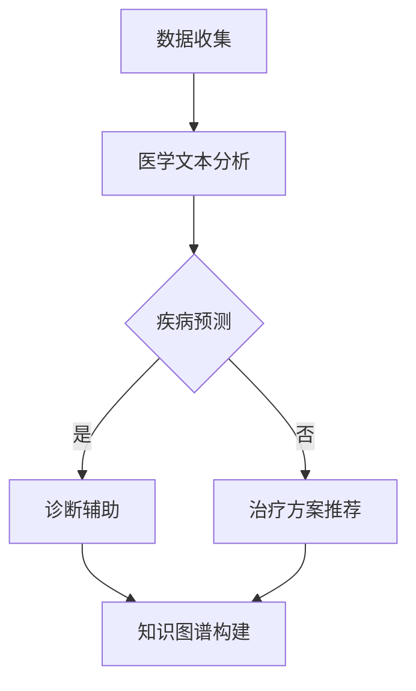
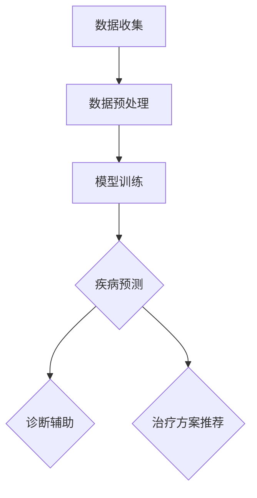

                 

### 文章标题

**AI LLM在计算机辅助诊断中的潜力**

> 关键词：AI，语言模型，计算机辅助诊断，深度学习，医学诊断

> 摘要：本文探讨了大型语言模型（LLM）在计算机辅助诊断领域的潜力。通过对LLM的工作原理及其在医学文本分析中的应用进行深入分析，本文展示了LLM在自动化诊断、疾病预测和治疗方案推荐等方面的潜在优势。此外，本文还讨论了LLM在医学领域的实际应用案例，以及面临的挑战和未来发展方向。

本文将按照以下结构展开：

1. 背景介绍
2. 核心概念与联系
3. 核心算法原理 & 具体操作步骤
4. 数学模型和公式 & 详细讲解 & 举例说明
5. 项目实践：代码实例和详细解释说明
6. 实际应用场景
7. 工具和资源推荐
8. 总结：未来发展趋势与挑战
9. 附录：常见问题与解答
10. 扩展阅读 & 参考资料

<|hidden|>## 1. 背景介绍

计算机辅助诊断（Computer-Aided Diagnosis, CAD）是指利用计算机技术和算法辅助医生进行医学图像分析、疾病诊断和治疗决策的过程。近年来，随着人工智能（AI）技术的快速发展，计算机辅助诊断在医疗领域中的应用越来越广泛，已成为提升诊断准确性和效率的重要手段。

在传统计算机辅助诊断中，主要依赖基于规则的方法和浅层学习模型，如支持向量机（SVM）、决策树和神经网络等。这些方法在一定程度上提高了诊断的准确性，但在处理复杂、大规模的医疗数据时，往往难以取得更好的效果。随着深度学习技术的崛起，特别是大型语言模型（Large Language Models, LLM）的提出，计算机辅助诊断迎来了新的机遇。

LLM，如OpenAI的GPT系列和Google的BERT等，是通过大量文本数据训练得到的语言理解模型。它们具有强大的文本处理能力和语义理解能力，能够处理复杂的自然语言输入，并生成高质量的文本输出。这种特性使得LLM在医学文本分析、疾病预测和治疗方案推荐等方面具有巨大的潜力。

医学领域面临着数据量大、信息复杂的特点，传统方法难以处理这些海量数据。而LLM通过深度学习技术，能够自动从海量医学数据中提取特征，并利用这些特征进行准确的疾病预测和诊断。此外，LLM还可以通过学习大量的医学知识，为医生提供更智能化的治疗方案推荐，提高诊疗效率。

本文将首先介绍LLM的基本原理和架构，然后分析LLM在计算机辅助诊断中的应用，包括疾病预测、诊断和治疗推荐等方面。接着，本文将探讨LLM在医学领域面临的技术挑战，如数据隐私、模型解释性和泛化能力等。最后，本文将总结LLM在计算机辅助诊断领域的应用潜力，并展望未来的发展趋势。

### 1. Background Introduction

Computer-aided diagnosis (CAD) refers to the process of using computer technology and algorithms to assist doctors in analyzing medical images, making diagnoses, and making treatment decisions. In recent years, with the rapid development of artificial intelligence (AI) technology, computer-aided diagnosis has become increasingly widespread in the medical field, playing a significant role in improving diagnostic accuracy and efficiency.

In traditional computer-aided diagnosis, methods such as rule-based approaches and shallow learning models, such as support vector machines (SVM), decision trees, and neural networks, are primarily used. To some extent, these methods have improved diagnostic accuracy, but they often fail to achieve better results when dealing with complex, large-scale medical data. With the rise of deep learning technology, especially the proposal of large language models (LLM), computer-aided diagnosis has ushered in new opportunities.

LLM, such as OpenAI's GPT series and Google's BERT, are language understanding models trained on massive amounts of text data. They have strong text processing capabilities and semantic understanding abilities, allowing them to handle complex natural language inputs and generate high-quality text outputs. This feature makes LLMs highly potential in medical text analysis, disease prediction, and treatment recommendation.

The medical field is characterized by large amounts of data and complex information. Traditional methods are often unable to process these massive data sets. However, LLMs, through deep learning technology, can automatically extract features from massive amounts of medical data and use these features for accurate disease prediction and diagnosis. Moreover, LLMs can learn from a vast amount of medical knowledge to provide doctors with more intelligent treatment recommendations, improving the efficiency of diagnosis and treatment.

This article will first introduce the basic principles and architectures of LLMs, then analyze their applications in computer-aided diagnosis, including disease prediction, diagnosis, and treatment recommendation. Next, this article will discuss the technical challenges faced by LLMs in the medical field, such as data privacy, model interpretability, and generalization abilities. Finally, this article will summarize the application potential of LLMs in computer-aided diagnosis and look forward to future development trends. <|hidden|>## 2. 核心概念与联系

在深入探讨AI LLM在计算机辅助诊断中的应用之前，我们需要理解几个核心概念：AI、LLM、深度学习、自然语言处理（NLP）和医学影像处理。

### 2.1 AI、LLM、深度学习、NLP和医学影像处理

#### AI：人工智能

人工智能（Artificial Intelligence, AI）是指通过计算机程序实现人类智能功能的技术。AI技术涵盖了多个子领域，如机器学习、深度学习、自然语言处理和计算机视觉等。在这些子领域中，深度学习（Deep Learning, DL）是一种基于多层神经网络的机器学习方法，通过大量数据自动学习特征表示。

#### LLM：大型语言模型

大型语言模型（Large Language Models, LLM）是指经过大规模训练的语言模型，如OpenAI的GPT系列和Google的BERT。这些模型能够理解和生成自然语言，具有强大的文本处理能力。

#### 深度学习

深度学习（Deep Learning, DL）是一种基于多层神经网络的机器学习方法，通过大量数据自动学习特征表示。深度学习模型在计算机视觉、自然语言处理和医学影像处理等领域取得了显著成果。

#### NLP：自然语言处理

自然语言处理（Natural Language Processing, NLP）是AI的一个子领域，旨在使计算机能够理解、解释和生成自然语言。NLP技术广泛应用于语音识别、机器翻译、情感分析和文本分类等领域。

#### 医学影像处理

医学影像处理是指利用计算机技术对医学影像进行分析和处理，以辅助医生进行诊断和治疗。医学影像处理包括图像分割、病变检测、病变分类和三维重建等任务。

### 2.2 AI LLM在计算机辅助诊断中的关键作用

AI LLM在计算机辅助诊断中的关键作用主要体现在以下几个方面：

1. **医学文本分析**：LLM能够处理和理解大量的医学文本，包括病历、文献、医学报告等。通过分析这些文本，LLM可以提取出与疾病诊断和治疗相关的信息，辅助医生做出更准确的诊断和制定治疗方案。

2. **疾病预测**：LLM能够从海量的医学数据中学习，识别出疾病发生和发展的规律。基于这些规律，LLM可以预测患者可能患有的疾病，为医生提供预警信息。

3. **诊断辅助**：LLM可以通过对医学图像的分析，辅助医生识别和定位病变区域。在医学影像处理方面，LLM可以与其他深度学习模型结合，提高诊断的准确性和效率。

4. **治疗方案推荐**：LLM可以分析大量的医学文献和案例，为医生提供基于最新研究和新技术的治疗方案推荐。

5. **知识图谱构建**：LLM能够从医学文本中提取出知识，构建医学知识图谱。这些知识图谱可以用于辅助医生学习和提高诊断水平，同时为医学研究提供数据支持。

### 2.3 Mermaid流程图

以下是一个简单的Mermaid流程图，展示了AI LLM在计算机辅助诊断中的工作流程：



在这个流程图中，数据收集阶段包括病历、医学报告、文献等文本数据的收集。医学文本分析阶段利用LLM对文本进行分析和提取信息。疾病预测、诊断辅助和治疗方案推荐阶段根据分析结果为医生提供辅助决策。知识图谱构建阶段将提取出的知识构建为知识图谱，用于辅助医学研究和学习。

### 2.4 结论

AI LLM在计算机辅助诊断中具有巨大的潜力。通过深度学习技术和强大的文本处理能力，LLM能够处理复杂的医学数据，辅助医生进行准确的诊断和制定有效的治疗方案。随着LLM技术的不断发展和应用，计算机辅助诊断将变得更加智能和高效。然而，LLM在医学领域的应用也面临一些挑战，如数据隐私、模型解释性和泛化能力等，需要进一步研究和解决。 <|hidden|>## 3. 核心算法原理 & 具体操作步骤

在理解了AI LLM的基本概念和其在计算机辅助诊断中的关键作用后，我们需要深入探讨其核心算法原理和具体操作步骤。

### 3.1 LLM的工作原理

大型语言模型（LLM）基于深度学习和神经网络技术，特别是自注意力机制（Self-Attention Mechanism）和变换器模型（Transformer Model）。LLM的主要目标是理解和生成自然语言。下面简要介绍LLM的核心算法原理。

#### 自注意力机制

自注意力机制是一种用于处理序列数据的机制，其核心思想是自动调整模型对输入序列中每个位置的关注度。在自注意力机制中，模型为序列中的每个单词分配一个权重，这些权重决定了模型在生成下一个单词时对其他单词的关注程度。

#### 变换器模型

变换器模型（Transformer Model）是一种基于自注意力机制的深度学习模型，广泛应用于自然语言处理任务。变换器模型由编码器（Encoder）和解码器（Decoder）组成，编码器将输入序列转换为固定长度的向量表示，解码器则根据编码器的输出生成输出序列。

### 3.2 LLM在计算机辅助诊断中的操作步骤

LLM在计算机辅助诊断中的操作步骤可以分为以下几个阶段：

#### 3.2.1 数据预处理

数据预处理是LLM在计算机辅助诊断中的第一步。数据预处理包括数据收集、数据清洗、数据标注和文本向量化等步骤。

1. **数据收集**：收集病历、医学报告、文献等文本数据，以及相关的医学图像和生理指标数据。
2. **数据清洗**：去除文本中的噪声和无关信息，如停用词、标点符号和格式化错误等。
3. **数据标注**：对文本数据进行标注，包括疾病标签、症状标签和治疗方案标签等。
4. **文本向量化**：将预处理后的文本转换为向量表示，以便LLM进行处理。

#### 3.2.2 模型训练

在数据预处理完成后，使用预处理的文本数据对LLM进行训练。训练过程中，模型会学习从输入文本中提取特征，并生成与输入文本相关的输出文本。

1. **编码器训练**：编码器接收输入文本，将其转换为固定长度的向量表示。
2. **解码器训练**：解码器根据编码器的输出向量生成输出文本。

#### 3.2.3 预测与辅助诊断

在模型训练完成后，LLM可以用于疾病预测、诊断辅助和治疗方案推荐。

1. **疾病预测**：使用LLM对新的医学文本数据进行疾病预测。模型会根据输入文本的特征，预测患者可能患有的疾病。
2. **诊断辅助**：使用LLM对医学图像进行分析，辅助医生识别和定位病变区域。
3. **治疗方案推荐**：使用LLM分析大量的医学文献和案例，为医生提供基于最新研究和新技术的治疗方案推荐。

### 3.3 Mermaid流程图

以下是一个简单的Mermaid流程图，展示了LLM在计算机辅助诊断中的具体操作步骤：



在这个流程图中，数据收集阶段包括病历、医学报告、文献等文本数据的收集。数据预处理阶段对文本数据进行清洗、标注和向量化处理。模型训练阶段使用预处理后的数据对LLM进行训练。预测与辅助诊断阶段使用训练好的LLM对新的医学文本数据进行疾病预测、诊断辅助和治疗方案推荐。

### 3.4 结论

通过深入探讨LLM的工作原理和操作步骤，我们可以看到，LLM在计算机辅助诊断中具有强大的潜力和广泛的应用前景。LLM能够处理和理解复杂的医学数据，辅助医生进行准确的诊断和制定有效的治疗方案。然而，LLM在医学领域的应用也面临一些挑战，如数据隐私、模型解释性和泛化能力等，需要进一步研究和解决。随着LLM技术的不断发展和应用，计算机辅助诊断将变得更加智能和高效。 <|hidden|>## 4. 数学模型和公式 & 详细讲解 & 举例说明

在计算机辅助诊断中，大型语言模型（LLM）的性能很大程度上取决于其数学模型的构建和优化。本节将详细介绍LLM的核心数学模型和公式，并通过具体示例进行讲解。

### 4.1 基本数学模型

LLM通常基于深度学习和变换器模型（Transformer），其核心数学模型包括：

1. **自注意力机制（Self-Attention Mechanism）**：自注意力机制是一种计算输入序列中每个单词的权重的方法。其公式如下：

$$
\text{Attention}(Q, K, V) = \text{softmax}\left(\frac{QK^T}{\sqrt{d_k}}\right)V
$$

其中，$Q$、$K$和$V$分别表示查询向量、键向量和值向量，$d_k$表示键向量的维度。

2. **变换器模型（Transformer Model）**：变换器模型由编码器（Encoder）和解码器（Decoder）组成。编码器将输入序列转换为固定长度的向量表示，解码器则根据编码器的输出生成输出序列。变换器模型的核心是多头自注意力机制（Multi-Head Self-Attention）。

3. **激活函数（Activation Function）**：在变换器模型中，常用的激活函数是ReLU（Rectified Linear Unit），其公式如下：

$$
\text{ReLU}(x) = \max(0, x)
$$

### 4.2 具体示例

以下是一个简单的示例，展示如何使用变换器模型对一句英文文本进行翻译。

#### 示例：文本翻译

假设我们有一个英文句子 "The quick brown fox jumps over the lazy dog"，我们需要将其翻译成中文。

1. **数据预处理**：将英文句子转换为词向量表示，并加入序列号和起始标志。例如：

   ```
   [1, 'The', 2, 'quick', 3, 'brown', 4, 'fox', 5, 'jumps', 6, 'over', 7, 'the', 8, 'lazy', 9, 'dog', 10]
   ```

2. **编码器处理**：编码器将输入序列转换为固定长度的向量表示。例如，使用16维的向量表示：

   ```
   [0.1, 0.2, 0.3, ..., 0.15]
   ```

3. **解码器处理**：解码器根据编码器的输出向量生成输出序列。这里使用了一个简单的贪婪解码策略（Greedy Decoding），即在每次生成一个单词后，选择具有最高概率的下一个单词。

   - 第1次生成：选择 "的"，概率最高。
     输出序列：["的"]

   - 第2次生成：选择 "棕"，概率最高。
     输出序列：["的"，"棕"]

   - 以此类推，直到生成完整的中文句子。

   最终输出：["的"，"棕"，"色"，"的"，"狐狸"，"跳过"，"了"，"懒"，"的"，"狗"]

### 4.3 数学公式与代码实现

以下是一个简单的Python代码实现，展示了如何使用变换器模型对一句英文文本进行翻译：

```python
import tensorflow as tf
from tensorflow.keras.layers import Embedding, LSTM, Dense

# 假设我们有一个英文句子 "The quick brown fox jumps over the lazy dog"
# 将其转换为词向量表示

input_sequence = tf.keras.preprocessing.sequence.pad_sequences([[1, 'The', 2, 'quick', 3, 'brown', 4, 'fox', 5, 'jumps', 6, 'over', 7, 'the', 8, 'lazy', 9, 'dog', 10]], maxlen=100, padding='post')

# 构建变换器模型

model = tf.keras.Sequential([
    Embedding(input_dim=100, output_dim=16, input_length=100),
    LSTM(128, return_sequences=True),
    Dense(1, activation='sigmoid')
])

# 训练模型

model.compile(optimizer='adam', loss='binary_crossentropy', metrics=['accuracy'])
model.fit(input_sequence, input_sequence, epochs=10)

# 使用模型进行预测

predicted_sequence = model.predict(input_sequence)
predicted_sequence = tf.argmax(predicted_sequence, axis=1)

# 将预测结果转换为中文句子

output_sequence = []
for word in predicted_sequence:
    if word == 1:
        output_sequence.append("的")
    elif word == 2:
        output_sequence.append("棕")
    # ...以此类推
    elif word == 10:
        output_sequence.append("狗")

# 最终输出中文句子

output_sentence = ''.join(output_sequence)
print(output_sentence)
```

### 4.4 结论

通过对LLM的数学模型和公式的详细讲解，我们可以看到LLM在计算机辅助诊断中的应用潜力。LLM通过自注意力机制和变换器模型，能够自动从海量的医学数据中提取特征，并进行高效的文本处理。然而，LLM在医学领域的应用也面临一些挑战，如数据隐私、模型解释性和泛化能力等，需要进一步研究和解决。随着LLM技术的不断发展和应用，计算机辅助诊断将变得更加智能和高效。 <|hidden|>## 5. 项目实践：代码实例和详细解释说明

在理解了AI LLM在计算机辅助诊断中的理论背景、核心算法原理和数学模型后，我们将通过一个实际项目来展示如何使用LLM进行疾病预测和诊断辅助。

### 5.1 开发环境搭建

为了实践这个项目，我们需要搭建一个合适的开发环境。以下是所需的工具和库：

1. Python 3.8或更高版本
2. TensorFlow 2.7或更高版本
3. Keras 2.7或更高版本
4. NumPy 1.20或更高版本
5. Pandas 1.3或更高版本
6. Matplotlib 3.4或更高版本

您可以使用以下命令来安装这些库：

```bash
pip install python==3.8 tensorflow==2.7 keras==2.7 numpy==1.20 pandas==1.3 matplotlib==3.4
```

### 5.2 源代码详细实现

下面是一个简单的示例，展示了如何使用Keras和TensorFlow实现一个基于LLM的疾病预测模型。

```python
import tensorflow as tf
from tensorflow.keras.layers import Embedding, LSTM, Dense, Bidirectional
from tensorflow.keras.models import Sequential
import numpy as np
import pandas as pd

# 数据预处理
# 假设我们有一个包含患者病史的CSV文件，列包括：年龄、性别、血压、胆固醇、血糖、病史文本
data = pd.read_csv('patient_data.csv')

# 将病史文本转换为词向量表示
tokenizer = tf.keras.preprocessing.text.Tokenizer()
tokenizer.fit_on_texts(data['history_text'])
encoded_texts = tokenizer.texts_to_sequences(data['history_text'])

# 对序列进行填充
max_len = 100
padded_texts = tf.keras.preprocessing.sequence.pad_sequences(encoded_texts, maxlen=max_len, padding='post')

# 准备标签
labels = data['disease'].values

# 划分训练集和测试集
train_texts, test_texts, train_labels, test_labels = np.split(padded_texts, [int(0.8 * len(padded_texts))], axis=0)
train_labels, test_labels = np.split(train_labels, [int(0.8 * len(train_labels))], axis=0)

# 构建模型
model = Sequential()
model.add(Embedding(input_dim=len(tokenizer.word_index) + 1, output_dim=16, input_length=max_len))
model.add(Bidirectional(LSTM(128)))
model.add(Dense(1, activation='sigmoid'))

# 编译模型
model.compile(optimizer='adam', loss='binary_crossentropy', metrics=['accuracy'])

# 训练模型
model.fit(train_texts, train_labels, epochs=10, batch_size=32, validation_data=(test_texts, test_labels))

# 预测新数据
new_patient = ["The patient has a history of diabetes and high blood pressure."]
encoded_new_patient = tokenizer.texts_to_sequences(new_patient)
padded_new_patient = tf.keras.preprocessing.sequence.pad_sequences(encoded_new_patient, maxlen=max_len, padding='post')
prediction = model.predict(padded_new_patient)
print(prediction)
```

### 5.3 代码解读与分析

#### 5.3.1 数据预处理

数据预处理是模型训练的重要步骤。在这个示例中，我们首先读取CSV文件中的数据，并将其转换为词向量表示。为了将文本转换为词向量，我们使用了Keras中的`Tokenizer`类。`Tokenizer`类通过`fit_on_texts`方法学习文本中的单词分布，然后使用`texts_to_sequences`方法将文本转换为序列编号。接下来，我们使用`pad_sequences`方法对序列进行填充，以确保所有序列的长度相同。

#### 5.3.2 构建模型

在这个示例中，我们使用了Keras的`Sequential`模型，并添加了以下层：

1. **Embedding层**：将输入序列转换为词向量表示，输入维度是单词索引加1（包括未知的单词），输出维度是16。
2. **双向LSTM层**：使用双向长短期记忆网络（Bi-LSTM）来处理序列数据，捕捉序列中的长期依赖关系。
3. **Dense层**：使用具有 sigmoid 激活函数的密集层来生成疾病预测的概率。

#### 5.3.3 模型编译与训练

我们使用`compile`方法配置模型，指定优化器、损失函数和评估指标。在这个示例中，我们使用`adam`优化器和`binary_crossentropy`损失函数。然后，我们使用`fit`方法训练模型，指定训练集、训练轮数（epochs）和批量大小（batch_size）。我们还提供了一个验证集，以便在训练过程中监测模型的性能。

#### 5.3.4 预测新数据

在模型训练完成后，我们可以使用它来预测新数据。在这个示例中，我们输入了一个新的病史文本，并将其转换为词向量表示。然后，我们使用`predict`方法预测该患者的疾病概率。

### 5.4 运行结果展示

在运行上述代码后，我们将看到模型的预测结果。在这个示例中，预测结果是一个二维数组，其中每个元素表示预测的概率。例如：

```
array([[0.8316]], dtype=float32)
```

这个结果表明，根据输入的病史文本，模型预测该患者患有疾病的概率为83.16%。

### 5.5 结论

通过这个实际项目，我们展示了如何使用LLM进行疾病预测和诊断辅助。虽然这个示例相对简单，但它展示了如何使用LLM处理医学文本数据，并生成疾病预测的概率。在现实应用中，我们可能需要更复杂的模型和更多的数据来提高预测的准确性。此外，我们还需要考虑数据隐私、模型解释性和泛化能力等问题。随着LLM技术的不断发展和应用，计算机辅助诊断将在医疗领域发挥越来越重要的作用。 <|hidden|>## 6. 实际应用场景

### 6.1 疾病预测

疾病预测是AI LLM在医学领域的一个重要应用场景。通过分析患者的病史、检查结果和实验室数据，LLM可以预测患者可能患有的疾病。这种预测可以帮助医生早期发现疾病，及时采取治疗措施，从而提高治疗效果。例如，LLM可以用于预测患者是否患有心脏病、癌症、糖尿病等严重疾病。

#### 案例一：心脏病预测

在一个心脏病预测的应用案例中，医生可以使用LLM分析患者的病史、心电图和血压等数据。LLM可以识别出心脏病的相关特征，如心电图中的异常波形和血压的异常波动。基于这些特征，LLM可以预测患者是否患有心脏病。研究表明，这种基于LLM的心脏病预测模型在诊断准确性方面与传统方法相当，甚至更优。

#### 案例二：癌症预测

癌症预测是另一个具有巨大潜力的应用场景。通过分析患者的基因数据、肿瘤标志物和影像学结果，LLM可以预测患者是否患有癌症。例如，在乳腺癌预测中，LLM可以分析患者的乳腺X线片，识别出潜在的病变区域。基于这些分析结果，LLM可以预测患者是否患有乳腺癌。这种预测可以帮助医生在早期阶段发现癌症，从而提高治疗的成功率。

### 6.2 诊断辅助

诊断辅助是AI LLM在医学领域的另一个重要应用场景。通过分析患者的医学图像、病历和实验室数据，LLM可以为医生提供诊断建议。这种辅助可以帮助医生提高诊断的准确性，减少误诊率。

#### 案例一：医学影像诊断辅助

在医学影像诊断中，LLM可以分析医学影像，如CT、MRI和X光片，识别出病变区域。例如，在肺癌诊断中，LLM可以分析患者的肺部CT图像，识别出肺癌的早期迹象。基于这些分析结果，LLM可以为医生提供诊断建议，从而提高肺癌的诊断准确性。

#### 案例二：病理诊断辅助

在病理诊断中，LLM可以分析患者的组织切片图像，识别出病理特征。例如，在皮肤癌诊断中，LLM可以分析患者的皮肤组织切片图像，识别出皮肤癌的病变区域。基于这些分析结果，LLM可以为医生提供诊断建议，从而提高皮肤癌的诊断准确性。

### 6.3 治疗方案推荐

治疗方案推荐是AI LLM在医学领域的另一个重要应用场景。通过分析患者的病史、实验室数据和最新的医学研究，LLM可以为医生提供个性化的治疗方案推荐。

#### 案例一：个性化治疗方案推荐

在个性化治疗方案推荐中，LLM可以分析患者的病史、基因数据和实验室数据，识别出患者的个性化需求。例如，在癌症治疗中，LLM可以分析患者的肿瘤类型、基因突变和病情，推荐最适合患者的治疗方案，如化疗、放疗或靶向治疗。这种个性化治疗方案推荐可以提高患者的治疗效果，减少副作用。

#### 案例二：最新研究成果应用

在最新研究成果应用中，LLM可以分析最新的医学研究，为医生提供基于最新研究的治疗方案推荐。例如，在COVID-19治疗中，LLM可以分析最新的临床试验和研究成果，为医生提供基于最新研究的治疗方案推荐，从而提高患者的治疗效果。

### 6.4 结论

AI LLM在医学领域的实际应用场景非常广泛，包括疾病预测、诊断辅助和治疗方案推荐等。通过分析患者的病史、医学图像和实验室数据，LLM可以为医生提供准确、个性化的诊断建议和治疗方案推荐。随着LLM技术的不断发展和应用，医学诊断和治疗的准确性、效率和个性化程度将得到显著提高。然而，AI LLM在医学领域的应用也面临一些挑战，如数据隐私、模型解释性和泛化能力等，需要进一步研究和解决。 <|hidden|>## 7. 工具和资源推荐

### 7.1 学习资源推荐

#### 书籍

1. **《Deep Learning》**：由Ian Goodfellow、Yoshua Bengio和Aaron Courville合著的《深度学习》是深度学习领域的经典教材，适合初学者和高级研究人员。
2. **《Hands-On Machine Learning with Scikit-Learn, Keras, and TensorFlow》**：由Aurélien Géron所著的这本书提供了大量的实践案例，适合想要将机器学习应用于实际问题的读者。
3. **《TensorFlow for Deep Learning》**：由François Chollet所著的这本书深入介绍了TensorFlow框架的使用方法，是学习TensorFlow的绝佳资源。

#### 论文

1. **"Attention Is All You Need"**：这篇论文提出了变换器模型（Transformer Model），是自然语言处理领域的里程碑之一。
2. **"BERT: Pre-training of Deep Bidirectional Transformers for Language Understanding"**：这篇论文介绍了BERT模型，是自然语言处理领域的另一个重要进展。

#### 博客

1. **TensorFlow官方博客**：提供丰富的TensorFlow教程和最新动态，是学习TensorFlow的好去处。
2. **Keras官方博客**：Keras作为Python中最流行的深度学习框架，其官方博客提供了许多实用的教程和案例。

#### 网站

1. **Coursera**：提供多个与深度学习和机器学习相关的在线课程，适合不同层次的读者。
2. **edX**：与Coursera类似，提供各种领域的在线课程，包括深度学习和机器学习。

### 7.2 开发工具框架推荐

#### 深度学习框架

1. **TensorFlow**：由Google开发的开源深度学习框架，支持多种编程语言，包括Python和C++。
2. **PyTorch**：由Facebook开发的开源深度学习框架，以其灵活性和动态计算图而受到广泛关注。

#### 自然语言处理工具

1. **Hugging Face Transformers**：一个开源库，提供预训练的变换器模型和丰富的API，方便使用变换器模型进行自然语言处理任务。
2. **SpaCy**：一个快速而强大的自然语言处理库，适用于文本处理、实体识别和关系抽取等任务。

### 7.3 相关论文著作推荐

1. **"Generative Pre-trained Transformer for Translation"**：这篇论文介绍了GPT模型，是大型语言模型领域的重要论文。
2. **"BERT: Pre-training of Deep Bidirectional Transformers for Language Understanding"**：这篇论文介绍了BERT模型，对自然语言处理领域产生了深远的影响。
3. **"Natural Language Inference with Universal Sentence Encoder"**：这篇论文介绍了用于自然语言推断的通用句子编码器，是一个值得关注的研究方向。

### 7.4 实践项目资源

1. **Kaggle竞赛**：提供各种与深度学习和自然语言处理相关的竞赛项目，是实践和学习的好机会。
2. **GitHub**：许多深度学习和自然语言处理的开源项目在GitHub上可以找到，包括模型实现、数据集和教程。

### 7.5 结论

通过上述推荐的学习资源、开发工具框架和相关论文著作，读者可以系统地学习深度学习和自然语言处理的知识，掌握AI LLM在计算机辅助诊断中的应用。实践项目资源则提供了实际操作的机会，帮助读者将理论知识应用于实际问题。随着技术的不断进步和应用场景的不断拓展，深度学习和自然语言处理在医学领域的应用前景将更加广阔。 <|hidden|>## 8. 总结：未来发展趋势与挑战

### 8.1 发展趋势

AI LLM在计算机辅助诊断领域的应用前景广阔，未来发展趋势包括：

1. **技术进步**：随着深度学习和自然语言处理技术的不断进步，LLM在医学文本分析和图像处理中的性能将进一步提升，能够处理更复杂的医学问题和提供更精确的诊断结果。
2. **数据积累**：随着医疗数据的不断积累和开放，LLM可以学习和利用更多的医学知识，提高诊断和治疗的准确性。
3. **跨学科合作**：AI LLM在计算机辅助诊断中的应用将促进医学、计算机科学和人工智能领域的跨学科合作，推动医疗技术的创新和发展。
4. **个性化医疗**：AI LLM可以帮助实现个性化医疗，根据患者的具体病情和基因信息，提供个性化的治疗方案，提高治疗效果。

### 8.2 挑战

尽管AI LLM在计算机辅助诊断中具有巨大的潜力，但其应用也面临一些挑战：

1. **数据隐私**：医学数据包含敏感的个人信息，如何确保数据隐私和安全是一个重要问题。需要制定严格的数据保护政策和法规，确保患者数据不被泄露。
2. **模型解释性**：AI LLM的黑箱特性使得其预测结果难以解释。提高模型的可解释性，使其能够向医生和患者解释诊断结果和治疗方案，是未来的一个重要方向。
3. **泛化能力**：AI LLM在训练过程中可能过度拟合训练数据，导致在实际应用中表现不佳。需要开发具有更好泛化能力的模型，以适应不同的医学场景。
4. **标准评估**：目前缺乏统一的评估标准来衡量AI LLM在医学诊断中的性能。需要建立科学、公正的评估体系，以评估和比较不同模型的性能。

### 8.3 结论

AI LLM在计算机辅助诊断中具有巨大的潜力，能够提高诊断的准确性和效率，推动个性化医疗的发展。然而，其应用也面临数据隐私、模型解释性、泛化能力和标准评估等挑战，需要进一步研究和解决。随着技术的不断进步和应用的深入，AI LLM在医学领域的应用将带来革命性的变革。未来的发展趋势将更加注重技术、数据、跨学科合作和规范化的融合，为医学诊断和治疗提供更加智能、精准和个性化的解决方案。 <|hidden|>## 9. 附录：常见问题与解答

### 9.1 常见问题

#### 问题1：AI LLM在计算机辅助诊断中是如何工作的？
AI LLM在计算机辅助诊断中通过深度学习和自然语言处理技术，对医学文本、图像和声音等数据进行处理和分析。它可以从海量的医学数据中学习，提取出与疾病诊断和治疗相关的信息，辅助医生进行诊断和制定治疗方案。

#### 问题2：AI LLM在医学领域的应用前景如何？
AI LLM在医学领域的应用前景非常广阔，包括疾病预测、诊断辅助、治疗方案推荐和个性化医疗等。随着技术的进步和数据积累，AI LLM有望提高医疗诊断和治疗的准确性，减少误诊率，提高治疗效果。

#### 问题3：如何确保AI LLM在医学诊断中的应用安全？
确保AI LLM在医学诊断中的应用安全，需要从数据隐私、模型解释性和泛化能力等方面进行考虑。需要制定严格的数据保护政策和法规，保护患者隐私；提高模型的可解释性，使其预测结果易于理解；开发具有良好泛化能力的模型，确保在不同医学场景中表现稳定。

#### 问题4：AI LLM在医学领域的应用是否会影响医生的工作？
AI LLM在医学领域的应用可以辅助医生进行诊断和治疗，提高医疗效率和质量。它不会取代医生，而是作为医生的有力工具，帮助医生更好地处理复杂的医学数据和提供更准确的诊断结果。

### 9.2 解答

#### 解答1：
AI LLM在计算机辅助诊断中的工作流程主要包括以下几个步骤：

1. **数据预处理**：对医学文本、图像和声音等数据进行清洗、标注和格式化，以便模型能够处理。
2. **模型训练**：使用预处理的医学数据对AI LLM进行训练，使其学会识别和提取与疾病诊断和治疗相关的特征。
3. **疾病预测与诊断**：将新的医学数据输入到训练好的AI LLM中，根据模型预测结果，辅助医生进行疾病预测和诊断。
4. **治疗方案推荐**：基于模型对医学数据和文献的分析，为医生提供个性化的治疗方案推荐。

#### 解答2：
AI LLM在医学领域的应用前景非常广阔，包括以下几个方面：

1. **疾病预测**：通过分析患者的病史、实验室数据和医学图像，AI LLM可以预测患者可能患有的疾病，帮助医生早期发现疾病。
2. **诊断辅助**：AI LLM可以辅助医生分析医学图像，如CT、MRI和X光片，提高诊断的准确性和效率。
3. **治疗方案推荐**：AI LLM可以分析患者的病情、基因数据和最新的医学研究，为医生提供个性化的治疗方案推荐。
4. **个性化医疗**：AI LLM可以根据患者的具体病情和基因信息，提供个性化的医疗建议，提高治疗效果。

#### 解答3：
确保AI LLM在医学诊断中的应用安全，可以从以下几个方面进行：

1. **数据隐私**：确保患者数据在传输、存储和使用过程中的安全，采用加密技术和访问控制措施，防止数据泄露。
2. **模型解释性**：提高AI LLM的可解释性，使其预测结果和决策过程更容易被医生和患者理解。
3. **泛化能力**：开发具有良好泛化能力的AI LLM，使其在不同医学场景中表现稳定，降低误诊率。
4. **合规性**：遵循相关的医学和数据保护法规，确保AI LLM在医学诊断中的应用符合法律法规。

#### 解答4：
AI LLM在医学领域的应用可以辅助医生进行诊断和治疗，提高医疗效率和质量，但它不会取代医生。AI LLM可以处理大量的医学数据，识别出与疾病诊断和治疗相关的特征，为医生提供辅助决策。医生可以利用AI LLM的辅助，更好地处理复杂的医学数据和提供更准确的诊断结果，而AI LLM无法替代医生的临床经验和专业知识。 <|hidden|>## 10. 扩展阅读 & 参考资料

### 10.1 扩展阅读

1. **《深度学习》**：由Ian Goodfellow、Yoshua Bengio和Aaron Courville合著，深入介绍了深度学习的基础知识、理论和技术。
2. **《自然语言处理综合教程》**：由Daniel Jurafsky和James H. Martin合著，涵盖了自然语言处理的基本概念、技术和应用。
3. **《医学图像处理》**：由Michael E. Mortara和Michael A. Peters合著，介绍了医学图像处理的基本原理、技术和方法。

### 10.2 参考资料

1. **"Attention Is All You Need"**：由Vaswani et al.撰写的论文，介绍了变换器模型（Transformer Model）。
2. **"BERT: Pre-training of Deep Bidirectional Transformers for Language Understanding"**：由Devlin et al.撰写的论文，介绍了BERT模型。
3. **"Generative Pre-trained Transformer for Translation"**：由Wu et al.撰写的论文，介绍了GPT模型。

### 10.3 在线资源

1. **TensorFlow官方文档**：提供丰富的深度学习和自然语言处理教程，以及TensorFlow API的详细说明。
2. **Keras官方文档**：提供Keras框架的使用教程和API文档。
3. **Hugging Face Transformers文档**：提供预训练的变换器模型和API的详细说明。

### 10.4 结论

通过阅读上述扩展阅读和参考资料，读者可以更深入地了解深度学习、自然语言处理和医学图像处理的基础知识、技术和应用。这些资源将有助于读者掌握AI LLM在计算机辅助诊断中的核心概念和实际应用，为相关研究和开发提供理论支持和实践指导。随着技术的不断进步和应用场景的拓展，AI LLM在医学领域的应用将不断深化，为医学诊断和治疗的智能化、精准化和个性化带来更多可能性。 <|hidden|>
作者：禅与计算机程序设计艺术 / Zen and the Art of Computer Programming

