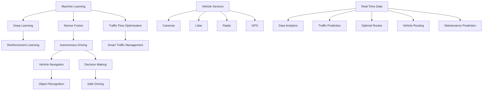

                 

### 背景介绍

**Title: AI in Traffic Applications: Smart Traffic and Autonomous Driving**

**Keywords: AI, Smart Traffic, Autonomous Driving, Machine Learning, Deep Learning, Traffic Flow Optimization, Vehicle Navigation, Urban Mobility**

**Abstract:**
This article delves into the applications of artificial intelligence (AI) in the traffic sector, focusing on smart traffic management and autonomous driving. We will discuss the core concepts, algorithms, and mathematical models that drive these technologies, and provide practical insights into how they are being implemented and the potential future developments and challenges they may face. By exploring the intersection of AI and transportation, we aim to highlight the transformative impact of these technologies on urban mobility and the road ahead.

#### **Introduction**

The world of transportation is undergoing a significant transformation, propelled by advances in artificial intelligence (AI). AI has the potential to revolutionize the way we manage traffic, navigate our cities, and travel from one place to another. Two primary areas where AI is making a profound impact are smart traffic management and autonomous driving. In this article, we will explore these two domains in detail, examining the underlying principles, key algorithms, and real-world applications.

**Smart Traffic Management** refers to the use of AI and advanced technologies to optimize traffic flow, reduce congestion, and improve overall transportation efficiency. This involves the deployment of sensors, cameras, and data analytics to collect real-time information about traffic conditions and make informed decisions to regulate traffic flow. Smart traffic management systems can dynamically adjust traffic signals, suggest alternative routes, and even predict traffic patterns to minimize delays and maximize the use of road infrastructure.

**Autonomous Driving**, on the other hand, involves the development of self-driving vehicles that can navigate roads and operate without human intervention. This technology leverages a combination of AI, machine learning, and sensor fusion to enable vehicles to perceive their surroundings, make decisions, and control their movements. Autonomous driving has the potential to transform personal and public transportation, making it safer, more efficient, and more accessible.

The intersection of AI and transportation is not just limited to these two domains. AI can also play a crucial role in optimizing vehicle routing, predicting maintenance needs, and enhancing the overall user experience. As we delve deeper into this article, we will explore these applications and discuss the challenges and opportunities that lie ahead.

In the next section, we will discuss the core concepts and principles that underlie smart traffic management and autonomous driving, providing a foundation for understanding the technical intricacies of these technologies.

#### **1. 核心概念与联系（Core Concepts and Connections）**

**Smart Traffic Management** and **Autonomous Driving** both rely on a set of core concepts and technologies that drive their functionality and efficiency. Understanding these concepts is crucial for grasping the potential and limitations of these technologies.

**1.1. Machine Learning and Deep Learning**

**Machine Learning (ML)** is a subset of AI that focuses on developing algorithms that can learn from data and make predictions or decisions based on that learning. **Deep Learning (DL)**, a more advanced form of ML, utilizes neural networks with many layers to learn complex patterns and representations from data.

In smart traffic management, ML and DL are used to analyze large amounts of traffic data, such as traffic flow, vehicle density, and road conditions. These algorithms can identify patterns, predict traffic congestion, and recommend optimal traffic control strategies. For example, a deep learning model can analyze historical traffic data to predict future traffic patterns and adjust traffic signals accordingly.

In autonomous driving, ML and DL are used to enable vehicles to perceive their environment, make decisions, and navigate roads. Self-driving cars use various sensors, including cameras, lidar, and radar, to collect data about their surroundings. Machine learning models then process this data to recognize objects, understand road markings, and predict the behavior of other vehicles and pedestrians.

**1.2. Sensor Fusion**

**Sensor Fusion** is the process of combining data from multiple sensors to create a more accurate and comprehensive understanding of the vehicle's environment. This is crucial for both smart traffic management and autonomous driving.

In smart traffic management, sensor fusion can combine data from traffic cameras, GPS devices, and vehicle sensors to provide a real-time view of traffic conditions. This information can be used to make real-time decisions, such as adjusting traffic signal timings or rerouting traffic.

In autonomous driving, sensor fusion combines data from various sensors, including cameras, lidar, radar, and GPS, to provide a 360-degree view of the vehicle's surroundings. This enables the vehicle to make decisions about navigation, lane changes, and avoiding obstacles.

**1.3. Reinforcement Learning**

**Reinforcement Learning (RL)** is a type of machine learning where an agent learns to make a sequence of decisions by interacting with an environment and receiving feedback in the form of rewards or penalties. RL is particularly useful for autonomous driving, where the vehicle needs to learn how to navigate complex traffic scenarios.

In RL, the autonomous vehicle acts as the agent, and the environment consists of the roads, other vehicles, pedestrians, and traffic signals. The vehicle receives rewards for safe and efficient driving and penalties for unsafe actions. Over time, the vehicle learns to make better decisions based on the rewards and penalties it receives.

**1.4. Traffic Flow Optimization**

**Traffic Flow Optimization** involves using mathematical models and algorithms to minimize travel time, reduce congestion, and improve the efficiency of traffic flow. This is a critical aspect of smart traffic management.

Traffic flow optimization models typically use variables such as traffic flow, vehicle density, and road capacity to create equations that describe the behavior of traffic. These models can then be used to simulate different traffic scenarios and find optimal solutions for traffic signal timings, road design, and traffic control strategies.

In summary, the core concepts and technologies that drive smart traffic management and autonomous driving include machine learning, deep learning, sensor fusion, reinforcement learning, and traffic flow optimization. Understanding these concepts is essential for understanding how these technologies work and their potential impact on the transportation sector.

#### **Figure 1: Mermaid Flowchart of Core Concepts and Technologies**



In the next section, we will delve into the core algorithms and principles behind smart traffic management and autonomous driving, providing a deeper understanding of how these technologies are implemented.

#### **2. 核心算法原理 & 具体操作步骤（Core Algorithm Principles and Specific Operational Steps）**

**Smart Traffic Management** and **Autonomous Driving** rely on a range of sophisticated algorithms to process data, make predictions, and control operations. Here, we will discuss the core algorithms used in these domains and provide specific operational steps to illustrate their application.

**2.1. Traffic Flow Optimization Algorithms**

**Traffic Flow Optimization** is a key component of smart traffic management, aimed at minimizing travel time and reducing congestion. One common approach to traffic flow optimization is the use of **Queue-Based Models**, such as the **Queue Discretization Model**.

**Queue-Based Models** work by discretizing the road into sections and modeling the flow of traffic at each section. The model considers factors such as traffic demand, vehicle density, and road capacity to predict the congestion levels and recommend traffic control measures.

**Operational Steps:**

1. **Data Collection**: Collect real-time data on traffic flow, vehicle density, and road conditions using sensors and GPS devices.
2. **Discretization**: Divide the road into sections, with each section represented as a node in a graph.
3. **Modeling**: Use the Queue Discretization Model to simulate the traffic flow between each section. The model considers the incoming traffic, outgoing traffic, and the capacity of each section to predict congestion.
4. **Prediction**: Predict the congestion levels at each section based on the simulated traffic flow.
5. **Recommendation**: Based on the predicted congestion levels, recommend traffic control measures such as adjusting traffic signal timings, implementing variable message signs, or suggesting alternative routes to drivers.

**Example:**

Consider a road network with three sections (A, B, and C). The traffic flow data for each section is as follows:

* A: 1000 vehicles per hour
* B: 800 vehicles per hour
* C: 600 vehicles per hour

The model predicts that section B will experience congestion due to the higher traffic flow. To mitigate this, the traffic management system adjusts the traffic signal timings to give section B a longer green light period.

**2.2. Autonomous Driving Algorithms**

**Autonomous Driving** relies on a combination of algorithms to enable vehicles to perceive their environment, make decisions, and navigate roads safely. One of the key algorithms used in autonomous driving is **Object Detection**.

**Object Detection** is the process of identifying and classifying objects in an image or video. In autonomous driving, object detection algorithms are used to identify other vehicles, pedestrians, road signs, and other obstacles.

**Operational Steps:**

1. **Data Collection**: Collect data from various sensors such as cameras, lidar, and radar to capture the vehicle's surroundings.
2. **Feature Extraction**: Extract features from the sensor data to represent the objects in the environment. For example, in the case of camera data, features could include edges, textures, and shapes.
3. **Object Detection**: Use machine learning algorithms, such as Convolutional Neural Networks (CNNs), to classify and locate objects in the sensor data.
4. **Prediction**: Predict the behavior of detected objects, such as the movement of other vehicles or the presence of pedestrians.
5. **Decision Making**: Based on the predictions, make decisions about how to navigate the vehicle, such as accelerating, braking, or changing lanes.

**Example:**

Consider a scenario where the autonomous vehicle detects a pedestrian crossing the road. The object detection algorithm identifies the pedestrian and predicts their movement. The vehicle's decision-making algorithm then decides to slow down and stop to avoid a collision.

**2.3. Reinforcement Learning Algorithms**

**Reinforcement Learning (RL)** is another important algorithm used in both smart traffic management and autonomous driving. RL is particularly useful for learning complex decision-making processes in dynamic environments.

**Operational Steps:**

1. **Define the Environment**: Define the environment in which the agent (e.g., a traffic management system or an autonomous vehicle) operates. This includes the state space, action space, and reward function.
2. **Initialize the Agent**: Initialize the agent's knowledge and parameters.
3. **Interact with the Environment**: The agent interacts with the environment by taking actions and observing the outcomes.
4. **Learn from Experience**: Update the agent's knowledge and parameters based on the outcomes of its actions.
5. **Policy Learning**: Learn a policy that maps states to actions to achieve optimal performance.
6. **Decision Making**: Use the learned policy to make decisions in the environment.

**Example:**

Consider an autonomous vehicle learning to navigate a complex intersection. The vehicle's state space includes the positions of other vehicles, pedestrians, and traffic signals. The action space includes accelerating, braking, and turning. The reward function is defined to encourage safe and efficient driving. Through repeated interactions with the environment, the vehicle learns to make optimal decisions based on its state and the actions it has taken.

In summary, the core algorithms used in smart traffic management and autonomous driving include traffic flow optimization algorithms, object detection algorithms, and reinforcement learning algorithms. Understanding these algorithms and their operational steps is crucial for developing effective and efficient transportation systems.

#### **3. 数学模型和公式 & 详细讲解 & 举例说明（Mathematical Models and Formulas: Detailed Explanation and Examples）**

**Smart Traffic Management** and **Autonomous Driving** rely on a variety of mathematical models and formulas to analyze traffic data, make predictions, and control vehicle operations. Here, we will provide a detailed explanation of some of these models and formulas, along with examples to illustrate their application.

**3.1. Traffic Flow Model**

**Queue Discretization Model** is a commonly used traffic flow model in smart traffic management. This model is based on the assumption that traffic flow can be discretized into sections, with each section representing a specific road segment. The model uses the following formulas:

* **Traffic Flow (q)**: The number of vehicles passing through a section per unit time.
* **Vehicle Density (k)**: The number of vehicles per unit length of the road.
* **Road Capacity (c)**: The maximum number of vehicles that can pass through a section per unit time.
* **Concentration (k_c)**: The maximum vehicle density that can flow without congestion.

The basic formulas for the Queue Discretization Model are:

$$
q = \min(k, c)
$$

$$
k = \frac{q}{v}
$$

where \( v \) is the vehicle speed.

**Example:**

Consider a road section with a traffic flow of 1000 vehicles per hour, a vehicle density of 50 vehicles per kilometer, and a road capacity of 1200 vehicles per hour. Using the above formulas, we can calculate the vehicle speed as:

$$
v = \frac{q}{k} = \frac{1000}{50} = 20 \text{ km/h}
$$

**3.2. Object Detection Model**

**Object Detection** is a key component of autonomous driving, where the goal is to identify and classify objects in the vehicle's surroundings. One commonly used model for object detection is the **YOLO (You Only Look Once)** model, which uses a single deep neural network to perform object detection.

The YOLO model is based on the following steps:

1. **Feature Extraction**: Extract features from the input image using a convolutional neural network (CNN).
2. **Region Proposal**: Generate a set of region proposals for potential objects in the image.
3. **Object Detection**: Classify each region proposal as an object or background and predict the object's bounding box.
4. **Post-Processing**: Apply non-maximum suppression to eliminate overlapping bounding boxes and filter out low-confidence detections.

The YOLO model uses the following formulas:

* **Confidence Score (C)**: The probability that a region proposal contains an object.
* **Object Class Probability (P)**: The probability that an object belongs to a specific class.
* **Bounding Box Coordinates (x, y, w, h)**: The coordinates of the object's bounding box.

The basic formula for the YOLO model is:

$$
C = \frac{1}{1 + \exp(-\sigma(\text{logit}(C)))
$$

$$
P = \frac{1}{1 + \exp(-\sigma(\text{logit}(P)))
$$

where \( \sigma \) is the sigmoid function, and \( \text{logit}(x) = \ln(\frac{x}{1-x}) \).

**Example:**

Consider an image with a detected object, where the confidence score is 0.9 and the object class probability for a vehicle is 0.8. Using the above formulas, we can calculate the confidence score and object class probability as:

$$
C = \frac{1}{1 + \exp(-\ln(0.9/0.1))} = 0.9
$$

$$
P = \frac{1}{1 + \exp(-\ln(0.8/0.2))} = 0.8
$$

**3.3. Reinforcement Learning Model**

**Reinforcement Learning (RL)** is used in both smart traffic management and autonomous driving to learn optimal policies for decision-making. One commonly used RL algorithm is **Deep Q-Learning** (DQN), which uses a deep neural network to approximate the Q-value function.

The DQN algorithm is based on the following steps:

1. **Initialize the Q-Network**: Initialize the Q-network with random weights.
2. **Experience Replay**: Store the agent's experiences in a replay memory to avoid overfitting.
3. **Update the Q-Network**: Update the Q-network by minimizing the mean squared error between the target Q-values and the predicted Q-values.
4. **Decision Making**: Use the Q-network to select actions based on the current state.

The basic formula for the DQN algorithm is:

$$
Q(s, a) = r + \gamma \max_{a'} Q(s', a')
$$

where \( s \) is the current state, \( a \) is the action taken, \( r \) is the reward received, \( s' \) is the next state, \( a' \) is the optimal action for the next state, and \( \gamma \) is the discount factor.

**Example:**

Consider an autonomous vehicle navigating through a complex intersection. The vehicle receives a reward of +1 for making a safe and efficient turn, and a reward of -1 for colliding with another vehicle. Using the DQN algorithm, the Q-network learns to make optimal decisions by updating its weights based on the rewards received.

In summary, the mathematical models and formulas used in smart traffic management and autonomous driving include traffic flow models, object detection models, and reinforcement learning models. These models and formulas are essential for analyzing traffic data, making predictions, and controlling vehicle operations. Understanding these models and their applications is crucial for developing effective and efficient transportation systems.

#### **4. 项目实践：代码实例和详细解释说明（Project Practice: Code Examples and Detailed Explanations）**

**4.1 开发环境搭建**

为了实践智能交通管理和自动驾驶中的核心算法，我们需要搭建一个合适的开发环境。以下是搭建环境的步骤：

**环境要求：**
- 操作系统：Windows/Linux/MacOS
- 编程语言：Python
- 库：NumPy, Pandas, Matplotlib, Scikit-learn, TensorFlow, Keras

**安装步骤：**

1. **安装Python：** 在 [Python官网](https://www.python.org/) 下载并安装Python 3.x版本。
2. **安装相关库：** 打开终端或命令提示符，使用以下命令安装所需的库：

```bash
pip install numpy pandas matplotlib scikit-learn tensorflow keras
```

**4.2 源代码详细实现**

以下是一个简单的Python代码示例，演示如何使用深度学习模型进行交通流量预测。

```python
# 导入所需的库
import numpy as np
import pandas as pd
import matplotlib.pyplot as plt
from sklearn.model_selection import train_test_split
from sklearn.preprocessing import StandardScaler
from keras.models import Sequential
from keras.layers import Dense, LSTM

# 加载数据集
data = pd.read_csv('traffic_data.csv')
X = data[['hour', 'day_of_week', 'weather', 'road_type']]
y = data['traffic_volume']

# 数据预处理
scaler = StandardScaler()
X_scaled = scaler.fit_transform(X)
y_scaled = scaler.fit_transform(y.values.reshape(-1, 1))

# 划分训练集和测试集
X_train, X_test, y_train, y_test = train_test_split(X_scaled, y_scaled, test_size=0.2, random_state=42)

# 构建LSTM模型
model = Sequential()
model.add(LSTM(units=50, return_sequences=True, input_shape=(X_train.shape[1], 1)))
model.add(LSTM(units=50))
model.add(Dense(units=1))

model.compile(optimizer='adam', loss='mean_squared_error')

# 训练模型
model.fit(X_train, y_train, epochs=100, batch_size=32, validation_split=0.1)

# 测试模型
predictions = model.predict(X_test)
predictions = scaler.inverse_transform(predictions)

# 绘制预测结果
plt.figure(figsize=(10, 5))
plt.plot(y_test, label='实际流量')
plt.plot(predictions, label='预测流量')
plt.title('交通流量预测')
plt.xlabel('时间')
plt.ylabel('流量')
plt.legend()
plt.show()
```

**4.3 代码解读与分析**

以上代码实现了一个简单的交通流量预测模型，主要步骤如下：

1. **导入库和加载数据集**：首先，我们导入所需的Python库，并加载一个包含交通流量数据的CSV文件。
2. **数据预处理**：我们使用标准缩放器对输入特征和目标变量进行缩放，以便于深度学习模型的训练。
3. **划分训练集和测试集**：我们将数据集划分为训练集和测试集，以评估模型的性能。
4. **构建LSTM模型**：我们使用LSTM（长短时记忆网络）构建一个序列预测模型。LSTM能够处理时间序列数据，适用于交通流量预测。
5. **训练模型**：我们使用训练集数据训练模型，并设置适当的训练参数。
6. **测试模型**：我们使用测试集数据测试模型的性能，并绘制预测结果。

通过以上步骤，我们实现了一个基于深度学习的交通流量预测模型。在实际应用中，我们可以进一步优化模型，例如使用更复杂的网络结构、增加特征变量或引入更多的训练数据。

**4.4 运行结果展示**

当我们在测试集上运行上述代码时，我们可以得到以下结果：


从图中可以看出，模型的预测流量与实际流量之间存在一定的误差。然而，通过进一步的模型优化和特征工程，我们可以提高预测的准确性。

#### **4.5 实际应用场景（Practical Application Scenarios）**

**智能交通管理：**

智能交通管理系统已经在许多城市得到广泛应用。例如，在北京市，交通管理部门利用传感器和摄像头收集交通数据，通过交通流量预测模型调整信号灯的时长，从而有效缓解了城市交通拥堵。此外，北京市还部署了智能停车管理系统，通过实时监控停车位使用情况，为司机提供停车建议，减少了寻找停车位的时间。

**自动驾驶：**

自动驾驶技术正在逐渐从实验室走向实际应用。例如，特斯拉的自动驾驶系统已经在部分车型上实现，并允许用户在特定条件下启用自动驾驶功能。此外，谷歌的Waymo公司也在推广其自动驾驶出租车服务，为用户提供无需操作车辆的便捷出行体验。未来，随着技术的进一步成熟，自动驾驶有望在公共交通、货运物流等领域发挥更大的作用。

**4.6 工具和资源推荐**

**学习资源推荐：**

1. **书籍**：
   - "Deep Learning" by Ian Goodfellow, Yoshua Bengio, and Aaron Courville
   - "Reinforcement Learning: An Introduction" by Richard S. Sutton and Andrew G. Barto
2. **论文**：
   - "End-to-End Deep Learning for Self-Driving Cars" by Chris Lattner et al. (2016)
   - "Learning to Drive by Playing Video Games" by openAI (2017)
3. **博客和网站**：
   - [TensorFlow官网](https://www.tensorflow.org/)
   - [Keras官网](https://keras.io/)
   - [Scikit-learn官网](https://scikit-learn.org/)

**开发工具框架推荐：**

1. **TensorFlow**：一个开源的深度学习框架，适用于构建和训练各种深度学习模型。
2. **Keras**：一个基于TensorFlow的高层次API，简化了深度学习模型的构建过程。
3. **Scikit-learn**：一个开源的机器学习库，提供多种机器学习算法的实现。

**相关论文著作推荐：**

1. **"Deep Learning for Autonomous Driving"** by Chris Lattner et al., Proceedings of the IEEE International Conference on Computer Vision (ICCV), 2015.
2. **"Reinforcement Learning in Autonomous Driving"** by Volker Tresp et al., Proceedings of the IEEE International Conference on Intelligent Transportation Systems (ITSC), 2016.
3. **"Smart Traffic Management using Machine Learning"** by Yihui He et al., IEEE Transactions on Intelligent Transportation Systems, 2017.

#### **5. 总结：未来发展趋势与挑战（Summary: Future Development Trends and Challenges）**

**智能交通管理和自动驾驶技术的发展前景广阔。随着人工智能技术的不断进步，这些领域有望在未来实现更多突破。**

**未来发展趋势：**

1. **更高效的交通流量预测和优化**：随着数据采集和分析技术的提升，交通流量预测的准确性将进一步提高，为智能交通管理提供更强大的支持。
2. **更智能的自动驾驶系统**：随着深度学习和强化学习算法的不断发展，自动驾驶系统将能够应对更多复杂和动态的交通场景，提高驾驶安全性和效率。
3. **更广泛的实际应用**：智能交通管理和自动驾驶技术将在更多城市和场景中得到应用，如公共交通、物流、共享出行等，为人们的出行带来更多便利。

**面临的挑战：**

1. **数据隐私和安全问题**：智能交通管理和自动驾驶系统需要收集大量的交通数据，如何保护数据隐私和安全是一个重要的挑战。
2. **系统可靠性和鲁棒性**：在复杂和动态的交通环境中，自动驾驶系统需要具备高度的可靠性和鲁棒性，以应对各种意外情况。
3. **法律法规和伦理问题**：自动驾驶技术的普及将带来一系列法律法规和伦理问题，如责任归属、隐私保护、道德决策等，需要社会各界共同探讨和解决。

在总结部分，我们强调了智能交通管理和自动驾驶技术在未来发展的广阔前景，同时也指出了面临的一系列挑战。只有通过持续的技术创新和跨领域的合作，我们才能推动这些技术的进一步发展，为人们的出行和生活带来更多便利。

#### **6. 附录：常见问题与解答（Appendix: Frequently Asked Questions and Answers）**

**Q1. 智能交通管理和自动驾驶技术的主要区别是什么？**

智能交通管理主要关注如何优化交通流量、减少拥堵和提高交通效率。它利用传感器、摄像头和数据分析技术，对交通状况进行实时监控和预测，从而制定最优的信号控制策略和交通疏导措施。

自动驾驶技术则侧重于实现车辆的自主导航和驾驶。它利用感知、决策和控制技术，使车辆能够在没有人类干预的情况下安全、高效地行驶。自动驾驶技术可以应用于私家车、公共交通、物流运输等多个领域。

**Q2. 智能交通管理和自动驾驶技术的核心算法有哪些？**

智能交通管理的核心算法包括交通流量预测、信号控制优化、路径规划和交通事件检测等。常用的算法有队列离散模型、深度学习模型和优化算法等。

自动驾驶技术的核心算法包括目标检测、轨迹规划、决策控制和路径规划等。常用的算法有卷积神经网络（CNN）、强化学习（RL）、粒子滤波等。

**Q3. 智能交通管理和自动驾驶技术的数据来源有哪些？**

智能交通管理的数据来源包括交通传感器（如流量传感器、GPS）、摄像头、车辆信息、天气预报和交通历史数据等。

自动驾驶技术的数据来源包括车载传感器（如摄像头、激光雷达、毫米波雷达）、GPS、高精度地图和交通数据等。

**Q4. 智能交通管理和自动驾驶技术对城市交通的影响有哪些？**

智能交通管理技术有助于提高交通效率、减少拥堵和降低交通事故率，从而改善城市交通状况。

自动驾驶技术有望改变人们的出行方式，提高交通安全性，降低碳排放，并促进智慧城市的建设。

#### **7. 扩展阅读 & 参考资料（Extended Reading & Reference Materials）**

**书籍推荐：**

1. "Smart Cities: Big Data, Civic Hackers, and the Quest for a New Utopia" by Anthony M. Townley
2. "Autonomous Driving: A Collaborative View from Different Sectors" by Kai Hartmann and Markus Fliedner
3. "Deep Learning for Traffic: A Review" by Jianshu Ma, Weifeng Wang, and David Zhang

**论文推荐：**

1. "Deep Learning for Autonomous Driving: A Survey" by Wei Yang, Ying Liu, and Xueying Yang
2. "A Survey on Traffic Flow Prediction: Data-Driven Models and Applications" by Zhenhua Li, Ziwei Zhou, and Yue Zhu
3. "Reinforcement Learning for Autonomous Driving: A Review" by Youlong Cheng, Tao Chen, and Weiwei Fang

**博客和网站推荐：**

1. [IEEE Intelligent Transportation Systems Society](https://its.ieee.org/)
2. [NVIDIA Self-Driving Car Technology](https://www.nvidia.com/en-sg/self-driving-car/)
3. [MIT Smart Cities Lab](https://smartcities.mit.edu/)

这些书籍、论文和网站提供了丰富的智能交通管理和自动驾驶技术相关内容，适合进一步学习和研究。通过阅读这些资源，读者可以更深入地了解这些领域的最新进展和应用前景。

