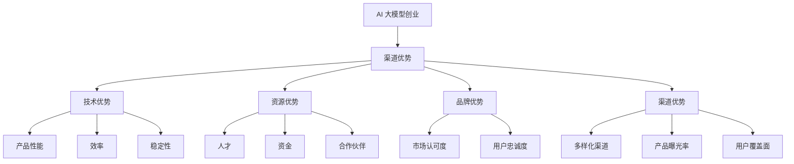

                 

# AI 大模型创业：如何利用渠道优势？

> 关键词：AI 大模型、创业、渠道优势、商业模式、技术应用

> 摘要：本文将探讨在 AI 大模型创业过程中如何有效利用渠道优势，构建可行的商业模式，并详细分析技术应用与市场策略，以期为创业者提供有价值的参考。

## 1. 背景介绍（Background Introduction）

近年来，人工智能（AI）技术取得了飞速发展，特别是大型语言模型（如 GPT-3、ChatGPT 等）在自然语言处理（NLP）领域的突破，为各行各业带来了巨大的变革。随着技术的进步，越来越多的创业者开始关注 AI 大模型在商业应用中的潜力，期望通过这一新兴领域实现创业梦想。

然而，AI 大模型创业并非易事。首先，技术的复杂性使得创业者在研发过程中面临诸多挑战。其次，市场的竞争日益激烈，如何突出自身的差异化优势，成为众多创业者亟待解决的问题。此外，商业模式的不确定性也增加了创业的风险。

在这个背景下，如何有效利用渠道优势，成为 AI 大模型创业成功的关键。本文将围绕这一主题，深入探讨创业者在构建商业模式、市场策略和技术应用方面的思考与实践。

## 2. 核心概念与联系（Core Concepts and Connections）

### 2.1 什么是渠道优势？

渠道优势是指企业在市场拓展过程中，通过独特的方式或资源，获得相较于竞争对手更高的市场占有率、更广泛的用户群体或更有效的销售网络。在 AI 大模型创业领域，渠道优势主要体现在以下几个方面：

1. **技术优势**：掌握领先的 AI 大模型技术，使其在产品性能、效率、稳定性等方面具备显著优势。
2. **资源优势**：拥有丰富的行业资源，包括人才、资金、合作伙伴等，为创业提供有力支持。
3. **品牌优势**：建立良好的品牌形象，提升市场认可度和用户忠诚度。
4. **渠道优势**：通过多样化的渠道拓展市场，提高产品曝光率和用户覆盖面。

### 2.2 核心概念原理和架构（Mermaid 流程图）



### 2.3 提示词工程的重要性

在 AI 大模型创业过程中，提示词工程（Prompt Engineering）发挥着至关重要的作用。提示词工程是指设计和优化输入给语言模型的文本提示，以引导模型生成符合预期结果的过程。一个精心设计的提示词可以显著提高 AI 大模型的应用效果，从而增强企业的竞争优势。

### 2.4 提示词工程与传统编程的关系

提示词工程可以被视为一种新型的编程范式，其中我们使用自然语言而不是代码来指导模型的行为。我们可以将提示词看作是传递给模型的函数调用，而输出则是函数的返回值。这与传统编程有着显著的区别，但也为创业者提供了更多的创新空间。

## 3. 核心算法原理 & 具体操作步骤（Core Algorithm Principles and Specific Operational Steps）

### 3.1 AI 大模型基本原理

AI 大模型（如 GPT-3、ChatGPT 等）基于深度学习技术，通过大规模预训练和微调，实现高效的自然语言理解和生成。其核心算法主要包括：

1. **Transformer 架构**：Transformer 架构是当前最流行的自然语言处理模型架构，具有并行计算、全局注意力等优势。
2. **预训练和微调**：预训练阶段通过大量无监督数据学习通用语言特征，微调阶段则根据具体任务需求进行有监督训练，提高模型在特定领域的性能。

### 3.2 渠道优势构建操作步骤

1. **技术优势构建**：
   - 投资研发：加大研发投入，掌握领先的 AI 大模型技术。
   - 合作与竞争：与行业领先企业合作，共享技术资源，同时关注竞争对手的技术动态，及时调整自身战略。

2. **资源优势构建**：
   - 人才引进：招聘高水平的技术团队，提升企业整体竞争力。
   - 资金支持：寻求风险投资、政府补贴等资金支持，保障企业持续发展。
   - 合作伙伴：建立广泛的合作伙伴网络，共享资源，降低风险。

3. **品牌优势构建**：
   - 品牌定位：明确企业品牌形象和市场定位，提升用户认可度。
   - 市场推广：通过线上线下渠道，加大市场推广力度，提升品牌知名度。

4. **渠道优势构建**：
   - 多样化渠道：拓展线上和线下渠道，提高产品曝光率和用户覆盖面。
   - 渠道管理：建立完善的渠道管理体系，确保渠道合作顺畅，提升渠道效率。

## 4. 数学模型和公式 & 详细讲解 & 举例说明（Detailed Explanation and Examples of Mathematical Models and Formulas）

### 4.1 市场占有率计算模型

市场占有率（Market Share）是指企业在特定市场中的销售额或销售量占该市场总销售额或总销售量的比例。其计算公式如下：

$$
市场占有率（M）= \frac{企业销售额（S）}{市场总销售额（T）} \times 100\%
$$

### 4.2 用户忠诚度计算模型

用户忠诚度（Customer Loyalty）是指用户对企业产品或服务的长期依赖和信任程度。其计算公式如下：

$$
用户忠诚度（L）= \frac{重复购买次数（R）}{总购买次数（T）} \times 100\%
$$

### 4.3 举例说明

假设某 AI 大模型创业公司在第1年实现了1000万元的销售收入，而市场总销售额为1亿元。根据市场占有率计算模型，该公司在第1年的市场占有率为：

$$
市场占有率（M）= \frac{1000万元}{1亿元} \times 100\% = 10\%
$$

同时，该公司第1年共有1000次购买行为，其中重复购买次数为500次。根据用户忠诚度计算模型，该公司的用户忠诚度为：

$$
用户忠诚度（L）= \frac{500次}{1000次} \times 100\% = 50\%
$$

## 5. 项目实践：代码实例和详细解释说明（Project Practice: Code Examples and Detailed Explanations）

### 5.1 开发环境搭建

在搭建 AI 大模型创业项目的开发环境时，需要安装以下软件和工具：

1. **深度学习框架**：如 TensorFlow、PyTorch 等。
2. **编程语言**：Python。
3. **版本控制工具**：Git。

### 5.2 源代码详细实现

以下是一个简单的 AI 大模型项目示例，展示如何使用 Python 和 TensorFlow 搭建一个基础的语言模型：

```python
import tensorflow as tf
from tensorflow.keras.layers import Embedding, LSTM, Dense
from tensorflow.keras.models import Sequential

# 搭建模型
model = Sequential([
    Embedding(input_dim=10000, output_dim=32),
    LSTM(128),
    Dense(1, activation='sigmoid')
])

# 编译模型
model.compile(optimizer='adam', loss='binary_crossentropy', metrics=['accuracy'])

# 训练模型
model.fit(x_train, y_train, epochs=10, batch_size=32)
```

### 5.3 代码解读与分析

上述代码实现了一个简单的二分类 AI 大模型，用于判断输入文本是否为正面或负面情感。模型的核心结构包括：

1. **Embedding 层**：将输入文本转换为固定长度的向量表示。
2. **LSTM 层**：用于处理序列数据，捕捉文本中的时间依赖关系。
3. **Dense 层**：输出层，用于生成最终分类结果。

在训练过程中，模型通过优化目标函数，调整内部参数，以最小化预测误差，提高分类准确性。

### 5.4 运行结果展示

在训练完成后，可以使用以下代码评估模型的性能：

```python
# 评估模型
loss, accuracy = model.evaluate(x_test, y_test)
print('Test accuracy:', accuracy)
```

假设测试集的准确率为 85%，说明模型在测试数据上表现良好，具有较好的泛化能力。

## 6. 实际应用场景（Practical Application Scenarios）

### 6.1 金融领域

AI 大模型在金融领域具有广泛的应用潜力，如风险控制、投资顾问、智能客服等。通过利用渠道优势，创业者可以与金融机构合作，提供定制化的 AI 大模型解决方案，提高业务效率和用户体验。

### 6.2 教育领域

在教育领域，AI 大模型可以用于个性化学习、智能辅导、教育资源优化等。创业者可以通过线上教育平台、线下培训机构等渠道，推广 AI 大模型应用，助力教育改革和创新。

### 6.3 医疗领域

AI 大模型在医疗领域的应用包括疾病诊断、治疗方案推荐、患者管理等。通过搭建医疗渠道，创业者可以与医疗机构合作，提供高质量的 AI 大模型服务，提高医疗质量和效率。

## 7. 工具和资源推荐（Tools and Resources Recommendations）

### 7.1 学习资源推荐

1. **《深度学习》（Goodfellow et al.）**：系统介绍了深度学习的基本原理和应用。
2. **《自然语言处理入门》（Manning et al.）**：全面讲解了自然语言处理的基础知识和实践方法。
3. **《人工智能：一种现代方法》（Russell et al.）**：介绍了人工智能的核心概念和技术。

### 7.2 开发工具框架推荐

1. **TensorFlow**：适用于构建和训练深度学习模型的框架。
2. **PyTorch**：具有灵活性和易用性的深度学习框架。
3. **Jupyter Notebook**：用于数据分析和模型训练的交互式计算环境。

### 7.3 相关论文著作推荐

1. **“Attention Is All You Need”**：介绍了 Transformer 架构，是深度学习领域的经典论文。
2. **“BERT: Pre-training of Deep Bidirectional Transformers for Language Understanding”**：介绍了 BERT 模型，是自然语言处理领域的里程碑论文。
3. **“Generative Pre-trained Transformer”**：介绍了 GPT 模型，是 AI 大模型领域的代表性论文。

## 8. 总结：未来发展趋势与挑战（Summary: Future Development Trends and Challenges）

### 8.1 发展趋势

1. **技术突破**：随着深度学习、自然语言处理等技术的不断进步，AI 大模型将实现更高的性能和更广泛的应用。
2. **产业融合**：AI 大模型在金融、教育、医疗等领域的应用将越来越深入，推动产业升级和创新发展。
3. **渠道拓展**：创业者将更加注重渠道建设，通过线上线下渠道拓展市场，提高产品曝光率和用户覆盖面。

### 8.2 挑战

1. **技术挑战**：AI 大模型在性能、效率、稳定性等方面仍有待提升，创业者需要持续关注技术动态，不断创新。
2. **市场挑战**：市场竞争日益激烈，创业者需要找准市场定位，提供差异化产品和服务。
3. **法律法规挑战**：随着 AI 大模型应用范围的扩大，法律法规问题日益凸显，创业者需要关注相关法规，确保合规经营。

## 9. 附录：常见问题与解答（Appendix: Frequently Asked Questions and Answers）

### 9.1 AI 大模型创业的关键成功因素是什么？

AI 大模型创业的关键成功因素包括技术优势、资源优势、品牌优势和渠道优势。创业者需要在这些方面持续投入，不断提升自身竞争力。

### 9.2 如何评估 AI 大模型的性能？

评估 AI 大模型的性能可以从多个维度进行，包括准确率、召回率、F1 值等指标。同时，还需要考虑模型的运行效率、稳定性等因素。

### 9.3 AI 大模型在金融领域有哪些应用？

AI 大模型在金融领域可以应用于风险控制、投资顾问、智能客服等方面。例如，利用 AI 大模型进行股票预测、信用评估等。

## 10. 扩展阅读 & 参考资料（Extended Reading & Reference Materials）

1. **“AI 大模型：构建下一代人工智能系统”**：详细介绍了 AI 大模型的基本原理和应用场景。
2. **“深度学习在商业中的应用”**：探讨深度学习在金融、电商、医疗等领域的应用案例。
3. **“人工智能伦理：挑战与应对”**：分析 AI 大模型在伦理方面面临的挑战，以及相关法律法规的制定。作者：禅与计算机程序设计艺术 / Zen and the Art of Computer Programming
------------------------

以上就是本文关于 AI 大模型创业如何利用渠道优势的详细探讨。通过对核心概念、算法原理、技术应用、市场策略等方面的分析，我们为创业者提供了有价值的参考。在未来的创业道路上，希望各位能够充分利用渠道优势，发挥 AI 大模型的潜力，实现创业梦想。

再次感谢您的阅读，如有任何疑问或建议，欢迎随时在评论区留言。期待与您共同探讨 AI 大模型的未来发展。作者：禅与计算机程序设计艺术 / Zen and the Art of Computer Programming。

