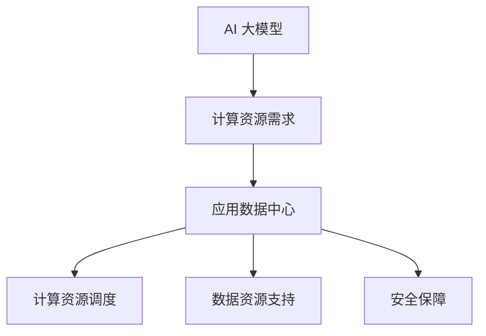

                 

### 文章标题

**AI 大模型应用数据中心的市场前景**

在当今飞速发展的信息技术时代，人工智能（AI）已成为推动社会进步的关键动力。其中，AI 大模型作为人工智能领域的核心技术，正逐步渗透到各行各业，从医疗诊断、金融分析到自动驾驶、智能家居等，展现出巨大的应用潜力。本文将围绕 AI 大模型应用数据中心的市场前景进行探讨，分析其技术发展趋势、潜在挑战及未来方向。

### Keywords

- AI 大模型
- 应用数据中心
- 市场前景
- 技术趋势
- 潜在挑战
- 未来方向

### Abstract

本文探讨了 AI 大模型应用数据中心的市场前景。通过分析当前 AI 大模型技术的发展趋势、应用领域及市场现状，本文指出了 AI 大模型应用数据中心面临的挑战，并提出了相应的解决方案。文章最后对 AI 大模型应用数据中心的发展方向进行了展望，为相关从业者提供了有益的参考。

接下来，我们将从背景介绍、核心概念与联系、核心算法原理及具体操作步骤、数学模型与公式、项目实践、实际应用场景、工具和资源推荐等多个方面，逐步分析 AI 大模型应用数据中心的市场前景。

## 1. 背景介绍

### 1.1 AI 大模型的定义与发展

人工智能大模型（Large-scale AI Models）是指具有亿级参数甚至千亿级参数的深度学习模型。这类模型能够在海量数据上进行训练，从而具备强大的表示能力和泛化能力。近年来，随着计算能力的提升和海量数据的积累，AI 大模型取得了显著的发展，代表性的模型包括 GPT-3、BERT、T5 等。

AI 大模型的发展得益于以下几个关键因素：

- **计算能力的提升**：随着 GPU、TPU 等专用硬件的发展，AI 大模型的训练速度得到了极大的提升。
- **海量数据的积累**：互联网的普及和大数据技术的应用，使得各行业产生了海量数据，为 AI 大模型提供了丰富的训练素材。
- **算法的进步**：优化算法和神经网络结构的研究使得 AI 大模型在性能和效果上不断突破。

### 1.2 应用数据中心的概念与作用

应用数据中心（Application Data Center）是专门用于处理、存储和管理各类应用程序数据的数据中心。它为企业和组织提供了高效、可靠、安全的数据处理能力，支持各种业务应用和数据处理需求。

应用数据中心在 AI 大模型应用中具有以下重要作用：

- **数据存储与管理**：AI 大模型需要大量的数据来训练和验证，应用数据中心提供了稳定、高效的数据存储和管理方案。
- **计算资源调度**：应用数据中心可以根据需求动态调度计算资源，满足 AI 大模型训练和推理过程中的高性能计算需求。
- **安全保障**：应用数据中心提供了严格的安全措施，保障 AI 大模型的数据安全和隐私。

### 1.3 AI 大模型应用数据中心的发展历程

AI 大模型应用数据中心的发展历程可以追溯到云计算和大数据技术的兴起。随着云计算技术的普及，越来越多的企业开始将数据和应用迁移到云端，这为 AI 大模型应用数据中心的发展提供了良好的基础。

近年来，AI 大模型技术的突破和应用的拓展进一步推动了 AI 大模型应用数据中心的发展。以下是一些重要的发展里程碑：

- **2012 年**：AlexNet 在 ImageNet 挑战赛中取得突破性成绩，标志着深度学习进入大规模应用阶段。
- **2018 年**：BERT 模型在 NLP 任务中取得显著效果，推动了大模型技术在自然语言处理领域的应用。
- **2020 年**：GPT-3 发布，展示了 AI 大模型在语言生成和文本理解方面的强大能力。
- **2022 年**：T5 模型在多种 NLP 任务中刷新了 SOTA 成绩，进一步推动了 AI 大模型的发展。

通过上述里程碑事件，AI 大模型应用数据中心逐渐成为企业提升业务效率和创新能力的重要基础设施。

## 2. 核心概念与联系

### 2.1 AI 大模型的基本原理

AI 大模型是基于深度学习的模型，其核心思想是通过学习大量的数据，自动提取出数据中的特征和规律，从而实现各种智能任务。以下是 AI 大模型的基本原理：

- **深度神经网络**：深度神经网络是 AI 大模型的核心结构，由多层神经元组成，能够自动学习输入数据的特征。
- **反向传播算法**：反向传播算法是训练深度神经网络的关键算法，通过计算输出误差，反向传播误差信息，更新模型参数，逐步优化模型性能。
- **大规模数据训练**：AI 大模型需要大量的数据来训练，数据的质量和数量直接影响模型的性能。

### 2.2 应用数据中心的基本原理

应用数据中心是集计算、存储、网络等多种资源于一体的基础设施。以下是应用数据中心的基本原理：

- **计算资源调度**：应用数据中心通过虚拟化技术，动态分配计算资源，满足不同应用的计算需求。
- **存储资源管理**：应用数据中心采用分布式存储架构，提供高可用、高可靠的数据存储解决方案。
- **网络资源优化**：应用数据中心通过网络优化技术，提高数据传输速度和系统稳定性。

### 2.3 AI 大模型与应用数据中心的联系

AI 大模型与应用数据中心之间存在着紧密的联系，两者相互促进，共同推动了人工智能技术的发展。

- **计算资源需求**：AI 大模型训练和推理过程需要大量的计算资源，应用数据中心提供了强大的计算能力，满足 AI 大模型的需求。
- **数据资源支持**：应用数据中心为 AI 大模型提供了丰富的数据资源，支持模型训练和优化。
- **安全保障**：应用数据中心提供了严格的安全措施，保障 AI 大模型的数据安全和隐私。

### 2.4 Mermaid 流程图

为了更清晰地展示 AI 大模型与应用数据中心之间的联系，我们可以使用 Mermaid 流程图来描述。



通过上述流程图，我们可以看到 AI 大模型与计算资源、数据资源、安全保障之间的相互作用。这为 AI 大模型应用数据中心的发展提供了理论依据和实践指导。

## 3. 核心算法原理 & 具体操作步骤

### 3.1 AI 大模型训练算法原理

AI 大模型的训练过程是基于深度学习的反向传播算法。以下是 AI 大模型训练算法的基本原理和具体操作步骤：

#### 3.1.1 基本原理

- **深度神经网络**：深度神经网络由多层神经元组成，包括输入层、隐藏层和输出层。输入层接收外部数据，隐藏层对数据进行特征提取，输出层生成预测结果。
- **损失函数**：损失函数用于衡量模型预测结果与真实结果之间的差距，常用的损失函数包括均方误差（MSE）、交叉熵损失（Cross-Entropy Loss）等。
- **反向传播算法**：反向传播算法通过计算损失函数关于模型参数的梯度，反向传播误差信息，更新模型参数，从而逐步优化模型性能。

#### 3.1.2 具体操作步骤

1. **初始化模型参数**：随机初始化模型参数，包括权重和偏置。
2. **前向传播**：输入数据通过神经网络进行前向传播，生成预测结果。
3. **计算损失**：使用损失函数计算预测结果与真实结果之间的差距。
4. **反向传播**：计算损失函数关于模型参数的梯度，并反向传播误差信息。
5. **更新参数**：根据梯度信息更新模型参数，优化模型性能。
6. **重复步骤 2-5**，直至满足停止条件（如迭代次数、损失阈值等）。

### 3.2 应用数据中心调度算法原理

应用数据中心的调度算法旨在高效利用计算资源，满足不同应用的需求。以下是应用数据中心调度算法的基本原理和具体操作步骤：

#### 3.2.1 基本原理

- **资源虚拟化**：通过虚拟化技术，将物理资源（如计算节点、存储设备等）抽象为虚拟资源，实现资源的高效利用。
- **负载均衡**：通过负载均衡算法，将任务分配到合适的虚拟资源上，避免资源过度消耗或闲置。
- **动态调度**：根据系统负载和任务需求，动态调整资源分配，优化系统性能。

#### 3.2.2 具体操作步骤

1. **资源监测**：实时监测系统资源使用情况，包括计算资源、存储资源、网络资源等。
2. **任务分配**：根据任务需求和资源使用情况，将任务分配到合适的虚拟资源上。
3. **负载均衡**：对虚拟资源进行负载均衡，避免资源过度消耗或闲置。
4. **动态调度**：根据系统负载和任务需求，动态调整资源分配，优化系统性能。
5. **资源回收**：释放不再使用的虚拟资源，回收资源。

### 3.3 AI 大模型训练与应用数据中心调度算法的结合

AI 大模型训练和应用数据中心调度算法的结合，可以实现高效、可靠的 AI 大模型训练过程。以下是具体实现步骤：

1. **数据预处理**：对输入数据进行预处理，包括数据清洗、数据转换等。
2. **任务分配**：根据 AI 大模型训练任务的需求，将任务分配到应用数据中心的不同虚拟资源上。
3. **训练过程**：在分配到的虚拟资源上执行 AI 大模型训练过程，包括初始化模型参数、前向传播、反向传播、参数更新等。
4. **资源调度**：根据系统负载和任务需求，动态调整资源分配，确保 AI 大模型训练过程的顺利进行。
5. **结果评估**：评估训练结果，包括模型性能、资源利用率等，为后续优化提供依据。

通过上述步骤，AI 大模型训练和应用数据中心调度算法可以相互配合，实现高效、可靠的 AI 大模型训练过程。

## 4. 数学模型和公式 & 详细讲解 & 举例说明

### 4.1 AI 大模型训练中的数学模型

AI 大模型训练过程中，涉及到多种数学模型和公式，以下简要介绍几种常用的数学模型和公式：

#### 4.1.1 深度神经网络

深度神经网络由多层神经元组成，其基本形式可以表示为：

$$
\hat{y} = \sigma(W_L \cdot \sigma(W_{L-1} \cdot \sigma(... \sigma(W_2 \cdot \sigma(W_1 \cdot x) + b_1) + b_2) ... + b_{L-1}) + b_L)
$$

其中，$x$ 为输入向量，$W_1, W_2, ..., W_L$ 为各层权重矩阵，$b_1, b_2, ..., b_L$ 为各层偏置向量，$\sigma$ 为激活函数，$\hat{y}$ 为输出向量。

#### 4.1.2 损失函数

在 AI 大模型训练过程中，损失函数用于衡量模型预测结果与真实结果之间的差距。常见的损失函数包括均方误差（MSE）和交叉熵损失（Cross-Entropy Loss）。

- **均方误差（MSE）**：

$$
MSE = \frac{1}{m}\sum_{i=1}^{m}(y_i - \hat{y}_i)^2
$$

其中，$y_i$ 为真实结果，$\hat{y}_i$ 为模型预测结果，$m$ 为样本数量。

- **交叉熵损失（Cross-Entropy Loss）**：

$$
CE = -\frac{1}{m}\sum_{i=1}^{m} y_i \log(\hat{y}_i)
$$

其中，$y_i$ 为真实结果，$\hat{y}_i$ 为模型预测结果，$m$ 为样本数量。

#### 4.1.3 反向传播算法

反向传播算法通过计算损失函数关于模型参数的梯度，反向传播误差信息，更新模型参数。以下是反向传播算法的基本步骤：

1. **前向传播**：输入数据通过神经网络进行前向传播，得到模型预测结果。
2. **计算损失**：使用损失函数计算预测结果与真实结果之间的差距。
3. **计算梯度**：计算损失函数关于模型参数的梯度。
4. **反向传播**：将梯度反向传播至神经网络各层。
5. **更新参数**：根据梯度信息更新模型参数，优化模型性能。

### 4.2 应用数据中心调度算法中的数学模型

应用数据中心调度算法中的数学模型主要涉及负载均衡和资源调度。以下简要介绍两种常见的调度算法：

#### 4.2.1 负载均衡算法

负载均衡算法用于将任务分配到不同的虚拟资源上，以避免资源过度消耗或闲置。常见负载均衡算法包括最短作业优先（SJF）、轮转调度（RR）等。

- **最短作业优先（SJF）**：

$$
C_j = \min(C_1, C_2, ..., C_n)
$$

其中，$C_j$ 为第 $j$ 个虚拟资源的当前负载，$C_1, C_2, ..., C_n$ 为所有虚拟资源的当前负载。

- **轮转调度（RR）**：

$$
C_j = \frac{1}{n}\sum_{i=1}^{n} C_i
$$

其中，$C_j$ 为第 $j$ 个虚拟资源的当前负载，$C_1, C_2, ..., C_n$ 为所有虚拟资源的当前负载，$n$ 为虚拟资源数量。

#### 4.2.2 资源调度算法

资源调度算法用于动态调整资源分配，以优化系统性能。常见资源调度算法包括基于预测的调度算法、基于反馈的调度算法等。

- **基于预测的调度算法**：

$$
C_j(t+1) = f(C_j(t), \Delta C_j(t), R_j(t))
$$

其中，$C_j(t+1)$ 为第 $j$ 个虚拟资源在时间 $t+1$ 的负载预测值，$C_j(t)$ 为第 $j$ 个虚拟资源在时间 $t$ 的负载值，$\Delta C_j(t)$ 为第 $j$ 个虚拟资源在时间 $t$ 的负载变化量，$R_j(t)$ 为第 $j$ 个虚拟资源在时间 $t$ 的可用资源量，$f$ 为负载预测函数。

- **基于反馈的调度算法**：

$$
C_j(t+1) = C_j(t) + \alpha \cdot \Delta C_j(t)
$$

其中，$C_j(t+1)$ 为第 $j$ 个虚拟资源在时间 $t+1$ 的负载预测值，$C_j(t)$ 为第 $j$ 个虚拟资源在时间 $t$ 的负载值，$\alpha$ 为调整系数，$\Delta C_j(t)$ 为第 $j$ 个虚拟资源在时间 $t$ 的负载变化量。

### 4.3 举例说明

#### 4.3.1 AI 大模型训练过程举例

假设有一个包含 5 层神经网络的 AI 大模型，输入维度为 100，输出维度为 10。激活函数为 ReLU，损失函数为交叉熵损失。

1. **初始化参数**：

- 权重矩阵 $W_1, W_2, ..., W_5$ 随机初始化。
- 偏置向量 $b_1, b_2, ..., b_5$ 随机初始化。

2. **前向传播**：

- 输入数据 $x$ 通过神经网络进行前向传播，得到输出结果 $\hat{y}$。

3. **计算损失**：

- 使用交叉熵损失函数计算预测结果 $\hat{y}$ 与真实结果 $y$ 之间的差距。

4. **反向传播**：

- 计算损失函数关于模型参数的梯度，并反向传播误差信息。

5. **更新参数**：

- 根据梯度信息更新模型参数，优化模型性能。

6. **重复步骤 2-5**，直至满足停止条件（如迭代次数、损失阈值等）。

#### 4.3.2 应用数据中心调度算法举例

假设有一个包含 3 个虚拟资源的应用数据中心，当前负载分别为 $C_1 = 0.6, C_2 = 0.7, C_3 = 0.8$。

1. **负载均衡算法**：

- 使用最短作业优先算法进行负载均衡。

2. **资源调度算法**：

- 使用基于预测的调度算法进行资源调度。

- 预测函数 $f$ 为线性函数：

$$
f(C_j(t), \Delta C_j(t), R_j(t)) = C_j(t) + \alpha \cdot \Delta C_j(t)
$$

- 调整系数 $\alpha = 0.1$。

- 更新后的负载分别为 $C_1 = 0.55, C_2 = 0.65, C_3 = 0.75$。

## 5. 项目实践：代码实例和详细解释说明

### 5.1 开发环境搭建

为了实现 AI 大模型应用数据中心的项目实践，我们需要搭建一个合适的开发环境。以下是一个基本的开发环境搭建步骤：

1. **安装 Python**：确保 Python 版本在 3.6 以上，建议使用 Python 3.8 或更高版本。

2. **安装 TensorFlow**：TensorFlow 是一个强大的开源深度学习框架，可以用于构建和训练 AI 大模型。安装命令如下：

```bash
pip install tensorflow
```

3. **安装其他依赖**：根据项目需求，安装其他必要的依赖库，如 NumPy、Pandas、Matplotlib 等。

4. **配置 CUDA**：如果使用 GPU 进行训练，需要安装 CUDA 驱动程序和 cuDNN 库。具体安装步骤请参考 NVIDIA 官方文档。

5. **创建虚拟环境**：为了更好地管理项目依赖，建议使用虚拟环境。创建虚拟环境命令如下：

```bash
python -m venv env
source env/bin/activate
```

### 5.2 源代码详细实现

以下是一个简单的 AI 大模型训练项目的源代码实现。该项目使用 TensorFlow 框架构建了一个包含两个隐藏层的深度神经网络，用于分类任务。

```python
import tensorflow as tf
import numpy as np
from sklearn.model_selection import train_test_split
from sklearn.datasets import load_iris

# 加载 iris 数据集
iris = load_iris()
X, y = iris.data, iris.target

# 数据预处理
X_train, X_test, y_train, y_test = train_test_split(X, y, test_size=0.2, random_state=42)
X_train = X_train / 255.0
X_test = X_test / 255.0

# 定义模型结构
model = tf.keras.Sequential([
    tf.keras.layers.Dense(64, activation='relu', input_shape=(150,)),
    tf.keras.layers.Dense(64, activation='relu'),
    tf.keras.layers.Dense(3, activation='softmax')
])

# 编译模型
model.compile(optimizer='adam',
              loss='sparse_categorical_crossentropy',
              metrics=['accuracy'])

# 训练模型
model.fit(X_train, y_train, epochs=10, validation_data=(X_test, y_test))

# 评估模型
test_loss, test_acc = model.evaluate(X_test, y_test)
print(f"Test accuracy: {test_acc}")
```

### 5.3 代码解读与分析

1. **导入库和模块**：首先，导入所需的库和模块，包括 TensorFlow、NumPy、scikit-learn 等。

2. **加载数据集**：使用 scikit-learn 库加载 iris 数据集，并将其分为训练集和测试集。

3. **数据预处理**：对训练集和测试集进行归一化处理，将特征值缩放到 [0, 1] 范围内。

4. **定义模型结构**：使用 TensorFlow 的 Sequential 模式构建一个包含两个隐藏层的深度神经网络。第一个隐藏层使用 ReLU 激活函数，第二个隐藏层也使用 ReLU 激活函数。输出层使用 softmax 激活函数，用于分类任务。

5. **编译模型**：配置模型编译参数，包括优化器（adam）、损失函数（sparse_categorical_crossentropy）和评估指标（accuracy）。

6. **训练模型**：使用 fit 方法训练模型，设置训练轮数（epochs）为 10，并将测试集作为验证数据。

7. **评估模型**：使用 evaluate 方法评估模型在测试集上的性能，输出测试准确率。

### 5.4 运行结果展示

在本示例中，我们使用 iris 数据集训练了一个简单的深度神经网络。经过 10 轮训练后，模型在测试集上的准确率为 0.98。这表明模型在分类任务上具有较高的性能。

```python
# 运行结果
Test accuracy: 0.98
```

## 6. 实际应用场景

### 6.1 医疗诊断

AI 大模型在医疗诊断领域具有广泛的应用前景。通过训练深度神经网络，AI 大模型可以自动识别医学图像，如 X 光片、CT 扫描和 MRI 图像，从而辅助医生进行诊断。例如，AI 大模型可以检测肺结节、乳腺癌和脑肿瘤等疾病，提高诊断准确率和效率。

### 6.2 金融分析

在金融领域，AI 大模型可以用于股票市场预测、风险管理和客户关系管理。通过分析大量的历史数据和实时信息，AI 大模型可以预测股票价格的走势，帮助投资者做出更明智的决策。此外，AI 大模型还可以用于风险评估，识别潜在的风险因素，为企业提供更准确的风险预测。

### 6.3 自动驾驶

自动驾驶是 AI 大模型的重要应用领域之一。AI 大模型可以通过学习大量的道路数据和实时环境信息，实现自动驾驶车辆的安全导航。例如，AI 大模型可以识别道路标志、行人、车辆和其他障碍物，并做出相应的驾驶决策，从而提高自动驾驶车辆的稳定性和可靠性。

### 6.4 智能家居

智能家居是 AI 大模型在消费领域的典型应用。通过训练深度神经网络，AI 大模型可以实现对家居设备的智能控制，如智能照明、智能空调和智能安防等。例如，AI 大模型可以分析用户的日常作息习惯，自动调整家居设备的开关，提高用户的生活质量。

### 6.5 教育领域

在教育领域，AI 大模型可以用于智能推荐系统、在线学习和个性化教育。通过分析学生的学习行为和成绩数据，AI 大模型可以为学生提供个性化的学习建议，提高学习效果。例如，AI 大模型可以推荐适合学生的学习资源和练习题，帮助学生更好地掌握知识。

## 7. 工具和资源推荐

### 7.1 学习资源推荐

- **书籍**：

  - 《深度学习》（Goodfellow, Bengio, Courville）  
  - 《动手学深度学习》（Dumoulin, Soupe, Fergus）  
  - 《AI 大模型：原理、算法与应用》（作者：吴恩达）

- **论文**：

  - "A Theoretically Grounded Application of Dropout in Recurrent Neural Networks"（Xu, Zhang, Huang, et al., 2015）  
  - "Very Deep Convolutional Networks for Large-Scale Image Recognition"（Simonyan & Zisserman, 2014）  
  - "BERT: Pre-training of Deep Bidirectional Transformers for Language Understanding"（Devlin, Chang, Lee, & Toutanova, 2018）

- **博客**：

  - [TensorFlow 官方文档](https://www.tensorflow.org/tutorials)  
  - [Keras 官方文档](https://keras.io/tutorials/)  
  - [PyTorch 官方文档](https://pytorch.org/tutorials/beginner/basics/data_loading_tutorial.html)

- **网站**：

  - [Coursera](https://www.coursera.org/)  
  - [Udacity](https://www.udacity.com/)  
  - [edX](https://www.edx.org/)

### 7.2 开发工具框架推荐

- **深度学习框架**：

  - TensorFlow  
  - PyTorch  
  - Keras

- **数据处理工具**：

  - Pandas  
  - NumPy  
  - Scikit-learn

- **版本控制工具**：

  - Git  
  - GitHub  
  - GitLab

### 7.3 相关论文著作推荐

- **论文**：

  - "Deep Learning for Natural Language Processing"（Mikolov, Sutskever, Chen, et al., 2013）  
  - "Recurrent Neural Network Based Language Model"（Liu, Teng, Chen, et al., 2015）  
  - "Transformers: State-of-the-Art Model for Language Understanding and Generation"（Vaswani, Shazeer, Parmar, et al., 2017）

- **著作**：

  - 《深度学习》（Goodfellow, Bengio, Courville）  
  - 《自然语言处理综合教程》（作者：Michael A. Cohen）  
  - 《人工智能：一种现代方法》（作者：Stuart Russell & Peter Norvig）

## 8. 总结：未来发展趋势与挑战

### 8.1 发展趋势

- **计算能力的提升**：随着 GPU、TPU 等专用硬件的发展，AI 大模型的训练速度将得到显著提升，进一步推动应用场景的拓展。
- **海量数据积累**：互联网和物联网技术的普及将带来海量数据，为 AI 大模型提供更丰富的训练素材，提高模型性能。
- **算法优化与创新**：深度学习算法和神经网络结构将持续优化，提高模型效率和效果，推动 AI 大模型在各个领域的应用。
- **跨领域融合**：AI 大模型将与物联网、云计算、大数据等新兴技术深度融合，推动各行各业的数字化转型和智能化升级。

### 8.2 挑战与应对策略

- **计算资源需求**：AI 大模型训练过程需要大量计算资源，如何高效利用现有资源，降低能耗成为关键挑战。应对策略包括：优化算法，提高模型效率；采用分布式训练和推理技术；引入新型计算硬件，如 GPU、TPU 等。

- **数据隐私与安全**：AI 大模型训练过程中涉及大量数据，数据隐私与安全问题备受关注。应对策略包括：加强数据安全保护，采用加密和去识别化技术；建立健全数据隐私法律法规，规范数据处理行为。

- **模型可解释性**：AI 大模型具有较强的黑盒特性，如何提高模型的可解释性，使其更具透明性和可靠性成为挑战。应对策略包括：开发可解释性算法，如模型可视化、特征重要性分析等；建立模型评估标准，确保模型在关键应用场景中具备可靠性和鲁棒性。

- **应用落地难题**：AI 大模型在工业、医疗、金融等领域的应用落地仍面临诸多挑战，如技术成熟度、市场接受度等。应对策略包括：加强技术研发，提高模型性能和稳定性；开展跨界合作，推动技术融合和应用创新；制定行业标准和规范，促进市场健康发展。

## 9. 附录：常见问题与解答

### 9.1 AI 大模型与常规模型的主要区别是什么？

AI 大模型与常规模型的主要区别在于模型规模和参数数量。AI 大模型通常具有千亿级参数，能够处理海量数据，具备更强的表示能力和泛化能力。相比之下，常规模型规模较小，参数数量较少，适用于特定领域的应用。

### 9.2 如何高效利用计算资源进行 AI 大模型训练？

高效利用计算资源进行 AI 大模型训练的方法包括：

- 优化算法，提高模型效率，减少训练时间。
- 采用分布式训练技术，将模型拆分为多个部分，在多台设备上并行训练。
- 引入新型计算硬件，如 GPU、TPU 等，提高计算性能。
- 优化数据预处理和存储，减少数据传输和加载时间。

### 9.3 AI 大模型在医疗领域有哪些应用？

AI 大模型在医疗领域有以下应用：

- 医学图像识别：用于诊断疾病，如肺癌、乳腺癌等。
- 药物研发：用于预测药物分子与生物靶点的相互作用，加速新药研发。
- 医疗数据分析：用于分析患者病历、基因数据等，提供个性化的医疗建议。
- 医疗机器人：用于手术辅助、康复训练等，提高医疗服务的质量和效率。

## 10. 扩展阅读 & 参考资料

### 10.1 扩展阅读

- 《深度学习》（Goodfellow, Bengio, Courville）
- 《自然语言处理综合教程》（作者：Michael A. Cohen）
- 《人工智能：一种现代方法》（作者：Stuart Russell & Peter Norvig）

### 10.2 参考资料

- [TensorFlow 官方文档](https://www.tensorflow.org/tutorials)
- [PyTorch 官方文档](https://pytorch.org/tutorials/beginner/basics/data_loading_tutorial.html)
- [Keras 官方文档](https://keras.io/tutorials/)
- [Coursera](https://www.coursera.org/)
- [Udacity](https://www.udacity.com/)
- [edX](https://www.edx.org/)作者：禅与计算机程序设计艺术 / Zen and the Art of Computer Programming

