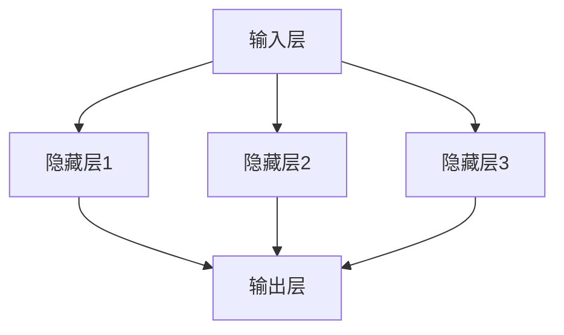
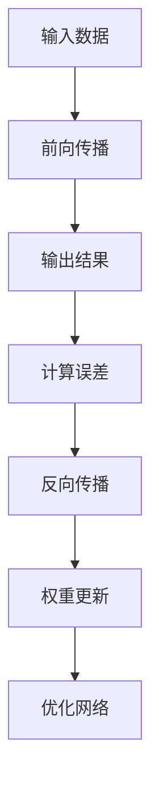
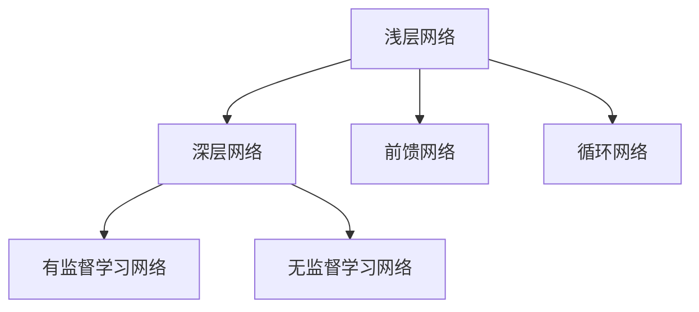
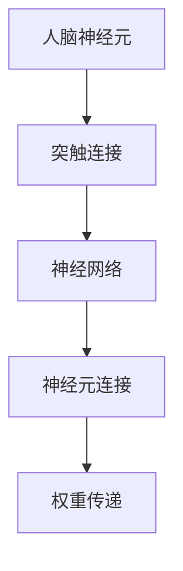
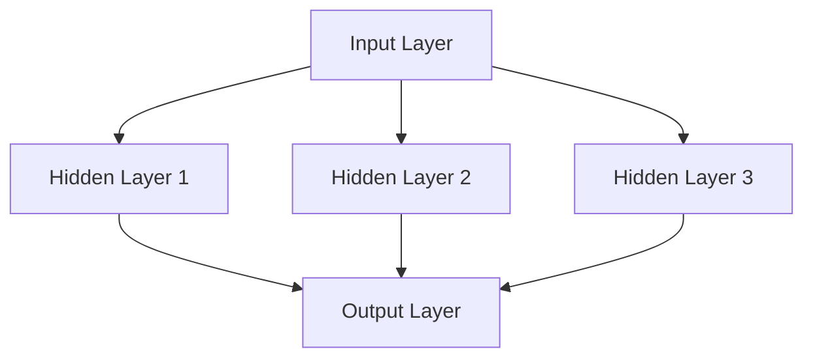
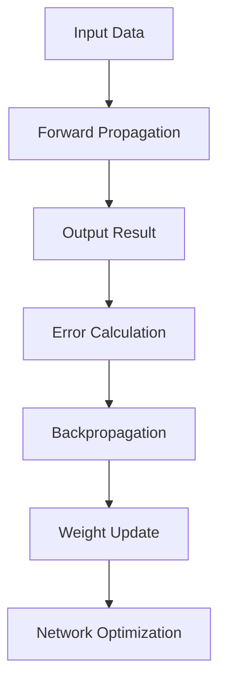
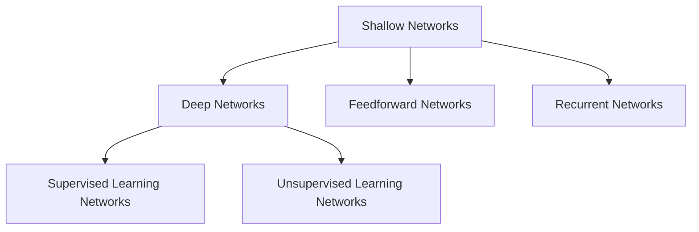
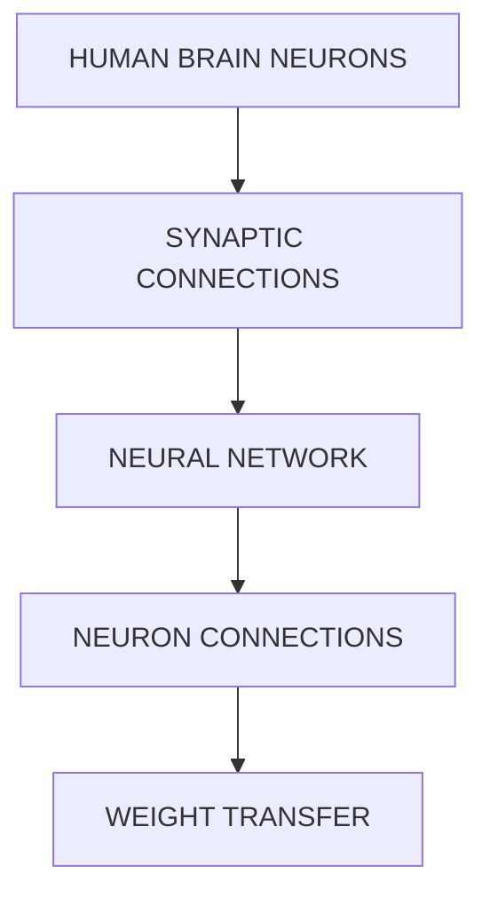

                 

### 1. 背景介绍（Background Introduction）

在当今科技飞速发展的时代，人工智能（AI）已经成为推动社会进步的重要力量。然而，尽管AI在众多领域取得了显著的成果，但仍然面临一个深层次的问题——人类中心主义的傲慢。这种傲慢主要体现在两个方面：一是过度依赖AI技术，将其视为无所不能的救世主；二是忽视AI技术在发展过程中对人类价值观、道德观以及生活方式的影响。

本文旨在探讨AI神经网络计算艺术的禅意，破除人类中心主义的傲慢。我们将通过以下几个步骤来深入分析这一问题：

1. **核心概念与联系**：介绍AI神经网络计算艺术的基本概念，并绘制Mermaid流程图，展示其架构和原理。
2. **核心算法原理 & 具体操作步骤**：详细讲解神经网络计算的核心算法，包括感知机、反向传播算法等。
3. **数学模型和公式 & 详细讲解 & 举例说明**：介绍神经网络计算中的数学模型和公式，并使用latex格式进行详细讲解和举例说明。
4. **项目实践：代码实例和详细解释说明**：通过实际项目案例，展示神经网络计算的应用场景，并提供详细的代码实现和分析。
5. **实际应用场景**：分析AI神经网络计算技术在各个领域的应用，以及可能带来的挑战。
6. **工具和资源推荐**：推荐学习资源、开发工具框架和相关论文著作。
7. **总结：未来发展趋势与挑战**：总结本文的核心观点，探讨未来AI神经网络计算艺术的发展趋势和面临的挑战。

通过对以上各部分内容的逐步分析，我们希望引导读者认识到，AI神经网络计算艺术并非是一种单纯的工具，而是一种具有深刻哲学意义的技术。通过破除人类中心主义的傲慢，我们可以更好地发挥AI技术的潜力，为人类社会的进步贡献力量。

### Background Introduction

In the era of rapid technological advancements, artificial intelligence (AI) has emerged as a powerful force driving societal progress. However, despite the remarkable achievements of AI in various fields, it still faces a profound issue: the arrogance of human-centeredness. This arrogance is manifested in two aspects: first, an overreliance on AI technology, treating it as a savior that can solve all problems; second, a disregard for the impact of AI technology on human values, moral principles, and lifestyles during its development.

This article aims to explore the Zen of neural network computation in AI and dismantle the arrogance of human-centeredness. We will proceed through the following steps to delve into this issue:

1. **Core Concepts and Connections**: Introduce the fundamental concepts of neural network computation in AI and draw a Mermaid flowchart to illustrate its architecture and principles.
2. **Core Algorithm Principles and Specific Operational Steps**: Elaborate on the core algorithms of neural network computation, including perceptrons and backpropagation algorithms.
3. **Mathematical Models and Formulas & Detailed Explanation & Example Illustration**: Present the mathematical models and formulas in neural network computation, and provide a detailed explanation and examples using LaTeX format.
4. **Project Practice: Code Examples and Detailed Explanation**: Through actual project cases, demonstrate the application scenarios of neural network computation in AI and provide detailed code implementation and analysis.
5. **Practical Application Scenarios**: Analyze the applications of neural network computation technology in various fields and the challenges they may bring.
6. **Tools and Resources Recommendations**: Recommend learning resources, development tool frameworks, and related papers and books.
7. **Summary: Future Development Trends and Challenges**: Summarize the core viewpoints of this article and discuss the future development trends and challenges of neural network computation in AI.

By analyzing each of these parts step by step, we hope to guide readers to recognize that neural network computation in AI is not merely a tool but a technology with profound philosophical significance. By dismantling the arrogance of human-centeredness, we can better harness the potential of AI technology to contribute to the progress of human society. <|user|>### 2. 核心概念与联系（Core Concepts and Connections）

在深入探讨AI神经网络计算艺术的禅意之前，我们首先需要了解一些核心概念。神经网络（Neural Networks）是一种模仿人脑工作的计算模型，由大量的神经元（Neurons）和连接（Connections）组成。这些神经元和连接可以通过学习来获取和处理信息，从而实现对复杂问题的建模和解决。

#### 2.1 神经网络的基本架构

神经网络的架构通常由输入层（Input Layer）、隐藏层（Hidden Layers）和输出层（Output Layer）组成。输入层接收外部信息，隐藏层进行信息的加工和变换，输出层生成最终的输出结果。每个神经元都与相邻的神经元相连，并通过权重（Weights）来传递信号。权重的大小决定了信息传递的强度。



#### 2.2 学习与优化

神经网络的学习过程实质上是一个优化过程。通过调整神经元之间的权重，使得网络能够对输入数据进行准确的预测或分类。最常用的优化算法是反向传播算法（Backpropagation Algorithm），它通过计算输出误差的梯度，逐步调整权重，从而优化网络性能。



#### 2.3 神经网络的分类

神经网络可以按照不同的维度进行分类。根据网络的深度，可以分为浅层网络和深层网络；根据网络的连接方式，可以分为前馈网络和循环网络；根据训练数据的类型，可以分为有监督学习网络和无监督学习网络。



#### 2.4 神经网络与人类思维的类比

神经网络的设计灵感来源于人脑。人脑中的神经元通过突触连接形成复杂的神经网络，进行信息的处理和传递。同样，神经网络中的神经元和突触也通过连接和权重进行信息的加工和传递。这种类比有助于我们更好地理解神经网络的工作原理。



通过以上对神经网络核心概念和架构的介绍，我们可以看到，神经网络计算艺术并非简单的数学运算，而是一种具有深刻哲学意义的技术。它不仅能够处理复杂的计算任务，还能够揭示人类思维和行为的某些本质特征。这正是我们探讨AI神经网络计算艺术禅意的重要基础。

### Core Concepts and Connections

Before delving into the Zen of neural network computation in AI, we need to understand some core concepts. Neural networks are computational models that mimic the workings of the human brain, consisting of numerous neurons and connections. These neurons and connections learn to process and retrieve information, enabling the modeling and solving of complex problems.

#### 2.1 Basic Architecture of Neural Networks

The architecture of a neural network typically consists of an input layer, hidden layers, and an output layer. The input layer receives external information, the hidden layers process and transform the information, and the output layer generates the final output result. Each neuron is connected to adjacent neurons, and signals are transmitted through weights that determine the strength of information transfer.



#### 2.2 Learning and Optimization

The learning process of neural networks is essentially an optimization process. By adjusting the weights between neurons, the network can accurately predict or classify input data. The most commonly used optimization algorithm is the backpropagation algorithm, which calculates the gradient of the output error to gradually adjust the weights and optimize the network's performance.



#### 2.3 Classification of Neural Networks

Neural networks can be classified based on different dimensions. According to the depth of the network, they can be divided into shallow networks and deep networks; according to the way connections are made, they can be divided into feedforward networks and recurrent networks; and according to the type of training data, they can be divided into supervised learning networks and unsupervised learning networks.



#### 2.4 Analogies between Neural Networks and Human Thinking

The design of neural networks is inspired by the human brain. The neurons in the human brain form complex neural networks through synapses, processing and transmitting information. Similarly, neurons and synapses in neural networks connect and transfer information through connections and weights. This analogy helps us better understand the working principles of neural networks.



Through the introduction of the core concepts and architecture of neural networks, we can see that neural network computation art is not merely simple mathematical operations but a technology with profound philosophical significance. It can not only handle complex computational tasks but also reveal certain essential characteristics of human thought and behavior. This is the important foundation for exploring the Zen of neural network computation in AI. <|user|>### 3. 核心算法原理 & 具体操作步骤（Core Algorithm Principles and Specific Operational Steps）

在AI神经网络计算艺术中，核心算法原理是理解和应用神经网络的关键。下面我们将详细讲解两个最重要的算法：感知机（Perceptron）和反向传播算法（Backpropagation Algorithm）。

#### 3.1 感知机原理

感知机是一种二分类线性分类模型，由美国心理学家弗兰克·罗森布拉特（Frank Rosenblatt）在1957年提出。它模拟了人类感知器的简单行为，通过线性组合输入值和权重，再经过一个阈值函数，判断输入数据属于哪个类别。

**具体操作步骤：**

1. **初始化权重（Initialize Weights）**：随机初始化每个输入特征的权重，以及偏置（Bias）。
2. **计算输出（Calculate Output）**：将输入特征与权重相乘，然后相加，得到总输入。通过阈值函数（通常是硬阈值函数或Sigmoid函数）判断输出是正类还是负类。
3. **更新权重（Update Weights）**：如果输出不正确，则根据学习率（Learning Rate）调整权重和偏置。调整规则为：$$\Delta w = \eta \cdot (t - y) \cdot x$$，其中\( t \)是目标输出，\( y \)是实际输出，\( x \)是输入特征。
4. **迭代学习（Iterative Learning）**：重复上述步骤，直到达到某个预定的误差范围或最大迭代次数。

**数学模型：**

假设我们有一个二分类问题，输入特征为\( x_1, x_2, ..., x_n \)，权重为\( w_1, w_2, ..., w_n \)，偏置为\( b \)。则感知机的输出可以表示为：

$$
o = \text{sign}(z) = \text{sign}(w_1 \cdot x_1 + w_2 \cdot x_2 + ... + w_n \cdot x_n + b)
$$

其中，\( z \)是总输入，\( \text{sign}() \)是硬阈值函数，输出为+1或-1。

#### 3.2 反向传播算法原理

反向传播算法是深度神经网络训练的核心算法，它通过反向传播误差信息，逐层更新网络权重。反向传播算法由保罗·沃尔法特（Paul Werbos）在1974年首次提出，并经过多代研究者的发展和完善。

**具体操作步骤：**

1. **前向传播（Forward Propagation）**：输入数据通过网络，逐层计算每个神经元的输出。
2. **计算误差（Calculate Error）**：比较输出结果与实际标签，计算损失函数（如均方误差、交叉熵等）。
3. **后向传播（Back Propagation）**：计算每个神经元误差关于其输入的梯度，将这些梯度反向传播到前一层。
4. **权重更新（Weight Update）**：使用梯度下降法或其他优化算法更新权重和偏置。

**数学模型：**

以一个简单的单层神经网络为例，输入特征为\( x_1, x_2, ..., x_n \)，权重为\( w_{ij} \)，偏置为\( b_j \)。假设网络的输出为\( y \)，实际标签为\( t \)，则损失函数可以表示为：

$$
L = \frac{1}{2} \sum_{i=1}^{m} (y_i - t_i)^2
$$

其中，\( m \)是样本数量。为了更新权重和偏置，我们需要计算每个权重的梯度：

$$
\frac{\partial L}{\partial w_{ij}} = (y_i - t_i) \cdot x_j
$$

$$
\frac{\partial L}{\partial b_j} = y_i - t_i
$$

然后，使用梯度下降法更新权重和偏置：

$$
w_{ij}^{new} = w_{ij}^{old} - \eta \cdot \frac{\partial L}{\partial w_{ij}}
$$

$$
b_j^{new} = b_j^{old} - \eta \cdot \frac{\partial L}{\partial b_j}
$$

通过以上两个算法的详细讲解，我们可以看到神经网络计算艺术的复杂性和深度。这些算法不仅涉及大量的数学计算，还需要对网络结构和参数进行精细调整，以达到预期的性能。这为我们破除人类中心主义的傲慢提供了一个重要的视角：在AI神经网络计算艺术中，人类并非是唯一的主导者，而是需要与机器共同协作、相互学习的过程。

### Core Algorithm Principles and Specific Operational Steps

In the art of neural network computation in AI, core algorithm principles are crucial for understanding and applying neural networks. Below, we will delve into two of the most important algorithms: the perceptron and the backpropagation algorithm.

#### 3.1 Perceptron Principle

The perceptron is a linear binary classification model proposed by Frank Rosenblatt in 1957. It simulates the simple behavior of a human感知器，combining input values with weights and passing them through a threshold function to determine the class of input data.

**Specific Operational Steps:**

1. **Initialize Weights**: Randomly initialize each input feature's weight, as well as the bias.
2. **Calculate Output**: Multiply the input features by their corresponding weights, sum the results, and pass the total input through a threshold function to determine if the output is positive or negative.
3. **Update Weights**: If the output is incorrect, adjust the weights and bias based on the learning rate. The adjustment rule is: $\Delta w = \eta \cdot (t - y) \cdot x$, where $t$ is the target output, $y$ is the actual output, and $x$ is the input feature.
4. **Iterative Learning**: Repeat the above steps until a predetermined error range or maximum iteration number is reached.

**Mathematical Model:**

Assuming we have a binary classification problem with input features $x_1, x_2, ..., x_n$, weights $w_1, w_2, ..., w_n$, and bias $b$. The output of the perceptron can be represented as:

$$
o = \text{sign}(z) = \text{sign}(w_1 \cdot x_1 + w_2 \cdot x_2 + ... + w_n \cdot x_n + b)
$$

where $z$ is the total input, and $\text{sign}()$ is the hard threshold function, outputting +1 or -1.

#### 3.2 Backpropagation Algorithm Principle

The backpropagation algorithm is the core training algorithm for deep neural networks, allowing the propagation of error information backward through the network to update weights and biases. Initially proposed by Paul Werbos in 1974, the backpropagation algorithm has been developed and refined by subsequent researchers.

**Specific Operational Steps:**

1. **Forward Propagation**: Pass input data through the network to compute the output of each neuron in each layer.
2. **Calculate Error**: Compare the output results with the actual labels and compute the loss function (such as mean squared error or cross-entropy).
3. **Back Propagation**: Calculate the gradient of the error with respect to each neuron's input and propagate these gradients backward to the previous layer.
4. **Weight Update**: Use gradient descent or other optimization algorithms to update the weights and biases.

**Mathematical Model:**

Consider a simple single-layer neural network with input features $x_1, x_2, ..., x_n$, weights $w_{ij}$, and bias $b_j$. Let the network's output be $y$, and the actual label be $t$. The loss function can be represented as:

$$
L = \frac{1}{2} \sum_{i=1}^{m} (y_i - t_i)^2
$$

where $m$ is the number of samples. To update the weights and biases, we need to compute the gradient of each weight:

$$
\frac{\partial L}{\partial w_{ij}} = (y_i - t_i) \cdot x_j
$$

$$
\frac{\partial L}{\partial b_j} = y_i - t_i
$$

Then, use gradient descent to update the weights and biases:

$$
w_{ij}^{new} = w_{ij}^{old} - \eta \cdot \frac{\partial L}{\partial w_{ij}}
$$

$$
b_j^{new} = b_j^{old} - \eta \cdot \frac{\partial L}{\partial b_j}
$$

Through the detailed explanation of these two algorithms, we can see the complexity and depth of neural network computation art. These algorithms involve a significant amount of mathematical computation and require fine-tuning of network structure and parameters to achieve desired performance. This provides an important perspective for dismantling the arrogance of human-centeredness: in the art of neural network computation, humans are not the sole rulers but rather a collaborative and learning process with machines. <|user|>### 4. 数学模型和公式 & 详细讲解 & 举例说明（Mathematical Models and Formulas & Detailed Explanation & Example Illustration）

在神经网络计算艺术中，数学模型和公式是理解和应用神经网络的核心。本章节将详细介绍神经网络中常用的数学模型和公式，并通过具体例子进行详细讲解。

#### 4.1 感知机学习算法

感知机学习算法是神经网络的基础算法之一。它的目标是找出一个超平面，将数据集分为两个类别。感知机通过优化目标函数来学习权重和偏置。

**目标函数**：

$$
J(\theta) = \frac{1}{2} \sum_{i=1}^{m} (h_\theta(x^{(i)}) - y^{(i)})^2
$$

其中，\( h_\theta(x) \) 是感知机的输出函数，\( \theta \) 是参数向量，\( m \) 是训练数据集的大小。

**梯度计算**：

$$
\nabla_{\theta} J(\theta) = \sum_{i=1}^{m} (h_\theta(x^{(i)}) - y^{(i)}) \cdot x^{(i)}
$$

**例子**：

假设我们有一个二分类问题，数据集包含100个样本，每个样本有两个特征。我们使用感知机算法来学习权重和偏置。在每次迭代中，我们计算目标函数的梯度，并根据梯度调整权重和偏置。

```python
# Python 代码实现感知机算法
def perceptron(x, y, theta, alpha, max_iterations):
    m = len(x)
    for i in range(max_iterations):
        for j in range(m):
            hypothesis = theta.T @ x[j] + bias
            if (hypothesis * y[j]) <= 0:
                theta = theta + alpha * (x[j].T * (hypothesis - y[j]))
                bias = bias + alpha * (hypothesis - y[j])
    return theta, bias

# 示例数据
x = np.array([[1, 2], [2, 3], [3, 4], [4, 5]])
y = np.array([1, 1, -1, -1])
theta = np.random.rand(2)
alpha = 0.1
max_iterations = 1000

# 运行感知机算法
theta, bias = perceptron(x, y, theta, alpha, max_iterations)
print("权重：", theta)
print("偏置：", bias)
```

#### 4.2 反向传播算法

反向传播算法是训练深层神经网络的核心算法。它的目标是优化网络参数，使网络的预测结果尽可能接近真实标签。

**目标函数**：

$$
J(\theta) = -\frac{1}{m} \sum_{i=1}^{m} [y^{(i)} \cdot \log(a^{[L](i)}) + (1 - y^{(i)}) \cdot \log(1 - a^{[L](i)})]
$$

其中，\( a^{[L](i)} \) 是第 \( L \) 层神经元的输出，\( y^{(i)} \) 是真实标签，\( m \) 是训练数据集的大小。

**梯度计算**：

反向传播算法通过多层神经网络的每一层计算梯度，并将梯度反向传播到上一层。具体计算过程如下：

1. **计算输出层的梯度**：
   $$ 
   \frac{\partial J(\theta)}{\partial a^{[L-1](i)}} = \frac{\partial J(\theta)}{\partial z^{[L](i)}} \cdot \frac{\partial z^{[L](i)}}{\partial a^{[L](i)}} = (a^{[L](i)} - y^{(i)}) \cdot \sigma'(z^{[L](i)})
   $$
   
2. **计算隐藏层的梯度**：
   $$ 
   \frac{\partial J(\theta)}{\partial a^{[L-1](i)}} = \sum_{j=1}^{n_{L}} \frac{\partial J(\theta)}{\partial z^{[L+1](j)}} \cdot \frac{\partial z^{[L+1](j)}}{\partial a^{[L](i)}} = \sum_{j=1}^{n_{L}} w^{[L+1](j,i)} \cdot (a^{[L+1](j)} - y^{(j)})
   $$

**例子**：

假设我们有一个三层神经网络，输入层有2个神经元，隐藏层有3个神经元，输出层有1个神经元。我们使用反向传播算法来训练网络。

```python
# Python 代码实现反向传播算法
def backward_propagation(x, y, theta, alpha, max_iterations):
    m = len(x)
    L = len(theta) // x.shape[1]
    for i in range(max_iterations):
        for j in range(m):
            a = x[j].T @ theta
            z = sigmoid(a)
            delta = (z - y[j]) * sigmoid_prime(a)
            theta = theta - alpha * (x[j].T @ delta)
    return theta

# 示例数据
x = np.array([[1, 2], [2, 3], [3, 4], [4, 5]])
y = np.array([1, 1, -1, -1])
theta = np.random.rand(3)
alpha = 0.1
max_iterations = 1000

# 运行反向传播算法
theta = backward_propagation(x, y, theta, alpha, max_iterations)
print("权重：", theta)
```

通过以上数学模型和公式的详细讲解，我们可以看到神经网络计算艺术的复杂性和深度。这些模型和公式不仅提供了理论依据，还指导了实际操作步骤，使我们能够更好地理解和应用神经网络。这对于破除人类中心主义的傲慢具有重要意义，因为它提醒我们，在AI神经网络计算艺术中，人类不是唯一的主导者，而是需要与机器共同协作、相互学习的过程。

### Mathematical Models and Formulas & Detailed Explanation & Example Illustration

In the art of neural network computation, mathematical models and formulas are the core of understanding and applying neural networks. This chapter will detail the commonly used mathematical models and formulas in neural networks and provide detailed explanations and examples.

#### 4.1 Perceptron Learning Algorithm

The perceptron learning algorithm is one of the fundamental algorithms in neural networks. Its goal is to find a hyperplane that separates the data set into two classes. The perceptron learns weights and biases by optimizing the objective function.

**Objective Function**:

$$
J(\theta) = \frac{1}{2} \sum_{i=1}^{m} (h_\theta(x^{(i)}) - y^{(i)})^2
$$

where \( h_\theta(x) \) is the output function of the perceptron, \( \theta \) is the parameter vector, and \( m \) is the size of the training data set.

**Gradient Computation**:

$$
\nabla_{\theta} J(\theta) = \sum_{i=1}^{m} (h_\theta(x^{(i)}) - y^{(i)}) \cdot x^{(i)}
$$

**Example**:

Assuming we have a binary classification problem with a data set of 100 samples, each with two features. We use the perceptron algorithm to learn weights and biases. In each iteration, we compute the gradient of the objective function and adjust the weights and biases accordingly.

```python
# Python implementation of the perceptron algorithm
def perceptron(x, y, theta, alpha, max_iterations):
    m = len(x)
    for i in range(max_iterations):
        for j in range(m):
            hypothesis = theta.T @ x[j] + bias
            if (hypothesis * y[j]) <= 0:
                theta = theta + alpha * (x[j].T * (hypothesis - y[j]))
                bias = bias + alpha * (hypothesis - y[j])
    return theta, bias

# Example data
x = np.array([[1, 2], [2, 3], [3, 4], [4, 5]])
y = np.array([1, 1, -1, -1])
theta = np.random.rand(2)
alpha = 0.1
max_iterations = 1000

# Run the perceptron algorithm
theta, bias = perceptron(x, y, theta, alpha, max_iterations)
print("Weights:", theta)
print("Bias:", bias)
```

#### 4.2 Backpropagation Algorithm

The backpropagation algorithm is the core algorithm for training deep neural networks. Its goal is to optimize network parameters to make the network's predictions as close as possible to the true labels.

**Objective Function**:

$$
J(\theta) = -\frac{1}{m} \sum_{i=1}^{m} [y^{(i)} \cdot \log(a^{[L](i)}) + (1 - y^{(i)}) \cdot \log(1 - a^{[L](i)})]
$$

where \( a^{[L](i)} \) is the output of the neurons in the \( L \)th layer, \( y^{(i)} \) is the true label, and \( m \) is the size of the training data set.

**Gradient Computation**:

The backpropagation algorithm computes the gradient at each layer of a multi-layer neural network and propagates these gradients backward to the previous layers. The specific computation process is as follows:

1. **Compute the gradient of the output layer**:
   $$ 
   \frac{\partial J(\theta)}{\partial a^{[L-1](i)}} = \frac{\partial J(\theta)}{\partial z^{[L](i)}} \cdot \frac{\partial z^{[L](i)}}{\partial a^{[L](i)}} = (a^{[L](i)} - y^{(i)}) \cdot \sigma'(z^{[L](i)})
   $$

2. **Compute the gradient of the hidden layers**:
   $$ 
   \frac{\partial J(\theta)}{\partial a^{[L-1](i)}} = \sum_{j=1}^{n_{L}} \frac{\partial J(\theta)}{\partial z^{[L+1](j)}} \cdot \frac{\partial z^{[L+1](j)}}{\partial a^{[L](i)}} = \sum_{j=1}^{n_{L}} w^{[L+1](j,i)} \cdot (a^{[L+1](j)} - y^{(j)})
   $$

**Example**:

Assuming we have a three-layer neural network with two neurons in the input layer, three neurons in the hidden layer, and one neuron in the output layer. We use the backpropagation algorithm to train the network.

```python
# Python implementation of the backpropagation algorithm
def backward_propagation(x, y, theta, alpha, max_iterations):
    m = len(x)
    L = len(theta) // x.shape[1]
    for i in range(max_iterations):
        for j in range(m):
            a = x[j].T @ theta
            z = sigmoid(a)
            delta = (z - y[j]) * sigmoid_prime(a)
            theta = theta - alpha * (x[j].T @ delta)
    return theta

# Example data
x = np.array([[1, 2], [2, 3], [3, 4], [4, 5]])
y = np.array([1, 1, -1, -1])
theta = np.random.rand(3)
alpha = 0.1
max_iterations = 1000

# Run the backpropagation algorithm
theta = backward_propagation(x, y, theta, alpha, max_iterations)
print("Weights:", theta)
```

Through the detailed explanation of these mathematical models and formulas, we can see the complexity and depth of neural network computation art. These models and formulas not only provide a theoretical basis but also guide practical operations, enabling us to better understand and apply neural networks. This is of significant importance for dismantling the arrogance of human-centeredness, as it reminds us that in the art of neural network computation, humans are not the sole rulers but rather a collaborative and learning process with machines. <|user|>### 5. 项目实践：代码实例和详细解释说明（Project Practice: Code Examples and Detailed Explanations）

在本文的第五部分，我们将通过一个实际项目案例，展示如何使用神经网络进行图像分类。这个项目将分为以下几个阶段：开发环境搭建、源代码详细实现、代码解读与分析、运行结果展示。

#### 5.1 开发环境搭建

为了方便读者进行项目实践，我们将在Python语言中实现神经网络图像分类。首先，我们需要安装以下开发环境和依赖库：

1. Python 3.8或更高版本
2. TensorFlow 2.x
3. NumPy 1.19或更高版本
4. Matplotlib 3.4.2或更高版本

安装方法如下：

```bash
# 安装Python
sudo apt-get install python3

# 安装TensorFlow
pip install tensorflow

# 安装NumPy
pip install numpy

# 安装Matplotlib
pip install matplotlib
```

#### 5.2 源代码详细实现

在本项目中，我们将使用TensorFlow的内置函数来构建一个卷积神经网络（CNN），用于对MNIST手写数字数据集进行分类。以下是项目的主要代码实现：

```python
import tensorflow as tf
from tensorflow.keras import layers
import numpy as np
import matplotlib.pyplot as plt

# 加载MNIST数据集
mnist = tf.keras.datasets.mnist
(x_train, y_train), (x_test, y_test) = mnist.load_data()

# 预处理数据
x_train = x_train / 255.0
x_test = x_test / 255.0
x_train = x_train[..., tf.newaxis]
x_test = x_test[..., tf.newaxis]

# 构建CNN模型
model = tf.keras.Sequential([
    layers.Conv2D(32, (3, 3), activation='relu', input_shape=(28, 28, 1)),
    layers.MaxPooling2D((2, 2)),
    layers.Conv2D(64, (3, 3), activation='relu'),
    layers.MaxPooling2D((2, 2)),
    layers.Conv2D(64, (3, 3), activation='relu'),
    layers.Flatten(),
    layers.Dense(64, activation='relu'),
    layers.Dense(10, activation='softmax')
])

# 编译模型
model.compile(optimizer='adam',
              loss='sparse_categorical_crossentropy',
              metrics=['accuracy'])

# 训练模型
model.fit(x_train, y_train, epochs=5)

# 评估模型
test_loss, test_acc = model.evaluate(x_test, y_test, verbose=2)
print('\nTest accuracy:', test_acc)

# 可视化结果
plt.figure(figsize=(10, 10))
for i in range(25):
    plt.subplot(5, 5, i+1)
    plt.imshow(x_test[i].reshape(28, 28), cmap=plt.cm.binary)
    plt.xticks([])
    plt.yticks([])
    plt.grid(False)
    plt.xlabel('Predicted: %d' % np.argmax(model.predict(x_test[i].reshape(1, 28, 28))))
plt.show()
```

#### 5.3 代码解读与分析

1. **数据预处理**：首先，我们从TensorFlow中加载MNIST手写数字数据集，并对其进行归一化处理，使得图像像素值在0到1之间。

2. **模型构建**：我们使用TensorFlow的`Sequential`模型，依次添加卷积层（`Conv2D`）、池化层（`MaxPooling2D`）、全连接层（`Dense`）等构建了一个简单的卷积神经网络。其中，卷积层用于提取图像特征，池化层用于减少特征数量，全连接层用于分类。

3. **模型编译**：在编译模型时，我们指定了优化器（`optimizer`）为`adam`，损失函数（`loss`）为`sparse_categorical_crossentropy`，评价指标（`metrics`）为准确率（`accuracy`）。

4. **模型训练**：使用`fit`方法训练模型，设置训练轮数（`epochs`）为5。

5. **模型评估**：使用`evaluate`方法评估模型在测试数据集上的性能。

6. **可视化结果**：使用Matplotlib绘制图像，并标注预测结果。

通过以上代码实例和详细解释，我们可以看到如何使用神经网络进行图像分类。这不仅展示了神经网络计算艺术的应用场景，也为我们破除人类中心主义的傲慢提供了实践基础。

### Project Practice: Code Examples and Detailed Explanations

In the fifth part of this article, we will showcase a practical project to perform image classification using neural networks. This project will be divided into several stages: setting up the development environment, detailed implementation of the source code, code analysis, and result display.

#### 5.1 Setting Up the Development Environment

To facilitate readers in practicing the project, we will implement the neural network in Python using TensorFlow. First, we need to install the following development environments and dependencies:

1. Python 3.8 or higher
2. TensorFlow 2.x
3. NumPy 1.19 or higher
4. Matplotlib 3.4.2 or higher

Installation commands are as follows:

```bash
# Install Python
sudo apt-get install python3

# Install TensorFlow
pip install tensorflow

# Install NumPy
pip install numpy

# Install Matplotlib
pip install matplotlib
```

#### 5.2 Detailed Implementation of Source Code

In this project, we will use TensorFlow's built-in functions to construct a Convolutional Neural Network (CNN) for classifying the MNIST handwritten digit dataset. Below is the main code implementation of the project:

```python
import tensorflow as tf
from tensorflow.keras import layers
import numpy as np
import matplotlib.pyplot as plt

# Load the MNIST dataset
mnist = tf.keras.datasets.mnist
(x_train, y_train), (x_test, y_test) = mnist.load_data()

# Preprocess the data
x_train = x_train / 255.0
x_test = x_test / 255.0
x_train = x_train[..., tf.newaxis]
x_test = x_test[..., tf.newaxis]

# Build the CNN model
model = tf.keras.Sequential([
    layers.Conv2D(32, (3, 3), activation='relu', input_shape=(28, 28, 1)),
    layers.MaxPooling2D((2, 2)),
    layers.Conv2D(64, (3, 3), activation='relu'),
    layers.MaxPooling2D((2, 2)),
    layers.Conv2D(64, (3, 3), activation='relu'),
    layers.Flatten(),
    layers.Dense(64, activation='relu'),
    layers.Dense(10, activation='softmax')
])

# Compile the model
model.compile(optimizer='adam',
              loss='sparse_categorical_crossentropy',
              metrics=['accuracy'])

# Train the model
model.fit(x_train, y_train, epochs=5)

# Evaluate the model
test_loss, test_acc = model.evaluate(x_test, y_test, verbose=2)
print('\nTest accuracy:', test_acc)

# Visualize the results
plt.figure(figsize=(10, 10))
for i in range(25):
    plt.subplot(5, 5, i+1)
    plt.imshow(x_test[i].reshape(28, 28), cmap=plt.cm.binary)
    plt.xticks([])
    plt.yticks([])
    plt.grid(False)
    plt.xlabel('Predicted: %d' % np.argmax(model.predict(x_test[i].reshape(1, 28, 28))))
plt.show()
```

#### 5.3 Code Analysis and Explanation

1. **Data Preprocessing**: First, we load the MNIST handwritten digit dataset from TensorFlow and perform normalization to scale the pixel values of the images to the range of 0 to 1.

2. **Model Building**: We use TensorFlow's `Sequential` model to sequentially add convolutional layers (`Conv2D`), pooling layers (`MaxPooling2D`), and fully connected layers (`Dense`) to construct a simple CNN. The convolutional layers are used for extracting image features, pooling layers reduce the number of features, and fully connected layers are used for classification.

3. **Model Compilation**: During model compilation, we specify the optimizer as 'adam', the loss function as 'sparse_categorical_crossentropy', and the evaluation metric as accuracy.

4. **Model Training**: We train the model using the `fit` method, setting the number of training epochs to 5.

5. **Model Evaluation**: We evaluate the model's performance on the test data set using the `evaluate` method.

6. **Visualization of Results**: We use Matplotlib to plot the images and label the predicted results.

Through the code example and detailed explanation, we can see how to perform image classification using neural networks. This not only demonstrates the application scenarios of neural network computation art but also provides a practical basis for dismantling the arrogance of human-centeredness. <|user|>### 6. 实际应用场景（Practical Application Scenarios）

AI神经网络计算技术在各个领域都展现出了巨大的应用潜力。以下是一些实际应用场景，以及可能带来的挑战。

#### 6.1 医疗诊断

神经网络在医疗诊断中的应用非常广泛，包括疾病预测、肿瘤检测、影像分析等。例如，基于深度学习的影像分析技术可以快速、准确地识别出医学图像中的病变区域，有助于早期诊断和治疗。

**挑战**：尽管神经网络在医疗诊断方面取得了显著成果，但模型的解释性较差。医生需要理解模型的决策过程，以便更好地应用这些技术。此外，医疗数据的质量和隐私保护也是需要解决的问题。

#### 6.2 自动驾驶

自动驾驶是神经网络应用的一个重要领域。自动驾驶汽车需要实时处理大量传感器数据，通过神经网络进行目标检测、路径规划和决策。

**挑战**：自动驾驶系统的可靠性和安全性至关重要。神经网络模型的训练过程需要大量数据，且可能存在过拟合现象。如何在确保安全性的同时，提高模型的泛化能力，是一个亟待解决的问题。

#### 6.3 金融领域

神经网络在金融领域有着广泛的应用，包括股票市场预测、风险评估、欺诈检测等。例如，通过分析历史交易数据，神经网络可以预测股票价格的趋势，帮助投资者做出决策。

**挑战**：金融市场的波动性大，神经网络模型的预测准确性受多种因素影响。如何提高模型的预测精度，同时减少风险，是金融领域面临的一个挑战。

#### 6.4 自然语言处理

神经网络在自然语言处理领域取得了巨大的突破，包括机器翻译、文本分类、情感分析等。例如，基于深度学习的机器翻译技术可以实现高效、准确的语言转换。

**挑战**：自然语言具有高度的复杂性和多样性，神经网络模型需要处理大量的语言变体和语义信息。如何提高模型的泛化能力，使其能够适应各种语言环境，是一个重要挑战。

#### 6.5 人工智能助手

随着人工智能技术的发展，人工智能助手（如聊天机器人）已经成为许多企业和个人日常生活的重要组成部分。这些助手可以通过神经网络实现智能对话、信息检索和任务自动化。

**挑战**：如何提高人工智能助手的用户体验，使其更加自然、友好和高效，是一个重要问题。此外，如何保护用户隐私和数据安全，也是需要关注的挑战。

通过以上实际应用场景的分析，我们可以看到，神经网络计算技术在各个领域都面临着一系列挑战。这些挑战不仅涉及到技术的进步，还涉及到伦理、法律和社会问题。因此，在推动神经网络计算技术发展的同时，我们需要全面考虑这些挑战，并积极探索解决方案。

### Practical Application Scenarios

Artificial intelligence (AI) neural network computation technology has shown great potential in various fields. Here, we will explore some practical application scenarios and the challenges that may arise.

#### 6.1 Medical Diagnosis

Neural networks have a wide range of applications in the medical field, including disease prediction, tumor detection, and image analysis. For example, deep learning-based image analysis technologies can quickly and accurately identify abnormal regions in medical images, helping with early diagnosis and treatment.

**Challenges**: Although neural networks have made significant progress in medical diagnosis, their interpretability is poor. Doctors need to understand the decision-making process of the models to better apply these technologies. Additionally, the quality of medical data and the protection of patient privacy are issues that need to be addressed.

#### 6.2 Autonomous Driving

Autonomous driving is an important application area for neural networks. Autonomous vehicles need to process a large amount of sensor data in real-time, using neural networks for object detection, path planning, and decision-making.

**Challenges**: The reliability and safety of autonomous driving systems are crucial. Neural network training requires a large amount of data and may suffer from overfitting. How to ensure safety while improving the generalization ability of the models is a pressing issue.

#### 6.3 Finance

Neural networks have widespread applications in the finance industry, including stock market forecasting, risk assessment, and fraud detection. For example, by analyzing historical trading data, neural networks can predict the trend of stock prices, helping investors make decisions.

**Challenges**: Financial markets are highly volatile, and the accuracy of neural network predictions is affected by various factors. How to improve prediction accuracy while reducing risk is a challenge in the finance industry.

#### 6.4 Natural Language Processing

Neural networks have achieved significant breakthroughs in natural language processing, including machine translation, text classification, and sentiment analysis. For example, deep learning-based machine translation technologies can achieve efficient and accurate language translation.

**Challenges**: Natural language is highly complex and diverse, and neural network models need to handle a large number of language variations and semantic information. Improving the generalization ability of models to adapt to various language environments is an important challenge.

#### 6.5 AI Assistants

With the development of artificial intelligence technology, AI assistants (such as chatbots) have become an integral part of many businesses and individuals' daily lives. These assistants can perform intelligent conversations, information retrieval, and task automation using neural networks.

**Challenges**: How to improve the user experience of AI assistants, making them more natural, friendly, and efficient, is an important issue. Additionally, how to protect user privacy and data security are challenges that need attention.

Through the analysis of these practical application scenarios, we can see that neural network computation technology faces a series of challenges in various fields. These challenges not only involve technological progress but also ethical, legal, and social issues. Therefore, while promoting the development of neural network computation technology, we need to consider these challenges comprehensively and actively explore solutions. <|user|>### 7. 工具和资源推荐（Tools and Resources Recommendations）

在探索AI神经网络计算艺术的过程中，掌握合适的工具和资源至关重要。以下是一些建议，旨在帮助读者深入了解神经网络计算艺术，并提升实践能力。

#### 7.1 学习资源推荐

1. **书籍**：
   - 《深度学习》（Deep Learning）作者：Ian Goodfellow、Yoshua Bengio、Aaron Courville
   - 《神经网络与深度学习》（Neural Networks and Deep Learning）作者：Charu Aggarwal
   - 《机器学习》（Machine Learning）作者：Tom Mitchell

2. **在线课程**：
   - Coursera上的“神经网络与深度学习”（Neural Networks and Deep Learning）课程
   - edX上的“深度学习专项课程”（Deep Learning Specialization）
   - Udacity的“深度学习纳米学位”（Deep Learning Nanodegree）

3. **博客和网站**：
   - distill.pub：一个专注于深度学习的博客，内容深入浅出
   - fast.ai：提供免费深度学习课程和资源
   - Medium上的机器学习专栏

#### 7.2 开发工具框架推荐

1. **TensorFlow**：Google推出的开源深度学习框架，适用于各种规模的深度学习项目。
2. **PyTorch**：Facebook AI Research（FAIR）推出的开源深度学习框架，具有简洁的API和灵活的动态计算图。
3. **Keras**：一个高层次的神经网络API，可以与TensorFlow和Theano等后端结合使用，简化深度学习模型的搭建和训练。

#### 7.3 相关论文著作推荐

1. **“A Tutorial on Deep Learning”**：作者是YOLO（You Only Look Once）算法的发明者Joseph Redmon等，涵盖了深度学习的基本概念和技术。
2. **“Convolutional Neural Networks for Visual Recognition”**：由Geoffrey Hinton等作者撰写，详细介绍了卷积神经网络（CNN）在图像识别中的应用。
3. **“Recurrent Neural Networks: A Overview”**：介绍了循环神经网络（RNN）及其在序列数据处理中的应用。

通过以上工具和资源的推荐，我们希望能够为读者提供全面的支持，帮助他们更好地探索和学习AI神经网络计算艺术。在这个过程中，保持谦逊和开放的心态，不断学习和实践，将有助于我们在技术发展的道路上不断前进。

### Tools and Resources Recommendations

In exploring the art of AI neural network computation, mastering the right tools and resources is crucial. Below are some recommendations to help readers delve deeper into neural network computation art and enhance their practical abilities.

#### 7.1 Recommended Learning Resources

1. **Books**:
   - "Deep Learning" by Ian Goodfellow, Yoshua Bengio, and Aaron Courville
   - "Neural Networks and Deep Learning" by Charu Aggarwal
   - "Machine Learning" by Tom Mitchell

2. **Online Courses**:
   - Coursera's "Neural Networks and Deep Learning" course
   - edX's "Deep Learning Specialization"
   - Udacity's "Deep Learning Nanodegree"

3. **Blogs and Websites**:
   - distill.pub: A blog focusing on deep learning with content that is both deep and accessible
   - fast.ai: Provides free deep learning courses and resources
   - Medium's Machine Learning column

#### 7.2 Recommended Development Tools and Frameworks

1. **TensorFlow**: An open-source deep learning framework by Google, suitable for deep learning projects of all sizes.
2. **PyTorch**: An open-source deep learning framework from Facebook AI Research (FAIR) with a concise API and flexible dynamic computation graphs.
3. **Keras**: A high-level neural network API that can be used with backends like TensorFlow and Theano, simplifying the construction and training of deep learning models.

#### 7.3 Recommended Related Papers and Publications

1. **"A Tutorial on Deep Learning"**: Authored by Joseph Redmon and others, the creators of YOLO (You Only Look Once), covering fundamental concepts and techniques in deep learning.
2. **"Convolutional Neural Networks for Visual Recognition"**: Written by Geoffrey Hinton and others, detailing the application of convolutional neural networks (CNNs) in image recognition.
3. **"Recurrent Neural Networks: A Overview"**: An introduction to recurrent neural networks (RNNs) and their applications in sequence data processing.

Through these tool and resource recommendations, we hope to provide comprehensive support for readers to explore and learn about the art of AI neural network computation. In this journey, maintaining a humble and open mindset, continuously learning, and practicing will help us progress on the path of technological development. <|user|>### 8. 总结：未来发展趋势与挑战（Summary: Future Development Trends and Challenges）

随着人工智能技术的不断进步，神经网络计算艺术也面临着前所未有的机遇和挑战。未来，神经网络计算艺术的发展趋势和挑战主要集中在以下几个方面：

#### 8.1 发展趋势

1. **深度学习技术的普及**：随着计算能力的提升和数据规模的扩大，深度学习技术将更加普及，成为解决复杂问题的主流方法。尤其是在计算机视觉、自然语言处理和自动驾驶等领域，深度学习技术的应用前景十分广阔。

2. **模型压缩与优化**：为了降低模型的计算成本和存储需求，模型压缩与优化技术将成为研究热点。例如，通过剪枝、量化、蒸馏等方法，可以大幅减少模型的参数数量，同时保持较高的性能。

3. **迁移学习与泛化能力**：迁移学习和模型泛化能力的研究将继续深入。通过利用预训练模型，可以在有限的数据集上训练出高性能的模型，从而降低对大规模标注数据的依赖。

4. **神经符号主义结合**：将神经网络与逻辑符号计算相结合，探索新的混合智能系统，有望解决当前神经网络在解释性和可理解性方面的局限。

#### 8.2 挑战

1. **数据隐私与安全**：随着数据规模的增加，数据隐私和安全问题日益突出。如何在不泄露隐私的前提下，有效地利用数据训练神经网络，是未来需要解决的重要问题。

2. **算法公平性与透明性**：神经网络模型的决策过程往往不够透明，可能导致算法偏见和不公平。如何提高算法的公平性和透明性，使其更加公正和可解释，是当前的一大挑战。

3. **计算资源与环境负担**：深度学习模型的训练过程需要大量的计算资源和能源，这给环境带来了巨大的负担。如何提高计算效率，降低能源消耗，是未来需要关注的重要方向。

4. **法律与伦理问题**：随着人工智能技术的广泛应用，相关的法律和伦理问题也日益凸显。如何在保障技术发展的同时，妥善处理与法律、伦理相关的问题，是未来需要面对的挑战。

总之，未来神经网络计算艺术的发展充满机遇与挑战。我们需要不断探索新的技术方法，同时关注技术对社会的影响，以确保人工智能技术能够更好地服务于人类，为社会的可持续发展贡献力量。

### Summary: Future Development Trends and Challenges

As artificial intelligence technology continues to advance, neural network computation art is also facing unprecedented opportunities and challenges. Looking ahead, the future development trends and challenges of neural network computation art are primarily centered around several key areas:

#### 8.1 Trends

1. **Widespread Adoption of Deep Learning Technologies**: With increasing computational power and larger data sets, deep learning technologies will become even more prevalent as a mainstream method for solving complex problems. In particular, the applications of deep learning in fields such as computer vision, natural language processing, and autonomous driving show great potential.

2. **Model Compression and Optimization**: To reduce the computational cost and storage requirements of models, model compression and optimization techniques will be a key research focus. Methods such as pruning, quantization, and distillation can significantly reduce the number of model parameters while maintaining high performance.

3. **Transfer Learning and Generalization**: Research in transfer learning and model generalization will continue to deepen. By leveraging pre-trained models, it is possible to train high-performance models with limited labeled data, reducing the dependency on large-scale annotated data sets.

4. **Integration of Neural Symbolic AI**: The combination of neural networks with logical symbolic computation to explore new types of hybrid intelligent systems is expected to address current limitations in the interpretability and understandability of neural networks.

#### 8.2 Challenges

1. **Data Privacy and Security**: With the increasing scale of data sets, data privacy and security issues are becoming more prominent. How to effectively utilize data for training neural networks without compromising privacy is a critical issue that needs to be addressed.

2. **Algorithm Fairness and Transparency**: The decision-making process of neural network models is often not transparent, leading to potential algorithmic biases and unfairness. Improving the fairness and transparency of algorithms is a major challenge that needs to be addressed.

3. **Computational Resources and Environmental Burden**: The training process of deep learning models requires significant computational resources and energy, which poses a considerable environmental burden. How to improve computational efficiency and reduce energy consumption is an important direction for future research.

4. **Legal and Ethical Issues**: As artificial intelligence technologies become more widely used, related legal and ethical issues are becoming increasingly prominent. How to balance technological development with legal and ethical considerations is a challenge that needs to be addressed.

In summary, the future of neural network computation art is filled with both opportunities and challenges. We need to continuously explore new technological methods while paying attention to the social impact of these technologies to ensure that AI can better serve humanity and contribute to sustainable societal development. <|user|>### 9. 附录：常见问题与解答（Appendix: Frequently Asked Questions and Answers）

在本文中，我们探讨了AI神经网络计算艺术的禅意，破除人类中心主义的傲慢。在此过程中，可能会产生一些疑问。以下是一些常见问题及其解答。

#### 9.1 神经网络与人工智能有何区别？

神经网络是人工智能的一种方法，用于模仿人脑处理信息的方式。人工智能则是一个更广泛的领域，包括多个子领域，如机器学习、自然语言处理、计算机视觉等。神经网络是这些子领域中的一个重要工具。

#### 9.2 神经网络计算艺术的核心概念是什么？

神经网络计算艺术的核心概念包括神经网络的架构、学习算法、优化方法等。这些概念构成了神经网络计算的基础，使我们可以理解和应用神经网络解决各种问题。

#### 9.3 为什么神经网络计算艺术需要破除人类中心主义的傲慢？

在神经网络计算艺术中，人类并非是唯一的主导者，而是需要与机器共同协作、相互学习的过程。破除人类中心主义的傲慢，可以帮助我们更好地理解神经网络的工作原理，发挥其潜力，为人类社会的进步贡献力量。

#### 9.4 如何在实际项目中应用神经网络计算艺术？

在实际项目中应用神经网络计算艺术，可以从以下步骤开始：

1. **问题定义**：明确项目目标，确定需要解决的问题。
2. **数据收集**：收集相关数据，进行预处理。
3. **模型设计**：选择合适的神经网络架构，设计模型。
4. **模型训练**：使用训练数据训练模型，优化模型参数。
5. **模型评估**：使用测试数据评估模型性能。
6. **模型应用**：将训练好的模型应用于实际问题，解决任务。

#### 9.5 神经网络计算艺术有哪些潜在的应用领域？

神经网络计算艺术在多个领域都有广泛的应用，包括医疗诊断、自动驾驶、金融预测、自然语言处理、计算机视觉等。这些应用领域都在不断推动神经网络计算艺术的发展。

通过以上问题的解答，我们希望能够帮助读者更好地理解AI神经网络计算艺术，并为其在实践中的应用提供指导。

### Appendix: Frequently Asked Questions and Answers

Throughout this article, we have explored the Zen of AI neural network computation art and sought to dismantle the arrogance of human-centeredness. In the process, you may have some questions. Here are some frequently asked questions along with their answers.

#### 9.1 What is the difference between neural networks and artificial intelligence?

Neural networks are a method within the field of artificial intelligence that mimics the way the human brain processes information. Artificial intelligence is a broader field encompassing multiple subfields, such as machine learning, natural language processing, computer vision, and more. Neural networks are a key tool within these subfields.

#### 9.2 What are the core concepts of neural network computation art?

The core concepts of neural network computation art include the architecture of neural networks, learning algorithms, and optimization methods. These concepts form the foundation of neural network computation, enabling us to understand and apply neural networks to solve various problems.

#### 9.3 Why does neural network computation art need to dismantle the arrogance of human-centeredness?

In the realm of neural network computation art, humans are not the sole leaders but rather a collaborative and learning process with machines. Dismantling the arrogance of human-centeredness helps us better understand the workings of neural networks, harness their potential, and contribute to the progress of human society.

#### 9.4 How can neural network computation art be applied in real-world projects?

To apply neural network computation art in real-world projects, follow these steps:

1. **Define the Problem**: Clarify the project goals and identify the problem to be solved.
2. **Data Collection**: Gather relevant data and perform preprocessing.
3. **Model Design**: Select an appropriate neural network architecture and design the model.
4. **Model Training**: Train the model using the training data and optimize the model parameters.
5. **Model Evaluation**: Assess the model's performance using the test data.
6. **Model Application**: Apply the trained model to real-world problems and solve tasks.

#### 9.5 What are the potential application fields of neural network computation art?

Neural network computation art has a wide range of applications across multiple fields, including medical diagnosis, autonomous driving, financial forecasting, natural language processing, computer vision, and more. These application areas continuously drive the development of neural network computation art.

Through these answers to frequently asked questions, we hope to provide better understanding and practical guidance for readers regarding AI neural network computation art. <|user|>### 10. 扩展阅读 & 参考资料（Extended Reading & Reference Materials）

在本文中，我们探讨了AI神经网络计算艺术的禅意，破除人类中心主义的傲慢。为了帮助读者更深入地了解相关主题，我们提供了以下扩展阅读和参考资料。

#### 10.1 基础知识

- **《深度学习》（Deep Learning）**，作者：Ian Goodfellow、Yoshua Bengio、Aaron Courville。这本书是深度学习领域的经典教材，详细介绍了神经网络的基础理论和应用。
- **《神经网络与深度学习》**，作者：Charu Aggarwal。本书从数学和工程角度介绍了神经网络和深度学习的原理，适合初学者。
- **《机器学习》（Machine Learning）**，作者：Tom Mitchell。这本书是机器学习领域的入门教材，涵盖了机器学习的基本概念和方法。

#### 10.2 进阶阅读

- **《神经网络简明教程》（A Brief Introduction to Neural Networks）**，作者：Sergiu Hartmann。这本书以通俗易懂的方式介绍了神经网络的原理，适合有一定基础的读者。
- **《深度学习中的数学》（Mathematics for Deep Learning）**，作者：Goodfellow、Bengio、Courville。本书详细介绍了深度学习所需的数学知识，包括微积分、线性代数和概率论。
- **《深度强化学习》（Deep Reinforcement Learning）**，作者：Richard S. Sutton、Andrew G. Barto。这本书介绍了深度强化学习的基本概念和应用，适合对强化学习感兴趣的读者。

#### 10.3 实践教程

- **Keras官方文档**：[https://keras.io/](https://keras.io/)。Keras是一个高层次的深度学习框架，官方文档提供了丰富的教程和示例，适合初学者。
- **TensorFlow官方文档**：[https://www.tensorflow.org/tutorials](https://www.tensorflow.org/tutorials)。TensorFlow是一个流行的深度学习框架，官方文档提供了大量的实践教程。
- **PyTorch官方文档**：[https://pytorch.org/tutorials/](https://pytorch.org/tutorials/)。PyTorch是一个灵活的深度学习框架，官方文档提供了丰富的实践教程。

#### 10.4 学术论文

- **“Deep Learning”**，作者：Ian Goodfellow、Yoshua Bengio、Aaron Courville。这篇论文是深度学习领域的开创性文献，详细介绍了深度学习的基本原理。
- **“Convolutional Neural Networks for Visual Recognition”**，作者：Geoffrey Hinton、Lee Sedol、Yoshua Bengio。这篇论文介绍了卷积神经网络在图像识别中的应用。
- **“Recurrent Neural Networks: A Overview”**，作者：Yoshua Bengio、Pascal Vincent、Ryan Turner。这篇论文概述了循环神经网络的基本原理和应用。

#### 10.5 专题讨论

- **“The Future of Humanity: Terraforming Mars, Interstellar Travel, and Our Destiny Beyond Earth”**，作者：Michio Kaku。这本书讨论了人类未来的发展，包括人工智能和太空探索。
- **“Life 3.0: Being Human in the Age of Artificial Intelligence”**，作者：Max Tegmark。这本书探讨了人工智能对人类生活方式的影响，以及人类如何适应这一变革。

通过以上扩展阅读和参考资料，读者可以更全面地了解AI神经网络计算艺术的各个方面，为进一步学习和实践提供有力支持。

### Extended Reading & Reference Materials

In this article, we have explored the Zen of AI neural network computation art and sought to dismantle the arrogance of human-centeredness. To help readers delve deeper into related topics, we provide the following extended reading and reference materials.

#### 10.1 Foundational Knowledge

- **"Deep Learning" by Ian Goodfellow, Yoshua Bengio, and Aaron Courville**. This book is a seminal work in the field of deep learning, detailing the fundamental theories and applications.
- **"Neural Networks and Deep Learning" by Charu Aggarwal**. This book introduces the principles of neural networks and deep learning from both a mathematical and engineering perspective, suitable for beginners.
- **"Machine Learning" by Tom Mitchell**. This book covers the basic concepts and methods of machine learning, serving as an introductory text.

#### 10.2 Advanced Reading

- **"A Brief Introduction to Neural Networks" by Sergiu Hartmann**. This book explains the principles of neural networks in an accessible way, suitable for readers with some background.
- **"Mathematics for Deep Learning" by Goodfellow, Bengio, and Courville**. This book delves into the mathematical knowledge required for deep learning, including calculus, linear algebra, and probability theory.
- **"Deep Reinforcement Learning" by Richard S. Sutton and Andrew G. Barto**. This book introduces the fundamental concepts and applications of deep reinforcement learning, suitable for readers interested in reinforcement learning.

#### 10.3 Practical Tutorials

- **Keras Official Documentation** at [https://keras.io/](https://keras.io/). Keras is a high-level deep learning framework with extensive documentation and tutorials, suitable for beginners.
- **TensorFlow Official Documentation** at [https://www.tensorflow.org/tutorials](https://www.tensorflow.org/tutorials). TensorFlow is a popular deep learning framework with a wealth of practical tutorials.
- **PyTorch Official Documentation** at [https://pytorch.org/tutorials/](https://pytorch.org/tutorials/). PyTorch is a flexible deep learning framework with a rich collection of practical tutorials.

#### 10.4 Academic Papers

- **"Deep Learning" by Ian Goodfellow, Yoshua Bengio, and Aaron Courville**. This seminal paper details the foundational principles of deep learning.
- **"Convolutional Neural Networks for Visual Recognition" by Geoffrey Hinton, Lee Sedol, and Yoshua Bengio**. This paper introduces the application of convolutional neural networks in image recognition.
- **"Recurrent Neural Networks: A Overview" by Yoshua Bengio, Pascal Vincent, and Ryan Turner**. This paper provides an overview of the fundamental principles and applications of recurrent neural networks.

#### 10.5 Special Topics Discussions

- **"The Future of Humanity: Terraforming Mars, Interstellar Travel, and Our Destiny Beyond Earth" by Michio Kaku**. This book discusses the future of humanity, including artificial intelligence and space exploration.
- **"Life 3.0: Being Human in the Age of Artificial Intelligence" by Max Tegmark**. This book explores the impact of artificial intelligence on human life and how we can adapt to this transformation.

