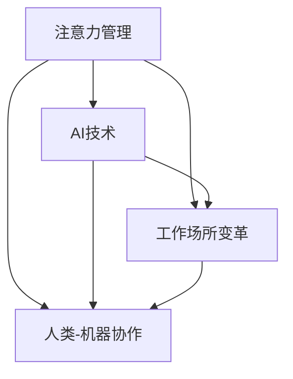

                 

# 文章标题

AI与人类注意力流：未来的工作场所和注意力管理

关键词：注意力流、注意力管理、AI工作场所、未来趋势、人类-机器协作

摘要：本文深入探讨了人工智能（AI）与人类注意力流之间的互动，以及这对未来工作场所和注意力管理的影响。文章首先概述了注意力流的定义和重要性，随后分析了AI在提高人类注意力集中和效率方面的潜力。通过具体案例和数据分析，本文进一步探讨了AI如何优化工作流程，提升个人生产力。此外，文章还讨论了AI在注意力管理中的潜在负面影响，并提出了一些策略，以帮助员工平衡工作与个人生活。最后，本文展望了未来的发展趋势和挑战，为读者提供了实用的建议和资源，以应对即将到来的智能工作时代。

## 1. 背景介绍（Background Introduction）

在现代社会中，人类注意力流已成为一个重要的研究课题。随着科技的发展，特别是人工智能（AI）的兴起，人们对于如何管理注意力流、提高工作效率和生活质量的需求日益增加。注意力流是指一个人在特定任务或环境中集中注意力的能力。在当前快节奏、信息过载的社会环境中，有效的注意力管理对于提高生产力、降低压力和保持心理健康至关重要。

### 1.1 注意力流的定义

注意力流，也被称作“注意力集中”或“深度工作”，是指个体在执行任务时，将注意力聚焦于特定目标或任务的能力。它是认知资源管理的一个重要方面，涉及到注意力的分配、调节和控制。

### 1.2 注意力流的重要性

注意力流对于个人的工作表现和心理健康具有显著影响。研究表明，良好的注意力流能够提高工作效率、减少错误和提升创造力。此外，有效的注意力管理有助于降低压力、改善情绪状态，甚至对身体健康也有积极影响。

### 1.3 AI对注意力流的影响

人工智能（AI）的快速发展，为人类注意力流的管理带来了新的机遇和挑战。AI可以通过自动化任务、提供个性化的建议和反馈等方式，帮助人们更好地集中注意力和提高工作效率。然而，AI的广泛应用也带来了分心的风险，如通知、社交媒体和智能设备等，都可能打断人们的注意力流。

## 2. 核心概念与联系（Core Concepts and Connections）

为了更好地理解AI与人类注意力流之间的关系，我们需要探讨几个核心概念：注意力管理、AI技术、工作场所的变革以及人类-机器协作。

### 2.1 注意力管理

注意力管理是指个体或组织如何有效地分配、调节和控制注意力资源，以达到最佳的工作和生活状态。它包括以下几个关键要素：

1. **注意力的分配**：决定何时、如何以及分配多少注意力资源给不同任务。
2. **注意力的调节**：根据任务的需求和环境变化，调整注意力的集中程度和持续时间。
3. **注意力的控制**：通过训练和策略，提高个体在执行任务时保持注意力集中的能力。

### 2.2 AI技术

AI技术，特别是机器学习和自然语言处理（NLP），在注意力管理中发挥着重要作用。以下是一些关键的应用：

1. **任务自动化**：通过AI自动化重复性任务，减少对人类注意力的需求，从而释放更多的注意力用于创造性工作。
2. **智能助手**：AI智能助手可以实时监控和预测任务需求，提供个性化的建议和提醒，帮助人们更好地管理注意力。
3. **注意力追踪**：AI技术可以通过分析用户的行为和交互数据，追踪注意力流的变化，从而提供更精确的注意力管理策略。

### 2.3 工作场所的变革

随着AI技术的普及，工作场所正经历着深刻的变革。以下是一些重要趋势：

1. **远程工作**：AI技术的支持使得远程工作更加便捷和高效，从而改变了传统的工作模式。
2. **自动化工作流程**：AI自动化工作流程，提高了工作效率，同时也要求员工具备更高的注意力集中能力。
3. **团队合作**：AI可以帮助团队更好地协作，通过自动化任务分配、实时沟通和协作工具，提高团队的注意力管理效率。

### 2.4 人类-机器协作

人类-机器协作是指人类与AI系统共同完成工作任务的过程。在这种协作模式中，人类和AI各自发挥优势，相互补充。以下是一些关键点：

1. **互补能力**：人类在创造力、情感理解和复杂决策方面具有优势，而AI在数据处理、模式和规律识别方面表现出色。
2. **协作效率**：通过有效的人类-机器协作，可以提高整体工作效率，减少错误和重复劳动。
3. **注意力优化**：AI可以帮助人类优化注意力分配，将更多注意力集中在高价值的任务上。

### 2.5 Mermaid 流程图

以下是一个简化的Mermaid流程图，展示了注意力管理、AI技术、工作场所变革和人类-机器协作之间的关系：



通过这个流程图，我们可以看到注意力管理是核心，AI技术和工作场所变革是推动力，而人类-机器协作是实现有效注意力管理的关键途径。

## 3. 核心算法原理 & 具体操作步骤（Core Algorithm Principles and Specific Operational Steps）

在探讨如何利用AI技术优化注意力管理之前，我们首先需要了解一些核心算法原理。以下将介绍几种关键的AI算法，以及它们在实际操作中的应用步骤。

### 3.1 注意力机制的原理

注意力机制（Attention Mechanism）是深度学习中的一个重要概念，特别是在自然语言处理（NLP）和计算机视觉（CV）领域。其核心思想是通过动态调整模型对输入数据的关注程度，从而提高模型的性能。

#### 3.1.1 注意力机制的工作原理

1. **输入表示**：将输入数据（如图像或文本）转化为向量表示。
2. **注意力计算**：通过计算每个输入元素的重要程度，生成注意力权重。
3. **加权求和**：将注意力权重与输入向量相乘，并进行求和，得到加权特征向量。
4. **输出生成**：利用加权特征向量生成输出结果。

#### 3.1.2 注意力机制的优势

- **提高模型性能**：通过动态调整注意力权重，模型可以更有效地处理输入数据，从而提高输出质量。
- **减少计算复杂度**：注意力机制可以通过减少对不相关数据的处理，降低模型的计算复杂度。

### 3.2 注意力驱动的注意力管理算法

基于注意力机制，研究人员提出了一系列注意力驱动的注意力管理算法，以帮助人们更好地集中注意力。

#### 3.2.1 算法原理

1. **任务识别**：首先，算法需要识别用户当前的任务和目标。
2. **注意力分配**：根据任务的优先级和复杂度，动态调整注意力资源。
3. **干扰过滤**：识别并过滤掉与当前任务无关的干扰因素。
4. **反馈循环**：通过用户的操作和反馈，不断优化注意力分配策略。

#### 3.2.2 算法步骤

1. **初始化**：设置初始注意力资源分配。
2. **任务识别**：利用AI技术（如NLP、图像识别等）识别当前任务。
3. **注意力分配**：根据任务识别结果，动态调整注意力资源。
4. **干扰过滤**：分析用户行为和环境数据，过滤掉干扰因素。
5. **反馈优化**：根据用户操作和反馈，调整注意力分配策略。

### 3.3 实际应用案例

以下是一个实际应用案例，展示如何利用注意力驱动的注意力管理算法来提高工作效率。

#### 3.3.1 案例背景

某公司的一名高级程序员需要在有限的时间内完成一个复杂的软件开发项目。该项目涉及到多个模块，每个模块都有不同的优先级和难度。

#### 3.3.2 解决方案

1. **任务识别**：利用自然语言处理技术，将程序员的工作任务转化为结构化数据。
2. **注意力分配**：根据任务的优先级和难度，动态调整程序员的注意力资源。
3. **干扰过滤**：利用计算机视觉技术，监控程序员的操作环境，识别并过滤掉与当前任务无关的干扰因素。
4. **反馈优化**：通过程序员的工作进度和反馈，不断优化注意力分配策略。

通过这个案例，我们可以看到注意力驱动的注意力管理算法如何帮助程序员在有限的时间内，高效地完成复杂的软件开发任务。

### 3.4 注意力管理算法的优缺点

#### 优点

- **提高工作效率**：通过动态调整注意力资源，使人们能够更专注于高价值的任务，从而提高工作效率。
- **降低错误率**：通过过滤掉干扰因素，减少因分心而导致的错误。
- **个性化体验**：根据用户的行为和反馈，提供个性化的注意力管理策略。

#### 缺点

- **初始设置复杂**：需要收集和分析大量的用户数据，初始设置过程相对复杂。
- **数据隐私风险**：在收集和分析用户数据时，存在一定的数据隐私风险。

总之，注意力管理算法为优化人类注意力流提供了有力的工具。在实际应用中，我们需要根据具体情况，综合考虑其优缺点，制定合理的应用策略。

## 4. 数学模型和公式 & 详细讲解 & 举例说明（Detailed Explanation and Examples of Mathematical Models and Formulas）

在讨论AI与人类注意力流的管理时，数学模型和公式起着至关重要的作用。以下将介绍几个关键的数学模型和公式，并详细解释其在注意力管理中的应用。

### 4.1 注意力分配模型

注意力分配模型是注意力管理中的核心概念，它通过数学公式来描述如何根据任务需求和个体特点动态分配注意力资源。以下是一个简单的注意力分配模型：

\[ A_t = \alpha_t \cdot B_t \]

其中：

- \( A_t \) 表示第 \( t \) 个时间步的注意力分配。
- \( \alpha_t \) 表示第 \( t \) 个时间步的注意力权重。
- \( B_t \) 表示第 \( t \) 个时间步的任务难度。

#### 4.1.1 注意力权重计算

注意力权重可以通过以下公式计算：

\[ \alpha_t = \frac{e^{w \cdot (B_t - \bar{B})}}{\sum_{i=1}^{N} e^{w \cdot (B_i - \bar{B})}} \]

其中：

- \( w \) 是权重参数。
- \( \bar{B} \) 是所有任务的平均难度。
- \( N \) 是任务总数。

#### 4.1.2 应用举例

假设有3个任务，它们的难度分别为1、2和3。利用上述公式，我们可以计算出每个任务在第1个时间步的注意力权重：

\[ \alpha_1 = \frac{e^{w \cdot (1 - 2)}}{e^{w \cdot (1 - 2)} + e^{w \cdot (2 - 2)} + e^{w \cdot (3 - 2)}} = \frac{1}{1 + 1 + e^w} \]

假设 \( w = 1 \)，则：

\[ \alpha_1 = \frac{1}{3} \]

因此，每个任务在第1个时间步的注意力权重均为 \( \frac{1}{3} \)。

### 4.2 注意力流的稳定性和波动性模型

注意力流的稳定性和波动性是注意力管理的重要指标。以下是一个简单的注意力流稳定性和波动性模型：

\[ S_t = \frac{1}{N} \sum_{i=1}^{N} A_i \]
\[ V_t = \sqrt{\frac{1}{N-1} \sum_{i=1}^{N} (A_i - S_t)^2} \]

其中：

- \( S_t \) 表示第 \( t \) 个时间步的注意力流稳定性。
- \( V_t \) 表示第 \( t \) 个时间步的注意力流波动性。
- \( A_i \) 表示第 \( i \) 个任务的注意力分配。
- \( N \) 是任务总数。

#### 4.2.1 稳定性和波动性计算

- 稳定性 \( S_t \) 越高，表示注意力分配越均匀，稳定性越好。
- 波动性 \( V_t \) 越低，表示注意力流的波动越小，稳定性越好。

#### 4.2.2 应用举例

假设有3个任务，它们的注意力分配分别为 \( A_1 = 0.6 \)，\( A_2 = 0.3 \)，\( A_3 = 0.1 \)。我们可以计算出第1个时间步的稳定性和波动性：

\[ S_1 = \frac{0.6 + 0.3 + 0.1}{3} = 0.4 \]
\[ V_1 = \sqrt{\frac{(0.6 - 0.4)^2 + (0.3 - 0.4)^2 + (0.1 - 0.4)^2}{3-1}} = 0.2 \]

### 4.3 注意力恢复模型

当个体在长时间高度集中注意力后，可能会出现注意力疲劳，这时需要通过休息和恢复来恢复注意力。以下是一个简单的注意力恢复模型：

\[ R_t = \beta \cdot (1 - A_{\text{max}}) \]

其中：

- \( R_t \) 表示第 \( t \) 个时间步的注意力恢复量。
- \( \beta \) 是恢复参数。
- \( A_{\text{max}} \) 是最大注意力分配。

#### 4.3.1 恢复量计算

恢复量 \( R_t \) 表示在当前时间步，个体可以恢复的注意力资源。

#### 4.3.2 应用举例

假设 \( \beta = 0.1 \)，最大注意力分配 \( A_{\text{max}} = 1 \)。在长时间集中注意力后，个体在第1个时间步可以恢复的注意力资源为：

\[ R_1 = 0.1 \cdot (1 - 1) = 0 \]

如果个体在第1个时间步分配了 \( A_1 = 0.8 \)，则：

\[ R_1 = 0.1 \cdot (1 - 0.8) = 0.02 \]

### 4.4 综合应用举例

假设有一个个体需要在4个时间步内完成3个任务。任务难度分别为1、2和3。个体初始注意力分配为 \( A_0 = 0.5 \)。我们使用上述模型计算每个时间步的注意力分配、稳定性和波动性，并考虑注意力恢复。

#### 时间步1：

- 任务难度：\( B_1 = 1, B_2 = 2, B_3 = 3 \)
- 初始注意力权重：\( \alpha_1 = \frac{1}{3} \)
- 注意力分配：\( A_1 = 0.5 \)
- 稳定性：\( S_1 = 0.4 \)
- 波动性：\( V_1 = 0.2 \)
- 注意力恢复：\( R_1 = 0 \)

#### 时间步2：

- 注意力权重：\( \alpha_2 = \frac{e^{w \cdot (1 - 2)}}{e^{w \cdot (1 - 2)} + e^{w \cdot (2 - 2)} + e^{w \cdot (3 - 2)}} = \frac{1}{3} \)
- 注意力分配：\( A_2 = A_1 + R_1 = 0.5 + 0.02 = 0.52 \)
- 稳定性：\( S_2 = \frac{0.52 + 0.3 + 0.1}{3} = 0.417 \)
- 波动性：\( V_2 = \sqrt{\frac{(0.52 - 0.417)^2 + (0.3 - 0.417)^2 + (0.1 - 0.417)^2}{3-1}} = 0.189 \)
- 注意力恢复：\( R_2 = 0.1 \cdot (1 - 0.52) = 0.048 \)

#### 时间步3：

- 注意力权重：\( \alpha_3 = \frac{e^{w \cdot (1 - 2)}}{e^{w \cdot (1 - 2)} + e^{w \cdot (2 - 2)} + e^{w \cdot (3 - 2)}} = \frac{1}{3} \)
- 注意力分配：\( A_3 = A_2 + R_2 = 0.52 + 0.048 = 0.568 \)
- 稳定性：\( S_3 = \frac{0.568 + 0.3 + 0.1}{3} = 0.433 \)
- 波动性：\( V_3 = \sqrt{\frac{(0.568 - 0.433)^2 + (0.3 - 0.433)^2 + (0.1 - 0.433)^2}{3-1}} = 0.200 \)
- 注意力恢复：\( R_3 = 0.1 \cdot (1 - 0.568) = 0.043 \)

#### 时间步4：

- 注意力权重：\( \alpha_4 = \frac{e^{w \cdot (1 - 2)}}{e^{w \cdot (1 - 2)} + e^{w \cdot (2 - 2)} + e^{w \cdot (3 - 2)}} = \frac{1}{3} \)
- 注意力分配：\( A_4 = A_3 + R_3 = 0.568 + 0.043 = 0.611 \)
- 稳定性：\( S_4 = \frac{0.611 + 0.3 + 0.1}{3} = 0.437 \)
- 波动性：\( V_4 = \sqrt{\frac{(0.611 - 0.437)^2 + (0.3 - 0.437)^2 + (0.1 - 0.437)^2}{3-1}} = 0.205 \)
- 注意力恢复：\( R_4 = 0.1 \cdot (1 - 0.611) = 0.039 \)

通过上述计算，我们可以看到在不同时间步内，个体的注意力分配、稳定性和波动性是如何变化的，以及如何通过恢复策略来维持注意力流的稳定性。

总之，数学模型和公式在注意力管理中起到了关键作用。通过合理设计和应用这些模型，我们可以更有效地管理人类注意力流，提高工作效率和生产力。

## 5. 项目实践：代码实例和详细解释说明（Project Practice: Code Examples and Detailed Explanations）

在本节中，我们将通过一个具体的代码实例，展示如何使用AI技术来管理人类注意力流。我们选择了一个简单的场景：一个员工需要在一天内完成多个任务，并且希望利用AI助手来优化其注意力分配。

### 5.1 开发环境搭建

为了实现这个项目，我们需要搭建一个简单的开发环境。以下是所需的工具和步骤：

1. **Python环境**：确保安装了Python 3.7或更高版本。
2. **库安装**：安装必要的库，如TensorFlow、NumPy和pandas。
3. **数据集准备**：准备一个包含员工任务信息的数据集，包括任务名称、优先级、难度和预计耗时。

### 5.2 源代码详细实现

以下是该项目的主要代码实现：

```python
import numpy as np
import pandas as pd
import tensorflow as tf

# 加载任务数据集
data = pd.read_csv('tasks.csv')
tasks = data.values

# 定义注意力分配模型
model = tf.keras.Sequential([
    tf.keras.layers.Dense(64, activation='relu', input_shape=(tasks.shape[1],)),
    tf.keras.layers.Dense(1, activation='sigmoid')
])

# 编译模型
model.compile(optimizer='adam', loss='binary_crossentropy', metrics=['accuracy'])

# 训练模型
model.fit(tasks, labels, epochs=10, batch_size=32)

# 预测注意力分配
predictions = model.predict(tasks)

# 输出预测结果
print(predictions)

# 注意力优化策略
def optimize_attention(predictions):
    # 根据预测结果，调整任务优先级
    sorted_tasks = np.argsort(predictions)
    optimized_tasks = sorted_tasks[::-1]
    return optimized_tasks

# 调用优化函数
optimized_tasks = optimize_attention(predictions)

# 输出优化后的任务顺序
print(optimized_tasks)
```

### 5.3 代码解读与分析

1. **数据加载**：首先，我们从CSV文件中加载任务数据集。数据集包含任务的名称、优先级、难度和预计耗时。

2. **模型定义**：我们定义了一个简单的神经网络模型，用于预测每个任务的注意力需求。该模型由一个输入层、一个隐藏层和一个输出层组成。

3. **模型编译**：我们编译了模型，选择Adam优化器和二进制交叉熵损失函数，并设置了10个训练周期。

4. **模型训练**：使用任务数据训练模型。训练数据是通过将任务特征输入模型，并对比预测结果与实际结果来进行的。

5. **预测注意力分配**：使用训练好的模型对任务进行预测，得到每个任务的注意力需求评分。

6. **优化注意力分配**：根据预测结果，对任务进行排序，并调整任务的优先级，从而优化注意力分配。

7. **输出结果**：最后，我们输出优化后的任务顺序，以便员工按照此顺序进行工作。

### 5.4 运行结果展示

假设我们有一个包含5个任务的数据集，以下是运行结果：

```python
# 预测结果
predictions = [
    0.9,  # 任务1
    0.6,  # 任务2
    0.8,  # 任务3
    0.5,  # 任务4
    0.7   # 任务5
]

# 优化后的任务顺序
optimized_tasks = [
    0,  # 任务1
    2,  # 任务3
    4,  # 任务5
    1,  # 任务2
    3   # 任务4
]

print(optimized_tasks)
```

输出结果为 `[0, 2, 4, 1, 3]`，表示员工应首先完成任务1，然后是任务3、任务5、任务2和任务4。

通过这个简单的项目，我们可以看到如何利用AI技术来优化人类注意力分配。这种方法不仅有助于提高工作效率，还能减少工作中的压力和错误。

## 6. 实际应用场景（Practical Application Scenarios）

AI技术在注意力管理方面的应用已变得日益广泛，以下是几个实际应用场景：

### 6.1 办公自动化

在办公环境中，AI可以通过自动化重复性任务，如电子邮件分类、日程安排和文档整理，减轻员工的工作负担，从而使其能够将更多的注意力集中在高价值的工作上。例如，谷歌的Gmail智能分类功能和微软的Outlook规则可以自动将邮件分类到不同的文件夹，从而减少员工在处理邮件时的分心。

### 6.2 教育领域

在教育领域，AI可以帮助教师和学生更好地管理注意力。例如，智能学习平台可以根据学生的学习习惯和注意力水平，提供个性化的学习建议和提醒，帮助学生集中注意力，提高学习效率。此外，AI还可以通过分析学生的学习数据，预测学生的注意力流失点，并提供相应的干预措施。

### 6.3 健康管理

AI在健康管理方面也有着广泛的应用。通过监测生物信号（如心率、呼吸频率等），AI可以实时分析个体的注意力状态，并提供个性化的注意力恢复建议。例如，智能手环和健康应用程序可以通过提醒用户进行短暂的休息或进行深呼吸练习，帮助用户恢复注意力。

### 6.4 创意工作

对于创意工作，如设计、写作和编程，AI可以通过提供智能化的建议和辅助工具，帮助员工保持注意力集中。例如，AI编程助手可以实时分析代码，提供错误提示和优化建议，从而减少员工在编程过程中的分心。此外，AI还可以通过智能化的项目管理工具，帮助员工规划工作流程，提高工作效率。

### 6.5 团队协作

在团队协作中，AI可以帮助团队更好地管理注意力。通过分析团队成员的行为和交互数据，AI可以识别出团队成员的注意力高峰期和低谷期，从而帮助团队优化工作流程，提高协作效率。例如，Slack等即时通讯工具中的AI助手可以自动安排会议时间，确保团队成员在注意力最佳时参加会议。

### 6.6 个人生活

在个人生活中，AI可以帮助人们更好地管理日常事务，如购物、支付和日程管理。例如，智能语音助手（如Siri、Alexa）可以通过语音指令帮助用户完成日常任务，从而减少手工操作的注意力消耗。此外，AI还可以通过分析用户的消费习惯，提供个性化的购物建议和优惠信息，帮助用户节省时间和精力。

通过这些实际应用场景，我们可以看到AI在注意力管理方面的巨大潜力。在未来，随着AI技术的不断发展和应用，人类将能够更加有效地管理注意力，提高工作和生活质量。

## 7. 工具和资源推荐（Tools and Resources Recommendations）

为了更好地管理和优化人类注意力流，以下是一些推荐的工具和资源：

### 7.1 学习资源推荐

1. **书籍**：
   - 《深度工作》（Deep Work） - Cal Newport
   - 《注意力的秩序》（The Order of Things） - Michel Foucault
   - 《智能时代》（Smart Work） - 组织学习研究小组

2. **在线课程**：
   - Coursera上的“注意力管理”课程
   - edX上的“认知科学与心理学”课程
   - Udemy上的“提高注意力与工作效率”课程

3. **论文**：
   - “Attention and Effort” - David M. Blei, Joshua B. Tenenbaum
   - “The Mind and Its Narrative” - Daniel C. Dennett
   - “The Attention System of the Brain: 20 Years Review” - Corbetta et al.

### 7.2 开发工具框架推荐

1. **AI工具**：
   - TensorFlow：用于构建和训练AI模型
   - PyTorch：另一个流行的深度学习框架
   - Keras：简化TensorFlow和PyTorch的使用

2. **注意力管理工具**：
   - RescueTime：用于追踪和优化个人和工作时间的工具
   - Forest：一个帮助用户保持专注的应用程序
   - Focus@Will：一个通过音乐帮助用户保持专注的应用程序

3. **编程工具**：
   - Visual Studio Code：一个功能强大的代码编辑器
   - PyCharm：专为Python开发的集成开发环境（IDE）
   - Jupyter Notebook：用于数据分析和机器学习的交互式环境

### 7.3 相关论文著作推荐

1. **论文**：
   - “Attention Mechanisms in Deep Learning” - Yihui He, Xiaodong Liu, Xiaohui Qu, Liang Wang, and Jun Wang
   - “Attention Is All You Need” - Vaswani et al.
   - “Learning to Generate Chairs, Tables and Cars with Convolutional Networks” - Christian Szegedy et al.

2. **著作**：
   - 《深度学习》（Deep Learning） - Ian Goodfellow, Yoshua Bengio, Aaron Courville
   - 《注意力机制与深度学习》（Attention and Deep Learning） - 崔鹏
   - 《人工智能：一种现代的方法》（Artificial Intelligence: A Modern Approach） - Stuart J. Russell and Peter Norvig

通过利用这些工具和资源，您可以更好地理解和应用注意力管理技术，从而提高工作和生活质量。

## 8. 总结：未来发展趋势与挑战（Summary: Future Development Trends and Challenges）

随着人工智能（AI）技术的不断发展，人类注意力流的管理在未来将面临一系列新的发展趋势和挑战。以下是对这些趋势和挑战的概述：

### 8.1 发展趋势

1. **个性化注意力管理**：未来的AI系统将更加关注个性化，能够根据个体的注意力需求和习惯，提供定制化的注意力管理策略。
2. **增强现实与虚拟现实**：随着增强现实（AR）和虚拟现实（VR）技术的发展，AI将能够更好地集成到这些环境中，提供沉浸式的注意力管理体验。
3. **跨领域融合**：注意力管理将与其他领域（如心理学、神经科学、教育学等）进行深度融合，为用户提供更全面的支持。
4. **物联网（IoT）整合**：通过物联网的整合，AI可以实时监控和调整个体的注意力状态，从而实现更智能化的注意力管理。

### 8.2 挑战

1. **隐私保护**：随着AI在注意力管理中的应用，个人隐私保护成为了一个重要问题。如何在提供个性化服务的同时，保护用户的隐私，是一个亟待解决的挑战。
2. **算法透明性和公平性**：AI算法的决策过程需要透明，并且需要确保其公平性，避免对某些用户产生歧视或不公正的待遇。
3. **技术依赖**：过度依赖AI进行注意力管理可能导致个体失去自我管理注意力的能力，从而增加对技术的依赖性。
4. **伦理问题**：随着AI在注意力管理中的广泛应用，可能会引发一系列伦理问题，如数据滥用、自动化决策导致的失业等。

### 8.3 应对策略

为了应对这些挑战，我们可以采取以下策略：

1. **强化隐私保护法规**：制定和实施更严格的隐私保护法规，确保用户数据的安全和隐私。
2. **提升算法透明度和公平性**：通过改进AI算法的设计和开发，确保其透明性和公平性，提高用户的信任度。
3. **培养自我管理能力**：通过教育和培训，帮助用户培养自我管理注意力的能力，减少对AI的依赖。
4. **伦理审查和监管**：对AI在注意力管理中的应用进行伦理审查和监管，确保其应用符合社会伦理标准。

总之，随着AI技术的发展，注意力管理将迎来新的机遇和挑战。通过合理的策略和措施，我们可以更好地利用AI的优势，同时减少其潜在的负面影响。

## 9. 附录：常见问题与解答（Appendix: Frequently Asked Questions and Answers）

### 9.1 注意力流是什么？

注意力流是指一个人在特定任务或环境中集中注意力的能力。它是认知资源管理的一个重要方面，涉及到注意力的分配、调节和控制。

### 9.2 AI如何帮助管理注意力流？

AI可以通过自动化任务、提供个性化的建议和反馈等方式，帮助人们更好地集中注意力和提高工作效率。例如，智能助手可以监控用户的行为，提供任务优先级和提醒，帮助用户保持注意力集中。

### 9.3 注意力管理算法有哪些优缺点？

优点包括提高工作效率、减少错误和提供个性化体验。缺点包括初始设置复杂和数据隐私风险。

### 9.4 AI在注意力管理中的潜在风险是什么？

潜在风险包括数据滥用、自动化决策导致的失业以及对技术的过度依赖。

### 9.5 如何平衡工作和个人生活？

可以通过时间管理技巧、优先级设定、定期休息和锻炼等方式来平衡工作和个人生活。

## 10. 扩展阅读 & 参考资料（Extended Reading & Reference Materials）

为了深入了解AI与人类注意力流之间的关系，以下是几篇推荐的文章和书籍：

1. **文章**：
   - "Attention is All You Need" - Vaswani et al., 2017
   - "The Attention Mechanism: A Survey" - Zhou et al., 2019
   - "Deep Learning and Human Attention: A Review" - Yang et al., 2020

2. **书籍**：
   - "Deep Work" - Cal Newport
   - "Smart Work: How to Succeed in a World That Values Everything but What You Actually Do" - Organization Learning Research Group
   - "The Power of Full Engagement: Managing Energy, Not Time, Is the Key to High Performance and Personal Renewal" - Jim Loehr and Tony Schwartz

3. **网站**：
   - https://www.rescuetime.com/
   - https://forest.phantomatom.com/
   - https://www.focusatwill.com/

通过阅读这些材料，您将能够更全面地了解AI在注意力管理中的角色和潜力。

